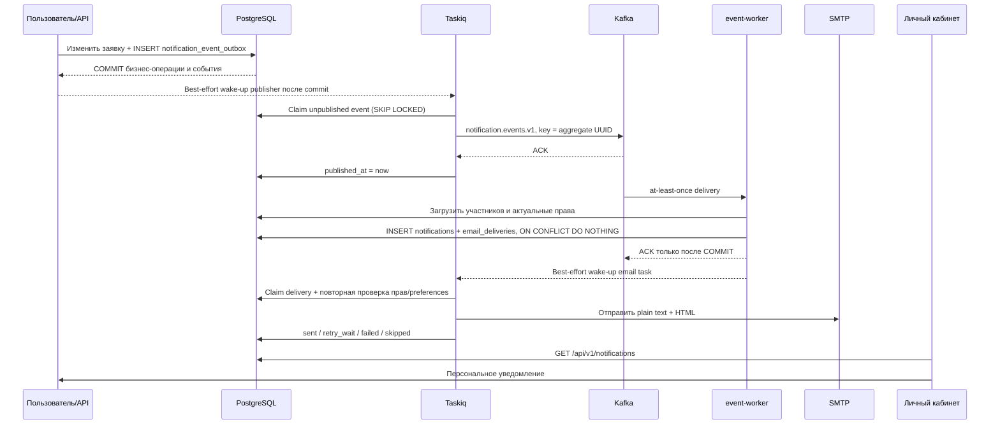

# Решение по ТЗ №35

- **Статус:** MR !360 открыт в `test`; согласованный schema drift исправлен и проверен локально (раздел 19). Объединение ожидает обязательного человеческого approval; удалённый deployment не подтверждён.
- **Основание:** «Техническое задание №35. Реализация уведомлений по заявкам в ЛК и на email» от 28.07.2026
- **Ветка:** `feature/spec-35-notifications`
- **MR:** [!360 — Решение по ТЗ №35](https://gitlab.carcraft.ru/carcraft/carcraft-leadgenerator/-/merge_requests/360), целевая ветка `test`

## 1. Цель и бизнес-результат

Реализовать единый надёжный механизм персональных уведомлений о событиях по:

- заявкам на лизинг;
- заявкам Биржи;
- ставкам дилеров;
- бронированию и отмене автомобилей;
- предложениям и решениям лизинговых компаний;
- запросам и загрузке документов;
- изменению параметров, статусов и сроков.

По каждому событию система должна:

1. Зафиксировать событие вместе с бизнес-изменением без риска потери.
2. Асинхронно определить компании-участники и конкретных пользователей-получателей.
3. Для каждого пользователя заново проверить актуальное право просмотра объекта.
4. Идемпотентно создать персональную запись в существующей таблице `notifications`.
5. С учётом email-настроек пользователя поставить письмо в надёжную очередь.
6. Повторять временно неуспешную отправку и хранить итоговый результат доставки.

Сбой Kafka, Redis/Taskiq или SMTP не должен приводить к потере уже зафиксированного бизнес-события. Сбой email не должен удалять уведомление из личного кабинета.

## 2. Подтверждённое текущее состояние

Ниже — исходное состояние до реализации. База реализации синхронизирована командой `git pull --ff-only origin test`, commit `94002936`; исходный Alembic head — `110`, новая миграция — `111`.

- Таблица `notifications` уже содержит `data JSONB`, но текущие repository, domain entity и API-схемы это поле не записывают и не возвращают.
- У `notifications` нет отдельного `event_id` и ограничения уникальности `(event_id, user_id)`, поэтому повторная обработка события не защищена на уровне PostgreSQL.
- Ручной `POST /api/v1/notifications` создаёт только одну запись в рамках HTTP-транзакции. Это административный inbox API, а не общий событийный механизм.
- Единственный прикладной сценарий «решение ЛК» после commit запускает `asyncio.create_task`, открывает отдельную DB-сессию и напрямую вызывает SMTP. При остановке API-процесса такое уведомление или письмо может потеряться; повторная отправка и итоговый статус отсутствуют.
- Kafka используется для auth/status/DWH-событий. Большинство текущих status/DWH publisher-ов также запускаются через `asyncio.create_task`, проглатывают ошибку публикации и не подходят как гарантированный источник обязательных уведомлений.
- В `event-worker` нет consumer-а бизнес-уведомлений, создающего записи `notifications`.
- Taskiq использует Redis и уже исполняет фоновые и периодические задачи, но notification/email-задач в нём нет.
- Для истории статусов LCA уже применён рабочий образец transactional outbox: строка создаётся в бизнес-транзакции, а Taskiq publisher позднее отправляет её в Kafka с повторными попытками. Новый механизм должен обобщить этот принцип, а не копировать fire-and-forget путь.
- `email_preferences` содержит категорийные флаги и `email_frequency`, но отправка по событиям их сейчас не применяет. Отдельной настройки для Биржи нет.
- PostgreSQL enum `notification_type` содержит часть exchange-типов, а backend API и frontend знают только пять базовых типов. Контракты расходятся.
- У заявки на лизинг отображаемый номер хранится в `leasing_applications.display_number`, а не в поле `request_number` из ТЗ.
- У заявки Биржи нет поля `request_number`: текущий UI показывает `{batch_number}-{batch_index}`, а для старых строк без этих полей — UUID.
- У Биржи срок хранится как `expiration_date DATE`. Этого недостаточно для однозначного `expiration_at` и уведомления за один час до окончания.

## 3. Архитектурное решение

### 3.1. Разделение ответственности

| Компонент | Ответственность |
|---|---|
| PostgreSQL | Бизнес-данные, transactional outbox, персональный inbox в `notifications`, состояние email-доставки и идемпотентность |
| Kafka | Передача фактов о событиях между API/Taskiq publisher и notification consumer; независимое масштабирование consumer group |
| `event-worker` | Потребление notification events, определение получателей и атомарное создание inbox/email-delivery записей |
| Taskiq | Публикация outbox в Kafka, немедленная и отложенная email-доставка, повторные попытки, recovery sweep и напоминания по срокам |
| FastAPI | Бизнес-операция, запись события в outbox в той же транзакции, чтение inbox и изменение `is_read` |
| Nuxt | Показ существующего inbox, счётчика, фильтров и переход по персональному `action_url` |

Итоговый ответ на архитектурный вопрос: **события уведомлений передаются через Kafka; Taskiq не заменяет event bus и используется для надёжного выполнения фоновой работы, расписания и повторов**.

### 3.2. Целевой flow



Немедленный Taskiq wake-up ускоряет доставку, но не является условием корректности. Периодические recovery-задачи подбирают все непубликованные outbox-события и все незавершённые email-delivery строки, если enqueue не удался или worker остановился.

### 3.3. Гарантии

- Бизнес-изменение и outbox-событие записываются одной PostgreSQL-транзакцией. Если обязательное событие не записалось, бизнес-транзакция не фиксируется.
- Публикация Kafka имеет семантику at-least-once. Outbox помечается опубликованным только после broker ACK.
- Kafka offset подтверждается только после commit персональных уведомлений и delivery-строк.
- Повтор Kafka-сообщения не создаёт новый inbox или новое письмо благодаря ограничениям уникальности в БД.
- Порядок событий одного агрегата обеспечивается совместно: транзакционный advisory lock при добавлении outbox, монотонный `sequence`, публикация только самого раннего неопубликованного события агрегата и Kafka key. Один key без упорядоченного publisher недостаточен. Для лизинга агрегат — `leasing_application.id`, для Биржи — `exchange_request.id`.
- Внешний SMTP не поддерживает транзакцию с PostgreSQL. Поэтому гарантируется отсутствие дублей при обычном replay одного `event_id`, но остаётся узкое окно: SMTP мог принять письмо, а worker завершиться до записи `sent`. Для снижения риска письмо получает детерминированный `Message-ID`, однако абсолютный exactly-once возможен только с почтовым провайдером, поддерживающим idempotency key. В этом редком окне выбирается at-least-once доставка, то есть возможен повтор, но не молчаливая потеря письма.

## 4. Контракт события

Создать версионированный Kafka topic `notification.events.v1`. Не использовать DWH-топики `*.changed.v1` как источник пользовательских уведомлений: они содержат снапшоты для аналитики, не покрывают все бизнес-события и сейчас публикуются без outbox-гарантии.

Каждое сообщение проходит строгую Pydantic-валидацию и содержит:

```json
{
  "schema_version": 1,
  "event_id": "uuid",
  "event_type": "leasing.application_created",
  "occurred_at": "timezone-aware ISO-8601",
  "actor_user_id": "uuid-or-null",
  "entity_type": "leasing_application",
  "entity_id": "uuid",
  "aggregate_id": "uuid",
  "application_id": "uuid-or-null",
  "request_number": "display value",
  "changed_fields": ["status"],
  "previous_values": {"status": "active"},
  "new_values": {"status": "rejected"},
  "payload": {},
  "occurrence_key": "optional stable key for scheduled events"
}
```

Правила контракта:

- `event_id`, `entity_id`, `aggregate_id`, `application_id` и все идентификаторы в payload — UUID; в JSON они сериализуются как непрозрачные строки.
- `event_type` — стабильный бизнес-тип события, а не текст для интерфейса.
- `changed_fields` содержит только реально изменённые поля в snake_case.
- Деньги сериализуются десятичными строками, даты — timezone-aware ISO-8601.
- В событие не помещается готовый список `user_id`: consumer определяет получателей по актуальным данным и правам.
- В payload допускаются идентификаторы компаний-участников и данные, необходимые для шаблона, но consumer не доверяет им как доказательству доступа.
- `request_number` для лизинга берётся из `display_number`. Для Биржи он формируется сервером как `{batch_number}-{batch_index}`; для legacy-строк без batch-пары используется полный UUID как отображаемая ссылка на заявку.
- Событие валидируется до INSERT в outbox. Невалидное входящее Kafka-сообщение помещается в `notification.events.dlq.v1` с причиной и correlation id, чтобы poison message не блокировал consumer group.

## 5. Хранение и миграции

### 5.1. Существующая таблица `notifications`

Новую таблицу пользовательских уведомлений не создавать. Сохранить `notifications` как единственный inbox и расширить её:

- добавить nullable `event_id UUID` для совместимости с историческими и ручными уведомлениями;
- добавить partial unique index `(event_id, user_id) WHERE event_id IS NOT NULL`;
- начать записывать и возвращать существующее поле `data JSONB`;
- для автоматических уведомлений всегда задавать конкретный ненулевой `user_id` и `event_id`;
- `is_read=false`, `read_at=NULL` при создании;
- добавить `deleted_at`: DELETE скрывает запись из list/count/get/read, но сохраняет техническую идентичность для replay и незавершённой email-доставки;
- `application_id` содержит UUID `leasing_applications` только для лизингового сценария; для Биржи всегда `NULL`;
- `action_url` хранит внутренний относительный frontend route, сформированный отдельно для роли получателя;
- точный `event_type` и обязательные данные из ТЗ сохраняются в `data`.

`data` для лизинга:

- `entity_type=leasing_application`;
- `entity_id`;
- `event_id`;
- `request_number`;
- `changed_fields`;
- `previous_values`;
- `new_values`.

`data` для Биржи:

- `entity_type=exchange_request` или `exchange_bid`;
- те же общие поля;
- `expiration_at`;
- `remaining_time` как отображаемое значение на момент события и `remaining_seconds` для машинной обработки.

В `data`, title и message нельзя раскрывать поля, которые роль получателя не видит в целевом экране. В частности, уведомление конкурентному дилеру не раскрывает компанию автора ставки, закрытые условия КП и другие анонимизированные данные.

### 5.2. Технический outbox

Добавить `notification_event_outbox`. Это не вторая таблица уведомлений, а журнал гарантированной доставки событий:

- `event_id UUID PRIMARY KEY`;
- `sequence BIGINT GENERATED BY DEFAULT AS IDENTITY UNIQUE` и nullable unique `occurrence_key`;
- `event_type`, `entity_type`, `entity_id`, `aggregate_id`;
- `payload JSONB` с валидированным wire contract;
- `occurred_at`, `created_at`;
- `published_at NULL`;
- `publish_attempts`;
- `next_attempt_at`;
- `last_publish_error` с ограниченной длиной и без секретов/персональных данных.

Publisher выбирает due-строки через `FOR UPDATE SKIP LOCKED`, повторяет публикацию бесконечно с ограниченным exponential backoff и не удаляет опубликованные строки сразу. Retention обычных опубликованных строк — 30 дней по умолчанию. Строки с `occurrence_key` сохраняются как tombstone, чтобы очистка не возродила напоминание/назначение. Отдельная техническая `notification_event_receipts` сохраняет принятый `event_id` и валидированный payload, включая события без получателей; receipt, inbox и email intents фиксируются одной транзакцией. Это предотвращает повторную материализацию после удаления inbox или изменения состава участников.

### 5.3. Состояние email-доставки

Добавить `notification_email_deliveries`. Это журнал канала доставки, а не inbox:

- `id UUID PRIMARY KEY`;
- `notification_id UUID NOT NULL REFERENCES notifications(id)`;
- `event_id UUID NOT NULL`;
- `user_id UUID NOT NULL`;
- `status`: `pending`, `processing`, `retry_wait`, `sent`, `failed`, `skipped_no_email`, `skipped_preference`, `skipped_access_revoked`, `skipped_stale`;
- `delivery_mode`: `immediate`, `daily`, `weekly`;
- `attempt_count`, `next_attempt_at`, `processing_started_at`;
- `sent_at`, `failed_at`, `last_error`;
- `message_id` для детерминированного SMTP `Message-ID`;
- `created_at`, `updated_at`;
- unique `(event_id, user_id)`.

Email-адрес не копируется в outbox. Перед фактической отправкой задача читает актуальный `users.email`; это уменьшает хранение PII и учитывает изменение адреса до отправки.

Техническая `notification_email_batches` фиксирует неизменный состав первой попытки, `Message-ID`, attempt, lease token и lease deadline. Immediate batch содержит один intent, digest — до 100 (настраивается). Повтор не присоединяет новые события к старому Message-ID. Lease fencing не позволяет завершившемуся старому worker перезаписать результат нового. Настройки частоты, изменённые до первой SMTP-попытки, перепланируют intent, в том числе ещё не наступившие weekly/daily записи; после первой попытки состав/идентичность письма сохраняются.

### 5.4. Срок заявки Биржи

Для выполнения требования «за день / за час» заменить неоднозначный `expiration_date DATE` на канонический `expiration_at TIMESTAMPTZ`:

- backend API принимает и возвращает timezone-aware datetime;
- PostgreSQL хранит UTC;
- frontend показывает локальные дату и время и отправляет значение с timezone offset;
- существующие `expiration_date` при миграции переводятся в конец выбранного дня, 23:59:59 `Europe/Moscow`, затем в UTC;
- старое поле и старые runtime-ветки чтения удаляются после миграции; одновременно обновляются schemas, repositories, domain entity, frontend types/forms, корзина Биржи и тесты. Исторический CSV import принимает legacy DATE как входной формат с явной конвертацией. Существующий DWH wire contract сохраняет DATE-проекцию; ClickHouse schema и consumers не меняются.

Поле бронирования автомобиля лизинговой заявки остаётся существующим DATE-контрактом; в notification event оно нормализуется в конец дня бизнес-таймзоны. Это отдельный срок, не `exchange_requests.expiration_at`.

Без этой миграции уведомление «за час» имеет несколько возможных трактовок и не может считаться выполненным корректно.

### 5.5. Компания-владелец заявки Биржи

Текущего `exchange_requests.lc_user_id` недостаточно для требования «уведомить пользователей лизинговой компании»: он хранит только автора и текущие LC query проверяют владение по одному пользователю.

- Добавить `lc_company_id UUID REFERENCES companies(id)` как каноническую компанию-владельца заявки Биржи.
- Сохранить `lc_user_id` как автора создания, но не как единственного читателя.
- При создании заявки фиксировать активную компанию из серверного auth context; не выводить её позднее из изменяемого `users.company_id`.
- Для исторических строк выполнить детерминированный backfill по компании автора. Строки без единственной доказуемой LC company зафиксировать в структурированном логе миграционной проверки и не назначать автоматически случайной компании.
- LC read access разрешать активным пользователям `lc_company_id` с актуальным правом просмотра; write access оставить за пользователями с соответствующим company permission.
- Distributor read access строить по `exchange_requests.distributor_id`, актуальным distributor-dealer links/dealer groups и объектным ограничениям.
- У ставки также фиксировать неизменный `dealer_company_id`: изменяемое членство автора не должно менять владельца и анонимизацию уже созданной ставки. Для неоднозначных legacy-строк применяется тот же консервативный backfill.

### 5.6. Email preferences

- Сохранить действующие `application_status_emails`, `document_request_emails`, `document_status_emails`, `leasing_approval_emails`.
- Добавить `exchange_emails` с default `true`, чтобы уведомления Биржи не маскировались под системные или маркетинговые.
- `marketing_emails` никогда не участвует в решении об операционном письме.
- `weekly_digest` остаётся отдельной продуктовой еженедельной сводкой и не заменяет `email_frequency`.
- `email_frequency=immediate` создаёт отдельное письмо сразу.
- `daily` и `weekly` группируют due-delivery записи одного пользователя в digest; каждый блок сохраняет данные и action link исходного события.
- Если к моменту digest событие потеряло актуальность или доступ отозван, соответствующая delivery-строка получает `skipped_stale` или `skipped_access_revoked` и не попадает в письмо.

## 6. Определение получателей и авторизация

### 6.1. Общий алгоритм

Для каждой компании, указанной политикой события:

1. Получить всех активных пользователей через объединение `user_companies` и legacy `users.company_id` без дублей.
2. Проверить `users.is_active=true`, `users.deleted_at IS NULL` и активность компании.
3. Проверить актуальную связь пользователя с компанией.
4. Загрузить свежие `sub_role`, `can_view_applications` и текущие ограничения роли.
5. Применить тот же access projection, который используется при открытии конкретной заявки: принадлежность компании, дилер/дистрибьютор, склад, марка, dealer group, назначенные сотрудники, лизинговая компания и остальные действующие ограничения.
6. Исключить actor-а или отдельную компанию, если это прямо указано матрицей события.
7. Дедуплицировать пользователей по UUID, если один пользователь попал через несколько компаний/ролей.
8. Только после положительной проверки создать персональную `notifications` и email-delivery строку.

Нельзя реализовывать упрощённую схему «все `users.company_id = target_company_id`» или доверять списку пользователей из Kafka payload.

Логику видимости необходимо выделить в повторно используемый access-policy модуль. HTTP-выдача и notification recipient resolver должны строиться на одной политике и одинаковых repository projections, чтобы будущие ограничения склада, марки или dealer group автоматически влияли на оба сценария.

### 6.2. Повторная проверка

- Notification consumer проверяет доступ перед INSERT в inbox.
- Taskiq email task повторно проверяет активность, membership, доступ к объекту и preferences непосредственно перед SMTP.
- При клике `action_url` целевая страница загружает данные только через защищённый API; backend снова выполняет текущую объектную авторизацию и возвращает 403/404 при отозванном доступе.
- `action_url` не является разрешением. В нём нет токена, email или другого секрета.

### 6.3. Ролевые маршруты

- Клиентская заявка на лизинг: `/application/{application_id}?notification_company_id={company_id}` с storefront-aware преобразованием на frontend.
- ЛК: `/workspace/leasing-applications/{application_id}?leasing_company_id={lc_id}`. Query выбирает конкретную участвующую ЛК при нескольких memberships и не выдаёт полномочий: каждый API-вызов карточки проверяет актуальное членство и permissions этой LC company. Глобальная выбранная компания пользователя не меняется. Без query сохраняется обычный контекст кабинета.
- Дилер и дистрибьютор: `/workspace/applications?application={application_id}&notification_company_id={company_id}`; страница должна прочитать query и открыть существующее разрешённое detail-представление заявки. Сотрудник CarCraft использует тот же route без company selector.
- Биржа для дилера и ЛК: `/workspace/exchange?request={exchange_request_id}&notification_company_id={company_id}`; при необходимости выбранная ставка передаётся отдельным безопасным query-параметром UUID.
- Для дистрибьютора добавить read-only Exchange panel/API с тем же route и company selector, со scope по связанным dealer companies/dealer groups. До появления такого доступного экрана дистрибьютору нельзя отправлять нерабочий action link.
- `notification_company_id` — UUID из `companies`, а `leasing_company_id` — UUID из `leasing_companies`; это разные сущности. Selector переносится только в запросы открытого detail-представления, включая вложенные формы, документы и действия, без изменения глобальной компании кабинета. Закрытие карточки прекращает использование её контекста.
- Query не даёт полномочий: backend проверяет свежую активность пользователя, роль, membership и permissions выбранной компании, затем объектный доступ и право конкретного действия. Без selector сохраняется текущая компания, но актуальность пользователя и прав также проверяется. Несовместимые selectors отклоняются; произвольный UUID дочернего автомобиля не позволяет изменить автомобиль другой заявки или компании.
- UI получает permissions выбранной компании из актуальной серверной выдачи, держит их локально в карточке и не использует права глобальной компании для её действий. Во время загрузки, при ошибке или после смены selector старые права не разрешают запись.
- `can_create_applications` и `can_view_applications` остаются отдельными правами: проверка контекста не заменяет проверки конкретной операции. Обычный create-only сценарий сохраняется; удаление query не должно обходить действующую read-policy, включая отзыв просмотра у дистрибьютора.
- Перед сохранением route проверяется по фактическому frontend manifest; несуществующие `/applications/{id}` не допускаются.

## 7. Матрица событий по лизингу

| `event_type` | Событие | Кандидаты в получатели до индивидуальной проверки | Категория email |
|---|---|---|---|
| `leasing.application_created` | Создана заявка, ожидающая распределения | дилер/дилеры, которым доступен выбранный автомобиль или склад; сотрудники CarCraft с доступом | `application_status_emails` |
| `leasing.vehicle_reserved` | Дилер подтвердил бронирование | клиентская компания, участвующие ЛК, связанный дистрибьютор, сотрудники CarCraft | `application_status_emails` |
| `leasing.vehicle_reservation_expired` | Срок бронирования истёк | те же участники, что для подтверждения бронирования | `application_status_emails` |
| `leasing.vehicle_cancelled` | Дилер отменил автомобиль | те же участники, что для подтверждения бронирования | `application_status_emails` |
| `leasing.additional_price_changed` | Изменилась стоимость опции/услуги | клиентская компания и ЛК, к предложению которой относится изменение | `application_status_emails` |
| `leasing.company_assigned` | Назначена ЛК | активные пользователи назначенной ЛК с доступом | `leasing_approval_emails` |
| `leasing.application_status_changed` | Изменён промежуточный статус заявки | сотрудники CarCraft с доступом | `application_status_emails` |
| `leasing.company_selected` | Клиент выбрал ЛК | выбранная ЛК и сотрудники CarCraft с доступом | `leasing_approval_emails` |
| `leasing.company_not_selected` | Клиент выбрал другую ЛК | пользователи остальных участвовавших ЛК, чьи предложения не выбраны и которым доступна заявка | `leasing_approval_emails` |
| `leasing.preliminary_offer_accepted` | Принято предварительное предложение | ЛК — автор предварительного предложения; дилер/дистрибьютор с доступом | `leasing_approval_emails` |
| `leasing.final_offer_accepted` | Принято итоговое предложение | ЛК — автор итогового предложения; дилер/дистрибьютор с доступом | `leasing_approval_emails` |
| `leasing.application_cancelled` | Клиент отменил заявку | все текущие участники с доступом | `application_status_emails` |
| `leasing.company_decision_received` | Получено одобрение, отказ или другое решение ЛК | клиентская компания, дилер/дистрибьютор и сотрудники CarCraft с доступом | `leasing_approval_emails` |
| `leasing.documents_requested` | Запрошены дополнительные документы | клиентская компания и дилер с доступом | `document_request_emails` |
| `leasing.documents_uploaded` | Документы загружены | пользователи ЛК, создавшей соответствующий запрос документов | `document_status_emails` |
| `leasing.application_finalized` | Заявка закрыта, отклонена или перешла в сделку | клиент и все участники с доступом | `application_status_emails` |

Уточнения к исходному ТЗ:

- Повторяющаяся строка «для выбранной компании» разделяется на два разных события: `company_selected` для выбранной ЛК и `company_not_selected` для остальных участвовавших ЛК.
- Для принятого итогового предложения используется именно автор итогового, а не предварительного предложения.
- Для событий автомобиля `entity_id` в inbox остаётся UUID корневой заявки, а UUID конкретной строки автомобиля передаётся дополнительно в payload. Это сохраняет обязательный `entity_type=leasing_application` и позволяет сформировать точную ссылку/текст.
- «Администратор» означает не рассылку всем сотрудникам, а только активных сотрудников CarCraft, которым текущая access policy разрешает видеть заявку.
- Текущий use case `create_draft` создаёт корневую заявку со статусом `active`, поэтому тоже создаёт `application_created`. Исторический импорт не запускает массовую рассылку. Если отображаемый номер лизинговой заявки ещё не назначен (например, нет ИНН), используется полный UUID.

## 8. Матрица событий по Бирже

| `event_type` | Событие | Кандидаты в получатели до индивидуальной проверки | Исключения | Категория email |
|---|---|---|---|---|
| `exchange.request_published` | Заявка опубликована, дилер выбран | пользователи выбранных dealer companies | нет | `exchange_emails` |
| `exchange.bid_created` | Дилер создал ставку | ЛК-владелец, связанный дистрибьютор, остальные участвующие дилеры | actor и его dealer company не получают конкурентную копию | `exchange_emails` |
| `exchange.bid_updated` | Дилер изменил ставку | те же | те же | `exchange_emails` |
| `exchange.bid_withdrawn` | Дилер отозвал ставку | те же | те же | `exchange_emails` |
| `exchange.request_changed` | ЛК изменила заявку | участвующие дилеры и дистрибьютор, связанный с этими дилерами/dealer group | actor не дублируется | `exchange_emails` |
| `exchange.deadline_24h` | До окончания осталось 24 часа | дилеры с доступом к активной заявке | закрытые/истёкшие и потерявшие доступ исключаются | `exchange_emails` |
| `exchange.deadline_1h` | До окончания остался 1 час | дилеры с доступом к активной заявке | те же | `exchange_emails` |
| `exchange.request_finalized` | Заявка истекла, отменена или закрыта | все текущие участники с доступом | нет | `exchange_emails` |
| `exchange.bid_selected` | ЛК выбрала ставку дилера | пользователи выбранной dealer company | только выбранный дилер | `exchange_emails` |
| `exchange.bid_not_selected` | ЛК выбрала другого дилера | dealer companies, которые подали другие ставки | выбранный дилер исключается | `exchange_emails` |

Для ЛК и дистрибьютора письмо по ставке может содержать автора и доступные им условия. Для конкурирующих дилеров применяется отдельный анонимизированный шаблон: «другой дилер создал/изменил ставку» без имени компании и без полей, скрытых текущим dealer API.

`exchange.request_changed` включает изменение вложения, в том числе замену файла с прежним отображаемым именем. Публичная проекция сообщает об обновлении вложения и содержит только безопасное имя файла; внутренний storage key и подписанный URL не попадают в inbox, email или логи.

При выборе ставки операция создаёт `request_finalized`, `bid_selected` и `bid_not_selected`. Дилеры со ставками получают только своё targeted-событие; общая копия finalized для них исключается, чтобы один результат не давал два одинаковых письма. ЛК, дистрибьютор и приглашённые дилеры без ставки получают общую копию. Повторная публикация заявки сохраняет только ещё будущий срок; истёкший срок сбрасывается в NULL и может быть задан заново через редактирование.

## 9. Напоминания по срокам Биржи

Taskiq-задача запускается каждую минуту и ищет активные заявки, чей `expiration_at` попал в окно 24 часов или 1 часа с допустимым техническим отклонением. Она не отправляет письмо напрямую, а в транзакции создаёт обычное outbox-событие.

Идемпотентность напоминания обеспечивается unique business key:

`(event_type, exchange_request_id, expiration_at)`.

Если ЛК изменила срок:

- старое ещё не отправленное напоминание при delivery recheck получает `skipped_stale`;
- для нового `expiration_at` создаются новые 24h/1h события;
- закрытая, отменённая или уже истёкшая заявка не создаёт напоминаний.

`remaining_time` рассчитывается из `expiration_at - occurred_at`, а не доверяется frontend.

## 10. Шаблоны inbox и email

Создать единый registry шаблонов по `event_type` с ролевыми вариантами. Шаблон возвращает:

- `notification_type`, title, message и `action_url` для ЛК;
- subject, plain-text body и HTML body для email;
- category preference;
- признак актуальности и правила анонимизации.

Email содержит обязательные элементы из ТЗ:

- тему и краткое описание события;
- отображаемый номер заявки;
- основные доступные получателю данные;
- блок «было / стало» при наличии изменений;
- автора действия, если роль имеет право его видеть;
- дату и время события с явно указанной таймзоной;
- HTML-кнопку с абсолютной ссылкой `settings.public_url + action_url`;
- эквивалентную полную ссылку в plain-text части.

Значения HTML экранируются. Секреты, внутренние S3 keys, JWT, персональные данные вне прав получателя и полные технические исключения в письмо не попадают.

Типы inbox синхронизируются между PostgreSQL, backend schemas и frontend. Точный бизнес-смысл остаётся в `data.event_type`; UI-тип используется только для фильтра, иконки и подписи. Добавляются понятные категории Биржи вместо fallback «Уведомление».

## 11. Email delivery, retry и digest

### 11.1. Отправка

Taskiq-задача получает только UUID delivery-строки. Перед SMTP она:

1. Атомарно claim-ит due-запись; параллельный worker не может взять её второй раз.
2. Загружает актуального пользователя и объект.
3. Повторно проверяет активность, membership, объектный доступ, email и категорийную preference.
4. Проверяет, что событие всё ещё актуально для reminder/digest.
5. В короткой транзакции переводит строку в `processing`, увеличивает attempt и закрывает DB-сессию.
6. Выполняет SMTP без удержания соединения PostgreSQL.
7. В новой DB-сессии фиксирует `sent` либо `retry_wait`/`failed`.

### 11.2. Повторы

- Добавить настройку `notification_email_retry_delays_seconds`; рекомендуемый default: 60, 300, 900, 3600, 21600 секунд.
- После последней попытки сохранить `failed_at`, `last_error` и terminal `failed`.
- `last_error` санитизируется, ограничивается по длине и не содержит SMTP password или полного payload.
- Recovery sweep подбирает `pending`, due `retry_wait` и зависшие `processing` после lease timeout.
- Успешные и terminal delivery-строки повторно не claim-ятся.
- Inbox notification не удаляется и не меняет `is_read` при любом email-результате.

### 11.3. Частота

- `immediate`: одна due delivery — одно письмо.
- `daily`: Taskiq digest task собирает due-события пользователя за дневное окно в одно письмо.
- `weekly`: аналогично для недельного окна.
- У каждого блока digest сохраняются исходные title, timestamp, изменения и action link.
- Один event/user остаётся одной delivery-строкой независимо от режима.
- Время digest и бизнес-таймзона задаются через `settings`, а не хардкодятся в задаче.
- Значения по умолчанию: `Europe/Moscow`, 09:00; weekly — понедельник. Единый минутный recovery sweep исполняет сохранённый `next_attempt_at` всех режимов, поэтому отдельные daily/weekly cron-задачи не нужны и пропуск расписания при рестарте не теряет digest.

## 12. Изменения API и frontend

### Backend API

- Существующие GET/PATCH/DELETE маршруты inbox сохраняются.
- `NotificationResource` дополняется `data` и продолжает возвращать UUID как строки.
- Фильтр `notification_type` расширяется типами Биржи и синхронизируется с DB enum/типом.
- Ручной `POST /api/v1/notifications` остаётся отдельным административным сценарием; он не публикует бизнес-событие и не отправляет email без отдельного требования.
- Email preferences API дополняется `exchange_emails`.
- Exchange API переходит с `expiration_date` на timezone-aware `expiration_at`.
- Exchange API фиксирует `lc_company_id`: LC list/detail больше не ограничиваются только `lc_user_id`, а distributor получает отдельную read-only выдачу в своём scope.
- Email stats начинают считаться по `notification_email_deliveries`: total, sent, failed, skipped, today и delivery rate. `delivered/opened/clicked` нельзя выдавать за реальные без callback-контракта почтового провайдера.

### Frontend

- Сохранить polling счётчика каждые 30 секунд; WebSocket/SSE в эту задачу не добавлять.
- Добавить `data` в тип уведомления и exchange-типы в фильтры, labels, icons и цвета.
- Устранить дублирующиеся локальные определения Notification/NotificationType, оставив один feature-контракт.
- Для `action_url` использовать обычную router navigation; доступ всё равно определяется backend.
- `/workspace/applications?application={id}` должен открывать существующую карточку/модальное detail-представление для dealer/distributor/CarCraft employee.
- `/workspace/exchange` дополняется read-only distributor panel и пунктом меню/visibility key; он показывает только заявки связанных дилеров и не даёт изменять LC/dealer данные.
- В настройках email добавить «Уведомления Биржи» и сохранить честное описание immediate/daily/weekly.
- В формах Биржи заменить date-only срок на date-time с явной локальной таймзоной.
- Поддерживать только desktop web 768+; mobile-only UI не добавлять.

## 13. Планируемые изменения по модулям

### Domain

- Расширить `domain/events/` строгими UUID-событиями лизинга и Биржи, либо добавить единый `NotificationEvent` value object, не содержащий Kafka/SQLAlchemy/Taskiq деталей.
- Добавить чистые правила сопоставления event type, получательской политики, preference category и безопасной проекции данных.
- Удалить zero-UUID и «проглатывание» обязательных полей для нового контракта: невалидное обязательное событие должно отклоняться до outbox INSERT.

### Application

- Добавить узкий модуль `application/notifications/`:
  - создание валидированного outbox event внутри бизнес use case;
  - обработка Kafka event;
  - recipient resolution через repository projections и общую access policy;
  - role-aware template registry;
  - идемпотентное создание inbox/delivery intents.
- Добавить `application/notification_events.py` с тонким FastStream subscriber, по принятому в проекте application-level consumer pattern; зарегистрировать его в `event_worker.py` до старта broker.
- Добавить `application/tasks/notifications.py` и экспорт в `application/tasks/__init__.py`:
  - `notifications.publish_outbox`;
  - `notifications.send_email`;
  - `notifications.recover_email_deliveries`;
  - `notifications.scan_deadlines` для Биржи и бронирований автомобилей;
  - daily/weekly в общем recovery sweep по сохранённому due time;
  - retention cleanup.
- Во всех командах из матриц писать событие до возврата управления роутеру, используя ту же request-scoped session.
- После router commit выполнять только best-effort Taskiq wake-up; correctness остаётся за scheduled recovery.

### Infrastructure

- Выделить notification ORM-модели из `misc.py` в связный модуль либо добавить outbox/delivery модели рядом с ними без возврата ORM наружу.
- Расширить `notification_repository.py` записью/чтением `data` и `event_id`, сохранив inbox-команды.
- Добавить отдельные repositories для outbox, email delivery и recipient/access projections; только они строят SQLAlchemy-запросы.
- Добавить topics и consumer-group setting в `infrastructure/messaging/topics.py` и `settings.py`.
- Расширить общий `email_sender` передачей deterministic `Message-ID`; сохранить plain + HTML multipart.
- Добавить Alembic-миграцию от актуального на момент реализации head: `notifications.event_id`, индексы, outbox, delivery, `email_preferences.exchange_emails`, согласованные notification types, `exchange_requests.expiration_at` и `exchange_requests.lc_company_id`.
- DWH consumers и ClickHouse записи не менять: новые пользовательские уведомления остаются PostgreSQL-данными, а запись DWH по-прежнему принадлежит `event-worker`.

### Удаление старых путей

- Удалить `application/leasing_response_notifications.py` и вызов `schedule_decision_notification()` после переноса решения ЛК на общий event flow.
- Не вызывать SMTP напрямую из leasing/exchange use cases и HTTP routers.
- Не создавать обязательные notification events через `asyncio.create_task`.
- Не использовать текущие DWH/status fire-and-forget события как доказательство доставки уведомления.
- Не оставлять параллельную date-only ветку `expiration_date` в рабочем API/ORM/frontend после миграции; исторический import и прежний DWH DATE-контракт остаются явными адаптерами совместимости.

## 14. Тесты

### Domain/unit

- Строгая валидация event envelope, UUID, datetime, decimals и обязательных payload fields.
- Политика каждого `event_type`, category preference, role-aware route и анонимизация конкурентов.
- Исправленные случаи selected/not-selected LC и preliminary/final offer.
- Формирование plain/HTML шаблонов с экранированием.
- Расчёт `remaining_time` и unique occurrence key для 24h/1h.

### Repository/integration

- Business change и outbox event фиксируются или откатываются вместе.
- Unique `(event_id, user_id)` не создаёт duplicate inbox и delivery.
- Kafka replay после consumer commit безопасен.
- `FOR UPDATE SKIP LOCKED` не позволяет двум publisher/email workers обработать строку одновременно.
- Broker outage оставляет outbox pending; после восстановления событие публикуется.
- SMTP temporary failure переводит delivery в retry, terminal failure сохраняет причину, inbox остаётся.
- Missing email, disabled preference, inactive user, revoked membership/access и stale deadline дают соответствующий `skipped_*`.
- Сессия PostgreSQL не удерживается во время SMTP I/O.
- Миграция upgrade/downgrade, partial unique index, backfill `expiration_at` и единственный Alembic head.
- Backfill `lc_company_id` назначает только доказуемую компанию автора и отдельно сигнализирует неоднозначные legacy-строки.

### Авторизация

- В компании с несколькими пользователями уведомления получают все и только пользователи с `can_view_applications` и объектным доступом.
- Проверяются legacy `users.company_id` и основной `user_companies` без дублей.
- Проверяются dealer company, distributor link, dealer group, warehouse/brand scope, client company, LC membership и назначенные сотрудники.
- Другой уполномоченный пользователь той же `lc_company_id` может открыть Exchange request; пользователь другой ЛК не может.
- Пользователь другой компании, actor в исключаемом сценарии и дилер без доступа не получают ни inbox, ни email.
- После отзыва доступа старый action link не открывает данные.
- Конкурирующий дилер не видит автора/закрытые поля чужой ставки.

### Матрица событий

- По одному положительному и одному отрицательному recipient-сценарию для каждой строки разделов 7 и 8.
- Для одного business event с несколькими пользователями создаётся отдельный inbox на каждого.
- Повтор того же `event_id` не меняет число inbox/delivery строк.
- Изменение Exchange deadline инвалидирует старое напоминание и создаёт новые occurrence keys.

### API/frontend

- API возвращает `data`, exchange types, корректный `application_id`/NULL и персональный action URL.
- Inbox list/count/read/delete не регрессируют.
- Email preferences сохраняют `exchange_emails` и frequency.
- Frontend показывает новые типы, корректный номер и переходы.
- Deep links открывают разрешённую заявку в существующем detail UI; distributor Exchange link открывает новый read-only panel.
- Browser smoke для ролей client, dealer, distributor, leasing_company и carcraft_employee при viewport 768+.

### Обязательные проверки

```bash
cd backend
uv run ruff check . --fix
uv run lint-imports
uv run mypy . --ignore-missing-imports
uv run pytest -q
```

Затем:

```bash
docker compose build backend frontend nginx
docker compose up -d
docker compose up -d --build --force-recreate backend
```

Проверить health, Taskiq worker/scheduler, event-worker, Kafka lag, outbox backlog, email delivery backlog и отсутствие новых traceback/error в логах.

## 15. Наблюдаемость

- Использовать единственный logger `carcraft-backend` и структурированные события без секретов.
- Передавать correlation id из HTTP в Taskiq labels и Kafka headers.
- Логировать `event_id`, `event_type`, entity/aggregate UUID, consumer group, delivery id, attempt и terminal state.
- Не логировать SMTP password, полный email body и избыточные персональные данные.
- Добавить метрики:
  - outbox backlog и oldest age;
  - published/failed/retried Kafka events;
  - consumed/deduplicated/DLQ events;
  - eligible/skipped recipients по причине;
  - pending/retry/sent/failed/skipped email deliveries;
  - oldest delivery age и SMTP duration.
- Alert-worthy состояния: растущий outbox, старейшее событие старше SLA, Kafka consumer lag, terminal email failures и зависшие `processing`.

Taskiq-метрики экспортирует supervisor контейнера: один внутренний HTTP `/metrics` на `settings.metrics_port` (default 8000), `MultiProcessCollector` агрегирует counters/histograms всех дочерних worker-процессов. Отдельный временный каталог создаётся на каждый запуск контейнера до импорта метрик; перезапуск дочернего worker не очищает totals. Durable backlog gauges обновляет существующий event-worker exporter из PostgreSQL. В deployment необходимо сохранить image ENTRYPOINT `python -m infrastructure.container_entrypoint`, разрешить внутренний metrics port и scrape каждого pod, а не одного load-balanced адреса. Compose-overlay и Prometheus-конфигурация входят в изменение; внешние Kubernetes templates и реальное развёртывание отдельно проверяются при delivery.

## 16. Критерии готовности

- Каждое событие из матриц создаёт outbox row в одной транзакции с бизнес-изменением.
- Kafka/Taskiq/SMTP outage не удаляет событие и не откатывает уже созданный inbox после его commit.
- Для каждого подходящего активного пользователя создаётся ровно одна `notifications` на `event_id`; пользователи без доступа не получают ничего.
- Повторная Kafka/Taskiq обработка того же события не создаёт duplicate inbox или новую delivery-строку.
- `notifications.data` содержит обязательные поля ТЗ и не раскрывает недоступные получателю данные.
- `application_id` заполнен только для лизинга; у Биржи равен NULL.
- Email отсутствует — inbox есть, delivery завершена как `skipped_no_email`.
- Выключенная категорийная preference блокирует только email, но не inbox; `marketing_emails` не влияет.
- Immediate/daily/weekly выполняют обещанный режим отправки.
- После исчерпания SMTP-попыток сохранены terminal `failed`, `failed_at` и безопасная причина; inbox остаётся.
- Напоминания Биржи создаются идемпотентно за 24 часа и за 1 час по `expiration_at`.
- Action URLs ведут на существующие маршруты и не обходят повторную backend-авторизацию.
- Старый fire-and-forget dispatcher решения ЛК удалён; обязательные уведомления не используют `asyncio.create_task`.
- Backend/frontend контракты notification types и email preferences синхронизированы.
- Все профильные тесты, обязательные backend-проверки, frontend build/architecture checks, Docker запуск и проверка логов пройдены.
- После реализации и проверок MR создаётся только в `test`; после создания файл переименовывается в `specs/<номер-MR>.md`. Прямые commit/push в `test` запрещены.

## 17. Границы

- В задачу не входят SMS, push-уведомления, WebSocket/SSE и нативный mobile UI.
- Security/auth уведомления из `auth.events.v1` остаются отдельным контуром и не мигрируют в ТЗ №35.
- Ручное административное создание inbox notification не превращается автоматически в email-рассылку.
- ClickHouse не используется как source of truth для inbox или email delivery.
- Open/click tracking email не заявляется без callback-контракта почтового провайдера.
- Блокирующих продуктовых вопросов для начала реализации после согласования нет: противоречия исходного документа разрешены в разделах 5, 7, 8 и 11.

## 18. Фактический результат реализации и проверки

Первоначальная проверка 07.09.2026 выполнена на ветке `feature/spec-35-notifications`, база `origin/test` — `94002936c24ffb75e99ed9521700a4ac91de413e`. На тот момент код, тесты и эта спецификация находились в рабочем дереве; commit, push, MR и merge ещё не выполнялись. Последующее согласованное исправление gates, итоговые проверки и доставка описаны ниже. Пользовательские `.tasks/` не изменялись.

### Реализовано

- Все 26 типов бизнес-событий: transactional outbox → Kafka `notification.events.v1` → event-worker → персональный inbox и durable email intents → Taskiq/SMTP.
- Идемпотентность, явные Kafka ACK/NACK и DLQ, восстановление публикации, SMTP retry/lease fencing, immediate/daily/weekly digest, мягкое удаление inbox с защитой от replay и честная статистика SMTP acceptance.
- Повторная проверка активности, memberships, ролевого и объектного доступа; company-aware ссылки и вложенные запросы без глобального переключения компании, локальные серверные permissions клиентской формы.
- Биржа для дистрибьютора только для чтения, aware deadlines и напоминания, безопасные изменения вложений, согласованные notification types и email preferences.
- Миграция `111`, экспорт метрик event-worker и многопроцессного Taskiq worker, конфигурация внутреннего scrape.

### Первоначальные проверки до согласованного исправления gates

| Проверка | Результат |
|---|---|
| Backend `uv run ruff check . --fix` | Пройдена |
| Backend `uv run mypy . --ignore-missing-imports` | Пройдена: 1201 файл |
| Backend `uv run pytest -q` | Повторный прогон на Docker PostgreSQL: 3930 passed, 10 failed, 5 skipped за 190,76 с; все 10 failures совпадают с чистой базой `test` |
| Чистая база `test`, тот же PostgreSQL и locale | 3758 passed, те же 10 failed, 5 skipped; списки failed test IDs сравнены и идентичны |
| Backend `uv run lint-imports` | 6 kept / 3 broken; все три нарушения воспроизведены на чистой базе `test`, вне новых notification-модулей |
| Alembic | Один head `111`; 12 профильных тестов; реальный цикл `base → 110 → 111 → 110 → 111` на отдельной БД, проверены enum и metadata |
| Frontend architecture | 894 passed, 7 прежних failures, 1 todo; новых failures нет |
| Frontend `vue-tsc` | 5 прежних ошибок; новых ошибок нет |
| Frontend production build | Пройдена, включая актуальный distributor adapter |
| Компонентные проверки клиентской страницы | 10/10: вторичная компания, раздельные права, pending/error/retry/revoke и устаревшие ответы; отдельно от браузерного smoke ниже |
| Независимый Standards review | 0 замечаний после исправлений |
| Независимый Spec review | 0 замечаний после исправлений |
| `git diff --check` | Пройдена |
| Docker Desktop / daemon | Восстановлены без переустановки и сброса данных; `docker info`, `docker desktop status` и изолированный Alpine smoke пройдены |
| Docker build | Backend, frontend, nginx, Taskiq worker/scheduler и event-worker собраны из текущего рабочего дерева |
| API / frontend / Kafka / Redis / SMTP runtime | Изолированный совместный runtime: реальные HTTP → outbox → Kafka → inbox → Taskiq → SMTP; replay, права, preference, DLQ и восстановление SMTP проверены |
| Browser smoke для ролей | Client, dealer, distributor, leasing_company, carcraft_employee: реальные переходы из inbox; dealer bid update, read-only distributor Exchange и сохранение email-настроек; viewport 1280 × 720 |

Первый полный backend-прогон и сравнительный baseline выполнялись на изолированном PostgreSQL 16.14, а не на прикладной БД: `127.0.0.1:5433`, `carcraft_test_notifications35_final`, UTF8, `LC_COLLATE=C`, `LC_CTYPE=en_US.UTF-8`. Это сохраняет корректные кириллические преобразования и ожидаемую сортировку. Временный кластер `/tmp/carcraft-notifications35-pg.vADlGE` после проверок остановлен; данные не удалены. Повторный полный прогон выполнен в Docker PostgreSQL 16, отдельная БД `notifications35_pytest`, `LC_COLLATE=C`, `LC_CTYPE=en_US.utf8`; runtime fixtures находятся в другой БД `notifications35_runtime`. Списки failed test IDs снова сравнены с чистым baseline и идентичны. Пользовательские кластеры не изменялись.

В автоматических тестах Kafka проверена через тестовый broker и реальные границы PostgreSQL commit/ACK; SMTP — через контролируемые тестовые отправители. Метрики дополнительно проверены реальным HTTP scrape двух дочерних Taskiq-процессов с тестовым broker, повторным запуском и завершением процессов. Последующий совместный runtime использовал настоящий Kafka broker, Redis/Taskiq и локальный SMTP-приёмник; это не является проверкой развёртывания на удалённом `test`.

### Восстановление Docker 07.09.2026

Docker Desktop 4.76.0 падал при запуске с `sending file descriptors: broken pipe`. Причина подтверждена запуском с единственным изменением окружения: исключением `LS_COLORS` длиной 17 597 байт. Такой сбой с длинными переменными окружения указан среди исправлений [Docker Desktop 4.81.0](https://docs.docker.com/desktop/release-notes/#4810).

```bash
env -u LS_COLORS open -a Docker
```

Это обход ошибки только для запускаемого процесса, а не обновление Docker или изменение настроек терминала. Версия Desktop осталась 4.76.0; переустановка, сброс, очистка volumes/images/containers и изменение настроек не выполнялись. Daemon версии 29.5.2 отвечает; обнаружены 22 контейнера, 32 образа и 43 volume. Проверка `docker run --rm --pull=never --network=none alpine:3.21.3 sh -c 'printf "docker-runtime-ok\n"; uname -m'` завершилась с кодом 0 и вывела `docker-runtime-ok`, `aarch64`. Удалён только собственный одноразовый контейнер этой проверки.

### Совместный Docker runtime и браузер 07.09.2026

Создан отдельный Compose project `carcraft-notifications35` с собственными PostgreSQL, Redis, Redpanda, ClickHouse, JWT-ключами и volumes. Использованы актуальные образы рабочего дерева, API/frontend/nginx, event-worker, Taskiq worker/scheduler и Mailpit. Приложение доступно локально на `127.0.0.1:18035`, почтовый приёмник — на `127.0.0.1:18036`. Рабочие контейнеры/БД проекта не заменялись. Все участники — синтетические fixtures; SMTP принимает только `@notifications35.test`, внешняя рассылка не выполнялась.

- PostgreSQL реально прошёл миграции до `111`; ClickHouse — до `007`. `/api/v1/health` возвращает `healthy`, инфраструктурные healthchecks зелёные.
- Изменение статуса лизинговой заявки через HTTP создало один outbox event, пять персональных inbox и пять SMTP-писем для client, dealer, distributor, leasing_company и carcraft_employee.
- Публикация заявки Биржи, изменение заявки и создание ставки прошли через реальные Kafka/Taskiq workers. В Exchange inbox `application_id = NULL`.
- Два повторных сообщения Kafka обработаны consumer-ом без новых inbox/delivery/SMTP; метрика `deduplicated = 2`.
- Отключение `exchange_emails` сохранило inbox дилера и завершило email как `skipped_preference`. Отзыв права просмотра исключил дилера из получателей и закрыл прежнюю ссылку; запрет создания ставки вернул 403 без нового outbox. Права и настройки fixtures восстановлены.
- Проверены secondary-company selector, отказ для неизвестной компании, distributor list-контракт `{items, pagination}` и 403 на запись от дистрибьютора.
- Некорректный JSON отправлен в настоящий Kafka topic и попал в DLQ с координатами исходного сообщения, correlation id и безопасным описанием ошибки; произвольный исходный payload в DLQ не сохранён.
- В браузере при остановленном только тестовом SMTP дилер изменил цену ставки `900000 → 910000`. Бизнес-изменение и два inbox появились сразу; доставки перешли в `retry_wait`. После восстановления SMTP планировщик самостоятельно выполнил вторую попытку: обе доставки `sent`, `attempt_count = 2`, прежние `Message-ID` сохранены, в Mailpit по одному письму на доставку. Ручной вызов задачи доставки не использовался.
- В реальном plain/HTML письме проверены время события, участник, изменение цены и ссылка с правильной компанией; HTML экранирован. SMTP acceptance не выдаётся за доставку в реальный почтовый ящик.
- Итог: 6 опубликованных outbox events, 6 receipts, 13 inbox, 12 email `sent`, 1 `skipped_preference`; зависших/ожидающих/failed доставок нет. Kafka group `notifications35-runtime` — `Stable`, lag 0. HTTP scrape подтверждает нулевые outbox/email backlog и age, 6 consumed, 2 deduplicated, 1 DLQ; Taskiq exporter — 12 sent и 2 retry attempts.

Браузерные наблюдения при 1280 × 720:

- Client открывает нужную заявку по ссылке inbox, видит номер и технику; после заполнения синтетических реквизитов директора блок СОПД загружается без исходного fixture-422.
- Dealer открывает лизинговую заявку вторичной компании в detail modal, несмотря на пустой список основной компании; Exchange action link открывает правильную карточку и позволяет разрешённое изменение ставки.
- Distributor открывает заявку в detail modal, а Биржу — в отдельной панели «Только просмотр», без действий редактирования/выбора ставки.
- Leasing company открывает правильную лизинговую карточку и заявку Биржи с актуальной ценой ставки.
- Carcraft employee открывает список распределения с нужной заявкой, закреплённой первой независимо от фильтров, и раскрытой сводкой.
- В email-настройках client сохранены daily frequency и отключение Биржи, подтверждены после перезагрузки; затем исходные immediate/включённая Биржа восстановлены и повторно прочитаны.

Это выборочный end-to-end smoke реальных событий и ролей, а не ручное воспроизведение всех 26 строк матрицы или ожидание суточного/недельного расписания; остальные сценарии покрываются профильными автоматическими тестами. В браузере отмечен прежний autosave клиентской readonly-анкеты: watcher при загрузке вызывает PUT и получает корректный 400 «Заявка уже отправлена в лизинговые компании». Diff подтверждает, что триггер/таймер существовали в `test`; задача добавила только company-aware обёртку запроса. Также прежние виджеты корзины/избранного запрашивают клиентские API для некоторых неклиентских ролей и получают 403. Эти наблюдения не скрываются утверждением «все логи чистые» и не исправлялись в рамках уведомлений.

При подготовке изолированного окружения обнаружены старые особенности запуска: текущий ClickHouse bootstrap предполагает существующие legacy-таблицы и безусловно stamp-ит `005`, а историческая миграция `005` несовместима со строгим default ClickHouse 26.7. Только на проверенной пустой тестовой БД выполнен старт с `base` и реальная цепочка `001 → 007`; временное разрешение `allow_dimensions_outside_sorting_key` снято после `006`, удаляющей legacy-таблицы, и после рестарта значение снова 0. Stamp на head вместо выполнения миграций не использовался. Для Redpanda 24.3 убрана неподдерживаемая старая настройка только во временном Compose; API base URL frontend настроены на localhost/backend. Исходный код bootstrap и пользовательские Docker-настройки не изменялись.

При итоговом просмотре логов также воспроизведён прежний дефект независимого DWH-контура: `exchange_request.changed.v1` передаёт ISO-строку `expiration_date`, а `_coerce()` / `_messages_to_rows()` в `infrastructure/messaging/consumers/dwh_sync.py` не преобразуют её в Python `date`. Драйвер ClickHouse отклоняет запись `Nullable(Date)` с `TypeError: unsupported operand type(s) for -: 'str' and 'datetime.date'` (три batch insert failures в smoke). В `origin/test` producer уже применял `_isoformat(date)`; новый адаптер `dwh_expiration_date()` сохраняет тот же строковый wire-контракт. DWH consumer, publisher и ClickHouse model относительно `test` не изменены. Уведомления этих событий успешно доставлены отдельно, но запись соответствующих DWH snapshots не подтверждена; старый дефект требует отдельного согласованного исправления, а не подавления логов.

Воспроизводимые локальные артефакты: `/tmp/carcraft-notifications35-runtime/compose.yml`, `runtime_smoke.py`, `smoke-report.json`, `smtp-outage-report.json`, `dlq-smoke.log`, `runtime-final.log`, `clickhouse-upgrade.log`; build log — `/tmp/carcraft-notifications35-docker-build.log`. Секретные fixture/auth JSON не включаются в Git или спецификацию. Runtime, данные и локальные письма сохранены; временный HTTP-сервис выдачи тестовых cookie остановлен после браузерной проверки, listener `18037` отсутствует.

### Прежние блокеры обязательных проверок

1. Десять backend HTTP-тестов создания заявки не передают уже обязательный `Idempotency-Key`: шесть в `tests/integration/test_applications_router.py`, три в `test_commerce_router.py`, один в `test_special_equipment_commerce_router.py`.
2. Три архитектурных нарушения: `infrastructure/repositories/idempotency_repository.py → application.errors`; `application/commands/applications/update_items.py → infrastructure.models`; `application/application_create_idempotency.py → fastapi`.
3. Семь frontend architecture failures: `applications-cars-favorites-uuid-contract`, `calculator-latest-request`, `cart-price-save-recalculation`, `checkout-step-route-value`, `dealer-client-company-draft-payload`, `special-equipment-final-4-frontend`, `special-equipment-mixed-commerce-shell`.
4. Пять прежних TypeScript-ошибок: `AdminStorefrontsPanel.vue` (2), `CatalogCorrectionRegistryPage.vue` (2), `tests/e2e/special-equipment/22098-v5-16.spec.ts` (1).

Локальные логи повторного прогона: `/tmp/carcraft-notifications35-runtime/{ruff,mypy,lint-imports,pytest,frontend-architecture,vue-tsc}.log`; сравнительный baseline — `/tmp/carcraft-notifications35-baseline-final-pytest.log`. Сам Docker и совместный runtime больше не являются блокером запуска.

07.09.2026 пользователь согласовал минимальное исправление прежних проблем в этой же ветке с обязательными локальными E2E и защитой от регрессий. Исключения из delivery gates не согласованы: проверки должны пройти. Задача пока не доставлена в `test` и не развёрнута.

### Согласованное завершение: минимальные исправления и локальные E2E

1. Исправить старые HTTP-тесты явными уникальными `Idempotency-Key` для независимых запросов; сохранить и проверить 422 без ключа, replay без дубля, конфликт payload 409 и JSON-контракт ответа. Не делать ключ необязательным ради тестов.
2. Устранить три запрещённых импорта: инфраструктурный конфликт описать domain-ошибкой с прежним HTTP mapping; JSON-кодирование оставить presentation; ORM-чтение/запись item update перенести в существующий repository, сохранив dict-контракт, проверки до записи и router-owned commit. Не добавлять общий framework/новый слой адаптеров.
3. Согласовать семь устаревших frontend architecture assertions с актуальным публичным контрактом, не удаляя защищаемые инварианты. Исправить пять TypeScript-ошибок явной типизацией/сужением, без `any`, двойных casts и изменения пользовательского поведения.
4. Исправить DWH-преобразование ISO-даты только для объявленных моделью ClickHouse `Date`/`Nullable(Date)` колонок. Сохранить `None`, обычные строки, JSON payload и текущую политику writer/retry; не переписывать Kafka-схемы. Покрыть nullable batch, ошибочную дату и строку в обычной колонке; проверить настоящий Kafka consumer → ClickHouse.
5. Локально воспроизведённые лишние автозаписи readonly-анкеты и запросы client-only виджетов от других ролей устранять только локальными guards с регрессиями: редактируемая анкета должна сохраняться, корректные client/dealer сценарии не блокируются. Не менять полномочия backend.
6. Сохранить воспроизводимые локальные E2E в репозитории: изолированный запуск с guard на localhost и синтетические fixtures, настоящий backend/БД/Kafka/Redis/Taskiq/SMTP, браузерные сценарии пяти ролей и secondary-company, email preference, replay, отзыв доступа и SMTP outage/recovery. Для изменённых старых путей отдельно проверить HTTP idempotency/item update и DWH дату. Не подменять проверяемые API/consumer/SMTP вызовы mocks; внешние SMS/платежи/DaData не вызывать.
7. Прогнать focused red → green, полные backend/frontend gates, Docker build/start, локальные E2E, просмотр логов и независимый Standards/Spec review. Синхронизация 07.09 получила новый `origin/test` `43b5bffe`; merge безопасно отказался перезаписать dirty-файлы. После зелёного checkpoint-коммита объединить задачу с актуальным `test`, разрешить пересечения без потери обеих сторон и повторить проверки до MR.
8. После успешной проверки создать MR только в `test`, переименовать эту спецификацию по номеру MR, дождаться review/CI и объединить. Не выдавать локальные E2E, merge и удалённый deployment за один статус.

### Проверки согласованных исправлений 07.09.2026

- Backend: `ruff check . --fix` — зелёный; `lint-imports` — 9 kept / 0 broken; `mypy . --ignore-missing-imports` — 1203 файла без ошибок; полный `pytest -q` на отдельной Docker PostgreSQL БД — **3960 passed, 5 skipped**, 191,23 с. В числе регрессий — обязательный ключ/422, идентичный replay/200, конфликт/409, права и атомарность item update; контракт API не ослаблялся.
- Frontend после readonly/header/cart guards: **928 passed, 1 todo**, `vue-tsc` без ошибок, production build успешен. Production-store регрессия воспроизводит лишний запрос корзины у distributor/employee до исправления и подтверждает сохранность client/dealer/guest поведения после него.
- Узкий DWH адаптер проверен 11 тестами и настоящим Kafka → event-worker → ClickHouse E2E: ISO date и NULL записаны; обычная String-колонка с датоподобным текстом не преобразуется. В логах нового совместного прогона ошибок сериализации Date нет. Production DWH writer/retry/schema/bootstrap не менялись.
- Единая команда `bash scripts/e2e/notifications35/run.sh --execute` повторно прошла HTTP idempotency/item update, семь групп notification flow, Kafka replay, DLQ, DWH date и **9 браузерных E2E** при 1280 × 900. Пять ролей открывают правильную заявку, readonly-анкета не отправляет PUT, editable фактический адрес сохраняется после reload, preferences сохраняются; SMTP outage автоматически восстановлен без повторных писем и с точными получателями. Логи: `/tmp/carcraft-notifications35-runtime/run-20260907T110408Z/`.
- Исторический дефект hydration контактов анкеты отдельно воспроизведён и на `94002936`, и на текущем компоненте без его изменения: профильный fallback блокирует сохранённые контакты. Он не вызван readonly guard и не исправляется в этой задаче; E2E редактируемой анкеты проверяет сохранение фактического адреса, а не заявляет исправность всех полей.
- Review дополнительно выявил неполное выполнение §6.3 в Exchange detail: secondary company с `can_create_applications=false` видит action buttons, хотя backend запрещает запись. Исправление ограничено локальной capability projection, закрытием устаревших диалогов и формой ставки; добавляются mounted и настоящий browser readonly/revoke/restore regression. Backend-права и global active company не меняются.
- В репозитории сохранены `scripts/e2e/notifications35/{compose.yml,nginx.e2e.conf,runtime.py,run.sh,provision.py,provision.sh,compose.bootstrap.yml,clickhouse-bootstrap.xml}` и `frontend/tests/e2e/notifications/35-local-runtime.spec.ts`. Первичная подготовка: `bash scripts/e2e/notifications35/provision.sh --execute`; затем `run.sh --execute`. Нужны Docker, установленные frontend зависимости, Bun и Playwright Chromium. Fixtures/cookies/SMTP отчёты остаются только в приватном `/tmp/carcraft-notifications35-runtime`, не в Git.
- Cold-schema initialization проверен отдельно на новом Compose project `carcraft-notifications35-bootstrap-check` без host ports: PostgreSQL `base → 111`, ClickHouse `base → 007`, затем снята временная совместимость исторической миграции 005 (`allow_dimensions_outside_sorting_key=0`), retired tables отсутствуют. Этот harness запускает полную ClickHouse цепочку только после проверки строго пустой БД и не применяет stamp/reset к непустой. Неизвестное/частичное состояние останавливает provision. Проверочный кластер остановлен, volumes сохранены; основной runtime не затрагивался.

Финальный company-permission fix проверен 27 новыми production-mounted регрессиями: полный frontend **955 passed, 1 todo**, типизация и production build без ошибок. После этого `provision.sh --execute` и `run.sh --execute` пройдены целиком: **10/10 браузерных E2E**, HTTP/flow/replay/DLQ/DWH/SMTP checks зелёные; дополнительный E2E подтвердил отсутствие write-кнопок и серверный 403 для readonly secondary-company, затем восстановление разрешённой записи. Runtime logs за весь прогон не содержат error-level записей или DWH serialization failures. СОПД успешно сформирован и сохранён в локальный MinIO; внешние storage endpoints больше не используются fixture-стендом. Fail-closed проверка prerequisites отдельно подтверждена запуском без `rg`: остановка до Docker-мутаций. Логи: `/tmp/carcraft-notifications35-runtime/run-20260907T111909Z/`.

Независимые финальные source review зафиксированного WIP: **Standards — 0, Spec — 0**. Эти результаты предшествуют объединению с новым `test`; обязательные проверки изменившихся путей и общий E2E после него повторяются. MR/merge/deployment пока не выполнены.

### Повторная проверка после объединения с актуальным `test`

Проверенный checkpoint реализации — `184a1a67`. В него без текстовых конфликтов объединён `origin/test=43b5bffe`; удалённая вершина `test` повторно проверена и не изменилась. Отдельный read-only разбор всех семи пересечений подтвердил совместное сохранение notification company context/permissions и входящих изменений поддержки, стоимости ТС и readonly-комментариев опций. Пользовательская `.tasks/` не затронута.

| Проверка объединённого кода | Результат |
|---|---|
| Backend Ruff / import contracts / mypy | PASS / 9 kept, 0 broken / 1204 файла без ошибок |
| Полный backend pytest, отдельная Docker БД | **3991 passed, 5 skipped**, 204,60 с |
| Полный frontend architecture | **967 passed, 1 todo** |
| Frontend vue-tsc / production build | PASS / PASS |
| Docker build всех прикладных сервисов / runtime health | PASS / healthy |
| HTTP → outbox → Kafka → inbox → Taskiq → SMTP, replay, preferences, access revoke, DLQ, DWH Date | PASS |
| Браузерные E2E, включая secondary readonly и SMTP outage/recovery | **10 passed**, 3,5 мин |
| Runtime log gate | Ни одной error-level записи или ошибки сериализации DWH |
| Kafka notification consumer | Stable, lag 0 |
| `git diff --check` | PASS |

Повторный общий запуск: `bash scripts/e2e/notifications35/run.sh --execute`; логи `/tmp/carcraft-notifications35-runtime/run-20260907T112707Z/`, полные gates — `/tmp/carcraft-notifications35-runtime/merged-*.log`. Реальные браузерные screenshots клиентской readonly-анкеты и distributor Exchange дополнительно просмотрены при 1280 × 900; запрещённых действий нет, новый раздел поддержки сохранён. Это локальная проверка объединённого кода, не подтверждение удалённого deployment.

Merge актуального `test` зафиксирован коммитом `a556c2e7`. После отправки ветки создан MR **!360 «Решение по ТЗ №35»**, target только `test`; спецификация сразу переименована из `temp_4.md` в `360.md`. Проверки кода не меняются этим документальным коммитом. Состояние CI и факт объединения проверяются отдельно; удалённый deployment в рамках локальной приёмки не подтверждён.

### GitLab review, SAST и усиление защиты локального стенда

После merge с `43b5bffe` два независимых read-only review итогового diff повторно завершены: **Standards — 0 замечаний, Spec — 0 замечаний**. Это не подменяет обязательное человеческое approval в GitLab: фактическое правило MR `Humans` требует один approval, состояние MR — `not_approved`; конфликтов нет. Approval от имени человека и обход правила не выполнялись.

Pipeline [7082](https://gitlab.carcraft.ru/carcraft/carcraft-leadgenerator/-/pipelines/7082) для `b9d79e67` отображается как `success`, но не все jobs зелёные: `trivy:repo` прошёл, `semgrep-sast` завершился с `failed` при `allow_failure=true`; ручной `e2e:special-equipment` не запускался. Локальные E2E этой задачи выполнены отдельно и не выдаются за CI job. На исходном `test=43b5bffe` pipeline 7078 также имеет failed Semgrep: 54 срабатывания против 64 в MR. Сравнение выполнено по паре «файл + правило» с учётом количества, а не по нестабильному vulnerability ID при сдвиге строк.

| Добавленные срабатывания Semgrep | Количество | Разбор и действие |
|---|---:|---|
| B608, SQL в миграции `111_notification_delivery.py` | 2 High | Идентификаторы таблиц/столбцов поступают только из двух литеральных вызовов; downgrade использует фиксированный список новых enum values. Внешнего ввода в SQL-структуре нет; false positives. Проверенную миграцию не переписывали. |
| B101, `assert` в application commands, deadline scanner и fixture helper | 5 Info | Это инварианты или дублирование явной проверки, не authorization gates. Доступ проверяется независимо; удаление assert не открывает запись. Для fixture guard и отсутствующего срока проверено поведение с `optimize=2`. Возможный конкурентно исчезнувший row в LC change-status остаётся ошибкой до записи, не обходом перехода. |
| ReDoS, `apiCompanyContext.ts` и `storefrontRoute.ts` | 2 Medium | Одиночный класс символов и альтернативы фиксированной длины без квантификаторов: линейное сопоставление. Проба на строке из 1 000 001 символа сохранила защитное поведение; false positives. URL-защита не ослаблена. |
| B108, фиксированный каталог fixture runtime в `/tmp` | 1 Medium | Фиксированный путь нужен для Docker bind mount. Подтверждён неполный guard существующего каталога: owner-owned `0777` раньше допускался, а runner не проверял владельца. В обоих shell entrypoint до последующих записей проверяются `!-L`, directory и `-O`, затем устанавливаются права `0700`. Секретные JSON уже имеют `0600` и `O_NOFOLLOW`; новый фикс ограничен локальной тестовой инфраструктурой. |

Два независимых source triage не нашли эксплуатируемых проблем в оставшихся добавленных SQL/assert/regex срабатываниях; это ограниченная проверка конкретных findings, не гарантия отсутствия любых уязвимостей. Существующее High-срабатывание в `container_entrypoint.py` присутствует и на исходном `test`, новым дефектом задачи не является. Общие SAST-настройки и suppressions не менялись; 54 исходных findings не исправлялись массово в задаче уведомлений. Установка `0700` не гарантирует исчезновение эвристики B108, проверяющей сам фиксированный путь.

Для directory hardening выполнены `bash -n`, реальный повторный `provision.sh --execute` и обновление fixture auth из backend-контейнера под uid 999: доступ к bind mount с `0700` и JSON с `0600` сохранён. Извлечённые из исходников guard-блоки проверены на отдельных временных каталогах: до изменения `0777` сохраняются (red), после становятся `0700` (green); symlink отвергается без изменения цели; provision создаёт отсутствующий каталог с `0700`, runner по-прежнему отказывается от отсутствующего каталога. Лог: `/tmp/carcraft-notifications35-runtime/directory-guard-regression.log`. Production-код после общих зелёных gates не изменялся.

После directory hardening весь `run.sh --execute` повторно завершился с exit 0: новая Docker-сборка, HTTP/flow/replay/DLQ/DWH и **10/10 настоящих браузерных E2E** (3,5 мин), включая SMTP outage/recovery без дублирования. Runtime log gate снова не выявил error-level записей или DWH serialization failures. Логи: `/tmp/carcraft-notifications35-runtime/run-20260907T115059Z/`. Независимый Standards review дополнительного shell-diff — 0 замечаний. Удалённый `test` перед отправкой правки повторно проверен: `43b5bffe`, не изменился.

## 19. Согласованное устранение рассинхрона миграций и ORM

07.09.2026 пользователь поручил проверить пустой Alembic autogenerate и согласованность моделей, затем подтвердил исправление в текущем MR. Проверка commit `8dfa2510` на новой PostgreSQL после `base → 111` выявила 14 стандартных autogenerate operations, ещё 116 отличий server defaults, два legacy значения enum ЛК вне ORM и отсутствующий в ORM CHECK формата storefront slug. Те же результаты воспроизведены на чистом `test=43b5bffe` после `base → 110`; все 160 ORM-таблиц зарегистрированы, пропущенных таблиц/колонок нет. Три предлагаемых пересоздания expression indexes оказались текстовым шумом: PostgreSQL-канонизация 18 проверенных индексов показала равенство. Проверено 141 объявленное CHECK-ограничение; различия порядка IN, эквивалентного выражения на NOT NULL колонках и намеренного NOT VALID не являются основанием менять бизнес-правила.

Функциональная проверка настоящих репозиториев на мигрированной БД подтвердила:

- `create_notification` сохраняет `is_read=NULL`; DTO возвращает false, но `get_counts` даёт total=1/unread=0, а unread filter не возвращает запись.
- Первое `email_preferences.get_or_create` падает с SQLSTATE 23502 по `application_status_emails`: в миграции использован Python `default`, который не создаёт DB default.
- Типизированное чтение разрешённых БД legacy enum `prescoring` и `issued` вызывает SQLAlchemy `LookupError`.

Ранее зелёные общие backend-тесты создавали схему через `metadata.create_all`, поэтому не обнаруживали drift. Браузерные fixtures заранее создавали email preferences и проверяли переходы из inbox, но не начальное значение счётчика. Эти пробелы закрываются отдельными проверками, а не ослаблением asserts.

### Границы исправления

1. Добавить новую миграцию `112` от `111`, не переписывая исторические ревизии. Зафиксировать явный неизменяемый перечень 112 отсутствующих DB defaults согласно текущим ORM-контрактам; существующие 4 DB defaults UUID сохранить и отразить в ORM. Не удалять данные, индексы, FK, enum values и действующие CHECK ради пустого autogenerate.
2. Исправить существующие `notifications.is_read IS NULL`: если есть `read_at`, сохранить факт прочтения; иначе установить false. Не менять уже заданные true/false и не создавать повторные уведомления или письма. Иные исторические NULL не заполнять автоматически без отдельного бизнес-основания. Downgrade снимает только добавленные schema defaults; backfill прочтения не обращается обратно в NULL.
3. Отразить в ORM шесть имеющихся индексов и FK `application_vehicles.car_status → cars_status.status_name`, CHECK storefront slug и четыре UUID defaults. Убрать только избыточный ORM UNIQUE, уже обеспеченный существующим composite PK. Согласовать представление expression indexes с PostgreSQL без пропуска сравнения целых таблиц/индексов; сохранить предикаты, уникальность и operator classes.
4. Синхронизировать ORM enum ЛК с существующей БД, включая чтение двух legacy значений и порядок. Не выдавать legacy статусам новые domain transitions и не преобразовывать исторические статусы без согласованного mapping.
5. Включить сравнение server defaults в Alembic. Проверять пустой autogenerate и enum parity на БД, построенной полной цепочкой миграций, не через `create_all`. Отдельно проверять неизменность действующих индексов/FK/CHECK и сохранение намеренной совместимости NOT VALID.
6. Добавить постоянные integration-регрессии: создание/счётчик/фильтр/mark-all уведомлений, первое создание и изменение email preferences, legacy enum read, сохранность данных при `111 → 112 → 111 → 112`. БД теста имеет отдельное имя и не затрагивает общую pytest/runtime БД.
7. Дополнить локальные Playwright E2E реальными HTTP-проверками unread count/filter/mark-read и первым сохранением email-настроек пользователя без заранее созданной строки; проверить сохранение после reload. Сохранить прежние 10 сценариев, replay/DLQ/DWH/SMTP outage-recovery. Обновить guarded fixture provision/run на head `112`, разрешив безопасный upgrade собственного стенда с `111` без reset/stamp.
8. Повторить Ruff, import contracts, mypy, полный pytest, frontend architecture/typecheck/build, Docker build/provision/run, runtime logs, настоящий autogenerate с пустыми upgrade/downgrade и независимые Standards/Spec review. Отправить в ту же ветку MR !360; обязательный человеческий approval не подменяется агентским review.

### Результат реализации и повторной проверки

- Добавлена только новая [ревизия 112](../backend/alembic/versions/112_reconcile_model_defaults.py): 112 фиксированных SQL defaults в 46 таблицах и один NULL-only backfill прочтения. Исторические миграции не переписаны. Четыре уже существующих UUID defaults сохранены; ORM отражает все согласованные FK, индексы, CHECK и legacy enum. Domain transitions не расширены.
- `compare_server_default=True` включён online/offline без suppressions, исключающих фильтров и кастомного скрытия различий. Восстановлен обычный механизм сравнения шести GIN operator classes; три expression indexes больше не требуют пересоздания.
- [Постоянные migration-built integration-тесты](../backend/tests/integration/test_migrated_schema_contract.py) создают отдельные UUID-БД полной цепочкой Alembic, не через `create_all`. Проверены реальные repositories, новые сессии после commit, `111 → 112 → 111 → 112`, неизменность всех FK/index/CHECK/enum и строк пользователей, preferences, receipt, batch, delivery. Шесть комбинаций `is_read`/`read_at` подтверждают точную границу backfill; остальные исторические NULL остаются без изменений.
- Настоящий `revision --autogenerate` создаёт `113` только во временной копии каталога Alembic: AST обеих функций — ровно `pass`, БД остаётся на `112`. В рабочий каталог пустая ревизия не добавлена и нигде не применялась. Строгое сравнение types/defaults даёт `[]`; совпадают все 18 enum и 142 CHECK. CHECK-выражения канонизирует сам PostgreSQL, включая NOT VALID; отрицательные пробы обнаруживают missing/extra CHECK, изменённое выражение и validation-state.
- До исправления реальные новые E2E дали RED: unread=0 вместо 1 и первое сохранение preferences HTTP 500 вместо 200. После `112` оба браузерных сценария GREEN, включая reload. Для общих metadata-fixtures добавлены ровно четыре строки `cars_status` из миграции 051; два прежних metadata-ожидания CHECK/NOT VALID приведены к реальному контракту, enforcement-тест сохранён.
- Собственный Docker runtime обновлён `111 → 112` через guarded provision без reset/stamp. До обновления: 57 NULL и 46 true; после: 57 false и 46 true. Число email deliveries осталось 102. Обновление defaults требует DDL-блокировок таблиц; backfill обновляет только NULL-флаги. Массовое исправление остальных legacy NULL не выполнялось. Временные UUID-БД тестов очищены с проверкой владельца/OID; runtime и его данные сохранены.
- Финальные backend gates: Ruff PASS; import contracts **9/0**; mypy **1207 файлов без ошибок**; pytest **4033 passed, 5 skipped** (237.29 s). Frontend: **967 passed, 1 todo**; `vue-tsc --noEmit` и `build:frontend` PASS. Bash syntax, lint fixture scripts и `git diff --check` PASS.
- Docker build/provision/run PASS; **12/12 Playwright E2E** (3.5 min), реальные HTTP/Kafka/inbox/SMTP, replay, DLQ и typed DWH PASS. SMTP outage/recovery не создал дублей, Mailpit восстановлен. Runtime log gate не обнаружил error-level или ошибок сериализации; Kafka consumer Stable, lag 0. Отчёты: `/tmp/carcraft-notifications35-runtime/run-20260907T123300Z/`; общие проверки — `schema112-*.log` в том же приватном runtime-каталоге.
- Независимый review нового delta на фиксированной базе `43b5bffe`: **Standards — 0 замечаний, Spec — 0 замечаний**. Предыдущие проверенные коммиты учтены как baseline. Это не человеческий approval GitLab.

`alembic check` также выполнен в работающем backend-контейнере и завершился `No new upgrade operations detected`. Осталось предупреждение библиотеки SQLAlchemy при reflection `dialect_options`; оно не подавлялось. Прежних предупреждений о пропуске сравнения GIN expression indexes нет; enum и CHECK дополнительно проверены независимо от ограничений autogenerate. Локальные результаты не подтверждают применение миграции на удалённых `test`/production.
