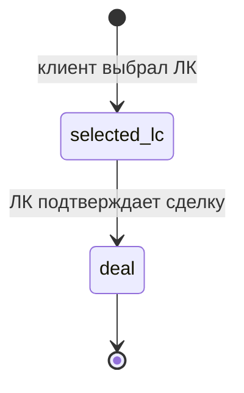

# Bitrix #22212 — Подтверждение сделки выбранной ЛК

**Задача:** https://carcraftpro.bitrix24.ru/workgroups/group/124/tasks/task/view/22212/

## Проблема

В кабинете лизинговой компании, на клиентской заявке со статусом дочерней заявки ЛК `selected_lc`, во вкладке «Действия» отсутствует прежняя кнопка «Подтвердить сделку».

Доменная status machine допускает переход `selected_lc → deal`, но текущий frontend показывает действие «Выдано» только для устаревшего условия `status === approved`. Действующий endpoint `/issue` предназначен для отдельного процесса `approved_final` после принятия итогового КП клиентом и не принимает `selected_lc`.

## Требуемое поведение

1. Выбранная клиентом ЛК в статусе `selected_lc` видит кнопку «Подтвердить сделку» во вкладке «Действия».
2. Действие требует явного подтверждения в диалоге.
3. Сервер переводит LCA в `deal`, а родительскую заявку — в `issued`.
4. Создаются только предусмотренные существующим процессом идемпотентные финализационные сущности для применимых строк спецтехники.
5. Записываются история статусов и существующие DWH-события.
6. Повторный запрос безопасен и не создаёт дубликатов.
7. Нынешний путь `/issue` не меняется и остаётся работоспособным.

## Серверное решение

Добавить отдельное действие:

`POST /api/v1/leasing/applications/{application_id}/confirm-deal`

Оно доступно только участнику выбранной ЛК. В одной транзакции сервер:

- находит LCA по паре заявки и ЛК исполнителя;
- проверяет принадлежность ЛК и статус `selected_lc`;
- возвращает идемпотентный успех при уже `deal`;
- запрещает остальные статусы;
- применяет переход `selected_lc → deal`;
- обновляет родительскую заявку до `issued`;
- создаёт предусмотренные текущей финализацией заказы/графики только там, где они применимы;
- фиксирует историю и публикует существующие события после успешного изменения.

Read-model кабинета ЛК возвращает `can_confirm_deal` и, при недоступности, краткую причину. Интерфейс не вычисляет право самостоятельно.

## Интерфейс

Во вкладке «Действия»:

- при `can_confirm_deal=true` отображаются пояснение и кнопка «Подтвердить сделку»;
- перед запросом открывается предупреждение о необратимости;
- кнопка блокируется на время запроса;
- после успеха состояние перезагружается без обновления страницы, вместо действия отображается «Сделка подтверждена»;
- при запрете действия отображается серверная причина, если она возвращена.

## Проверки

- выбранная ЛК подтверждает `selected_lc → deal`;
- LCA, родительская заявка, история и события согласованы;
- повторное подтверждение не создаёт повторных эффектов;
- чужая ЛК, клиент, дилер и неавторизованный пользователь не могут выполнить запрос;
- неподходящие статусы отклоняются;
- `/issue` сохраняет прежнее поведение;
- frontend показывает действие только при серверном разрешении и корректно обновляет статус после успеха.

## Готовность

Работа готова после прохождения целевых backend- и frontend-проверок, Docker-проверки затронутого сценария, просмотра логов и создания MR в `test` с этой задачей Bitrix.

## Исправление HTTP 500 после MR !364 — 8 сентября 2026

### Подтверждённая причина

На `test.multileasing.ru` обработчик `confirm_deal_endpoint` вызывает
`_require_lc_role` и `_resolve_actor_lc`, удалённые при внедрении общего
контекста ЛК. Журнал backend фиксирует `NameError` до вызова бизнес-команды.
Реализация и регрессионные проверки согласованы пользователем командой «делай»
после диагностики. Ссылка на Bitrix и исходные требования сохраняются выше;
этот файл остаётся единственным артефактом задачи.

### План исправления

1. Подключить `Depends(_lc_context)` и передать команде разрешённый
   `leasing_company_id` из контекста, как в остальных действиях кабинета ЛК.
2. Актуализировать тесты жизненного цикла без подмены удалённых функций.
3. Проверить через HTTP реальную цепочку аутентификации, выбора компании,
   подтверждения `selected_lc → deal`, повторного вызова и запрета чужого доступа.
   Покрыть выбор доступной ЛК через query-параметр и отсутствие прав на неё.
4. Выполнить обязательные backend-проверки, Docker-запуск и просмотр логов.
   Для зелёного mypy добавить недостающую аннотацию `dict[str, Any]` переменной
   `final_proposal` в той же бизнес-команде; её поведение не меняется.
5. Провести отдельный MR исправления в `test`, проверить merge и развёрнутый код.

### Критерии готовности исправления

- Выбранная ЛК получает HTTP 200 и `status=deal`; родительская заявка — `issued`.
- Повторное подтверждение возвращает успех без повторных эффектов.
- Чужая компания, пользователь без подходящей роли и неавторизованный запрос
  получают предусмотренный 4xx; query-параметр не предоставляет права.
- История и события сохраняют существующий транзакционный порядок.
- Изменения схемы БД, данных серверной заявки и frontend не требуются.
- Обязательные проверки выполнены, MR объединён в `test`; развёртывание
  фиксируется отдельно от merge.

Исключение по документации: применяются переданные пользователем правила
`specs/temp_<N>.md → specs/<MR>.md`. Повторная спецификация не создаётся.

### Результаты проверки исправления

- До исправления реальный HTTP-тест воспроизвёл `NameError` в обработчике.
  После исправления оба целевых файла: **40 passed**.
- Полный backend pytest: **4085 passed, 5 skipped**, 27 предупреждений;
  изолированная локальная тестовая БД, не серверный port-forward.
- Ruff: все проверки пройдены. lint-imports: **9 contracts kept, 0 broken**.
  Mypy: **Success: no issues found in 1218 source files**.
- Независимый review: **Standards — 0**, **Spec — 0** замечаний,
  включая финальную аннотацию типа.
- Docker: отдельный проект `carcraft-22212`, свежая сборка frontend и свежий
  backend-код поверх локального dependency image с совпадающими SHA256
  `uv.lock` и `pyproject.toml`. Backend принудительно пересоздан после последней
  правки; миграции новой локальной БД доведены до head `113`.
- HTTP через Nginx: без входа — 401; чужая ЛК — 404; чужая ЛК через
  query-параметр — 403; подтверждение и повтор — 200; статусы — `deal`/`issued`.
- В браузере выполнен вход под синтетическим пользователем и подтверждение
  локальной заявки `22212-browser`. Модальное окно закрылось, появился статус
  «Сделка подтверждена», повторное действие исчезло. Backend и Nginx фиксируют
  POST 200; в собранных логах сценария нет NameError/Traceback/HTTP 500.
  В консоли страницы есть сообщение Nuxt о hydration mismatch при первоначальном
  входе; оно не мешает сценарию, frontend в этом исправлении не меняется.
- Серверная заявка и её данные при проверках не изменялись. Доставка MR и
  наблюдение развёртывания фиксируются отдельно после этих проверок.
- Создан [MR !371](https://gitlab.carcraft.ru/carcraft/carcraft-leadgenerator/-/merge_requests/371)
  из `bugfix/22212-confirm-deal-context` в `test`. Спецификация переименована
  из `temp_4.md` в `371.md`; результаты merge/deploy будут добавлены в MR.
