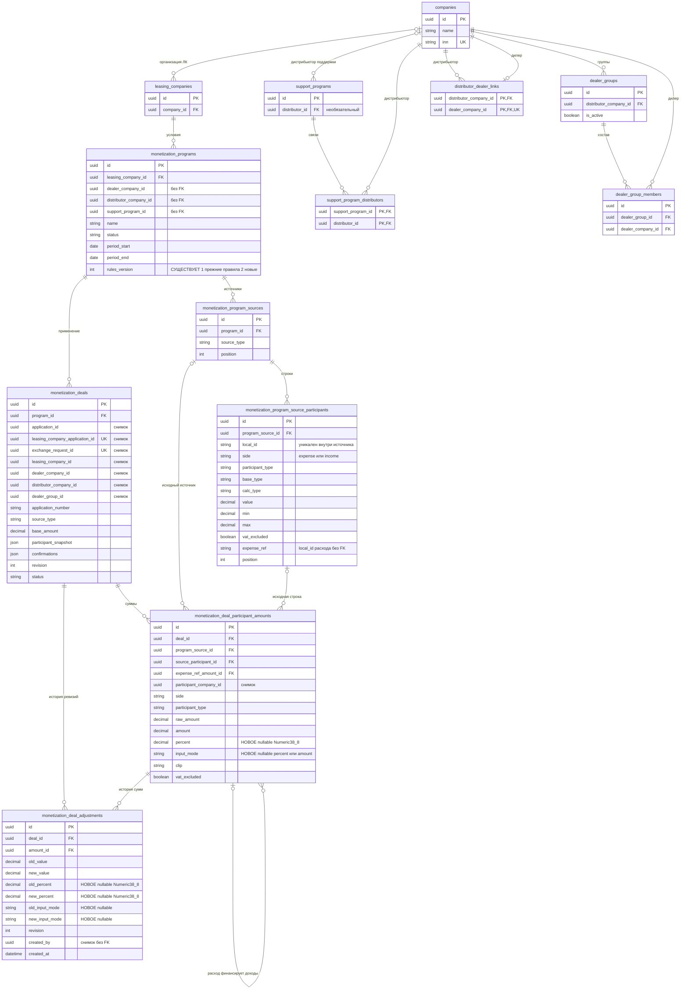
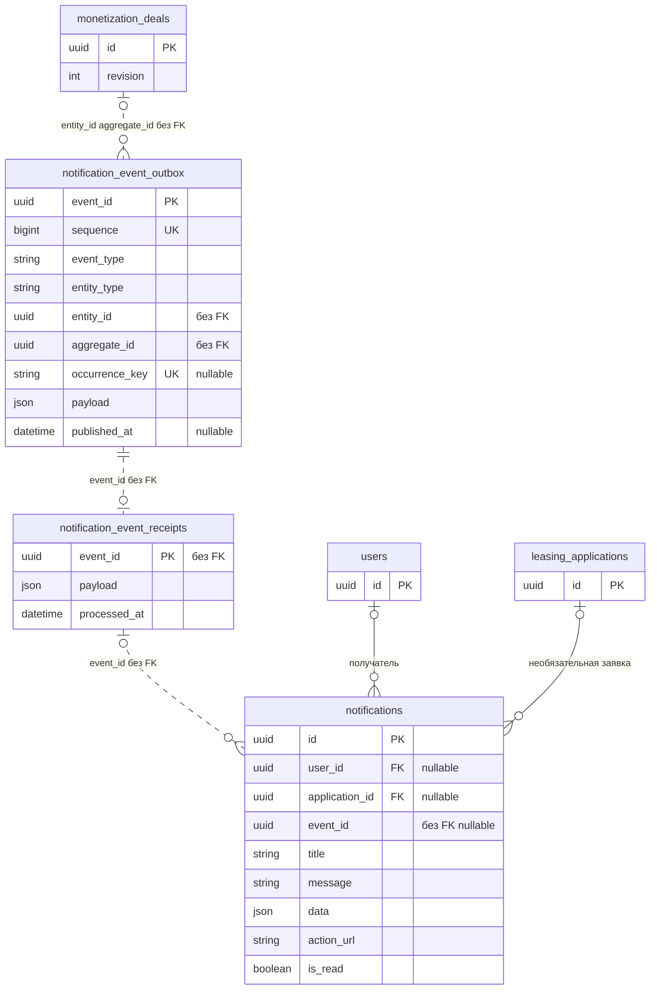
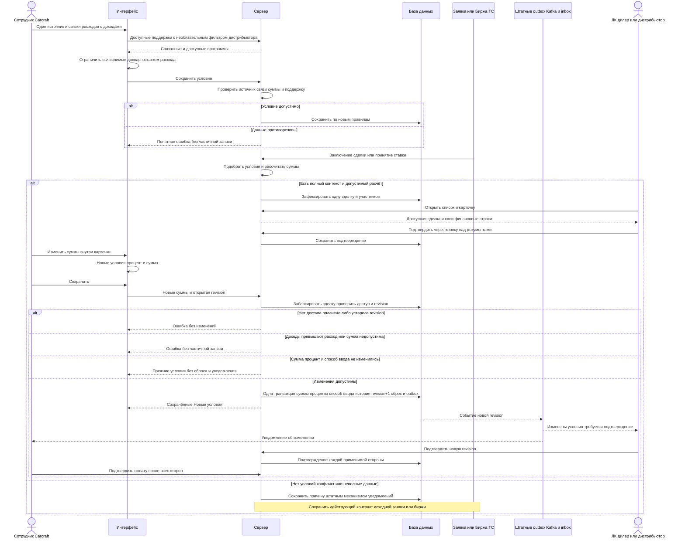

# Задача 22268 Правки монетизации

- Задача: https://carcraftpro.bitrix24.ru/workgroups/group/124/tasks/task/view/22268/
- Ветка: существующая `feature/22268`; все изменения только в ней.
- Редакция: 21.09.2026, дополнение об изменении условий внутри карточки сделки. Требования и результаты предыдущих этапов сохранены ниже.
- Синхронизация дополнения: выполнен `git pull --ff-only` в `test`; существующая `feature/22268` обновлена быстрым продвижением до `origin/test`, без конфликтов. Основание — `b38fb9e9`.
- Статус дополнения: review выполнено; пользователь 21.09.2026 выбрал сохранять точный процент («Давай хранить процент»). Реализация завершена, выполнены проверки API/UI, миграций и два независимых review; результаты приведены в дополнении ниже.
- Передача дополнения: реализовать и проверить в той же `feature/22268`; MR только в `test` по действующему процессу AGENTS.md. Коммиты — с согласованной пользовательской identity.
- Авторство коммитов: по указанию пользователя от 21.09.2026 использовать Dmitry Mirzabekov <dmitry.mirzabekov@gmail.com> для автора и коммитера, без подстановки Codex или иной identity агента. Локальная Git identity репозитория настроена и проверена.
- Артефакт: эта единственная спецификация. По запросу пользователя изображения удалены из спецификации; при реализации учитываются просмотренные изображения исходного DOCX.

<details>
<summary>Схема данных для разработчиков</summary>

Показаны существующие таблицы, включая `rules_version` из миграции 123 и историю корректировок для дополнения 21.09.2026. Новых таблиц не планируется; миграция 124 добавит отмеченные ниже поля процента и способа ввода в финансовые строки и их историю. Поля с пометкой «снимок» или «без FK» не являются внешними ключами. Идентификаторы сущностей — UUID; `expense_ref` — локальное обозначение строки расхода, а не идентификатор компании.



Существующий путь уведомлений (показана часть общей схемы, относящаяся к событиям монетизации). Пунктирные связи логические, без FK; у уведомлений FK есть только на пользователя и исходную заявку. Новые тип события и payload не требуют DDL.



В notifications действует уникальный индекс по (event_id, user_id) для ненулевого event_id. Структура сверена с текущими моделями уведомлений и миграцией 111; новые payload включают revision и не содержат финансовых строк.

Кратности отражают хранение. Для новых условий приложение дополнительно требует ровно один источник и хотя бы одну связку. Связка содержит один расход и его доходы, связанные существующим `expense_ref`. Новая таблица связок не нужна. Договоры и документы используют прежнее хранение.

Схема перепроверена по актуальным `backend/infrastructure/models/monetization.py`, `companies.py`, `support.py` и миграциям 120/121/123. `rules_version` уже существует. Параметры исходного расчёта читаются из неизменяемых строк условия; первоначальная сумма — из первой записи `old_value` либо текущей суммы без истории. Миграция 124 добавляет nullable percent/input_mode к строкам сделки и old_percent/new_percent/old_input_mode/new_input_mode к корректировкам. Исторические null означают, что точный процент не сохранялся; их не заполнять выдуманной историей. Введённый процент сохраняется как есть, а процент при вводе суммы вычисляется сервером. Идентификаторы и существующая история сумм сохраняются.

</details>

<details>
<summary>Последовательность от настройки условия до подтверждения сделки</summary>



</details>

## Дополнение от 21.09.2026 — новые условия внутри карточки сделки

Этот раздел определяет доработку по шести пунктам сообщения пользователя и заменяет прежнее описание отдельного окна корректировки.

### Отображение и редактирование

1. В карточке рядом с итоговой суммой каждой доступной строки показать исходный процент и базу: «от стоимости имущества» или «от расхода». Процент брать из применённого условия, а не восстанавливать из суммы после min/max. Сохранить пояснения НДС и ограничений. Исходный фиксированный расчёт подписать «Фиксированная сумма».
2. «Изменить суммы» включает редактор в существующей карточке. Дополнительный Modal не открывается. Рядом с существующими значениями появляются «Новые условия» с полями «Процент» и «Сумма, ₽» для каждой строки. Доступ сохраняется: сотрудник Carcraft с can_adjust, пока сделка не оплачена.
3. Ввод процента пересчитывает сумму, ввод суммы — процент. У процентных и фиксированных условий с базой property_value/expense_amount сохраняется указанная база. Только для фиксированных сумм с base_type=none в редакторе используется явно подписанный «Эквивалентный процент от стоимости имущества». База не редактируется.
4. Для процента от расхода база — округлённая до рубля итоговая сумма именно связанного расхода. Сохраняется способ ввода input_mode: percent сохраняет точный процент и пересчитывает сумму при изменении расхода; amount сохраняет сумму и пересчитывает процент. Правило действует и при повторном открытии. Последнее редактируемое поле в черновике выбирает новый способ ввода. Историческая строка без сохранённого способа ввода считается amount.
5. При нулевой базе процент недоступен с пояснением; сумму можно исправить. Невычислимую базу не подменять произвольным значением. У исторической строки без исходного условия показать отсутствие исходной формулы; новые условия можно задать суммой и эквивалентным процентом от стоимости имущества.
6. «Сохранить» отправляет одним атомарным запросом изменённые условия строк, включая изменение одного процента или способа ввода без изменения рублёвого итога. Сервер также пересчитывает зависимые доходы; бюджет проверяется по всему итоговому черновику; «Отмена» возвращает последние сохранённые условия без записи. Пока открыт редактор, подтверждение, обновление карточки и загрузка документов недоступны. Во время отправки повторное сохранение и закрытие заблокированы. При ошибке значения остаются в форме; при 409 предлагается отменить черновик и обновить карточку.

### Расчёт и валидация

- По выбору пользователя сохранять точный введённый процент, до 8 знаков после запятой. Пример: база 123456 ₽, введено 1%, сумма после действующего округления — 1235 ₽; в новой редакции остаётся именно 1%.
- Суммы по-прежнему округляются до рубля HALF_UP; изменённая сумма после округления должна быть положительной. Прямой ввод суммы допускает до 2 дробных знаков; сервер вычисляет и сохраняет эквивалентный процент до 8 знаков HALF_UP, сохраняя саму сумму независимо от точности обратного пересчёта. При нулевой базе эквивалентный процент отсутствует. Вручную введённый процент положителен; вычисленный при вводе малой суммы процент может округлиться к нулю.
- Источник ввода сохраняется вместе с процентом: percent либо amount. Поля взаимообновляются в UI без циклического округления. Для старой строки без override текущий эквивалент вычисляется для показа, но исходный договорный процент и исходная сумма выводятся отдельно. Само заполнение исторических null теми же эффективными значениями не создаёт новую ревизию.
- Сервер сначала применяет расходы, затем рассчитывает доходы от новых округлённых расходов. Для явно изменённой строки использует присланный способ ввода. При изменении базы сохранённый percent сохраняет точный процент и пересчитывает сумму, amount или исторический null сохраняет сумму и пересчитывает эквивалентный процент. Эти изменения входят в ту же ревизию и историю.
- API принимает один способ ввода, чтобы не сравнивать заведомо неточную обратную пару. Ручной процент — Decimal до 8 дробных знаков; ручная сумма — до 2. Внутренние вычисления Decimal с точностью не менее 80 знаков, без float. Финальные суммы проверяются на вместимость существующего Numeric(24,8), процент хранится в Numeric(38,8).
- Проверять сумму всех доходов каждой связки относительно её расхода до и после округления. UI повторяет ту же последовательность вычислений и состав изменённых/зависимых строк, что сервер. Доход одной связки не использует бюджет другой. Ошибка блокирует сохранение; серверная проверка обязательна и при прямом запросе. Исторические доходы без связи сохраняют действующие правила.
- Исходные min/max объясняют первоначальный расчёт, но не ограничивают ручную корректировку — это существующее поведение. Общая программа монетизации и другие сделки не меняются.
- Пустые, отрицательные, нечисловые значения, одновременный ввод двух источников в API и округление изменённой суммы к нулю не сохраняются. Точка и запятая принимаются в интерфейсе как десятичный разделитель.

### Сохранение и подтверждения

- Использовать существующий POST /api/v1/admin/monetization/deals/{id}/adjust-conditions с revision. Строка содержит deal_participant_amount_id и либо input_mode=percent с new_percent, либо input_mode=amount с new_value. Передавать ровно одно вводимое значение; второе сервер вычисляет сам. Для прежнего запроса с одним new_value отсутствие input_mode означает amount; URL сохраняется. Неизменённые нулевые строки не отправляются и остаются допустимыми. Сохранённые сумма, процент и способ ввода возвращаются сервером.
- После сохранения показывать исходные условия и рядом последнюю редакцию «Новые условия». Признак редакции определяется серверной revision/историей и сохраняется после перезагрузки и входа другого участника, включая уже скорректированные сделки. Повторное редактирование начинается с последней редакции; первоначальные значения и аудит не перезаписываются.
- Заголовок новой редакции видят все участники; финансовые строки — в пределах действующих прав. API не раскрывает чужие строки или всю историю. Расчётную базу для редактора возвращать только при разрешённой корректировке.
- Реальное изменение суммы, точного процента либо способа ввода одной или нескольких строк повышает revision один раз и сбрасывает все подтверждения. Даже если новый процент округляется к прежней сумме в рублях, это новая редакция условий. Изменение способа ввода значимо, поскольку определяет будущий пересчёт. Повторно подтверждают ЛК, дилер и применимый дистрибьютор, даже если собственная сумма стороны не изменилась. Carcraft подтверждает оплату только после согласия всех применимых сторон.
- Отметка «Новые условия» остаётся после подтверждений как обозначение новой редакции относительно исходного расчёта. Документы старой ревизии сохраняются с существующей отметкой устаревания. Оплаченную сделку изменять нельзя.
- Ошибки прав, валидации, устаревшая revision и сохранение без фактических изменений не создают историю, новую ревизию или уведомление и не сбрасывают подтверждения. Старая карточка не может подтвердить заменённую ревизию.

### Уведомления

- На фактическое изменение условий (в том числе только процента или способа ввода) создать событие monetization.deal_terms_changed через штатный transactional outbox в одной транзакции с суммами и сбросом подтверждений. Ключ дедупликации: тип события, UUID сделки и новая revision. Повторная доставка не создаёт повторное уведомление пользователю.
- Уведомить пользователей участвующих ЛК, дилера, применимого дистрибьютора и Carcraft с действующим доступом через штатный resolver. Read-only участник получает уведомление, но не право подтверждения. Клиент, посторонние компании и наблюдатели, не являющиеся участниками сделки, уведомление не получают. Утрата доступа к моменту доставки учитывается.
- Текст: «Изменены условия сделки <номер>. Требуется повторное подтверждение». Ссылка открывает конкретную сделку с нужным контекстом компании. Общий payload и текст не содержат чужих сумм. Используется существующий внутренний канал уведомлений.
- Подключить штатный post-commit запуск публикации outbox для роутера монетизации через presentation.dependencies.notification_database.get_db; фоновый scheduler остаётся механизмом повторной доставки при сбое запуска после commit.

### План изменений

1. Backend: миграция 124 и ORM nullable-поля процентов/способа ввода, чтение исходных параметров по source_participant_id и агрегированной истории. Существующий adjust_deal скрывает последовательность «расходы, затем зависимые доходы», валидацию бюджета и новое сравнение условий; repo сохраняет скалярный аудит, presentation принимает только одно вводимое значение. AmountOut: original_calc_type (percent/amount/null), original_percent, original_amount; percent (сохранённый или вычисленный эквивалент для старой строки), input_mode, base_type, calculation_base_amount только при can_adjust, has_new_conditions. DealOut: has_new_conditions по revision. Полная история и чужие финансовые строки наружу не выдаются.
2. Frontend: перенести редактор из DealAdjustment.vue в строки DealDetail.vue; связать процент и сумму точным расчётом, добавить ошибки бюджета и сохранённую маркировку, обновить типы. Удалить неиспользуемое вложенное окно.
3. Уведомления: зарегистрировать тип события, revision в обязательном payload и политику получателей; вызывать producer только при фактической корректировке. Сохранить блокировку сделки и атомарность.
4. E2E: обновить карточку и повторные подтверждения. Дополнить изолированное окружение 22268 штатной цепочкой outbox/Kafka/inbox: текущий compose не запускает обработчики уведомлений. Проверить реальную доставку через API уведомлений, а не только наличие записи в outbox. Допустим отдельный E2E-процесс штатного notification consumer без внешних интеграций.
5. Выполнять независимые части backend, frontend и уведомлений/проверок фоновыми подагентами; общий контракт согласовать до параллельных правок. Затем проверить соответствие требованиям и правилам репозитория.

### Критерии готовности

- Браузерные E2E работающего приложения при 768, 1280 и 1920 CSS-пикселях: один диалог, исходные проценты/суммы, inline-редактор, оба направления пересчёта, сохранение/отмена, отсутствие горизонтального переполнения.
- Отдельно проверить точное сохранение 1% после округления суммы, изменение только процента при прежней сумме, сохранение способа ввода и пересчёт зависимого дохода в следующем сеансе; одинаковые условия повторно не создают редакцию.
- Отдельные случаи: процент от имущества и расхода; фиксированная сумма; min/max исходного расчёта; изменение расхода с несколькими доходами; несколько независимых связок; дробный процент и округление; нулевая база; исторические корректировки и доход без связи; перезагрузка.
- Реальные HTTP/UI: превышение бюджета, в том числе скрываемое округлением; недопустимая сумма; чужой/повторяющийся UUID строки; отсутствие прав; оплаченная сделка; устаревшая revision. Ошибки не оставляют частичных изменений и уведомлений. Конкурирующие корректировки одной revision дают один успех и один конфликт.
- Подтвердить сделку сторонами до изменения. Сохранить новые условия через UI сотрудника, войти под ЛК/дилером/дистрибьютором, проверить маркировку, отсутствие утечек, сброс и повторное подтверждение. Проверить запрет финального подтверждения до согласия всех сторон.
- Реальная доставка одного уведомления на новую revision каждому разрешённому участнику, отсутствие у посторонних и неприменимого дистрибьютора; открытие нужной карточки; дедупликация повторной доставки; отсутствие события при no-op.
- Ruff, lint-imports, mypy, проверка TypeScript затронутого frontend, Docker-сборка/запуск и проверка логов. Unit- и архитектурные тесты без отдельного запроса не добавлять и не запускать.
- Все миграции текущей ветки на изолированной БД и alembic check с результатом «No new upgrade operations detected.». Результаты прошлых этапов ниже не являются проверкой этого дополнения.

### Подготовительные проверки 21.09.2026

- Текущие ORM-модели и миграции проверены на изолированной БД monetization22268 через alembic upgrade head и alembic check. Исходники текущей ветки подключены read-only поверх runtime образа; основная БД приложения не затрагивалась.
- Результат: успешное завершение и «No new upgrade operations detected.». Во время сравнения присутствовало предупреждение SQLAlchemy о dialect_options в alembic/env.py:171; расхождений схемы не обнаружено.
- Независимое review backend, frontend и уведомлений выполнено. Уточнены отправка только изменённых строк, точность сумм до округления и база эквивалентного процента для фиксированных условий.
- Пользователь выбрал хранить процент. Результат Alembic выше относится к исходному состоянию до миграции 124. Результаты повторной проверки и нового поведения приведены далее.


### Результаты реализации и проверок 21.09.2026

- Реализованы inline-редактор в единственной карточке сделки, исходные и новые условия, точный сохранённый процент и способ ввода. Миграция 124 добавляет nullable-поля в суммы и историю; прежняя история не заполняется вымышленными процентами. Изменение только процента или способа ввода создаёт ревизию, сбрасывает подтверждения и отправляет событие.
- API: 50 проверок прежних сценариев в runtime.py verify, 10 групп нового поведения в terms.py verify и отдельная проверка terms.py verify-tiny — успешно. Проверка минимального процента включена в основной verify как 11-я группа. Значение 0.00000001% точно сохраняется в БД и истории, возвращается обычной десятичной строкой при POST/GET и даёт 1 ₽ на базе 10 млрд ₽.
- Новые реальные HTTP-сценарии проверяют оба способа ввода, повторное открытие, пересчёт доходов от изменённого расхода, бюджет до/после округления, no-op, процент без изменения рублёвой суммы, права всех ролей, атомарный отказ, гонку двух revision, сброс/повторное подтверждение и запрет изменений оплаченной сделки.
- Уведомления проверены через штатный outbox, Kafka, notification consumer и реальный inbox API всех пяти разрешённых пользователей. У постороннего события нет; в данных уведомления нет финансовых строк. Повторная доставка того же события не создаёт дубликат. Изолированный notification-runtime не использует внешние SMTP/ClickHouse.
- Браузер: 11 сценариев реальных Vue-компонентов с заменой HTTP и 10 новых сценариев работающего приложения — успешно. Проверены 768/1280/1920 CSS-пикселей, единственный диалог, фокус, оба направления пересчёта, сохранение/отмена/перезагрузка, точный процент, превышение бюджета, конфликт revision, повторное подтверждение сторонами и fixed/min/max/zero. Переход из реального уведомления дилера открывает нужную карточку с контекстом компании и сохранёнными 1% / 1235 ₽. Скриншот inline-редактора при 768 px просмотрен, горизонтального переполнения нет.
- Регрессия прежнего UI: 23 сценария revisions-22268.spec.ts прошли. Первоначально четыре проверки списка предполагали присутствие старой фикстуры на первой странице; после добавления новых сделок это неверно. Проверки исправлены на переход через настоящую UI-пагинацию; адресный повторный прогон всех четырёх успешен. Код приложения для этого не менялся.
- Docker: backend и frontend успешно собраны; приложение, PostgreSQL, Redis, Kafka и consumer запущены в отдельном проекте carcraft-22268-terms-e2e, HTTP только localhost:18268. Основная БД приложения не затронута. При подготовке исправлена исключительно E2E-фикстура: перед созданием сделки создаются настоящие исходная заявка и её связь с ЛК, чтобы соблюдался FK уведомлений.
- Финальные проверки backend: Ruff — успешно; lint-imports — 9/9 контрактов; mypy — no issues found in 1156 source files. Для проверок в одноразовом контейнере установлены инструменты dev-окружения pytest 9.1.1 и Ruff 0.15.20; unit- и архитектурные тесты не запускались.
- Полная проверка frontend bun x vue-tsc --noEmit — успешно. bash -n для E2E runner и git diff --check — успешно.
- Все миграции применены к изолированной БД от пустой схемы до 124. Повторный alembic check завершился успешно: No new upgrade operations detected. Осталось прежнее предупреждение SQLAlchemy о dialect_options, без операций изменения схемы.
- После исправления фикстуры и финального перезапуска просмотрены логи backend, frontend, nginx и notification-runtime: ошибок, traceback и HTTP 500 не найдено.
- Два независимых review текущего diff относительно b38fb9e9: Standards — замечаний нет; Spec — замечаний нет. После review изменены только покрытие минимального процента и перехода из уведомления, устойчивость E2E-пагинации, включение новых проверок в runner и этот раздел результатов.

## Дополнение 21.09.2026 — сотые и нераспределённый остаток

Пользователь запросил изменения в той же ветке и уточнил, что округление до сотых относится и к процентам, и к денежным суммам. Этот раздел заменяет правила точности предыдущего дополнения для первичного расчёта новых сделок и новой ручной корректировки.

### Требования и границы изменения

1. При редактировании условий сделки новый процент и новая сумма нормализуются до двух знаков после запятой по HALF_UP. Например, 23.38743238% становится 23.39%, 16.865 ₽ — 16.87 ₽. Расчёт от явно введённого процента использует его округлённое значение; итоговая сумма также округляется до копеек. 1% от 123456 ₽ даёт 1234.56 ₽.
2. Округление выполняется одинаково на frontend и backend. API принимает сырой ввод до восьми дробных знаков для обоих полей и нормализует его до сотых. Округлённый ввод, равный нулю, недопустим при изменении; вычисленный эквивалент положительной суммы может быть 0.00% в режиме amount. Пределы целой части и конечных значений сохраняются: сырой запрос суммы — max_digits=24/decimal_places=8 (16 целых цифр), процента — 38/8 (30 целых). После округления повторно проверять предел, включая перенос в следующий разряд.
3. Ввод не меняется во время набора; после выхода из поля отображаются сотые. Превью и сохранение, в том числе по Enter без blur, используют нормализованный ввод. Вычисленные проценты и суммы в карточке показываются максимум с двумя дробными знаками. Decimal/bigint сохраняют точность без float.
4. Процент и способ ввода сохраняются отдельно от суммы. При вводе суммы новая сумма остаётся авторитетной, эквивалентный процент сохраняется до сотых и не используется для обратного изменения суммы. При изменении расхода доход в режиме percent пересчитывается от суммы расхода с копейками; доход в режиме amount сохраняет сумму.
5. Ранее сохранённые условия и история автоматически не переписываются. Открытие редактора, фокус, blur без ввода, отмена и правка другой строки сохраняют прежние сумму/процент/режим. В частности, исторические 1% и 1235 ₽ не превращаются в 1234.56 ₽ от одного открытия. Явный новый ввод процента пересчитывает строку по новым правилам. Зависимый доход использует свой сохранённый процент, если пользователь его не менял. Повтор прежней суммы в amount-режиме при прежней базе не округляет исторический процент и не создаёт ревизию.
6. В режиме «Изменить суммы» под каждой связкой с расходом показывать «Осталась не распределенная сумма [сумма]», если итог расхода больше суммы всех связанных итоговых доходов. Остаток считается в копейках и обновляется по текущему черновику.
7. Положительный остаток — информационная строка, она не влияет на доступность сохранения. При полном распределении строка скрывается; при превышении действуют прежние ошибки бюджета до/после округления. При невалидной строке связки остаток скрывается. Бюджет до округления использует точные результаты процентной формулы после нормализации нового процента; amount-ввод уже приведён к копейкам. Независимые связки не покрывают дефицит друг друга. Расход без доходов показывает весь остаток; исторические несвязанные доходы не вычитаются из чужого расхода.
8. Остаток доступен только в редакторе сотрудника, которому сервер возвращает все строки. По частично видимым финансовым строкам других участников остаток не вычисляется.
9. По явному уточнению пользователя область изменения включает первичный автоматический расчёт новых сделок, ручную корректировку и отображение карточки. Первичный расчёт и проверки бюджета условий монетизации также используют копейки вместо целых рублей. Порядок формулы сохраняется: доход от расхода при первичном расчёте использует расход после min/max, до финального округления; точность итоговых сумм меняется, база формулы — нет. Сохранённые исходные параметры программ не изменяются; уже созданные сделки и их история автоматически не пересчитываются. Схема БД не меняется: существующие Numeric-поля поддерживают сотые. Уведомления, revision и повторное согласование сохраняют прежние правила.

### Реализация и проверки

- Backend: округление первичного расчёта и проверки бюджета условий в domain/monetization/programs.py; нормализация нового ввода и расчёта в domain/monetization/terms.py, допустимая точность сырого запроса в presentation/schemas/monetization.py; no-op по авторитетному вводу. ORM, миграции и исторические значения не переписывать.
- Frontend: отделить исходные данные от редактируемого ввода; расчёт копеек/процентов и остатка в dealTerms.ts, округление полей в DealAmount.vue, информационный остаток в DealDetail.vue. Обновить точность проверки бюджета в редакторе программ, чтобы она совпадала с первичным серверным расчётом; форматирование ручной корректировки ограничить карточкой сделки.
- Параллельно реализовать backend, frontend и обновление API E2E. Проверить реальные HTTP и браузерные сценарии: копейки, половина копейки, проценты до сотых, no-op исторических значений, две связки, остаток больше/равен/меньше нуля, сохранение с положительным остатком, роли, зависимые доходы и уведомления.
- Обновить ожидания E2E ручной корректировки и первичного расчёта программ. Проверить реальное создание новой сделки с копейками и случаи, ранее отклонявшиеся только из-за округления до рублей. Проверить viewport 768 и 1280+, TypeScript, Ruff, lint-imports, mypy, Docker и логи. Выполнить alembic upgrade head и alembic check до No new upgrade operations detected.
- Синхронизация выполнена через git pull --ff-only origin test в существующей feature/22268. Основание — 4c9e3363, включающее предыдущий MR !417. Новый коммит остаётся от Dmitry Mirzabekov <dmitry.mirzabekov@gmail.com>, MR только в test.
- Статус: требования изучены тремя независимыми подагентами; уточнён риск автоматического пересчёта исторических значений. Пользователь подтвердил выполнение с расширением области: «Округлять также первичный расчёт». Спецификация обновлена с учётом этого выбора, реализация согласована.

### Результат проверки дополнения

- Реализовано округление первичного расчёта и ручных условий до сотых, сохранение процента и информационный остаток каждой связки. Исторические значения не переписываются при простом открытии или изменении несвязанной строки.
- На изолированном Docker-приложении runtime.py verify: 53/53 группы; terms.py seed → verify: 20/20 групп, включая tiny/history 2/2. Проверены создание новой сделки реальным HTTP approve, копейки, границы округления и точности, независимые бюджеты, атомарный отказ, права доступа, revision, повторные подтверждения и доставка уведомлений через outbox/Kafka/inbox.
- Playwright/Chrome: 37/37 сценариев на работающем приложении (13 условий сделки + 24 регрессии), ещё 17/17 браузерных сценариев с собранными Vue-компонентами. Проверены viewport 768/1280/1920, ввод/blur/Enter, сохранение и повторное открытие, положительный/нулевой/отрицательный остаток, исторические значения. Контрольные скриншоты просмотрены.
- Ruff, lint-imports (9/9 контрактов), mypy (1156 файлов), полный vue-tsc --noEmit и git diff --check — успешно. Backend и frontend собраны в Docker; frontend собран с локально кешированными зависимостями после TLS-ошибки получения базового образа из Docker Hub. Контейнеры приложения и уведомлений работают, неожиданных ошибок/HTTP 5xx в логах проверенных сценариев нет.
- Alembic upgrade head и alembic check в изолированной PostgreSQL: успешно, No new upgrade operations detected. Дополнительная миграция не требуется.
- Независимые review Standards и Spec завершены без замечаний к реализации. Unit- и архитектурные тесты не запускались.

## Зачем нужны изменения

Монетизация в Carcraft — внутренний расчёт вознаграждений между лизинговой компанией, дилером, дистрибьютором и платформой. Лизинговая компания предоставляет финансирование, дилер продаёт транспорт, дистрибьютор работает с дилерами, а платформа связывает участников. Клиент, приобретающий транспорт в лизинг, в этом расчёте не участвует.

Сотрудник Carcraft заранее создаёт **условие монетизации**: для каких заявок оно действует, кто платит и кто получает деньги. Когда подходящая заявка становится сделкой, система создаёт отдельную **сделку монетизации** с рассчитанными суммами. Участники проверяют её и подтверждают свои данные.

Правки позволяют распределять один расход между несколькими получателями, делают движение денег понятнее на экране и устраняют два описанных случая отсутствующих сделок. Монетизация не меняет цену транспорта, первоначальный взнос, платежи клиента и лизинговый калькулятор.

## Термины

| Термин | Значение |
| --- | --- |
| ЛК | Лизинговая компания. |
| Администратор | Сотрудник Carcraft с правом управления монетизацией. |
| Источник заявки | Способ появления заявки: платформа, кабинет дилера или Биржа ТС. |
| Расход и доход | Сумма, которую один участник платит, и сумма, которую другой получает. |
| Связка | Один расход и все доходы, выплачиваемые из него. |
| База расчёта | Стоимость имущества или сумма расхода, от которой считается процент. Фиксированной сумме база не нужна. |
| Поддержка | Программа стимулирования, связанная с дистрибьютором; может ограничивать применимость условия монетизации. |
| Подтверждение | Согласие участника с данными сделки. Это не новая банковская операция. |

## Дополнение пользователя от 20.09.2026

Пункт бокового меню «Монетизация» переименовать в «Условия монетизации» у сотрудника Carcraft, дилера, дистрибьютора и лизинговой компании. То же название используется в настройках видимости разделов. Адрес раздела и права доступа сохраняются.

## Требования по пунктам исходного документа

Нумерация 1–11 сохранена. Изображения исходного DOCX просмотрены и учтены: после пунктов 5, 6 и 7 показано прежнее состояние интерфейса. По запросу пользователя сами изображения в спецификации не размещаются. Третье изображение относится к списку сделок, а не к сообщению о Бирже ТС.

### 1 Один расход можно распределить между несколькими получателями

Каждая связка в форме содержит одного плательщика и несколько строк получателей. Доступны действия добавления и удаления дохода. В одном условии можно создать несколько связок с общим источником заявки.

Пример: расход ЛК — 2% стоимости имущества, доходы — 1% дилеру, 0,6% дистрибьютору и 0,4% платформе. То же распределение можно задать как 50%, 30% и 20% от суммы расхода. Значения служат примером, а не обязательной ставкой.

Каждый доход сохраняет принадлежность расходу при любой базе расчёта: после сохранения, повторного открытия, расчёта сделки и корректировки её сумм. Доход одной связки не использует остаток другой. Для новых условий самостоятельные доходы вне связки не создаются. Сохраняется прежняя возможность расхода без доходов: новая правка не требует обязательного получателя.

### 2 У одного условия только один источник заявки

Источник выбирается один раз для всего условия. Вторая связка не создаёт второй источник. Доступными остаются платформа, кабинет дилера и Биржа ТС; ранее недоступные варианты не включаются.

Сервер отклоняет новое условие с нулём или несколькими источниками, включая прямой запрос к API. Для другого источника создаётся отдельное условие. Условия с одинаковыми компаниями и параметрами, но разными источниками не должны ошибочно считаться дублями; реальные пересечения для одного источника по-прежнему проверяются.

### 3 Доходы связки не превышают её расход

Сравнивается сумма всех доходов связки. Максимум для изменяемой строки равен расходу за вычетом остальных доходов. Если введено больше допустимого и максимум вычислим, интерфейс автоматически подставляет максимум с коротким объяснением. Это работает при вводе, вставке значения и перед сохранением.

| Расход и уже заданные доходы | Ввод | Результат |
| --- | --- | --- |
| Расход 10 000 ₽; доходы 3 000 ₽ и 4 000 ₽ | Ещё 5 000 ₽ | 3 000 ₽ |
| Расход 2% стоимости; доходы 0,7% и 0,8% той же стоимости | Ещё 1% | 0,5% |
| Доходы от суммы расхода: 40% и 40% | Ещё 30% | 20% |

Уточнение пользователя от 20.09.2026: при превышении лимита автоматически подставленное значение отображается без незначащих нулей справа: 3000.00 → 3000, 0.50 → 0.5; значащие дробные цифры (например, 4.49) сохраняются. Расчёт, округление и правила положительных сумм не меняются.

После уменьшения расхода или смены базы/типа расчёта лимит проверяется снова. Принятый порядок уменьшения доходов — с последнего к первому, сохраняя порядок строк; изменения видны до сохранения. При нулевом остатке положительный доход добавить нельзя. Строка с нулём не сохраняется: действующие правила требуют положительные значения, поэтому пользователь удаляет её или перераспределяет суммы. Минимум строки, противоречащий остатку, показывается ошибкой.

**Принятое поведение:** сохранить все существующие базы, проценты, фиксированные суммы и min/max. Интерфейс автоматически ограничивает сочетания, для которых максимум достоверно вычисляется без будущей стоимости имущества. В остальных случаях показывает, что окончательная проверка выполняется при расчёте сделки. Например, сравнить 2% стоимости с 5 000 ₽ без самой стоимости невозможно. Проценты не складываются с рублями, выдуманная стоимость не используется. При разрешении начать реализацию принят предложенный вариант: вычислимые ограничения в форме и обязательная проверка фактических сумм сделки.

Сервер проверяет все доходы связки при расчёте конкретной сделки и корректировке её сумм. При превышении расчёт не фиксируется частично и возвращается понятная причина. Проверка учитывает min/max и выполняется до и после действующего округления до целого рубля по правилу ROUND_HALF_UP. Точность расчёта этой правкой не меняется. НДС сохраняет прежнюю семантику подписи без нового налогового пересчёта.

### 4 В списке условий видны участники и компании

На вкладке «Условия монетизации» показать участников условия с названиями компаний: например, «Лизинговая компания — ООО „РЕСО-Лизинг“». Платформу показывать как «Платформа МЛ».

Показывать участников доступных пользователю строк условия. Если условие рассчитано на любую компанию соответствующей роли, писать «Любой дилер» или «Любой дистрибьютор». Не придумывать компанию и не дублировать её из-за нескольких строк. Действующие ограничения доступа сохраняются.

### 5 В карточке сделки используется подпись Дилер

Заменить подпись «Исполнитель» на «Дилер». Ниже вывести название без повторной подписи роли: «Дилер / „ФАВ-Восточная Европа“». В этой строке для названия вида «Дилер „Компания“» убрать начальный служебный префикс «Дилер», в том числе когда он приходит в названии из БД. Префикс распознаётся перед открывающей кавычкой после пробелов; «Дилер-Авто» и слово «дилер» внутри названия сохраняются. Это только отображение карточки: название в справочнике и ответы API не меняются.

### 6 Расход расположен слева а его доходы справа

Каждая связка в карточке сделки читается слева направо: один расход слева, все его доходы справа друг под другом. Следующая связка — отдельный блок. В карточке сохраняются доступные текущей роли суммы и подписи НДС.

Расширить модальное окно и его полезную внутреннюю область. Принятый размер — максимум 1120 CSS px с отступами от краёв браузера не менее 24 px; точный размер не задан в исходном документе. На поддерживаемой ширине от 768 px сохранять две понятные колонки, переносить длинные названия и не обрезать суммы. Общие окна других функций не перевёрстывать.

### 7 В списке сделок остаются участники с названиями компаний

Для всех ролей убрать из списка сделок суммы расходов/доходов и их подписи НДС. Сохраняются две колонки: «Участники расхода» и «Участники дохода». В каждой — роль и название компании без повторов. Компания, которая одновременно платит и получает, может присутствовать в обеих колонках.

В карточке суммы остаются доступными в пределах прежних прав. Правка касается финансовых колонок списка и не требует удалять стоимость имущества из карточки. При добавлении названий компаний нельзя раскрывать финансовые строки, скрытые от текущей роли.

### 8 Сделка с Биржи ТС попадает в монетизацию

Пример из ТЗ: дилер «ФАВ-Восточная Европа», ИНН `7700000005`; ЛК ООО «РЕСО-Лизинг», ИНН `7709431786`. Неподписанные значения `76660000010` и `76661234572` сохраняются как ориентиры сообщения, но не считаются доказанными ID или телефонами.

Воспроизвести штатное принятие ставки с подходящим активным условием. Результат — ровно одна связанная сделка монетизации, доступная участникам. Повторная обработка не создаёт дубль. Существующие поддержки и компенсации биржи продолжают работать.

При отсутствии подходящих условий, конфликте или неполных данных сотрудник получает конкретную причину, а не бесследное исчезновение. Обычная лизинговая заявка вместо биржевой не создаётся; действующий контракт принятия ставки сохраняется.

Подтверждённая причина на переданном дампе: в принятой ставке не заполнен дистрибьютор, хотя у дилера есть действующая прямая связь с ним. Подбор условия не учитывал эту связь и не находил подходящее условие. Исправление использует существующий механизм определения дистрибьютора по прямой связи, когда в ставке он отсутствует. Явно заданный дистрибьютор не заменяется. Новая сделка создаётся при штатном принятии ставки; повторная обработка не создаёт дубль.

### 9 Подтверждение участника находится перед документами

Для ЛК, дилера и дистрибьютора оставить одно действие «Подтвердить» непосредственно перед прикреплением документов. Убрать дублирующую кнопку из блока статусов, сохранив сведения о том, кто и когда подтвердил сделку.

Кнопка доступна только участнику с правом подтверждения и в допустимом состоянии сделки. После нажатия отображается сохранённый результат; повторное подтверждение и подтверждение сотрудником с правом только просмотра запрещены. Документы остаются необязательными; их можно прикрепить до подтверждения. Меняется положение кнопки, а не обязательный порядок действий. Финальное действие администратора и его правила не меняются.

### 10 Дистрибьютор видит свою сделку

Проверить сделку `7703586399-1709-002`: по ТЗ она видна ЛК и дилеру, но отсутствует у дистрибьютора «Фав-Восточная Европа», ИНН `7726571783`. Неподписанное значение из сообщения — `76666663475`.

Уполномоченный пользователь этой компании должен видеть свою сделку в списке и открывать карточку. Право просмотра и право подтверждения проверяются отдельно: подтверждает только фактический участник с соответствующим разрешением. Чужой дистрибьютор не получает доступ через список, ссылку, документы или подтверждение. Пользователь с правом только просмотра не подтверждает.

Подтверждённая причина на переданном дампе: у дистрибьютора есть прямая связь с дилером, но нет дилерской группы. Фильтр доступа учитывал только группы и возвращал 404 на карточку. Исправление учитывает прямые связи и активные группы вместе, перечитывая их при запросе. После исправления эта сделка присутствует в списке дистрибьютора, карточка возвращает 200. Финансовый снимок не изменялся.

### 11 Поддержки зависят от выбранного дистрибьютора

После выбора дистрибьютора показывать только связанные с ним и доступные пользователю поддержки. Учитывать прямую связь программы и существующую связь с несколькими дистрибьюторами.

Уточнение пользователя от 20.09.2026 после MR !412: если дистрибьютор не выбран, поле поддержки доступно и позволяет выбрать любую доступную пользователю программу. Если дистрибьютор выбран, список ограничивается связанными с ним программами. При выборе или смене дистрибьютора ранее выбранная поддержка очищается; при очистке дистрибьютора выбранная поддержка сохраняется, поскольку ограничение снимается. Запоздавший ответ прежнего поиска не возвращает варианты из старого контекста. При отсутствии вариантов показывается понятное пустое состояние.

Сервер всегда проверяет существование и доступность поддержки, а принадлежность дистрибьютору — только если он выбран, включая прямые запросы. Сохранение и активация условия с поддержкой без выбранного дистрибьютора разрешены. Для источника «Биржа ТС» поддержка в условиях по-прежнему недоступна; действующие поддержки самой биржи не отключаются.

## Сохранение существующих условий и сделок

Новые ограничения применяются к новым условиям. Старые остаются доступными для просмотра, активации/деактивации и применения по прежним правилам. Они не разбиваются автоматически; самостоятельные доходы не привязываются к расходам догадкой. Для замены сотрудник создаёт новое неактивное условие, отключает старое и активирует новое. Это сохраняет запрет пересечения активных условий.

Версия правил хранится явно: миграция назначает существующим условиям `rules_version = 1`, а сервер новым — `2`. Это служебное поле: клиент не может выбрать старую версию и обойти новые ограничения. Определять её по количеству источников ненадёжно. Суммы, подтверждения, документы и история готовых сделок не пересчитываются. Новые подписи, кнопки и компоновка применяются и к старым сделкам на основе их сохранённых данных. Старые самостоятельные доходы остаются отдельной подписанной группой без выдуманной связи с расходом.

Исправление двух ошибок не означает массового создания исторических сделок. Необходимость восстановления конкретной записи определяется по диагностике и включается в эту же спецификацию до выполнения.

## План реализации

1. Получить review и подтверждение редакции, включая предложения о смешанных формулах, порядке уменьшения доходов, двух колонках участников, выборе поддержки и старых условиях.
2. В изолированном окружении воспроизвести два сбоя через настоящий API/браузер. Записать подтверждённые причины и уточнить исправления здесь.
3. Параллельно выполнить независимые части: правила расчёта/связок и миграцию; форму, списки и карточки; фильтрацию поддержек и исправления подтверждённых причин. Согласовать API и владение общими файлами до параллельных правок.
4. Проверить связанное поведение, права, старые данные и неизменность клиентских расчётов.
5. Выполнить проверки, просмотреть логи, устранить проблемы и предоставить приложение пользователю для дополнительной проверки. Публикация следует актуальному разрешению пользователя в метаданных этой спецификации.

Основные места изменений: `frontend/features/monetization/`, её browser-сценарии; `backend/domain/monetization/`, команды, запросы, схемы, API и репозитории монетизации; модель и новая миграция. Биржевой поток и доступ менять в объёме доказанной причины. Общий поиск компаний, калькулятор и чужие формы в объём не входят.

## Проверки и критерии готовности

Проверки приложения выполняются после реализации на отдельных тестовых данных. Реквизиты из сообщения не используются для отправки уведомлений или тестовых операций во внешних сервисах.

- Создать условие с одним источником, двумя связками и тремя доходами одной связки; сохранить, открыть повторно, рассчитать сделку и проверить принадлежность строк.
- Прямые запросы с несколькими источниками, доходом без расхода, чужой ссылкой на расход и неподходящей поддержкой отклоняются без частичной записи.
- Проверить три числовых примера пункта 3, уменьшение расхода, смену базы, нулевой остаток, min/max, разные связки и округление. Превышение запрещено и при корректировке сделки. Смешанные формулы проверяются по согласованному решению.
- Проверить названия компаний в двух списках и отсутствие сумм расходов/доходов в списке сделок для всех ролей. Чужие финансовые строки не появляются в ответе API.
- На 768, 1280 и 1920 CSS px проверить подпись «Дилер», расход слева/доходы справа, длинные названия, несколько доходов, ширину/прокрутку окна и подтверждение перед документами.
- Пройти биржевое принятие ставки, повторную обработку и ошибки подбора: одна сделка либо конкретная допустимая причина, без молчаливого отсутствия.
- Проверить сделку дистрибьютора из пункта 10; отрицательные случаи — чужая компания, отсутствие членства пользователя, только просмотр, прямая ссылка и скачивание документов.
- Проверить выбор любой доступной поддержки без дистрибьютора, сохранение и активацию такого условия; фильтрацию при выбранном дистрибьюторе, отклонение чужой поддержки, несколько дистрибьюторов одной программы, выбор/смену/очистку дистрибьютора и запоздавший ответ поиска.
- Проверить прежнее условие с несколькими источниками и самостоятельным доходом и подтверждённую сделку: финансовые результаты и документы сохранены.
- Для FastAPI выполнить Ruff, lint-imports, mypy и обязательные проверки по инструкциям задачи; проверить TypeScript и сборку фронтенда. Основное доказательство поведения — сквозные сценарии на приложении. Component browser-тесты с подменой API сами по себе их не заменяют.
- Собрать и запустить backend/frontend/nginx в Docker, выполнить целевые E2E и просмотреть логи. Общий запуск — `bash scripts/e2e/run.sh`; отсутствующий сценарий добавить либо проверить через настоящий браузер/API и записать результат.
- На изолированной БД выполнить `uv run alembic upgrade head` и `uv run alembic check`. Требуемый результат — `No new upgrade operations detected.`; старые миграции не переписывать.

Готовность означает выполнение всех 11 требований, согласованных решений и проверок. Фактически выполненные проверки перечислены ниже.

## Результаты реализации 20 сентября 2026

Синхронизация выполнена; существовавший локальный `scripts/e2e/notifications35/__pycache__/` сохранён. Прочитаны все 11 пунктов DOCX, просмотрены три изображения; их позиции проверены по порядку элементов документа. Постраничный рендер недоступен из-за отсутствия встроенного LibreOffice, поэтому номера страниц не используются.

Переданный PostgreSQL-дамп восстановлен в локальную базу после создания резервной копии. Резервная копия в WSL: /tmp/carcraft-before-22268-20260920T120901Z.dump. Прежняя база также сохранена отдельно как carcraft_before_22268_20260920120953 с запрещёнными подключениями; данные не удалены. Две программы и одна существующая сделка из дампа сохранены; миграция 123 назначила прежним условиям версию правил 1. В дампе обнаружено старое расхождение типов трёх полей кэша каталога: локально применено приведение к text, уже предусмотренное миграцией 091, без удаления данных и изменения истории миграций.

Обе причины подтверждены сравнением поведения до и после исправления на тех же данных. Сделка 7703586399-1709-002 стала доступна дистрибьютору. Для биржевого примера теперь определяется дистрибьютор и выбирается подходящее условие. Отсутствовавшая историческая биржевая сделка автоматически не создавалась: исправление действует при штатном новом принятии ставки. Массового пересчёта и заполнения истории нет.

Реализованы связанные расходы и доходы, новый редактор с одним источником, ограничение вычислимого бюджета, названия участников, обновлённые списки и карточка, единое подтверждение и фильтрация поддержек. Новые условия получают версию правил 2 только на сервере; старые сохраняют прежнюю семантику.

Проверки:
- Ruff — успешно; lint-imports — 9 из 9 контрактов; mypy — 1155 файлов без ошибок.
- Проверка TypeScript не обнаружила новых ошибок. Сохраняются две прежние ошибки Pinia._s в tests/e2e/notifications/toast-layer-22218.spec.ts, строки 14 и 26.
- Docker-сборка backend и frontend выполнена успешно. Основные backend/frontend/nginx перезапущены; frontend и API health возвращают 200. В проверенных логах нет ошибок приложения и HTTP 5xx. Фоновые отправляющие процессы при работе с восстановленным дампом не запускались.
- Изолированная пустая PostgreSQL прошла миграции 001–123; alembic check сообщил No new upgrade operations detected. Та же проверка прошла на локальной восстановленной базе.
- Сквозные HTTP-проверки: 36 из 36 успешно на отдельном окружении с синтетическими данными, без внешних интеграций и фоновых отправок. Проверены новые условия, бюджеты до/после округления, min/max, пересечения источников при создании/активации, поддержки, биржевой переход и отсутствие дублей, проекции по ролям, отзыв доступа, корректировки и подтверждения, прежние условия. Сценарии: scripts/e2e/monetization22268/runtime.py. Запрет скачивания при отзыве доступа проверен реальным HTTP с временными метаданными документа; успешное скачивание из S3 этим прогоном не заявляется.
- Браузерные сценарии: 21 из 21 успешно одним прогоном в Chrome на настоящем приложении и API. Проверены три примера автоматического ограничения, округление, постоянные суммы через min=max, нулевые ограничения, смена базы/границ и независимость связок, создание и повторное открытие, компании в списках для четырёх ролей, поддержки и запоздавший настоящий ответ, подтверждение и запреты доступа, прежняя сделка. Файл: frontend/tests/e2e/monetization/revisions-22268.spec.ts. Значения API не подменяются; для проверки запоздавшего ответа задерживается получение настоящего ответа сервера.

По дополнительному запросу пользователя выполнены два независимых ревью: соответствие правилам проекта и соответствие исходному ТЗ. Первое не выявило нарушений. Второе нашло один пропуск: процентный расход с одинаковыми min/max уже имеет известную сумму, но форма не ограничивала доход. Пропуск воспроизведён в Chrome и исправлен для расходов и доходов; сравнение границ числовое, поэтому 10000 и 10000.00 эквивалентны. Повторное ревью замечаний не выявило. Карточка визуально просмотрена на 768, 1280 и 1920 CSS px: расход слева, доходы справа, суммы и подписи читаемы, ширина ограничена 1120 px с отступами не менее 24 px. Итог двух осей: правила проекта — 0 замечаний; соответствие ТЗ — 0 оставшихся замечаний после исправления выявленных пропусков.

После сообщения «Локально не вижу изменений» отдельно проверен основной http://localhost, а не изолированное тестовое окружение. Сервер отдаёт актуальные компоненты, в новой сессии Chrome видны один источник и несколько доходов в редакторе, названия компаний в списках и широкая карточка. Старые финансовые снимки из дампа сохраняют прежние строки и не преобразуются в новые связки автоматически.

На реальной сделке 7703586399-1709-002 обнаружен и исправлен дополнительный пропуск пункта 5: приставка «Дилер» находилась в названии компании внутри сохранённого снимка. Под заголовком теперь отображается «ФАВ-Восточная Европа» без повторения роли. До исправления точная браузерная проверка на основном localhost падала, после пересборки и перезапуска фронтенда прошла; ответ API и данные БД сохранили исходное название. Повторное ревью этой правки замечаний не выявило. Тестовая компания теперь содержит такой же служебный префикс, чтобы E2E воспроизводил реальные данные. После исправления отдельно прошли 5 из 5 браузерных сценариев: точное название под заголовком и списки для администратора, дилера, ЛК и дистрибьютора. Сборка успешна, новых ошибок TypeScript нет; повторный Alembic check не обнаружил расхождений.

Дополнительное переименование пункта меню проверено на основном localhost: в Chrome виден пункт «Условия монетизации», переход открывает прежний раздел, ошибок браузера и HTTP 5xx нет. Название синхронизировано для четырёх ролей и в настройках видимости разделов. Фронтенд пересобран и перезапущен; повторные Alembic upgrade head и check прошли без изменений схемы.

Изменения остаются в feature/22268. По отдельному запросу пользователя от 20.09.2026 выполняется публикация коммита и MR в test; перед публикацией проверено, что origin/test по-прежнему указывает на 403da01389874a1c5d635b311c17117338a00097.

## Проверка уточнения пункта 11 после MR !412

Пользователь уточнил, что дистрибьютор ограничивает выбор поддержки только когда выбран. Прежняя реализация ошибочно запрещала выбор без него: браузерные проверки воспроизвели disabled-поле до выбора и после очистки, HTTP-проверка вернула 0 вместо 3 доступных тестовых поддержек. Удалены лишние ограничения в форме, application query и репозитории. Сервер проверяет наличие поддержки всегда и её связь с дистрибьютором только при его выборе; проверка применяется также при активации условия. Для биржевого источника прежнее ограничение сохраняется. Правила нулевых доходов и исправление доступа из пункта 10 этим уточнением не меняются.

Результаты: реальные HTTP — 50/50; отдельный сценарий `runtime.py verify-supports` — 3/3; браузер — 3/3 (выбор без дистрибьютора и фильтрация после выбора, сохранение поддержки после очистки дистрибьютора с последующим сохранением условия, запоздавший ответ прежнего запроса). На основном localhost дополнительно проверено: поле активно без дистрибьютора, API возвращает 6 поддержек, ошибки браузера и HTTP 5xx отсутствуют. Основные backend/frontend/nginx обновлены; тестовые записи создавались только в изолированной БД.

Ruff 0.15.20 из uv.lock — без ошибок и исправлений; lint-imports — 9/9; mypy с типами pytest — 1155 файлов без ошибок. TypeScript показывает только прежние две ошибки Pinia._s в `tests/e2e/notifications/toast-layer-22218.spec.ts:14,26`. Alembic upgrade/check — `No new upgrade operations detected.` Логи проверены, ошибок приложения и HTTP 5xx нет. Независимая проверка уточнения замечаний не выявила.

Backend собран штатно. Стандартная сборка frontend дважды остановилась из-за загрузки зависимостей (ошибка целостности event-target-shim и TLS timeout Docker Hub). Фронтенд успешно собран в Docker без сети на основе предыдущего локального образа: байтовое равенство его package.json и bun.lock текущим файлам подтверждено, использованы неизменные установленные зависимости, исходники обновлены и `bun run build:frontend` выполнен заново. Dockerfile обхода сохранён только во временном каталоге, настройки сборки проекта не менялись.

## Отображение автоматически ограниченной суммы

После уточнения пользователя воспроизведено лишнее дополнение справа: при вводе выше остатка браузер показывал 3000.00 вместо 3000. Форматирование изменено только в результате автолимита: незначащие нули после точки и пустая дробная часть удаляются; 0.50 становится 0.5, 4.49 сохраняется. Точная арифметика BigInt и общие денежные функции не менялись.

Обновлены ожидания существующих E2E; 7 из 7 браузерных сценариев прошли (суммы, проценты, округление, изменение расхода/базы/границ). Docker-сборка с прежними неизменными зависимостями успешна, новых ошибок TypeScript нет; сохраняются прежние две ошибки Pinia._s. Alembic upgrade/check снова сообщил No new upgrade operations detected. Логи E2E без ошибок приложения и HTTP 5xx; локальные frontend/nginx перезапущены, отдача обновлённого модуля на localhost проверена HTTP 200. Во время проверки MR !413 был объединён в test, поэтому эта правка публикуется отдельным MR.

<details>
<summary>Как повторить сквозные проверки</summary>

Нужны Docker, собранные локальные образы backend/frontend, зависимости фронтенда и браузер Playwright. Команды ниже выполняются в Linux/WSL из корня проекта; отдельный Compose использует только синтетическую базу monetization22268 и порт 18268, основную локальную базу не меняет.

```bash
docker compose -f scripts/e2e/monetization22268/compose.yml up -d postgres redis redpanda
docker compose -f scripts/e2e/monetization22268/compose.yml run --rm init-keys
docker compose -f scripts/e2e/monetization22268/compose.yml run --rm backend /app/.venv/bin/python /e2e/runtime.py check
docker compose -f scripts/e2e/monetization22268/compose.yml up -d backend frontend nginx
docker compose -f scripts/e2e/monetization22268/compose.yml exec backend /app/.venv/bin/python /e2e/runtime.py seed
docker compose -f scripts/e2e/monetization22268/compose.yml exec backend /app/.venv/bin/python /e2e/runtime.py verify
cd frontend
MONETIZATION_E2E=1 MONETIZATION_E2E_FIXTURE=/tmp/carcraft-22268-e2e/manifest.json bun run test:e2e -- tests/e2e/monetization/revisions-22268.spec.ts
```

API-проверку нужно завершить до браузерной: она временно отзывает доступ у синтетического дистрибьютора и восстанавливает его в finally. Состояния входа содержат тестовые токены, сохраняются вне репозитория и не должны публиковаться. Если Docker создаёт их от root, браузерному процессу нужно предоставить чтение через защищённую личную копию manifest и storageState с обновлёнными путями. Для этой задачи браузерный прогон выполнен установленным Chrome в Windows; пути manifest/storageState перенесены во временный каталог проверочного процесса.

</details>

<details>
<summary>История первоначальной реализации и прежних проверок</summary>

Ниже сохранена предыдущая редакция для прослеживаемости. Исходное отсутствие модуля, ограничения этапов А/Б, результаты тестов и разрешение на MR относятся к прошлым этапам. При противоречии действует редакция от 20.09.2026 выше.

# Задача 22268 Монетизация

- Bitrix: https://carcraftpro.bitrix24.ru/workgroups/group/124/tasks/task/view/22268/
- Ветка: `feature/22268`.
- База исследования: `test`, коммит `48b776db9a518b719a57ac0aab90092a6053b1a6`; выполнен `git pull --ff-only`, ветка актуальна.
- Статус: согласованные этапы А и Б реализованы; замечания исправлены в разделе 17. Подготовка разрешённого пользователем MR и проверки — раздел 18.
- Артефакт задачи: только эта спецификация; план и уточнения обновляются здесь.

## 1. Постановка и границы

Добавить условия монетизации и сделки монетизации с отдельными строками расходов/доходов, расчётом, подтверждениями участников и корректировками администратора.

Указания пользователя имеют приоритет над приложениями и общим процессом репозитория:

1. Ориентироваться на правую рабочую область HTML-макета и выделенную область скриншота. Использовать существующую оболочку workspace; не переносить боковое меню и общий дизайн приложения из прототипа.
2. Если требуется изменение другой готовой функции, сначала обозначить его пользователю и пока не реализовывать. Такие работы перечислены в разделе 5. Последующее прямое указание пользователя «Давай все этапы польностью реализуй» разрешило их реализацию; актуальные границы — раздел 11.
3. Исходно MR не создавать, изменения не объединять. 17.09.2026 пользователь отдельно разрешил создание MR; актуальное уточнение — раздел 18.
4. До кода согласовать эту спецификацию согласно п. 5 корневого AGENTS.md.
5. Монетизация — внутренний расчёт между платформой, ЛК, дилером и дистрибьютором. Не добавлять её расчёт в лизинговый калькулятор, его API, клиентский кабинет, корзину, оформление заявки или клиентские документы. Она не меняет стоимость имущества, первоначальный взнос, ежемесячный платёж, ставку, скидки и итоговые суммы для клиента. Клиент не получает доступ к условиям, комиссиям, документам и уведомлениям монетизации и не участвует в её подтверждении. Поле «Клиент» в служебной карточке сделки — только справочная информация для уполномоченных сотрудников и компаний.

## 2. Что обнаружено в готовом функционале

| Область | Подтверждённое состояние | Значение для задачи |
| --- | --- | --- |
| Монетизация | В backend/frontend нет модуля и таблиц `monetization_*` | Это новая функция |
| Источник заявки | У `LeasingApplication` нет `source_type`; создание хранит `created_by`, компанию, дилера и витрину | Утверждение ТЗ о готовом присвоении источников не подтверждено |
| Стоимость сделки ЛК | У `LeasingCompanyApplication` нет денежного поля; `total_amount` есть у родительской заявки и у `LeasingProposal` | Нельзя без решения подставить «общую сумму LCA» из ТЗ |
| Создание заявки | При выбранных ЛК `_persist_side_records` сразу создаёт связи LCA | Окна для запроса комиссии «до первой LCA» в этом сценарии уже нет |
| Исполнитель | `dealer_company_id` заявки и строк автомобилей допускает NULL; данные могут требовать назначения исполнителя | Нельзя автоматически назначать дилера ради обязательного поля монетизации |
| Биржа | Принятие ставки переводит request в `deal`; КП необязательно по действующему domain guard | Переписывать процесс принятия ставки не требуется |
| Поддержки на бирже | `approve_bid` вызывает `finalize_exchange_supports`, создаются снимки поддержек и компенсации | Запрет фильтра программы для монетизации exchange не означает отключение готовых поддержек биржи |
| Снимок поддержки | `ApplicationAppliedSupport` содержит название, автомобиль и nullable FK программы; отдельных полей компании дилера/дистрибьютора нет | Описанный в ТЗ снимок участника поддержки отсутствует; одного имени недостаточно для полного правила |
| Идентификатор ЛК | Биржа хранит `lc_company_id -> companies.id`; монетизации нужен `leasing_companies.id` | Использовать существующую явную связь через `LeasingCompany.company_id`, не подменять UUID |
| Уведомления | Есть transactional outbox, но `NotificationEvent` ограничивает типы событий и сущностей текущими заявками/биржей | Новые события требуют расширения готового модуля уведомлений |
| Навигация | Общие меню и каталог видимости централизованы, произвольная workspace-страница ими не зарегистрирована | Публикация раздела требует небольших изменений общей навигации |

Основные точки проверки:

- `backend/infrastructure/models/applications.py`: `LeasingApplication`, `LeasingCompanyApplication`, `LeasingProposal`, `ApplicationVehicle`.
- `backend/application/commands/applications/create_application.py`: `_insert_application`, `_persist_side_records`.
- `backend/application/commands/leasing_applications_lc/change_status.py`: переход статуса LCA.
- `backend/infrastructure/models/exchange.py`, `backend/domain/entities/exchange_bid.py`, `backend/application/commands/exchange/approve_bid.py`.
- `backend/application/commands/exchange/finalize_supports.py`, `backend/infrastructure/models/support.py`.
- `backend/infrastructure/repositories/application_repository.py`: `resolve_leasing_company_id`.
- `backend/domain/events/notifications.py`, `backend/application/notifications/events.py`, `backend/domain/notification_policy.py`.
- `frontend/features/workspace/config/menu.ts`, `frontend/features/workspace/utils/menuVisibility.ts`, `frontend/features/sectionVisibility/config.ts`, `backend/domain/section_visibility.py`.

## 3. Как использовать макет

Сохранить композицию правой области: заголовок, вкладки «Условия монетизации» и «Сделки», фильтры, таблицы, карточки, форму и окно изменения сумм. Реализация только для desktop viewport 768+.

При расхождении поведения источником требований считать ТЗ. Расхождения явно разрешить так:

| В прототипе | В планируемой новой функции |
| --- | --- |
| Парные «связки» расхода и дохода | Независимые массивы расходов и доходов, минимум один расход и допустимо ноль доходов |
| «Нет» выключает расчёт; встречается база «Агентское вознаграждение» | «Нет» означает фиксированную сумму; доход может ссылаться на конкретную строку расхода |
| Неполный справочник источников | Все девять источников ТЗ, шесть недоступны для выбора |
| Счета, промежуточные состояния, «Отклонено» | Только `pending_approval` и `paid`, подтверждения сторон и финальное подтверждение администратора |
| Расход в модалке нередактируемый | Администратор меняет любые фактические строки расходов/доходов |
| Недостающие Клиент и подтверждение ЛК | Добавить поля и подтверждения по ТЗ |
| Отдельный справочник документов, версии, автоподбор договора | В текущем объёме только договоры условий и документы сделки; отдельный справочник не входит |
| Кнопка полного редактирования условий | В текущем объёме создание, просмотр, активация/деактивация; изменение состава уже используемых условий не включать |

НДС в ТЗ имеет необычную, но явную семантику: флаг строки меняет только подпись; тултип «Сумма без НДС» у стоимости имущества показывает то же число. Налоговый пересчёт не добавлять.

## 4. Этап А — что реализовать после согласования спецификации

Самостоятельный модуль и его тесты. До отдельного разрешения этапа Б не подключать его к работающим заявкам, бирже, общему меню и доставке уведомлений. Этот этап не объявляется полным выполнением ТЗ: автоматическое создание реальных сделок и часть переходов пользовательского интерфейса остаются отложенными.

### А1. Условия монетизации

- Название, обязательная одна ЛК; необязательные дилер, дистрибьютор, программа стимулирования, марка, модель, комплектация, VIN.
- Начало периода, окончание, active/inactive, договоры.
- Поиск зарегистрированных участников по названию/ИНН с отображением обоих. Новые read-only запросы монетизации могут читать существующие справочники; не создавать компании из произвольного текста и не менять общий поиск.
- Источники: доступны `platform`, `dealer_account`, `exchange`. Видны, но недоступны `dealer_site`, `distributor_site`, `quick_deal_dealer`, `quick_deal_distributor`, `leasing_to_dealer`, `dealer_to_leasing`, без подписи «Скоро». API отклоняет их с 400.
- Минимум один блок источника. Повторения источника допустимы. Минимум один расход в блоке; доходы независимы и могут отсутствовать.
- Участники: leasing, dealer, distributor, platform. Agent отображается неактивным, сервер отклоняет его с 400. Один участник может повторяться и присутствовать на обеих сторонах.
- База расхода: property_value или none; дохода: property_value, expense_amount или none. При none допустим только amount.
- Доход с expense_amount ссылается на существующую строку расхода того же блока; межблочные ссылки и ссылки на доход запрещены.
- Процент/фиксированная сумма, min/max и флаг НДС задаются отдельно для каждой строки.
- Программы поддержки, их документы и совместимость — только чтение существующих данных с действующими ограничениями доступа. При наличии блока exchange поле программы недоступно для всего набора условий.
- Список: название, марка, период, статус, переход в карточку; без расчётных сумм. Фильтры ЛК, источник, марка, статус; пагинация.
- Карточка: группы источников, независимые расходы и доходы, привязанные доходы под соответствующим расходом; самостоятельные доходы отдельной группой.

### А2. Выбор условий и расчёт

Расчёт выполняется исключительно внутри модуля монетизации. Согласованная стоимость имущества поступает как готовая база только для чтения. Рассчитанные расходы, доходы и комиссии не передаются обратно в калькулятор и не меняют финансовые условия клиентской заявки.

Чистый доменный расчёт принимает готовый, проверенный снимок сделки: UUID связи с исходной сущностью, источник, момент заключения, каноническую ЛК, исполнителя, клиента, дистрибьютора/группу при наличии, точную стоимость имущества, состав транспорта и снимки поддержек.

- Отбирать активные условия по периоду, ЛК, источнику и всем заполненным ограничениям.
- Выбирать один набор с наибольшим числом совпавших необязательных параметров, с равным весом семи параметров ТЗ.
- При ничьей, отсутствии условий или недостаточном контексте возвращать явный результат без финансовой сделки и с причиной для администратора.
- Все блоки выбранных условий с совпавшим source_type применяются одновременно. Строки одного участника не объединяются.
- Деньги и проценты считать через Decimal; процент делить на 100. Сначала расход, затем зависимые доходы от расхода после min/max.
- Сохранять raw_amount, итоговую сумму, признак clipping, флаг НДС и происхождение каждой строки.
- Округлять суммы после clipping до рублей через ROUND_HALF_UP. Стоимость имущества не округлять.
- Проверять сумму привязанных доходов отдельно для каждого расхода; независимые доходы в ограничение не входят. Защитить также итог после округления от превышения.
- При создании условий проверять структурные и доказуемые арифметические противоречия; расчёты, зависящие от неизвестной стоимости имущества, обязательно повторно валидировать при фиксации сделки.
- Уже зафиксированные расчёты не пересчитывать при изменении активности или истечении условий.
- Условия с VIN использовать однократно: конкурентные попытки должны давать не более одного использования.

На этапе А контекст поступает через внутренний интерфейс и тестовые фикстуры. Публичную кнопку ручного создания сделки, периодический обход старых заявок или восстановление источника по текущей роли пользователя не добавлять.

### А3. Сделки, подтверждения и корректировки

- Хранить отдельную сделку монетизации, независимую от статусов LCA, заявки, биржи, покупок и платежей.
- Ровно один путь связи: обычная заявка с LCA либо exchange_request без LCA/обычной заявки. Повторная фиксация одного источника не создаёт дубль.
- Снимок участников и суммы фиксируется в сделке. Для exchange клиент NULL, дилер — компания принятой ставки.
- Списки и карточки: номер исходной заявки, источник, транспорт, исполнитель, клиент, стоимость, разрешённые суммы и подтверждения. Фильтр клиента по названию/ИНН выбирает UUID.
- ЛК и дилер подтверждают всегда; дистрибьютор — только если он участник фактически применённой строки. Указывать пользователя и время подтверждения.
- Повторное подтверждение стороны — 409. Администратор подтверждает последним, при недостатке подтверждений — 409 с перечнем ожидаемых сторон. Финальное подтверждение переводит в paid.
- Документы каждой стороны необязательны; они доступны участникам сделки по авторизованной загрузке/скачиванию.
- Только администратор меняет суммы pending_approval. Новые значения положительные; ноль, отрицательные значения и изменение paid запрещены.
- Автоматическая строка платформы в модалке всегда первая: сумма всех расходов минус доходы, кроме доходов платформы. Она вычисляемая, не создаёт фиктивного финансового участника.
- Фактические настроенные строки платформы сохраняют самостоятельность. В обычной карточке платформа показывается только при явном участии и только уполномоченной роли.
- Корректировка атомарно сохраняет изменения «было/стало», перепроверяет ограничения связанных доходов и сбрасывает подтверждения при фактическом изменении сумм. Конкурирующее подтверждение не должно подтвердить старую версию.
- Документы, связанные с прежней версией подтверждения, помечать устаревшими, не уничтожать файлы. Текущие подтверждения ссылаются на актуальную версию расчёта.
- После paid редактирование сумм и повторное финальное подтверждение невозможны. Новых банковских операций, счетов и фискализации нет.

### А4. Права доступа

Использовать существующие роли: `carcraft_employee`, `dealer`, `distributor`, `leasing_company`. Термин «Администратор» ТЗ соответствует сотруднику Carcraft.

- Администратор видит всё и управляет условиями/суммами.
- ЛК видит только свои условия и сделки по `leasing_companies.id`.
- Дилер видит условия с пустым фильтром дилера либо своим UUID; сделки — по фактическому участию/назначению.
- Дистрибьютор видит подходящие условия и сделки в своих дилерских группах; подтверждение доступно только фактическому участнику строки.
- Неадминистратор получает только свои финансовые строки, включая raw_amount и clipping. Фильтровать на сервере, а не только скрывать HTML.
- Проверять актуальное членство пользователя в выбранной компании и доступ к объекту. UUID из запроса сам по себе не даёт доступ.
- Прямой URL карточки, фильтры, скачивание файла и изменение строки не должны обходить ограничения списков.
- Клиентская роль не имеет доступа к API, страницам, файлам и уведомлениям монетизации. Ссылка на клиента в сделке не даёт клиенту прав на эту сделку.

### А5. Переговоры о дополнительной комиссии

Внутри новой функции подготовить сущность и use cases запроса, ответа ЛК и решения дилера:

- Отдельная запись для каждой выбранной ЛК; только до первой LCA и только уполномоченному дилеру заявки.
- sent → accepted/rejected/countered; countered → accepted/rejected только явным решением дилера.
- Терминальный запрос повторно не обрабатывается; новый запрос в другую ЛК создаётся вручную.
- Согласованное значение информационное и не изменяет рассчитанные суммы.
- Новые API и компоненты проверить самостоятельно. Встраивание компонентов в готовые карточки заявок и изменение этапов распределения — этап Б.

## 5. Этап Б — где потребуется затронуть готовый функционал

Первоначально эти интеграции были отложены. Отдельное разрешение пользователя получено 16.09.2026; решения и реализация перечислены в разделе 11.

| Готовая функция / точки в коде | Необходимое или возможное изменение | Что остаётся недоступно без него |
| --- | --- | --- |
| Создание заявок: `models/applications.py`, `commands/applications/create_application.py`, остальные пути создания, схемы/репозитории | Добавить неизменяемый source_type и правило для каждого способа создания. Согласовать исторические заявки и роли distributor/leasing_company/external_api, не описанные двумя доступными обычными источниками | Автоматическая классификация platform/dealer_account; корректный подбор для обычных заявок |
| Переход LCA в deal: `commands/leasing_applications_lc/change_status.py` и другие подтверждённые writers | Подключить фиксацию контекста монетизации в момент перехода, обеспечить повторяемость без дублей. Не менять разрешённые переходы LCA | Автоматическое появление сделки монетизации из LCA |
| Сумма и исполнитель обычной сделки: `models/applications.py`, данные предложений/назначений | Уточнить источник «стоимости по договору»: например final proposal total_amount, но не выбирать молча. При отсутствии исполнителя определить отдельный процесс назначения; не делать это побочным действием монетизации | Корректный финансовый снимок при отсутствующих/неоднозначных данных |
| Принятие ставки биржи: `commands/exchange/approve_bid.py` | Подключить новую фиксацию, читая request и принятую bid; согласовать цену, количество и применение скидки. Не создавать обычную заявку | Автоматическое появление биржевой сделки |
| Программы стимулирования: `models/support.py`, `commands/applications/finalize_supports.py` | Если требуется точный исторический матчинг участника поддержки, добавить его неизменяемый снимок. Не заменять отсутствующие данные текущими связями программы | Полное выполнение правила 8.2.1 на реальных исторических данных |
| Карточки дилера и ЛК: `frontend/features/applications/components/ApplicationDetailModal.vue`, `frontend/pages/workspace/leasing-applications/[id]/index.vue` и их feature-компоненты | Встроить запрос комиссии, все адресованные ЛК запросы и явное решение дилера. Если нужен запрос до автосоздания LCA, отдельно изменить пользовательский этап оформления | Доступ к переговорам из заявок; возможность запроса в сценариях, создающих LCA сразу |
| Общая навигация и видимость: `workspace/config/menu.ts`, `sectionVisibility/config.ts`, `backend/domain/section_visibility.py` | Зарегистрировать один новый раздел «Монетизация» с двумя вкладками и его права/видимость. Это добавление пункта в существующую оболочку, без её перевёрстки | Открытие раздела через рабочее меню и штатные guards |
| Уведомления: `domain/events/notifications.py`, `domain/notification_policy.py`, `application/notifications/`, frontend notification routes | Добавить новые события, получателей и ссылки через существующий outbox. Только внутренние уведомления; сбой доставки не блокирует финансовое действие | Уведомления о новой сделке, подтверждении стороны, paid, отсутствии/конфликте условий |

Дополнительные ограничения:

- Поддержки и компенсации биржи уже работают. Их отключение не требуется новой функции и не входит в задачу; exchange-условия монетизации просто не отбираются по программе поддержки.
- Существующие Kafka-события статусов отправляются fire-and-forget и могут теряться. Они не доказывают наличие надёжного снимка стоимости и участников на момент сделки. Не выдавать подписку на них за готовую гарантию фиксации.
- Схемы БД готовых функций, их HTTP-контракты, расчёт лизинга, распределение, компенсации, платежи и документы клиентов на этапе А не менять.
- Добавление импортов новых ORM-моделей для Alembic и регистрация собственных API в `backend/main.py` — техническое подключение этапа А. Изменения в этих общих файлах ограничить регистрацией новой функции.

## 6. Предлагаемая архитектура и API

### Размещение

- `backend/domain/monetization/`: подбор, расчёт, ограничения строк, статусы и подтверждения; без I/O.
- `backend/application/commands/monetization/`, `queries/monetization/`: use cases; работа через репозитории.
- `backend/infrastructure/models/monetization.py`, новые `repositories/monetization_*.py`, одна миграция нового модуля.
- `backend/presentation/schemas/monetization.py`, отдельные routers: аутентификация/роли, схемы, ошибки, commits.
- `frontend/features/monetization/`: типы, компоненты, composables и API через штатный $fetch; тонкие страницы `frontend/pages/workspace/monetization/`. Прямая страница доступна внутренним ролям; включение в общее меню остаётся на этапе Б.

Собственные use cases скрывают расчёт и атомарные изменения. Вход фиксации — проверенный снимок; результат — существующая/новая сделка либо типизированная причина отказа. Не добавлять новый gateway или абстракцию ради тестов. Репозитории возвращают словари, commit выполняет presentation. Внешние интерфейсы готовых функций не заменять.

### Данные

Новые таблицы ТЗ: `monetization_programs`, `monetization_program_sources`, `monetization_program_source_participants`, `monetization_program_contracts`, `monetization_deals`, `monetization_deal_participant_amounts`, `monetization_deal_documents`, `monetization_deal_adjustments`, `monetization_condition_requests`.

Дополнить только новую модель необходимыми снимками участников, UUID подтвердивших пользователей, финальным подтверждением администратора, версией расчёта/документа и порядком блоков/строк. Это нужно для требований «кто подтвердил», стабильной видимости и сброса подтверждений; одних timestamp-полей из таблицы ТЗ недостаточно.

- Все новые ID — UUID, frontend хранит непрозрачные строки. ЛК ссылается на leasing_companies, компании прочих сторон — на companies.
- Уникальность фиксации исходной сделки и использования VIN защищается БД/транзакцией.
- Пересечение периодов полных дублей проверяется с учётом NULL и конкуренции. Обычный UNIQUE по датам из ТЗ не запрещает пересекающиеся диапазоны; применить проверку пересечения под блокировкой по ЛК либо эквивалентное ограничение PostgreSQL.
- Хранить ключи файлов в существующем object storage; не сохранять временный signed URL как постоянный адрес.
- История корректировок и финансовый снимок не удаляются при удалении/изменении исходных данных. Поведение FK согласовать с неизменяемостью уже зафиксированных сделок.
- Записи в ClickHouse не добавлять; аналитика/DWH монетизации этим ТЗ не запрошена.

### HTTP

Сохранить бизнес-операции ТЗ:

- Создание/список/карточка условий: `/api/v1/admin/monetization/programs`, `/{id}`.
- Добавить отсутствующий в ТЗ PATCH `/api/v1/admin/monetization/programs/{id}` только для active/inactive. Для чтения пути `admin/monetization` допускают четыре роли по указанным фильтрам; запись — только carcraft_employee.
- Сделки: GET `/api/v1/monetization/deals`, `/{id}`; POST `/{id}/documents`, `/{id}/confirm`.
- Финальное подтверждение и корректировка: POST `/api/v1/admin/monetization/deals/{id}/confirm`, `/adjust-conditions`.
- Запрос комиссии: POST `/api/v1/dealer/monetization/applications/{application_id}/condition-requests`.
- Ответ/решение: POST `/api/v1/leasing-company/monetization/condition-requests/{id}/respond`, `/api/v1/dealer/monetization/condition-requests/{id}/decision`.
- Добавить отсутствующее чтение запросов по заявке с фильтрацией адресата/инициатора.
- Загрузку договоров выполнить отдельным multipart endpoint после JSON-создания условий; не смешивать JSON-body и массив файлов из примера ТЗ в несовместимый контракт. Неуспешную загрузку показать с возможностью повтора.
- Добавить авторизованное скачивание договоров/документов и read-only справочники внутри модуля.

Применить текущие REST-правила: POST create — 201 с Location и ресурсом, списки — items/pagination, без success-конверта, ошибки в принятом формате detail. Это явное отличие от иллюстративных ответов ТЗ items/total и error/message. Канонические пути без внешнего redirect 307; response_model/summary/description у маршрутов.

## 7. Уточнения, предлагаемые для согласования

### Решения этапа А в этой спецификации

1. Бессрочные условия: `period_end = null`, как в макете; начало обязательно. В таблицах ТЗ окончание помечено NOT NULL — принять это как исправление несогласованности. Границы периода включительные, дата оценивается в MSK.
2. Положительные значения корректировки — по CHECK new_value > 0 в ТЗ; отрицательные не разрешать, хотя текст отдельно упоминает только ноль.
3. Доходы от расхода рассчитываются от суммы после clipping до округления; затем каждая строка округляется. Если округлённые доходы превысят расход — конфликт без фиксации, без скрытого изменения долей.
4. Пустое сохранение или значения без фактического изменения не сбрасывают подтверждения.
5. Не удалять документы устаревшего подтверждения; хранить признак версии.
6. Полное редактирование условий и отдельный справочник документов отложены как функциональность прототипа, не описанная этим ТЗ.
7. При нескольких автомобилях фильтры марки/модели/комплектации/VIN должны совпасть на одной позиции, не собираться из разных автомобилей. После выбора условия расчёт идёт от общей согласованной стоимости сделки.

### Исходные вопросы этапа Б — принятые решения в разделе 11

- Какая существующая сумма является стоимостью имущества по договору: финальное КП конкретной ЛК, сумма заявки или отдельное новое поле? Что делать без финального КП?
- Как классифицировать исторические заявки, витрины и создание от distributor/leasing_company/external_api? Нельзя достоверно восстановить неизменяемый источник по текущему пользователю.
- Как выбирать исполнителя и фактического дистрибьютора при NULL или нескольких участниках/группах? ТЗ предполагает одного подтверждающего на роль.
- На бирже брать количество принятой ставки или request, и как применять фиксированную скидку — на единицу или на сделку? Оба объекта содержат quantity, в ТЗ источник `price × quantity` не уточнён.
- Разрешено ли расширить снимок применённой поддержки компаниями участников и как обрабатывать старые снимки без этих данных?
- Нужен ли новый шаг запроса комиссии до создания связей LCA, либо первый выпуск ограничить заявками, у которых связей ещё нет?

## 8. Порядок реализации

1. После review подтвердить этап А и решения раздела 7; этап Б остаётся отдельно закрытым.
2. Зафиксировать контракты нового модуля и тестовые примеры расчёта/ролей.
3. Выполнять независимые работы максимально доступным числом фоновых подагентов: backend-хранение/API, доменные расчёты и проверки, frontend-компоненты. Общие регистрации и интеграционную проверку выполняет ведущий агент; до стабильного контракта не делить пересекающиеся файлы.
4. Реализовать условия, затем внутреннюю фиксацию/подбор, сделки/подтверждения, переговоры, UI.
5. Проверить этап А на тестовых данных без включения автоматической обработки настоящих заявок.
6. Показать готовый этап А и перечень всё ещё отложенных интеграций. После отдельного разрешения уточнить тот же файл и выполнить только согласованные строки этапа Б.
7. Не создавать MR и не выполнять merge.

## 9. Проверки и критерии готовности

### Автоматические проверки

- Domain: независимость строк, повторы участников/источников, отсутствие доходов, expense_ref, min/max, ROUND_HALF_UP, НДС без пересчёта, приоритет/ничья/нет условий, VIN.
- Backend/API: матрица ролей и компаний; фильтрация финансовых строк; запрет чтения чужих файлов; статусы, все комбинации подтверждений, сброс после правки; неизменяемость paid.
- Внутренний контур: клиенту запрещены API/файлы монетизации; создание условий, фиксация и корректировка комиссий не изменяют значения клиентской заявки и калькулятора. В клиентских ответах, документах и уведомлениях нет данных монетизации.
- PostgreSQL integration: конкурирующая фиксация/использование VIN/создание дубля условий; одновременная корректировка и подтверждение; rollback без частичных строк и подтверждений.
- Запросы комиссий: несколько адресатов, запрет при первой LCA, закрытые статусы, явное принятие встречного условия, отсутствие влияния на суммы.
- Проверки UI: взаимодействие добавления/удаления независимых строк и ссылок, недоступные источники/agent, роли, ошибки API, пустые состояния и загрузка файлов.
- Для будущих согласованных интеграций: регрессии создания заявок, распределения, поддержки/компенсаций биржи, навигации и уведомлений. В частности сохранить зелёными существующие `backend/tests/test_exchange_supports.py` и связанные тесты notifications.

Для backend выполнить:

```bash
cd backend
uv run ruff check . --fix
uv run lint-imports
uv run mypy . --ignore-missing-imports
uv run pytest -q
```

Для frontend: `bun run test:arch`, `bun run build:frontend`, проверка TypeScript; изменённые сценарии вручную в браузере на 768, 1280 и 1920 CSS px. Использовать существующий Vitest/Playwright, не вводить новый тестовый стек.

Запустить Docker и просмотреть логи:

```bash
docker compose build backend frontend nginx
docker compose up -d
docker compose up -d --build --force-recreate backend
docker compose logs --tail=200 backend frontend nginx
```

Проверить миграцию на тестовой БД, доступность API через Nginx и отсутствие ошибок в новых сценариях. Если автоисправление линтера затрагивает несвязанный код, не включать эти правки в задачу.

### Приёмка по этапам

**Этап А:** новые таблицы/API/компоненты и доменные сценарии реализованы и проверены; самостоятельная работа с условиями и финансовыми снимками доказана тестами; ограничения этапа Б сохранены. Экран в рабочем меню и автосоздание сделок не считаются доступными до подключения.

**Полное ТЗ:** после разрешения интеграций новая сделка реально появляется от LCA/ExchangeRequest в deal, источник и договорная сумма однозначны, запросы комиссии доступны в согласованной точке заявки, работают меню и внутренние уведомления; проходят критерии приёмки 1–32 и дополнительные пункты 7а/22а–22д из ТЗ.

**Результат на момент завершения этапа А:** самостоятельный модуль реализован и проверен. Последующая полная интеграция описана в разделе 11.

## 10. Результат реализации этапа А — 16.09.2026

Реализован самостоятельный внутренний модуль в ветке `feature/22268`.

- Условия: создание, фильтры, карточка, активация/деактивация, повторяющиеся независимые строки участников и блоки источников, договоры, чтение доступных поддержек и совместимости.
- Финансовое ядро: выбор наиболее специфичных условий, явный конфликт при равном приоритете, точный Decimal-расчёт, clipping, округление, связанные доходы, снимки компаний/исходных данных, однократное использование VIN и идемпотентная внутренняя фиксация. Отдельного публичного endpoint создания сделки нет.
- Сделки: список/карточка, фильтр марки по снимку транспорта, серверная фильтрация финансовых строк по роли и фактической компании, подтверждения, финальная оплата, корректировка с историей и версией, сброс подтверждений при фактическом изменении, сохранение устаревших документов. Подтверждение хранит UUID и снимок имени сотрудника; интерфейс показывает имя.
- Запросы комиссии: API для дилера и ЛК, несколько адресатов, встречное условие и явное решение дилера, запрет после первой LCA. Компонент переговоров подготовлен отдельно, в существующие карточки заявок не встроен.
- Созданы девять таблиц и линейная миграция `120`. Исторические снимки не зависят от изменения названий исходных компаний. `raw_amount` сохраняет точность без ограниченного scale.
- Страница `/workspace/monetization` открывается по прямому адресу четырём внутренним ролям через существующую оболочку workspace. Проверка показала, что текущий guard допускает незарегистрированную страницу. Пункт меню и настройка общей видимости не добавлены.

### Фактические изменения готового кода

Только регистрация новых моделей в `backend/infrastructure/models/__init__.py`, подключение роутера в `backend/main.py` до построения OpenAPI и обновление двух тестов актуального Alembic head с `119` на `120`. Рабочее поведение других функций не менялось.

Этап Б из раздела 5 остаётся отложенным: реальные переходы заявок/биржи не вызывают фиксацию монетизации, источник и договорная стоимость существующих заявок не изменены, переговоры не встроены в заявки, меню и уведомления не расширены. Калькулятор, клиентские суммы, платежи, скидки и клиентские документы не затронуты. MR, merge и push не выполнялись.

### Выполненные проверки

- Полный backend `uv run --no-sync pytest -q --tb=short`: **4467 passed, 5 skipped**, 27 дополнительных параметризованных subtests passed. Dev-зависимости запускались в отдельном контейнере с `UV_PROJECT_ENVIRONMENT=/app/.venv`.
- В новом модуле: 31 domain-тест, 19 HTTP/API-тестов, 16 PostgreSQL integration-тестов; API повторно проверен после добавления имени подтвердившего сотрудника.
- Полные `ruff check . --fix`, `lint-imports` (9 контрактов) и `mypy . --ignore-missing-imports` (1278 файлов) — зелёные.
- PostgreSQL: конкурентные изменения, rollback, VIN, повторная фиксация после отключения условий, актуальные права, точность raw, собственная временная БД конкурентных тестов. Проверены upgrade → downgrade → upgrade и отсутствие изменений при Alembic autogenerate.
- Frontend `bun run test:arch`: **1329 passed**, 1 todo. Новый модуль — 27 тестов, включая точные суммы PostgreSQL с завершающими нулями и взаимодействия формы.
- Production build и сборка Docker backend/frontend/nginx — успешны. Новых TypeScript-ошибок нет. Полный vue-tsc отмечает два прежних обращения к `Pinia._s` в `frontend/tests/e2e/notifications/toast-layer-22218.spec.ts:14,26`; этот файл не изменён.
- Chromium с настоящим API и отдельной тестовой БД: создание условий, повтор участника, доход от конкретного расхода, недоступные варианты, смена активности, корректировка, сброс и повтор всех подтверждений, финальная оплата. Проверены 768/1280/1920 px; горизонтального переполнения страницы и ошибок JavaScript нет. Снимки списка, формы и модалки просмотрены визуально.
- Файлы: HTTP-тесты загрузки/скачивания с тестовым объектным хранилищем, проверки чужих документов, клиентского запрета и устаревших версий. Внешний S3 в браузерном стенде не использовался.
- Выполнены `docker compose build backend frontend nginx`, `up -d` и `up -d --build --force-recreate backend` с явным локальным compose-файлом и штатным SSH-доступом сборки. Миграция `119 → 120` применена локально. Backend healthy; Nginx возвращает health 200 и 401 для монетизации без авторизации. Логи просмотрены; 502 во время пересоздания завершились после старта сервисов.
- `git diff --check` — без ошибок.


## 11. Полная интеграция — согласована 16.09.2026

Пользователь после результата этапа А прямо поручил: «Давай все этапы польностью реализуй». Это разрешает все интеграции этапа Б, перечисленные в разделе 5, и заменяет прежнее ограничение на изменение готовых функций. MR, push и merge по-прежнему не выполняются. Монетизация остаётся внутренней: калькулятор, цены и документы клиента не включают комиссию.

### План и изменения готового функционала

1. Заявки: фиксировать источник при создании; при заключении сделки ЛК собирать достоверный снимок и вызывать монетизацию в той же транзакции. Не классифицировать старые заявки по текущей роли создателя. Неполные данные не заменять догадками; причина должна быть доступна сотрудникам.
2. Биржа: при принятии ставки фиксировать монетизацию от принятого предложения с явной связью Company → LeasingCompany. Сохранить действующий процесс поддержек, компенсаций и необязательного КП.
3. Снимки поддержек: сохранять участников одновременно с применением поддержки; исторические снимки без происхождения не дополнять текущими связями.
4. Переговоры: встроить запрос комиссии в существующий процесс, где POST /applications создаёт заявку до LCA; после первой LCA запрещать новые запросы. Для ЛК предусмотреть список адресованных запросов в монетизации, доступный до появления LCA. Согласование комиссии не меняет клиентские суммы и само по себе не распределяет заявку.
5. Навигация: зарегистрировать «Монетизация» в существующем меню и настройках видимости четырёх внутренних ролей. Добавить переходы из уведомлений на конкретную сделку/переговоры.
6. Уведомления: transactional outbox для новых сделок, подтверждений, оплаты, причин отсутствия расчёта и переговоров; только внутренние получатели. Внешняя доставка выполняется после транзакции.
7. Проверки: регрессии источников/переходов, отсутствия изменений клиентских сумм, биржевых поддержек, ролей/уведомлений и меню; весь backend, frontend, миграции, Docker и браузер.

### Решения реализации

- Для запроса комиссии использовать уже существующий промежуток между созданием заявки и её направлением в ЛК; новый клиентский шаг и финансовые поля в калькуляторе не нужны.
- Исторические сделки массово не пересоздавать; автоматическая фиксация выполняется на новых переходах в deal, повторный вызов идемпотентен.
- Неоднозначность суммы, участника или источника — явный результат без финансовой сделки и внутреннее уведомление, а не скрытая подстановка. Конкретные правила выбора договорной стоимости и количества фиксируются после проверки действующих контрактов.
- Отдельный справочник документов и полное редактирование условий из HTML не входят в согласованное ТЗ (раздел 3).
Дополнения по подтверждённым контрактам:

- LCA: стоимость имущества — положительный total_amount единственного финального КП этой ЛК. Не подставлять итог родительской заявки. Существующий issue_application уже требует принятого финального КП; прочие допустимые переходы deal сохраняют свои прежние проверки. При отсутствии финального КП монетизация не фиксируется, сотрудник получает причину.
- Биржа: стоимость — price × quantity принятой ставки. Желаемая скидка исходной биржевой заявки не применяется второй раз к самостоятельной цене предложения дилера.
- Надёжно определяемые источники новых заявок: основная витрина, dealer → dealer_account; основная витрина, client/carcraft_employee → platform. Прочие роли и витрины без установленного владельца не классифицируются произвольно. Для них и исторических записей без источника предусмотрена явная причина отказа фиксации.
- Уведомления согласно п. 8.8 ТЗ только внутри системы, без email. Новая сделка/paid — ЛК, дилеру, фактическому дистрибьютору; подтверждение стороны и причина отказа — сотрудникам Carcraft. Переговоры — компании адресата. Ссылки сохраняют проверяемый контекст компании без переключения глобального кабинета.
- Список адресованных комиссий поддерживает пагинацию; сервер сообщает can_request по фактическому отсутствию LCA и принадлежности заявки дилеру. Список выбранных ЛК в JSON не используется как доказательство создания LCA.
- Состав транспорта в снимке: активные назначения автомобилей (allocations) разворачиваются поштучно с фактическим каталогом и сохранённым VIN; освобождённые назначения и неподтверждённые строки исключаются. При отсутствии новых назначений сохраняется прежняя позиция с её количеством. Финальная стоимость КП при этом не умножается повторно.
- В происхождении поддержки учитываются текущие на момент её применения связи many-to-many программы с дистрибьюторами; сохраняется фактический участник или единственный однозначный владелец. Старые снимки не переписываются.
- Факт монетизации/подтверждения/переговоров и outbox записываются одной транзакцией. Отправка выполняется после commit; сбой канала не отменяет действие. Ошибка записи самого факта в БД не маскируется успешным подтверждением.
## 12. Итог полной реализации — 16.09.2026

Этапы А и Б завершены в feature/22268. Изменения сохранены в рабочем дереве; commit, push, MR и merge не выполнялись.

### Что подключено к готовым функциям

- Источник фиксируется при создании обычной заявки, draft-first заявки и заявок спецтехники. Миграция 121 добавляет source_type и запрет его последующего изменения, а также поля происхождения применённых поддержек.
- Монетизация вызывается из handle_confirm_deal, handle_issue_application, handle_change_leasing_app_status и handle_approve_bid. Используются финальное КП конкретной ЛК либо price × quantity принятой ставки; повторные переходы не создают дубли.
- Снимок транспорта учитывает фактические активные назначения, VIN и каталог каждого автомобиля. Поддержки сохраняют участников в момент применения; существующие расчёты поддержек и компенсаций не изменены.
- Раздел зарегистрирован в меню и настройках видимости сотрудника Carcraft, ЛК, дилера и дистрибьютора. Клиенту раздел и API недоступны.
- Переговоры встроены в дилерскую карточку, внутренний переход после создания заявки и карточку ЛК. Входящий список комиссий с пагинацией позволяет ЛК ответить до первой LCA; право дилера создать запрос проверяет сервер.
- Переходы по ссылкам открывают конкретную сделку или обсуждение и сохраняют проверяемый контекст компании без глобального переключения кабинета. Текущие membership/role/can_view_applications перепроверяются на сервере.
- Добавлены семь событий в transactional outbox: новая сделка, подтверждение стороны, paid, отказ фиксации и три шага переговоров. Финансовое действие/запрос и событие сохраняются одной транзакцией. Отказ канала доставки не удаляет уже сохранённый факт. Уведомления только внутренние; email и клиентские получатели исключены.

Калькулятор, ставки, первоначальный взнос, платежи, стоимость для клиента и клиентские документы не меняются. Принятая дополнительная комиссия остаётся информационным значением.

Исторические заявки без сохранённого источника и неоднозначные текущие данные не классифицируются догадками. При отсутствии финального КП, исполнителя или однозначных условий исходный переход в сделку сохраняется, а сотрудник получает причину отсутствия финансовой фиксации. Массовый backfill не выполняется; шесть отключённых источников и Agent остаются недоступны согласно ТЗ.

### Итоговая проверка

- Полный backend: **4497 passed, 5 skipped**, 27 subtests passed; pytest завершился с exit 0. Первый прогон выявил тестовые фикстуры/ожидания, не учитывавшие новый факт отказа и head `121`; после их исправления повторный полный прогон зелёный.
- Ruff для всего backend — зелёный. Mypy — без ошибок в 1285 файлах. Import-linter — все 9 контрактов соблюдены.
- PostgreSQL: три настоящих пути LCA → deal, принятие ставки, сохранение исходных клиентских сумм, отсутствие/конфликт контекста, активные/released allocations, VIN и support matching, атомарность событий/финансовых действий. Миграция121 проверена upgrade → downgrade → upgrade, включая запрет изменения source_type; head `121` и соответствие мигрированной схемы проверены.
- Frontend: **1344 passed**, 1 todo, 208 прошедших наборов; 42 focused-теста монетизации. Production-сборка успешна. Новых TypeScript-ошибок нет; два прежних обращения Pinia._s в tests/e2e/notifications/toast-layer-22218.spec.ts:14,26 остаются вне изменений задачи.
- Настоящий Chromium + API + отдельная БД: дилер отправляет запрос до LCA, ЛК видит inbox и предлагает встречное условие, дилер принимает; ссылки открывают нужные сделку/переговоры. Проверены меню четырёх ролей, встроенные карточки дилера/ЛК, переход после создания и отсутствие комиссии в клиентском интерфейсе. Сделка стенда создана штатным подтверждением ЛК: исходная сумма 3 500 000 сохранена, база монетизации 3 450 000 взята из финального КП.
- Desktop 768 / 1280 / 1920 px: нет переполнения viewport и наложений; широкие таблицы прокручиваются внутри. Скриншоты просмотрены. Ошибок JavaScript/API в сценариях нет. Финальная сборка дополнительно проверена на отображении 7,5% без лишних нулей и без округления исходной комиссии.
- Docker: собраны backend/frontend/nginx и общие backend-образы event-worker/taskiq-worker/taskiq-scheduler; выполнены up -d и up -d --build --force-recreate backend. Локально применён head `121`, backend healthy, обработчик знает все 7 новых событий. Nginx перечитал новый адрес frontend после пересоздания. Health — 200, страница /workspace/monetization — 200, API без токена — 401. Логи всех сервисов просмотрены; постоянных ошибок запуска нет.
- git diff --check — без ошибок. Временные preview/test контейнеры и тестовые JWT-ключи удалены; основное локальное приложение оставлено запущенным.
## 13. Корректировка формы по шаблону — 16.09.2026

Пользователь указал на неверный порядок полей и попросил использовать загружаемые выпадающие списки проекта по примеру субсидий.

- Восстановить порядок и группировку: название на всю ширину; ЛК / дилер / дистрибьютор; программа стимулирования с совместимостью и документами; марка / модель / комплектация / VIN; период и статус; источники и расчёт; договоры и сохранение.
- Для компаний, программы стимулирования и каталога переиспользовать shared SearchableDropdown, применяемый в SupportAdminCreateModal. Компании и программы показывать уже при пустом поиске, поиск выполнять по API.
- Марки, модели и комплектации загружать через существующий cars/facets. Смена марки сбрасывает модель и комплектацию, смена модели — комплектацию; устаревшие ответы не подменяют актуальный выбор. Идентификаторы каталога хранить отдельно от названий, которые требует API условий.
- VIN остаётся текстовым полем. Недоступные источники и Agent сохраняют запрет выбора. Согласованная модель независимых расходов и доходов не меняется.
- Изменения ограничены новой монетизацией: существующий компонент dropdown и формы субсидий, backend, калькулятор и клиентские суммы не меняются.
- Проверить компонентные сценарии загрузки, поиска и зависимых полей, порядок в браузере, desktop 768/1280/1920, frontend suite, TypeScript и production/Docker-сборку. MR не создавать.
### Результат корректировки

- Порядок и группировка формы восстановлены по HTML. Компаниям, программам, марке, модели и комплектации подключён существующий SearchableDropdown; поиск компаний работает по названию и ИНН, список доступен при открытии без введённого текста. Марка в фильтре списка также выбирается из каталога.
- Смена марки/модели очищает зависимые значения; поздние ответы не возвращают старые варианты. Сохраняются названия brand/model и trim_name для комплектации, канонический ID ЛК и ID остальных компаний. Выбранная компания сохраняется во время нового поиска.
- Радиокнопки статуса и переключатели % / ₽ соответствуют шаблону; расходы и доходы расположены отдельными колонками, договоры — после расчёта. Недоступные источники и Agent остаются отключёнными.
- Дополнительно защищён переход внутри монетизации: поздний ответ карточки условий не перехватывает экран после открытия новой формы или смены вкладки.
- Проверки: **52 теста монетизации**, весь frontend **1354 passed**, 1 существующий todo, 208 наборов. Production-сборка и Docker backend/frontend/nginx успешны. Vue-tsc: только два ранее известных обращения Pinia._s в toast-layer-22218.spec.ts:14,26; новых ошибок нет.
- Chromium с настоящим API и отдельной БД: пустой поиск компаний и поиск по ИНН, программа/документы, каскад Sollers → SF5 → Комфорт, смена марки/модели, порядок полей, сохранение названий и фильтр марки. На 768/1280/1920 px нет переполнения страницы; открытые dropdowns вмещаются в viewport. Скриншоты просмотрены. Повторное создание одинаковых активных условий штатно отклоняется 409; для повторяемого сценария используются неактивные тестовые условия.
- Локальное приложение обновлено через compose up; Nginx перечитал адрес frontend. Страница монетизации и health отвечают 200, логи проверены. Shared dropdown, готовая форма субсидий, backend-код и калькулятор этой корректировкой не менялись. MR не создавался.
## 14. Повторная сверка с шаблоном и исправление дефектов — 16.09.2026

Пользователь прямо уточнил: «Добавляются связки, а не отдельно», указал на смещённые dropdowns, отсутствие данных и другие визуальные расхождения. Это уточнение заменяет прежнее решение о независимом добавлении строк в интерфейсе (разделы 3, 13). Реализация и проверки исправлений разрешены этим запросом; MR не создавать.

- Форма создаёт и удаляет связку расход + доход одной операцией, минимум одна связка в источнике. UI преобразует пары в прежний серверный контракт расходов/доходов; повторяющиеся участники допустимы. Финансовые формулы, none как фиксированная сумма и отсутствие клиентских изменений сохраняются.
- Повторно сравнить правую область всех экранов с оригинальным HTML: ширина формы, карточки, отступы, подписи, порядок, источники, вложенные связки, загрузка договоров и действия. Явные отсутствующие серверные функции прототипа не изображать фиктивными работающими кнопками.
- Воспроизвести положение popup относительно фактической кнопки, включая длинную подпись и прокрутку рабочего пространства. Исправление общего dropdown при необходимости включать отдельной опцией только в монетизации; поведение остальных функций сохранять.
- Каталог условий должен читать справочник марок/моделей/комплектаций независимо от доступного транспорта витрины. Подключить существующий подходящий справочник либо ограниченные правами read-only lookup монетизации. Передавать в условия названия, сохраняя непрозрачные ID для поиска.
- Диагностика на настоящей локальной БД выявила 0 марок, 0 моделей, 0 автомобилей. Штатный файл импорта не найден. После диагностики пользователь отдельно разрешил: «Позже я добавлю дамп. Пока сделай тестовые записи». Добавить явно помеченные тестовые записи только в локальный справочник. Пустой справочник, загрузку и ошибку показывать явно.
- Проверки должны воспроизводить пользовательские симптомы: парное добавление/удаление и payload, данные справочника без автомобилей, прилегание popup к кнопке при прокрутке; сравнение скриншотов с HTML на поддерживаемых desktop-ширинах. Проверить основной локальный запуск, помимо отдельного тестового стенда.
### Результат повторной сверки

- Форма следует группировке HTML: вложенные карточки источников и связок, расход/доход рядом, единые добавление и удаление связки, общая загрузка договоров, действия внизу. Списки, карточки условий, финансовые плитки сделки и окно корректировки также приведены к ширинам, отступам, шрифту и подписям шаблона. Прежняя оболочка workspace сохранена.
- Перенос дохода на базу «Сумма расхода» автоматически связывает его с расходом той же пары. Удаление средней пары сохраняет значения и связи остальных; повторение участников разрешено. Серверный контракт и формулы не изменены.
- Исправлено положение общего SearchableDropdown: в монетизации anchorToControl привязывает popup к фактической кнопке. Воспроизведён исходный отрыв 48 px из-за подписи; после исправления отступ 4 px, включая прокрутку. Значение опции по умолчанию сохраняет прежнее поведение остальных форм. Добавлены явные состояния загрузки и пустого справочника.
- Внутренний GET /api/v1/monetization/lookups/catalog читает марки, модели и комплектации зарегистрированного каталога независимо от автомобилей. Права монетизации сохраняются, API каталога витрины/субсидий не изменён. Форма сохраняет названия brand/model/trim_name, непрозрачные ID использует только для каскадного поиска.
- По отдельному разрешению пользователя в основной локальной БД добавлены Sollers (тест), UAZ (тест), четыре модели SF5/Atlant/Patriot/Profi (тест) и по две комплектации Базовая/Комфорт (тест). Всего 2 марки, 4 модели, 4 поколения, 4 конфигурации, 8 модификаций, 0 автомобилей. ID имеют префикс task22268-test-. Повторный запуск не создаёт дубли; существующие компании и данные не заменяются. Скрипт /tmp/monetization-main-catalog-seed.py и перечень ID /tmp/monetization-main-catalog-seed-ids.json оставлены до загрузки дампа.
- Отдельный справочник договоров, его версии и несуществующие агрегаты/действия прототипа остаются вне этой корректировки; рабочая загрузка файлов поддерживает несколько файлов, перетаскивание и удаление из очереди. Клиентский калькулятор и цены не затронуты.

### Проверки после исправлений

- Полный backend: **4502 passed, 5 skipped**, 27 subtests passed. Ruff — зелёный, import-linter — 9 контрактов, mypy — без ошибок в 1289 файлах. Новый lookup проверен на непустом справочнике без складских машин, каскадных ограничениях, пустой базе и правах доступа.
- Полный frontend: **1358 passed**, 1 существующий todo, 208 наборов. Сценарии монетизации — 56 тестов. TypeScript не получил новых ошибок; остаются два прежних обращения Pinia._s в tests/e2e/notifications/toast-layer-22218.spec.ts:14,26.
- Регрессия реального SearchableDropdown в Chromium: **3 passed** — подпись/прокрутка/изменение размеров, сохранение старого default anchor, разные loading/empty/options состояния.
- Настоящие API + Chromium + изолированная БД: загрузка компаний и каталога без автомобилей, каскад и сброс зависимых выборов, добавление трёх связок/удаление средней, положительные значения обеих сторон, привязка income к собственному расходу, выбор/перетаскивание/удаление файла, POST 201 с двумя расходами и двумя доходами. Проверены список и карточка условий, список/карточка сделки и окно корректировки. Ошибок JavaScript/API нет.
- Скриншоты формы и остальных экранов просмотрены и сравнены с HTML; desktop 768/1280/1920 px, переполнения страницы нет, таблицы имеют внутреннюю прокрутку, dropdown прилегает к кнопке с отступом 4 px.
- Production-сборка и Docker backend/frontend/nginx успешны. Выполнены compose up -d и up -d --build --force-recreate backend, Nginx перечитал адреса сервисов. Основной backend healthy, health и страница монетизации отвечают 200, lookup без токена — 401. Краткие 502 во время пересоздания backend прекратились после запуска; постоянных ошибок нет.
- Браузер проверялся отдельными тестовыми пользователями и отдельными временными ключами в изолированной БД. Рабочие сессии пользователей не использовались. MR, push, merge и commit не выполнялись.

## 15. Восстановление пользовательского дампа — 16.09.2026

Пользователь передал multileasing-test_carcraft_leasing_20260916T190301Z.dump, попросил удалить тестовые значения и явно выбрал восстановление всей локальной базы вместо отдельного каталога.

- Полная резервная копия до восстановления сохранена в /tmp/carcraft-before-dump-22268-20260916.dump (WSL, права 600). Прежняя база дополнительно сохранена как carcraft_before_dump_22268_20260916 с запрещёнными подключениями.
- PostgreSQL custom dump от 16.09.2026 19:03 UTC восстановлен сначала в отдельную БД через pg_restore --single-transaction --exit-on-error --no-owner --no-privileges. Проверены UUID-схема и полный успешный restore. Миграции 119 → 120 → 121 применены к восстановленной копии.
- После остановки API и фоновых обработчиков базы переключены транзакционным переименованием. Активная carcraft_leasing содержит данные дампа: 11 марок, 86 моделей, 80 поколений, 97 конфигураций, 179 модификаций, 2303 автомобиля, 68 пользователей и 53 компании. Данные прежней локальной БД не смешивались с дампом.
- В активной БД отсутствуют все записи task22268-test-* в mark/model/generation/configuration/modification. Реальный lookup монетизации возвращает 11 марок, 86 моделей, 135 различных вариантов комплектации. Разница с числом модификаций связана с группировкой вариантов по конфигурации и group_name.
- API и frontend запущены, health и страница монетизации отвечают 200. Event-worker, taskiq-worker и taskiq-scheduler оставлены остановленными: восстановление БД само по себе не разрешает запуск отложенных рассылок, платежных проверок и операций внешнего хранилища по данным дампа. Непубликованных notification outbox событий и ожидающих email deliveries в дампе нет.
- Код не изменён; MR/commit/push не выполнялись.

## 16. Полная унификация экранов с макетом и программами стимулирования — 16.09.2026

Пользователь повторно указал на несоответствие списка условий макету и существующим программам стимулирования. Предыдущая проверка ширин и нескольких скриншотов была недостаточной. Исправление всех экранов новой монетизации разрешено текущим запросом, отдельное подтверждение не требуется.

- Списки: убрать дублирующий внутренний h1, выстроить вкладки/единственный заголовок/кнопку/фильтры/таблицу по существующему SupportPanel и SupportAdminPanel, сохранив поля и смысл HTML. Фильтры применять сразу при выборе, убрать лишнюю строку Применить/Сбросить. Loading/error/empty/pagination оформить внутри контейнера списка, без пустой шапки таблицы над сообщением.
- Использовать общую типографику, кнопки и поля проекта; убрать отдельную визуальную тему монетизации. Workspace и программы стимулирования не переписывать.
- Полностью сверить взаимодействия остальных экранов с HTML: создание условий, карточка условий, список и просмотр сделки, корректировка, договоры, участники и подтверждения. Исправлять различия в типе экрана/окна и размещении действий, а не только размеры CSS. Сохранить пары и реальные асинхронные dropdowns, права и финансовые правила.
- Показатели без серверного источника, справочник документов и внешняя генерация счетов не подменять фиктивными данными. Существенные оставшиеся отличия явно зафиксировать.
- Проверить реальными кликами все экраны и основные состояния, сравнить со скриншотами HTML и программ стимулирования. Отдельно проверить немедленную фильтрацию, устаревшие ответы, возврат в список, сохранение/отмена, роль участника и desktop768+. Использовать изолированные fixtureusers/API; восстановленную основную БД и остановленные фоновые обработчики не менять.
- Запустить frontend suite, TypeScript и production/Dockerfrontend-сборку, проверить локальный запуск. MR/commit/push не создавать.

### Результат полной сверки экранов

- Список условий и список сделок используют структуру SupportPanel: вкладки с нижним подчёркиванием, один заголовок, общие кнопки, компактный блок фильтров и единый контейнер результатов. Дублирующий h1, отдельная строка Применить/Сбросить и шапка пустой таблицы удалены. Выбор и очистка каждого фильтра сразу выполняют запрос с первой страницы; запоздалый ответ не заменяет актуальные данные.
- Общая типографика и классы input-field/select-field/btn-primary/btn-secondary применены к форме, карточкам и запросам комиссии. Исправлено наследование жирного шрифта значениями полей. Порядок полей, связки расход/доход, документы и совместимость проверены по HTML; реальные каскадные dropdowns сохранены.
- В карточку условий возвращены хлебные крошки и подсказки видимости, раскладка дохода повторяет порядок базы/типа/значения в макете. Форма и сохранённая/загруженная карточка открываются с начала рабочей области. Прокрутка ограничена родительским main: верхняя панель и внешняя страница остаются на месте.
- Сделка открывается общим Modal поверх списка. Закрытие сохраняет фильтры, страницу и DOM таблицы; уведомление открывает указанную сделку с независимо загружаемым фоном. Ошибки фонового списка и карточки отображаются отдельно. Изменённая сделка обновляет соответствующую строку без сброса списка.
- В сделке отображаются уже доступные API дата и название условий, документы расположены перед подтверждениями, загрузка открывается действием внизу окна и использует FileDropzone. FileList показывает дату загрузки. Корректировка — вложенное окно с общими полями и кнопкой сохранения в footer.
- В реальном браузере найден и исправлен сбой одновременного размонтирования вложенных окон при browser Back: порядок компонентов обеспечивает снятие блокировок сначала дочернего окна, затем родительского. Общий Modal не изменён; добавлена постоянная браузерная регрессия. Последовательный Escape возвращает фокус; busy блокирует закрытие; ответ корректировки обновляет родителя и таблицу.

### Проверки и границы

- Полный frontend: 1372 passed, 1 существующий todo, 208 прошедших наборов. После окончательного исправления прокрутки повторно прошёл затронутый набор: 31 тест. Всего 70 focused-тестов монетизации. TypeScript: только две прежние ошибки Pinia._s в tests/e2e/notifications/toast-layer-22218.spec.ts:14,26, новых ошибок нет.
- Постоянные Chromium-тесты монетизации: 6/6 — якорь dropdown/обычные вызовы/loading-empty-options и вложенные модальные окна/одновременное закрытие/сохранение через footer.
- Отдельная fixture БД, самостоятельные ключи и четыре роли: проверены автоматические фильтры, empty/error/retry, страница2 и возврат из сделки, реальные справочники и каскад, создание двух связок после удаления средней, сохранение expense_ref, добавление/удаление файлов, права действий и видимость сумм, stale409 при загрузке. Основная БД с дампом не изменялась.
- Эталонные шесть экранов HTML и действующие программы стимулирования сняты и визуально сопоставлены со всеми экранами монетизации. Проверены desktop768/1280/1440/1920, положение dropdown в4px от кнопки, отсутствие внешнего горизонтального переполнения; таблица прокручивается внутри панели. В пройденных сценариях нет ошибок JavaScript.
- Сохранены согласованные исключения: справочник документов с версионированием, выставление/согласование счетов, агрегаты всего набора сделок и дополнительные статусы требуют отдельных серверных контрактов. Полное изменение состава уже используемых условий остаётся вне объёма; доступны создание, просмотр и активация/деактивация. Фиктивные кнопки и показатели не добавлены. Размеры окон взяты из общего Modal проекта (672/512px вместо640/520px прототипа), типографика — кабинета. Налоговый пересчёт, калькулятор и клиентские суммы не менялись.
- Окончательный Docker-образ frontend собран и проверен в отдельном браузерном стенде. Финальный прогон создания условий подтвердил нормальный шрифт полей, window.scrollY=0 и верхнюю панель на y=0 при открытии формы и сохранённой карточки; форма сохранена201, переполнения на768/1280/1920 нет. Исправление browser Back также проверено в production-сборке.
- Локальный frontend обновлён через compose up -d --no-deps frontend, Nginx перечитал адрес; health и /workspace/monetization отвечают200, логи запуска без ошибок. Event-worker/taskiq-worker/taskiq-scheduler по-прежнему остановлены. Временные7контейнеров, fixture БД и ключи удалены. git diff --check чистый; MR/commit/push не выполнялись.

## 17. Исправление замечаний ревью — 17.09.2026

Пользователь передал восемь подтверждённых недоработок как продолжение согласованной реализации. Дополнительно явно подтвердил: сотруднику с правом только просмотра запрещены подтверждения монетизации и переговоры. Исправления выполняются в существующей feature/22268; MR, commit, push и merge не создаются. Основная база из дампа не используется для автоматических тестовых записей. Пользовательская проверка остаётся только через браузер; регрессионные проверки кода выполняются отдельно от неё.

План и критерии:
1. Карточки условий и сделок группируют доступные связанные доходы под соответствующим расходом. Самостоятельные доходы остаются отдельной группой; серверные ограничения видимости не ослабляются.
2. Явные строки «Платформа МЛ» показываются первыми в соответствующей группе; вычисляемая платформа в корректировке остаётся первой. Не создавать несуществующие строки.
3. Неоднозначный подбор сохраняет и показывает администратору названия/UUID всех конфликтующих условий максимального приоритета.
4. Дистрибьютор получает сделки и документы только в своих действующих дилерских группах; одного совпадения distributor_company_id недостаточно. Проверить списки, прямую карточку, документы и действия.
5. Ручные суммы округляются до рублей ROUND_HALF_UP; повторно проверяются положительность, связанные доходы, реальные изменения и сброс подтверждений по итоговым суммам.
6. Создание условий отклоняет доказуемо невозможные распределения, включая 100% расхода плюс положительную фиксированную сумму. Сохранить допустимые варианты с min/max и проверку при реальном расчёте.
7. Ошибки монетизации наследуют DomainError и используют общий domain_to_http; сохранить согласованные HTTP-коды/сообщения и откат транзакции.
8. Репозитории сохраняют UUID во внутренних Python-слоях. Строковая сериализация выполняется на внешних JSON/HTTP границах; договорённые local_id форм не смешиваются с UUID.
9. Только просмотр означает отсутствие прав подтверждения/переговоров и других изменений; сервер запрещает прямой вызов, UI не предлагает действие. Использовать существующий контракт полномочий проекта.

Сначала воспроизвести ошибки на существующих тестовых границах и подтвердить причины, затем исправить независимые участки параллельно (frontend; расчёт/ошибки; доступ/UUID; уведомления — координатор). Провести focused-регрессии, обязательные backend lint-imports/ruff/mypy/pytest, frontend suite/TypeScript, Docker-сборку и просмотр логов. Автоматические тесты не выдавать за пользовательскую UI-проверку. Не запускать остановленные event-worker/taskiq-worker/taskiq-scheduler и не менять клиентский калькулятор.

Синхронизация: origin/test обновлён с 48b776db до 3d795a3b fast-forward. Изменения задачи сохранены и восстановлены поверх него; пересечения видимости разделов объединены автоматически. Полная локальная резервная копия перед синхронизацией — stash f57fac90f17550cf610593acf7cdf256383fc86d (сохранена). Предупреждение stash об уже существующем root-owned pycache не является потерей исходников; файлы проверяются отдельно.


Дополнительная подтверждённая UI-регрессия той же функции: после принятия встречного предложения 1000 ₽ список продолжал показывать первоначальный запрос 7,5%. Исправить отображение согласованной суммы в списке и карточке переговоров, сохранив историю исходного предложения. Суммы клиентской заявки не меняются.

В проверке прав также учитывать сотрудников Carcraft с явно заданным доступом только к просмотру компании. Свежие серверные признаки разрешённых действий определяют кнопки управления условиями и корректировки сделки; одна роль Carcraft не отменяет ограничение. Обычный глобальный администратор без такого ограничения сохраняет управление.


### Реализация замечаний ревью

- Карточки группируют строки по фактической ссылке на расход: local_id в условиях, expense_ref_amount_id в сделке. Самостоятельные доходы выделены отдельно. Доход, видимый участнику при скрытом чужом расходе, остаётся доступен без восстановления чужой строки. Платформа первая внутри соответствующей группы.
- Расчёт ручной корректировки на сервере и preview/отправка в интерфейсе округляют до целого рубля HALF_UP до сравнения изменений и проверки итогов. Ввод, округляющийся к прежней сумме, не меняет ревизию и подтверждения. HTTP-регрессия проверяет snapshot и audit 1000.50 → 1001, затем 1001.49 без повторной корректировки.
- Валидация условий точно анализирует кусочно-линейную сумму связанных доходов по границам min/max и наклону бесконечного хвоста (Fraction). Дополнительно отклоняет доказуемый перевес минимальных округлённых доходов над максимальным округлённым расходом. Вариант 100%+1 отклоняется; допустимые caps и min/max сохранены. Сложные переменные случаи округления дополнительно проверяются при фактическом расчёте.
- Неоднозначный подбор перечисляет названия и UUID именно кандидатов максимального приоритета. Порядок стабилен, поэтому повторный порядок ответа репозитория не создаёт новый ключ того же уведомления. Проверена полная цепочка capture → outbox fact → текст inbox; уведомление только администратору.
- Доступ дистрибьютора определяется текущим членством дилера в активных группах, включая сделки биржи без снимка группы. Удаление членства закрывает список, карточку, документы, действия и доставку ожидающего уведомления. Возможность подтверждения отдельно требует реального участия компании.
- Разрешения только просмотра проверяются при каждом запросе и закрывают подтверждение, загрузку, переговоры, создание/активацию условий и корректировку. Явные ограничения сотрудника Carcraft учитываются и для старой сессии без company_id. Интерфейс получает can_manage/can_adjust/can_negotiate с сервера, скрывает действия и блокирует устаревшие обработчики.
- Ошибки монетизации используют DomainError и общий domain_to_http, с прежними 400/403/409 и rollback записывающих операций.
- Репозитории возвращают UUID; известные UUID-поля JSON-снимков восстанавливаются при чтении. Строки остаются на JSON/HTTP границе, у local_id и документированных строковых ID каталога.
- Согласованное встречное предложение отображается в списке и карточке; исходное предложение остаётся в истории.

### Проверки после замечаний ревью

- Ошибки подтверждены регрессионными тестами до исправлений. Основная восстановленная БД не использовалась для автоматических fixtures; тестовые БД созданы в отдельном PostgreSQL-контейнере без опубликованных портов.
- Ruff 0.15.20 из uv.lock: весь backend проходит. Mypy: 1292 файлов без ошибок. lint-imports: все 9 контрактов проходят.
- Frontend: 1394 passed, 1 todo; 208 наборов passed, 1 skipped. Из них 89 проверок монетизации. Vue TypeScript: только две ранее существовавшие ошибки Pinia._s в tests/e2e/notifications/toast-layer-22218.spec.ts:14,26; в монетизации ошибок нет.
- Настоящие компоненты и Modal в Chromium с локальными mock-данными: 5 passed. Группировка проверена на 768/1280 px; платформа первая, горизонтального переполнения нет, 125.50 → 126 ₽. Это компонентные проверки, не полный пользовательский сценарий на основной базе.
- Образы backend/frontend успешно собраны штатным Docker Compose; nginx использует существующий образ. Локальные сервисы запущены, backend healthy, журналы старта без ошибок. Фоновые event-worker/taskiq-worker/taskiq-scheduler остались остановлены.
- Через пользовательский браузер под дилером и ЛК проверена прежняя заявка 7701234567-1609-001: в списке/карточке согласованные 1000 ₽, исходные 7,5% в истории, состояние сохраняется после перезагрузки. Сумма заявки осталась 1 ₽. Новых записей при повторной проверке не создано. Полная пользовательская проверка условий, сделок, группировки и оплаты в основной базе остаётся ограничена отсутствием доступной админ-сессии; автоматические регрессии не подменяют её.
- Первый общий pytest видел только backend и завершился 55 ошибками отсутствующих соседних файлов репозитория (4480 passed, 5 skipped, 44 subtests). Контейнер исправлен: весь репозиторий подключён read-only; 41 проверка соответствующих архитектурных контрактов сразу прошла. Полный повторный результат фиксируется ниже.


Финальный общий pytest: 4531 passed, 5 skipped, 44 subtests passed; четыре оставшихся сбоя были только попытками инфраструктурных tests/test_special_equipment_e2e_runtime_contract.py писать в read-only /repo/.e2e-runtime. Для перепроверки поверх read-only репозитория выделен отдельный tmpfs ровно для этого временного каталога. Весь соответствующий набор повторно прошёл: 31 passed, включая все четыре сбоя; исходники не менялись. Таким образом, все 4535 исполняемых тестов и 44 subtests прошли с учётом перепроверки окружения (это результаты общего прогона и последующей адресной перепроверки, а не одного непрерывного зелёного прогона).

Синхронизация проверена: все 64 исходно untracked файла резервного stash присутствуют, unresolved merges нет, git diff --check проходит. Изменения остались незакоммиченными в feature/22268; MR/commit/push/merge не выполнялись. Пользовательская браузерная перепроверка не добавила записей. Временные контейнеры проверок, их отдельная база с анонимным томом и сеть удалены; пользовательское приложение остаётся запущенным. Финальная повторная vue-tsc после добавления Chromium-регрессий подтвердила только те же две ошибки Pinia._s, новых нет.


## 18. Подготовка MR по запросу пользователя — 17.09.2026

Пользователь явно запросил «Сделай МР» и затем «Продолжай». Это разрешает коммит, публикацию feature/22268 и создание MR в test. Ранее действовавший запрет создания MR снят этим запросом; ограничения клиентского расчёта и остальных согласованных границ сохранены. Прямое изменение test не выполняется.

Перед подготовкой коммита выполнен git pull --ff-only origin test: b3a0fe84 (регистрация и привязка клиентской компании в задаче 21822), без конфликтов. Добавления из test не включаются в diff MR. Полные обязательные backend-проверки выполняются в отдельной временной PostgreSQL-базе; весь репозиторий подключён read-only, /repo/.e2e-runtime предоставлен отдельным tmpfs для инфраструктурных тестов. Frontend на новом основании: 1395 passed, 1 todo; 209 наборов passed, 1 skipped. Финальные результаты backend приведены ниже.

В коммит включены исходники, миграции 120/121, тесты и единственная спецификация задачи. scripts/e2e/notifications35/__pycache__ остаётся локальным и не публикуется. При проверке staged diff нормализованы смешанные окончания строк в 12 новых файлах; поведение кода не менялось.


Результаты перед публикацией: Ruff 0.15.20 — успешно; lint-imports — 9/9; mypy — 1292 файлов без ошибок; frontend — 1395 passed, 1 todo; Docker backend/frontend/nginx — сборка успешна. Повторная vue-tsc на обновлённой базе показывает только прежние две ошибки Pinia._s в toast-layer-22218.spec.ts:14,26.

Общий backend pytest на b3a0fe84 с монетизацией: 4536 passed, 5 skipped, 44 subtests passed, два сбоя новых тестов регистрации из origin/test. Их запросы содержали невалидные маски телефонов +766****2001/+766****2004 и завершались 422 до проверки привязки компании. Заменены только эти два тестовых значения на синтетические номера корректного формата. Повторный запуск обоих наборов test_admin_users_router.py и test_users_me_router.py: 51 passed. Производственная логика регистрации этой правкой не изменена. Исправление тестовых данных выделено в отдельный коммит перед коммитом монетизации.

MR создаётся в test со ссылкой на Bitrix, описанием внутреннего расчёта, миграций, прав, уведомлений и результатами проверок. В описании отражаются ограничения: две прежние ошибки TypeScript и неполная пользовательская проверка административного сценария при отсутствии доступной админ-сессии.

</details>
