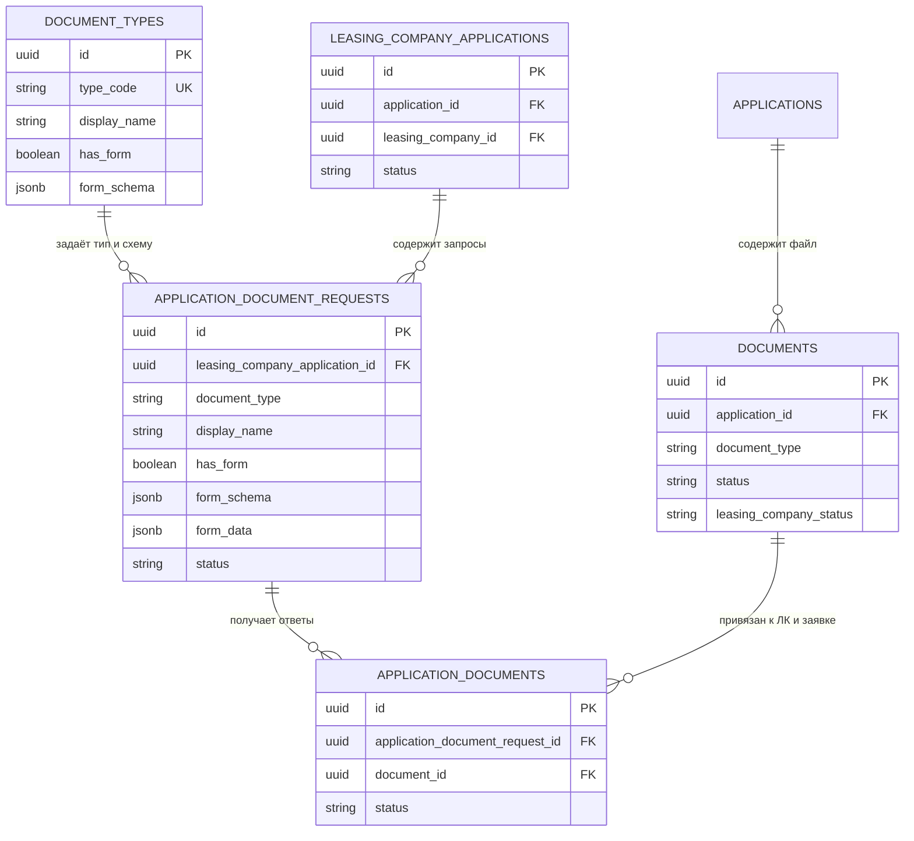
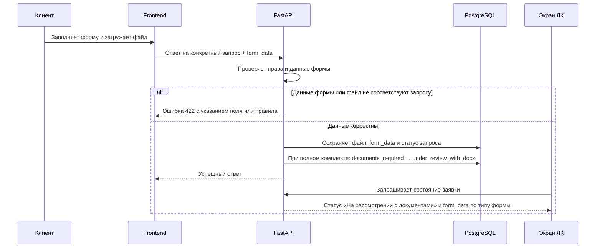

# Исправление typed document requests после первой реализации

- **Bitrix:** #20418
- **Ветка на момент подготовки:** `feature/20418`
- **Статус:** ожидает согласования перед реализацией





## 1. Причина и границы задачи

После первой реализации #20418 обнаружены дефекты в запросах дополнительных документов.

Работа ограничена следующими шестью результатами:

1. миграция typed document requests должна безопасно накатываться на PostgreSQL и соответствовать ORM-схеме;
2. автоматический `company_requisites` должен показывать ЛК статус «Принят» без ручного одобрения;
3. ЛК должна создавать запрос произвольного документа без формы; операция не должна возвращать HTTP 405;
4. клиентская форма `open_bank_accounts` должна показывать поля каждого счёта вертикально;
5. после загрузки клиентом полного комплекта запрошенных документов статус заявки конкретной ЛК должен перейти из `documents_required` в `under_review_with_docs` и обновиться на уже открытом экране ЛК;
6. значения всех четырёх поддерживаемых форм должны отображаться человеку без технических строк вроде `[object Object]`.

В рамках задачи не меняются:

- статусы заявок других ЛК;
- глобальный статус `documents.status` по первому ответу одной ЛК;
- каталог форм, кроме исправления уже существующих четырёх;
- правила маскирования СНИЛС для роли клиента;
- доступ ЛК к документам другой ЛК.

## 2. Наблюдаемое текущее поведение

### 2.1. Миграция

В миграции `123_typed_document_requests.py` отсутствие схемы формы передаётся в SQLAlchemy как `None`. Это корректное представление SQL `NULL` и не должно заменяться на строку, пустой объект или иное значение.

При этом миграция требует реальной проверки на PostgreSQL. Текущая уникальность `idempotency_key` задана глобально для всей таблицы и может конфликтовать между независимыми операциями.

### 2.2. Автоматический `company_requisites`

Сервис создания документа сохраняет признак `approved` у автоматического документа. Экран ЛК показывает бейдж только из статуса связи документа с конкретной ЛК. Для автоматического документа такой статус не попадает в ответ списка, поэтому бейдж не рисуется.

### 2.3. Произвольный документ без формы

Frontend ветки формирует корректный `PUT` на маршрут создания запросов и не передаёт `form_data` для произвольного документа. Backend также не содержит ветки, которая возвращает 405 из-за `has_form=false`.

На тестовом стенде пользователь получил `{"detail":"Метод не поддерживается"}` именно для произвольного документа. Это означает, что необходимо зафиксировать фактический HTTP-запрос и устранить расхождение маршрута/метода между frontend, Nginx и FastAPI. Исправление не должно маскировать ошибку общей надписью.

### 2.4. Расчётные счета

Сейчас строка одного счёта визуально построена горизонтальной сеткой. При длинных значениях это неудобно.

### 2.5. Статус заявки ЛК после ответа клиента

Backend переводит заявку ЛК в `under_review_with_docs`, когда клиент отправил полный набор запрошенных документов. Открытая страница ЛК не получает это обновление: нет обновления состояния после внешнего действия клиента.

### 2.6. Отображение `form_data`

История запросов выводит данные универсальным преобразованием JSON в текст. Для `open_bank_accounts` вложенный объект банка превращается в `[object Object]`. Остальные формы не имеют предметного отображения по типу схемы.

## 3. Согласованные решения

### 3.1. Статус после ответа клиента

После загрузки полного комплекта документов изменяется статус **заявки конкретной ЛК**:

```text
documents_required → under_review_with_docs
```

Глобальный `documents.status` не переводится в `approved` из-за одного ответа ЛК. Решение по документу каждой ЛК остаётся отдельным.

### 3.2. Произвольный документ

ЛК может выбрать «Произвольный документ», указать отображаемое название и создать запрос без формы. Для него сервер сохраняет:

```text
has_form = false
form_schema = null
form_data = null
```

### 3.3. Отображение форм

Интерфейс выводит данные по `form_schema.kind`, а не универсальным преобразованием JSON:

- `main_counterparties`: каждый контрагент отдельным блоком «Название» и «ИНН»;
- `open_bank_accounts`: каждый счёт отдельным блоком «Банк», «БИК», «Номер счёта»;
- `beneficial_owner`: «ФИО выгодоприобретателя»;
- `snils`: формат `XXX-XXX-XXX XX`; для клиента используется уже маскированное сервером значение.

## 4. Планируемые изменения

### 4.1. База данных и миграция

1. Проверить применение миграции `123` на изолированном PostgreSQL через Alembic.
2. Сверить ORM-модели и ограничения БД, чтобы autogenerate не обнаруживал незадекларированных изменений.
3. Исправить область уникальности ключа идемпотентности: ключ должен быть привязан к операции ответа на конкретный запрос документа, а не глобально конфликтовать между независимыми записями.
4. Сохранить инвариант:
   - без формы: `has_form=false`, `form_schema=null`;
   - с формой: `has_form=true`, `form_schema` непустая и поддерживаемая.

### 4.2. Статус автоматического документа

1. В ответе списка документов ЛК вернуть корректный статус автоматического `company_requisites`.
2. На frontend использовать этот статус для отображения бейджа «Принят».
3. Не показывать «Одобрить» у автоматически принятого документа.
4. Не менять отображение статусов документов, не относящихся к этому автоматическому случаю.

### 4.3. Создание произвольного запроса

1. В E2E зафиксировать запрос ЛК на создание произвольного документа.
2. Проверить фактический URL, HTTP-метод и ответ через браузерную сеть и логи FastAPI/Nginx.
3. Устранить точную причину 405 в месте, где она возникает.
4. После исправления `PUT /api/v1/leasing/applications/{applicationId}/request-documents` для `source="custom"` возвращает успешный ответ и создаёт запрос без формы.
5. При HTTP 405 интерфейс показывает: «Не удалось создать запрос документов. Обновите страницу и повторите действие.»; в логе `carcraft-backend` фиксируются HTTP-метод, путь и идентификатор заявки.

### 4.4. Вертикальная форма счетов

Для каждого счёта в ответной модалке клиента расположить последовательно:

1. «Название банка»;
2. «БИК»;
3. «Номер расчётного счёта»;
4. действие удаления записи.

Кнопка «Добавить ещё счёт» добавляет следующий вертикальный блок. Никакая горизонтальная прокрутка для заполнения одного счёта не требуется.

### 4.5. Обновление открытого экрана ЛК

1. После ответа клиента backend оставляет переход `documents_required → under_review_with_docs` атомарным и применяет его только после полного комплекта требуемых ответов.
2. Пока страница заявки ЛК открыта и её статус равен `documents_required`, frontend вызывает `GET /api/v1/leasing/applications/{id}/response` каждые 10 секунд.
3. Опрос прекращается после статуса, отличного от `documents_required`, при уходе со страницы и при закрытии вкладки.
4. После ответа со статусом `under_review_with_docs` верхний статус заявки меняется на «На рассмотрении с документами» не позднее чем через 10 секунд после завершения загрузки клиентом.

### 4.6. Предметное отображение `form_data`

1. Заменить универсальный вывод JSON отдельными компонентами или функциями отображения для четырёх фиксированных типов.
2. Проверить отображение введённых клиентом данных в истории ЛК и в доступном клиенту просмотре.
3. Не выводить полные значения СНИЛС в логах, событиях, аналитике и клиентском повторном просмотре.

## 5. Критерии готовности

1. Миграция `123` и её исправленная версия накатываются на чистую и актуальную тестовую схему PostgreSQL; Alembic autogenerate не предлагает изменений по затронутым таблицам.
2. У автоматически созданного `company_requisites` на экране ЛК отображается бейдж «Принят», а кнопка ручного одобрения отсутствует.
3. ЛК создаёт произвольный запрос без формы; фактический запрос использует `PUT`, не получает 405 и возвращает созданный запрос с `has_form=false`.
4. ЛК по-прежнему создаёт запросы СНИЛС и `open_bank_accounts`; это не регрессирует.
5. У клиента поля одного расчётного счёта расположены вертикально; добавление второго счёта создаёт второй вертикальный блок.
6. После загрузки полного набора клиентских ответов открытая страница соответствующей ЛК отображает статус «На рассмотрении с документами» без ручной перезагрузки браузера.
7. В истории корректно отображаются:
   - два контрагента с названиями и ИНН;
   - два счёта с названием банка, БИК и номером счёта, без `[object Object]`;
   - ФИО выгодоприобретателя;
   - СНИЛС в формате `XXX-XXX-XXX XX` с ролевым маскированием для клиента.
8. Одна ЛК не может увидеть или изменить запрос, файл либо статус другой ЛК по этой же заявке.

## 6. Проверка до MR

Исполнитель выполняет:

1. запуск приложения в Docker Compose;
2. реальный Alembic upgrade и проверку отсутствия schema drift;
3. browser E2E для ЛК: автоматический `company_requisites`, каталоговый запрос, произвольный запрос;
4. browser E2E для клиента: все четыре формы, загрузка файлов и несколько строк списков;
5. E2E прав доступа второй ЛК;
6. проверку логов FastAPI и Nginx после сценариев;
7. линтеры проекта и сборку frontend;
8. проверку test-стенда после MR и подтверждение результата только по факту деплоя.

## 7. Риски

- Изменение глобального статуса файла вместо статуса заявки ЛК исказит данные, если один и тот же документ связан с несколькими ЛК. Это запрещено данным решением.
- Устранение 405 без сохранённого network trace может замаскировать расхождение версий frontend/backend. Сначала воспроизводится и фиксируется исходная причина.
- Данные СНИЛС и банковские реквизиты относятся к чувствительным данным; запрещено добавлять их в логи, события и аналитику.

## 8. Дополнение от 21.09.2026: запросы catalog-типов без формы

Это дополнение задаёт приоритетную, отдельную от остальных пунктов этой спецификации работу. Оно не меняет бизнес-правила статусов, загрузки файлов или отображения формы.

### 8.1. Текущее поведение

В окружении, развёрнутом из `feature/20418`, ЛК успешно создаёт запросы только для типов, у которых `has_form=true` (`snils`, `main_counterparties`, `open_bank_accounts`, `beneficial_owner`). При выборе catalog-типа с `has_form=false`, например `vat_declaration_xml`, `PUT /api/v1/leasing/applications/{application_id}/request-documents` возвращает HTTP 500 с телом `INTERNAL_ERROR`.

Frontend отправляет корректный typed-payload:

```json
{
  "requestedDocuments": [
    {
      "source": "catalog",
      "document_type": "vat_declaration_xml",
      "display_name": "Декларация по НДС"
    }
  ],
  "comments": null
}
```

В текущем коде ветки этот случай должен сохранять на request item значения `has_form=false` и `form_schema=null`. SQL check-constraint миграции также допускает эту пару. Общий HTTP-обработчик скрывает первичное исключение и возвращает клиенту только `INTERNAL_ERROR`; поэтому точная строка backend-ошибки пока не подтверждена.

### 8.2. Требуемое поведение и бизнес-причина

ЛК должна создавать запрос любого существующего catalog-типа независимо от наличия дополнительной формы. Для типа без формы создаётся один `application_document_requests` со значениями:

```text
has_form = false
form_schema = null
form_data = null
status = requested
```

Это нужно, чтобы ЛК могла запросить обычные файлы из каталога, включая декларацию НДС, без искусственного выбора только четырёх типов с анкетой.

### 8.3. Подтверждённый технический дефект доставки и выбранное безопасное решение

В актуальной `test`-ветке Alembic revisions `123` и `124` уже заняты migration `123_monetization_rule_versions.py` и `124_monetization_deal_percentages.py`. В исторической ветке `feature/20418` typed document requests использовали `revision="123"`, а следующая migration — `revision="124"`.

Выбрана отдельная integration-ветка `feature/20418-test-ready` от актуальной `test`. Рабочая `feature/20418` сохранена без переписывания истории: её стенд мог уже применить старые revisions и не должен получать обновлённую цепочку.

В integration-ветке итоговая последовательность:

1. canonical monetization rules: `123`, `down_revision="122"`;
2. canonical monetization deal percentages: `124`, `down_revision="123"`;
3. typed document requests: `125`, `down_revision="124"`;
4. idempotency scope: `126`, `down_revision="125"`;
5. имена файлов совпадают с revision; DDL и данные typed migrations не изменяются при перенумерации.

Перед upgrade общего `test`-стенда владелец БД обязан подтвердить, что его `alembic_version` равен canonical `124`, таблица `monetization_programs` уже содержит `rules_version` и constraint `ck_monetization_program_rules_version`, а schema `monetization_deal_participant_amounts` соответствует migration `124_monetization_deal_percentages`. Любое подозрение, что в эту БД применялась историческая feature migration `123` или `124`, — стоп-условие: запуск Alembic запрещён до отдельного плана reconciliation.

### 8.4. Варианты и решение

1. **Только поменять frontend.** Отклонено: frontend уже отправляет корректный payload, а ошибка приходит после запроса к API.
2. **Подменить `null` пустым объектом или отключить DB constraint.** Отклонено: это нарушит инвариант typed-форм и может скрыть реальную SQL-ошибку.
3. **Рекомендовано: получить первичное исключение по request ID, затем сделать минимальную backend-правку и проверить её на PostgreSQL.** Одновременно исправить revision chain, не изменяя данные и DDL миграций.

### 8.5. План реализации после согласования

1. Синхронизировать отдельную integration-ветку от актуальной `test` с `feature/20418`, не переписывая историю и не меняя рабочий feature-стенд.
2. Перенумеровать только typed Alembic migrations в integration-ветке по п. 8.3 и добавить regression-test уникальности revision и линейной цепочки.
3. По диагностическому запросу из п. 8.7 определить failing-операцию. Подтверждённый результат: Python `None` для JSONB сохранялся как JSON `null`, тогда как check constraint требует SQL `NULL`.
4. Сохранить минимальное production-исправление `JSONB(none_as_null=True)` и явный `sa.null()` в seed migration; не менять payload, типы с формой и правила доступа без необходимости.
5. В изолированной PostgreSQL выполнить Alembic upgrade до head и реальные HTTP-проверки запроса ЛК для одного типа с формой и минимум двух типов без формы.
6. Проверить, что Alembic autogenerate не предлагает изменений схемы после миграций.
7. Перед delivery в общий `test` получить от владельца БД подтверждение canonical-state по п. 8.3; без него не запускать миграции на стенде.

### 8.6. Критерии готовности

1. В integration-ветке Alembic имеет одну голову `126`; canonical `123` и `124` принадлежат monetization migrations, typed migrations идут после них как `125` и `126`.
2. На пустой изолированной PostgreSQL `alembic upgrade head` проходит до `126`; `alembic current`, `heads` и migration-graph test согласованы.
3. После применения миграций запрос с `vat_declaration_xml` возвращает HTTP 200 и создаёт item с `has_form=false`, `form_schema=null`, `form_data=null`.
4. Такой же результат получен как минимум для второго catalog-типа без формы.
5. Запрос `snils` по-прежнему возвращает HTTP 200 и создаёт item с непустой формой.
6. `custom`-документ без формы также возвращает HTTP 200.
7. Перед запуском миграций общего `test`-стенда доказано его canonical состояние из п. 8.3; feature-стенд с историческими `123/124` не обновляется этой веткой.

### 8.7. Диагностический тест, который проводит пользователь

Тест проводится только на уже работающем окружении `feature/20418`; никакие локальные адреса не требуются.

1. Открыть одну и ту же заявку ЛК и запомнить её номер или URL.
2. Открыть инструменты браузера клавишей `F12`, перейти на вкладку **Network** и включить **Preserve log**.
3. Создать запрос для рабочего типа `СНИЛС`. В строке запроса `request-documents` сохранить:
   - точное время с часовым поясом;
   - HTTP status;
   - заголовок ответа `X-Request-ID`;
   - Request Payload и Response.
4. В той же заявке создать запрос только для `Декларация по НДС` (`vat_declaration_xml`). Сохранить те же четыре значения.
5. Передать оба результата без файлов документов и без токенов/cookie. Достаточно скриншотов вкладок **Payload**, **Response** и **Headers**, либо текста этих полей.
6. По `X-Request-ID` приложить одну запись backend-лога с traceback от владельца стенда. Лог не должен включать access token, cookie, СНИЛС, банковские реквизиты или другие персональные данные.

### 8.8. Блокирующий вопрос

Создание MR блокируется только недоступной GitLab API-авторизацией (`glab` token невалиден). Подготовка ветки и локальная верификация продолжаются через Git SSH. Деплой в общий `test` блокируется до подтверждения canonical состояния его БД по п. 8.3.
