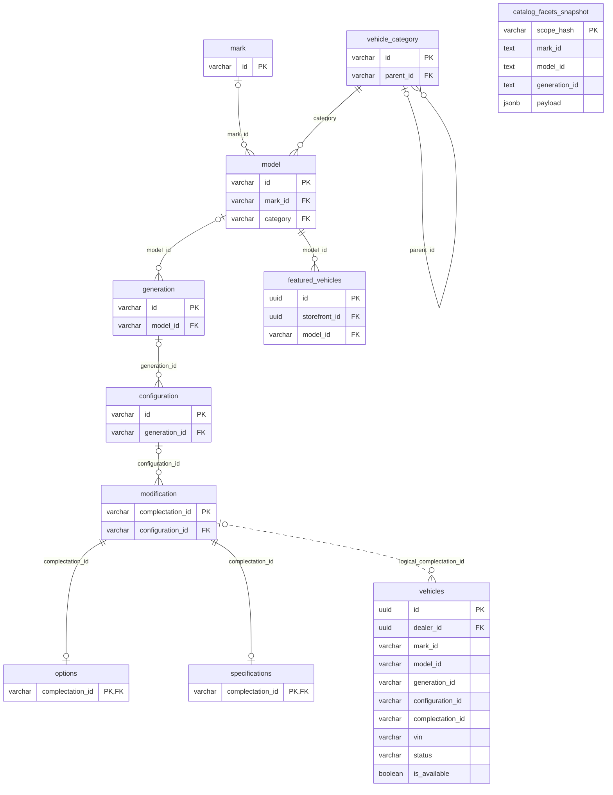
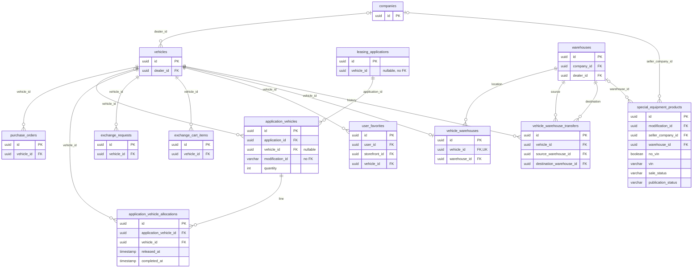
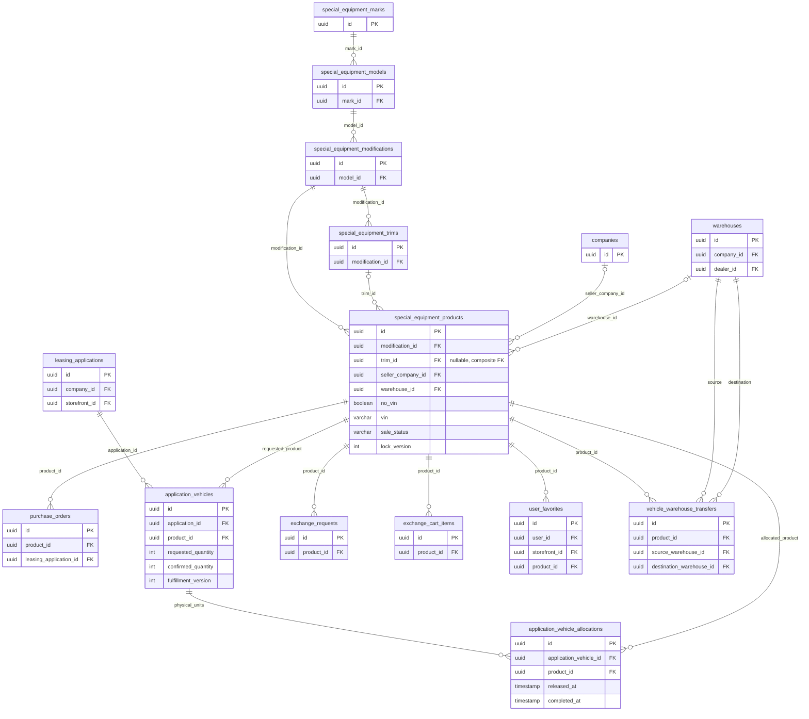
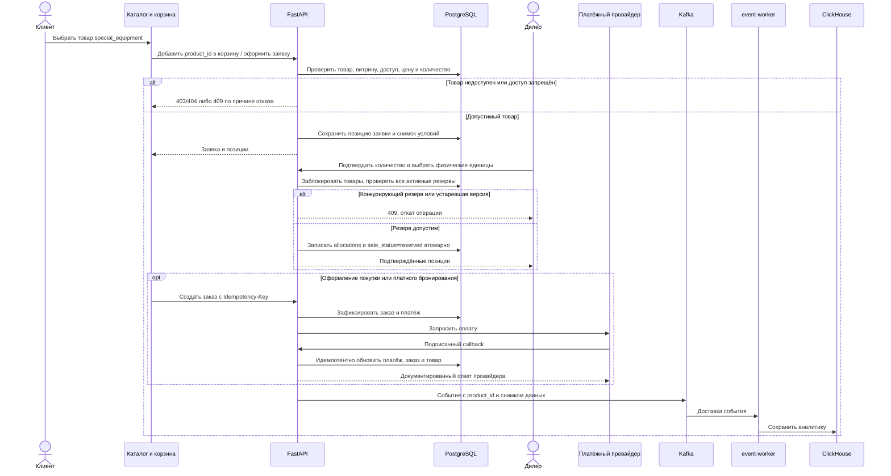

# Переход с автомобильного каталога на special_equipment

- Внутренняя задача без Bitrix: `refactor/retire-legacy-catalog`
- Ветка: `refactor/retire-legacy-catalog`, создана от актуальной `origin/test` (`affb43b7`)
- Статус: согласована, реализация завершена, проверки пройдены
- Дата создания спецификации: 22.09.2026, 02:50:35 MSK (UTC+3)
- Основание: удаление старых таблиц каталога, замена связей с `vehicles` на `special_equipment_products`, удаление страниц `/cars` и `/models`.
- Исходный код: `origin/test`, коммит `affb43b7`. Локальный `test` синхронизирован. Актуальный head миграций Alembic — `124`.
- Терминология: `special_equipment` — подсистема; конкретная целевая таблица товаров — **`special_equipment_products`**, а не таблица с буквальным именем `special_equipment`.

## 1. Структура данных

### 1.1. Текущий удаляемый каталог

Диаграмма отражает ORM на указанном коммите. Связи `vehicles` с каталогом логические: соответствующие поля в текущей ORM не объявлены внешними ключами. Для них связь отмечена словом `logical`, а не обозначением FK у поля. `catalog_facets_snapshot` — самостоятельный кэш.

### 1.2. Текущие связи с vehicles и уже существующий новый каталог

`companies` не содержит FK на `vehicles`: направление обратное — `vehicles.dealer_id → companies.id`. Остальные восемь связей с `vehicles` ниже являются FK. У `application_vehicles.vehicle_id` допускается NULL; у остальных показанных дочерних FK на автомобиль — нет.

### 1.3. Предлагаемая целевая структура

Целевая структура данных для реализации: сохраняются общие таблицы и переводятся на UUID товара `product_id`. Поле `vehicle_id` в рабочих товарных контрактах заменяется на `product_id`. Названия `application_vehicles` и `vehicle_warehouse_transfers` допустимо пока сохранить: массовое косметическое переименование таблиц не является целью.

`vehicle_warehouses` предлагается убрать как дублирующее место хранения: положение товара уже задаётся `special_equipment_products.warehouse_id`. Иначе возникнут два независимо изменяемых «текущих склада». Это дополнительное предлагаемое удаление сверх исходного списка.

Диаграмма показывает основные связи из запроса, а не всю БД. Сохраняются справочники категорий, атрибутов, цветов, изображения, навесное оборудование, составные товары, пользователи, платежи, документы и прочие общие сущности. Для allocations кратность `0..N` отражает историю; одновременно у физической единицы допустимо только одно активное выделение.

### 1.4. Целевой сквозной сценарий

## 2. Цель и границы

Единственным рабочим каталогом товаров становится `special_equipment_products` со своими справочниками. Покупки, лизинговые заявки, подбор и резервирование единиц, биржа, избранное, склады и компании продолжают работать на его данных. Удаляется старый автомобильный каталог и его публичные страницы.

В этом документе не предлагается переименовывать все сущности, содержащие слово `vehicle`, удалять весь файл `vehicles.py` или любые таблицы с похожими названиями. Например, `Warehouse` и `City` сейчас объявлены в `models/vehicles.py`, но используются новым каталогом и должны сохраниться.

### 2.1. Точные таблицы из исходного запроса

| Название в запросе | ORM-класс | Физическая таблица PostgreSQL | Действие |
|---|---|---|---|
| `feuturedvehicle` | `FeaturedVehicle` | `featured_vehicles` | Удалить старую подборку моделей и её админский интерфейс |
| `catalogfacetssnapshot` | `CatalogFacetsSnapshot` | `catalog_facets_snapshot` | Удалить кэш и его обновление |
| `vehiclecategory` | `VehicleCategory` | `vehicle_category` | Удалить старый справочник категорий |
| `specification` | `Specifications` | `specifications` | Удалить старые характеристики |
| `options` | `Options` | `options` | Удалить старые опции |
| `modification` | `Modification` | `modification` | Удалить старые комплектации |
| `configuration` | `Configuration` | `configuration` | Удалить старые конфигурации |
| `generation` | `Generation` | `generation` | Удалить поколения |
| `carmodel` | `CarModel` | `model` | Удалить старые модели |
| `mark` | `Mark` | `mark` | Удалить старые марки |

**Решение:** после устранения всех зависимостей таблица `vehicles` удаляется полностью. Ни в одном новом или действующем пользовательском сценарии `vehicles` не участвует.

### 2.2. Данные

**Решение по данным:** перенос старого автомобильного каталога и его тестовых данных не требуется.

При этом строго соблюдаются ограничения:

- переиспользовать UUID старого автомобиля как UUID нового товара без явного соответствия;
- удалять общие компании, пользователей, склады и настройки витрин;
- каскадно уничтожать заявки, платежи, документы, компенсации или финансовые снимки только ради успешного DROP;
- стирать существующие данные нового каталога и его коммерческого контура.

Перед реализацией необходима инвентаризация целевой БД. При обнаружении сохраняемых ссылок нужен явный план сохранения/архивации; миграция не должна молча обнулять их. Автоматический перенос автомобильных марок, моделей, конфигураций и характеристик в новые справочники в основной вариант не входит.

## 3. Замена связей из запроса

| Сущность и текущее состояние | Целевое изменение | Обязательные инварианты |
|---|---|---|
| `purchase_orders.vehicle_id → vehicles.id` | `product_id UUID NOT NULL → special_equipment_products.id` | Сохранить платежи, график, бронирование, покупку, лизинг, отмену и возврат. Запрет удаления товара с заказами: `RESTRICT`. Для составного заказа сохранить отдельные позиции и их снимки. |
| `application_vehicles.vehicle_id → vehicles.id`, поле nullable | Позиция с товаром получает `product_id → special_equipment_products.id`; использовать товар `on_order` для заказа под поставку | Сохранить назначения дилера/сотрудников, количество, цену, скидку, наценку, документы и историю. Пустая заявка может иметь 0 позиций; не создавать фиктивный товар. Перевод существующих позиций без vehicle_id требует отдельного решения о данных. |
| `application_vehicle_allocations.vehicle_id → vehicles.id` | `product_id UUID NOT NULL → special_equipment_products.id` | Одна активная allocation на физический товар; частичный уникальный индекс по `product_id WHERE released_at IS NULL`. Сохранить `completed_at`, освобождение, срок резерва и историю. Allocation не создаёт вторую коммерческую цену/позицию. |
| `exchange_requests.vehicle_id → vehicles.id` | `product_id UUID NOT NULL → special_equipment_products.id` | Сохранить количество, срок, заявки/предложения дилеров, выбранную поддержку, вложения, складские связи, пакетные номера и дистрибьютора. История защищена `RESTRICT`. |
| `exchange_cart_items.vehicle_id → vehicles.id` | `product_id UUID NOT NULL → special_equipment_products.id` | Уникальность пользователь + товар; права ЛК; сохранение количества, фильтров складов и выбранной поддержки. Корзина не резервирует товар сама по себе. |
| `user_favorites.vehicle_id → vehicles.id` | `product_id UUID NOT NULL → special_equipment_products.id` | Уникальность `(user_id, storefront_id, product_id)`; добавление/удаление идемпотентны; изоляция витрин сохраняется. |
| `vehicle_warehouse_transfers.vehicle_id → vehicles.id` | `product_id UUID NOT NULL → special_equipment_products.id` | Сохранить исходный/целевой склады, автора и время. Запись истории и смена текущего склада атомарны; источник и назначение различаются. История не удаляется каскадом. |
| В запросе `vehicle_warehouse`; фактически `vehicle_warehouses` | Использовать существующее `special_equipment_products.warehouse_id → warehouses.id`, затем удалить старую связующую таблицу | Один текущий склад. Запрещено параллельно хранить его в двух таблицах. Применяются правила VIN/no-VIN нового каталога. |
| `companies` и `vehicles` | Сохранить `companies`; каталог связывать через существующее `special_equipment_products.seller_company_id → companies.id` | Продавец товара, владелец склада и дилер заявки — разные роли. Не подменять автоматически продавца владельцем склада. Обновить статистику и проверки доступа компаний. |

Для `exchange_cart_items` допустимо сохранить удаление зависимой временной строки при удалении товара (`CASCADE`); для избранного — также. Для коммерческих документов, выделенных единиц и истории — `RESTRICT`. Существующие ограничения и индексы на `vehicle_id` пересоздать с `product_id` и понятными именами.

### 3.1. Поля каталога в общих сущностях

- `application_vehicles.modification_id` сейчас строка без FK. Для новой позиции модификация и комплектация определяются через `product_id → special_equipment_products.modification_id/trim_id`; старое поле удалить после переписывания потребителей. Не дублировать независимые значения, способные противоречить товару.
- Старый `is_model_order` заменить использованием существующего сценария товара `on_order`/предзаказа. В UI не должно остаться оформления через удалённые автомобильные `Modification`.
- `leasing_applications.vehicle_id` — одиночное поле без FK. Предлагается удалить его и использовать позиции заявки как единственный состав заявки. Многопозиционную заявку нельзя сводить к «первому автомобилю».
- `application_vehicles.car_status` — состояние обработки позиции, а `special_equipment_products.sale_status` — состояние товара. Это разные состояния. Сохранить бизнес-смысл `cars_status`, при необходимости переименовать контракт отдельно; не удалять справочник только из-за слова `cars`.

## 4. Параллельные коммерческие контуры: обязательное проектное решение

В `test` уже существуют `special_equipment_favorites`, `special_equipment_cart_items`, `special_equipment_application_items`, `special_equipment_purchase_orders`, `special_equipment_order_items`, `special_equipment_payments`, `special_equipment_payment_callback_inbox`, `special_equipment_leasing_payment_schedule`, `special_equipment_price_change_log` и квитанции переноса гостевой корзины.

Простая замена FK в старых таблицах создаст два контура работы с **одним товаром**. Один товар сможет оказаться одновременно в старом и новом заказе, а изменения цены, избранного и состояния разойдутся. Уникального индекса только в `application_vehicle_allocations` для защиты от заказа из другой таблицы недостаточно.

**Принятое решение:** сохранить общие сущности из запроса, перевести их на товары (`product_id`) и свести рабочие операции в единый набор репозиториев. Перенести в него необходимые возможности существующего special-equipment commerce. Именно этот вариант показан на целевой ERD.

| Сейчас два источника | Предлагаемый единый источник | Что необходимо сохранить из special-equipment commerce |
|---|---|---|
| `user_favorites` / `special_equipment_favorites` | `user_favorites` с `product_id` | Добавление, удаление, обогащение карточек; добавить/сохранить `storefront_id` во всём сценарии |
| `shopping_cart` / `special_equipment_cart_items` | `shopping_cart` с `product_id` | Родительские позиции, составные товары/навесное, количество, выбранность, цена, оборудование и услуги |
| `guest_cart_transfers` / `special_equipment_guest_cart_transfers` | Один механизм квитанций переноса | Идемпотентность, хеш запроса, результат повтора, привязка к пользователю и витрине |
| `application_vehicles` / `special_equipment_application_items` | `application_vehicles` с `product_id` | `group_id`, `parent_group_id`, `item_role`, seller snapshot, `price_status`, автор/время цены, снимок товара и журнал изменений цены |
| `purchase_orders` / `special_equipment_purchase_orders` | `purchase_orders` с `product_id` | Предзаказ, состав заказа, снимки, Idempotency-Key, request hash, срок удержания, отмена и аудит возврата |
| `payments` / `special_equipment_payments` и два графика | Общие платежи и графики, привязанные к единому заказу | Подписанные callbacks, inbox/retry/manual review, сверка, чеки, фискализация и защита от повторной обработки |

Подчинённые таблицы позиций заказа, inbox и журнала цены можно переиспользовать, переподключив их FK к единому заказу/платежу/позиции. Массовое переименование всех этих таблиц не требуется. Прежние параллельные таблицы выводятся из активного чтения/записи только после проверки паритета. Их DROP **не включён автоматически** в исходный список удаления: отдельный шаг определяется наличием данных и утверждённым вариантом консолидации.

Альтернатива, требующая изменения формулировки исходного запроса: оставить коммерческие таблицы `special_equipment_*` каноническими и перенести в них назначения дилеров, allocations, финансовые связи и другие возможности старых общих таблиц. Это уже замена самих `PurchaseOrder`/`ApplicationVehicle` и связанных моделей, а не только их связей с каталогом. Нельзя одновременно реализовать оба варианта или незаметно выбрать второй вместо первого.

## 5. Дополнительные зависимости, без которых удаление не завершить

### 5.1. Марки, модели, поддержка и доступ дистрибьюторов

| Место | Что подтверждено исходниками | План |
|---|---|---|
| `distributor_brands.brand_id` | Строковый FK на `mark.id` | Перевести на UUID `special_equipment_marks.id`, обновить уникальность, API, выбор брендов и доступ дистрибьютора |
| `support_programs.mark_id` | FK на `mark.id` | Перевести на новый справочник марок |
| `support_programs.model_id` | FK на `model.id` | Перевести на `special_equipment_models.id` |
| `support_programs.model_ids` | Массив строк без FK | Перевести в согласованный UUID-контракт нового каталога; проверять существование и принадлежность выбранным маркам |
| `support_program_marks.mark_id` | Строковый FK на `mark.id` | Пересоздать ссылку на UUID марки нового каталога; обновить составной PK |
| `warehouses.brand` | Строка без FK, используется старым кодом привязки по марке | Бренд товара получать через новый каталог; не связывать доступ с произвольным текстом. Миграция поля склада в отдельный справочный FK не подразумевается автоматически |

Не удалять программы поддержки и дистрибьюторские права вместе с `mark`. Новые UUID нельзя получать приведением старых строковых кодов. Если данные необходимо сохранить, требуется явная проверенная таблица соответствий; угадывание по похожему названию запрещено.

### 5.2. Ссылки без FK, JSON, история и фоновые операции

| Зависимость | Необходимое изменение |
|---|---|
| `shopping_cart.vehicle_id`, `guest_cart_transfers.vehicle_id` | Перевести на product-контракт и единый контур корзины; обновить уникальности, перенос гостевой корзины, количество и явное согласие на заказ сверх наличия |
| `leasing_application_vehicle_calculations.vehicle_id` | Перевести расчёт на товар/позицию заявки; корректно различать UUID позиции и UUID товара |
| `calculation_history.vehicle_ids` | Перевести новые записи на UUID товаров; старые исторические снимки не считать ссылками на новые товары |
| `leasing_application_calculations.support_per_vehicle`, `calculations_per_vehicle` | Переписать ключи и чтение новых расчётов; не оставлять скрытый lookup в `vehicles` |
| `application_applied_supports.vehicle_id`, `compensations.vehicle_id` | Согласовать product-контракт, расчёт и выдачу данных; сохранить неизменяемые суммы/снимки поддержки |
| `application_vehicle_fulfillment_history.previous_values/new_values` | Для новых событий использовать `product_ids`; сохранить историю количества, резерва и автора |
| `application_vehicle_dealer_distributions`, `application_vehicle_dealer_action_documents` | Сохранить FK на позицию заявки и действующие сценарии назначения/действий/документов; их наличие исключает удаление `application_vehicles` одним DROP |
| `monetization_catalog_repository`, `monetization_source_repository` | Перевести подбор каталогов и формирование источников сделки с Vehicle/Mark/CarModel/Modification на новый каталог и allocations |
| `monetization_deals.vehicles`, `source_snapshot` | Не пересчитывать и не переписывать зафиксированные финансовые снимки из живого каталога; новые снимки содержат product-контракт и явный тип источника |
| Статистика компаний, админские отчёты, reporting | Заменить JOIN и счётчики автомобилей; считать товары без умножения на число заявок/allocations |
| DWH/Kafka, `application/dwh_enrichment.py` | Заменить обогащение через `vehicle_repository`; определить версию событий и обработку старых сообщений. Запись ClickHouse остаётся у event-worker |
| Catalog import / facets / vehicle images / deletion jobs | Убрать обработчики старого каталога, импорты, восстановление старых очередей и периодические задания; сохранить импорт, медиа и очистку объектов нового каталога |
| Browser storage и guest state | Версионировать формат, убрать старые записи типа `vehicle` по адресным ключам; не переинтерпретировать их UUID как товары и не чистить весь localStorage |

### 5.3. SQL-триггеры — отдельная часть миграции

На текущем `test` простого поиска FK недостаточно:

1. Миграция `118_vehicle_reference_guards.py` создаёт `guard_vehicle_scalar_reference()` и триггеры на `leasing_applications`, `shopping_cart`, `compensations`, `application_applied_supports`, `leasing_application_vehicle_calculations`, `guest_cart_transfers`. Они явно выполняют `SELECT ... FROM vehicles`.
2. Там же `guard_vehicle_array_references()` проверяет `calculation_history.vehicle_ids` через `vehicles`.
3. Миграция `119_vehicle_fulfillment.py` создаёт `protect_allocated_vehicle()` и триггер на `vehicles`, защищающий выделенную физическую единицу.
4. Миграция `096_special_equipment_warehouse_lifecycle.py` создаёт `warehouses_delete_blocked()`, которая, помимо нового каталога, читает `vehicle_warehouses` и `vehicle_warehouse_transfers`.

В новой миграции явно удалить/заменить эти триггеры и функции. Для обычных живых ссылок предпочесть настоящие FK на товар; для массивов/снимков отдельно определить правила. Защиту выделенного товара перенести на новый жизненный цикл. Проверки no-VIN, активного склада и запрета удаления занятого склада сохранить.

Не применять `DROP ... CASCADE` как способ найти и удалить неизвестные зависимости. После миграции в определениях функций, триггеров, представлений и ограничений не должно остаться активного обращения к удалённым таблицам.

## 6. Требования к поведению

### 6.1. Идентификаторы и каталог

- Все новые ссылки на товары, марки, модели, модификации и комплектации нового каталога — UUID в backend и непрозрачные строки на frontend.
- HTTP принимает `product_id`/`product_ids`. Не вводить fallback вида «сначала product_id, иначе vehicle_id» и поиск одного UUID сразу в двух каталогах.
- Отображаемые марка/модель/характеристики берутся из новых справочников и атрибутов. Старые `Options`/`Specifications` не копируются в API под видом нового каталога.
- Историческое наименование/цена в заказе, заявке, платеже и финансовом документе берутся из предусмотренного снимка, когда контракт требует фиксированных условий.
- Сохраняются VIN/no-VIN, категории, новые/бывшие в употреблении товары, цвета, комплектации, изображения, составные товары и совместимое навесное.

### 6.2. Количество, выделение единиц и состояния

- Различать запрошенное предложение и реально выделенные физические товары. `application_vehicles.product_id` описывает заказанную позицию; `application_vehicle_allocations.product_id` — подобранную физическую единицу.
- Несколько единиц поставки — несколько допустимых физических товаров/allocations. Не умножать один VIN на quantity. Сценарий `on_order` до подбора физического товара не создаёт фиктивную складскую единицу.
- `requested_quantity`, `confirmed_quantity` и `fulfillment_version` сохранить; сумма подтверждения, цена и итог заявки пересчитываются атомарно.
- Единый механизм проверки занятости видит allocations, заказы, позиции заказа, резервы лизинговых заявок и резервируемые компоненты. Все конкурирующие операции блокируют одни и те же строки товаров в согласованном порядке.
- Завершённое выделение единицы не освобождается обычным истечением резерва. Отмена/истечение освобождают товар только при отсутствии другого действующего основания удержания.
- Изменение VIN, модификации, продавца, склада или импорта занятого товара должно соблюдать новый общий guard и `lock_version`; импорт не возвращает проданный/зарезервированный товар в наличие.
- `publication_status` и `sale_status` остаются отдельными состояниями. `price_on_request`, `price_from` и уточнение цены дилером сохраняются; отсутствие цены нельзя превращать в бесплатную покупку.

### 6.3. Компании и склады

- Права вычисляются по активному пользователю, компании, роли, дилерским/дистрибьюторским связям, брендам и доступным складам. Пустой разрешённый список никогда не превращается в доступ ко всем складам.
- Товарный продавец (`seller_company_id`), собственник склада и назначенный дилер заявки не отождествляются механическим переименованием `dealer_id`.
- Перемещение меняет `product.warehouse_id` и добавляет историю в одной транзакции; продавец не меняется неявно от смены склада.
- Сохранить текущий контракт пакетного перемещения с результатом по позициям: перемещённые/пропущенные и причины; если не перемещено ничего — 409. Не заявлять полную атомарность всего выбранного списка при разрешённом частичном результате; атомарны изменения и история каждой успешно перемещаемой единицы в транзакции запроса.
- Товар с `no_vin=true` не получает склад. Для доступного VIN-товара обязателен допустимый активный склад согласно действующим правилам special equipment.
- Справочники `warehouses` и `cities`, привязка складов к витринам и складские связи биржи сохраняются.

### 6.4. API и фоновые процессы

- Удалить старые публичные cars API и их scoped-варианты после переключения всех клиентов; убрать их регистрацию, OpenAPI и исключения аутентификации.
- Старые автомобильные admin/catalog/import/image/featured API удалить либо заменить специализированными операциями нового каталога. Общие покупки, заявки, биржу и склады сохранить с product-контрактом.
- Составить точный перечень URL при реализации из зарегистрированных роутеров, включая вложенные пути. Одинаковое слово `models` в API нового каталога не является основанием для удаления.
- Существующие special-equipment commerce URL, если они остаются целевым публичным контрактом, должны обращаться к единому хранилищу и бизнес-операциям; два независимых writer-пути недопустимы.
- Для изменённых endpoint определить ответы: 401 без токена, 403 при запрете роли/действия, 404 для отсутствующей/недоступной сущности по принятому контракту, 409 при занятости/устаревшей версии/конфликте, 422 для неверной формы данных. Не маскировать все ошибки в 200.
- Не менять JWT- и webhook-контракты. Платёжный callback проверяет подпись провайдера и идемпотентно обрабатывает повтор/задержку.
- Остановить старые producers и задачи восстановления очередей до DROP. Для накопленных сообщений предусмотреть осмысленное завершение/отклонение, без бесконечных retries к несуществующей таблице.

## 7. Frontend: удалить cars/models и переключить весь путь пользователя

### 7.1. Маршруты

Удалить страницы:

- `frontend/pages/cars/index.vue`;
- `frontend/pages/cars/[id].vue`;
- `frontend/pages/models/index.vue`;
- `frontend/pages/models/[brandId].vue`.

Удалить соответствующие записи `frontend/features/storefront/routeManifest.ts`, включая `/:storefrontSlug/cars`, `/:storefrontSlug/cars/:id`, `/:storefrontSlug/models`, `/:storefrontSlug/models/:brandId`.

Целевые пользовательские ссылки: `/special-equipment`, `/special-equipment/categories/...`, `/special-equipment/products/:id/:slug` и их существующие варианты витрин. Для старых `/cars`, `/models` и их вложенных страниц отдаётся **404**, без страницы-заглушки, скрытой загрузки старого API или автоматического переиспользования старых ID.

### 7.2. Потребители, которые нужно переключить

Обязательная область проверки: `TheHeader`, `TheFooter`, `HeroBanner`, главная, «О нас», корзина и её пустое состояние, условия лизинга, калькулятор, избранное/его уведомитель, заказы, карточки заявок, биржевая корзина/запрос, checkout-модалки, складской и административный интерфейсы, программы поддержки и монетизация.

На текущем коммите эти места используют `/cars`, `createCarsApi`, `CarCard`, `CarsStock`, `useVehicleAvailability`, старые фасеты и адаптер `vehicle` в `features/commerce`. Их необходимо удалить или перевести на публичные интерфейсы `features/specialEquipment`. Общие компоненты изображений/карусели, если они нужны другому функционалу, сначала вынести из удаляемого feature.

Убрать ветвление корзины/заказов по двум каталогам там, где оно больше не нужно. Старый `item_type=vehicle` не должен попадать в новые запросы. Сохранить единые пользовательские страницы корзины, оформления, заявок и заказов, а не прятать исчезнувшую функциональность за удалением ссылки.

### 7.3. Настройки витрин

Удаления Vue-страниц недостаточно: `catalog_storefronts.home_page_key`, `public_page_titles`, `catalog_blocks`, ограничения JSON в БД, Pydantic-схемы, `domain/storefronts.py`, `domain/section_visibility.py` и frontend `publicUi.ts` содержат старые ключи `catalog`/`models`.

План:

1. Удалить выбор старых страниц в настройках и обновить набор допустимых ключей в ORM, миграции, backend/frontend-схемах и JSON import/export.
2. Для витрин с `home_page_key=catalog/models` выбрать новый каталог, если он разрешён для витрины; иначе безопасную существующую главную. Не делать невидимый каталог публичным ради исправления ссылки.
3. Удалить автомобильные featured-блоки и фасетные настройки (`cars_brand_filter` и другие фактически найденные ключи). Не переносить их автоматически на новый каталог с другой структурой фильтров.
4. Сохранить тему, цвета, шрифты, логотипы, slug, доступные склады и ограничения витрины.
5. Проверить экспорт → импорт настроек, старые сохранённые конфигурации и гостевые состояния. Не оставлять CHECK constraint, который требует удалённый JSON-ключ.
6. После удаления зарезервировать `cars`/`models` от случайного использования как slug витрины, если это необходимо для предсказуемого ответа по старым адресам.

Все UI-проверки — desktop с viewport не менее 768 CSS px.

## 8. План реализации и порядок миграции

### Этап 0. Уточнить границу перехода

Зафиксировать решения из раздела 10, повторно синхронизировать `test`, пересмотреть изменения после зафиксированного SHA. В целевой БД снять точный перечень таблиц, FK, индексов, функций, триггеров, представлений и количества связанных данных; отдельно проверить очереди, объекты S3 и внешних API-потребителей. Старые миграции не редактировать и не удалять.

### Этап 1. Подготовить общий product-контракт

Согласовать единственный контур хранения из раздела 4. Определить поля и ограничения общих сущностей, item snapshots, роли составных позиций, состояния, резервирование, цены, права и события. Для backend соблюдать `presentation → application → infrastructure → domain`: SQL/ORM остаются в репозиториях, бизнес-правила — в domain, оркестрация — в application, HTTP/commit — в presentation. Репозитории возвращают словари, а не ORM.

### Этап 2. Перевести backend по функциональным блокам

После реализации в отдельной задаче работу можно разделить на независимые направления: коммерция/платежи; заявки/allocations; биржа/поддержка/монетизация; склады/компании/доступ. Общую схему и миграции ведёт один ответственный, чтобы избежать конфликтующих ревизий. Все направления используют один согласованный механизм блокировок товара и проверки активных резервов.

Перед DROP требуется функциональный паритет, включая дополнительные зависимости из раздела 5. Смена FK сама по себе не завершает этап.

### Этап 3. Перевести frontend и настройки

Переключить перечисленных потребителей, каталог, роли, ссылки и настройки витрин. Затем удалить старые страницы и неиспользуемый `features/cars`, старые импорты/типы/адаптеры. Удалять только подтверждённо неиспользуемый код.

### Этап 4. Выпустить управляемую миграцию БД

1. Добавить целевые поля/ограничения, необходимые для единого контура; перенастроить подчинённые FK. Номер ревизии выбрать от актуального head, не резервировать сейчас `124`.
2. Обработать данные строго по согласованному режиму. При отсутствии переносимых старых данных не генерировать искусственные соответствия автомобилей товарам. Существующие special-equipment записи и общие документы сохранить согласно выбранной консолидации.
3. Перевести ссылки брендов/моделей поддержки и дистрибьюторов на новые UUID; обновить массивы, JSON, индексы и публичные настройки.
4. Переписать/снять триггеры `118`, `119` и зависимые ветви `096`; установить целевые защиты товара/склада.
5. Перевести историю складских перемещений на товар, исключить чтение/запись `vehicle_warehouses`; удалить её только после проверки всех зависимостей.
6. Удалить старые поля и FK на `vehicles`. Удалить саму таблицу `vehicles`.
7. Удалить `featured_vehicles`, `catalog_facets_snapshot`, затем `options`, `specifications`, `modification`, `configuration`, `generation`, `model`, `mark`, `vehicle_category`, учитывая фактический граф зависимостей. Внешние ссылки на `mark/model` должны быть сняты до этих DROP.
8. Проверить, что `Base.metadata`, Alembic и фактическая схема совпадают. Проверить определения SQL-функций и триггеров отдельно: одного `alembic check` для них недостаточно.

Безопасный вариант выкладки для такого среза — согласованная остановка затронутых старых writer-процессов, завершение активных операций, миграция и запуск совместимых API/frontend/workers. Старый контейнер не должен продолжать писать в удалённые таблицы. Если требуется обновление без остановки, нужен отдельный план расширения/переключения/сжатия схемы; простой DROP под работающим старым кодом не подходит.

Откат после удаления данных нельзя обещать через один `alembic downgrade`. Если DROP удаляет данные, восстановление требует проверенного снимка БД и согласованного отката приложений; восстановление пустых таблиц не восстанавливает историю.

### Этап 5. Проверить и завершить удаление потребителей

Выполнить проверки раздела 9 на изолированном Docker-окружении. После завершённой серии изменений повторить `ix map . --silent` и `ix doctor` в корне фактического worktree. Проверить diff, отсутствие активных legacy-зависимостей и логи. Обновлять этот документ при изменении проектных решений, не плодить отдельные планы.

## 9. Критерии готовности реализации

### 9.1. Схема и исходники

- Десять таблиц из исходного перечня отсутствуют; `vehicles` и `vehicle_warehouses` удалены только в согласованном объёме.
- В рабочих FK/SQL/ORM нет обращений к удалённым таблицам. Исторические Alembic-ревизии сохраняют старые определения для воспроизводимого обновления с нуля.
- Все сущности раздела 3 работают на товарах; программы поддержки и доступ дистрибьюторов — на UUID новых марок/моделей.
- Нет двух активных источников избранного/корзины/состава заявки/заказа и двух независимых механизмов резерва одного товара.
- Сохранены общие компании, склады, города, пользователи, документы и данные действующего нового каталога.
- На пустой БД и на подготовленной БД предыдущей версии выполняются `uv run alembic upgrade head` и `uv run alembic check`; обязательный результат проверки — `No new upgrade operations detected.` Без `stamp` и маскирования различий фильтрами.
- Выполнены Ruff, import-linter и mypy для backend; не добавлены ошибки TypeScript в затронутых stores/composables/API. Unit- и архитектурные тесты не добавляются/не запускаются без прямого запроса.

### 9.2. Матрица сквозных проверок

| № | Реальный сценарий | Ожидаемый результат |
|---|---|---|
| E01 | Открыть новый каталог, категорию, карточку, фильтры и изображения | Данные special equipment, корректная доступность/цена, нет запросов в cars API |
| E02 | Открыть `/cars`, `/cars/:id`, `/models`, `/models/:brandId` и их варианты витрин | Предсказуемый 404 согласно принятому решению; отсутствуют старые страницы/загрузки |
| E03 | Перейти по header/footer, главной, empty-state, калькулятору, заказу, заявке и бирже | Все рабочие ссылки ведут в новый каталог/товар с правильной витриной |
| E04 | Гость добавляет избранное и корзину, входит, повторяет перенос | Нет дублей, идемпотентность, сохранены товары, витрина и выбранные позиции |
| E05 | Открыть две витрины и недоступный товар по прямому ID | Корзины/избранное не смешиваются; ограничения товара/склада не обходятся |
| E06 | Создать заявку с несколькими товарами, количеством, услугами и оборудованием | Правильный состав/итог, назначения сотрудников/дилеров, документы и просмотр ЛК |
| E07 | Уточнить цену «по запросу», оформить on-order/предзаказ | Нет нулевой покупки, нет фиктивного VIN/остатка; новая цена имеет автора/историю |
| E08 | Подобрать физические единицы; две одновременные заявки/заказ претендуют на один товар | Резерв получает только один владелец; конкурент получает 409, без частично записанного подтверждения |
| E09 | Истечение, снятие/замена резерва, завершение сделки, повтор операции | Правильные allocations, состояние товара, история и суммы; проданная единица не освобождается |
| E10 | Бронирование, полная покупка, лизинг, доплата, график, callback-дубликат, отказ и возврат | Нет двойной оплаты/списания; документы и чеки доступны; повтор callback идемпотентен |
| E11 | Товар с навесным/компонентами в корзине, заявке и заказе | Правильные группы, цены, снимки, выделение и освобождение каждого компонента |
| E12 | ЛК отправляет биржевой запрос; дилер отвечает; предложение выбирается | Сохранены роли, количество, склады, сроки, вложения, поддержка и история |
| E13 | Переместить товар; недоступный/неактивный склад; чужая компания; занятый товар; частичный batch | Корректные разрешения, причины пропусков, состояние склада и ровно одна запись истории на фактическое перемещение |
| E14 | Удалить склад с товарами/историей; изменить VIN/no-VIN и импортировать занятую единицу | Ограничения нового каталога соблюдены, нет тихого освобождения/перепривязки |
| E15 | Создать/применить поддержку по новой марке/модели, построить компенсацию и монетизацию | Правильная применимость, суммы, источники и неизменяемые финансовые снимки |
| E16 | Проверить бренд дистрибьютора, назначения дилера, счётчики компании и доступ к складам | Нет старых JOIN; права не расширились, счётчики не дублируются |
| E17 | Открыть/экспортировать/импортировать настройки витрины с бывшей домашней cars/models | Валидная новая конфигурация, нет битых redirects, сохранена тема и видимость |
| E18 | Перезапустить workers с подготовленными старыми сообщениями, получить новое событие в DWH | Нет повторяющихся SQL-ошибок; новое событие обрабатывается, ClickHouse пишет только event-worker |

Для write-сценариев проверять HTTP/UI и фактический результат в БД; для UI — браузер на работающем приложении. Общий `bash scripts/e2e/run.sh` не доказывает сценарии, которых в нём нет: нужные E2E добавить/обновить либо выполнить вручную с фиксацией результата. После проверок изучить логи API, frontend, scheduler/worker и event-worker: отсутствуют обращения к удалённым relation, ошибки сериализации и бесконечные повторы.

## 10. Зафиксированные решения

| Вопрос | Принятое решение | Статус |
|---|---|---|
| Удалять ли саму `vehicles`? | Да, после полного перевода зависимостей таблица `vehicles` удаляется | Утверждено для реализации |
| Требуется ли перенос автомобильных данных? | Нет, но строго сохранять общие сущности и существующие данные special equipment | Утверждено для реализации |
| Как свести два коммерческих контура? | Сохранить общие таблицы из запроса, перевести их на товары (`product_id`) и свести операции в единый набор репозиториев | Утверждено для реализации |
| Что делать с `vehicle_warehouses`? | Удалить дублирующую таблицу, использовать `special_equipment_products.warehouse_id` | Утверждено для реализации |
| Что возвращают старые `/cars` и `/models`? | 404, без redirects и без обращения к старым данным | Утверждено для реализации |
| Переносить ли подборку featured на новый каталог? | Удалить старую подборку; новый featured-механизм отдельно не создавать | Утверждено для реализации |

Все архитектурные и прикладные решения согласованы и зафиксированы для выполнения задачи.

## 11. Проверенные исходники

Все ссылки закреплены за проверенным коммитом, а не за изменяемой веткой.

| Область | Источник |
|---|---|
| Старый каталог и точные имена таблиц | [models/catalog.py](https://gitlab.carcraft.ru/carcraft/carcraft-leadgenerator/-/blob/5935cd07f738114062b1ed0b447fd9625dbe21da/backend/infrastructure/models/catalog.py) |
| Vehicles, общие склады/города, featured, связи и перемещения | [models/vehicles.py](https://gitlab.carcraft.ru/carcraft/carcraft-leadgenerator/-/blob/5935cd07f738114062b1ed0b447fd9625dbe21da/backend/infrastructure/models/vehicles.py) |
| Заявки, корзина, расчёты, allocations и дилерские назначения | [models/applications.py](https://gitlab.carcraft.ru/carcraft/carcraft-leadgenerator/-/blob/5935cd07f738114062b1ed0b447fd9625dbe21da/backend/infrastructure/models/applications.py) |
| Покупки и платежи | [models/payments.py](https://gitlab.carcraft.ru/carcraft/carcraft-leadgenerator/-/blob/5935cd07f738114062b1ed0b447fd9625dbe21da/backend/infrastructure/models/payments.py) |
| Биржа | [models/exchange.py](https://gitlab.carcraft.ru/carcraft/carcraft-leadgenerator/-/blob/5935cd07f738114062b1ed0b447fd9625dbe21da/backend/infrastructure/models/exchange.py) |
| Новый каталог и существующий warehouse_id | [models/special_equipment.py](https://gitlab.carcraft.ru/carcraft/carcraft-leadgenerator/-/blob/5935cd07f738114062b1ed0b447fd9625dbe21da/backend/infrastructure/models/special_equipment.py) |
| Параллельный коммерческий контур special equipment | [models/special_equipment_commerce.py](https://gitlab.carcraft.ru/carcraft/carcraft-leadgenerator/-/blob/5935cd07f738114062b1ed0b447fd9625dbe21da/backend/infrastructure/models/special_equipment_commerce.py) |
| Компании и distributor_brands | [models/companies.py](https://gitlab.carcraft.ru/carcraft/carcraft-leadgenerator/-/blob/5935cd07f738114062b1ed0b447fd9625dbe21da/backend/infrastructure/models/companies.py) |
| Поддержка, ссылки на марки/модели и снимки | [models/support.py](https://gitlab.carcraft.ru/carcraft/carcraft-leadgenerator/-/blob/5935cd07f738114062b1ed0b447fd9625dbe21da/backend/infrastructure/models/support.py) |
| Старое избранное с storefront_id | [models/users.py](https://gitlab.carcraft.ru/carcraft/carcraft-leadgenerator/-/blob/5935cd07f738114062b1ed0b447fd9625dbe21da/backend/infrastructure/models/users.py) |
| SQL-проверки ссылок без FK | [118_vehicle_reference_guards.py](https://gitlab.carcraft.ru/carcraft/carcraft-leadgenerator/-/blob/5935cd07f738114062b1ed0b447fd9625dbe21da/backend/alembic/versions/118_vehicle_reference_guards.py) |
| SQL-защита выделенных единиц | [119_vehicle_fulfillment.py](https://gitlab.carcraft.ru/carcraft/carcraft-leadgenerator/-/blob/5935cd07f738114062b1ed0b447fd9625dbe21da/backend/alembic/versions/119_vehicle_fulfillment.py) |
| SQL-зависимости складов и правила VIN | [096_special_equipment_warehouse_lifecycle.py](https://gitlab.carcraft.ru/carcraft/carcraft-leadgenerator/-/blob/5935cd07f738114062b1ed0b447fd9625dbe21da/backend/alembic/versions/096_special_equipment_warehouse_lifecycle.py) |
| Настройки витрины и CHECK constraints | [models/storefronts.py](https://gitlab.carcraft.ru/carcraft/carcraft-leadgenerator/-/blob/5935cd07f738114062b1ed0b447fd9625dbe21da/backend/infrastructure/models/storefronts.py) |
| Генерация маршрутов витрин | [routeManifest.ts](https://gitlab.carcraft.ru/carcraft/carcraft-leadgenerator/-/blob/5935cd07f738114062b1ed0b447fd9625dbe21da/frontend/features/storefront/routeManifest.ts) |
| Домашняя страница и пути публичных разделов | [publicUi.ts](https://gitlab.carcraft.ru/carcraft/carcraft-leadgenerator/-/blob/5935cd07f738114062b1ed0b447fd9625dbe21da/frontend/features/storefront/publicUi.ts) |
| Два типа товаров в общем UI | [commerceAdapters.ts](https://gitlab.carcraft.ru/carcraft/carcraft-leadgenerator/-/blob/5935cd07f738114062b1ed0b447fd9625dbe21da/frontend/features/commerce/adapters/commerceAdapters.ts) |
| Новые потребители каталога в монетизации | [monetization_source_repository.py](https://gitlab.carcraft.ru/carcraft/carcraft-leadgenerator/-/blob/5935cd07f738114062b1ed0b447fd9625dbe21da/backend/infrastructure/repositories/monetization_source_repository.py) |

`backend/AGENTS.md`, `docs/glossary.md`, `docs/architecture/` и `docs/decisions/` отсутствуют в этом checkout. При анализе использованы корневой AGENTS, frontend/AGENTS, инструкции слоёв backend и действующие import-linter contracts.

## 12. Подготовка спецификации

- Создана рабочая ветка `refactor/retire-legacy-catalog` от синхронизированной `origin/test` (`affb43b7`).
- Спецификация переведена из проектного черновика в канонический артефакт задачи в `specs/task_2026-09-22_02-50-35_MSK.md`.
- Зафиксированы все проектные решения, критерии готовности (E01–E18) и требования к миграции БД.
- Реализация начинается после согласования спецификации фоновыми подагентами параллельно по функциональным блокам.
