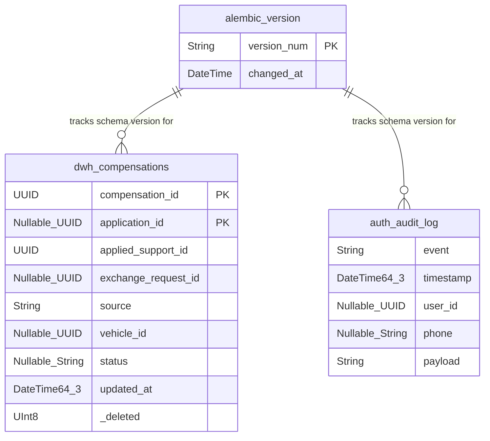

# Исправление инициализации и миграций ClickHouse при чистом старте event-worker

**Задача:** Устранение падения `event-worker` при чистом старте ClickHouse (DB::Exception: Could not find table: dwh_compensations)  
**Ветка:** `bugfix/clickhouse-fresh-bootstrap`  



---

## Постановка

При запуске `event-worker` в окружении со свежим / пустым ClickHouse сервис завершается аварийно со следующей ошибкой:

```text
clickhouse_connect.driver.exceptions.DatabaseError: Received ClickHouse exception, code: 60, server response: Code: 60. DB::Exception: Could not find table: dwh_compensations. (UNKNOWN_TABLE) (version 26.9.1.1629 (official build)) (for url http://clickhouse:8123)
```

### Первопричина
1. В `backend/event_worker.py` при старте сначала вызывается `await ensure_clickhouse_migrations_current()`, а вызов `ensure_tables()` расположен позже (строка 119).
2. В `backend/infrastructure/clickhouse_migrations.py` при отсутствии `alembic_version` (`current_revision is None`) предполагается, что среда уже инициализирована (`Pre-Alembic deployments were maintained by ensure_dwh_tables()`), и ставится штамп базовой ревизии `005` без создания самих таблиц.
3. При накатывании последующих миграций (`005 -> 006 -> 007`) миграция `007_compensation_source.py` пытается выполнить `ALTER TABLE dwh_compensations ADD COLUMN IF NOT EXISTS ...`. Так как таблица `dwh_compensations` не была создана, ClickHouse падает с `Code: 60 (UNKNOWN_TABLE)`.
4. Кроме того, в `backend/alembic_clickhouse/env.py` подключение к ClickHouse не передаёт настройку `mutations_sync=1`. В ClickHouse `UPDATE` для `alembic_version` выполняется как асинхронная мутация. При последовательном накате нескольких ревизий проверка текущей версии в `_upgrade_clickhouse_schema_sync()` считывает промежуточную версию до завершения фоновой мутации, что приводит к `ClickHouse migration revision mismatch: expected 007, got '006'`.

---

## Требования

1. **Инициализация базовой схемы при чистом старте:**
   Если `alembic_version` отсутствует (`current_revision is None`), перед установкой базового штампа ревизии `005` должен выполняться вызов `ensure_tables()`, создающий базовые DWH-таблицы, словари и аудит-лог.
2. **Синхронные мутации таблицы версий:**
   В `backend/alembic_clickhouse/env.py` при создании SQLAlchemy-движка для ClickHouse передавать `connect_args={"ch_settings": {"mutations_sync": "1"}}`, чтобы операции обновления версии выполнялись синхронно.
3. **Детерминированное определение текущей ревизии:**
   В `_current_revision` запроса `SELECT version_num FROM alembic_version FINAL` добавить явную сортировку `ORDER BY changed_at DESC LIMIT 1`.
4. **Идемпотентность:**
   Повторные вызовы `ensure_clickhouse_migrations_current()` и перезапуски `event-worker` должны успешно завершаться без ошибок и расхождений версий.

---

## Планируемые изменения

### `backend/infrastructure/clickhouse_migrations.py`
- В функции `_current_revision`: добавить `ORDER BY changed_at DESC`.
- В функции `_upgrade_clickhouse_schema_sync()`: при `current_revision is None` вызывать `from infrastructure.clickhouse import ensure_tables; ensure_tables()` перед `command.stamp(config, _LEGACY_RUNTIME_BASELINE)`.

### `backend/alembic_clickhouse/env.py`
- В функции `run_migrations_online()`: при вызове `create_engine` добавить `connect_args={"ch_settings": {"mutations_sync": "1"}}`.

---

## Критерии готовности

1. При чистой базе ClickHouse (без таблиц) запуск миграций ClickHouse и старт `event-worker` проходят успешно с первого раза.
2. Все таблицы DWH (включая `dwh_compensations` со столбцами `exchange_request_id` и `source`) создаются.
3. Ревизия `alembic_version` устанавливается в `007` (актуальный head).
4. Повторные запуски миграций отрабатывают идемпотентно.
5. Статические проверки `ruff check`, `lint-imports`, `mypy` проходят без ошибок.
6. `alembic check` для PostgreSQL подтверждает отсутствие расхождений схемы ORM.
7. Контейнер `event-worker` в Docker успешно поднимается и работает.
