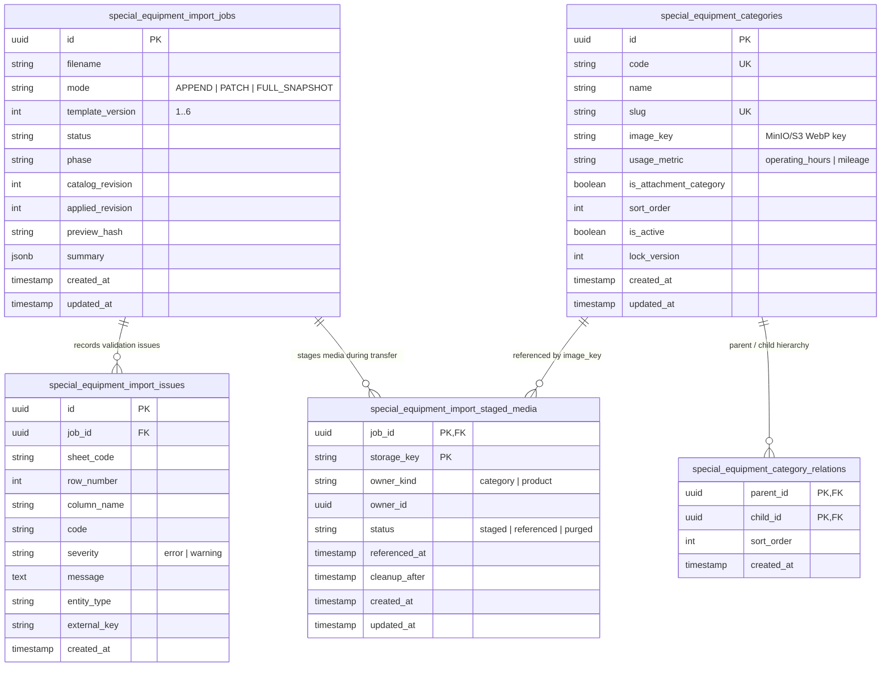
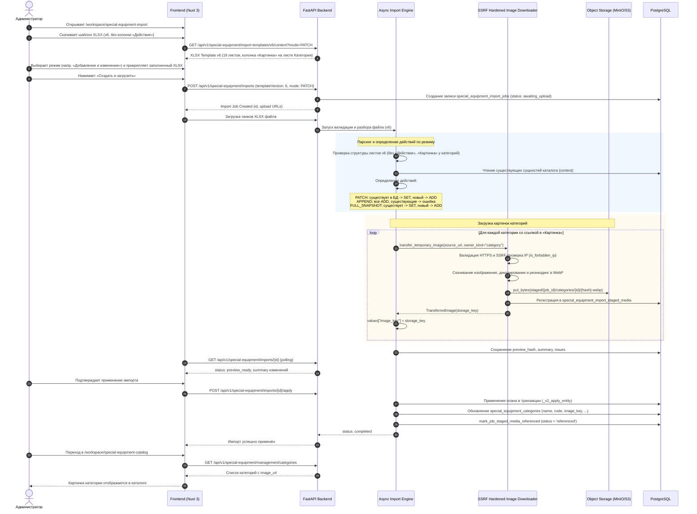

# Спецификация: Удаление колонки «Действие» и загрузка изображений категорий в импорте спецтехники

- **Дата и время создания:** 2026-09-22 12:54:30 MSK (UTC+3)
- **Идентификатор задачи (slug):** `special-equipment-import-action-and-category-image`
- **Тип задачи:** `feature`
- **Ветка задачи:** `feature/special-equipment-import-action-and-category-image`
- **Целевая ветка для MR:** `test`

---

## 1. Диаграмма сущностей (ERD)

> **Примечание по схеме БД:** Структура базы данных уже полностью поддерживает все требуемые поля, включая `special_equipment_categories.image_key` и таблицу отслеживания медиа `special_equipment_import_staged_media`. Изменения схемы БД и миграции Alembic не требуются.

---

## 2. Диаграмма последовательности (Sequence Diagram)

---

## 3. Постановка задачи

При импорте каталога спецтехники через XLSX-файл на странице `http://localhost/workspace/special-equipment-import` в текущей реализации (шаблон v5):
1. На всех 19 листах книги первой обязательной колонкой является колонка **«Действие»** со значениями «Добавить», «Изменить», «Удалить» (`ADD`, `SET`, `DELETE`). При этом пользователь уже выбирает один из 3 режимов импорта на фронтенде:
   - *«Добавление и изменение»* (`PATCH`, upsert);
   - *«Только добавление»* (`APPEND`, insert);
   - *«Полная замена»* (`FULL_SNAPSHOT`).
   Требование заполнять отдельную колонку «Действие» в каждой строке каждого листа является избыточным и усложняет подготовку данных: действия должны определяться автоматически на основе выбранного в интерфейсе режима импорта.
2. На листе **«Категории»** колонка ссылки на изображение называлась «Ссылка на изображение». Требуется переименовать её в **«Картинка»**, и обеспечить, чтобы при указании в ней URL изображения картинка автоматически скачивалась, валидировалась, оптимизировалась в WebP, сохранялась в объектное хранилище и прикреплялась к соответствующей категории — аналогично тому, как это работает при ручной загрузке через форму управления каталогом `http://localhost/workspace/special-equipment-catalog`.

---

## 4. Требования

### 4.1. Версия шаблона v6 и исключение колонки «Действие»
- **FR-1.1:** Создать версию шаблона книги XLSX **v6** (`TEMPLATE_VERSION = 6`).
- **FR-1.2:** В шаблоне v6 удалить колонку **«Действие»** из всех 19 листов данных (`marks`, `models`, `modifications`, `trims`, `modification_categories`, `modification_attribute_values`, `trim_attributes`, `trim_attribute_values`, `categories`, `category_relations`, `attribute_groups`, `attributes`, `attribute_options`, `category_attributes`, `colors`, `products`, `product_categories`, `product_attachments`, `product_components`).
- **FR-1.3:** Сохранить обратную совместимость с ранее выпущенными версиями шаблонов v1–v5: `SUPPORTED_TEMPLATE_VERSIONS = frozenset({1, 2, 3, 4, 5, 6})`. Если загружается файл версий 1–5 с колонкой «Действие», она считывается и обрабатывается в штатном режиме.
- **FR-1.4:** В инструкциях шаблона v6 описать, что действия для строк определяются выбранным режимом загрузки.

### 4.2. Автоматическое определение действий строк по выбранному режиму
При разборе файла v6 (где отсутствует колонка «Действие» / значение `operation` не задано в строке):
- **FR-2.1 (Режим `PATCH` — «Добавление и изменение» / upsert):**
  - Для сущностей (`_ENTITY_FAMILIES`): если сущность с данным кодом уже есть в контексте/БД — действием является обновление (`SET`); если сущность отсутствует — действием является создание (`ADD`).
  - Для связей (`_V2_LINK_MODELS`): действием является обновление/добавление (`SET` с логикой `ON CONFLICT DO UPDATE / DO NOTHING`).
  - Для значений характеристик (`modification_attribute_values`, `trim_attribute_values`): действием является установка значения (`SET`).
  - Существующие записи, не упомянутые в файле, не удаляются.
- **FR-2.2 (Режим `APPEND` — «Только добавление» / insert):**
  - Для всех строк действием является добавление (`ADD`).
  - Если запись с таким кодом уже существует в каталоге, строка помечается ошибкой `OPERATION_TARGET_INVALID` («Запись с таким кодом уже существует в каталоге») и попадает в итоговый отчёт о конфликтах без применения изменений к этой записи.
- **FR-2.3 (Режим `FULL_SNAPSHOT` — «Полная замена»):**
  - Для присутствующих в файле строк: существующие записи получают действие `SET`, новые записи — `ADD`.
  - Записи каталога, отсутствующие в файле снимка, удаляются или деактивируются механизмом согласования полного снимка.

### 4.3. Колонка «Картинка» на листе «Категории» и загрузка изображений
- **FR-3.1:** На листе «Категории» в шаблоне v6 колонка ссылки на изображение именуется **«Картинка»**.
- **FR-3.2:** Для гибкости и обратной совместимости парсер XLSX на листе «Категории» принимает как заголовок **«Картинка»**, так и **«Ссылка на изображение»**. Внутренним идентификатором поля остаётся `image_source_url`.
- **FR-3.3:** Если в колонке «Картинка» указана валидная HTTPS-ссылка (или ссылка на Google Drive):
  - Механизм переноса временных изображений (`transfer_temporary_image`) с защитой от SSRF скачивает изображение.
  - Изображение конвертируется в формат WebP с ограничением максимального размера.
  - Файл сохраняется в S3/MinIO под ключом категории `special-equipment/staged/{job_id}/categories/{category_id}/{hash}.webp`.
  - Запись регистрируется в `special_equipment_import_staged_media`.
  - При применении импорта поле `image_key` в таблице `special_equipment_categories` заполняется сохранённым ключом хранилища.
  - Staged-медиа переводится в статус `referenced`.
- **FR-3.4:** При открытии каталога `http://localhost/workspace/special-equipment-catalog` загруженное изображение категории отображается в интерфейсе (через эндпоинт `/categories/{category_id}/image/content`).
- **FR-3.5:** Если колонка пуста:
  - В режиме `PATCH`: текущее изображение категории сохраняется без изменений.
  - В режиме `APPEND` или `FULL_SNAPSHOT`: `image_key` остаётся `None`.
  - Если передано специальное значение `NULL_TOKEN` («Очистить»): изображение удаляется (`image_key = None`).
- **FR-3.6:** При возникновении ошибки загрузки изображения категории в отчёте валидации (`ImportIssue`) в качестве имени колонки указывается актуальное имя из шаблона («Картинка»).

### 4.4. API и интерфейс (Frontend)
- **FR-4.1:** Добавить эндпоинт `GET /api/v1/special-equipment/import-templates/v6/content`, возвращающий шаблон v6 с фильтрацией по выбранному параметру `mode`.
- **FR-4.2:** В схеме `CreateSpecialEquipmentImportRequest` разрешить `template_version: Literal[1, 2, 3, 4, 5, 6]`.
- **FR-4.3:** На фронтенде (`SpecialEquipmentImportUpload.vue`, `specialEquipmentImportApi.ts`, `types.ts`):
  - Установить версию по умолчанию `templateVersion = 6`.
  - Обновить ссылку скачивания шаблона на эндпоинт `/v6/content`.
  - Передавать `templateVersion: 6` при создании задачи импорта.

---

## 5. Планируемые изменения в кодовой базе

### 5.1. Backend: Доменная модель (`backend/domain/special_equipment_import.py`)
1. Установить `TEMPLATE_VERSION = 6`, `SUPPORTED_TEMPLATE_VERSIONS = frozenset({1, 2, 3, 4, 5, 6})`.
2. Зафиксировать `_V5_DATA_SHEET_HEADERS` и `_V5_DATA_SHEET_FIELDS` с сохранением колонки «Действие» для поддержки v5.
3. В актуальных `DATA_SHEET_HEADERS`:
   - Исключить `"Действие"` из кортежей заголовков всех 19 листов.
   - На листе `"categories"` заменить `"Ссылка на изображение"` на `"Картинка"`.
4. В актуальных `DATA_SHEET_FIELDS`:
   - Исключить `"operation"` из кортежей полей всех 19 листов.
   - На листе `"categories"` сохранить поле `"image_source_url"`.
5. В функции `normalize_operation`: поддержать случай, когда `value is None` или пусто (шаблон v6):
   - В режиме `APPEND` возвращать `"ADD"`.
   - В режиме `PATCH` возвращать `"UPSERT"`.
   - В режиме `FULL_SNAPSHOT` возвращать `"UPSERT"` (или `"SET"`).
6. В `ENTITY_OPERATIONS`, `LINK_OPERATIONS`, `VALUE_OPERATIONS` для `ImportMode.PATCH` и `ImportMode.FULL_SNAPSHOT` разрешить операцию `"UPSERT"`.

### 5.2. Backend: Сервис XLSX (`backend/infrastructure/services/special_equipment_xlsx.py`)
1. Добавить структуры заголовков и полей версии 6 в `_VERSIONED_HEADERS` и `_VERSIONED_FIELDS`.
2. В проверке заголовка листа `"categories"` разрешить как `"Картинка"`, так и `"Ссылка на изображение"`.
3. В генерации шаблона `_build_template`:
   - Поддержать `version = 6`.
   - В инструкции описать автоматическое определение действий строк по режиму импорта и загрузку картинок категорий через колонку «Картинка».
4. Добавить функцию `build_template_v6(*, mode: ImportMode = ImportMode.APPEND) -> bytes`.

### 5.3. Backend: Построение плана импорта (`backend/application/special_equipment_import_v2.py`)
1. В `_prepare_entity_identity`:
   - Если `row.get("operation") in {"UPSERT", None, ""}`:
     - Если сущность уже существует в базе (`current is not None`) -> установить `row["operation"] = "SET"`.
     - Если сущность новая (`current is None`) -> установить `row["operation"] = "ADD"`.
2. Для нормализации связей (`_normalize_category_relations`, `_normalize_modification_categories`, `_normalize_category_attributes`, `_normalize_simple_links`, `_normalize_offering_links`) и значений характеристик:
   - Если операция `"UPSERT"` или не задана: установить `"SET"` в режимах `PATCH` и `FULL_SNAPSHOT`, либо `"ADD"` в режиме `APPEND`.
3. В `_transfer_plan_images` при формировании ошибки (`ImportIssue`): указывать `column_name="Картинка"` для категорий, если заголовок был «Картинка».

### 5.4. Backend: Presentation слой
1. `backend/presentation/schemas/special_equipment_imports.py`:
   - `template_version: Literal[1, 2, 3, 4, 5, 6]`.
2. `backend/presentation/routers/special_equipment_imports.py`:
   - Добавить роут `GET /import-templates/v6/content` с вызовом `_template_response(version=6, mode=mode, ...)`.

### 5.5. Frontend (`frontend/features/specialEquipmentImport/`)
1. `types.ts`:
   - Обновить `templateVersion: 5` -> `templateVersion: 6` (и в `SpecialEquipmentImportCreateRequest`).
2. `api/specialEquipmentImportApi.ts`:
   - Обновить `templateContentUrl` на `/api/v1/special-equipment/import-templates/v6/content`.
3. `components/SpecialEquipmentImportUpload.vue`:
   - Обновить передаваемый `templateVersion: 6` при старте импорта.

---

## 6. Критерии готовности (Definition of Done)

1. **Генерация шаблона:** Запрос `GET /api/v1/special-equipment/import-templates/v6/content` возвращает валидный XLSX-файл. На всех 19 листах данных отсутствует колонка «Действие». На листе «Категории» присутствует колонка «Картинка».
2. **Импорт в режиме PATCH (upsert):** Загрузка XLSX v6 без колонки «Действие» в режиме «Добавление и изменение» корректно добавляет новые записи и обновляет существующие.
3. **Импорт в режиме APPEND (insert):** Загрузка XLSX v6 в режиме «Только добавление» добавляет новые записи, а при наличии совпадающих кодов фиксирует ошибки в отчёте без сбоя процесса.
4. **Импорт в режиме FULL_SNAPSHOT:** Загрузка XLSX v6 в режиме «Полная замена» успешно выполняет сопоставление и обновление снимка каталога.
5. **Загрузка картинки категории:** При указании ссылки на изображение в столбце «Картинка» на листе «Категории»:
   - Изображение скачивается и сохраняется в хранилище в WebP.
   - Поле `image_key` категории в БД обновляется соответствующим ключом.
   - При переходе на страницу `http://localhost/workspace/special-equipment-catalog` изображение категории отображается в списке/карточке.
6. **Обратная совместимость:** Шаблоны v2–v5 с колонкой «Действие» продолжают успешно импортироваться.
7. **Проверки качества:**
   - `cd backend && uv run ruff check . --fix` проходит без ошибок.
   - `cd backend && uv run lint-imports` проходит без ошибок.
   - `cd backend && uv run mypy .` не содержит новых ошибок.
   - `cd backend && uv run alembic check` завершается успешно (`No new upgrade operations detected`).
   - E2E-сценарий импорта отрабатывает штатно.
