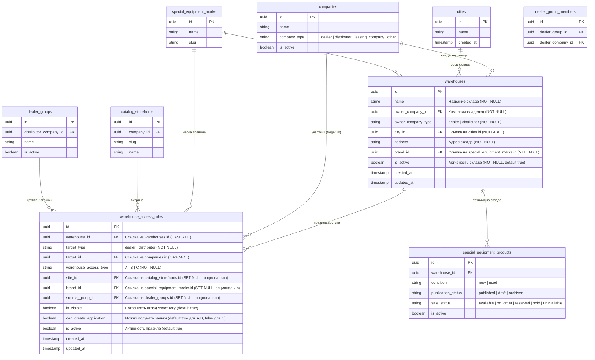
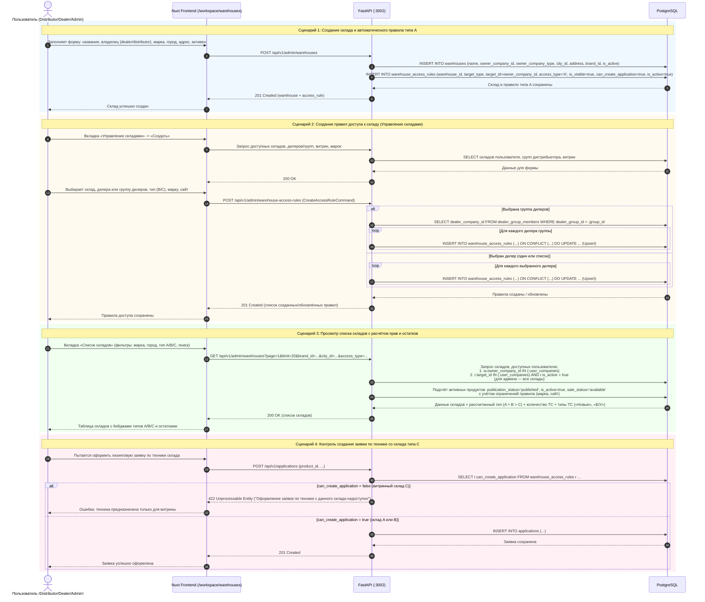
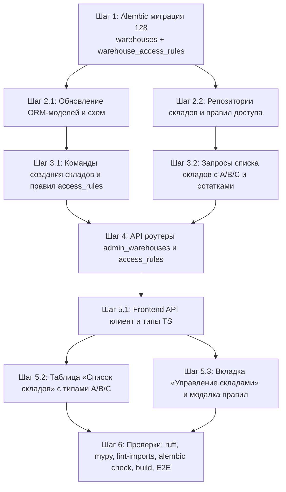

# Спецификация: Доработка справочника складов и управление доступом к складам (#21670)

- **Дата и время создания:** 2026-09-22 14:40:32 MSK (UTC+3)
- **Идентификатор задачи:** `21670`
- **Ссылка на задачу Bitrix24:** [Задача #21670](https://carcraftpro.bitrix24.ru/company/personal/user/302/tasks/task/view/21670/)
- **Исходный документ:** `№29_версия_3. Доработка справочника складов и управление доступом к складам от 06.07.2026.docx`
- **Тип задачи:** `feature`
- **Ветка задачи:** `feature/21670`
- **Целевая ветка для MR:** `test`

---

## Согласованные решения (по результатам интервью)

1. **Предметная область ТС и марок:**
   - Учёт техники складов, подсчёт остатков и фильтрация по маркам ведутся исключительно по `special_equipment_products` и `special_equipment_marks` (так как таблица `vehicles` удалена в ревизии 125).
   - В колонке «Тип ТС» в таблице складов выводить актуальные значения спецтехники: «Новые» и «Б/У» (вместо «АСП»).

2. **Поле `name` таблицы `warehouses` и миграция данных:**
   - В таблицу `warehouses` добавляется колонка `name: VARCHAR(255) NOT NULL`.
   - Для существующих в БД складов миграция заполняет `name` по шаблону: `COALESCE(NULLIF(TRIM(brand), '') || ' - ' || address, 'Склад ' || address)`.
   - В UI и API при создании склада поле «Название склада» является обязательным.

3. **Поле марки `brand_id` в таблице `warehouses`:**
   - Поле `brand_id` (`UUID FK -> special_equipment_marks.id`) делается опциональным (`NULLABLE`). Склад может быть мультибрендовым, а ограничение по марке при необходимости задаётся на уровне правил доступа `warehouse_access_rules`.
   - При миграции старую строковую колонку `brand` сопоставить со `special_equipment_marks` по совпадению названия без учёта регистра: если совпадение найдено — проставить `brand_id`, иначе оставить `NULL`. После миграции старую строковую колонку `brand` удалить.

4. **Поле города в таблице `warehouses`:**
   - Сохраняется нормализованная связь `city_id: UUID FK -> cities.id` с таблицей `cities`.
   - В API ответов и моделях представления склад возвращает `city_id` и `city_name` (или `city` с названием города), чтобы не терять целостность справочника городов и поддерживать работу существующих селекторов.

5. **Владелец склада (`owner_company_id`, `owner_company_type`):**
   - Таблица `warehouses` обновляется: добавляются обязательные колонки `owner_company_id: UUID FK -> companies.id` и `owner_company_type: VARCHAR(20)` (`dealer` или `distributor`).
   - При миграции `owner_company_id` заполняется через `COALESCE(company_id, dealer_id)`. Значение `owner_company_type` определяется по `company_type` из таблицы `companies`.
   - Старые колонки `dealer_id` и `company_id` удаляются из таблицы `warehouses`.
   - Статус `status: 'active' | 'inactive'` заменяется на `is_active: BOOLEAN NOT NULL DEFAULT true`.

6. **Группы дилеров и поле `source_group_id` в `warehouse_access_rules`:**
   - В таблицу `warehouse_access_rules` добавляется опциональное поле `source_group_id: UUID | None` (`FK -> dealer_groups.id ON DELETE SET NULL`).
   - Требование ТЗ соблюдено: `target_type` всегда сохраняется как `'dealer'`, а `target_id` — как ID конкретного дилера из группы (отдельная строка на каждого дилера).
   - Поле `source_group_id` указывает на группу-источник: если правило создавалось через выбор группы, то сохраняется `source_group_id`, что позволяет однозначно заполнять колонку «Группы дилеров» в таблице складов и управлять отзывом доступа для группы. Если доступ предоставлен индивидуально, `source_group_id` равен `NULL` (в колонке выводится `«-»`).

7. **Таблица на вкладке «Управление складами» и жизненный цикл правил:**
   - Состав колонок таблицы:
     - `Склад`: название и адрес склада.
     - `Кому выдан доступ`: название дилера (если правило из группы — с бейджем названия группы).
     - `Тип доступа`: `B` (с заявками) или `C` (витринный).
     - `Марка`: название марки или «Все марки» (если не ограничено).
     - `Сайт`: название/домен витрины или «Все сайты» (если не ограничено).
     - `Активность`: переключатель `is_active` (включено / выключено) для оперативного отключения доступа без удаления.
     - `Дата создания`: форматированная дата создания правила.
     - `Действия`: кнопка удаления правила доступа.
   - Пользователь с ролью `dealer` или `distributor` видит правила только для складов своих компаний; `admin` видит все правила.

8. **Связь с сайтами/витринами (`site_id`):**
   - Поле `site_id` в таблице `warehouse_access_rules` является внешним ключом `UUID FK -> catalog_storefronts.id ON DELETE SET NULL` (опционально, `NULLABLE`).
   - В форме создания правила в выпадающем списке выбора сайта выводятся доступные витрины: для дистрибьютора — витрины дистрибьютора и витрины целевого дилера; для администратора — все витрины системы.
   - Если сайт выбран, правило действует только для техники, отображаемой на этой витрине. Если сайт не выбран (`NULL`), правило действует глобально для всех витрин/контекстов.

9. **Центральный склад:**
   - Строго руководствуемся итоговой версией 3 ТЗ от 06.07.2026: все склады равноправны, отдельный флаг или сущность «центрального склада» не создаются.

10. **Устаревшие функции и legacy-кнопки на странице складов:**
    - Устаревшие кнопки «Загрузить склады (CSV)» и «Загрузить ТС (CSV)» удаляются с фронтенда (так как загрузка каталога техники выполняется через `/workspace/special-equipment-import`).
    - Модальное окно «Перемещение техники» ([`VehicleTransferModal.vue`](file:///Users/a_belianskii/projects/carcraft-leadgenerator/frontend/features/admin/warehouses/components/VehicleTransferModal.vue)) и просмотр техники склада ([`WarehouseVehiclesModal.vue`](file:///Users/a_belianskii/projects/carcraft-leadgenerator/frontend/features/admin/warehouses/components/WarehouseVehiclesModal.vue)) сохраняются и адаптируются под актуальную модель спецтехники.

11. **Критерии активной техники для подсчёта «Количество ТС»:**
    - В счётчик техники на складе попадают единицы спецтехники с условиями:
      - `publication_status = 'published'` (опубликована)
      - `is_active = true` (активна)
      - `sale_status = 'available'` (в наличии, доступна для продажи)
    - Единицы в статусах `archived`, `sold`, `unavailable`, `draft` в счётчик не включаются.

12. **Приоритет типов склада при пересечении правил:**
    - Приоритет доступа рассчитывается строго: `A > B > C`.
    - Если склад принадлежит компании текущего пользователя (`owner_company_id IN (:user_companies)`), тип склада для пользователя всегда **`A`**.
    - Если склад чужой и для компаний пользователя активно несколько правил доступа (например, общее витринное правило `C` и специальное правило с разрешением заявок `B`), применяется наиболее высокий уровень привилегий — **`B`** (с возможностью создания/получения заявок).

13. **Отображение типа склада для роли Администратора:**
    - Для администратора (`carcraft_employee`) в колонке «Тип склада» выводить статус **`A`** (или с бейджем `A (Админ)`), так как администратор обладает глобальным доступом ко всем складам, заявкам и операциям перемещения техники.

14. **Уникальность правил и обработка коллизий (Upsert):**
    - Для таблицы `warehouse_access_rules` устанавливается уникальное ограничение/индекс по комбинации: `(warehouse_id, target_type, target_id, COALESCE(site_id, '00000000-0000-0000-0000-000000000000'::uuid), COALESCE(brand_id, '00000000-0000-0000-0000-000000000000'::uuid))`.
    - При сохранении правила для дилера или группы дилеров применяется стратегия **upsert**: если правило для данного дилера с такими же параметрами уже существует, оно обновляется (актуализируются `warehouse_access_type`, `can_create_application`, `source_group_id`, `updated_at`, и проставляется `is_active = true`). Это гарантирует, что пакетное назначение группе не будет прерываться из-за уже существующих записей.

15. **Редактирование компании-владельца склада:**
    - При редактировании склада разрешено изменять компанию-владельца (`owner_company_id` и `owner_company_type`).
    - Если компания-владелец изменяется, система автоматически обновляет базовое правило типа `A`: переносит запись типа `A` на новую компанию-владельца, чтобы владельческие права всегда соответствовали актуальному владельцу склада.

16. **Фильтры над таблицей «Список складов»:**
    - Полнотекстовый поиск (по названию и адресу склада).
    - Фильтр по Городу (`city_id`).
    - Фильтр по Марке (`brand_id`).
    - Фильтр по Типу склада: «Все», «A» (собственный), «B» (с заявками), «C» (витринный).
    - Фильтр по Владельцу склада (доступен для администратора, отображает список компаний).

17. **Контроль запрета заявок для витринных складов типа C (`can_create_application = false`):**
    - На бэкенде: в сценарии оформления заявки проверяется правило доступа участника к складу техники. Если по активному правилу `can_create_application = false`, создание заявки отклоняется с HTTP 422 («Оформление заявок по технике с данного склада недоступно»).
    - На фронтенде: для техники с витринного склада типа `C` кнопка «Оформить заявку» блокируется (или скрывается) с тултипом о витринном статусе техники.

---

## 1. Диаграмма сущностей (ERD)

---

## 2. Диаграмма последовательности (Sequence Diagram)

---

## 3. Функциональные требования

### 3.1. Изменения схемы БД (Alembic ревизия 128)

1. **Таблица `warehouses`:**
   - Добавить колонку `name VARCHAR(255) NOT NULL`.
   - Для существующих строк заполнить `name` по шаблону: `COALESCE(NULLIF(TRIM(brand), '') || ' - ' || address, 'Склад ' || address)`.
   - Добавить колонку `owner_company_id UUID NOT NULL REFERENCES companies(id) ON DELETE RESTRICT`.
   - Заполнить `owner_company_id = COALESCE(company_id, dealer_id)` из существующих данных.
   - Добавить колонку `owner_company_type VARCHAR(20) NOT NULL`. Заполнить значением из `companies.company_type` (`dealer` или `distributor`). Добавить check-constraint: `owner_company_type IN ('dealer', 'distributor')`.
   - Добавить колонку `brand_id UUID NULL REFERENCES special_equipment_marks(id) ON DELETE SET NULL`.
   - Сопоставить старые строковые бренды из `brand` с `special_equipment_marks.name` (без учёта регистра): при совпадении проставить `brand_id`.
   - Добавить колонку `is_active BOOLEAN NOT NULL DEFAULT true`. Мигрировать `is_active = (status = 'active')`.
   - Удалить устаревшие колонки: `dealer_id`, `company_id`, `brand`, `status`.
   - Создать необходимые индексы:
     - `idx_warehouses_owner_company`: `(owner_company_id)`
     - `idx_warehouses_owner_type`: `(owner_company_type)`
     - `idx_warehouses_brand_id`: `(brand_id)`
     - `idx_warehouses_is_active`: `(is_active)`

2. **Создание таблицы `warehouse_access_rules`:**
   - Поля:
     - `id UUID PRIMARY KEY DEFAULT gen_random_uuid()`
     - `warehouse_id UUID NOT NULL REFERENCES warehouses(id) ON DELETE CASCADE`
     - `target_type VARCHAR(20) NOT NULL CHECK (target_type IN ('dealer', 'distributor'))`
     - `target_id UUID NOT NULL REFERENCES companies(id) ON DELETE CASCADE`
     - `warehouse_access_type VARCHAR(5) NOT NULL CHECK (warehouse_access_type IN ('A', 'B', 'C'))`
     - `site_id UUID NULL REFERENCES catalog_storefronts(id) ON DELETE SET NULL`
     - `brand_id UUID NULL REFERENCES special_equipment_marks(id) ON DELETE SET NULL`
     - `source_group_id UUID NULL REFERENCES dealer_groups(id) ON DELETE SET NULL`
     - `is_visible BOOLEAN NOT NULL DEFAULT true`
     - `can_create_application BOOLEAN NOT NULL DEFAULT true`
     - `is_active BOOLEAN NOT NULL DEFAULT true`
     - `created_at TIMESTAMPTZ NOT NULL DEFAULT CURRENT_TIMESTAMP`
     - `updated_at TIMESTAMPTZ NOT NULL DEFAULT CURRENT_TIMESTAMP`
   - Индексы и ограничения:
     - Уникальный индекс коллизий:
       `UNIQUE (warehouse_id, target_type, target_id, COALESCE(site_id, '00000000-0000-0000-0000-000000000000'::uuid), COALESCE(brand_id, '00000000-0000-0000-0000-000000000000'::uuid))`
     - Индекс по целевому участнику: `idx_war_target (target_id, is_active)`
     - Индекс по складу: `idx_war_warehouse (warehouse_id, is_active)`
     - Индекс по группе-источнику: `idx_war_source_group (source_group_id)`
   - Миграция существующих складов: для всех имеющихся складов автоматически создать правило типа `A` для их владельца (`owner_company_id`, `owner_company_type`).

---

### 3.2. Бэкенд: Слой Domain, Application и Presentation

1. **Доменные сущности и значения:**
   - `WarehouseAccessType(str, Enum)`: `'A'`, `'B'`, `'C'`.
   - `WarehouseOwnerType(str, Enum)`: `'dealer'`, `'distributor'`.
   - Определение сущности `Warehouse` и `WarehouseAccessRule`.

2. **Команды и обработчики:**
   - `CreateWarehouseCommand`: создание склада. Валидация:
     - `carcraft_employee` может указать любую компанию с ролью dealer/distributor.
     - `dealer` / `distributor` могут указать только компанию из списка своих компаний (`user.companies`).
     - Автоматическое создание правила типа `A` для владельца в рамках одной транзакции (`target_type=owner_company_type`, `target_id=owner_company_id`, `warehouse_access_type='A'`, `is_visible=true`, `can_create_application=true`, `is_active=true`).
   - `UpdateWarehouseCommand`: частичное обновление (название, марка, город, адрес, активность, владелец).
     - При смене владельца переносить/обновлять базовое правило типа `A` на новую компанию-владельца.
   - `DeleteWarehouseCommand`: удаление склада (проверка блокирующих зависимостей — наличие техники `SpecialEquipmentProduct`, привязанной к складу; правила `warehouse_access_rules` удаляются каскадно).
   - `CreateWarehouseAccessRulesCommand`: пакетное создание/обновление правил доступа.
     - Принимает `warehouse_id`, `mode: 'dealers' | 'dealer_group'`, `dealers: list[{dealer_id, access_type}]` или `group_id`, опциональные `brand_id` и `site_id`.
     - Для группы дилеров: извлекает актуальный состав `dealer_group_members` и выполняет upsert для каждого дилера с `source_group_id = group_id`.
     - Для списка дилеров: выполняет upsert для каждого переданного дилера с `source_group_id = None`.
     - Для `access_type='B'`: `can_create_application = true`.
     - Для `access_type='C'`: `can_create_application = false`.
   - `UpdateWarehouseAccessRuleCommand`: изменение `is_active` (включение/выключение) или `warehouse_access_type` (B/C).
   - `DeleteWarehouseAccessRuleCommand`: удаление правила доступа по `rule_id`. Запрещено удалять базовое правило типа `A`.

3. **Запросы (Queries):**
   - `ListWarehousesQuery`:
     - Фильтры: `search` (по `name` и `address`), `city_id`, `brand_id`, `access_type` (`A`, `B`, `C`), `owner_company_id`.
     - Область доступа:
       - `carcraft_employee` — все склады системы;
       - `dealer` / `distributor` — склады своих компаний (`owner_company_id IN (:user_companies)`) ИЛИ чужие склады, доступные по активным правилам (`target_id IN (:user_companies) AND is_active = true`).
     - Расчёт полей для каждой строки:
       - `warehouse_access_type`: `A > B > C` (для админа — `A`).
       - `brand_name`: название марки из `special_equipment_marks` (из правила доступа, если задано; иначе из склада).
       - `groups`: список названий групп дилеров, из которых склад доступен пользователю/дилерам (или `«-»`, если без группы).
       - `vehicles_count`: количество продуктов спецтехники (`special_equipment_products`) на этом складе с условиями `publication_status = 'published'`, `is_active = true`, `sale_status = 'available'`, удовлетворяющих ограничению по марке и сайту правила доступа.
       - `vehicle_types`: список уникальных типов техники на складе из доступных продуктов: массив из `'new'` и `'used'`, форматируемый в «Новые», «Б/У».
       - `sites`: список названий витрин из `catalog_storefronts`, привязанных к действующим правилам доступа (или пусто).
   - `ListWarehouseAccessRulesQuery`:
     - Постраничный список правил для вкладки «Управление складами».
     - Фильтры: `warehouse_id`, `target_id`, `is_active`.
     - Область доступа: `carcraft_employee` — все правила; `dealer` / `distributor` — только правила для складов, принадлежащих компаниям пользователя.

4. **Проверка прав при создании заявки:**
   - В команде создания заявки (`application/commands/applications.py`): если техника привязана к складу, проверить активные правила доступа дилера, оформляющего заявку, к данному складу.
   - Если действует правило типа `C` и нет правила типа `A` или `B`, отклонять с HTTP 422: `«Оформление заявок по технике с данного склада недоступно»`.

---

### 3.3. Фронтенд (Nuxt 3 / Vue 3)

1. **Страница `/workspace/warehouses`:**
   - Отображение двух вкладок:
     1. **«Список складов»** (`activeTab = 'list'`)
     2. **«Управление складами»** (`activeTab = 'management'`)
   - Удаление старых кнопок: «Загрузить склады (CSV)» и «Загрузить ТС (CSV)».

2. **Вкладка 1: «Список складов»:**
   - Фильтры над таблицей:
     - Текстовый поиск (по названию и адресу).
     - Выпадающий список городов.
     - Выпадающий список марок.
     - Выпадающий список типов склада: «Все», «A (Собственный)», «B (С заявками)», «C (Витринный)».
     - Выпадающий список компаний-владельцев (для администратора).
   - Колонки таблицы:
     - **Марка:** бейдж марки ТС. Если склад мультибрендовый и нет ограничения — «Все марки».
     - **Город:** название города склада.
     - **Адрес:** адрес склада с тултипом подробностей.
     - **Владелец:** название компании-владельца + бейдж типа (`Дилер` / `Дистрибьютор`).
     - **Группы дилеров:** названия групп через запятую или `«-»`.
     - **Количество ТС:** зелёный бейдж с количеством доступных активных единиц спецтехники. Клик открывает модалку со списком ТС склада.
     - **Тип склада:** бейдж типа доступа:
       - `A` (зелёный) — «Собственный» (для админа: «A» / «A (Админ)»);
       - `B` (синий) — «Доступен (с заявками)»;
       - `C` (жёлтый/серый) — «Витринный».
     - **Тип ТС:** строковое перечисление («Новые», «Б/У»).
     - **Сайт:** название/домен витрины или `«-»`.
     - **Действия:** редактирование склада, удаление склада, перемещение техники.

3. **Вкладка 2: «Управление складами»:**
   - Кнопка **«Создать правило»** в шапке панели.
   - Колонки таблицы правил доступа:
     - **Склад:** название склада и адрес.
     - **Кому выдан доступ:** название дилера (с бейджем группы, если правило выдано из группы).
     - **Тип доступа:** бейдж `B` (с заявками) или `C` (витринный).
     - **Марка:** название марки или «Все марки».
     - **Сайт:** название витрины или «Все сайты».
     - **Активность:** интерактивный переключатель `is_active` (активно/неактивно) с мгновенным сохранением.
     - **Дата создания:** дата создания правила.
     - **Действия:** кнопка удаления правила с подтверждением.

4. **Модальное окно создания/редактирования склада (`WarehouseFormModal.vue`):**
   - Поля формы:
     - Название склада (текстовое поле, обязательно).
     - Компания-владелец:
       - для администратора — выбор любой компании с ролью dealer или distributor;
       - для дилера/дистрибьютора — выбор только из своих компаний (`user.companies`).
     - Марка (выпадающий список марок `special_equipment_marks`, опционально).
     - Город (выпадающий список городов + кнопка создания нового города).
     - Адрес (текстовое поле, обязательно).
     - Активность (чекбокс / тумблер).

5. **Модальное окно создания правил доступа (`WarehouseAccessRuleCreateModal.vue`):**
   - Поле выбора склада: выпадающий список складов, принадлежащих пользователю (для админа — всех складов).
   - Переключатель: `Дилер` / `Группа дилеров`.
   - При выборе «Группа дилеров»:
     - Выпадающий список групп дилеров (для дистрибьютора — только его группы, для админа — все группы).
     - Выбор типа доступа для группы: `B` или `C`.
   - При выборе «Дилер»:
     - Табличная часть добавления строк:
       - Выпадающий список дилеров (для дистрибьютора — дилеры, связанные с ним; для админа — все дилеры).
       - Выпадающий список типа доступа: `B` или `C`.
       - Кнопки добавления/удаления строк.
   - Дополнительные опциональные параметры:
     - Выбор сайта/витрины (список доступных витрин или пусто).
     - Выбор марки (список марок или пусто).

6. **Адаптация существующих модалок:**
   - `WarehouseVehiclesModal.vue`: отображение спецтехники склада ([`SpecialEquipmentProduct`](file:///Users/a_belianskii/projects/carcraft-leadgenerator/backend/infrastructure/models/special_equipment.py)), статус продажи, год, цена.
   - `VehicleTransferModal.vue`: перемещение единиц спецтехники между складами.

---

## 4. План реализации по шагам (параллельные потоки)

### Поток A: База данных и бэкенд
- Создать миграцию `backend/alembic/versions/128_warehouse_access_rules_and_fields.py`:
  - Добавить `name`, `owner_company_id`, `owner_company_type`, `brand_id`, `is_active` в `warehouses`.
  - Удалить `dealer_id`, `company_id`, `brand`, `status`.
  - Создать таблицу `warehouse_access_rules` с уникальным индексом.
  - Наполнить авто-правила типа `A` для существующих складов.
- Обновить ORM-модель [`Warehouse`](file:///Users/a_belianskii/projects/carcraft-leadgenerator/backend/infrastructure/models/vehicles.py) и создать `WarehouseAccessRule`.
- Обновить репозиторий [`warehouse_repository.py`](file:///Users/a_belianskii/projects/carcraft-leadgenerator/backend/infrastructure/repositories/warehouse_repository.py) и создать `warehouse_access_rule_repository.py`.
- Реализовать команды: создание склада с авто-правилом типа `A`, обновление склада, удаление склада, создание правил доступа с upsert, переключение активности, удаление правила.
- Реализовать подсчёт `vehicles_count` (только `published`, `is_active=true`, `sale_status='available'`) и определение типов ТС («Новые», «Б/У»).
- Реализовать API эндпоинты в `backend/presentation/routers/admin_warehouses.py`.
- Добавить валидацию `can_create_application` при создании заявок.

### Поток B: Фронтенд
- Обновить типы `frontend/features/admin/warehouses/types.ts`.
- Обновить API клиент `warehousesApi.ts`: добавить методы работы с правилами доступа (`getRules`, `createRules`, `toggleRuleActive`, `deleteRule`).
- Переработать `WarehousesPanel.vue`:
  - Добавить вкладки «Список складов» и «Управление складами».
  - Удалить устаревшие кнопки CSV-импорта.
  - Обновить колонки таблицы «Список складов»: Марка, Город, Адрес, Владелец, Группы дилеров, Количество ТС, Тип склада, Тип ТС, Сайт.
  - Добавить фильтры по поиску, городу, марке, типу склада и владельцу.
- Разработать компонент вкладки управления правилами `WarehouseAccessRulesTable.vue`.
- Разработать модальное окно создания правил доступа `WarehouseAccessRuleCreateModal.vue`.
- Обновить `WarehouseFormModal.vue`: добавить поля «Название склада», «Компания-владелец» и «Марка».

---

## 5. Критерии готовности (Acceptance Criteria)

1. **Целостность схемы БД:**
   - Все миграции успешно применяются: `uv run alembic upgrade head`.
   - `uv run alembic check` завершается успехом без расхождений между ORM-моделями и БД (`No new upgrade operations detected.`).
2. **Создание склада:**
   - При создании склада создаётся запись в `warehouses` и автоматически генерируется правило типа `A` в `warehouse_access_rules` для компании-владельца.
   - В списке складов для владельца и администратора отображается тип склада `A`.
3. **Управление доступом:**
   - Дистрибьютор или админ может предоставить доступ конкретному дилеру или группе дилеров с типом `B` или `C`.
   - При выборе группы дилеров создаются отдельные записи на каждого дилера из группы с сохранением `source_group_id`.
   - При повторном сохранении правил для тех же дилеров срабатывает upsert (данные обновляются, коллизия 409 не падает).
   - Правило можно деактивировать переключателем `is_active` или удалить.
4. **Список складов:**
   - Владелец видит свои склады с типом `A`.
   - Дилер видит свои склады (`A`) и чужие склады, к которым ему открыт доступ по активным правилам (`B` или `C`).
   - Если склад доступен через группу дилеров, в колонке «Группы дилеров» выводится имя группы; если индивидуально — выводится `«-»`.
   - В колонке «Количество ТС» корректно подсчитываются только опубликованные и доступные единицы спецтехники с учётом ограничений марки и сайта.
   - В колонке «Тип ТС» выводятся «Новые», «Б/У» через запятую.
   - Работают все фильтры: поиск, город, марка, тип склада, владелец.
5. **Ограничение создания заявок:**
   - По технике с витринного склада типа `C` попытка оформить заявку отклоняется с HTTP 422, а в интерфейсе кнопка оформления блокируется.
6. **Качество кода и линтинг:**
   - `uv run ruff check . --fix` — 0 ошибок.
   - `uv run lint-imports` — 0 ошибок.
   - `uv run mypy .` — 0 новых ошибок.
   - `bun run build:frontend` — сборка фронтенда успешна без ошибок типов.
