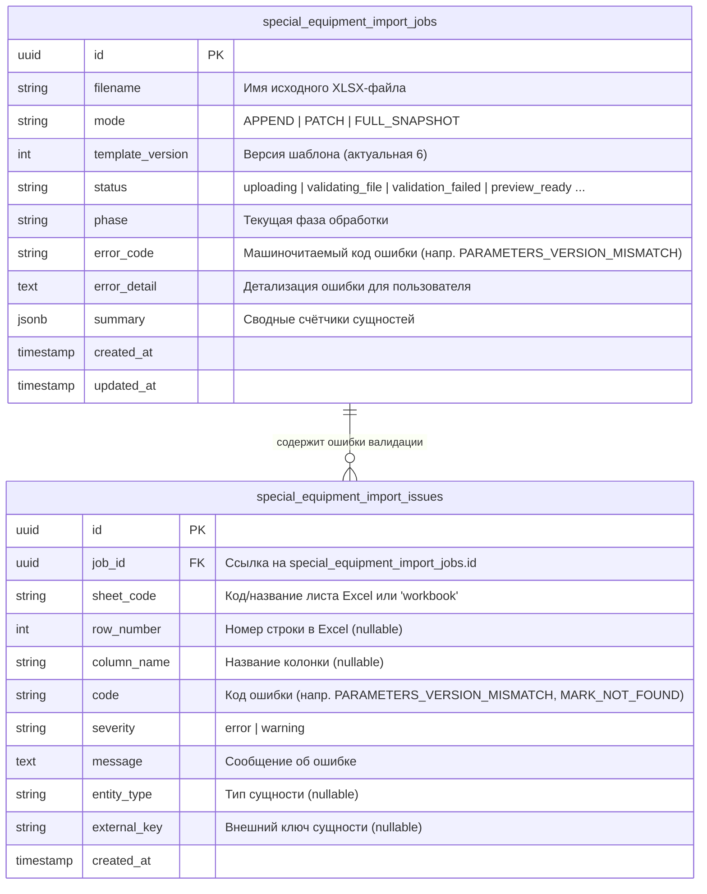
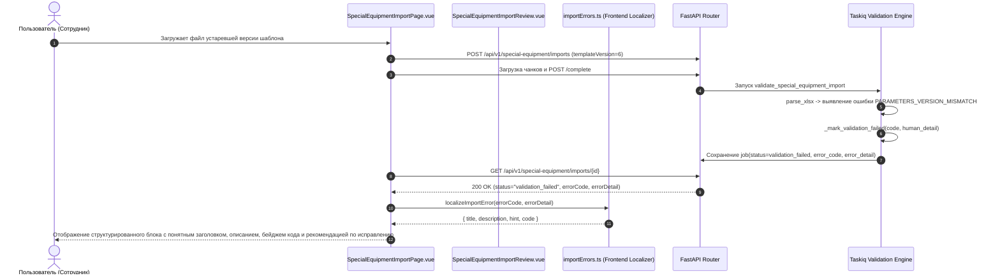

# Спецификация: Человекочитаемое отображение ошибок импорта спецтехники из Excel

- **Дата и время создания:** 2026-09-22 15:01:51 MSK (UTC+3)
- **Идентификатор задачи (slug):** `import-error-localization`
- **Тип задачи:** `bugfix`
- **Ветка задачи:** `bugfix/import-error-localization`
- **Целевая ветка для MR:** `test`

---

## 1. Диаграмма сущностей (ERD)



> **Примечание по схеме БД:** Структура базы данных и типы полей `error_code`, `error_detail` и `special_equipment_import_issues.message` полностью поддерживают текст произвольной длины. Изменения схемы БД и миграции Alembic не требуются.

---

## 2. Диаграмма взаимодействия (Sequence Diagram)



---

## 3. Постановка проблемы и контекст

При импорте каталога специальной техники через Excel-файл на странице `http://localhost/workspace/special-equipment-import` в случае ошибок парсинга книги (структуры, служебного листа «Параметры», колонок или формата данных) пользователю выводится сырой блок ошибки вида:

```html
<div class="mt-5 rounded-lg border border-red-200 bg-red-50 p-4" role="alert">
  <p class="font-bold text-red-800">PARAMETERS_VERSION_MISMATCH</p>
  <p class="mt-1 text-sm leading-relaxed text-red-800">PARAMETERS_VERSION_MISMATCH</p>
</div>
```

### Проблемы текущей реализации:
1. Заголовок и текст ошибки дублируют один и тот же технический машинный код (`PARAMETERS_VERSION_MISMATCH`).
2. Отсутствует расшифровка на русском языке, объясняющая, что именно пошло не так (например, «В загруженном файле указана устаревшая версия шаблона или повреждён лист "Параметры"»).
3. Отсутствует инструкция/рекомендация для пользователя о том, как решить проблему (например, «Скачайте актуальный шаблон v6 по кнопке "Скачать шаблон" выше и перенесите данные»).
4. Аналогичная проблема возникает при других структурных ошибках книги (`PARAMETERS_SHEET_MISSING`, `PARAMETERS_MODE_MISMATCH`, `SHEET_HEADER_INVALID:<лист>`, `XLSX_ACTIVE_CONTENT_FORBIDDEN`, `UNKNOWN_SHEET:<лист>`, `FULL_SNAPSHOT_SHEETS_MISSING:<листы>` и др.).
5. В таблице списка проблем на этапе предпросмотра (`SpecialEquipmentImportReview.vue`) часть кодов также отображается без поясняющего русскоязычного контекста.

---

## 4. Требования к реализации

### 4.1. Модуль локализации ошибок на фронтенде (`importErrors.ts`)
Создать типизированный модуль локализации `frontend/features/specialEquipmentImport/utils/importErrors.ts`, содержащий:
1. Структуру описания ошибки:
   ```typescript
   export interface LocalizedImportError {
     title: string       // Краткий понятный заголовок на русском
     description: string // Подробное объяснение сути проблемы
     hint?: string       // Конкретная рекомендация, как исправить
     code?: string       // Исходный машиночитаемый код
   }
   ```
2. Словарь переводов для всех категорий ошибок импорта:
   - **Ошибки листа параметров:**
     - `PARAMETERS_VERSION_MISMATCH`: Несоответствие версии шаблона. Пояснение, что ожидается версия 6, рекомендация скачать актуальный шаблон.
     - `PARAMETERS_SHEET_MISSING`: Отсутствует лист «Параметры». Пояснение, что служебный лист обязателен.
     - `PARAMETERS_MODE_MISMATCH`: Несоответствие режима импорта. Пояснение разницы между выбранным на форме режимом и указанным в файле.
     - `PARAMETERS_KEYS_MISSING`: Не хватает обязательных параметров на листе «Параметры» (динамический разбор списка отсутствующих ключей).
     - `PARAMETERS_KEY_UNKNOWN`: Лишний параметр на листе «Параметры».
     - `PARAMETERS_KEY_INVALID`: Некорректный или дублирующийся параметр.
     - `PARAMETERS_CLEAR_TOKEN_INVALID`: Неверный маркер очистки (ожидается `__CLEAR__`).
     - `PARAMETERS_GENERATED_AT_INVALID`: Некорректный формат даты формирования шаблона.
   - **Ошибки листов и колонок:**
     - `SHEET_HEADER_INVALID`: Неверные заголовки колонок на листе (с извлечением имени листа из суффикса `:sheet_name`).
     - `UNKNOWN_SHEET`: Лишний неизвестный лист в книге (с извлечением имени листа).
     - `FULL_SNAPSHOT_SHEETS_MISSING`: Отсутствуют обязательные листы для полной замены каталога.
     - `MANIFEST_SHEET_MISSING` / `MANIFEST_HEADER_INVALID`: Устаревший формат листа параметров v1.
   - **Ошибки файла и безопасности:**
     - `XLSX_ZIP_INVALID` / `XLSX_OPEN_FAILED`: Повреждённый файл или неподдерживаемый формат.
     - `XLSX_ACTIVE_CONTENT_FORBIDDEN`: Обнаружены макросы (VBA) или элементы управления ActiveX.
     - `XLSX_FORMULA_FORBIDDEN`: В ячейках обнаружены формулы (разрешены только статические значения).
     - `CELL_TEXT_TOO_LONG`: Превышена максимальная длина текста в ячейке (100 000 символов).
     - `XLSX_TOO_MANY_ZIP_ENTRIES` / `XLSX_UNCOMPRESSED_SIZE_EXCEEDED` / `XLSX_COMPRESSION_RATIO_EXCEEDED`: Превышены лимиты размера и структуры файла.
   - **Ошибки применения и окружения:**
     - `PREVIEW_STALE`: Каталог был изменён после формирования предпросмотра, требуется повторный импорт.
     - `DESTRUCTIVE_CONFIRMATION_REQUIRED`: Требуется подтверждение удаления данных.
     - `TARGET_WAREHOUSE_INVALID` / `WAREHOUSE_NOT_FOUND`: Склад не найден или недоступен.
     - `VALIDATION_RUNTIME_ERROR`: Внутренняя ошибка обработки, повторная попытка запланирована.
   - **Ошибки строк и связей справочников (строчные ошибки):**
     - `MARK_NOT_FOUND`, `MODEL_NOT_FOUND`, `MODIFICATION_NOT_FOUND`, `TRIM_NOT_FOUND`, `ATTRIBUTE_NOT_FOUND`, `COLOR_INVALID`, `CONFLICTING_DUPLICATE`, `IDENTICAL_DUPLICATE`, `CATEGORY_GRAPH_INVALID`, `CARD_ATTRIBUTE_LIMIT_EXCEEDED`, `IMAGE_*` и др.
3. Функция `localizeImportError(code: string | null | undefined, detail?: string | null): LocalizedImportError`:
   - Умеет разбирать составные коды с разделителем `:` (например, `SHEET_HEADER_INVALID:categories` -> локализованное название листа `Категории`).
   - Если код неизвестен, возвращает аккуратный фоллбек с сохранением исходного текста детализации и кода ошибки.

### 4.2. Обновление UI блока ошибки (`SpecialEquipmentImportPage.vue`)
Вместо сырого блока с одинаковым кодом:
1. Выводить аккуратный информативный alert-баннер:
   - Иконка ошибки (`ExclamationCircleIcon`).
   - Человекочитаемый заголовок (`title`).
   - Бейдж с исходным машинным кодом (`code`) шрифтом monospace для удобства передачи в техподдержку.
   - Подробное описание причины (`description`).
   - Блок с рекомендацией (`hint`) с визуальным акцентом (подсказка по исправлению).
   - Кнопка «Попробовать снова» / сброс для быстрого перехода к повторному выбору файла.

### 4.3. Обновление таблицы проблем и устранение 409 Conflict в preview (`SpecialEquipmentImportReview.vue`)
1. Использовать `localizeImportIssue(code, message)` для ячеек таблицы проблем, чтобы вместо сырых англоязычных кодов пользователи видели понятный русский текст ошибки и рекомендации по устранению.
2. Устранить ложный запрос к `GET /api/v1/special-equipment/imports/{id}/preview` при статусах сбоя валидации (`validation_failed`, `failed`) или при отсутствии `previewHash`:
   - При `validation_failed` предпросмотр ещё не сформирован на бэкенде (возвращается 409 Conflict), поэтому `loadPreview` не должен отправлять сетевой запрос.
   - Вместо технического сбоя `[GET] ".../preview": 409 Conflict` отображать информативное уведомление о том, что предварительный просмотр изменений не сформирован из-за ошибок валидации, и направить пользователя к таблице проблем ниже.
   - В случае непредвиденных сетевых ошибок или 409 выводить дружественное сообщение на русском языке вместо сырой строки исключения Nuxt `$fetch`.

### 4.4. Доработка бэкенда (`backend/application/tasks/special_equipment_import.py`)
1. В функции `_mark_validation_failed` при возникновении `ImportContractError` формировать русскоязычный текст `error_detail` / `message` по известным контрактам, сохраняя `error_code` в неизменном машинном виде.

---

## 5. Планируемые изменения по файлам

1. **`frontend/features/specialEquipmentImport/utils/importErrors.ts`** — создание нового файла со словарём и хелперами локализации ошибок импорта спецтехники.
2. **`frontend/features/specialEquipmentImport/components/SpecialEquipmentImportPage.vue`** — интеграция `localizeImportError` в блок отображения критической ошибки обработки импорта.
3. **`frontend/features/specialEquipmentImport/components/SpecialEquipmentImportReview.vue`** — отображение локализованных сообщений в таблице найденных проблем.
4. **`backend/application/tasks/special_equipment_import.py`** — формирование русскоязычных сообщений по умолчанию для `_mark_validation_failed`.
5. **`frontend/tests/unit/specialEquipmentImport/importErrors.spec.ts`** — юнит-тесты для проверки корректности локализации всех кодов ошибок и разбора составных кодов с двоеточием.

---

## 6. Критерии готовности (Definition of Done)

1. [ ] При ошибке `PARAMETERS_VERSION_MISMATCH` в UI отображается:
   - Заголовок: «Несоответствие версии шаблона Excel»
   - Код: `PARAMETERS_VERSION_MISMATCH`
   - Описание: подробное пояснение, что файл создан для другой версии шаблона, тогда как система работает с версией 6
   - Рекомендация: скачать актуальный шаблон v6 и перенести данные
2. [ ] Все ключевые контракты ошибок импорта (`PARAMETERS_*`, `SHEET_HEADER_INVALID`, `UNKNOWN_SHEET`, `XLSX_*`, `PREVIEW_STALE` и т.д.) имеют дружественные русскоязычные тексты и рекомендации.
3. [ ] Технические коды ошибок сохраняются в поле `errorCode` и видны пользователю в виде компактного бейджа.
4. [ ] Линтеры бэкенда `ruff check . --fix`, `uv run lint-imports`, `uv run mypy .` выполняются без ошибок.
5. [ ] Проверка схемы БД `uv run alembic check` подтверждает отсутствие расхождений.
6. [ ] Фронтенд-тесты и сборка выполняются без ошибок TypeScript.
7. [ ] При статусе сбоя валидации (`validation_failed` / `failed`) блок 3 не отправляет запрос на `/preview`, исключая ошибку 409 Conflict, и отображает информативное уведомление и список найденных проблем.
