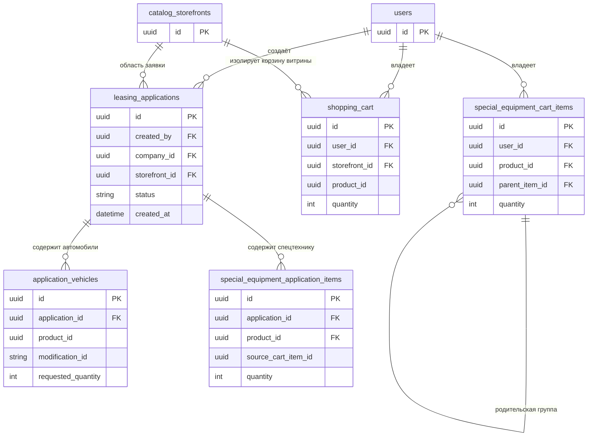

# Спецификация: Очистка позиций корзины при создании черновика лизинговой заявки

- **Дата и время создания:** 2026-09-22 16:32:07 MSK (UTC+3)
- **Задача Bitrix:** [#22282](https://carcraftpro.bitrix24.ru/workgroups/group/124/tasks/task/view/22282/)
- **Тип задачи:** `bugfix`
- **Ветка задачи:** `feature/22282`
- **Целевая ветка для MR:** `test`
- **Статус спецификации:** ожидает утверждения для реализации

---

## 1. Диаграмма сущностей (ERD)



> **Примечание по схеме БД:** задача изменяет операции чтения и удаления существующих строк корзин, но не меняет таблицы, ORM-модели, типы полей и связи. Новая миграция Alembic не требуется. Перед MR обязательно подтвердить это через `alembic check`.

---

## 2. Диаграмма последовательности

```mermaid
sequenceDiagram
    autonumber
    actor User as Пользователь
    participant UI as Страница выбора компании
    participant API as API создания заявки
    participant App as Команда создания заявки
    participant VehicleCart as shopping_cart
    participant EquipmentCart as special_equipment_cart_items
    participant DB as Транзакция БД

    User->>UI: Выбирает компанию и нажимает «Далее»
    UI->>API: POST создания черновика с Idempotency-Key
    API->>App: Проверка прав, компании и состава позиций
    App->>DB: Создать заявку и её строки
    App->>VehicleCart: Удалить только автомобили, вошедшие в заявку
    App->>EquipmentCart: Удалить только позиции спецтехники, вошедшие в заявку
    App->>DB: Commit одной транзакции
    API-->>UI: 201 Created, application_id
    UI->>UI: Обновить локальное состояние и счётчики корзины
    UI-->>User: Открыть следующий шаг заявки

    alt Ошибка проверки или создания
        App-->>DB: Rollback
        API-->>UI: Ошибка создания
        UI-->>User: Показать ошибку; корзина не меняется
    end

    alt Повтор с тем же Idempotency-Key после успешного commit
        API-->>UI: Результат ранее созданной заявки
        Note over VehicleCart,EquipmentCart: Повторное удаление не выполняется: позиции уже удалены исходной транзакцией
    end
```

---

## 3. Текущий сценарий и проблема

### 3.1. Текущее поведение

1. Пользователь переходит из корзины к оформлению, выбирает компанию и нажимает «Далее».
2. На этом шаге заявка создаётся действующим серверным сценарием. Из известных точек входа это `POST /api/v1/applications/draft`, `POST /api/v1/commerce/leasing-applications` и `POST /api/v1/special-equipment/leasing-applications`; этот перечень не ограничивает область задачи.
3. Общий поздний обработчик `clearSubmittedCartItems` на странице заявки не проверяет исходный сценарий создания: он работает по активным строкам открытой заявки. Поэтому область задачи определяется всеми сценариями, которые сейчас приводят к его вызову, а не названием корзины или конкретным URL создания.
4. **Автомобили:** в сценариях, использующих `handle_create_draft`, позиции `shopping_cart` на момент создания черновика не удаляются.
5. **Спецтехника:** серверный сценарий заявки только на спецтехнику уже удаляет переданные `cart_item_ids` после успешного создания заявки. Смешанный commerce-сценарий также удаляет переданные позиции спецтехники после создания черновика. Эти удаления выполняются до общего `commit`.
6. После заполнения анкеты и перехода со второго шага общий код страницы `frontend/pages/application/[id].vue` для любой открытой заявки собирает её активные строки и **пытается повторно** удалить:
   - автомобили через `cartStore.removeFromCart(vehicleId)`;
   - спецтехнику через `specialEquipmentCartStore.removeProductCartItems(productId)`.
7. Поэтому поздняя очистка как клиентская попытка применяется ко всем лизинговым заявкам, содержащим активные строки соответствующего типа. Для спецтехники это повторяет уже выполненное серверное удаление; для автомобилей это сейчас единственная очистка.

### 3.2. Проблема

Автомобили, уже перенесённые в созданную заявку, остаются в пользовательской корзине до завершения следующих шагов анкеты. Это не соответствует бизнес-цели: исключить повторное создание заявок на один и тот же автомобиль или позицию спецтехники.

Для спецтехники серверное удаление уже происходит в нужный ранний момент, но поздняя клиентская попытка остаётся дублирующей и не является надёжной частью бизнес-операции.

---

## 4. Целевое поведение

1. После **успешного** создания заявки при нажатии «Далее» система удаляет из корзины только позиции, включённые в эту заявку.
2. Очистка выполняется на бэкенде в той же транзакции, что создание заявки и её строк.
3. При любой ошибке проверки, создания заявки или удаления её позиций транзакция не фиксируется: заявка не создаётся, корзина не меняется.
4. Позиции, не включённые в заявку, остаются в корзине пользователя.
5. Правило действует для автомобилей и спецтехники во всех сценариях, где текущая версия вызывает `clearSubmittedCartItems`. Сценарий, который этот обработчик не вызывает, не изменяется.
6. После успешного ответа UI получает актуальное состояние корзины из серверного источника и обновляет локальные данные и счётчики без второго запроса на удаление.
7. Поздняя очистка после анкеты и второго шага заявки удаляется. Последующие шаги заявки не должны менять корзину.

---

## 5. Требования

### FR-01. Атомарное создание и очистка

Для **каждого сценария, в котором текущая версия после второго шага вызывает `clearSubmittedCartItems`**, создание `leasing_applications`, её строк и удаление соответствующих позиций корзины выполняются в одной транзакции операции создания черновика.

Правило не зависит от исходного URL создания, типа роли пользователя или того, была ли заявка создана через обычное, commerce- или специальное оформление. Если заявка содержит активную строку автомобиля или спецтехники, очистка соответствующей позиции должна происходить при её создании, а не при последующей отправке анкеты.

Команда не должна фиксировать транзакцию самостоятельно: единственный `commit` остаётся в роутере по установленному проектному соглашению.

### FR-02. Автомобили

После успешного создания заявки для каждого автомобиля вызывается существующая команда `handle_remove_from_cart(RemoveFromCartCommand(...))`. Она использует действующий репозиторный метод `cart_repository.remove_item` и удаляет строку только по сочетанию пользователя, автомобиля и витрины.

Новый API, новый сценарий удаления или новый репозиторный метод для автомобилей не создаётся.

Автомобили из корзины другого пользователя, другой витрины или не входящие в заявку не удаляются.

### FR-03. Спецтехника

После успешного создания заявки используется действующий метод `delete_cart_items_by_ids`: он удаляет только серверные строки `special_equipment_cart_items`, переданные в запросе как позиции создаваемой заявки, и сохраняет корректную обработку группированных позиций.

Существующая серверная очистка спецтехники в сценарии `POST /api/v1/special-equipment/leasing-applications` сохраняется без замены. В смешанном commerce-сценарии сохраняется то же удаление только переданных `cart_item_ids`; автомобили очищаются существующей командой `handle_remove_from_cart` внутри общего создания черновика.

### FR-04. Ошибки и откат

Если запрос не прошёл валидацию, пользователь не имеет прав, состав корзины изменился, товар недоступен или возникла внутренняя ошибка до `commit`:

- API возвращает действующий код и текст ошибки;
- не создаётся частичная заявка;
- не удаляется ни одна позиция корзины.

Не допускается схема «заявка создана, но её позиции остались в корзине» или «позиции удалены, но заявка не создана».

### FR-05. Идемпотентность

Существующий заголовок `Idempotency-Key`, контракт запросов и контракт ответов не меняются.

При повторном запросе с тем же ключом после успешного `commit` возвращается ранее сохранённый результат. Корзина не изменяется повторно, так как была очищена при исходном успешном создании.

### FR-06. Поведение фронтенда

После `201 Created` или ответа на идемпотентный повтор фронтенд:

- переходит на действующий следующий шаг созданной заявки;
- сбрасывает временные данные оформления, как делает сейчас;
- обновляет локальные stores корзины и счётчики из актуального серверного состояния;
- не вызывает отдельные API удаления позиций ради очистки.

Если обновление одного из stores не удалось, создание заявки не считается ошибкой и переход к ней не отменяется. Пользователь видит предупреждение, что корзину не удалось обновить, с понятным действием «обновить страницу»; техническая причина остаётся в консоли. При ошибке создания фронтенд показывает действующее понятное сообщение и сохраняет отображение корзины без локального удаления позиций.

### FR-07. Удаление старой поздней очистки

Код на странице заявки, который после заполнения анкеты и второго шага по отдельности удаляет автомобили и спецтехнику из корзины, удаляется вместе с предупреждениями о частичной поздней очистке.

---

## 6. Границы задачи

### Входит в задачу

- Все действующие варианты создания и дальнейшей отправки лизинговой заявки, в которых текущая страница заявки вызывает `clearSubmittedCartItems`.
- В том числе обычное оформление автомобилей, одиночное и смешанное commerce-оформление, а также оформление только спецтехники.
- Атомарность, идемпотентность и обновление клиентского состояния после создания заявки.
- E2E-покрытие каждого перечисленного варианта на desktop viewport 768 CSS-пикселей и шире.

### Не входит в задачу

- Изменение сценариев обмена, выкупа, покупки или бронирования, **если в текущей версии они не вызывают `clearSubmittedCartItems`**. Если такой сценарий вызывает этот обработчик, он входит в задачу по FR-01.
- Изменение статусов заявки, распределения по лизинговым компаниям или анкеты.
- Изменение API-контрактов, создание новых публичных эндпоинтов или миграций БД.
- Удаление позиций, не вошедших в созданную заявку.

---

## 7. Планируемые изменения по файлам

1. **`backend/application/commands/applications/create_draft.py`** — после успешного формирования строк заявки и до возврата результата вызвать существующую `handle_remove_from_cart` для каждого автомобиля заявки. Передать текущие `user_id` и `CatalogScope`; отдельный `commit` не выполнять. Так изменение автоматически охватывает обычное и commerce-создание, которые используют `handle_create_draft`.
2. **`backend/application/commerce.py`** — не заменять существующее удаление `delete_cart_items_by_ids` для спецтехники; подтвердить тестами, что вызов `handle_create_draft` очищает автомобили в смешанной заявке той же транзакцией.
3. **`frontend/pages/application/[id].vue`** — удалить позднюю клиентскую очистку после второго шага анкеты и связанные с ней предупреждения.
4. **`frontend/pages/application/new.vue`** и **`frontend/pages/cart/conditions.vue`** — после подтверждённого успешного создания заявки обновлять локальные stores автомобилей и спецтехники из серверного состояния; не выполнять отдельное удаление позиций.
5. **`backend/scripts/seed_special_equipment_e2e.py`**, **`frontend/tests/e2e/special-equipment/support/fixtures.ts`**, **`frontend/tests/e2e/checkout/22282-cart-cleanup-at-draft.spec.ts`** и **`scripts/e2e/run.sh`** — подготовить изолированные данные и подключить целевой E2E-набор. Он покрывает обычный автомобиль, одиночный commerce-автомобиль, смешанную заявку и заявку только на спецтехнику; проверяет состав корзин после создания черновика, при ошибке и после прохождения анкеты.

Unit- и архитектурные тесты не изменяются и не запускаются: это запрещено обязательными правилами репозитория без отдельного прямого запроса пользователя. Не создаются новые публичные API, новые команды удаления или новые репозиторные методы. Изменения ограничиваются перечисленными файлами. Выход за эти границы требует обновления этой спецификации до реализации.

---

## 8. Проверка и критерии готовности

### Обязательная E2E-проверка

1. Для каждого входящего варианта — обычный автомобиль, одиночный commerce-автомобиль, смешанная заявка и заявка только на спецтехнику — пользователь добавляет в корзину как минимум одну позицию заявки и одну позицию, не входящую в заявку.
2. В каждом варианте пользователь выбирает компанию и нажимает «Далее».
3. В каждом варианте сервер создаёт одну заявку и удаляет только включённые в неё позиции: автомобили, спецтехнику либо позиции обоих типов.
4. После перехода на следующий шаг в корзине и её счётчиках не отображаются перенесённые позиции, а позиция, не включённая в заявку, остаётся.
5. Для каждого варианта намеренно неуспешное создание сохраняет одинаковый состав корзины до и после запроса.
6. Для каждого варианта после заполнения анкеты и перехода со второго шага повторного удаления из корзины не происходит.
7. Повтор того же запроса с тем же `Idempotency-Key` не создаёт вторую заявку и не изменяет уже очищенную корзину.

### Технические проверки перед MR

- `docker compose build backend frontend nginx`
- Запуск приложения в Docker и проверка логов затронутых сервисов без новых ошибок.
- Целевой E2E через `bun run test:e2e -- <путь-к-сценарию>` из `frontend/` либо через `bash scripts/e2e/run.sh` с подтверждением, что сценарий действительно включён в запуск.
- `cd backend && uv run ruff check . --fix`
- `cd backend && uv run lint-imports`
- `cd backend && uv run mypy .`
- `cd backend && uv run alembic upgrade head`
- `cd backend && uv run alembic check` с ожидаемым результатом `No new upgrade operations detected.`

### Критерии готовности

- [ ] Во всех сценариях, где прежняя версия вызывала `clearSubmittedCartItems`, включённые позиции автомобилей и спецтехники исчезают из соответствующих пользовательских корзин при создании черновика, до перехода пользователя к анкете.
- [ ] Каждая точка входа из области задачи покрыта E2E: обычный автомобиль, одиночный commerce-автомобиль, смешанная заявка и заявка только на спецтехнику.
- [ ] Позиции, не включённые в заявку, остаются в корзине.
- [ ] Ошибка создания заявки не изменяет корзину и не создаёт частичную заявку.
- [ ] Создание заявки и очистка её позиций атомарны в рамках одной серверной транзакции.
- [ ] Повторный запрос с тем же ключом идемпотентности не создаёт дубль.
- [ ] После второго шага анкеты отдельной очистки корзины больше нет.
- [ ] Сценарии, в которых текущая версия не вызывает `clearSubmittedCartItems`, не изменились.
- [ ] Все перечисленные обязательные проверки выполнены и имеют зафиксированный результат.

---

## 9. Вопросы и решения

### Блокирующие вопросы

Отсутствуют.

### Неблокирующие решения, уже принятые

- Очищать только позиции, вошедшие в заявку, а не всю корзину пользователя.
- Перенести очистку для **всех сценариев, где прежняя версия вызывала `clearSubmittedCartItems`**, на этап успешного создания черновика.
- Охватить автомобили и спецтехнику, включая одиночные и смешанные commerce-сценарии.
- При ошибке создания не очищать корзину.
- Выполнять эти действующие механизмы внутри серверной атомарной транзакции, а не последовательностью клиентских запросов.
- Использовать действующие механизмы удаления: `handle_remove_from_cart` для автомобилей и `delete_cart_items_by_ids` для спецтехники; не создавать параллельную логику очистки.
