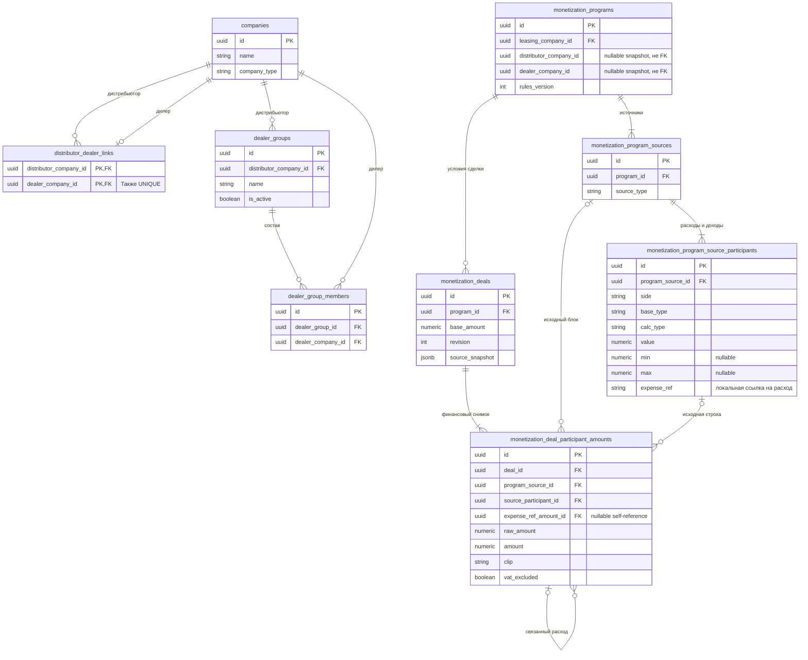
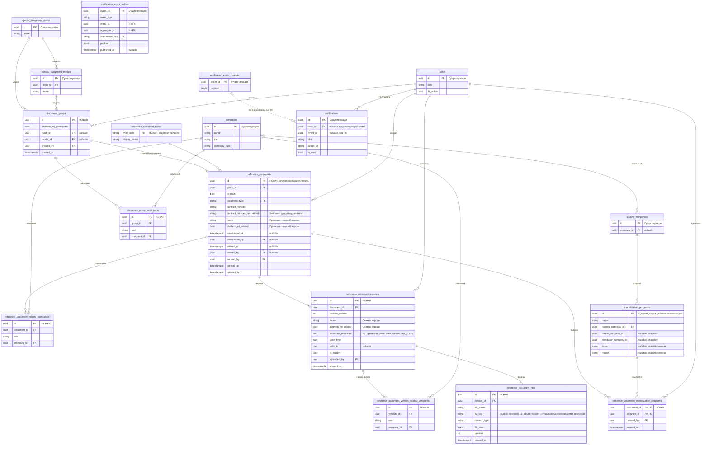

# Задача 22296 — Справочник документов

- Задача: https://carcraftpro.bitrix24.ru/workgroups/group/124/tasks/task/view/22296/
- Создано: 2026-09-22 16:33:04 MSK (UTC+3).
- Исходная ветка: `feature/22296`; повторные исправления: `bugfix/22296`.
- Целевая ветка MR: только `test`.
- Источники: «Разработка по ТЗ №18. Справочник документов.docx», прямые уточнения пользователя и приложенные макеты Excel, карточек, табов и выбора документов в монетизации.
- Последние ответы пользователя приоритетнее DOCX и предварительных макетов. Итоговое решение — собственные таблицы документов, версий и файлов; существующие `documents` / `document_types` не используются.

- Дополнение от 2026-09-29: пользователь явно подтвердил исправления монетизации в прежней ветке 22296. Требования и приемка — раздел 12; статус дополнения: review пройден, пользователь подтвердил реализацию 2026-09-29.
- ERD дополнения ниже отражает текущие ORM-таблицы. Новые таблицы и колонки не планируются. Основная историческая ERD справочника документов сохранена далее.



```mermaid
sequenceDiagram
    actor Admin as Администратор
    participant UI as Форма условий
    participant API as FastAPI
    participant DB as PostgreSQL
    participant Calc as Доменный расчет
    Admin->>UI: Выбрать дистрибьютора или дилера
    UI->>API: Поиск компаний с ID выбранной противоположной стороны
    API->>DB: Доступные компании AND (прямая связь OR активная группа)
    DB-->>API: Только связанные компании
    API-->>UI: UUID и названия
    Note over UI: Устаревший ответ после смены фильтра не применяется
    Admin->>UI: Указать min/max и сохранить условие
    UI->>API: Участники и финансовые строки
    API->>DB: Проверить существование и совместимость пары
    alt Несовместимая пара или недопустимые лимиты
        API-->>UI: 4xx без частичного сохранения
    else Корректные данные
        API->>DB: Сохранить условие вместе с min/max
        API-->>UI: Сохраненное условие
    end
    Note over API,Calc: При штатном создании сделки из заявки
    API->>DB: Прочитать подходящее условие и лимиты
    API->>Calc: Рассчитать расходы и связанные доходы
    alt Подходящие условия и корректный бюджет
        Calc-->>API: raw_amount, amount после min/max, clip
        API->>DB: Сохранить финансовый снимок
    else Нет подходящих условий или расчет нарушает бюджет
        Calc-->>API: Отсутствие результата или доменная ошибка
        API->>DB: Откатить savepoint монетизации
        Note over API,DB: Исходный переход заявки сохраняется по существующему контракту
    end
    UI->>API: Открыть сделку
    API-->>UI: Итоговые суммы и сведения об ограничениях
    UI-->>Admin: Итог; при срабатывании — исходная сумма и примененный порог
```


```mermaid
sequenceDiagram
    autonumber
    actor Admin as Администратор
    participant UI as Справочник или монетизация
    participant API as FastAPI
    participant DB as PostgreSQL
    participant S3 as ObjectStorage
    participant Scheduler as Taskiq
    participant Kafka as Kafka
    participant Worker as Event worker
    actor Partner as Связанный пользователь
    Admin->>UI: Создать или отредактировать документ
    UI->>API: Multipart: полный снимок, новые файлы и retained_file_ids; expected current для правки
    API->>DB: Проверить права, участников, номер и версию
    alt Неверные данные, занятый номер или устаревшая текущая версия
        API-->>UI: 4xx с понятной причиной
    else Проверки пройдены
        API->>S3: Записать файлы по уникальным ключам
        alt Сбой до попытки commit
            API->>DB: Rollback
            API->>S3: Очистить только загруженные этим запросом объекты
            API-->>UI: Ошибка, прежняя версия сохранена
        else Данные готовы к сохранению
            API->>DB: Снимок версии, текущая проекция и файлы; попытка commit
            alt Commit подтверждён
                API-->>UI: 201 и сохранённый документ
            else Результат commit неизвестен
                Note over API,S3: Не удалять файлы: транзакция могла сохраниться
                API-->>UI: Ошибка подтверждения, результат уточняется чтением
            end
        end
    end
    Admin->>UI: Сделать историческую версию текущей
    UI->>API: POST activate с expected_current_version_id
    API->>DB: Блокировать группу и документ, проверить ожидаемую версию
    alt Конфликт или чужая версия
        API-->>UI: 409 или 404, текущее состояние сохранено
    else Выбор допустим
        API->>DB: Выбрать снимок и восстановить проекцию, не менять деактивацию
        API->>DB: При необходимости восстановить недоставленное событие; commit
        API-->>UI: 200; обновить справочник и монетизацию
    end
    Admin->>UI: Выбрать документы и сохранить условие
    UI->>API: Условие с reference_document_ids
    API->>DB: Перепроверить подбор, атомарно сохранить M2M
    API-->>UI: Условие со ссылками
    Scheduler->>DB: Найти версии со сроком до 30 дней
    Scheduler->>DB: Событие с уникальным occurrence_key
    Scheduler->>Kafka: Опубликовать событие после commit
    Kafka->>Worker: Событие истечения
    Worker->>DB: Проверить актуальность, права и повторы
    alt Удалён, выключен или версия заменена
        Worker->>DB: Без receipt и уведомлений
    else Событие актуально
        Worker->>DB: Персональные notifications и receipt; commit
        Worker-->>Kafka: Подтвердить обработку
        Partner->>API: Получить внутренние уведомления
        API-->>Partner: Уведомление со ссылкой на документ
    end
    Admin->>UI: Удалить главный документ
    UI->>API: Последствия удаления всей связки
    API-->>UI: Все затронутые документы и условия
    Admin->>UI: Подтвердить показанный список
    UI->>API: DELETE с отпечатком последствий
    API->>DB: Перепроверить связи под блокировкой
    alt Появились новые привязки или документы
        API-->>UI: 409, обновить предупреждение
    else Список актуален
        API->>DB: Soft-delete и удаление M2M; commit
        API-->>UI: 204; условия сохранены
    end
```

## 1. Постановка и границы

Создать справочник юридических документов с неизменяемой привязкой группы, дочерними документами, историей версий, несколькими файлами на версию, ролевым чтением, Excel и выбором документов из условий монетизации. Новые документы можно загружать непосредственно из монетизации через общий сценарий справочника.

Спецификация определяет итоговое поведение, ограничения, контракты и критерии приёмки справочника с учётом уточнений пользователя.

Не менять документы заявок/KYC и их API. Не переносить автоматически старые договоры монетизации или документы программ стимулирования. Бинарные файлы сохранять через существующий ObjectStorage, метаданные — в новых таблицах. ClickHouse в этой задаче не требуется.

## 2. Итоговые требования и уточнения

| Область | Согласованное правило |
| --- | --- |
| Хранение | Собственные таблицы справочника, версий и файлов; существующая documents не используется |
| Номер | Обязателен, глобально уникален среди неудалённых, неизменяем; все версии сохраняют номер |
| Тип и название | Одинаковые тип/название с разными номерами — разные документы, в том числе внутри одной группы |
| Новая версия | Любое сохранённое редактирование создаёт полный снимок; прямой перезаписи нет |
| Переключение версий | Выбранная историческая версия становится текущей в справочнике и связанных условиях монетизации |
| Связанные компании | При создании дочернего наследование по каждой незаполненной роли, однократно; далее независимо |
| Активность | Кнопка деактивации/активации; без каскада на детей и без активации новой версией |
| Фильтры | Применяются автоматически; каждое условие выполняется хотя бы на одном доступном документе, разные условия могут выполнять разные документы |
| Раскрытие | Все доступные неудалённые документы найденной группы |
| Период | Полное попадание периода документа в диапазон |
| Несколько ЛК | Достаточно вхождения выбранной ЛК в участников группы |
| Общие документы | Без дилера подходит конкретному дилеру; на марку подходит модели; отсутствие дилера в условии требует отсутствия дилера в группе |
| Подбор | Будущие разрешены; истёкшие и деактивированные не предлагаются для новой привязки |
| Монетизация | Выбор из справочника и загрузка из формы монетизации; ссылка без копирования файла |
| Уведомления | Внутренние, связанным пользователям с доступом; без email; поздняя загрузка и пропуск проверки учитываются |
| Таблица и Excel | Связанные документы через « + » в одной колонке; в UI каждый элемент — ссылка |

### 2.1. Дополнительные правила

Следующие проектные решения уточняют контракт там, где исходный DOCX и ответы пользователя не задают подробностей:

- Одна строка таблицы/Excel соответствует группе: реквизиты главного, остальные документы в «Связанных документах». Дочерние документы не дублируются отдельными строками.
- Если главный недоступен, но доступны дети, карточка скрывает его реквизиты. Представитель табличной строки — первый доступный документ по created_at, id; остальные доступные — в связанной колонке. Представитель не становится главным в БД.
- Для дистрибьютора и ограничений марки/модели применяется аналогичная логика общих договоров: отсутствие ограничения группы допускает более конкретное условие.
- Если группа требует Платформу МЛ, в условии хотя бы одна финансовая строка имеет participant_type=platform. Отсутствие флага группы не запрещает участие платформы.
- M2M монетизации ссылается на документ, не на фиксированную версию; отображается текущая версия. Финансовые данные и подтверждения сделок не меняются.
- Название, связанные компании, даты и файлы изменяются только созданием новой версии. Тип, номер и группа неизменяемы. Администратор может сделать историческую версию текущей (раздел 4.4).
- Лимиты файлов как у текущей загрузки договоров монетизации: 1–10 файлов на версию, каждый непустой, максимум 20 МиБ; PDF, DOC, DOCX, XLS, XLSX, PNG, JPG/JPEG.

## 3. Существующие сущности и архитектура

- Существующие документы заявок: backend/infrastructure/models/documents.py; новая модель их не использует.
- Условия — monetization_programs, старые вложения — monetization_program_contracts, по backend/infrastructure/models/monetization.py. Не создавать фиктивную monetization_conditions из DOCX.
- Для марки и модели использовать special_equipment_marks/models с UUID.
- leasing_companies.id и companies.id различны. ЛК с company_id=null не может стать участником до привязки к юрлицу.
- Источник участников — зарегистрированные компании платформы. Публичный DaData-поиск не гарантирует companies.id и не используется для создания участников.
- Монетизация уже имеет company/catalog lookups и ProgramEditor.vue. Переиспользовать необходимые серверные запросы и публичные компоненты, не импортировать внутренности чужого feature.
- Уведомления: application/notifications/{events,publisher,processor,recipients,templates}.py, domain/events/notifications.py, domain/notification_policy.py, application/tasks/notifications.py.
- Соблюдать AGENTS.md корня, domain, application, infrastructure, presentation и frontend, а также импортные контракты backend/pyproject.toml.

## 4. Данные и инварианты

### 4.1. Группа и участники

`document_groups`: UUID, флаг платформы, nullable UUID марки/модели, автор и время. `document_group_participants`: UUID, FK группы и компании, роль `leasing_company | dealer | distributor`, уникальность `(group_id, role, company_id)`.

Хотя бы одно поле участников обязательно: платформа=true, непустой список компаний или марка/модель. Модель требует марки и должна принадлежать ей. False и пустые массивы не считаются заполнением. Создание группы, главного документа и первой версии атомарно. Совпадающие наборы участников допускаются.

Группа после создания неизменяема, включая марку/модель. Изменение состава требует новой группы. Удаление/деактивация справочной компании не переписывает историческую привязку. FK на компании и каталог — RESTRICT; новые значения выбираются из активных справочников, существующие привязки остаются читаемыми.

Внешний блок участников: `platform_ml`, `leasing_company_ids`, `dealer_company_ids`, `distributor_company_ids`, `mark_id`, `model_id`. `leasing_company_ids` всегда содержит `leasing_companies.id`; сервер явно преобразует их в `companies.id` для M2M и ACL. Дилер/дистрибьютор используют `companies.id`. В выдаче возвращать явно именованные `company_id` и для ЛК `leasing_company_id`; запрещён запасной выбор между разными ID. Несколько записей ЛК с одним юрлицом не создают дубликаты M2M.

### 4.2. Документ и номер

`reference_documents` имеет постоянный UUID, FK группы/типа, `is_main`, номер, нормализованный номер, название, флаг связанной платформы, авторство, created_at/updated_at, deactivated_at/by, deleted_at/by.

Типы заполняются миграцией: `contract` — Договор, `agreement` — Соглашение, `additional_agreement` — Доп. соглашение, `invoice` — Счёт, `act` — Акт, `power_of_attorney` — Доверенность, `other` — Прочее. Код типа — ключ перечисления, остальные сущности используют UUID.

Номер: до 100 символов в исходном и нормализованном виде, непустой после нормализации. Unicode casefold может увеличить длину; превышение возвращает 422 до записи в БД. Отображение сохраняет введённое значение; сравнение исключает пробельные символы и регистр. Нормализация одинакова в предварительной проверке, сохранении и DB-ограничении. Частичный уникальный индекс по нормализованному номеру `WHERE deleted_at IS NULL`, а не обычный UNIQUE исходной строки. Конфликт — 409 «Номер используется». После мягкого удаления номер разрешён для нового документа; старая история остаётся на старом UUID.
Форма создания проверяет доступность номера асинхронно. Занятый номер, незавершённая проверка или ошибка её выполнения блокируют сохранение и отправку POST создания. Ответ для прежнего значения не может разрешить сохранение нового номера. После изменения номера выполняется новая проверка; серверная уникальность остаётся обязательной защитой от конкурентного создания.

Название обязательно, trim, максимум 255 символов; совпадающие названия допустимы. У живой группы ровно один живой главный документ. Частичный уникальный индекс `group_id WHERE is_main AND deleted_at IS NULL` запрещает второго; атомарные создание и каскадное удаление обеспечивают отсутствие живой связки без главного.

### 4.3. Связанные компании

`reference_document_related_companies`: UUID, FK документа, роль и companies.id; уникальность `(document_id, role, company_id)`. Они не меняют группу и подбор монетизации, но предоставляют доступ к конкретному документу.

При создании дочернего каждая роль наследуется отдельно: отсутствующий/null/пустой массив копирует эту роль главного; непустой заменяет только её. Для платформы отсутствие/null копирует флаг главного, явно переданный true/false сохраняется. Форма показывает наследуемые значения до сохранения. Копирование однократное в транзакции, без последующей синхронизации с главным.

При редактировании существующего документа новый полный снимок содержит связанные компании явно: пустой массив очищает роль, наследования нет. Отзыв связи влияет на доступ ко всей истории документа. Выбор исторической версии восстанавливает её сохранённые связи и немедленно обновляет текущий ACL. Сохранённые ID исторических компаний не переосмысливаются как новое назначение; проверяются только новые назначения.

### 4.4. Версии, файлы, конкурентные операции

`reference_document_versions`: UUID, FK документа, положительный version_number, полный снимок name/platform_ml_related/valid_from/valid_to, is_current, metadata_backfilled, автор и время. Связанные компании снимка — в `reference_document_version_related_companies`. Ограничения: уникальность `(document_id, version_number)`, частичная уникальность `document_id WHERE is_current`, valid_to >= valid_from. Под блокировкой группы и документа следующая версия получает max(version_number)+1. Все исторические реквизиты и файлы неизменяемы; удаления отдельной версии нет. `reference_documents.name/platform_ml_related` и его связи — атомарно обновляемая проекция выбранного текущего снимка для поиска, ACL, монетизации и уведомлений. Создание новой версии и выбор исторической требуют expected_current_version_id; устаревшая форма получает 409. При двух конкурентных изменениях с одним expected допускается один успех и один 409. После выбора v1 при наличии v2/v3 следующая правка создаёт v4; история не сокращается. Повторный выбор уже текущей версии идемпотентен и не создаёт новой версии; чужая или несуществующая версия возвращает 404.

`reference_document_files`: UUID, FK версии, исходное безопасное отображаемое имя, индексированный s3_key, content_type, положительный размер bigint, порядок и время. Для новых загрузок ключ генерируется сервером с UUID документа/версии/файла; пользователь не задаёт путь. Сохранённые в следующей версии файлы получают новые строки/ID с тем же неизменным S3-объектом, без скачивания и повторной загрузки. Допускаются только retained_file_ids ожидаемой текущей версии того же документа, без повторов. Версия содержит полный набор из сохранённых и новых файлов (1–10), а не изменяет набор прежней версии. Порядок: retained_file_ids в переданной последовательности, затем новые файлы. Изменение только реквизитов не требует повторной загрузки файлов. Бинарные данные не помещать в БД.

Валидировать количество, размер, формат и содержимое до публикации версии. Повреждённые PNG/JPEG/DOCX/XLSX, в том числе ошибки декодирования и структуры контейнера, возвращают 415 без частичных документов, версий и файлов. При подтверждённом отказе до попытки commit текущая версия не меняется; после rollback очищаются только объекты, реально загруженные этим запросом. Ошибка rollback или очистки не должна подменять исходную ошибку. При потере подтверждения commit результат может быть неопределённым: файлы немедленно не удаляются, поскольку транзакция могла сохраниться. Фактическое состояние определяется последующим чтением; объекты без committed-ссылок подбирает фоновая очистка.

Файлы используют выделенный префикс document-registry/. Ежечасная очистка удаляет объекты старше 24 часов только при отсутствии любой ссылки в reference_document_files. Исторические и мягко удалённые документы сохраняют файлы. Загрузка и очистка берут одинаковую advisory-блокировку ключа: незавершённая загрузка не может потерять объект. Очистка повторно проверяет ссылку под блокировкой, возраст и ETag объекта; не накапливает блокировки всех просмотренных ключей до конца транзакции и освобождает блокировку обработанного объекта также при ошибке. Прямые постоянные публичные ссылки не выдавать. Скачивание любого файла проверяет текущие права и deleted_at его документа.

Чтение документа, текущей версии, связанных компаний и ACL должно использовать один согласованный снимок БД. Правило распространяется на карточки, историю, файлы, группы, детей, таблицу, Excel, подбор и ссылки монетизации: нельзя выдать новые реквизиты на основании старых связей доступа. Для этих HTTP-чтений транзакция REPEATABLE READ READ ONLY начинается до получения DB actor. Запись остаётся READ COMMITTED; изменение связей и статуса условия монетизации удерживает согласованные блокировки программы и документов до формирования возвращаемой проекции.

### 4.5. Статусы

Использовать календарную дату MSK (UTC+3), конечный день включительно. Вычислять по текущей версии в таком порядке:

1. Удалённый документ не выдаётся и не скачивается.
2. deactivated_at задан → «Деактивирован» / deactivated.
3. valid_from > today → «Ещё не наступил» / pending.
4. valid_to < today → «Истёк» / expired.
5. valid_to задан и до него 0–30 дней → «Истекает» / expiring.
6. Иначе «Действует» / active; пустое окончание — бессрочность.

Деактивация не удаляет файлы, версии и связи и не распространяется на другие документы. Повторная активация возвращает рассчитанный статус; истёкший документ не становится действующим. Новая версия и выбор исторической текущей версии не отменяют ручную деактивацию. Вычисляемый статус не хранить как ежедневно обновляемую строку.

### 4.6. Перенос ранее созданных версий

Миграция 131_document_registry от ревизии 130 создаёт собственные таблицы справочника; миграция 132 дополняет версии полными снимками и таблицей reference_document_version_related_companies. Отдельная существующая ревизия 131 обновляет складской триггер; merge-ревизия 133 объединяет ветви 131 и 132 в один head без изменения данных. Upgrade с ранее применённой 132 выполняет недостающую складскую миграцию, не создавая таблицы справочника повторно. Для данных, созданных до 132, прежние названия и связанные компании неизвестны: копировать известные на момент миграции реквизиты документа в существующие версии и помечать metadata_backfilled=true. Исторические даты и файлы сохранять точно. UI сообщает, что исходные название и связи таких версий неизвестны; backfill не выдаётся за восстановленную историю. Новые версии имеют metadata_backfilled=false и достоверный полный снимок.

Глобальную уникальность s3_key заменить обычным индексом для повторного использования неизменных объектов версиями одного документа. Downgrade 132→131_document_registry допустим только до появления повторно используемых ключей; иначе завершать его явной ошибкой до DDL, без удаления файлов или истории.
## 5. Права, фильтры и интерфейс

### 5.1. Права

Администратор — актуальная роль `carcraft_employee`. ЛК, дилер, дистрибьютор — только чтение, скачивание и Excel в контексте подтверждённой компании. Клиент и гость не имеют доступа к разделу. Проверять активность пользователя и текущее членство; переданный UUID компании не является доказательством доступа.

Партнёру доступен документ, если его компания в соответствующей роли присутствует в участниках группы ИЛИ связанных компаниях документа. Флаг платформы не предоставляет доступ всем партнёрам; принадлежность дилера дистрибьютору не даёт автоматического доступа дистрибьютору.

Единая проверка выполняется до поиска/агрегации для групп, файлов, истории, счётчиков, таблицы, Excel и уведомлений. Право читать условие монетизации само по себе не даёт доступа к чужому документу. Прямой недоступный/удалённый UUID — 404, запрещённая операция по роли — 403. Даже название чужого файла или номер договора не выдаются. Разрешённые роли объявляются в presentation через require_roles, включая административные чтения проверки номера и последствий удаления. OpenAPI должен отражать те же ограничения. В application не дублировать общие проверки роли; свежая проверка пользователя/компании и доступа к конкретным данным сохраняется.

### 5.2. Фильтры

Общие параметры: тип, марка, модель, период, статус, ЛК/дилер/дистрибьютор, `participant_scope=participants|related`, поиск по названию и номеру. Все активные фильтры сочетаются по И; марка/модель проверяются на группе.
В карточках и таблице фильтры применяются автоматически; для текстового поиска допускается debounce. Любое изменение фильтров начинает выдачу заново с первой страницы/курсора. Устаревший ответ прежнего запроса не заменяет новый результат. Экспорт использует набор фильтров, которому соответствует показанная выдача, а не ещё не применённые значения формы. Переход между карточками и таблицей сохраняет выбранные фильтры.

Каждый документный фильтр имеет свой EXISTS по доступным неудалённым документам группы. Главный договор действует, дочерний акт истёк: «Акт» + «Действует» находят группу. Недоступный документ не может удовлетворять фильтр. В режиме related совпадения компаний могут находиться в разных доступных документах.

Период — один составной фильтр: обе границы относятся к одной текущей версии. Нижняя граница требует valid_from >= from, верхняя — valid_to IS NOT NULL AND valid_to <= to. Бессрочный не подходит конечной верхней границе; без верхней границы допускается. Некорректный диапазон отклоняется.

Поиск — регистронезависимая подстрока названия либо нормализованного номера; пустая строка не фильтрует. Раскрытая группа показывает все доступные документы вне зависимости от совпадения поиска. Счётчики табов раскрытой связки относятся только к доступным неудалённым дочерним документам, которые выводятся под табами. Главный документ показан отдельно выше и не учитывается в этих счётчиках. Серверные documents_count/counts_by_type по-прежнему описывают всю доступную группу; UI вычитает доступного главного. Версии не увеличивают количество документов.

### 5.3. Карточный вид

Маршрут `/workspace/document-registry`; отдельный пункт меню четырёх внутренних ролей, не заменяет «Документы клиентов». Только desktop 768+ CSS px.

Сохранить композицию второго/третьего макета: заголовок, пояснение, добавление, фильтры, широкие карточки групп, теги участников, главный документ, статус справа, срок/версия/автор, файлы/история, раскрытие/сворачивание. `+ Документ в связку` только у главного и только администратору.

Добавить недостающие элементы ТЗ в тот же flow: поиск, марку/модель, раздельные компании, тумблер области поиска, статус/период, переключатель видов, редактирование с созданием версии, выбор текущей версии в истории, активацию и удаление. Табы «Все» и семь типов, включая «Доп. соглашение». После раскрытия активен «Все»; главный не дублируется второй карточкой в раскрытом списке. Счётчик таба соответствует только списку дочерних документов под ним; главный остаётся сверху независимо от выбранного таба. Вкладки типов и вкладки выбора/загрузки договора используют общий frontend/assets/css/workspace-tabs.css из вкладок «Условия монетизации / Сделки» в MonetizationWorkspace.vue: шрифт 14 px / 500 / 20 px, padding 8 px 4 px, gap 24 px, общая серая линия 1 px, активное подчёркивание 2 px, те же hover/focus. Сохраняются ARIA и переключение клавиатурой.

Карточная пагинация — по 20 групп. Режим по умолчанию карточный, после ухода/перезагрузки выбор не сохраняется. При переключении внутри страницы сохранять фильтры. Если главный недоступен, нейтральный заголовок группы и доступные документы без реквизитов главного. Все действия записи скрыты у партнёров и запрещены сервером.
В карточке одно действие «Редактировать»: форма заполнена текущим снимком и предупреждает, что сохранение создаст новую версию. Название, связанные компании, даты и набор файлов редактируются совместно; номер, тип и группа неизменяемы. Ссылка «История версий» показывается только при количестве версий больше одной. История содержит полные снимки, автора, время, файлы, признак текущей версии и доступное администратору действие «Сделать текущей». Выбор обновляет карточку, таблицу, Excel, фильтры, права и связанные условия монетизации без перепривязки document_id.

Прямой переход на страницу справочника и перезагрузка должны корректно учитывать готовность авторизации и SSR hydration, не показывая разрешённые только администратору действия партнёру.

### 5.4. Таблица и Excel

Колонки первого изображения: Тип документа; Номер; Название; Участники; Связанные компании; Связанные документы; Марка; Модель; Действует с; Действует по; Статус; Кол-во файлов. Реквизиты относятся к текущей версии представителя строки по 2.1; счётчик файлов — только его текущие файлы.

Компании внутри ячейки — отдельными строками с ролями: Платформа МЛ → ЛК → Дистрибьютор → Дилер. Отсутствующее значение — «—». Связанные документы — остальные доступные неудалённые документы группы, каждый «Тип + Номер + Компания», элементы соединены « + ». Если компаний несколько, перечислить их с ролями через запятую, а не выбирать одну произвольно. Для этой подписи использовать участников группы, при их отсутствии — связанные компании документа; если компаний нет — Платформа МЛ или «Без компании» по данным.

В UI каждый связанный документ — ссылка на просмотр, файлы и историю внутри раздела. Таблица read-only, горизонтальный скролл на узком desktop, подгрузка по 10 групп; стабильный cursor `created_at DESC, id DESC`. Excel включает все группы результата, не только загруженные строки; те же ACL/фильтры/порядок. Одна группа — одна логическая строка XLSX, многострочные ячейки без обязательного объединения строк. Пользовательские значения записываются текстом, не формулами.

## 6. Интеграция с монетизацией

### 6.1. Правила подбора

Единый серверный подбор используется при выборе и повторной проверке сохранения. Подбираются доступные главные и дочерние документы всех подходящих групп, текущая версия, статусы active/expiring/pending. Связанные компании не участвуют в подборе.

Группа подходит, если совпал хотя бы один явно заданный участник или параметр: ЛК, дилер, дистрибьютор, марка, модель либо участие платформы. Условия объединяются через ИЛИ. Несовпадение остальных полей не исключает группу. Пустые списки, null и platform_ml=false не считаются совпадением; если положительных совпадений нет, группа не подходит.

| Измерение | Положительное совпадение |
| --- | --- |
| ЛК | Выбранная leasing_companies.id входит в список ЛК участников группы; достаточно одной из нескольких ЛК. ЛК обязательна для контекста создаваемого условия, но её несовпадение с группой допускается при другом совпадении |
| Дилер | Выбранный companies.id входит в участников dealer группы |
| Дистрибьютор | Выбранный companies.id входит в участников distributor группы |
| Марка | Непустой UUID марки группы равен UUID марки условия |
| Модель | Непустой UUID модели группы равен UUID модели условия; входной контекст по-прежнему проверяет принадлежность модели марке |
| Платформа | platform_ml группы и условия равны true; в условии участие определяется финансовыми строками расхода/дохода |
| Срок и доступ | Независимые обязательные ограничения: доступ пользователя, неудалённый документ и статус active/expiring/pending. Будущие разрешены; совпадение участника не допускает истёкшие и деактивированные документы |

Общий договор без дилера может подойти по ЛК, дистрибьютору, марке, модели или платформе. Само отсутствие дилера не является совпадением. Это правило относится только к подбору документов; подбор финансовых условий по сделкам не меняется.

Черновик передаёт UUID марки/модели действующего каталога. Сохранённые условия сейчас хранят brand/model как имена-снимки. Сервер читает monetization_programs, сопоставляет имена с текущим справочником только при однозначном точном совпадении и получает UUID. При отсутствующем/неоднозначном соответствии — 409 «Нужно уточнить марку/модель условия»; нельзя выбрать произвольный ID или считать неизвестное имя отсутствием ограничения. Финансовые снимки не переписываются. Старые привязки такого условия остаются читаемыми; новая привязка требует корректного контекста.

### 6.2. Выбор, загрузка и существующие файлы

В форме условий используется блок «Приложить договор» с вкладками «Из справочника документов» и «Загрузить новый файл». Первая автоматически показывает подходящие документы строками с чекбоксами, типом, названием, номером, сроком, версией и кнопками файлов; выбранная строка выделяется синей рамкой и фоном. Выбор выполняется прямо в форме, без отдельного модального окна списка. Во второй вкладке кнопка загрузки открывает общую форму справочника с участниками из условия. Можно создать новую группу либо выбрать существующую подходящую и добавить дочерний. Все обязательные реквизиты/даты/файлы заполняются; запись только с именем файла недопустима.

Партнёр в блоке монетизации видит только доступные ему уже привязанные документы и их файлы/историю. Подбор новых кандидатов, изменение выбора и загрузка ему недоступны.

После загрузки документ уже существует в справочнике. Подбор выполняется повторно, и документ автоматически выбирается только при соответствии текущему контексту и допустимому статусу. Истёкший или иначе неподходящий документ остаётся в справочнике без выбора; при ошибке подбора выбор откладывается до успешной проверки. Форма сообщает причину. Отмена черновика условия не удаляет документ; форма заранее сообщает об этом. При сохранении условия reference_document_ids и M2M фиксируются одной транзакцией с условием. Подбор повторно проверяется сервером; удалённый/истёкший/выключенный/неподходящий новый документ приводит к 409 без частичного сохранения.
Контекст нового условия сравнивается по значениям leasing_company_id, dealer_company_id, distributor_company_id, mark_id, model_id и platform_ml. При изменении этих значений прежний выбор черновика сбрасывается с пояснением, кандидаты загружаются заново; устаревшие ответы игнорируются. Изменения суммы, минимума, максимума или НДС без изменения контекста сохраняют выбранные документы. Новая ссылка на объект с теми же значениями также не сбрасывает выбор. Для сохранённого условия уже существующие связи не очищаются из-за исключения документа из новых кандидатов.

Существующему условию администратор отдельно добавляет/снимает связи; снятие не удаляет документ. Пара program_id/document_id уникальна. После истечения/деактивации уже привязанный документ остаётся со своим статусом; автоматически отвязывается только удалённый. Новая версия либо выбранная историческая текущая версия отображается по той же связи, не изменяя расчёты и подтверждения сделок. Существующая связь сохраняется при выборе истёкшей версии; новые привязки по-прежнему проходят подбор.

Старые monetization_program_contracts остаются историческими вложениями со своим read/download API. Новые загрузки UI идут только через справочник; старый POST прямой загрузки выводится из использования UI, дальнейшую доступность этого endpoint не расширять. В рамках реализации не удалять исторические данные и не создавать неполные записи справочника из них. Программы стимулирования и документы финансовых сделок сохраняют текущий flow.

## 7. Удаление

Только администратор, мягко. Дочерний отдельно; главный вместе со всеми документами группы. Предварительный API возвращает все затронутые документы и уникальные условия монетизации с ID/названиями, включая связи детей. UI показывает весь список перед подтверждением.

Возвращать отпечаток набора последствий, передавать его в DELETE через If-Match. Под блокировкой группы/документов пересчитать набор: новые связи/документы → 409 и повторное предупреждение. Привязка и добавление дочернего берут согласованные блокировки, исключая ссылку к уже удаляемому документу.

В одной транзакции поставить deleted_at/by и явно удалить M2M. ON DELETE CASCADE не срабатывает при soft-delete и не заменяет команду. Условия не удаляются. Группа без живого главного не выдаётся. Файлы/версии сохраняются, но пользовательские API скачивания их отвергают. Восстановление удалённых и физическая очистка исторических файлов вне задачи.

## 8. Внутренние уведомления

Outbox — журнал доставки, не готовое правило истечения. Добавить `document_registry.expiring`, entity type `reference_document`, политику `in_app_only=True`, шаблон, маршрут, отбор пользователей и проверку актуальности. entity_id=aggregate_id=document_id, application_id=null; payload содержит version_id и valid_to ISO-строкой. Ссылка `/workspace/document-registry?document=<uuid>` открывает документ независимо от страницы списка и заново проверяет ACL. Для партнёра добавляется notification_company_id подтверждённой компании-получателя, для сотрудника платформы контекст компании не передаётся.

Проверять сроки ежечасно существующим Taskiq-планировщиком, рассчитывая календарную дату по MSK, а также при создании версии, активации документа и выборе исторической версии текущей. Условие: текущая версия, документ не удалён/не выключен, окончание задано, `0 <= valid_to - today <= 30`. Так покрываются точный порог, поздняя загрузка и пропуск запуска; уже истёкшие не создают запоздалых предупреждений.

Ключ `document_registry.expiring:<document_id>:<version_id>:<valid_to>` уникален. Повторный скан, повторная доставка и выключение/включение не дублируют уведомление той же версии; новая версия, включая изменение только названия, может породить новое. Событие записывается через record_notification_event в транзакции сценария, публикация Kafka после commit.

Перед созданием персональных уведомлений worker повторно проверяет срок, актуальную версию и состояние документа. Получатели — активные пользователи компаний участников группы и связанных компаний конкретного документа с актуальным доступом; одно уведомление на user_id. Получатели не ограничиваются автором документа или одним сотрудником компании; флаг can_view_applications не исключает пользователя с доступом к документу. Если платформа указана в участниках или связанных компаниях, включить активных сотрудников платформы; иначе не рассылать всем администраторам автоматически.

Для справочника проверка актуальности выполняется до записи receipt. Подавленное до fanout событие не фиксирует receipt; явная активация повторно ставит тот же outbox event без receipt, сохраняя event_id и occurrence_key. При выборе исторической версии producer вызывается с on_activation=True в той же транзакции: недоставленное событие восстанавливается с прежними event_id и occurrence_key, а уже доставленное не повторяется. Receipt фиксирует всю рассылку; восстановление старой версии не запускает отдельную догоняющую рассылку вновь добавленным сотрудникам. Успешные receipts сохраняются, даже если пользователь впоследствии удалил уведомление. Notifications и receipt обработки фиксировать атомарно; не создавать email deliveries, настройки email не влияют на внутренний канал. Текст: тип, номер, название, дата окончания, без ключей хранилища. Например: «Срок действия договора №100 „Агентский договор“ заканчивается 22.10.2026». После утраты доступа переход из ранее доставленного уведомления не раскрывает документ. Готовность проверяется через реальную цепочку scheduler → outbox → Kafka → worker → inbox.


## 9. API

База новых маршрутов — `/api/v1/document-registry`. JWT, канонические пути без зависимости от внешнего 307, статичные маршруты до UUID-параметров. Публичных endpoints нет.

| Метод и путь относительно базы | Назначение |
| --- | --- |
| GET `/types` | Семь типов |
| GET `/lookups/companies?role=&search=` | Зарегистрированные компании по имени/ИНН с явными ID компании/ЛК |
| GET `/lookups/catalog?fields=marks\|models&mark_id=` | Справочник марок/моделей UUID, без ограничения наличием |
| GET `/groups` | Карточки, общие фильтры, page/page_size до 20 |
| GET `/groups/{group_id}/documents` | Доступные документы группы, необязательный таб document_type, отдельная пагинация |
| GET `/table` | Строки групп, общие фильтры, cursor/limit=10 |
| GET `/table/export` | Все строки результата XLSX |
| GET `/documents/{document_id}` | Разрешённый документ с текущей версией и group_id |
| GET `/check-contract-number?number=` | Предварительная проверка, только администратору; не заменяет DB-уникальность |
| POST `/documents` | Главный, группа и первая версия |
| POST `/groups/{group_id}/documents` | Новый дочерний, без угадывания версии по названию |
| POST `/documents/{document_id}/versions` | Новая версия выбранного документа |
| GET `/documents/{document_id}/versions` | История полных снимков, авторы, текущий выбор, признак восстановленных реквизитов |
| POST `/documents/{document_id}/versions/{version_id}/activate` | Сделать существующую версию текущей; `{expected_current_version_id}` |
| PATCH `/documents/{document_id}/activation` | `{active: boolean}`, идемпотентно по состоянию |
| GET `/documents/{document_id}/monetization-usages` | Последствия удаления, включая детей главного, отпечаток подтверждения |
| DELETE `/documents/{document_id}` | Удаление с If-Match |
| GET `/files/{file_id}/download` | Авторизованное скачивание любой версии |
| POST `/monetization-candidates` | Чтение подбора по структурированному контексту, без побочных эффектов |

Мутации только администратору. Загрузка — multipart/form-data, JSON-поле metadata и повторяемые files. Создание главного принимает тип/номер/название, valid_from/to, participants и optional related_companies. Дочерний — без participants. Новая версия — полный снимок name/related_companies/valid_from/valid_to, expected_current_version_id и retained_file_ids; related_companies содержит все три массива ролей и platform_ml, новые files необязательны. Номер, тип, группа берутся сервером. In-place PATCH документа отсутствует; выбор исторической версии не создаёт копию. Создание документа и новой версии возвращает 201 и документ с id/group_id/current_version; создание документа также возвращает Location. Выбор текущей версии и изменение активности возвращают 200, DELETE — 204.

Группа возвращает group_id, participants, nullable main_document, display_document, children_count, documents_count, counts_by_type, разрешённые действия. Документ — id, group_id, is_main, document_type, contract_number, name, related_companies, status, active, current_version, version_count. Версия — id, version_number, name, related_companies, is_current, metadata_backfilled, valid_from/to, uploaded_by (id/display_name), uploaded_at, files (id/name/type/size/download path). s3_key наружу не выдаётся.

Списки: `{items, pagination}`; page-выдача — total/page/page_size, cursor-выдача — has_more/next_cursor/limit. Таблица возвращает структурированный related_documents с id/type/number/company labels/UI path, не только склеенный текст. XLSX использует ту же проекцию.

Кандидаты принимают либо `{program_id}`, либо `{context: {leasing_company_id, dealer_company_id?, distributor_company_id?, mark_id?, model_id?, platform_ml}}`, схемы взаимоисключающие. Для сохранённого условия сервер читает контекст сам. platform_ml черновика UI вычисляет по финансовым строкам; при сохранении сервер пересчитывает из фактического payload. Пустой результат — 200 items=[] и «Нет документов». Ответ также содержит groups подходящих доступных групп независимо от сроков отдельных документов: из формы монетизации можно загрузить новый дочерний документ и в связку, где все прежние документы истекли.

Существующий create API условий принимает `reference_document_ids: UUID[]`. Добавить GET/PATCH `/api/v1/admin/monetization/programs/{program_id}/reference-documents`: GET применяет права читателя условия и документа, PATCH только администратору. PATCH `{document_ids: UUID[]}` заменяет список атомарно, не затрагивая финансовые поля. Сохраняемые уже привязанные документы с истёкшим/деактивированным статусом можно оставить; критерии подбора повторно проверяются для новых связей. Удалённые не допускаются в любом случае.

Ошибки: 401 без сессии; 403 запрещённая роль/операция; 404 недоступный/удалённый объект; 409 номер, устаревшее подтверждение, неподходящий новый документ или неразрешимый контекст; 413 размер; 415 формат файла; 422 структура/UUID/даты. Понятные русские сообщения через существующее отображение ошибок, без success-обёрток и внутренних исключений.

## 10. Состав изменений и архитектурные требования

| Область | Изменения |
| --- | --- |
| Домен | `backend/domain/document_registry/`: чистые статусы, подбор, периоды, идентичность и guards, без ORM/HTTP/I/O |
| БД | `infrastructure/models/document_registry.py`, `repositories/document_registry_repository.py`, Alembic; наружу dict/TypedDict, не ORM |
| Сценарии | `application/commands/document_registry/`, `queries/document_registry/`; существующий ObjectStorage, без нового универсального слоя хранилищ |
| HTTP | `presentation/routers/document_registry.py`, `schemas/document_registry.py`, зависимость согласованного чтения, main; схемы, роли, metadata, commit/rollback |
| Монетизация | Существующие commands/queries/router/schemas: M2M и подбор, без изменения финансового расчёта |
| Уведомления | events, policy, recipients, templates, scheduler: срок, актуальность, адресаты, in-app-only |
| Frontend | `frontend/features/documentRegistry/`: карточки, таблица, формы, история, API/composables; публичный index.ts для picker/upload и типов |
| Подключение | Тонкая страница `frontend/pages/workspace/document-registry.vue`, меню workspace, section visibility и маршрут уведомлений |
| Монетизация UI | Потребление публичного index.ts нового feature; убрать новые прямые загрузки через прежний UI-flow |
| E2E | `frontend/tests/e2e/document-registry/`, сценарии монетизации/уведомлений; при необходимости `scripts/e2e/22296/` |

Соблюдать импортные контракты: domain чистый; application координирует доменные проверки и доступ к данным; общие ограничения роли задаёт presentation; ORM/SQL в repositories; presentation без прямого доступа к моделям/репозиториям. Commit HTTP-сценариев в роутерах. Frontend — Composition API, существующий Pinia, $fetch с apiBase/credentials include, UUID непрозрачными строками. Не импортировать внутренности другого feature. Не добавлять архитектурные/unit-тесты без прямого запроса пользователя.

## 11. Критерии готовности и E2E

| № | Сценарий | Ожидаемый результат |
| --- | --- | --- |
| 1 | Главный с несколькими файлами | Одна группа/главный/версия 1; после перезагрузки всё доступно |
| 2 | Пустые участники, чужая модель, неверная роль, ЛК без company_id | 4xx без частичных записей |
| 3 | Номер с другим регистром/пробелами и конкурентное создание | Один документ, второму 409; менять номер нельзя |
| 4 | Одинаковые тип/название в одной группе, разные номера | Два отдельных документа с версией 1 |
| 5 | Версия главного и дочернего | Тот же document_id/номер, новая версия; история доступна |
| 6 | Две конкурентные правки с одним expected_current_version_id | Один успех и один 409; одна текущая версия, потерянных правок нет |
| 7 | Наследование по ролям | Главный ЛК A + дилер X, дочерний задан Y → ЛК A + Y; поздние изменения главного не копируются |
| 8 | Будущий, бессрочный, сегодня, 30/31 день, вчера | Корректные статусы MSK, конечный день включительно |
| 9 | Выключение, включение, новая версия | Один документ, без каскада; версия не активирует; истёкший остаётся истёкшим |
| 10 | Четыре роли, чужая компания, клиент, гость | Только разрешённые операции, никаких чужих файлов/метаданных |
| 11 | Доступ только к дочернему | Группа видна, главный скрыт во всех выдачах и экспорте |
| 12 | Акт на ребёнке, active на главном | Группа найдена; раскрытие всех доступных документов |
| 13 | Полное попадание периода | Обе границы одной версии внутри диапазона; бессрочный не проходит верхнюю границу |
| 14 | Макеты, табы, переключение | Сохранён flow, добавлены недостающие элементы; фильтры сохраняются внутри страницы |
| 15 | Таблица и Excel | Строка группы, связанные через « + », ссылки UI; выгрузка всех результатов без чужих данных/формул |
| 16 | Несколько страниц карточек, таблицы и детей | Размеры 20/10/20; точные множества ID без потерь и дублей, Excel включает весь результат |
| 17 | ЛК A+B и условие A | Документ подходит |
| 18 | Подбор по одному совпадению | Отдельно совпадают ЛК, дилер, дистрибьютор, марка, модель или платформа — документ доступен; прочие несовпадения не исключают его. Ни одного положительного совпадения — пустой результат; пустые значения не дают совпадение |
| 19 | Будущий, истёкший, выключенный в подборе | Только будущий из трёх; остальные доступны в самом справочнике по правам |
| 20 | Сохранить условие с документами | M2M без копирования; повторная валидация всего нового набора, без частичного сохранения |
| 21 | Загрузить из монетизации и отменить черновик | Документ остаётся в справочнике, о чём форма предупреждает |
| 22 | Новая версия привязанного документа | Условие показывает текущую версию, финансы/подтверждения не меняются |
| 23 | Удалить главный со связями ребёнка | Все условия в предупреждении, группа скрыта, M2M сняты, условия сохранены |
| 24 | Новая связь после предупреждения | 409, обновлённый список для подтверждения |
| 25 | Срок через 30 дней / загрузка за 10 дней | Внутренние уведомления связанным пользователям с доступом, без email |
| 26 | Повтор скана/Kafka, рестарт | Без дублей для одной версии; событие переживает сбой |
| 27 | Перед обработкой удалён/выключен/сменил версию | Устаревшее уведомление не создаётся |
| 28 | Пользователь связан несколькими способами | Одно уведомление и корректный контекст перехода |
| 29 | Отказ до commit и потеря подтверждения после commit | До commit нет частичного сохранения; при неизвестном результате committed-файлы не удаляются, orphan-файлы подбирает очистка |
| 30 | Регрессии | Документы заявок, старые договоры монетизации и стимулирования читаются своими пользователями |
| 31 | Только реквизиты; сохранённые и новые файлы | Каждая правка создаёт полный снимок без обязательной повторной загрузки; старые скачивания неизменны, порядок файлов соблюдён |
| 32 | v1 → v2 → v3 → выбрать v1 → редактировать | Выбран полный снимок v1 в справочнике и монетизации; следующая версия v4; история и ручная деактивация сохранены |
| 33 | Выбор исторической версии с другими связанными компаниями | ACL всей истории обновлён; файлы и реквизиты не раскрываются по прежним связям; исторические неактивные компании сохраняются |
| 34 | Чужие/повторные retained_file_ids и старая форма | Отказ без изменения текущей версии и файлов; отдельного in-place PATCH нет |
| 35 | Занятый номер, pending, ошибка проверки и устаревший ответ | POST не отправляется до успешной проверки текущего номера; после исправления допустимо одно создание |
| 36 | Автофильтры и ответы в обратном порядке | Карточки и таблица показывают актуальный результат с первой страницы; Excel использует показанные фильтры |
| 37 | Выбор договора → изменение суммы/min/max/НДС → сохранить → reload | Выбор и фактическая связь сохранены; изменение участников/транспорта требует нового выбора |
| 38 | Загрузка истёкшего документа из монетизации | Документ создан в справочнике, но не выбран для новой связи; причина показана |
| 39 | Одна и несколько версий; счётчики раскрытой группы | Ссылка на историю показана только при нескольких версиях; табы считают дочерние документы, не главного и не версии; оформление соответствует вкладкам монетизации |
| 40 | Параллельное чтение и смена версии/ACL | Ответ содержит один согласованный снимок без смешивания прежнего доступа с новыми реквизитами |
| 41 | Допустимые и повреждённые PNG/JPEG/DOCX/XLSX | Корректные файлы и их версии скачиваются с теми же байтами; повреждённые дают 415 без частичных DB/S3 данных |
| 42 | Большой список S3-объектов, активная загрузка, ошибка удаления | Число удерживаемых блокировок не растёт с числом просмотренных ключей; ссылки истории и параллельная загрузка защищены |
| 43 | Восстановление подавленной и уже доставленной версии | Подавленное событие доставляется с прежним ID; доставленное не дублируется; деактивация сохраняется |
| 44 | Два сотрудника компании и пользователь с несколькими связями | Каждый имеющий доступ получает одно внутреннее уведомление; переход открывает разрешённый документ и файл |
| 45 | Прямой вход администратора и партнёра | SSR hydration проходит без ошибок; интерфейс и действия соответствуют роли |
| 46 | Обновление данных 131_document_registry→132, merge 133 и ограничение downgrade | Исторические даты/файлы сохранены; неизвестные старые реквизиты помечены; повторное использование ключей не уничтожает историю при downgrade |

Браузерные E2E при viewport 768, 1280, 1920 CSS px; меньше 768 не проверять. API/ошибки/конкурентность — реальные HTTP-запросы к изолированному Docker-приложению с проверкой результата. Уведомления — через реальный Taskiq worker, outbox/Kafka и inbox, без прямой вставки notifications. Проверять отдельно регистрацию расписания и выполнение задачи через очередь, границу +31/+30 дней и повторную доставку. Гонки, потерю ACK и ошибки воспроизводить в одноразовом тестовом процессе без fault endpoints в продукте. Асинхронные проверки должны опираться на собственные fixtures и проверять точные результаты, не проходить на пустых выборках или скрытых пропусках сценариев. Ручная отправка задачи в очередь не считается проверкой наступления cron.

Обязательные проверки реализации из backend: `uv run ruff check . --fix`, `uv run lint-imports`, `uv run mypy .`. Фронтенд без новых ошибок TypeScript. Docker build/up, целевые E2E, просмотр логов backend/frontend/nginx/taskiq/event-worker. `uv run alembic upgrade head` и `uv run alembic check` на изолированной БД до пустого autogenerate; без stamp и скрывающих фильтров. После исправлений повторять затронутые проверки.
## 12. Повторная доработка монетизации от 2026-09-29

### 12.1. Постановка и подтвержденный объем

Источник — два скриншота пользователя в текущем запросе. Ссылка задачи:
https://carcraftpro.bitrix24.ru/company/personal/user/638/tasks/task/view/22296/.
Пользователь отдельно подтвердил: «Исправить монетизацию в ветке 22296».
Продолжить `bugfix/22296`, обновленную через `git pull --ff-only origin test`
до `3de25fb2`. Эти требования дополняют исходную задачу о документах;
ограничение раздела 10 «без изменения финансового расчета» не распространяется
на необходимое устранение описанного ниже дефекта при его подтверждении.

### 12.2. Выбор дистрибьютора и дилера

1. Порядок полей: ЛК, дистрибьютор, дилер. ЛК обязательна, два остальных поля
   опциональны, автоматическое заполнение противоположного поля не требуется.
2. Без дистрибьютора доступны все дилеры, разрешенные текущему пользователю.
   После выбора дистрибьютора доступны только его связанные дилеры.
3. Дилера разрешено выбрать первым. Тогда список дистрибьюторов ограничен
   связанными с ним компаниями. Если связей нет, список пуст; сохранить
   условие только с дилером по-прежнему возможно.
4. Связь определяется существующим контрактом: прямая запись в
   `distributor_dealer_links` ИЛИ членство в активной группе дистрибьютора
   через `dealer_groups` и `dealer_group_members`. Неактивная группа сама по
   себе связи не дает. Дубликаты объединяются; не предполагать единственного
   дистрибьютора для связей через группы.
5. Очистка одного поля сохраняет другое. Очистка дилера позволяет сменить
   дистрибьютора; очистка дистрибьютора позволяет выбрать любого доступного
   дилера. Поиск по названию/ИНН работает внутри актуального набора.
6. При смене фильтра устаревшие ответы lookup не должны восстанавливать
   старый список. Ошибка загрузки не превращается в успешный пустой результат.
7. Backend проверяет ту же связь при сохранении двух непустых ID. Несвязанная
   пара отклоняется до записи, даже если запрос сделан напрямую. Фильтры
   пересекаются с существующими ограничениями прав доступа, не расширяют их.
8. ID остаются UUID. Новых обязательных полей и изменений схемы не требуется.

### 12.3. Минимум и максимум суммы

1. Min/max ограничивают денежную сумму отдельной строки расхода или дохода.
   Исходная сумма ниже минимума заменяется минимумом; выше максимума —
   максимумом; внутри интервала и точно на границе остается неизменной.
   Пустая граница не ограничивает соответствующую сторону.
2. После сохранения/перезагрузки условия оба порога должны доходить до
   штатного расчета сделки. Проверить процентные и фиксированные строки,
   базу стоимости имущества и базу связанного расхода.
3. Контрольный пример: стоимость 2 403 000 ₽, расход 5%, max 100 000 ₽ →
   исходно 120 150 ₽, итог расхода 100 000 ₽. Доход 30% от расхода → 30 000 ₽.
   При min 150 000 ₽ итог расхода 150 000 ₽, доход 30% → 45 000 ₽.
4. В финансовых итогах, зависимых расчетах и сохраненном снимке используется
   ограниченная сумма. Исходное значение сохраняется для пояснения и аудита.
   Расчет — Decimal, существующий порядок применения лимитов и округления
   до копеек сохраняется. Процент дохода от расхода использует ограниченный
   расход до финального округления. Признак НДС не меняет арифметику этого
   исправления.
5. При срабатывании показывать направление, исходную сумму и примененный
   порог, например: «Расчетная сумма 120 150 ₽ выше максимума 100 000 ₽.
   Применен максимум 100 000 ₽». Для минимума — «ниже минимума», а не
   «превысила минимум». При отсутствии срабатывания пояснение не показывать.
   Точный порог брать из min/max исходной строки условия: историческая сумма
   могла округляться иначе и не доказывает точное значение порога. Если связь
   с исходной строкой отсутствует, показывать известные исходную/примененную
   суммы без выдуманного порога. При необходимости добавить nullable-поле
   порога в существующую HTTP-проекцию/схему/тип фронтенда; миграция не нужна.
6. Сохраняются проверки положительных порогов, min ≤ max и недопустимого
   превышения связанных доходов над расходом. Ошибка атомарна и понятна.
7. Уже сохраненные сделки являются финансовыми снимками. Эта доработка не
   разрешает скрытый массовый пересчет оплаченных/подтвержденных сделок,
   подмену истории или ручных корректировок. Проверить, не относится ли
   наблюдаемый дефект именно к чтению исходных/скорректированных условий.
   По ранее согласованному контракту исходные min/max не ограничивают
   отдельную ручную корректировку; этот контракт сохраняется, а пояснение
   ограничения относится к исходной сумме.

### 12.4. Диагностика перед изменением финансовой логики

На текущем HEAD чистый вызов публичного `calculate_program` уже возвращает
для приведенных чисел правильные amount/raw_amount/clip и связанные доходы.
Это проверка доменного пути одноразовым harness, не подтверждение исправности
всего пользовательского сценария и не unit-тест, добавленный в проект.
В UI также существует `clip-note`; сначала надо проследить реальный путь
браузер → сохраненное условие → событие заявки → снимок сделки → HTTP → UI.

План диагностики: воспроизвести скриншот через HTTP и браузер на изолированном
Docker-стенде текущей ветки, проверить сохраненные пороги, выбранное условие,
снимок суммы и отображение. Исправлять только подтвержденную потерю данных
или обход ограничения; не добавлять повторный clamp, если причина другая.
Результат диагностики: полный HTTP-путь создания сделки и ввод max через
Chromium подтвердили корректное первичное ограничение. Пользователь уточнил,
что сумму больше 100 000 получил кнопкой «Изменить суммы», и отдельно указал:
«Не должны они применятся эти правила к Изменить суммы. Я про то как
получилось получить больше 100». Это объясняет наблюдавшееся превышение:
ручная корректировка сознательно не ограничивается min/max. Финансовая
арифметика и ручное редактирование остаются прежними; доработка касается
явного пояснения точного порога исходных условий и регрессионной проверки
обоих режимов. Проверены изменения другой задачи: сохранение процента
(0f846389), округление до копеек и остаток (105ea1eb); они не откатываются.

### 12.5. План реализации

- Расширить существующий `GET /api/v1/monetization/lookups/companies`
  optional UUID-фильтрами `distributor_company_id` и `dealer_company_id`:
  `presentation/routers/monetization.py`, `application/queries/monetization/views.py`,
  `infrastructure/repositories/monetization_repository.py`.
- В репозитории переиспользовать один предикат связи для поиска в обоих
  направлениях и проверки пары в `_validate_program_references`.
- В `frontend/features/monetization/api.ts`, `components/CompanyPicker.vue`
  и `components/ProgramEditor.vue` передавать фильтр противоположной стороны,
  менять порядок полей и защищать актуальность lookup-результатов.
- По подтвержденному воспроизведению исправить место потери min/max либо
  формирования/чтения снимка в существующем модуле монетизации. Уточнить
  пояснение лимита в `components/DealAmount.vue`, не раскрывая чужие строки.
- Расширить HTTP-фикстуры и браузерные сценарии в существующих
  `scripts/e2e/monetization22268/`, `scripts/e2e/22296/` и
  `frontend/tests/e2e/monetization/` по реально задействованным швам.
- После review/подтверждения дополнения: параллельная реализация через
  подагентов; review результата; проверки; commit/push в `bugfix/22296`;
  MR только в `test` с Bitrix-ссылкой и результатами проверок; слияние после
  обязательных review/checks по корневому AGENTS.md.

### 12.6. Критерии готовности дополнения

| Сценарий | Ожидаемый результат |
| --- | --- |
| Дистрибьютор первым; прямая связь и активная группа | В дилерах только связанные компании, без дублей |
| Дилер первым; прямые и групповые связи | В дистрибьюторах только связанные компании |
| Несвязанный дилер, неактивная группа | Неподходящий дистрибьютор не предлагается; dealer-only допустим |
| Оба поля пусты / только один участник | Существующая опциональность сохранена |
| Очистка, новый поиск, ответы в обратном порядке | Актуальные варианты; нет самопроизвольного выбора или сброса другого поля |
| Прямой POST с несовместимой парой | 4xx, программа и связанные данные не созданы |
| UUID неверного формата; гость; запрещенная роль | 422; 401; 403/ограниченная выдача по существующему контракту |
| 5% от 2 403 000, max 100 000 | В сделке 100 000, raw 120 150, признак max и явное пояснение порога |
| 5% от 2 403 000, min 150 000 | В сделке 150 000, raw 120 150, признак min и явное пояснение порога |
| Доход 30% от ограниченного расхода | 30 000 при max100000; 45 000 при min150000 |
| Лимиты дохода; фиксированные суммы; точная граница; без лимитов | Ограничение только при фактическом выходе за порог; корректные итог и подпись |
| Сохранение и повторное открытие условия и сделки | Пороги, итог и пояснение не теряются |
| Ручные новые условия и исторические исходные условия | История, подтверждения и исходная сумма не подменяются |
| Доходы превышают расход или min > max | Понятный атомарный отказ |

Обязательны целевые browser E2E на viewport 768+ и HTTP E2E на запущенном
Docker-приложении с проверкой прав и ошибок. Выполнить Ruff, import-linter,
mypy, проверку затронутого TypeScript, просмотреть логи backend/frontend/nginx.
В отдельной проверочной БД выполнить все миграции и `alembic check` до
`No new upgrade operations detected.`. Unit/архитектурные тесты не запускать
и не добавлять. Результаты и оставшиеся ограничения фиксировать в этом файле.

### 12.7. Реализация и проверка 2026-09-29

- Дистрибьютор расположен перед дилером; lookup ограничивает выбор в обоих
  направлениях по прямой связи или активной группе. Backend отклоняет
  несовместимую пару до записи. Очистка и устаревшие ответы проверены.
- API добавляет nullable `applied_limit` только для сработавшего исходного
  ограничения. UI показывает исходную сумму и точный порог; при отсутствующей
  исходной строке не выдумывает порог. Схема БД не изменена.
- Код `terms.py`, `dealTerms.ts`, ручные корректировки, исходные снимки,
  точные проценты и округление предыдущих задач не менялись.
- Первоначальный min/max проверен через реальную форму и HTTP-переход
  одобрения заявки. Ручные 125 000 ₽ и 6% → 144 180 ₽ при исходном max
  100 000 ₽ разрешены; исходные 100 000 ₽ и пояснение сохранены. Аналогично
  разрешено ручное уменьшение ниже минимума. Проверены зависимые доходы,
  сброс подтверждений и атомарный отказ устаревшей revision.
- HTTP E2E: фильтрация, активные/неактивные группы, доступ, несовместимая
  пара и опциональность — успешно. Финансовая матрица: 8 основных и
  9 дополнительных случаев, включая дробный исторический порог и отсутствие
  исходной строки, — успешно.
- Browser Chromium: два последовательных полных запуска по 8/8 успешно
  (23,6 секунды каждый), viewport 768 и 1440 CSS px. Перед каждым запуском
  создаются свежие данные и сессии, чтобы повтор не зависел от прошлых правок.
- Docker backend и frontend собраны; приложение запущено в отдельном project
  `carcraft-22296-monetization`. Backend/frontend/nginx проверены: нет
  Traceback/ERROR/5xx; есть обычные предупреждения Nginx о временной буферизации.
- `uv run ruff check . --fix`, `uv run lint-imports` — успешно, все 9 контрактов;
  `uv run mypy .` — успешно, 1143 файла. В проверочном контейнере установлены
  недостающие dev-зависимости строго версий из uv.lock. Unit-тесты не запускались.
- Vue-tsc: новых ошибок в измененных файлах нет. Две прежние ошибки `Pinia._s`
  в неизмененном `frontend/tests/e2e/notifications/toast-layer-22218.spec.ts`
  (строки 14 и 26) сохранены вне объема задачи; frontend build проходит.
- Alembic: `upgrade head` до 140 и `check` — успешны,
  `No new upgrade operations detected.`. Временные ревизии не создавались.
- Независимое review: Standards — 0 замечаний; Spec — 0 замечаний.
  Проверка shell-синтаксиса, Ruff тестовых скриптов и `git diff --check` — успешно.

Воспроизводимый полный запуск из корня:

```bash
bash scripts/e2e/22296/monetization-run.sh
```

Повторяемый browser-запуск с подготовкой свежих целевых HTTP-фикстур на уже
работающем изолированном стенде:

```bash
bash scripts/e2e/22296/monetization-browser.sh
```
