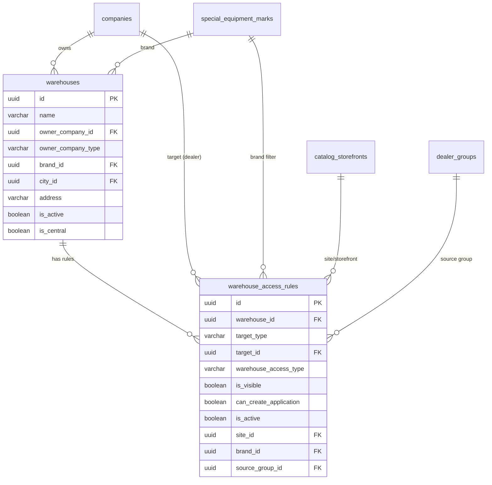
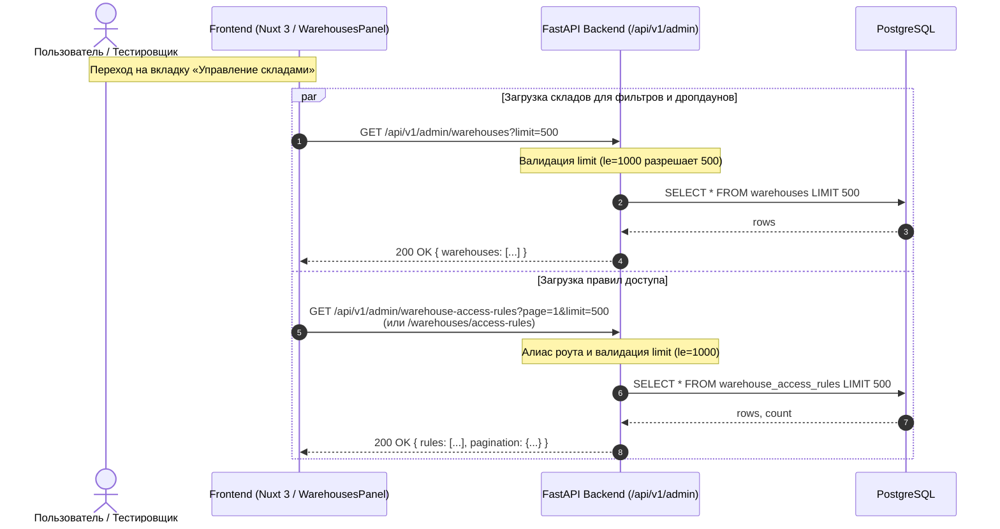

# task_2026-09-23_02-42-46_MSK.md

## Метаданные
- **Задача:** Bugfix к MR !427 (Bitrix #21670: «Доработка справочника складов и управление доступом к складам»)
- **MR:** https://gitlab.carcraft.ru/carcraft/carcraft-leadgenerator/-/merge_requests/427
- **Bitrix24:** https://carcraftpro.bitrix24.ru/company/personal/user/302/tasks/task/view/21670/
- **Ветка:** `bugfix/21670`
- **Дата создания:** 2026-09-23 02:42:46 MSK (UTC+3)

---

## Диаграмма сущностей БД (ERD)



---

## Диаграмма последовательности (Sequence Diagram)



---

## Постановка проблемы

После слияния MR !427 при открытии вкладки «Управление складами» (`/workspace/warehouses`) на тестовом стенде возникают две блокирующие ошибки:

1. **HTTP 404 Not Found** при обращении к эндпоинту правил доступа:
   `GET https://test.multileasing.ru/api/v1/admin/warehouse-access-rules?page=1&limit=500`
   - **Причина:** В бэкенде эндпоинты были объявлены по пути `/warehouses/access-rules` (префикс роутера `/api/v1/admin`), формируя `/api/v1/admin/warehouses/access-rules`, в то время как во фронтенде (`warehousesApi.ts`) и в диаграмме спецификации ТЗ был зафиксирован путь `/api/v1/admin/warehouse-access-rules`. Кроме того, метод обновления правил во фронтенде отправляет `PUT`, а в бэкенде был зарегистрирован только `PATCH`.

2. **HTTP 422 Unprocessable Entity** при получении списка складов:
   `GET https://test.multileasing.ru/api/v1/admin/warehouses?limit=500`
   - **Тело ошибки:**
     ```json
     {
       "type": "about:blank",
       "title": "Warehouse validation error",
       "status": 422,
       "detail": "Проверьте данные запроса: Лимит: значение должно быть не больше 200",
       "code": "VALIDATION_ERROR"
     }
     ```
   - **Причина:** В методе `getMyWarehouses()` фронтенда захардкожен запрос `limit=500` для заполнения выпадающих списков складов в фильтрах и модальных окнах. В бэкенде в `list_warehouses` и `list_access_rules_endpoint` параметр `limit` был ограничен `le=200`, из-за чего любой запрос с `limit=500` отклонялся валидацией FastAPI.

---

## Требования

1. **Поддержка алиасов путей для правил доступа:**
   Бэкенд должен поддерживать оба формата URL для управления правилами доступа к складам:
   - Канонический путь: `/api/v1/admin/warehouses/access-rules`
   - Алиас: `/api/v1/admin/warehouse-access-rules`
   Для всех операций:
   - `GET /api/v1/admin/warehouses/access-rules` и `GET /api/v1/admin/warehouse-access-rules`
   - `POST /api/v1/admin/warehouses/access-rules` и `POST /api/v1/admin/warehouse-access-rules`
   - `PATCH` / `PUT /api/v1/admin/warehouses/access-rules/{rule_id}` и `PATCH` / `PUT /api/v1/admin/warehouse-access-rules/{rule_id}`
   - `DELETE /api/v1/admin/warehouses/access-rules/{rule_id}` и `DELETE /api/v1/admin/warehouse-access-rules/{rule_id}`

2. **Расширение допустимого лимита пагинации (`limit`):**
   В роутере `backend/presentation/routers/admin_warehouses.py` увеличить верхнюю границу параметра `limit` до `le=1000` (по аналогии с `/api/v1/companies`):
   - В эндпоинте списка складов `list_warehouses` (`limit: int = Query(default=20, ge=1, le=1000)`)
   - В эндпоинте правил доступа `list_access_rules_endpoint` (`limit: int = Query(default=20, ge=1, le=1000)`)
   - В эндпоинте техники на складе `list_warehouse_vehicles` (`limit: int = Query(default=20, ge=1, le=1000)`)

3. **Синхронизация во фронтенде (`warehousesApi.ts`):**
   - Убедиться, что `updateAccessRule` совместим с бэкендом (поддержка `PATCH`/`PUT`).
   - Сохранить корректную работу всех модальных окон и фильтров.

---

## Планируемые изменения

1. **`backend/presentation/routers/admin_warehouses.py`:**
   - Добавить роут-декораторы для путей `/warehouse-access-rules` параллельно с `/warehouses/access-rules`.
   - Зарегистрировать метод `PUT` наряду с `PATCH` для обновления правила доступа (`update_access_rule_endpoint`).
   - Изменить валидацию `limit` с `le=200` на `le=1000` в `list_warehouses`, `list_access_rules_endpoint`, `list_warehouse_vehicles`.

2. **`frontend/features/admin/warehouses/api/warehousesApi.ts`:**
   - Использовать методы `PATCH` и `PUT` согласованно.

3. **Тестирование и валидация:**
   - Написать интеграционные тесты для проверки алиасов путей `/api/v1/admin/warehouse-access-rules` и `/api/v1/admin/warehouses/access-rules`, а также запросов с `limit=500`.
   - Проверить статический анализ (`ruff`, `mypy`, `lint-imports`, `vue-tsc`).
   - Проверить соответствие миграций БД (`alembic check`).

---

## Критерии приёмки (Acceptance Criteria)

- **AC-1:** Запрос `GET /api/v1/admin/warehouses?limit=500` возвращает HTTP 200 с массивом складов и корректной пагинацией (без ошибки валидации 422).
- **AC-2:** Запрос `GET /api/v1/admin/warehouse-access-rules?page=1&limit=500` возвращает HTTP 200 со списком правил доступа и пагинацией.
- **AC-3:** Запрос `GET /api/v1/admin/warehouses/access-rules?page=1&limit=500` возвращает идентичный ответ HTTP 200.
- **AC-4:** Запросы создания (`POST`), обновления (`PUT` и `PATCH`) и удаления (`DELETE`) правил доступа успешно отрабатывают по обоим путям (`/warehouse-access-rules` и `/warehouses/access-rules`).
- **AC-5:** Линтеры и типизация (`ruff`, `lint-imports`, `mypy`, `vue-tsc`) проходят без ошибок.
- **AC-6:** `alembic check` подтверждает отсутствие незафиксированных изменений схемы БД.
