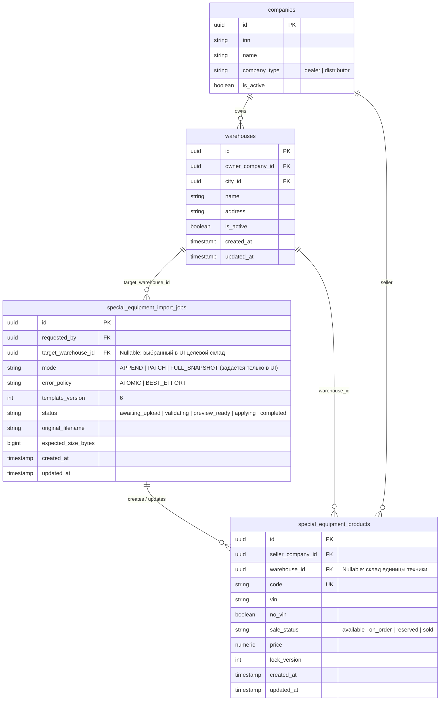
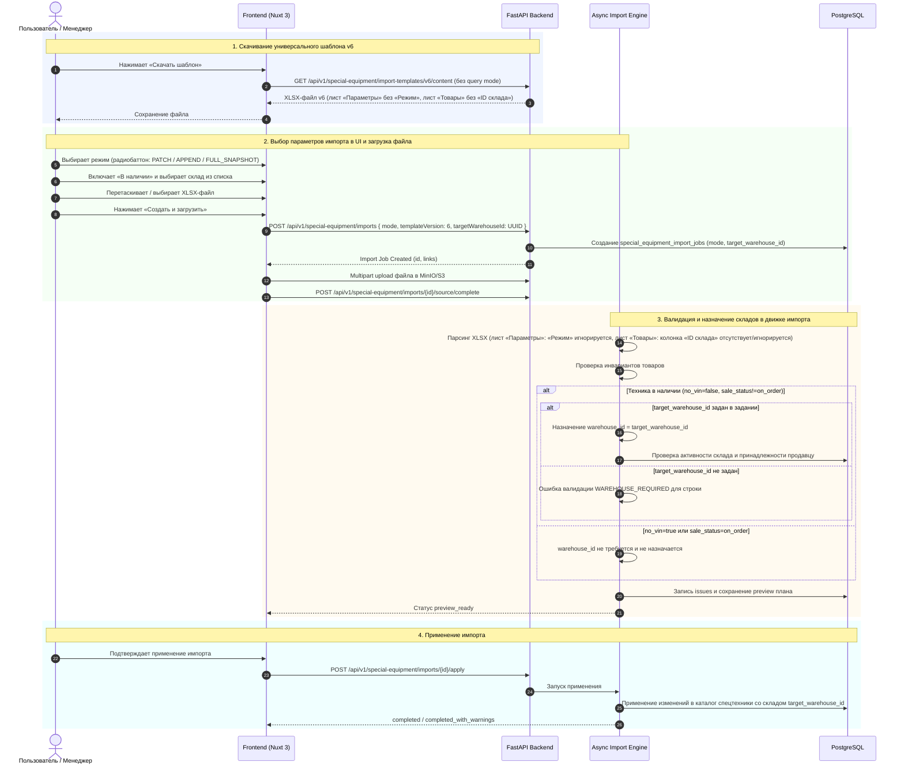

# Спецификация: Удаление режима и ID склада из XLSX-шаблона импорта спецтехники и привязка к UI-параметрам

- **Дата и время создания:** 2026-09-23 12:38:01 MSK (UTC+3)
- **Идентификатор задачи (slug):** `se-import-mode-warehouse-ui`
- **Тип задачи:** `feature`
- **Ветка задачи:** `feature/se-import-mode-warehouse-ui`
- **Целевая ветка для MR:** `test`

---

## 1. Диаграмма сущностей (ERD)

> **Примечание по схеме БД:** Модель данных уже поддерживает поле `special_equipment_import_jobs.target_warehouse_id` и `special_equipment_products.warehouse_id`. Изменения схемы БД и миграции Alembic не требуются.

---

## 2. Диаграмма последовательности (Sequence Diagram)

---

## 3. Постановка задачи и цели

В текущей реализации импорта спецтехники:
1. Режим импорта (`APPEND`, `PATCH`, `FULL_SNAPSHOT`) записывался в ячейку «Режим» на служебном листе «Параметры» XLSX-шаблона. При загрузке файла бэкенд сверял режим из файла с режимом, выбранным на фронтенде, и при несовпадении отклонял загрузку с ошибкой `PARAMETERS_MODE_MISMATCH`. Из-за этого при смене радиобаттона режима пользователю требовалось скачивать файл шаблона заново.
2. В файле XLSX на листе «Товары» существовала колонка «ID склада», требующая указания 36-символьного UUID склада. При этом в интерфейсе уже существует блок «В наличии» с выбором активного склада компании (`target_warehouse_id`), который использовался лишь как fallback.

**Цели доработки:**
1. Исключить параметр «Режим» из XLSX-файла и сделать шаблон единым и универсальным. Режим изменений определяется исключительно пользователем в интерфейсе (радиобаттонами «Добавление и изменение», «Только добавление», «Полная замена»).
2. Убрать колонку «ID склада» из XLSX-шаблона листа «Товары». Привязка импортируемой техники в наличии должна выполняться исключительно к складу, выбранному пользователем в блоке «В наличии» (`target_warehouse_id`) на странице импорта.

---

## 4. Функциональные требования

### 4.1. Режим импорта
1. **Генерация шаблона:**
   - Из служебного листа `Параметры` генерируемого XLSX-файла (версия v6) удаляется строка `("Режим", ...)`.
   - Лист `Параметры` содержит только метаданные: «Версия шаблона», «Дата формирования», «Маркер очистки».
   - Из листа `Инструкция` шаблона удаляется описание о том, что режим фиксируется в файле.
   - Эндпоинт `GET /api/v1/special-equipment/import-templates/v6/content` отдает универсальный шаблон независимо от query-параметра `mode`. Query-параметр `mode` становится необязательным.
2. **Валидация манифеста при импорте:**
   - Поле `mode` на листе «Параметры» исключается из обязательных ключей (`required`).
   - Если в загруженном файле (например, в файле старого формата или повторно загруженном) присутствует ключ «Режим»/`mode`, парсер **не вызывает ошибку** `PARAMETERS_KEY_UNKNOWN` и **не сравнивает** его с режимом задания (`PARAMETERS_MODE_MISMATCH` больше не выбрасывается). Значение из файла полностью игнорируется.
   - Режим импорта для всех этапов валидации, построения preview и применения берётся **исключительно из поля `job.mode`**, переданного фронтендом при создании задания (`POST /api/v1/special-equipment/imports`).

### 4.2. Склады и привязка техники
1. **Структура колонок листа «Товары» (products):**
   - Из заголовков листа `Товары` шаблона v6 (`DATA_SHEET_HEADERS["products"]`) удаляется колонка `ID склада`.
   - Из списка полей маппинга (`DATA_SHEET_FIELDS["products"]`) удаляется поле `warehouse_id`.
   - Из листа `Инструкция` удаляется описание формата «ID склада — UUID существующего склада...».
2. **Обработка данных при импорте:**
   - Парсер товаров больше не извлекает `warehouse_id` из строки Excel и не проставляет флаг `_warehouse_assignment_explicit`.
   - Если пользователь загрузил файл с техникой в наличии (`no_vin=false`, `sale_status != 'on_order'`):
     - Если в интерфейсе был включен чекбокс «В наличии» и выбран `target_warehouse_id`, этот склад назначается всем импортируемым единицам техники с VIN.
     - Если `target_warehouse_id` не был передан при создании задания, строка товара в наличии отклоняется с ошибкой валидации `WAREHOUSE_REQUIRED` («Товар с VIN требует назначения склада»).
   - Для виртуальной техники без VIN (`no_vin=true`) и техники под заказ (`sale_status='on_order'`) складская связь не требуется и не назначается.
   - В случае старых файлов, содержащих колонку «ID склада», её содержимое игнорируется, и приоритет имеет выбранный в UI `target_warehouse_id`.

### 4.3. Пользовательский интерфейс (Frontend)
1. В компоненте [`SpecialEquipmentImportUpload.vue`](file:///Users/a_belianskii/projects/carcraft-leadgenerator/frontend/features/specialEquipmentImport/components/SpecialEquipmentImportUpload.vue):
   - Ссылка скачивания шаблона `templateDownloadUrl` не должна зависеть от выбранного значения радиобаттона `mode`. Скачивание отдаёт универсальный шаблон без привязки к режиму.
   - Блок радиобаттонов «Режим изменений» управляет режимом создаваемого импорта (`mode: 'PATCH' | 'APPEND' | 'FULL_SNAPSHOT'`).
   - Блок «В наличии» с чекбоксом и выпадающим списком активных складов передаёт `target_warehouse_id` в запросе `start`.
   - Валидация кнопки «Создать и загрузить»: если включен чекбокс «В наличии», выбор склада обязателен (`!targetWarehouseId` блокирует отправку).

---

## 5. Планируемые изменения по файлам

| Файл | Описание изменений |
|---|---|
| [`backend/domain/special_equipment_import.py`](file:///Users/a_belianskii/projects/carcraft-leadgenerator/backend/domain/special_equipment_import.py) | Удалить `"ID склада"` из `DATA_SHEET_HEADERS["products"]` и `"warehouse_id"` из `DATA_SHEET_FIELDS["products"]` для версии v6. |
| [`backend/infrastructure/services/special_equipment_xlsx.py`](file:///Users/a_belianskii/projects/carcraft-leadgenerator/backend/infrastructure/services/special_equipment_xlsx.py) | 1. Исключить `"Режим"` из генерации листа `Параметры` в `_build_template`. 2. Убрать `"mode"` из обязательных ключей `_validate_manifest` и убрать проверку `PARAMETERS_MODE_MISMATCH`. Разрешить наличие ключа `"mode"` среди допустимых без проверки. 3. Обновить тексты на листе `Инструкция` (убрать упоминание «ID склада» и режима). 4. В генерации шаблона v6 формировать универсальное имя файла без суффикса режима. |
| [`backend/application/special_equipment_import.py`](file:///Users/a_belianskii/projects/carcraft-leadgenerator/backend/application/special_equipment_import.py) | В функции `request_import_template` сделать параметр `mode` опциональным или не влияющим на имя и содержимое файла для v6 (`special-equipment-v6.xlsx`). |
| [`backend/presentation/routers/special_equipment_imports.py`](file:///Users/a_belianskii/projects/carcraft-leadgenerator/backend/presentation/routers/special_equipment_imports.py) | Сделать параметр `mode` опциональным в `GET /import-templates/v6/content`, обновить описание эндпоинта. |
| [`backend/application/special_equipment_import_v2.py`](file:///Users/a_belianskii/projects/carcraft-leadgenerator/backend/application/special_equipment_import_v2.py) | 1. Убрать обработку `_warehouse_assignment_explicit`. 2. Всегда применять `target_warehouse_id` ко всем товарам с VIN. 3. Убрать валидацию колонки `ID склада` из файла. |
| [`backend/application/tasks/special_equipment_import.py`](file:///Users/a_belianskii/projects/carcraft-leadgenerator/backend/application/tasks/special_equipment_import.py) | В `_effective_warehouse_id` и `_row_requires_warehouse` определять склад исключительно по `target_warehouse_id`. |
| [`backend/infrastructure/repositories/special_equipment_import_repository.py`](file:///Users/a_belianskii/projects/carcraft-leadgenerator/backend/infrastructure/repositories/special_equipment_import_repository.py) | В `_target_warehouse_product_ids` убрать фильтрацию по `_warehouse_assignment_explicit`. |
| [`frontend/features/specialEquipmentImport/components/SpecialEquipmentImportUpload.vue`](file:///Users/a_belianskii/projects/carcraft-leadgenerator/frontend/features/specialEquipmentImport/components/SpecialEquipmentImportUpload.vue) | Убрать `mode` из `templateDownloadUrl`. Шаблон скачивается статично без query-параметра режима. |
| [`backend/tests/test_special_equipment_import_v2.py`](file:///Users/a_belianskii/projects/carcraft-leadgenerator/backend/tests/test_special_equipment_import_v2.py) | Обновить unit- и интеграционные тесты импорта: проверка отсутствия колонки `ID склада` в v6, игнорирование режима из файла, привязка к `target_warehouse_id`. |

---

## 6. Критерии готовности (DoD)

1. [ ] В сгенерированном шаблоне v6 на листе «Параметры» отсутствует строка «Режим».
2. [ ] В сгенерированном шаблоне v6 на листе «Товары» отсутствует колонка «ID склада».
3. [ ] Скачивание шаблона v6 в UI не зависит от выбранного радиобаттона режима импорта.
4. [ ] Файл XLSX успешно принимается и валидируется независимо от того, был ли в файле указан режим или нет; режим берется исключительно из параметров задания (`job.mode`), выбранных в UI.
5. [ ] При загрузке техники с VIN при включенном чекбоксе «В наличии» и выбранном складе в UI, все созданные/обновленные единицы техники привязываются к выбранному складу.
6. [ ] При попытке импортировать технику с VIN без выбора склада в UI возникает ошибка валидации `WAREHOUSE_REQUIRED` (позиции не привязываются к фиктивным складам и не сохраняются без склада).
7. [ ] Линтеры и статические проверки бэкенда проходят без ошибок:
   - `uv run ruff check . --fix`
   - `uv run lint-imports`
   - `uv run mypy .`
8. [ ] Проверка отсутствия изменений схемы БД через Alembic (`uv run alembic check`) подтверждает отсутствие расхождений.
9. [ ] E2E/Playwright сценарий импорта спецтехники успешно выполняется на запущенном окружении.
10. [ ] Создан Merge Request в ветку `test` со ссылкой на проверки и описанием изменений.
