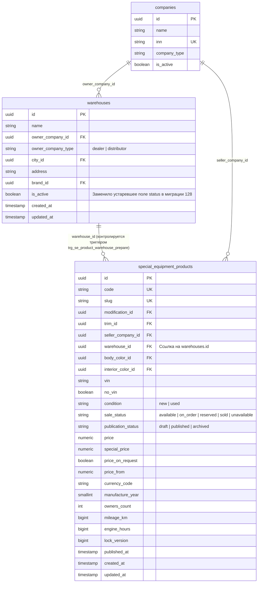

# Bugfix: Исправление триггера `se_product_warehouse_prepare` при создании и обновлении объявлений спецтехники со складом (#21670)

- **Дата и время создания:** 2026-09-23 13:36:28 MSK (UTC+3)
- **Идентификатор задачи Bitrix24:** [21670](https://carcraftpro.bitrix24.ru/company/personal/user/302/tasks/task/view/21670/)
- **Связанный MR:** [!427 (feat(warehouses): #21670 Доработка справочника складов и управление доступом к складам)](https://gitlab.carcraft.ru/carcraft/carcraft-leadgenerator/-/merge_requests/427)
- **Тип задачи:** `bugfix`
- **Ветка задачи:** `bugfix/21670-se-product-warehouse-trigger`
- **Целевая ветка для MR:** `test`

---

## 1. Диаграмма сущностей (ERD)



---

## 2. Постановка проблемы и диагностика

### Симптом
При создании объявления в каталоге спецтехники (интерфейс администратора `https://test.multileasing.ru/workspace/special-equipment-catalog?section=products`) запрос:
```http
POST /api/v1/admin/special-equipment/products
```
завершается с ошибкой `500 Internal Server Error`.
В логах контейнера `carcraft-lead-generator-fastapi`:
```text
POST /api/v1/admin/special-equipment/products -> 500 in 299.44 ms req=394e2b1d-2368-138e-f947-457d2048c4a7
Exception in ASGI application
```

### Воспроизведение и первопричина (Root Cause)
1. В миграции `096_special_equipment_warehouse_lifecycle.py` был создан триггер `trg_se_product_warehouse_prepare` на таблице `special_equipment_products` (`BEFORE INSERT OR UPDATE OF no_vin, warehouse_id`), вызывающий функцию:
   ```sql
   CREATE FUNCTION se_product_warehouse_prepare()
   RETURNS trigger
   LANGUAGE plpgsql
   AS $$
   DECLARE
       warehouse_status text;
   BEGIN
       ...
       IF NEW.warehouse_id IS NOT NULL THEN
           SELECT status INTO warehouse_status
           FROM warehouses
           WHERE id = NEW.warehouse_id;
           ...
           IF warehouse_status IS DISTINCT FROM 'active' THEN
               RAISE EXCEPTION 'special-equipment product warehouse must be active'
                   USING ERRCODE = '23514',
                         CONSTRAINT = 'trg_se_product_warehouse_active';
           END IF;
       END IF;
       RETURN NEW;
   END;
   $$;
   ```
2. В задаче [#21670](https://carcraftpro.bitrix24.ru/company/personal/user/302/tasks/task/view/21670/) (MR !427) в миграции `128_warehouse_access_rules_and_fields.py` таблица `warehouses` была обновлена: колонка `status` была удалена (`op.drop_column("warehouses", "status")`), а вместо неё активность склада переведена на булеву колонку `is_active boolean NOT NULL`.
3. Однако тело триггерной функции `se_product_warehouse_prepare()` не было обновлено в миграции 128.
4. В результате при попытке добавить или обновить товар с `warehouse_id` в PostgreSQL триггер выполняет `SELECT status INTO warehouse_status FROM warehouses WHERE id = NEW.warehouse_id;`, что приводит к ошибке PostgreSQL:
   ```text
   sqlalchemy.exc.ProgrammingError: (sqlalchemy.dialects.postgresql.asyncpg.ProgrammingError)
   <class 'asyncpg.exceptions.UndefinedColumnError'>: column "status" does not exist
   ```
5. Так как `UndefinedColumnError` / `ProgrammingError` не является `IntegrityError` или `DomainError`, она не перехватывается специфичными обработчиками и возвращается клиенту как необработанное исключение `500 Internal Server Error`.

---

## 3. Требования к исправлению

1. **Alembic-миграция 131:**
   - Добавить новую ревизию Alembic (`backend/alembic/versions/131_update_se_product_warehouse_trigger.py`) с `down_revision = "130"`.
   - В `upgrade()` обновить функцию `se_product_warehouse_prepare()` (`CREATE OR REPLACE FUNCTION`) для проверки активности склада через колонку `is_active boolean`:
     ```sql
     CREATE OR REPLACE FUNCTION se_product_warehouse_prepare()
     RETURNS trigger
     LANGUAGE plpgsql
     AS $$
     DECLARE
         warehouse_is_active boolean;
     BEGIN
         IF TG_OP = 'UPDATE' AND NOT OLD.no_vin AND NEW.no_vin THEN
             NEW.warehouse_id := NULL;
         END IF;

         IF NEW.no_vin AND NEW.warehouse_id IS NOT NULL THEN
             RAISE EXCEPTION 'a no_vin product cannot have a warehouse'
                 USING ERRCODE = '23514',
                       CONSTRAINT = 'trg_se_product_warehouse_no_vin';
         END IF;

         IF NEW.warehouse_id IS NOT NULL THEN
             SELECT is_active INTO warehouse_is_active
             FROM warehouses
             WHERE id = NEW.warehouse_id;

             IF NOT FOUND THEN
                 RAISE EXCEPTION 'special-equipment product warehouse does not exist'
                     USING ERRCODE = '23503',
                           CONSTRAINT = 'fk_se_products_warehouse';
             END IF;
             IF warehouse_is_active IS NOT TRUE THEN
                 RAISE EXCEPTION 'special-equipment product warehouse must be active'
                     USING ERRCODE = '23514',
                           CONSTRAINT = 'trg_se_product_warehouse_active';
             END IF;
         END IF;
         RETURN NEW;
     END;
     $$;
     ```
   - В `downgrade()` возвращать исходное определение (для симметрии миграций).

2. **Проверка репозитория и команд:**
   - Убедиться, что в `special_equipment_management_repository.py` метод `warehouse_is_active` корректно проверяет `Warehouse.is_active.is_(True)` / `Warehouse.status == "active"`.
   - Проверить, что `trg_se_product_warehouse_active` по-прежнему транслируется в код ошибки `WAREHOUSE_INACTIVE` в `product_warehouse_integrity_error_code`.

3. **Тестирование:**
   - Добавить регрессионный тест, который проверяет работу триггера `se_product_warehouse_prepare()`:
     1) Успешное создание товара со складом, у которого `is_active = True`.
     2) Отклонение создания товара со складом, у которого `is_active = False` (срабатывание триггера с `trg_se_product_warehouse_active` и возврат клиенту статуса 422 `WAREHOUSE_INACTIVE`).
     3) Отклонение создания товара со складом, если `no_vin = True` (срабатывание триггера `trg_se_product_warehouse_no_vin` и возврат 422 `WAREHOUSE_NOT_ALLOWED`).
   - Проверить `alembic upgrade head` и `alembic check`.

---

## 4. Критерии готовности (Definition of Done)

1. Миграция `131_update_se_product_warehouse_trigger.py` создана и успешно применяется.
2. `uv run alembic upgrade head` и `uv run alembic check` завершаются без ошибок и без нераспознанных изменений схемы.
3. Статические проверки FastAPI (`ruff check`, `lint-imports`, `mypy`) зеленые.
4. Тесты создания объявления со складом через API `/api/v1/admin/special-equipment/products` успешно проходят, возвращая статус `201 Created` при валидном складе и `422 WAREHOUSE_INACTIVE` при неактивном складе (вместо 500).
5. Создан Merge Request в ветку `test` со ссылкой на задачу Bitrix24 #21670.
