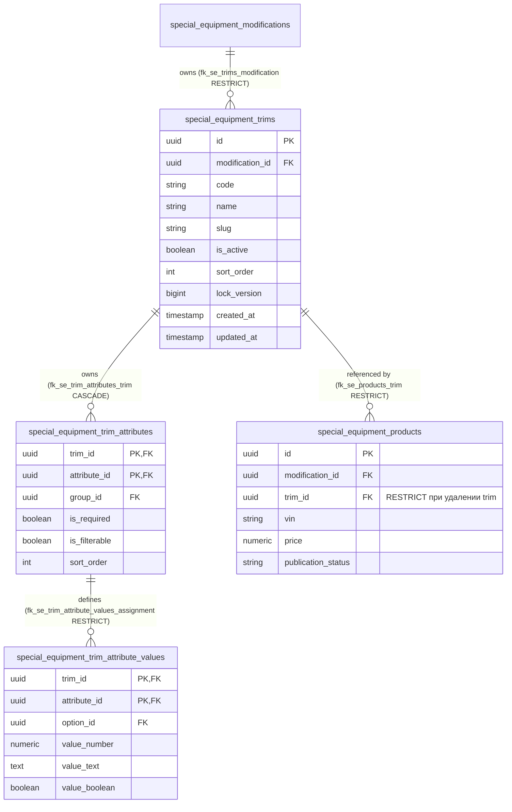
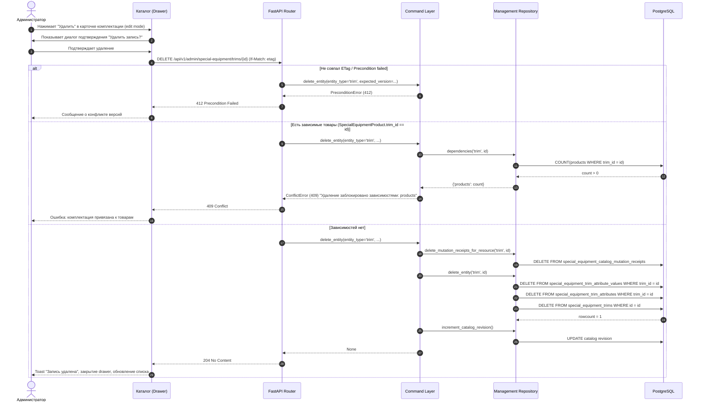

# Feature: Удаление комплектаций спецтехники на фронтенде и бэкенде

- **Дата и время создания:** 2026-09-23 15:04:33 MSK (UTC+3)
- **Идентификатор задачи:** Внутренняя задача (`special-equipment-trim-deletion`)
- **Тип задачи:** `feature`
- **Ветка задачи:** `feature/special-equipment-trim-deletion`
- **Целевая ветка для MR:** `test`

---

## 1. Диаграмма сущностей (ERD)

---

## 2. Диаграмма последовательности (Sequence Diagram)

---

## 3. Постановка задачи

В интерфейсе управления справочниками спецтехники (`/workspace/special-equipment-catalog?section=trims`) администраторы не имеют возможности удалить комплектацию:
1. **Фронтенд:** В файле `frontend/features/specialEquipment/management/correction/CatalogCorrectionRegistryPage.vue` передаётся флаг `:can-delete="entity !== 'trims'"`. Из-за этого кнопка «Удалить» в подвале drawer (`CatalogCorrectionDrawer.vue`) скрыта для комплектаций, в отличие от модификаций, моделей и марок.
2. **Бэкенд:** Маршрутизатор `DELETE /api/v1/admin/special-equipment/{resource}/{entity_id}` в `backend/presentation/routers/special_equipment_management.py` уже поддерживает `resource = "trims"`. Однако в `backend/infrastructure/repositories/special_equipment_management_repository.py` метод `delete_entity()` выполняет прямое удаление `SpecialEquipmentTrim`. Если для комплектации заданы характеристики и их значения, прямое удаление завершается ошибкой СУБД из-за внешнего ключа `fk_se_trim_attribute_values_assignment` с правилом `ON DELETE RESTRICT` на таблице `special_equipment_trim_attribute_values`.

Необходимо реализовать возможность удаления комплектации как на фронтенде, так и на бэкенде по аналогии с остальными сущностями справочника (в частности, модификациями).

---

## 4. Требования

### 4.1. Фронтенд
1. В drawer редактирования комплектации (`CatalogCorrectionDrawer.vue`) при открытии существующей комплектации (`mode === 'edit'`) и наличии прав на запись должна отображаться кнопка «Удалить» в блоке `.se-drawer__danger-actions`.
2. По клику на кнопку «Удалить» должен открываться диалог подтверждения удаления («Удалить запись?»).
3. При подтверждении должен отправляться запрос `DELETE /api/v1/admin/special-equipment/trims/{id}` с заголовком `If-Match: <etag>`.
4. При успешном ответе (204):
   - Отображается всплывающее уведомление «Запись удалена»;
   - Drawer закрывается;
   - Перезагружаются список строк, справочники и счетчики разделов.
5. При ошибках 409 (наличие зависимых товаров) или 412 (конфликт версий) отображается соответствующее сообщение об ошибке, drawer остаётся открытым для повторной попытки.

### 4.2. Бэкенд
1. Эндпоинт `DELETE /api/v1/admin/special-equipment/trims/{entity_id}` (доступен через общий маршрут `DELETE /{resource}/{entity_id}`) должен:
   - Требовать права администратора/оператора с доступом на запись (`WriteUser`);
   - Проверять заголовок `If-Match` и актуальность версии ресурса (`SpecialEquipmentTrim.lock_version`); при несовпадении возвращать 412;
   - Проверять наличие зависимостей через `repository.dependencies(session, 'trim', entity_id)`: если к комплектации привязаны товары (`SpecialEquipmentProduct.trim_id`), возвращать 409 Conflict с указанием `products`;
   - При отсутствии зависимых товаров удалять:
     1. Значения характеристик комплектации (`SpecialEquipmentTrimAttributeValue.trim_id == entity_id`);
     2. Назначенные характеристики комплектации (`SpecialEquipmentTrimAttribute.trim_id == entity_id`);
     3. Саму комплектацию (`SpecialEquipmentTrim.id == entity_id`);
   - Очищать квитанции мутаций (`SpecialEquipmentCatalogMutationReceipt`);
   - Инкрементировать ревизию каталога спецтехники;
   - Возвращать 204 No Content.
2. Если комплектация не найдена, возвращать 404 Not Found.

---

## 5. Планируемые изменения

1. **`frontend/features/specialEquipment/management/correction/CatalogCorrectionRegistryPage.vue`:**
   - Изменить передачу флага `can-delete` в `<CatalogCorrectionDrawer>`: вместо `:can-delete="entity !== 'trims'"` передавать `:can-delete="canWrite"`.
2. **`backend/infrastructure/repositories/special_equipment_management_repository.py`:**
   - В функции `delete_entity()` для `entity_type == "trim"` добавить предварительное каскадное удаление строк из `SpecialEquipmentTrimAttributeValue` и `SpecialEquipmentTrimAttribute` по `trim_id == entity_id`.
3. **`backend/tests/integration/test_special_equipment_trim_http_contract.py`:**
   - Добавить интеграционные тесты для HTTP-контракта удаления комплектации:
     - Успешное удаление комплектации с назначенными характеристиками и значениями (204 No Content);
     - Проверка удаления связанных записей в БД после 204;
     - Блокировка удаления комплектации при наличии привязанного товара (409 Conflict);
     - Проверка обязательного заголовка `If-Match` и конфликта версий (412 Precondition Failed);
     - Попытка удаления несуществующей комплектации (404 Not Found).

---

## 6. Критерии готовности (Acceptance Criteria)

- [x] В UI каталога спецтехники при редактировании комплектации отображается кнопка «Удалить».
- [x] Клик по кнопке «Удалить» вызывает модальное окно подтверждения.
- [x] При подтверждении комплектация без товаров успешно удаляется, отображается toast «Запись удалена», drawer закрывается, реестр обновляется.
- [x] При попытке удалить комплектацию, привязанную к товару, отображается сообщение об ошибке (409 Conflict).
- [x] При устаревшем `If-Match` возвращается 412 Precondition Failed.
- [x] Удаление комплектации с характеристиками и значениями не вызывает ошибок внешних ключей в PostgreSQL.
- [x] Все статические проверки бэкенда (`ruff check . --fix`, `lint-imports`, `mypy .`) проходят без ошибок.
- [x] `alembic check` подтверждает отсутствие расхождений схемы БД и ORM-моделей.
- [x] Новые и существующие интеграционные тесты бэкенда и проверки фронтенда проходят успешно.
