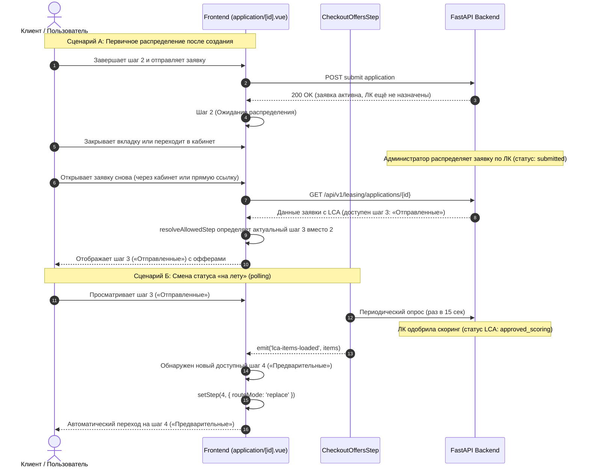

# Спецификация: автоматическое переключение шагов заявки при смене статуса

- **Bitrix:** https://carcraftpro.bitrix24.ru/workgroups/group/124/tasks/task/view/22282/ (Задача 4)
- **Дата и время создания:** 2026-09-23 16:18:17 MSK (UTC+3)
- **Идентификатор задачи:** `22282-4`
- **Тип задачи:** `feature`
- **Рабочая ветка:** `feature/22282-4`
- **Целевая ветка для MR:** `test`
- **Затрагиваемая область:** фронтенд (Nuxt 3, только desktop web, viewport от 768 CSS-пикселей)

---

## 1. Диаграмма последовательности взаимодействий

---

## 2. Постановка проблемы и контекст

В мастере оформления заявки на лизинг (`frontend/pages/application/[id].vue`) определены 8 шагов (`frontend/features/checkout/utils/steps.ts`):
1. «Анкета» (questionnaire);
2. «О компании» (company);
3. «Отправленные» (`sent`: `submitted`, `under_review`, `pending_distribution`, `closed`, `rejected_prescoring`, `rejected_approved`);
4. «Предварительные» (`preliminary`: `approved_scoring`, `approved_scoring_another_cond`);
5. «Доп. документы» (`documents`: `documents_required`, `under_review_with_docs`);
6. «Итоговое» (`final`: `approved_final`, `approved_final_another_cond`, `rejected_final`);
7. «Выбор ЛК» (`selected`: `selected_lc`);
8. «Сделка» (`deal`: `deal`).

### Текущие дефекты поведения:
1. **Зависание на шаге 2 при повторном открытии:**
   Когда клиент отправляет заявку на шаге 2, в хранилище сохраняется шаг 2, а URL содержит `?step=company` или `?step=2`.
   Затем администратор распределяет заявку по лизинговым компаниям (появляются LCA со статусом `submitted` — шаг 3).
   Когда пользователь снова открывает заявку, `onMounted` вызывает `resolveAllowedStep(route.query.step)`. Для значений `1` и `2` функция возвращает переданный шаг, так как статусная проверка применяется только к шагам `3..8`.
   В результате пользователь видит заблокированный шаг 2 («О компании») и вынужден вручную нажимать на шаг 3 в ленте шагов.
2. **Отсутствие автоперехода на новый шаг при обновлении статуса в реальном времени:**
   Когда пользователь находится на шаге 3 (или последующих), `CheckoutOffersStep.vue` каждые 15 секунд опрашивает API и эмитит событие `@lca-items-loaded`. В обработчике `handleLcaItemsLoaded` вызывается `ensureCurrentStatusStepAvailable()`, которая переключает шаг **только если текущий шаг стал недоступен**. Если текущий шаг (например, 3) остаётся доступным, а по одной из ЛК появился новый статус (например, шаг 4 «Предварительные» или шаг 5 «Доп. документы»), автоматического перехода на новый шаг не происходит.
3. **Жёсткая привязка `?step=3` в карточке заявки:**
   В `frontend/features/applications/components/ApplicationCard.vue` кнопка перехода в заявку захардкожена на `/application/${props.application.id}?step=3`, игнорируя реальное состояние заявки (шаги 4, 5, 6, 7, 8 или ещё не распределённый шаг 2).

---

## 3. Требования к реализации

1. **Функция определения актуального шага заявки (`resolveLatestAvailableStep`):**
   - Вычислять актуальный (наиболее продвинутый) шаг заявки:
     - Если у заявки есть доступные статусные шаги (`availableStatusStepNumbers.size > 0`), актуальным шагом является максимальный из доступных номеров: `Math.max(...availableStatusStepNumbers)`.
     - Если доступных статусных шагов нет, актуальным является шаг 2 (для отправленной заявки в ожидании распределения) или текущий редактируемый шаг.
2. **Логика первичной загрузки страницы заявки (`pages/application/[id].vue`):**
   - Если в `route.query.step` не передан конкретный доступный статусный шаг (параметр отсутствует, равен `1`, `2` или `company`), и при этом заявка уже распределена/отправлена и имеет доступные статусные шаги (`availableStatusStepNumbers.size > 0`):
     - Страница должна автоматически открывать актуальный шаг статуса (`latestAvailableStep`), синхронизируя URL без создания лишней истории (`replace`).
   - Если в `route.query.step` передан конкретный доступный шаг (например, переход из уведомления `?step=5`), он должен открываться в приоритетном порядке.
3. **Логика динамического обновления статуса «на лету» (`handleLcaItemsLoaded`):**
   - При получении новых данных по позициям ЛК (`lca-items-loaded`):
     - Отслеживать максимальный доступный статусный шаг до и после обновления.
     - Если появился новый более продвинутый доступный шаг (например, переход с 3 на 4, с 4 на 5 и т.д.):
       - Автоматически переключать `currentStep` на новый шаг через `setStep(newStep, { routeMode: 'replace' })`.
     - Если текущий шаг перестал быть доступным (прежнее поведение `ensureCurrentStatusStepAvailable`):
       - Безопасно переключать на ближайший доступный актуальный шаг.
4. **Сохранение кнопки «Продолжить» в карточке заявки (`ApplicationCard.vue`):**
   - Сама кнопка «Продолжить» (`<NuxtLink ...>Продолжить</NuxtLink>`) обязательно сохраняется в UI.
   - В вычисляемом пути `checkoutPath` заменяется захардкоженный `?step=3` на канонический путь `/application/${props.application.id}` (без принудительного ограничения шагом 3), чтобы при нажатии «Продолжить» пользователь сразу попадал на актуальный шаг заявки в соответствии с её реальным статусом.

---

## 4. План изменений в коде

### 4.1. Вспомогательные функции шагов (`frontend/features/checkout/utils/steps.ts`)
- Добавить функцию `getLatestStatusStepNumber(availableSteps: Iterable<number>): number | null`, возвращающую максимальный номер статусного шага (от 3 до 8) из набора доступных, либо `null`, если набор пуст.

### 4.2. Страница заявки (`frontend/pages/application/[id].vue`)
- Ввести вычисляемое свойство `latestAvailableStatusStep = computed(() => getLatestStatusStepNumber(availableStatusStepNumbers.value))`.
- В `resolveAllowedStep`:
  - Если запрошенный шаг — не статусный (`< 3` или строка `'company'`), но у заявки уже есть доступные статусные шаги (`latestAvailableStatusStep.value` существует), и заявка заблокирована для редактирования или ожидает/прошла распределение: возвращать `latestAvailableStatusStep.value`.
- В `handleLcaItemsLoaded`:
  - Запоминать предыдущий `latestAvailableStatusStep`.
  - Обновлять `application.value.leasing_company_applications`.
  - Вычислять новый `latestAvailableStatusStep`.
  - Если новый шаг больше предыдущего или текущий шаг `< 3`, выполнять автоматический переход на актуальный шаг статуса.
- В `onMounted` и watcher `route.params.id`:
  - Обеспечить применение актуального шага при инициализации данных заявки.

### 4.3. Карточка заявки в личном кабинете (`frontend/features/applications/components/ApplicationCard.vue`)
- Кнопка «Продолжить» сохраняется в шаблоне неизменной.
- Изменить `checkoutPath` с `/application/${props.application.id}?step=3` на `/application/${props.application.id}`.

---

## 5. Критерии готовности (Definition of Done)

1. **После создания и отправки заявки:**
   - Когда администратор распределяет заявку по ЛК, при повторном открытии заявки пользователем (через ЛК или прямую ссылку) открывается шаг 3 («Отправленные»), а не шаг 2 («О компании»).
2. **При смене статуса ЛК в процессе просмотра:**
   - При поступлении предварительного одобрения (`approved_scoring`) заявка автоматически переключается с шага 3 на шаг 4 («Предварительные»).
   - При запросе дополнительных документов (`documents_required`) заявка автоматически переключается на шаг 5 («Доп. документы»).
   - При итоговом одобрении (`approved_final`) заявка автоматически переключается на шаг 6 («Итоговое»).
   - При выборе ЛК / переходе в сделку заявка автоматически переключается на шаг 7 / шаг 8.
3. **Ручная навигация сохраняется:**
   - Если пользователь вручную нажимает на предыдущий доступный шаг (например, кликает на шаг 3, находясь на шаге 4), рядовой опрос без изменения статусов не выбрасывает его обратно на шаг 4.
4. **Кабинет пользователя:**
   - Кнопка перехода в заявку из ЛК открывает фактический актуальный шаг заявки в соответствии с её статусом.
5. **Проверки качества кода:**
   - Линтеры и сборка TypeScript на фронтенде проходят без ошибок:
     `bun run lint` (или `npx nuxi typecheck`).
   - Проверка Alembic на отсутствие расхождений со схемой БД (правило монорепозитория):
     `uv run alembic upgrade head` и `uv run alembic check`.
   - E2E сценарий покрытия логики шагов в `frontend/tests/e2e/`.
