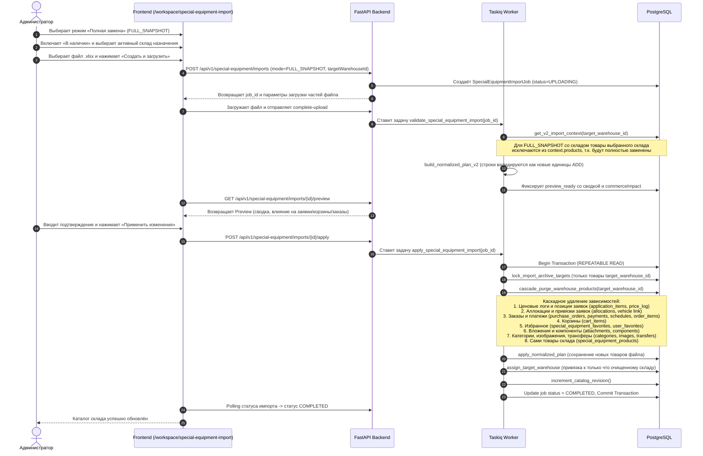

# task_2026-09-23_16-42-16_MSK.md

## Метаданные
- **Ветка:** `feature/se-import-warehouse-cascade-replace`
- **Целевая ветка:** `test`
- **Дата и время создания:** 2026-09-23 16:42:16 MSK (UTC+3)
- **Статус:** Согласовано
- **Тип задачи:** Bugfix / Feature

---

## 1. ER-диаграмма затронутых сущностей БД

```mermaid
erDiagram
    warehouses ||--o{ special_equipment_products : "warehouse_id"
    warehouses ||--o{ vehicle_warehouse_transfers : "source/destination"
    special_equipment_products ||--o{ special_equipment_product_categories : "product_id"
    special_equipment_products ||--o{ special_equipment_product_attachments : "product_id / attachment_product_id"
    special_equipment_products ||--o{ special_equipment_product_components : "composite_product_id / component_product_id"
    special_equipment_products ||--o{ special_equipment_product_images : "product_id"
    special_equipment_products ||--o{ special_equipment_cart_items : "product_id"
    special_equipment_products ||--o{ special_equipment_favorites : "product_id"
    special_equipment_products ||--o{ user_favorites : "product_id"
    special_equipment_products ||--o{ special_equipment_application_items : "product_id"
    special_equipment_application_items ||--o{ special_equipment_price_change_log : "item_id"
    special_equipment_products ||--o{ application_vehicle_allocations : "product_id"
    special_equipment_products ||--o{ application_vehicles : "product_id"
    special_equipment_products ||--o{ special_equipment_purchase_orders : "product_id"
    special_equipment_purchase_orders ||--o{ special_equipment_order_items : "purchase_order_id"
    special_equipment_products ||--o{ special_equipment_order_items : "product_id"
    special_equipment_purchase_orders ||--o{ special_equipment_payments : "purchase_order_id"
    special_equipment_payments ||--o{ special_equipment_payment_callback_inbox : "payment_id"
    special_equipment_purchase_orders ||--o{ special_equipment_leasing_payment_schedule : "purchase_order_id"
    special_equipment_products ||--o{ purchase_orders : "product_id"
    purchase_orders ||--o{ payments : "purchase_order_id"
    purchase_orders ||--o{ leasing_payment_schedule : "purchase_order_id"
    special_equipment_products ||--o{ exchange_cart_items : "product_id"
    special_equipment_products ||--o{ exchange_requests : "product_id"
    special_equipment_products ||--o{ vehicle_warehouse_transfers : "product_id"
```

---

## 2. Диаграмма последовательности импорта в режиме «Полная замена» со складом назначения

---

## 3. Постановка задачи

На странице `/workspace/special-equipment-import` при выборе:
- Режима «Полная замена» (`FULL_SNAPSHOT`);
- Чекбокса «В наличии» (`inStock = true`) с указанием конкретного активного склада назначения (`target_warehouse_id`);

импорт завершается ошибками конфликтов:
1. `FULL_SNAPSHOT` ошибочно трактует импорт как глобальную замену всей БД, включая другие склады, и пытается перевести в архив (`_v2_archive_products`) все отсутствующие в файле товары, вызывая `PRODUCT_ARCHIVE_FORBIDDEN` при наличии активных заявок/заказов/корзин.
2. При наличии существующих товаров на выбранном складе валидатор считает строки файла конфликтующими или отклоняет их (`OPERATION_TARGET_INVALID`), а при попытке удаления возникают нарушения внешних ключей `RESTRICT` из-за связанных записей в заявках, заказах, корзинах, избранном и компонентах.

**Цель:**
Обеспечить корректное замещение каталога техники выбранного склада:
1. Перед применением нового каталога для выбранного склада выполнять полное каскадное удаление текущих товаров этого склада и всех их зависимостей (заявки, корзины, избранное, заказы, платежи, вложения, связи компонентов, изображения), не затрагивая учётные записи пользователей и данные других складов.
2. Загружать и сохранять новые товары из файла с привязкой к очищенному складу без конфликтов.

---

## 4. Требования

1. **Изоляция по складу назначения:**
   - Если задан `target_warehouse_id` при режиме `FULL_SNAPSHOT`, операция полной замены ограничивается исключительно техникой указанного склада (`special_equipment_products.warehouse_id == target_warehouse_id`).
   - Товары других складов не должны архивироваться или удаляться.

2. **Каскадное удаление зависимостей товаров очищаемого склада:**
   Удаление должно выполняться в строгом топологическом порядке зависимостей в рамках транзакции `apply`:
   - `special_equipment_price_change_log` по строкам `special_equipment_application_items`;
   - `special_equipment_application_items` для удаляемых товаров;
   - `application_vehicle_allocations` для удаляемых товаров;
   - `application_vehicles`: обнуление ссылки `product_id = NULL` для удаляемых товаров;
   - `special_equipment_leasing_payment_schedule` и `special_equipment_payment_callback_inbox` (обнуление `payment_id = NULL`), `special_equipment_payments`, `special_equipment_order_items` для заказов удаляемых товаров;
   - `special_equipment_purchase_orders` для удаляемых товаров;
   - `leasing_payment_schedule`, `payments`, `purchase_orders` (legacy) для удаляемых товаров;
   - `special_equipment_cart_items` (дочерние и родительские позиции) для удаляемых товаров;
   - `exchange_cart_item_warehouses`, `exchange_cart_item_options`, `exchange_cart_item_dealer_comments`, `exchange_cart_items` для удаляемых товаров;
   - `exchange_requests` (с предварительным `accepted_bid_id = NULL`) для удаляемых товаров;
   - `special_equipment_favorites` и `user_favorites` для удаляемых товаров;
   - `special_equipment_product_attachments` (как для базового продукта, так и где товар был вложением);
   - `special_equipment_product_components` (как для составного продукта, так и где товар был компонентом);
   - `special_equipment_product_categories`, `special_equipment_product_images`, `vehicle_warehouse_transfers` для удаляемых товаров;
   - Сами записи `special_equipment_products` удаляемого склада.
   - **Пользователи (`users`) и компании (`companies`) ни в коем случае не удаляются.**

3. **Валидация и формирование плана (Preview):**
   - При `mode == ImportMode.FULL_SNAPSHOT` и непустом `target_warehouse_id` контекст существующих продуктов (`context["products"]`) не должен блокировать добавление новых товаров с теми же кодами склада (они будут удалены на шаге применения).
   - `lock_import_archive_targets` блокирует только товары очищаемого склада.
   - Расчёт сводки предварительного просмотра должен корректно показывать количество удаляемых товаров склада и влияние на пользовательские операции (`commerceImpact`).

4. **Атомарность:**
   - Каскадная очистка склада и вставка нового каталога выполняются в единой транзакции базы данных. Любая непредвиденная ошибка откатывает все изменения.

---

## 5. Планируемые изменения

1. **Репозиторный уровень (`backend/infrastructure/repositories/special_equipment_import_repository.py`):**
   - Добавить функцию `cascade_purge_warehouse_products(session: AsyncSession, warehouse_id: uuid.UUID) -> int`, реализующую безопасное каскадное удаление всех товаров склада и их зависимостей.
   - Доработать `lock_import_archive_targets`: принимать опциональный `target_warehouse_id` и при `mode == "FULL_SNAPSHOT"` фильтровать цели удаления по указанному складу.
   - Доработать `_v2_archive_missing_snapshot_products`: при наличии `target_warehouse_id` ограничивать проверку товарами целевого склада (или пропускать, так как склад полностью очищен).
   - Доработать `get_v2_import_context`: при `mode == "FULL_SNAPSHOT"` и наличии `target_warehouse_id` исключать товары данного склада из `context["products"]` во избежание ложных конфликтов `OPERATION_TARGET_INVALID` при создании новых товаров.

2. **Слой задач импорта (`backend/application/tasks/special_equipment_import.py`):**
   - В задаче `apply_special_equipment_import`: при `mode == "FULL_SNAPSHOT"` и `target_warehouse_id is not None` перед `apply_normalized_plan` вызывать `cascade_purge_warehouse_products(session, locked["target_warehouse_id"])`.
   - Передавать `target_warehouse_id` в `lock_import_archive_targets`.

3. **Слой валидации импорта (`backend/application/special_equipment_import_v2.py`):**
   - Учесть изоляцию `FULL_SNAPSHOT` по складу при вычислении `expected_product_versions` и проверке уникальности VIN/кодов.

4. **Тесты:**
   - Добавить интеграционные тесты в `backend/tests/test_special_equipment_import_warehouse_cascade.py`:
     - Импорт `FULL_SNAPSHOT` для склада с существующими товарами, у которых есть заявки (`special_equipment_application_items`), заказы (`purchase_orders`), корзины (`cart_items`), избранное (`favorites`), вложения и компоненты.
     - Проверка успешной очистки склада, отсутствия блокировок по внешним ключам и сохранения новых товаров файла с привязкой к складу.
     - Проверка неприкосновенности товаров на других складах и пользователей системы.

---

## 6. Критерии готовности (Acceptance Criteria)

1. Импорт в режиме `FULL_SNAPSHOT` с выбранным активным складом назначения успешно проходит предварительную проверку и применение без ошибок `PRODUCT_ARCHIVE_FORBIDDEN` или нарушений целостности внешних ключей.
2. Существовавшие на целевом складе товары и все их связанные сущности (заявки, заказы, корзины, избранное, связи компонентов/вложений) каскадно удаляются; пользователи не затрагиваются.
3. Новые товары из загруженного файла создаются и связываются с целевым складом.
4. Товары на других складах остаются неизменными.
5. Проверки `uv run ruff check . --fix`, `uv run lint-imports`, `uv run mypy .` и `uv run alembic check` завершаются без ошибок.
