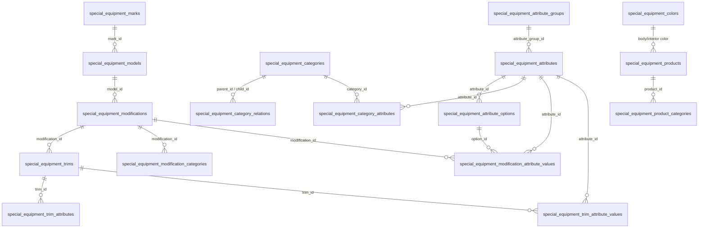
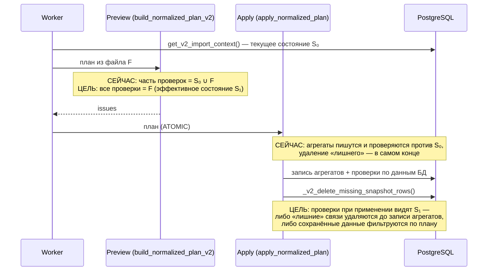

# task_2026-09-23_21-32-08_MSK.md

## Метаданные
- **Ветка:** `bugfix/se-import-full-snapshot-target-state`
- **Целевая ветка:** `test`
- **Дата и время создания:** 2026-09-23 21:32:08 MSK (UTC+3)
- **Статус:** Согласовано
- **Тип задачи:** Bugfix
- **Модуль:** импорт каталога спецтехники v2 (шаблоны v4–v6), режим «Полная замена» (`FULL_SNAPSHOT`)
- **Связанные материалы:** `specs/311.md` (п. 5.4, межуровневый инвариант); `fix-full-snapshot-trim-invariant.patch` — минимальный хотфикс для части случаев (см. п. 5.1)

---

## 1. ER-диаграмма затронутых сущностей БД

Схема БД не меняется. Затронуты все сущности и связи каталога, которые «Полная замена» удаляет или деактивирует, если их нет в файле.

Что «Полная замена» делает с отсутствующими в файле данными (`_v2_delete_missing_snapshot_rows`):

| Вид данных | Что происходит |
|---|---|
| Связи: `*_attribute_values`, `trim_attributes`, `modification_categories`, `category_attributes`, `category_relations`, `product_*` | удаляются |
| Справочники: `marks`, `models`, `modifications`, `trims`, `colors`, `categories`, `attributes`, `attribute_groups`, `attribute_options` | деактивируются (`is_active = false`) |
| Объявления | архивируются (при заданном складе — только на этом складе) |

---

## 2. Диаграмма последовательности: сейчас и целевое состояние

---

## 3. Постановка задачи

### 3.1. Ожидаемое поведение

«Полная замена» — декларативная операция: результат импорта файла F зависит **только от F**, а не от текущего состояния платформы S₀. Всё, чего нет в F, удаляется или деактивируется. Поэтому любая проверка согласованности в этом режиме должна вычисляться по **целевому (эффективному) состоянию S₁**, которое описывает файл, а не по S₀ и не по S₀ ∪ F.

Формально, для любого S₀: `FULL_SNAPSHOT(F)` над S₀ даёт тот же результат и те же ошибки, что `FULL_SNAPSHOT(F)` над пустым каталогом. Исключение — объявления: их история и коммерческие связи сохраняются по отдельным правилам (п. 4.5).

### 3.2. Фактическое поведение

Часть проверок на этапе предпросмотра и на этапе применения опирается на S₀. Отсюда два класса ошибок.

**Класс A — ложный конфликт.** Данные из S₀, которые «Полная замена» всё равно удалит, считаются действующими и блокируют корректный файл. Политика `ATOMIC` отклоняет весь импорт. Пользователь видит ошибку по строке, которая сама по себе корректна.

**Класс B — ложное разрешение.** Код в файле разрешается в сущность из S₀, хотя в файле этой сущности нет. Значит, при применении она будет деактивирована. Предпросмотр пропускает строку, и после импорта остаётся ссылка на неактивную сущность. Такое неконсистентное состояние позже всплывает в витрине и управляющих API.

### 3.3. Корневые причины

1. **Нет единого правила «базового состояния» для проверок.** Большая часть функций в `special_equipment_import_v2.py` уже использует шаблон `set() if mode is FULL_SNAPSHOT else <сохранённое>`: `_effective_trim_attribute_keys`, `_effective_category_contract`, `_attributes_for_modification`, `_required_attributes_for_categories`, `_validate_attribute_graph_mutation_plan`, `_effective_catalog_entities`, `_normalize_product_categories` и др. Но это соглашение, а не общий механизм. Новые проверки его пропускают.
2. **Порядок шагов при применении.** `apply_normalized_plan` сначала записывает агрегаты и при этом проверяет данные в БД, а удаляет отсутствующие в файле строки только в конце (`_v2_delete_missing_snapshot_rows`). Любая проверка на этапе применения, которая читает БД, видит S₀.
3. **Разрешение кодов** (`_resolved_id`, поиск варианта в `_typed_attribute_value`) при отсутствии кода в файле всегда подставляет сущность из S₀, независимо от режима.

### 3.4. Найденные места (аудит на 23.09.2026)

Аудит сделан по всем функциям `special_equipment_import_v2.py`, которые читают сохранённые коллекции `context`, и по проверкам на этапе применения в `special_equipment_import_repository.py`.

| № | Класс | Этап | Место | Проявление |
|---|---|---|---|---|
| A1 | A | Preview | `_effective_modification_value_keys` | `ATTRIBUTE_ALREADY_USED_IN_MODIFICATION`: значение характеристики у модификации в S₀ блокирует значение комплектации из файла |
| A2 | A | Preview | `_persisted_trim_value_keys_by_modification` | `ATTRIBUTE_ALREADY_ASSIGNED_IN_TRIM`: обратное направление |
| A3 | A | Apply | `_v2_lock_and_validate_trim_value_invariant` | тот же инвариант на этапе применения по всем сохранённым маркерам |
| A4 | A | Apply | `_v2_validate_entity_deactivation` | `ENTITY_DEACTIVATION_FORBIDDEN`: при явной деактивации характеристики, группы или варианта в файле учитываются зависимости `category_attributes` / `modification_values` из S₀, хотя они будут удалены |
| A5 | A* | Preview | `_normalize_color` + `_color_product_references` | смена применимости цвета блокируется ссылками объявлений из S₀. *Нужно продуктовое решение: архивные объявления продолжают ссылаться на цвет (п. 4.5)* |
| B1 | B | Preview | `_resolved_id` | код семейства, которого нет в листе файла, разрешается через `context[family]` из S₀ |
| B2 | B | Preview | `_typed_attribute_value` | вариант списка, которого нет в файле, берётся из `context["attribute_options"]` из S₀ |

Функции, которые читают S₀ только для слияния значений полей через `_merge_values(mode=…)` (`_normalize_category_attributes`, `_normalize_trim_attributes`, `_normalize_model` и т. п.), к ошибке не относятся: в `FULL_SNAPSHOT` пустые ячейки не наследуют старые значения.

### 3.5. Пример инцидента

Импорт `40510be7-9595-43eb-9b5f-17a7c2c98a12`, 23.09.2026.

- В S₀ у модификации есть значение `RAZMER_KOLES` на уровне модификации.
- В файле эта характеристика задана только на уровне комплектаций.
- Результат: 4 ошибки класса A1, импорт отклонён целиком.

---

## 4. Требования

### 4.1. Принцип эффективного состояния

1. Для каждого семейства сущностей и связей эффективное состояние вычисляется так:
   - `FULL_SNAPSHOT`: `S₁ = F` (строки файла; `DELETE`-строки файла ничего не добавляют);
   - `PATCH` / `APPEND`: `S₁ = S₀ ⊕ F` (добавления и изменения из F поверх S₀, `DELETE` убирает).
2. Все проверки согласованности (инварианты, допустимость, зависимости, лимиты) на обоих этапах используют S₁ и никогда не используют «сырое» S₀ в режиме `FULL_SNAPSHOT`.
3. S₀ в `FULL_SNAPSHOT` допустимо использовать только:
   - для сопоставления кода с существующим UUID, чтобы обновить сущность, а не создать новую;
   - для расчёта сводки изменений в предпросмотре (что будет создано, изменено, удалено);
   - для объявлений и коммерческих связей по правилам п. 4.5.

### 4.2. Предпросмотр

1. Базовое состояние для семейств связей вычисляется одним общим хелпером. Ручные конструкции `set() if FULL_SNAPSHOT else …` в местах проверок не пишутся.
2. A1 и A2 переводятся на общий хелпер.
3. **B1/B2.** В `FULL_SNAPSHOT` ссылка на код, которого нет в соответствующем листе файла, даёт ошибку строки `REFERENCE_NOT_IN_SNAPSHOT`: «Сущность отсутствует в файле полной замены и будет деактивирована». Сущность из S₀ не подставляется. Для `PATCH` / `APPEND` поведение не меняется.
4. **A5.** Проверка применимости цвета в `FULL_SNAPSHOT` учитывает ссылки только тех объявлений, которые останутся активными (есть в файле) — либо сохраняет текущую логику. Вариант выбирается на согласовании (п. 4.5).

### 4.3. Применение

Требование: проверки на этапе применения видят S₁. Способ реализации выбирается на согласовании:

- **Вариант 1 — порядок операций (рекомендуется как целевой).** `_v2_delete_missing_snapshot_rows` делится на две части:
  - `_v2_delete_missing_snapshot_relations` — удаление отсутствующих в файле связей. Выполняется **до** цикла по агрегатам.
  - `_v2_retire_missing_snapshot_entities` — деактивация справочников и архивация объявлений. Выполняется **после** цикла, как сейчас.

  Тогда A3 и A4 и любые будущие проверки по данным БД на этапе применения автоматически видят S₁. Транзакция одна, атомарность сохраняется.
- **Вариант 2 — фильтр по плану.** Один раз до цикла строится `snapshot_scope` — множества ключей плана по семействам связей. Каждая проверка на этапе применения в `FULL_SNAPSHOT` пересекает сохранённые данные с `snapshot_scope`. Это минимальное изменение (так сделано в хотфиксе для A3), но каждую новую проверку придётся дорабатывать вручную.

Независимо от варианта:

1. A4: зависимости при явной деактивации в `FULL_SNAPSHOT` считаются по S₁.
2. Деактивация «по отсутствию» (`_v2_deactivate_missing_entities`) и явная деактивация (`Активность = Нет`) дают одинаковый итог для одного и того же S₁. Сейчас первая выполняется без проверки зависимостей, вторая — с проверкой.
3. Если предпросмотр прошёл без ошибок, применение не должно падать на проверках согласованности каталога. Допустимые причины отказа при применении — конкурентные изменения, ошибки хранилища и изменения S₀ между предпросмотром и применением.

### 4.4. Режимы `PATCH` и `APPEND`

Поведение не меняется. Сохранённые данные участвуют во всех проверках. Конфликтующие строки пропускаются с issue по политике `BEST_EFFORT`.

### 4.5. Объявления и коммерческие данные

- Архивация отсутствующих объявлений и её ограничения (`PRODUCT_ARCHIVE_FORBIDDEN`, изоляция по складу назначения) регулируются задачей `task_2026-09-23_16-42-16_MSK.md` и здесь не меняются.
- Архивные объявления сохраняют ссылки на цвета, комплектации и модификации. Поэтому для A5 и для деактивации справочников, на которые ссылаются архивные объявления, нужно явное продуктовое решение: блокировать, предупреждать или разрешать. До решения A5 остаётся как есть.

### 4.6. Совместимость

- Изменений API, схемы БД и шаблона Excel нет. Добавляется один код ошибки: `REFERENCE_NOT_IN_SNAPSHOT`.
- Сигнатуры внутренних функций расширяются необязательными параметрами (`mode`, `snapshot_scope`). Управляющие API комплектаций и модификаций (`specs/311.md`, п. 5.2–5.4) не затрагиваются.

---

## 5. Планируемые изменения

### 5.1. Этап 1 — хотфикс (A1–A3)

Патч `fix-full-snapshot-trim-invariant.patch`:

- `special_equipment_import_v2.py`: `mode` в `_effective_modification_value_keys` и `_persisted_trim_value_keys_by_modification`, в `FULL_SNAPSHOT` базовое множество пустое;
- `special_equipment_import_repository.py`: `snapshot_scope` в `_v2_lock_and_validate_trim_value_invariant` / `_v2_apply_aggregate` / `apply_normalized_plan` (вариант 2 из п. 4.3).

Снимает инцидент из п. 3.5. Может выйти отдельно.

### 5.2. Этап 2 — системное исправление

1. **`backend/application/special_equipment_import_v2.py`:**
   - общий хелпер `_baseline_link_keys(family, context, mode)` и `_effective_link_keys(family, plan, context, mode)`: S₀ или ∅, плюс строки плана. Все места из п. 3.4 и существующие ручные реализации переводятся на него;
   - `_resolved_id(..., mode)`: в `FULL_SNAPSHOT` запасной вариант через `context[family]` разрешён, только если код есть в `valid_codes[family]` (то есть в файле). Иначе вызывающий код пишет `REFERENCE_NOT_IN_SNAPSHOT`;
   - `_typed_attribute_value(..., mode)`: то же для вариантов списков.
2. **`backend/infrastructure/repositories/special_equipment_import_repository.py`:**
   - вариант 1 из п. 4.3: разделить `_v2_delete_missing_snapshot_rows` на удаление связей до цикла и деактивацию или архивацию после;
   - при варианте 1 параметр `snapshot_scope` из хотфикса не нужен, его можно убрать;
   - `_v2_validate_entity_deactivation`: при варианте 1 изменений не требует (зависимости уже удалены); при варианте 2 — фильтр по `snapshot_scope`;
   - выровнять правила деактивации «по отсутствию» и явной деактивации (п. 4.3.2).
3. **`backend/domain/special_equipment_import.py`:** код `REFERENCE_NOT_IN_SNAPSHOT` и текст ошибки.
4. **Frontend:** изменений нет. Новый код ошибки выводится общей таблицей ошибок импорта. При необходимости добавить рекомендацию для кода в словарь рекомендаций.

### 5.3. Тесты

1. **Unit, `backend/tests/test_special_equipment_import_v2.py`.** Параметризованный тест по семействам связей: в S₀ есть связь X, в файле `FULL_SNAPSHOT` её нет, при этом файл содержит данные, которые конфликтовали бы с X. Ожидается 0 ошибок. Минимальный набор:
   - значение модификации ↔ значение комплектации, оба направления (A1, A2);
   - `category_attributes` в S₀ ↔ явная деактивация характеристики в файле (A4);
   - `modification_categories` / `category_relations` в S₀ ↔ проверки допустимости характеристик и лимита карточки.
2. **Unit, класс B.** Ссылка на характеристику, вариант или комплектацию, которых нет в файле, но есть в S₀: `FULL_SNAPSHOT` → `REFERENCE_NOT_IN_SNAPSHOT`; `PATCH` → без ошибки.
3. **Регрессии инварианта.** Конфликт внутри самого файла (характеристика и у модификации, и у её комплектации) → ошибка в `FULL_SNAPSHOT` и `PATCH`.
4. **Интеграционные, `backend/tests/test_special_equipment_import_v2_durability.py`:**
   - **Независимость от S₀:** один и тот же файл F через `FULL_SNAPSHOT` над пустой БД и над БД с «мусорным» S₀ (противоречащие связи, лишние значения, деактивируемые справочники) даёт одинаковое итоговое состояние каталога и одинаковый набор issues;
   - **Идемпотентность:** экспорт каталога → `FULL_SNAPSHOT` этим же файлом → 0 ошибок, 0 изменений каталога;
   - **Согласованность предпросмотра и применения:** для сценариев из п. 1 применение завершается `COMPLETED`.
5. **Без регрессий:**
   - `integration/test_special_equipment_trim_concurrency.py`;
   - `test_special_equipment_import_management_parity.py`;
   - `test_special_equipment_import_warehouse_cascade.py`.

### 5.4. Вне рамок задачи

- **Охват полной замены.** Каталожные справочники и связи заменяются по всей БД, а не в пределах марок или категорий файла. Файл одного бренда деактивирует каталог остальных. Нужна отдельная продуктовая задача: ограничить охват или показывать в предпросмотре явное предупреждение со счётчиками затрагиваемых чужих сущностей.
- **Картинки категорий.** Ошибка переноса картинки (`IMAGE_*`) отбрасывает агрегат категории целиком. Это отдельная задача.

---

## 6. Критерии готовности (Acceptance Criteria)

1. Для любого файла F результат `FULL_SNAPSHOT` (итоговое состояние каталога и список issues) не зависит от текущего состояния каталога. Подтверждается тестом «пустая БД / мусорное S₀» из п. 5.3.4.
2. Ни одна проверка в `FULL_SNAPSHOT` не выдаёт конфликт из-за данных, которых нет в файле (класс A). Все места из таблицы п. 3.4, кроме A5, закрыты. По A5 есть зафиксированное решение.
3. Ссылки на сущности, которых нет в файле, в `FULL_SNAPSHOT` дают `REFERENCE_NOT_IN_SNAPSHOT`. После успешного импорта нет ссылок на сущности, деактивированные этим же импортом (класс B).
4. Конфликты внутри самого файла по-прежнему выявляются и отклоняют импорт `FULL_SNAPSHOT`.
5. Поведение `PATCH` и `APPEND` не изменилось.
6. Если предпросмотр `FULL_SNAPSHOT` прошёл без ошибок, применение не падает на проверках согласованности каталога.
7. Экспорт каталога с последующей полной заменой тем же файлом проходит без ошибок и без изменений.
8. Проверки `uv run ruff check . --fix`, `uv run lint-imports`, `uv run mypy .`, `uv run pytest` (затронутые наборы) и `uv run alembic check` завершаются без ошибок.
