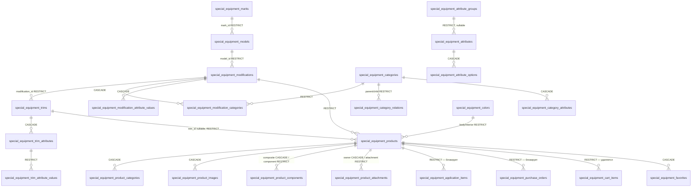
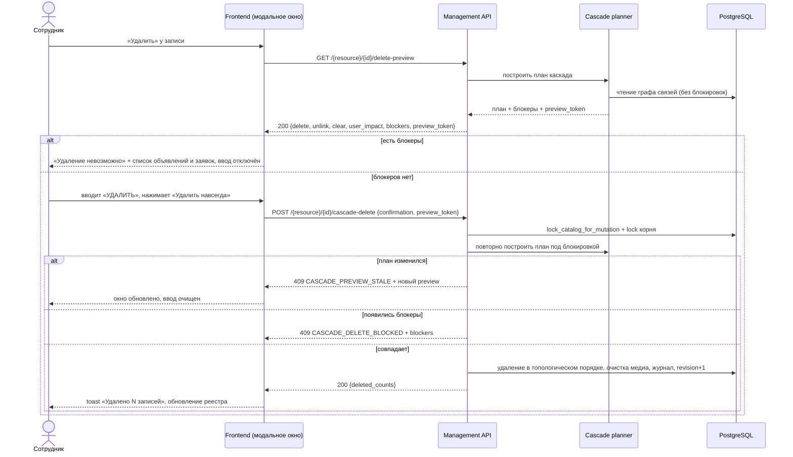

# task_2026-09-23_21-48-58_MSK.md

## Метаданные
- **Ветка:** `feature/se-catalog-cascade-delete`
- **Целевая ветка:** `test`
- **Дата и время создания:** 2026-09-23 21:48:58 MSK (UTC+3)
- **Статус:** Реализовано
- **Тип задачи:** Feature
- **Раздел:** «Управление каталогом» спецтехники (`/workspace/special-equipment/...`, `CatalogCorrectionRegistryPage.vue`)

### Решения, согласованные до написания спецификации
| Вопрос | Решение |
|---|---|
| Что удаляется вместе с категорией | Только «осиротевшие» сущности: дочерние категории, модификации и объявления, у которых после удаления не остаётся других категорий или родителей. У остальных снимается только связь |
| Что блокирует удаление | Любая позиция заявки или заказ по объявлению из каскада в любом статусе, включая завершённые |
| Если в каскаде есть заблокированные объявления | Ничего не удаляется. Окно показывает блокирующие объявления и заявки |
| Способ удаления | Физическое удаление из БД, без восстановления |
| Удаление комплектации | Объявления остаются, поле «Комплектация» очищается |
| Удаление цвета | Объявления остаются, цвет кузова или салона очищается |
| Удаление группы характеристик | Характеристики остаются без группы |
| Объявление-компонент составного | Составное объявление удаляется тоже. Если оно в заявке, удаление блокируется |
| Подтверждение | Модальное окно со списком последствий и вводом слова `УДАЛИТЬ` |
| История перемещений объявления между складами | Удаляется вместе с объявлением |
| Марка, привязанная к дистрибьютору | Удаление запрещено, пока марка привязана хотя бы к одному дистрибьютору |
| Сущность, на которую ссылается программа поддержки | Удаление запрещено, пока на удаляемую марку, модель или комплектацию ссылается хотя бы одна программа поддержки (в любом статусе) |
| Опубликованные объявления, у которых очищается цвет или комплектация | Остаются опубликованными, статус не меняется |

---

## 1. ER-диаграмма затронутых сущностей БД

Внешние таблицы, которые ссылаются на каталог (задача их учитывает):

| Таблица | Ссылка | Роль при удалении |
|---|---|---|
| `special_equipment_application_items` (+ `special_equipment_price_change_log`) | `product_id` | **блокирует** |
| `application_vehicles`, `application_vehicle_allocations` | `product_id` | **блокирует** |
| `special_equipment_purchase_orders` (+ `order_items`, `payments`, `leasing_payment_schedule`) | `product_id` | **блокирует** |
| `purchase_orders` (legacy, `payments.py`) | `product_id` | **блокирует** |
| `special_equipment_order_items` | `product_id` | **блокирует** |
| `exchange_requests` | `product_id` | **блокирует** (заявка на обмен) |
| `special_equipment_cart_items`, `exchange_cart_items` (+ дочерние) | `product_id` | удаляется |
| `special_equipment_favorites`, `user_favorites` | `product_id` | удаляется |
| `vehicle_warehouse_transfers` | `product_id` | удаляется вместе с объявлением |
| `distributor_brands` | `mark_id` | **блокирует** удаление марки |
| `support_program_marks` | `mark_id` | **блокирует** удаление марки |
| `support_programs.mark_id`, `support_programs.model_id` | FK на марку / модель | **блокирует** |
| `support_programs.model_ids`, `support_programs.complectation_ids` | массивы id без FK | **блокирует**, если содержит id удаляемой модели или комплектации |
| `warehouses`, `warehouse_access_rules` | `mark_id` | `SET NULL` (уже задано в БД) |
| `special_equipment_external_refs` | `entity_type` + `entity_id` | удаляется |

Схема БД меняется только добавлением таблицы журнала удалений (п. 5.1). Существующие `ondelete` не меняются: каскад выполняется кодом приложения в явном порядке, как в `cascade_purge_warehouse_products`.

---

## 2. Диаграмма последовательности

---

## 3. Постановка задачи

Сейчас удаление в «Управлении каталогом» разрешено, только если у записи нет зависимостей (`ensure_delete_allowed`, `GET /{resource}/{id}/dependencies`). Например, чтобы удалить категорию, сначала нужно вручную удалить или отвязать все её модификации, связи с дочерними категориями, характеристики и объявления. Это долго, и при исправлении ошибок каталога после импорта легко ошибиться.

**Цель:** дать сотруднику удалить любую сущность каталога вместе со всем, что от неё зависит, если ни одно затрагиваемое объявление не участвует в заявке или заказе. Перед удалением сотрудник видит полный список последствий и подтверждает его вводом слова `УДАЛИТЬ`.

---

## 4. Требования

### 4.1. Область действия

Каскадное удаление доступно для всех разделов «Управления каталогом»:

- марки;
- модели;
- модификации;
- комплектации;
- категории;
- группы характеристик;
- характеристики;
- варианты характеристик;
- цвета;
- объявления.

Отдельные действия «снять характеристику с комплектации», «удалить изображение», «удалить совместимость», «удалить компонент состава» не меняются.

Права: `special-equipment-catalog:write`, как у текущего удаления.

### 4.2. Правила каскада

Обозначения: **удаляется** — строка удаляется физически; **отвязывается** — удаляется только связь; **очищается** — поле ставится в `NULL`.

| Удаляемая сущность | Что происходит |
|---|---|
| **Марка** | Если марка привязана к дистрибьютору или на неё ссылается программа поддержки, удаление блокируется (п. 4.4). Иначе удаляются все модели марки и далее по правилам модели. `warehouses.mark_id` и `warehouse_access_rules.mark_id` очищаются |
| **Модель** | Если на модель ссылается программа поддержки, удаление блокируется (п. 4.4). Иначе удаляются все модификации модели и далее по правилам модификации |
| **Модификация** | Удаляются все её комплектации (с назначениями и значениями характеристик), значения характеристик модификации, связи с категориями и **все объявления модификации** (далее по правилам объявления) |
| **Комплектация** | Удаляются назначения и значения характеристик комплектации. У объявлений `trim_id` очищается, объявления остаются, статус публикации не меняется |
| **Категория** | Удаляются связи категории с родителями и детьми, характеристики категории (`category_attributes`), связи с модификациями и объявлениями. Затем по правилу «осиротевших» (п. 4.3) удаляются дочерние категории, модификации и объявления, у которых не осталось других категорий или родителей |
| **Группа характеристик** | `attributes.attribute_group_id`, `category_attributes.group_id` и `trim_attributes.group_id` очищаются. Характеристики и значения остаются |
| **Характеристика** | Удаляются все её варианты, назначения в категориях (`category_attributes`) и комплектациях (`trim_attributes`), все значения у модификаций и комплектаций |
| **Вариант характеристики** | Удаляются все значения модификаций и комплектаций, где выбран этот вариант. Назначения характеристики остаются, характеристика становится незаполненной |
| **Цвет** | У объявлений очищаются `body_color_id` и `interior_color_id` со ссылкой на этот цвет. Статус публикации не меняется |
| **Объявление** | Удаляются изображения (файлы — через очередь очистки медиа), связи с категориями, связи совместимости с надстройками в обе стороны, собственный состав (для составного — только связи; компоненты остаются), корзины, избранное, история перемещений между складами (`vehicle_warehouse_transfers`), `external_refs`. **Составные объявления, в которые оно входит как компонент, удаляются тоже** (рекурсивно по тем же правилам) |

### 4.3. Правило «осиротевших» (при удалении категории)

Каскад по категориям считается до неподвижной точки:

1. Множество удаляемых категорий D содержит корень удаления.
2. Категория C ∉ D добавляется в D, если у неё **были** родители и **все** они входят в D. Корневые категории без родителей в D не добавляются.
3. Модификация удаляется, если **все** её категории входят в D.
4. Объявление удаляется, если:
   - удаляется его модификация, **или**
   - **все** его категории (`product_categories`) входят в D, **или**
   - удаляется составное объявление, в которое оно входит как компонент (п. 4.2).
5. У оставшихся модификаций и объявлений снимаются только связи с категориями из D.
6. **Согласованность характеристик.** После снятия связей у каждой оставшейся модификации пересчитывается эффективный набор характеристик её оставшихся категорий. Для характеристик вне этого набора удаляются:
   - значения модификации;
   - назначения и значения её комплектаций.

   Это выполняется в той же транзакции и показывается в окне как «Будут удалены значения характеристик: N».

### 4.4. Блокировки

Удаление целиком отклоняется (`409 CASCADE_DELETE_BLOCKED`), если **хотя бы одно** объявление из множества удаляемых объявлений есть в одной из таблиц — в любом статусе, включая завершённые, отменённые и отклонённые:

- `special_equipment_application_items`;
- `application_vehicles`, `application_vehicle_allocations`;
- `special_equipment_purchase_orders`, `special_equipment_order_items`;
- `purchase_orders` (legacy);
- `exchange_requests`.

Объявления, которые остаются и у которых только очищаются поля (удаление комплектации или цвета), удаление **не блокируют**. Их заявки не затрагиваются.

В ответе с блокировкой перечислены все блокирующие объявления: код, VIN, название; тип и номер документа, его статус.

**Блокировка марки дистрибьюторами.** Удаление марки отклоняется (`409 CASCADE_DELETE_BLOCKED`), если марка есть в `distributor_brands`. Иначе удаление молча изменило бы доступ дистрибьюторов к бренду. В ответе перечислены дистрибьюторы: название компании, ИНН, ссылка на карточку компании. Чтобы удалить марку, её сначала отвязывают в настройках дистрибьютора. Проверка нужна, только когда удаляется сама марка; другие корни марку не удаляют.

**Блокировка программами поддержки.** Удаление отклоняется (`409 CASCADE_DELETE_BLOCKED`), если на **любую** марку, модель или комплектацию из множества удаляемых ссылается программа поддержки — в любом статусе, включая неактивные и завершённые:

| Удаляемая сущность | Где ищется ссылка |
|---|---|
| Марка | `support_program_marks.mark_id`, `support_programs.mark_id` |
| Модель | `support_programs.model_id`, `support_programs.model_ids` (содержит id модели как текст) |
| Комплектация | `support_programs.complectation_ids` (содержит id комплектации как текст) |

Проверяется всё множество удаляемых сущностей, а не только корень. Например, удаление категории, из-за которого удаляется «осиротевшая» модификация, будет заблокировано, если на её комплектацию ссылается программа поддержки. Если комплектация только отвязывается от объявлений, а сама не удаляется, блокировки нет.

Ссылки программ поддержки на VIN (`vin`, `vins`) удаление объявления **не блокируют**: они указывают на конкретную машину, а не на запись каталога, и продолжают работать, если объявление с тем же VIN загрузят снова.

В ответе перечислены программы: название, статус (`is_active`), период действия, ссылка на карточку программы, и какая удаляемая сущность на неё ссылается. Чтобы удалить сущность, её сначала убирают из условий программы или удаляют саму программу в разделе программ поддержки.

**Реализация.** `model_ids` и `complectation_ids` — массивы текста без внешних ключей, поэтому их нужно проверять явным запросом (`:id = ANY(model_ids)`). Перед реализацией убедиться, что в `complectation_ids` хранятся id комплектаций каталога спецтехники (`special_equipment_trims.id`), а не id из другого справочника. Если там другой справочник, проверка по `complectation_ids` исключается из задачи.

Все виды блокировок (объявления, дистрибьюторы, программы поддержки) проверяются вместе, и в окне показываются все сразу.

### 4.5. Модальное окно подтверждения

1. Кнопка «Удалить» есть в карточке записи (drawer) и в строке реестра во всех разделах п. 4.1. Текущая отдельная кнопка удаления цвета заменяется общей.
2. При нажатии открывается модальное окно (общий `Modal.vue`) и запрашивается предпросмотр. Пока ответа нет, показывается индикатор загрузки.
3. **Заголовок:** «Удалить {тип} «{название}»?»
4. **Содержимое:**
   - **«Будет удалено навсегда»** — группы по типам сущностей с количеством. Каждую группу можно раскрыть: первые 50 записей (код, название), затем «и ещё N».
   - **«Будут изменены»** — отвязка и очистка: «У 12 объявлений будет очищена комплектация», «3 модификации будут отвязаны от категории», «Будут удалены значения характеристик: 40» и т. п.
   - **«Затронет пользователей»** — сколько позиций в корзинах и избранном будет удалено.
   - Предупреждение: «Действие необратимо. Восстановить данные можно только повторным импортом».
5. **Блокировки.** Если есть блокеры:
   - вместо поля ввода показывается красный блок «Удаление невозможно»;
   - под ним списки по видам блокировок:
     - «Объявления участвуют в заявках или заказах» — объявления со ссылками на карточку объявления и на заявку или заказ;
     - «Марка привязана к дистрибьюторам» — компании со ссылками на их карточки и подсказка «Сначала отвяжите марку в настройках дистрибьютора»;
     - «Используется в программах поддержки» — программы со ссылками на их карточки, для каждой — какая удаляемая марка, модель или комплектация в ней указана, и подсказка «Сначала уберите её из условий программы»;
   - кнопка удаления неактивна.
6. **Подтверждение:**
   - поле «Для подтверждения введите УДАЛИТЬ»;
   - кнопка «Удалить навсегда» (danger) активна, только если значение без начальных и конечных пробелов равно `УДАЛИТЬ` (кириллица, верхний регистр);
   - вставка из буфера разрешена;
   - сервер повторяет эту проверку.
7. **Устаревший предпросмотр:** при `409 CASCADE_PREVIEW_STALE` окно перерисовывается по новому предпросмотру из ответа, поле ввода очищается, показывается сообщение «Данные изменились, проверьте список ещё раз».
8. **После успеха:**
   - окно и drawer закрываются;
   - toast «Удалено записей: N»;
   - перезагружаются реестр, справочники и счётчики разделов (`loadRows`, `loadDirectories`, `loadSectionCounts`).
9. **Доступность:** фокус при открытии на поле ввода (или на «Закрыть» при блокировке), фокус не выходит за пределы окна, `Esc` и «Отмена» закрывают окно без действий. Во время запроса кнопки отключены, повторная отправка невозможна.

### 4.6. Согласованность, конкуренция, атомарность

1. Удаление выполняется в **одной транзакции** под `lock_catalog_for_mutation`. Любая ошибка откатывает всё.
2. Под блокировкой план строится заново. Удаляемые объявления блокируются `FOR UPDATE`, чтобы между проверкой и удалением не появилась заявка.
3. `preview_token` — хеш от набора `(тип, id)` удаляемых, изменяемых и очищаемых записей и текущего `catalog_revision`. Если токен не совпал, возвращается `409 CASCADE_PREVIEW_STALE` с новым предпросмотром в теле.
4. Корень удаления проверяется по `If-Match` (ETag или `lock_version`), как в текущем `delete_entity`.
5. После удаления `catalog_revision` увеличивается на 1. Импорты, провалидированные на старой ревизии, требуют повторной проверки. Это уже реализовано проверкой `catalog_revision` в задаче импорта.
6. Удаляются `mutation_receipts` всех удалённых ресурсов (`delete_mutation_receipts_for_resource`).
7. Ключи изображений объявлений и категорий ставятся в очередь `enqueue_media_cleanup`. Сами файлы удаляются после коммита.
8. **Лимит:** если план затрагивает больше 5 000 записей, предпросмотр возвращает `CASCADE_TOO_LARGE`, удаление недоступно. Порог — настройка `special_equipment_cascade_delete_max_rows`.

### 4.7. Журнал удалений

Каждое успешное каскадное удаление записывается в новую таблицу `special_equipment_catalog_deletion_log`:

- кто удалил (`user_id`);
- когда (`created_at`);
- корень (`root_type`, `root_id`, `root_code`, `root_name`);
- `catalog_revision` после удаления;
- количества по типам (`counts` jsonb);
- полный список удалённых и изменённых записей (`items` jsonb: тип, id, код, название, действие).

Журнал только дописывается. UI для просмотра журнала в эту задачу не входит.

### 4.8. Совместимость

- `DELETE /{resource}/{id}` и `GET /{resource}/{id}/dependencies` остаются и работают как раньше: удаление без зависимостей. Новый фронтенд их не использует.
- Каскадное удаление — отдельные эндпоинты (п. 5.2).
- Поведение импорта не меняется.

---

## 5. Планируемые изменения

### 5.1. Backend: домен и репозиторий

1. **`backend/domain/special_equipment_cascade_delete.py`** (новый):
   - типы `CascadePlan` (`delete`, `unlink`, `clear`, `user_impact`, `blockers`, `counts`) и `CascadeBlocker`;
   - чистая функция `build_cascade_plan(root, graph) -> CascadePlan`: правила п. 4.2–4.4 поверх снимка графа, без обращений к БД;
   - `preview_token(plan, catalog_revision) -> str`;
   - константа `CONFIRMATION_WORD = "УДАЛИТЬ"` и функция `ensure_confirmation(value)`;
   - коды ошибок: `CASCADE_DELETE_BLOCKED`, `CASCADE_PREVIEW_STALE`, `CASCADE_CONFIRMATION_INVALID`, `CASCADE_TOO_LARGE`.
2. **`backend/infrastructure/repositories/special_equipment_cascade_delete_repository.py`** (новый):
   - `load_cascade_graph(session, root)` — выборка только нужной окрестности корня. Для категорий — рекурсивный CTE по `category_relations`; далее модификации, объявления, составные, значения характеристик;
   - `load_product_blockers(session, product_ids, lock: bool)` — проверка по таблицам п. 4.4, при `lock=True` с `FOR UPDATE` на объявления;
   - `load_mark_distributor_blockers(session, mark_id, lock: bool)` — привязки марки в `distributor_brands`, при `lock=True` с `FOR SHARE` на строки привязок, чтобы параллельное удаление не разошлось с изменением настроек дистрибьютора;
   - `load_support_program_blockers(session, mark_ids, model_ids, trim_ids, lock: bool)` — ссылки по таблице п. 4.4, при `lock=True` с `FOR SHARE` на найденные программы;
   - `apply_cascade_plan(session, plan)` — удаление в топологическом порядке. Шаги для объявлений переиспользуются из `cascade_purge_warehouse_products`: выделить общий `_purge_products(session, product_ids)`. Оттуда исключаются удаления заявок и заказов — при каскадном удалении их не должно быть по п. 4.4;
   - порядок удаления:
     1. корзины и избранное;
     2. связи объявлений (категории, совместимость, состав) и изображения;
     3. `vehicle_warehouse_transfers`;
     4. объявления (составные раньше компонентов);
     5. значения характеристик комплектаций;
     6. назначения характеристик комплектаций;
     7. комплектации;
     8. значения характеристик модификаций;
     9. связи модификаций с категориями;
     10. модификации;
     11. модели;
     12. связи марок;
     13. марки;
     14. характеристики категорий;
     15. связи категорий;
     16. категории;
     17. варианты характеристик;
     18. характеристики;
     19. группы и цвета;
     20. `external_refs`.

     Очистка полей (`SET NULL`) выполняется до удаления соответствующих сущностей.
3. **Alembic:** ревизия `NNN_se_catalog_deletion_log` — таблица журнала (п. 4.7). Индексы: `(created_at)`, `(root_type, root_id)`.

### 5.2. Backend: приложение и API

1. **`backend/application/commands/special_equipment_management.py`:**
   - `preview_cascade_delete(session, entity_type, entity_id)` — без блокировок;
   - `cascade_delete_entity(session, entity_type, entity_id, confirmation, preview_token, expected_version / etag, user_id)` — по п. 4.6.
2. **`backend/presentation/routers/special_equipment_management.py`:**
   - `ResourcePath` расширяется значением `colors` (для новых эндпоинтов);
   - `GET /{resource}/{entity_id}/delete-preview` (scope `read`) → `200 CascadePreviewResource`;
   - `POST /{resource}/{entity_id}/cascade-delete` (scope `write`, заголовок `If-Match`), тело `{ "confirmation": "УДАЛИТЬ", "preview_token": "…" }` →
     - `200 { deleted: {...counts}, catalog_revision }`;
     - `400 CASCADE_CONFIRMATION_INVALID`;
     - `409 CASCADE_DELETE_BLOCKED` (с `blockers`);
     - `409 CASCADE_PREVIEW_STALE` (с новым `preview`);
     - `412` / `428` — как в текущих мутациях;
     - `422 CASCADE_TOO_LARGE`.
   - Ошибки в формате `application/problem+json` с обязательным `code`, как в `specs/311.md` п. 5.5.
3. **Схема `CascadePreviewResource`:**
   - `root {type, id, code, name}`;
   - `delete [{type, count, items: [{id, code, name}], truncated}]`;
   - `unlink [{type, count, description}]`;
   - `clear [{type, field, count, description}]`;
   - `user_impact {cart_items, favorites}`;
   - `blockers`:
     - `products [{product {id, code, vin, name}, documents: [{type, id, number, status}]}]`;
     - `distributors [{company {id, name, inn}}]` — только для корня «марка»;
     - `support_programs [{program {id, name, is_active, starts_at, ends_at}, references: [{type, id, code, name}]}]`;
   - `total`, `preview_token`, `catalog_revision`.

### 5.3. Frontend

1. **`frontend/features/specialEquipment/management/correction/CatalogCascadeDeleteModal.vue`** (новый) на базе `components/ui/Modal.vue`, по п. 4.5.
2. **`api.ts`:** `getDeletePreview(resource, id)` и `cascadeDelete(resource, id, {confirmation, preview_token}, etag)`, типы в `types.ts`.
3. **`CatalogCorrectionRegistryPage.vue`:**
   - `removeCurrent` и `deleteColorFromRow` заменяются открытием модального окна;
   - кнопка «Удалить» добавляется в строку реестра для всех разделов;
   - после успеха — обновление по п. 4.5.8.
4. **`CatalogCorrectionDrawer.vue`:** кнопка удаления открывает то же окно.
5. Тексты типов сущностей во множественном числе — общий хелпер pluralization (1 модификация / 2 модификации / 5 модификаций).

### 5.4. Тесты

1. **Unit, `build_cascade_plan`** — по каждой строке таблицы п. 4.2:
   - категория: сирота или нет для дочерних категорий, модификаций и объявлений; ромбовидный граф категорий (два родителя, удаляется один); цепочка из трёх уровней;
   - пересчёт характеристик оставшейся модификации (п. 4.3.6);
   - составное объявление с удаляемым компонентом → удаляется; составное с удаляемым составным → компоненты остаются;
   - комплектация и цвет → только `clear`, объявления не в `delete`, статус публикации не меняется;
   - группа → только `clear`.
2. **Unit, блокировки:** позиция заявки в статусах `active`, `reserved`, `replaced`, `removed`, `rejected`, заказ в любом статусе, legacy-заказ, `exchange_request` → `blockers` не пуст, `delete` не выполняется.
3. **Интеграционные, `backend/tests/test_special_equipment_cascade_delete.py`:**
   - удаление марки с полной иерархией, изображениями, корзинами, избранным и историей перемещений → все строки удалены, включая `vehicle_warehouse_transfers`, медиа в очереди очистки, журнал записан, `catalog_revision + 1`;
   - удаление марки, привязанной к дистрибьютору → `409 CASCADE_DELETE_BLOCKED` с `blockers.distributors`, БД не изменена; после отвязки — удаление проходит;
   - программа поддержки ссылается на марку (`support_program_marks` и `mark_id`), модель (`model_id` и `model_ids`), комплектацию (`complectation_ids`) → `409` с `blockers.support_programs`; то же, когда сущность попадает под удаление каскадом от категории или модификации; неактивная программа тоже блокирует;
   - программа ссылается только на VIN удаляемого объявления → удаление проходит, программа не меняется;
   - удаление цвета и комплектации у опубликованных объявлений → объявления остаются опубликованными, поля очищены, витрина и карточка объявления открываются без ошибок;
   - удаление категории в ромбовидном графе → удалены только сироты;
   - блокировка → `409`, БД не изменена;
   - неверное слово подтверждения → `400`;
   - изменение данных между предпросмотром и удалением → `409 CASCADE_PREVIEW_STALE`;
   - гонка: параллельное создание позиции заявки на удаляемое объявление → один из запросов получает блокировку, двойного состояния нет;
   - после каскада нет нарушений внешних ключей и межуровневого инварианта характеристик (`specs/311.md` п. 5.4).
4. **Frontend, unit:**
   - кнопка активна только при вводе `УДАЛИТЬ` (регистр, пробелы, латинские буквы-двойники);
   - режим блокировки;
   - обработка `CASCADE_PREVIEW_STALE`;
   - pluralization.
5. **Без регрессий:**
   - существующие тесты `DELETE /{resource}/{id}` и `/dependencies`;
   - `test_special_equipment_import_warehouse_cascade.py` (после выделения `_purge_products`).

---

## 6. Критерии готовности (Acceptance Criteria)

1. В каждом разделе «Управления каталогом» любую запись можно удалить через модальное окно. Удаление выполняется только после ввода `УДАЛИТЬ`.
2. Окно до удаления показывает полный список последствий: что удалится (по типам, с количеством и раскрываемым списком), что будет отвязано или очищено, сколько позиций корзин и избранного будет удалено.
3. Каскад работает по таблице п. 4.2 и правилу «осиротевших» п. 4.3:
   - удаление категории не удаляет модификации, объявления и дочерние категории, у которых остались другие категории или родители;
   - удаление комплектации и цвета не удаляет объявления и не меняет их статус публикации.
4. Если хотя бы одно удаляемое объявление есть в заявке, заказе или заявке на обмен в любом статусе, ничего не удаляется. Окно показывает блокирующие объявления и документы.
5. Марку, привязанную хотя бы к одному дистрибьютору, удалить нельзя. Окно показывает список дистрибьюторов.
6. Ничего не удаляется, если на удаляемую марку, модель или комплектацию (включая попавшие под каскад) ссылается программа поддержки в любом статусе. Окно показывает программы и что именно в них указано.
7. История перемещений удаляемых объявлений удаляется вместе с ними.
8. Удаление атомарно. После него в БД нет висячих ссылок, нарушений внешних ключей и межуровневого инварианта характеристик.
9. Изменение данных между предпросмотром и подтверждением не приводит к удалению того, чего пользователь не видел (`CASCADE_PREVIEW_STALE`).
10. Каждое удаление записано в `special_equipment_catalog_deletion_log`, файлы изображений поставлены в очередь очистки, `catalog_revision` увеличен.
11. Проверки `uv run ruff check . --fix`, `uv run lint-imports`, `uv run mypy .`, `uv run pytest` (затронутые наборы), `uv run alembic check` и фронтенд-линтеры и тесты проходят без ошибок.

---

## 7. Открытые вопросы

1. **Порог размера каскада** (п. 4.6.8) — 5 000 записей. Уточнить по фактическому объёму каталога.
2. **Отображение опубликованных объявлений без цвета или комплектации.** Статус публикации не меняется, но нужно проверить при реализации, что витрина, фильтры и карточка объявления корректно показывают пустой цвет и пустую комплектацию. Если где-то они считаются обязательными, это исправляется в рамках задачи.
