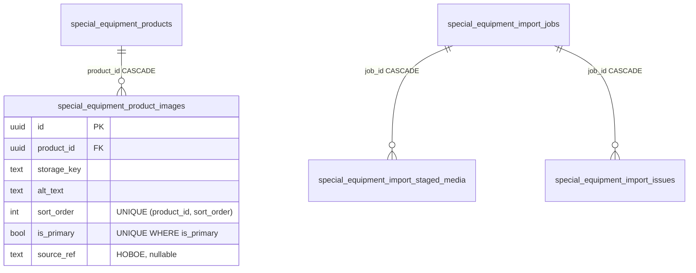

# task_2026-09-23_22-02-51_MSK.md

## Метаданные
- **Ветка:** `feature/se-import-multiple-product-images`
- **Целевая ветка:** `test`
- **Дата и время создания:** 2026-09-23 22:02:51 MSK (UTC+3)
- **Статус:** Согласовано
- **Тип задачи:** Bugfix / Feature
- **Модуль:** импорт каталога спецтехники v2 (шаблоны v3–v6), лист «Объявления», колонка «Ссылка на изображение»

### Согласованные решения
| Вопрос | Решение |
|---|---|
| Формат нескольких фото | В той же колонке «Ссылка на изображение», через запятую, точку с запятой или перенос строки. Шаблон не меняется |
| Основное фото | Первая ссылка в ячейке, остальные — галерея в порядке ячейки |
| Повторный импорт | Фото объявления заменяются списком из файла, включая добавленные вручную. Пустая ячейка — без изменений, «Очистить» — удалить все |
| Фото не скачалось | Фото пропускается, в отчёте предупреждение. Если не скачалось ни одно — ошибка объявления, как сейчас |
| Лимит | 50 фото на объявление (как в админке); лишние ссылки пропускаются с предупреждением |
| Повторы и общие фото | Повторы в ячейке убираются; одна ссылка скачивается один раз за импорт |
| Скорость | Параллельное скачивание с ограничением |
| Неизменённые ссылки | Уже загруженные фото с той же ссылкой не скачиваются заново |
| Картинка категории | Остаётся одна. Несколько ссылок — ошибка строки |
| Источники | Только разрешённые хосты, как сейчас (`drive.google.com`, `drive.usercontent.google.com`) |

---

## 1. ER-диаграмма затронутых сущностей БД



**Изменение схемы:** в `special_equipment_product_images` добавляется nullable-колонка `source_ref text` — нормализованный идентификатор источника фото:

- для Google Drive — `gdrive:<file_id>`;
- для остальных разрешённых ссылок — канонический URL;
- для фото, загруженных вручную в админке, — `NULL`.

Колонка нужна, чтобы при повторном импорте не скачивать уже загруженные фото (п. 4.5). Индекс `(product_id, source_ref)`.

---

## 2. Диаграмма последовательности

```mermaid
sequenceDiagram
    participant X as XLSX adapter
    participant P as build plan
    participant T as _transfer_plan_images (валидация)
    participant G as Google Drive
    participant S as Object storage
    participant A as Apply

    X->>P: row.image_source_url = "url1, url2; url3\nurl4"
    P->>P: parse_image_source_urls() → [ref1, ref2, ref3, ref4] (порядок, дедуп, лимит 50)
    P->>P: values._images_action = replace, _image_sources = [...]
    T->>T: собрать уникальные source_ref по всему импорту
    T->>T: source_ref уже есть у этого объявления → reuse storage_key
    par не более N одновременно
        T->>G: скачать ref (один раз на импорт)
        G-->>T: картинка / ошибка
        T->>S: staged storage_key
    end
    T->>T: ошибка отдельного фото → warning; все фото объявления с ошибкой → error
    T-->>P: values._image_storage_keys = [key1, key2, key4] (ref3 пропущен)
    A->>A: _v2_apply_product_images(): заменить галерею списком, key1 = primary
    A->>S: ключи удалённых фото → очередь очистки медиа
```

---

## 3. Постановка задачи

### 3.1. Текущее поведение

- Начиная с шаблона v3 колонка «Ссылка на изображение» задаёт **одно основное фото** объявления (лист «Инструкция» шаблона, `special_equipment_xlsx.py`).
- `_attach_image_action` (`special_equipment_import_v2.py`) сохраняет всё содержимое ячейки как одну ссылку `_image_source_url`.
- `transfer_temporary_image` передаёт её в `google_drive_download_url`, а та через `urlsplit` и регулярное выражение `/d/([a-zA-Z0-9_-]+)/` берёт **первый** найденный идентификатор файла. Остальные ссылки из ячейки молча отбрасываются, ошибки нет.
- `_v2_apply_product_primary_image` заменяет только основное фото. Остальные фото объявления сдвигаются и остаются. Файл удалённого основного фото не ставится в очередь очистки хранилища.
- Фото скачиваются последовательно по одному. Одна и та же ссылка в разных объявлениях скачивается заново.
- Ошибка скачивания фото считается блокирующей (`blockingFailures`). В режимах добавления и изменения объявление отбрасывается целиком. В режиме «Полная замена» отменяется весь импорт.

### 3.2. Цель

Загружать из одной ячейки все фото объявления: первое — основное, остальные — галерея в заданном порядке. Повторный импорт приводит галерею к списку из файла. Отдельные недоступные фото не срывают загрузку объявления.

---

## 4. Требования

### 4.1. Разбор ячейки (лист «Объявления»)

1. **Разделители:** запятая, точка с запятой, перенос строки (`\n`, `\r\n`), в любых сочетаниях. Пробелы вокруг ссылок отбрасываются, пустые элементы игнорируются.
2. Каждая ссылка отдельно проверяется `validate_https_source_url`: HTTPS, разрешённый хост, без логина и пароля, порт 443. Невалидная ссылка даёт предупреждение `PRODUCT_IMAGE_URL_INVALID` и пропускается.
3. **Нормализация и дедупликация:**
   - ссылки Google Drive приводятся к `source_ref = gdrive:<file_id>`, поэтому `.../file/d/ID/view?usp=sharing` и `.../file/d/ID/view?usp=drive_link` — одно и то же фото;
   - повтор в ячейке пропускается без предупреждения, в списке остаётся первое вхождение.
4. **Лимит:** после дедупликации берутся первые 50 ссылок. Если их больше, выдаётся предупреждение `PRODUCT_IMAGES_LIMIT_EXCEEDED` с числом отброшенных.
5. **Порядок:** порядок ссылок в ячейке — это порядок галереи (`sort_order` 0, 1, 2…). Первая успешно загруженная ссылка — основное фото (`is_primary = true`).
6. **Специальные значения ячейки:**
   - пустая ячейка в режиме «Добавление и изменение» — галерея не меняется;
   - пустая ячейка в режиме «Полная замена» или для нового объявления — у объявления нет фото;
   - «Очистить» (маркер из листа «Параметры») — удалить все фото объявления;
   - «Очистить» вместе со ссылками в одной ячейке — ошибка `PRODUCT_IMAGE_CLEAR_MIXED`.
7. Разбор — чистая функция `parse_image_source_urls(raw, *, allowed_hosts, limit) -> ParsedImageSources(refs, issues)` в `backend/domain/special_equipment_import.py`. Она используется для объявлений и категорий.

### 4.2. Картинка категории (лист «Категории», колонка «Картинка»)

Остаётся одна картинка. Если после разбора в ячейке больше одной уникальной ссылки, строка категории получает **ошибку** `CATEGORY_IMAGE_MULTIPLE` («Для категории допускается одна ссылка на изображение»). Раньше лишние ссылки молча отбрасывались. Поведение для одной ссылки не меняется.

### 4.3. Скачивание

1. Все уникальные `source_ref` импорта (по всем объявлениям) собираются в один набор. Каждый скачивается **не больше одного раза**, результат (`storage_key` или ошибка) переиспользуется всеми объявлениями с этим фото.
2. Скачивание параллельное, не больше `special_equipment_import_image_concurrency` одновременных загрузок. Настройка, по умолчанию 4.
3. **Общий бюджет времени** на скачивание фото одного импорта — `special_equipment_import_image_budget_seconds`, по умолчанию 600. Незавершённые загрузки после бюджета считаются ошибкой `IMAGE_FETCH_BUDGET_EXCEEDED` для соответствующих фото.
4. Все существующие проверки `transfer_temporary_image` остаются: хост и SSRF, редиректы, тип содержимого, размер, пиксели, декодирование.
5. Каждый загруженный ключ записывается в `special_equipment_import_staged_media`, как сейчас. Одно общее фото у нескольких объявлений — это **один** staged-ключ. При применении у каждого объявления создаётся своя строка `product_images` на этот ключ.

### 4.4. Ошибки отдельных фото

1. Ошибка скачивания отдельного фото — **предупреждение** (`severity = warning`) с исходным кодом (`IMAGE_CONTENT_TYPE_INVALID`, `IMAGE_HTTP_STATUS_403` и т. п.):
   - в тексте указана позиция в ячейке и сама ссылка (`raw_value_preview`, до 300 символов);
   - фото исключается из галереи, основным становится первое успешно загруженное.
2. Если **ни одно** фото объявления не загрузилось (при непустом списке), это **ошибка** объявления `PRODUCT_IMAGES_ALL_FAILED`. Дальше действует текущая логика: в режиме «Добавление и изменение» объявление отбрасывается, в «Полной замене» импорт отклоняется.
3. Предупреждения по фото не блокируют «Полную замену».
4. Сводка `imageSummary` в предпросмотре:
   - `requested` — уникальные ссылки;
   - `transferred`;
   - `reused` — неизменённые, из п. 4.5;
   - `optionalFailures` — пропущенные фото;
   - `blockingFailures` — объявления без единого фото.

### 4.5. Повторный импорт и неизменённые ссылки

1. **Итоговая галерея = список из файла** (после пропуска ошибочных фото), в порядке ячейки. Фото, которых нет в списке, удаляются, включая добавленные вручную в админке.
2. Если у объявления уже есть фото с тем же `source_ref`, оно **не скачивается заново**: сохраняется существующая строка (`id`, `storage_key`), меняются только `sort_order` и `is_primary`.
3. Если галерея объявления совпадает со списком из файла (те же `source_ref` в том же порядке), изменений нет, и в сводку объявление не попадает как изменённое.
4. Ключи хранилища удалённых фото ставятся в очередь `enqueue_media_cleanup`. Исключение — ключ, который ещё используется другой строкой `product_images`. Это же исправляет текущую утечку файлов при замене основного фото.
5. Существующие фото без `source_ref` (загруженные раньше или вручную) при повторном импорте со ссылками удаляются по п. 4.5.1 и загружаются заново из файла.

### 4.6. Применение

1. `_v2_apply_product_primary_image` заменяется функцией `_v2_apply_product_images(session, product_id, values)`:
   - `_images_action = "keep"` — ничего не делает;
   - `"clear"` — удаляет все фото;
   - `"replace"` — приводит галерею к списку `_images` = `[{storage_key, source_ref, reuse_image_id | None}]`.
2. **Порядок операций** учитывает уникальные индексы `(product_id, sort_order)` и `is_primary`:
   - сначала удаляются лишние строки;
   - оставшимся ставится временный `sort_order` со смещением и `is_primary = false` — такой приём уже есть в текущей функции;
   - затем вставляются новые строки и проставляются итоговые `sort_order` и `is_primary` одной строке.
3. Идентификатор новой строки детерминирован: `uuid5(product_id, source_ref)`. Повторное применение того же плана идемпотентно.
4. **Совместимость со старыми планами.** Планы, сохранённые до выкладки, содержат `_primary_image_action`. Такой план применяется **старой логикой** (замена только основного фото) до истечения срока хранения планов. Новая логика используется для планов, где есть `_images_action`.
5. Уже подготовленные к применению импорты не пересобираются.

### 4.7. Шаблон и инструкция

1. Заголовки листов и версия шаблона **не меняются** (v6). Файлы v3–v6 с одной ссылкой работают как раньше. Файлы с несколькими ссылками теперь загружают все фото.
2. В листе «Инструкция», раздел «Изображения», текст меняется на:

   > «Колонка «Ссылка на изображение» листа «Объявления» задаёт все фото объявления: ссылки через запятую, точку с запятой или с новой строки, до 50 штук. Первая ссылка — основное фото. При импорте фото объявления заменяются списком из файла. Пустая ячейка в режиме изменения не меняет фото, «Очистить» удаляет все. Для категории указывается одна ссылка в колонке «Картинка».»

3. Шаблон, который скачивается из платформы, содержит обновлённую инструкцию.

---

## 5. Планируемые изменения

### 5.1. Backend

1. **`backend/domain/special_equipment_import.py`:**
   - `parse_image_source_urls(...)` и `ParsedImageSources`;
   - `image_source_ref(url) -> str` — нормализация (для Google Drive через `google_drive_download_url` / id файла);
   - коды: `PRODUCT_IMAGE_URL_INVALID`, `PRODUCT_IMAGES_LIMIT_EXCEEDED`, `PRODUCT_IMAGE_CLEAR_MIXED`, `PRODUCT_IMAGES_ALL_FAILED`, `CATEGORY_IMAGE_MULTIPLE`, `IMAGE_FETCH_BUDGET_EXCEEDED`.
2. **`backend/application/special_equipment_import_v2.py`:**
   - `_attach_image_action` разделяется:
     - для объявлений — `_images_action` + `_image_sources`, предупреждения разбора пишутся в `issues`;
     - для категорий — одна ссылка, иначе `CATEGORY_IMAGE_MULTIPLE`;
   - контекст: для объявлений из файла загружаются текущие `product_images` (`id`, `storage_key`, `source_ref`, `sort_order`, `is_primary`) — нужно для п. 4.5.
3. **`backend/application/tasks/special_equipment_import.py`, `_transfer_plan_images`:**
   - сбор уникальных `source_ref`, reuse существующих, параллельное скачивание через `asyncio.Semaphore`, общий бюджет времени;
   - формирование `_images` для каждого объявления, предупреждения и ошибки по п. 4.4;
   - `failed_aggregates` пополняется только при `PRODUCT_IMAGES_ALL_FAILED`;
   - категории — как сейчас.
4. **`backend/infrastructure/repositories/special_equipment_import_repository.py`:**
   - `_v2_apply_product_images` вместо `_v2_apply_product_primary_image` для новых планов (п. 4.6.4);
   - очистка медиа удалённых ключей.
5. **`backend/infrastructure/services/special_equipment_xlsx.py`:** текст инструкции (п. 4.7.2).
6. **`backend/infrastructure/settings.py`:** `special_equipment_import_image_concurrency: int = 4`, `special_equipment_import_image_budget_seconds: int = 600`.
7. **Alembic:** ревизия `NNN_se_product_images_source_ref` — колонка `source_ref text NULL` и индекс `(product_id, source_ref)`. Без заполнения существующих строк.
8. **Админка (`add_product_image` / `update_product_image`):** не меняется. Фото из админки получают `source_ref = NULL`. Лимит 50 фото остаётся общим.

### 5.2. Frontend

Изменений в интерфейсе импорта нет. Предупреждения по фото выводятся существующей таблицей ошибок импорта с типом «Предупреждение». В словарь рекомендаций добавляются тексты для новых кодов:

- `PRODUCT_IMAGE_URL_INVALID` — «Проверьте, что ссылка начинается с https:// и ведёт на Google Drive»;
- ошибки доступа (`IMAGE_HTTP_STATUS_*`, `IMAGE_CONTENT_TYPE_INVALID`, `IMAGE_REDIRECT_INVALID`) — «Откройте доступ к файлу на Google Drive: «Все, у кого есть ссылка»»;
- `PRODUCT_IMAGES_LIMIT_EXCEEDED` — «Оставьте не больше 50 ссылок».

### 5.3. Тесты

1. **Unit, `parse_image_source_urls`:**
   - разделители `,`, `;`, `\n`, `\r\n` и их смесь, пробелы, пустые элементы;
   - одна ссылка, как в старых файлах;
   - дубли, включая одну ссылку Drive с разными `usp`;
   - 51 ссылка → 50 и предупреждение;
   - невалидный хост, `http://` → предупреждение, остальные проходят;
   - «Очистить» и «Очистить» со ссылками.
2. **Unit, план:** категория с двумя ссылками → `CATEGORY_IMAGE_MULTIPLE`; объявление: пустая ячейка в режиме изменения → `keep`, в «Полной замене» → `clear`.
3. **Задача импорта (`_transfer_plan_images`), с фейковым хранилищем и загрузчиком:**
   - одна ссылка в 50 объявлениях → одно скачивание;
   - одновременных загрузок не больше заданного лимита;
   - ошибка 2-го из 3 фото → предупреждение, галерея `[1, 3]`, основное — 1-е;
   - ошибка 1-го фото → основное — 2-е;
   - все фото с ошибкой → `PRODUCT_IMAGES_ALL_FAILED`, объявление отброшено в режиме изменения, импорт отклонён в «Полной замене»;
   - превышение бюджета времени → `IMAGE_FETCH_BUDGET_EXCEEDED`;
   - у объявления уже есть фото с тем же `source_ref` → не скачивается, reuse.
4. **Интеграционные, применение:**
   - новое объявление с 6 ссылками → 6 строк `product_images`, `sort_order` 0–5, основное — первое;
   - повторный импорт с другим порядком → только перестановка, новых загрузок и удалений нет;
   - повторный импорт с удалённой ссылкой и новой ссылкой → удаление, вставка, ключ удалённого фото в очереди очистки;
   - фото, добавленное вручную, удаляется при импорте со ссылками и остаётся при пустой ячейке в режиме изменения;
   - общее фото у нескольких объявлений: удаление у одного не ставит ключ в очистку, пока он используется другими;
   - повторное применение того же плана идемпотентно;
   - план в старом формате (`_primary_image_action`) применяется старой логикой.
5. **Регрессия:** файл из инцидента (`special-equipment_FAW.xlsx`, 50 объявлений по 6 ссылок) → у каждого объявления 6 фото. Общие 5 фото скачаны по одному разу.
6. **Без регрессий:**
   - `test_special_equipment_import_v2.py`;
   - `test_special_equipment_import_v2_durability.py`;
   - тесты картинок категорий.

---

## 6. Критерии готовности (Acceptance Criteria)

1. Несколько ссылок в ячейке «Ссылка на изображение» (через запятую, точку с запятой или с новой строки) загружаются как все фото объявления. Первая успешная ссылка — основное фото, остальные — галерея в порядке ячейки.
2. Повторный импорт приводит галерею к списку из файла. Фото с неизменёнными ссылками не скачиваются заново. Пустая ячейка в режиме изменения фото не меняет, «Очистить» удаляет все.
3. Недоступное фото пропускается с предупреждением, объявление загружается. Если недоступны все фото объявления, это ошибка объявления. Предупреждения по фото не отменяют «Полную замену».
4. Одна и та же ссылка скачивается не больше одного раза за импорт. Число одновременных загрузок не больше настройки.
5. У объявления не больше 50 фото. Лишние ссылки пропускаются с предупреждением.
6. Несколько ссылок в картинке категории дают явную ошибку, а не молча отбрасываются.
7. Файлы удалённых фото ставятся в очередь очистки хранилища, если ключ больше не используется.
8. Файлы v3–v6 с одной ссылкой работают как раньше. Импорты, подготовленные до выкладки, применяются без ошибок.
9. Проверки `uv run ruff check . --fix`, `uv run lint-imports`, `uv run mypy .`, `uv run pytest` (затронутые наборы) и `uv run alembic check` проходят без ошибок.
