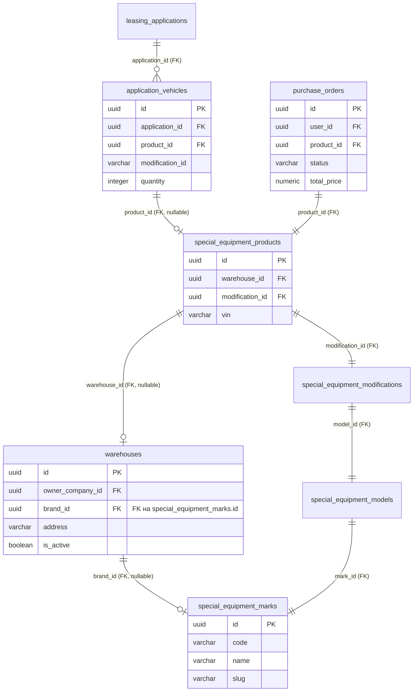

# Bugfix: явная корреляция подзапроса Warehouse.brand (устранение 500 в GET /api/v1/applications/{id} и GET /api/v1/commerce/orders?type=vehicle)

**Идентификатор задачи**: `warehouse-brand-subquery-correlate`  
**Тип задачи**: `bugfix`  
**Дата создания**: 2026-09-24 12:34:45 MSK  
**Ветка**: `bugfix/warehouse-brand-subquery-correlate`  



> **Примечание к схеме**: физическая схема БД и миграции не изменяются. Затрагивается гибридное выражение ORM-модели `Warehouse.brand` (`_brand_expression`), разрешающее имя марки `special_equipment_marks.name` через скалярный подзапрос.

---

## 1. Постановка проблемы

На стенде возникают две связанные ошибки `500 Internal Server Error`:
1. При переходе в детали заявки (`GET /api/v1/applications/{application_id}`) — как созданной вручную, так и через оформление спецтехники:
   ```json
   {
       "detail": "Произошла внутренняя ошибка. Попробуйте позже.",
       "code": "INTERNAL_ERROR"
   }
   ```
2. При переходе в кабинет клиента (`/cabinet`) в раздел «Мои Заказы» (`GET /api/v1/commerce/orders?type=vehicle`):
   ```json
   {
       "detail": "Произошла внутренняя ошибка. Попробуйте позже.",
       "code": "INTERNAL_ERROR"
   }
   ```

### Единая первопричина (Root Cause)
1. В маршруте `GET /api/v1/applications/{application_id}` вызывается `handle_get_application`, который вызывает `repo.list_application_vehicles_with_catalog`.
2. В маршруте `GET /api/v1/commerce/orders?type=vehicle` вызывается `commerce_facade.list_orders`, который для типа `vehicle` обращается к `handle_get_user_orders` -> `purchase_repository.get_by_user_id`.
3. В обоих SQL-запросах:
   - В секции `FROM / JOIN` соединяется таблица марок спецтехники `SpecialEquipmentMark` (`special_equipment_marks`).
   - В секции `SELECT` запрашивается колонка бренда склада ТС `Warehouse.brand.label("warehouse_brand")`.
4. В модели `Warehouse` гибридное свойство `brand` вычисляется выражением:
   ```python
   @brand.inplace.expression
   @classmethod
   def _brand_expression(cls) -> Any:
       from infrastructure.models.special_equipment import SpecialEquipmentMark

       return sa.select(SpecialEquipmentMark.name).where(SpecialEquipmentMark.id == cls.brand_id).scalar_subquery()
   ```
5. В подзапросе не задана явная корреляция (`.correlate(cls)`). При компиляции SQLAlchemy видит, что во внешнем запросе присутствуют **обе** таблицы (`warehouses` и `special_equipment_marks`), и автоматически коррелирует обе таблицы с внешним запросом, исключая `special_equipment_marks` из `FROM` подзапроса.
6. Подзапрос остаётся без `FROM`, что приводит к аварийному завершению компиляции запроса:
   ```text
   sqlalchemy.exc.InvalidRequestError: Select statement '<...>' returned no FROM clauses due to auto-correlation; specify correlate(<tables>) to control correlation manually.
   ```
7. Исключение не относится к `(ServiceError, DomainError)`, перехватывается глобальным обработчиком исключений FastAPI и возвращается клиенту как `500 Internal Server Error`.

---

## 2. Требования

1. **Корреляция подзапроса**:
   - В методе `Warehouse._brand_expression` явно ограничить корреляцию подзапроса только родительской таблицей склада (`.correlate(cls)`).
   - Подзапрос должен компилироваться без ошибок как изолированно, так и внутри внешних запросов, уже содержащих `special_equipment_marks` (включая `list_application_vehicles_with_catalog` и `purchase_repository.get_by_user_id`).
2. **Работоспособность API**:
   - Запрос `GET /api/v1/applications/{application_id}` должен успешно возвращать HTTP 200 и заполненный объект `ApplicationDetailResponse`.
   - Запрос `GET /api/v1/commerce/orders?type=vehicle` должен успешно возвращать HTTP 200 и структуру списка заказов `CommerceOrderListResponse`.
3. **Регрессионное тестирование**:
   - Добавить регрессионные тесты для обоих сценариев:
     - Проверка компиляции и вызова `list_application_vehicles_with_catalog` и `GET /api/v1/applications/{id}`.
     - Проверка компиляции и вызова `purchase_repository.get_by_user_id` и `GET /api/v1/commerce/orders?type=vehicle`.
4. **Контроль целостности**:
   - Все статические проверки (`ruff`, `lint-imports`, `mypy`) должны быть зелёными.
   - `alembic check` должен подтверждать отсутствие расхождений схемы БД и ORM-моделей.

---

## 3. Планируемые изменения

1. **`backend/infrastructure/models/vehicles.py`**:
   - В выражении `_brand_expression` добавить `.correlate(cls)`:
     ```python
     @brand.inplace.expression
     @classmethod
     def _brand_expression(cls) -> Any:
         from infrastructure.models.special_equipment import SpecialEquipmentMark

         return (
             sa.select(SpecialEquipmentMark.name)
             .where(SpecialEquipmentMark.id == cls.brand_id)
             .correlate(cls)
             .scalar_subquery()
         )
     ```
2. **`backend/tests/integration/test_applications_router.py`**:
   - Добавить тест получения деталей заявки (`GET /api/v1/applications/{id}`) при наличии спецтехники со складом и маркой.
3. **`backend/tests/integration/test_commerce_router.py`**:
   - Добавить/проверить тест получения списка заказов (`GET /api/v1/commerce/orders?type=vehicle`), исключающий ошибку компиляции `purchase_repository.get_by_user_id`.

---

## 4. Критерии готовности

- [ ] В `Warehouse._brand_expression` задан `.correlate(cls)`.
- [ ] SQL-запросы `list_application_vehicles_with_catalog` и `purchase_repository.get_by_user_id` компилируются и исполняются без `InvalidRequestError`.
- [ ] `GET /api/v1/applications/{application_id}` возвращает `200 OK` с валидной структурой `ApplicationDetailResponse`.
- [ ] `GET /api/v1/commerce/orders?type=vehicle` возвращает `200 OK` с валидной структурой `CommerceOrderListResponse`.
- [ ] Интеграционные тесты регрессии проходят успешно.
- [ ] `uv run ruff check . --fix`, `uv run lint-imports`, `uv run mypy .` проходят без ошибок.
- [ ] `uv run alembic check` подтверждает отсутствие незафиксированных миграций.
