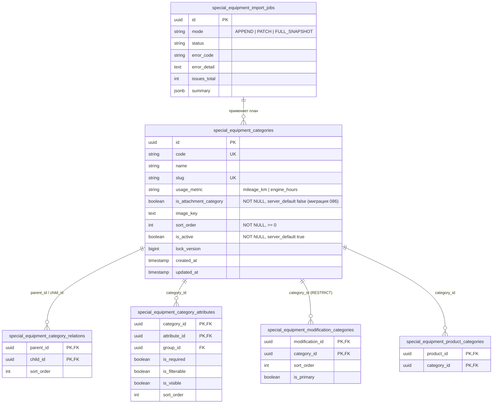
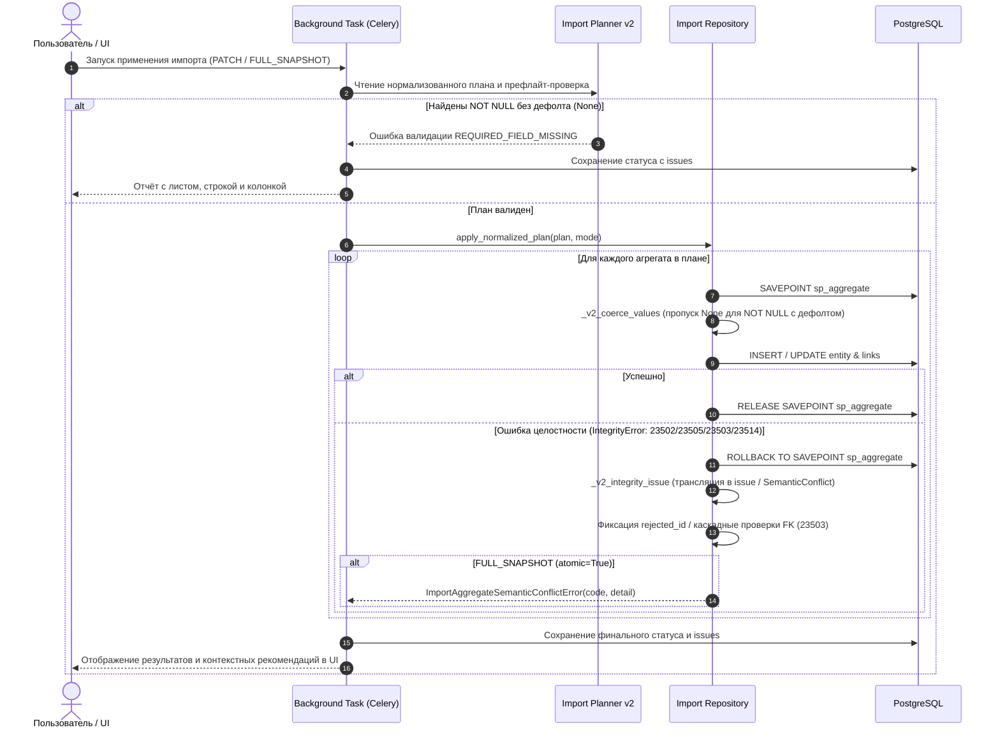

# Bugfix: Импорт каталога спецтехники падает на категориях с пустой «Категорией надстроек» (`AGGREGATE_APPLY_CONFLICT` / `APPLY_FAILED`)

- **Дата и время создания:** 2026-09-24 13:07:24 MSK (UTC+3)
- **Идентификатор задачи Bitrix24:** — (внутренняя задача)
- **Тип задачи:** `bugfix`
- **Ветка задачи:** `bugfix/se-import-attachment-category-blank`
- **Целевая ветка для MR:** `test`
- **Затронутые модули:** `backend/application/special_equipment_import_v2.py`, `backend/infrastructure/repositories/special_equipment_import_repository.py`, `backend/application/tasks/special_equipment_import.py`, `backend/infrastructure/services/special_equipment_xlsx.py`, фронтенд-экран результата импорта

---

## 1. Диаграммы

### 1.1. Диаграмма сущностей (ERD)



### 1.2. Диаграмма последовательности (Sequence Diagram)



---

## 2. Постановка проблемы и диагностика

### Симптом
Файл каталога по шаблону v6 (пример: `special-equipment_FAW.xlsx`) проходит проверку (preview) без ошибок, но при применении:

| Режим | Что видит пользователь |
|---|---|
| «Добавление и изменение» (`PATCH`) | Каждая строка листа «Категории» получает `AGGREGATE_APPLY_CONFLICT` «Агрегат не применён из-за конфликта зависимостей или уникальности». Следом каскадом отклоняются зависимые агрегаты (модификации с «Категориями модификаций», объявления с «Категориями объявлений»). |
| «Полная замена» (`FULL_SNAPSHOT`) | Задача целиком падает с `APPLY_FAILED` «Import apply failed because of an internal error.», ничего не загружается. |

В обоих случаях UI показывает рекомендацию «Убедитесь, что файл соответствует актуальному шаблону v6…», хотя файл шаблону соответствует. Воспроизводится на **пустой БД**, поэтому конфликт с существующими данными исключён.

Единственная особенность файла: колонка **«Категория надстроек»** на листе «Категории» пуста во всех строках. Колонка необязательна по смыслу: подавляющее большинство категорий не является категориями надстроек.

### Первопричина (Root Cause)
1. **Парсер XLSX** (`infrastructure/services/special_equipment_xlsx.py`, `_normalize_catalog_values`, ~стр. 1638) приводит булевы поля из `_BOOLEAN_FIELDS` к `bool` только для непустых значений. Для пустой ячейки `row["is_attachment_category"]` остаётся `None`.
2. **Планировщик** (`application/special_equipment_import_v2.py`, `_merge_values`, ~стр. 5016) подставляет значение по умолчанию только для `is_active` (`True`). Для `is_attachment_category`, входящего в `_directory_fields("categories")`, в план попадает `values["is_attachment_category"] = None`.
3. **Валидация пропускает `None`.** `_validate_offering_classification` (~стр. 3668–3684) читает поле как `bool(row["values"].get("is_attachment_category"))` и получает `False`, поэтому preview не находит ошибок.
4. **Применение** (`infrastructure/repositories/special_equipment_import_repository.py`):
   - `_v2_coerce_values` пропускает `None` без изменений;
   - `_v2_apply_entity` выполняет `INSERT … (is_attachment_category) VALUES (NULL) ON CONFLICT (code) …`;
   - колонка объявлена `NOT NULL` (миграция `086_special_equipment_attachments.py`). `server_default false` на явный `NULL` не действует;
   - PostgreSQL возвращает `NotNullViolationError` (SQLSTATE `23502`), SQLAlchemy оборачивает её в `IntegrityError`.
5. **Трансляция ошибки:**
   - **PATCH:** `apply_normalized_plan` ловит `IntegrityError` внутри SAVEPOINT и без анализа причины превращает её в общий `AGGREGATE_APPLY_CONFLICT`. Зависимые агрегаты падают по FK (`23503`) с тем же текстом.
   - **FULL_SNAPSHOT:** `atomic=True`, `IntegrityError` пробрасывается наверх. В `application/tasks/special_equipment_import.py` (~стр. 1420) её ловит общий `except Exception`, который выставляет `APPLY_FAILED` с фиксированным текстом и логирует только `type(exc).__name__`. Причина не попадает ни в UI, ни в лог.

### Смежный латентный дефект (того же класса)
В `_merge_values` для `is_active` значение по умолчанию подставляется только при `not current`. В режиме `FULL_SNAPSHOT` для **существующей** записи с пустой «Активностью» в план попадает `None`, а upsert выполняет `SET is_active = NULL` с тем же `23502`. На пустой БД не проявляется, но исправляется тем же механизмом (требования 3.1 и 3.2).

---

## 3. Требования к исправлению

### 3.1. Корректные значения по умолчанию для необязательных булевых полей (планировщик)

Файл `backend/application/special_equipment_import_v2.py`.

1. Ввести единый словарь значений по умолчанию для необязательных полей справочников:
   ```python
   _DIRECTORY_FIELD_DEFAULTS: dict[str, dict[str, Any]] = {
       "categories": {"is_attachment_category": False, "sort_order": 0, "is_active": True},
       "attribute_groups": {"sort_order": 0, "is_active": True},
       "marks": {"is_active": True},
       "attributes": {"is_active": True},
   }
   ```
2. В `_merge_values` (или сразу после него в `_normalize_directory_entity`) правило для пустой ячейки поля из словаря такое:

   | Операция / режим | Пустая ячейка | «Очистить» |
   |---|---|---|
   | `ADD` (любой режим) | значение по умолчанию (`False`) | значение по умолчанию (`False`) |
   | `SET` в `PATCH` | текущее значение из БД (`current[field]`) | значение по умолчанию |
   | `SET` в `FULL_SNAPSHOT` | текущее значение из БД, при его отсутствии — значение по умолчанию | значение по умолчанию |

   Непустое значение, отличное от «Да»/«Нет», по-прежнему даёт ошибку валидации `CATEGORY_INVALID` с `column_name="Категория надстроек"` (текущее поведение `parse_bool`).
3. После нормализации в `values` категории поле `is_attachment_category` всегда имеет тип `bool` (никогда `None`). То же касается `is_active` для всех семейств из п. 1, что закрывает смежный дефект из раздела 2.
4. `_validate_offering_classification` должен работать с уже нормализованным `bool`, без неявного `bool(None)`.

### 3.2. Страховка на уровне записи: не передавать `NULL` в `NOT NULL`-колонки с дефолтом

Файл `backend/infrastructure/repositories/special_equipment_import_repository.py`.

1. В `_v2_coerce_values` пропускать ключ, если `value is None`, колонка `NOT NULL` и у неё есть `server_default` или `default`:
   ```python
   column = table.c[key]
   if value is None:
       if not column.nullable and (
           column.server_default is not None or column.default is not None
       ):
           continue  # INSERT: сработает дефолт БД; UPSERT: поле не попадёт в SET
       result[key] = value
       continue
   ```
2. `update_values` в `_v2_apply_entity` строится по ключам `values`, поэтому пропущенное поле не перезаписывается при `ON CONFLICT DO UPDATE`: сохраняется текущее значение. Это ожидаемое поведение, его нужно проверить тестом.
3. Правка распространяется на все семейства (сущности и связи) и служит защитой от будущих необязательных полей, забытых в п. 3.1.

### 3.3. Предварительная проверка обязательных полей на этапе preview

1. В репозитории добавить функцию, возвращающую по метаданным SQLAlchemy множества колонок `NOT NULL` **без** значения по умолчанию для каждого семейства из `_V2_ENTITY_MODELS` и `_V2_LINK_MODELS` (исключая `id`, `created_at`, `updated_at`, `lock_version`).
2. В планировщике после нормализации всех семейств (перед записью артефакта) проверить каждую строку плана с `operation != "DELETE"`: для таких колонок значение в `values` не должно быть `None`.
3. При нарушении добавить issue уровня `error`:
   - `code="REQUIRED_FIELD_MISSING"`;
   - `sheet_code`, `row_number` — из строки плана;
   - `column_name` — русский заголовок колонки (сопоставление поле → заголовок взять из существующих кортежей колонок в `domain/special_equipment_import.py`);
   - `message="Не заполнено обязательное поле «{заголовок}»"`;
   - агрегат исключается из плана тем же механизмом, что и прочие ошибки валидации.

Цель: любое оставшееся нарушение `NOT NULL` видно пользователю **в отчёте проверки до применения**, с листом, строкой и колонкой.

### 3.4. Трансляция ошибок БД при применении в понятные коды

Файл `backend/infrastructure/repositories/special_equipment_import_repository.py`.

1. Добавить хелпер `_v2_integrity_issue(exc: IntegrityError, *, family: str | None) -> tuple[str, str, str | None]`, возвращающий `(code, message, column_name)`. Он читает `sqlstate`, `constraint_name`, `column_name`, `table_name` из `exc.orig` / `exc.orig.__cause__` / `diag` по образцу `_is_target_warehouse_integrity_error`.

   | SQLSTATE | Код issue | Сообщение |
   |---|---|---|
   | `23502` not_null_violation | `REQUIRED_FIELD_MISSING` | «Не заполнено обязательное поле «{заголовок колонки}»» |
   | `23505` unique_violation | `UNIQUE_CONFLICT` | По `constraint_name`, например `uq_special_equipment_categories_slug` → «Категория с таким названием уже существует с другим кодом»; иначе «Значение уже используется другой записью ({constraint})» |
   | `23503` foreign_key_violation | `DEPENDENCY_NOT_APPLIED` | «Связанная запись не создана — см. ошибку по ней выше» |
   | `23514` check_violation | `VALUE_OUT_OF_RANGE` | «Недопустимое значение ({constraint})» |
   | прочее | `AGGREGATE_APPLY_CONFLICT` | текущий текст (fallback) |

   Заголовок колонки определяется по `family` и `column_name` через ту же карту, что и в п. 3.3.
2. **PATCH** (`apply_normalized_plan`, ветка `except (IntegrityError, …)`): для `IntegrityError` заполнять `code`, `message`, `column_name` из хелпера вместо фиксированного `AGGREGATE_APPLY_CONFLICT`.
3. **FULL_SNAPSHOT** (`atomic=True`): вместо голого `raise` пробрасывать
   ```python
   raise ImportAggregateSemanticConflictError(
       f"Лист «{sheet}», строка {row_number}, код {aggregate_code}: {message}",
       code=code,
   ) from exc
   ```
   Существующий обработчик `except ImportAggregateSemanticConflictError` в `apply_special_equipment_import` сохранит `error_code=code` и `error_detail=message` в задаче, и пользователь увидит реальную причину вместо `APPLY_FAILED`.
4. В общем `except Exception` в `apply_special_equipment_import` логировать `sqlstate`, `constraint_name`, `column_name`, `table_name` (если исключение — `DBAPIError`) и использовать `logger.exception`. Значения ячеек и персональные данные не логировать (см. `test_external_logging_safety.py`).

### 3.5. Каскадные отклонения (PATCH)

Если агрегат отклонён, зависимые агрегаты, упавшие по `23503`, должны получать `DEPENDENCY_NOT_APPLIED` с указанием кода корневого агрегата: «Не применено, так как категория `LEGKOVOI_TRANSPORT` не загружена». Для этого в `apply_normalized_plan` вести множество `id` отклонённых сущностей и при `23503` проверять, ссылается ли агрегат на одну из них.

### 3.6. Фронтенд: рекомендации по коду ошибки

На экране результата импорта (компонент найти по строке «Убедитесь, что файл соответствует актуальному шаблону») показывать рекомендацию по коду:

| Код | Рекомендация |
|---|---|
| `REQUIRED_FIELD_MISSING` | «Заполните колонку «{column_name}» на листе «{sheet}», строка {row}» |
| `UNIQUE_CONFLICT` | «Запись с таким названием уже существует — используйте её код или измените название» |
| `DEPENDENCY_NOT_APPLIED` | «Сначала исправьте ошибку в связанной записи» |
| шаблонные коды (`TEMPLATE_*`, `NORMALIZED_ARTIFACT_INVALID`, `CODE_INVALID` и т. п.) | текущая рекомендация про шаблон v6 |
| `APPLY_FAILED` | «Внутренняя ошибка при загрузке. Обратитесь в поддержку, указав номер задачи импорта» |

Рекомендация про шаблон v6 не должна показываться для ошибок данных.

### 3.7. Шаблон и инструкция

В `infrastructure/services/special_equipment_xlsx.py` (лист «Инструкция», рядом со строкой «Пустая ячейка не изменяет поле…») добавить строку:
«Категория надстроек — «Да» или «Нет». Пустая ячейка у новой категории означает «Нет», у существующей — сохраняет текущее значение.»

---

## 4. Тестирование

Тесты добавить в `backend/tests/test_special_equipment_import_v2.py` (планировщик) и `backend/tests/test_special_equipment_import_v2_durability.py` (применение на реальной БД).

1. **Регрессия основного сценария** (пустая БД, фикстура по мотивам `special-equipment_FAW.xlsx`: 11 категорий, связи, характеристики категорий, модификации, объявления; «Категория надстроек» пуста):
   - `PATCH` → статус `COMPLETED`, все 11 категорий созданы с `is_attachment_category = false`, зависимые записи созданы, `rejectedAggregates = 0`;
   - `FULL_SNAPSHOT` → статус `COMPLETED`, результат тот же;
   - `APPEND` → то же.
2. **PATCH существующей категории** с `is_attachment_category = true` и пустой ячейкой: значение остаётся `true`. С «Очистить» становится `false`.
3. **FULL_SNAPSHOT существующей категории** с пустыми «Категорией надстроек» и «Активностью»: значения сохраняются, `NotNullViolation` нет (смежный дефект).
4. **Некорректное значение** («Может быть») в «Категории надстроек»: ошибка валидации `CATEGORY_INVALID` в preview, `column_name="Категория надстроек"`.
5. **`_v2_coerce_values`** (unit): `None` для `NOT NULL`-колонки с дефолтом отбрасывается, для nullable-колонки сохраняется, для `NOT NULL` без дефолта сохраняется (и ловится проверкой из п. 3.3).
6. **Preflight (п. 3.3):** искусственно сформированная строка плана с `None` в `NOT NULL`-колонке без дефолта даёт issue `REQUIRED_FIELD_MISSING` с листом, строкой и колонкой, а агрегат исключается.
7. **Трансляция ошибок (п. 3.4):** на реальной БД спровоцировать `23502`, `23505` (две категории с разными кодами и одинаковым названием: slug), `23503`:
   - PATCH: issues имеют коды `REQUIRED_FIELD_MISSING` / `UNIQUE_CONFLICT` / `DEPENDENCY_NOT_APPLIED` и заполненный `column_name`;
   - FULL_SNAPSHOT: задача в статусе `FAILED` с соответствующим `error_code` (не `APPLY_FAILED`), `error_detail` содержит лист, строку и код.
8. Существующие тесты `test_special_equipment_import_v2*.py`, `test_special_equipment_import_management_parity.py`, `test_special_equipment_import_images.py` остаются зелёными.

> Примечание: ошибку с двумя категориями с одинаковым названием внутри одного файла (тест 7, `23505`) желательно тоже ловить на preview. Это выходит за рамки задачи и заводится отдельно, если потребуется.

---

## 5. Критерии готовности (Definition of Done)

1. Файл `special-equipment_FAW.xlsx` **без изменений** (пустая «Категория надстроек») загружается на пустую БД в режимах «Только добавление», «Добавление и изменение» и «Полная замена» со статусом `COMPLETED` / `COMPLETED_WITH_WARNINGS`, все категории созданы с `is_attachment_category = false`.
2. В `values` плана для категорий `is_attachment_category` никогда не равно `None`.
3. Любое нарушение `NOT NULL` / уникальности / FK при применении отображается пользователю с конкретным кодом (`REQUIRED_FIELD_MISSING`, `UNIQUE_CONFLICT`, `DEPENDENCY_NOT_APPLIED`, `VALUE_OUT_OF_RANGE`), листом, строкой и колонкой. `APPLY_FAILED` остаётся только для действительно внутренних ошибок и логируется с `sqlstate` и `constraint_name`.
4. Рекомендация «соответствует шаблону v6» не показывается для ошибок данных.
5. Инструкция в шаблоне описывает поведение пустой «Категории надстроек».
6. `uv run ruff check`, `uv run lint-imports`, `uv run mypy`, `uv run pytest backend/tests/test_special_equipment_import_v2*.py` зелёные; фронтенд-линтер и тесты зелёные.
7. Создан Merge Request в ветку `test` со ссылкой на задачу Bitrix24.
