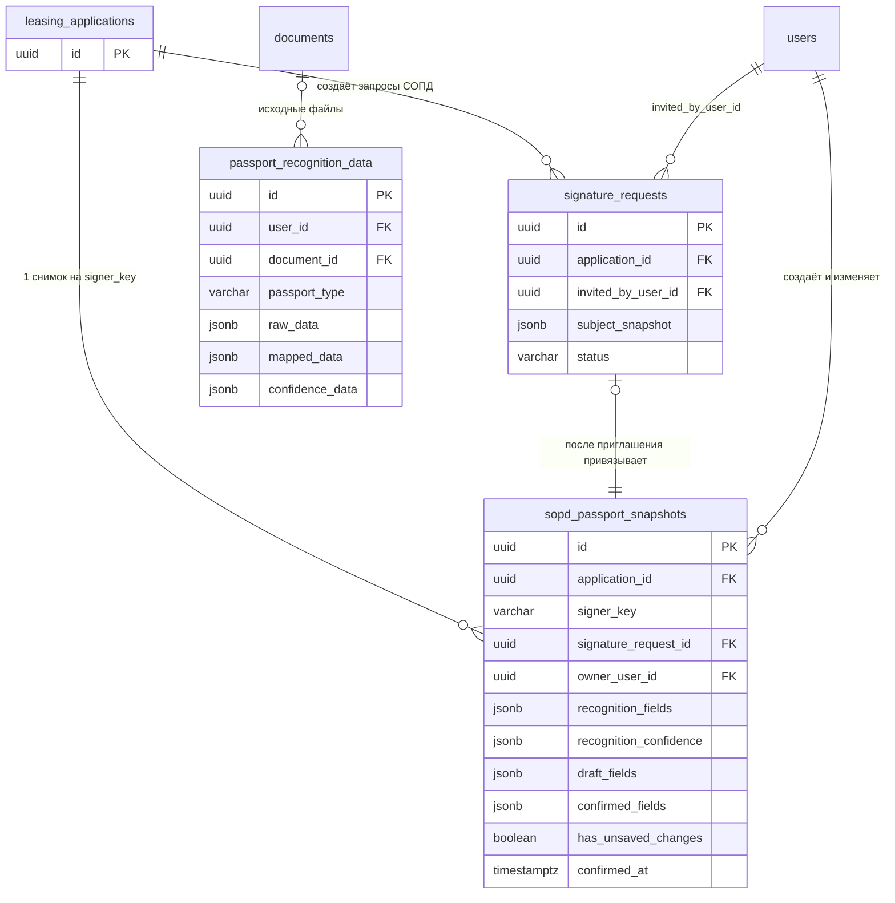

# Спецификация задачи Bitrix #21568 — ручная проверка паспортных данных для СОПД

**Задача Bitrix:** https://carcraftpro.bitrix24.ru/workgroups/group/124/tasks/task/view/21568/

**Ветка спецификации:** `feature/21568-passport-recognition`, создана от синхронизированного `origin/test`.

**Статус:** на согласовании. Реализация, миграции, commit, push и MR не выполняются до явного подтверждения.



> На диаграмме `sopd_passport_snapshots` — новая таблица. `passport_recognition_data` остаётся техническим хранилищем исходного ответа DBrain и файлового кэша; в PDF и СОПД он напрямую не подставляется.

```mermaid
sequenceDiagram
    actor U as Пользователь
    participant FE as Nuxt checkout
    participant API as FastAPI
    participant DB as PostgreSQL
    participant DR as DBrain
    participant DOC as Генератор СОПД

    U->>FE: Загружает 2 страницы документа
    FE->>API: POST preview по applicationId + signerKey
    API->>DR: Распознавание обеих страниц
    DR-->>API: Поля + confidence, включая nationality при наличии
    API->>DB: Сохраняет raw-кэш и черновой снимок
    API-->>FE: Поля, confidence, needs_save=true
    FE-->>U: Показывает редактируемую форму

    alt гражданство отсутствует
        FE-->>U: Требует заполнить nationality вручную
    end

    U->>FE: Меняет поле
    FE->>API: PATCH draft (debounced)
    API->>DB: Сохраняет draft_fields, has_unsaved_changes=true
    API-->>FE: Статус черновика
    FE-->>U: Скрывает все confidence; блокирует SMS и шаблон

    U->>FE: Нажимает «Сохранить изменения»
    FE->>API: PATCH confirmed passport snapshot
    API->>DB: Валидирует и фиксирует confirmed_fields
    API-->>FE: confirmed=true, actions_allowed=true

    alt SMS или бумажный путь
        FE->>API: Создаёт/использует signature_request
        API->>DB: Привязывает снимок к signatureRequestId
        FE->>API: Запрашивает SMS либо заполненный шаблон
        API->>DB: Проверяет сохранённый снимок и отсутствие draft-правок
        API->>DOC: Формирует СОПД только из confirmed_fields
        DOC-->>API: PDF
        API-->>FE: SMS отправлено или PDF доступен
    end

    alt сохранение не прошло
        API-->>FE: HTTP ошибка с code, message, X-Request-ID
        FE-->>U: Стандартный toast ошибки
    end
```

## 1. Постановка и бизнес-цель

На шаге СОПД пользователь загружает страницы паспорта подписанта. DBrain уже возвращает сырой JSON с распознанными значениями и confidence, однако форма не даёт пользователю полноценно проверить, исправить и явно подтвердить данные перед отправкой SMS или формированием бумажного СОПД.

Нужно добавить управляемый сценарий: распознать данные, показать пользователю все требуемые поля и точность распознавания, дать исправить данные, сохранить подтверждённый снимок и только после этого открыть действия, которые используют паспортные данные.

Бизнес-результат: в SMS-приглашение и в скачиваемый шаблон СОПД не попадают непроверенные либо несохранённые данные распознавания; пользователь может исправить ошибки качества фото без автоматического сохранения каждой правки.

## 2. Текущее состояние

- Распознавание хранится в `passport_recognition_data` как raw JSON DBrain, `mapped_data` и `confidence_data`; ключ кэша — пользователь, хэш файла и тип страницы.
- Текущий маршрут `PATCH /api/v1/signatures/{request_id}/passport-recognition` принимает две страницы, запускает распознавание и записывает идентификаторы результатов в `signature_requests.subject_snapshot`.
- Этот маршрут доступен только создателю существующего `signature_request`, поэтому не решает сценарий **до** отправки SMS.
- `signature_requests.subject_snapshot` сегодня хранит данные подписанта и ссылки на результаты распознавания. Контекст PDF СОПД дополнительно может брать паспортные данные из последней записи `passport_recognition_data` пользователя и сопоставляет данные анкеты по ФИО/ИНН. Для нескольких подписантов это создаёт риск подстановки чужого или устаревшего результата.
- Во frontend `QuestionnaireSopd.vue` уже показывает загрузку паспортных страниц для SMS-варианта; для варианта «Подпишу на бумаге» эквивалентного блока распознавания нет.
- В текущем API preview возвращает лишь часть полей (`gender`, `birth_date`, `full_name`, `address`), а не полный результат, необходимый форме.

## 3. Границы задачи

### Входит в задачу

- Отображение и редактирование паспортной формы для каждого подписанта СОПД.
- Получение из DBrain всех перечисленных в разделе 5 полей и confidence.
- Сохранение черновика и отдельно подтверждённого снимка данных до и после создания приглашения.
- Валидация российских и иностранных документов.
- Блокировка SMS, скачивания заполненного СОПД и бумажного подписания до успешного сохранения актуальных данных.
- Использование подтверждённого снимка при формировании СОПД в пределах текущего сценария.
- Безопасные коды ошибок для Network и пользовательские toast-уведомления.
- Миграция БД и E2E-проверки затронутого сценария.

### Не входит в задачу

- Проектирование будущей единой анкеты, которая позднее будет хранить все данные заявки.
- Миграция остальных анкетных/профильных паспортных полей в эту будущую сущность.
- Изменение алгоритмов или модели DBrain.
- Автоматическое исправление распознанных значений без подтверждения пользователя.

## 4. Владелец паспортного снимка и доступ

### До создания приглашения

Снимок адресуется только парой:

```text
applicationId + signerKey
```

`signerKey` — существующий стабильный ключ кандидата из `SopdSignerCandidate.key`, а не отображаемые ФИО, ИНН, позиция в списке или значение, переданное пользователем произвольно.

Backend обязан:

1. Проверить доступ текущего пользователя к заявке.
2. Получить актуальных кандидатов подписания для заявки.
3. Убедиться, что `signerKey` присутствует среди этих кандидатов.
4. Создавать и читать снимок только для этой пары.

### После создания приглашения

Снимок адресуется по `signatureRequestId`.

Backend обязан проверить одновременно:

- запрос существует;
- это запрос типа СОПД;
- запрос находится в допускающем редактирование статусе;
- `invited_by_user_id` равен текущему пользователю;
- снимок принадлежит именно этому запросу.

Попытки изменить данные другого подписанта или другого пользователя должны возвращать `403`, а не раскрывать паспортные данные.

### Переход между состояниями

Команда создания приглашения должна принимать `signerKey` из списка кандидатов и связывать с ним уже подтверждённый снимок. Нельзя выполнять этот переход через ФИО, ИНН, порядок карточек или результат распознавания.

## 5. Поля формы и результат DBrain

Все поля доступны для редактирования. API использует стабильные английские имена; UI отображает русские подписи.

- `surname` — фамилия; источник DBrain: `surname`.
- `name` — имя; источник: `first_name`.
- `patronymic` — отчество; источник: `other_names`.
- `nationality` — гражданство; источник: `nationality`, если DBrain его вернул.
- `gender` — `male` или `female`; источник: `sex`.
- `birthDate` — дата рождения; источник: `date_of_birth`.
- `birthPlace` — место рождения; источник: `place_of_birth`.
- `passportSeries` — серия документа; для РФ извлекается из `series_and_number`.
- `passportNumber` — номер документа; для РФ извлекается из `series_and_number`.
- `givenDate` — дата выдачи; источник: `date_of_issue`.
- `code` — код подразделения; источник: `subdivision_code`.
- `givenWhom` — кем выдан; источник: `issuing_authority`.

`series_and_number` — одно составное поле DBrain. Для РФ backend разделяет его на серию и номер по пробелам/небуквенно-цифровым разделителям. Его единственный confidence показывается одновременно рядом с серией и номером; это одна оценка DBrain, а не две независимые оценки.

Если поле `nationality` отсутствует в ответе DBrain, оно остаётся пустым и становится обязательным для ручного заполнения. Пустое ФИО от DBrain не является отдельным ожидаемым сценарием согласно бизнес-решению.

## 6. Confidence и состояние редактирования

- DBrain возвращает confidence в диапазоне `0..1`.
- Для UI: `round(confidence * 100)`.
- `91–100%` — зелёный текст.
- `61–90%` — жёлтый текст.
- `0–60%` — красный текст.
- Если DBrain не отдал confidence для поля, процент и цвет не показываются.
- До первой ручной правки confidence показываются для всех доступных полей распознавания.
- После первой ручной правки любого поля frontend немедленно скрывает confidence **у всей формы**.
- Одновременно frontend сохраняет `draft_fields` и `has_unsaved_changes=true` через debounced API. Это нужно не только для сохранности черновика после перезагрузки, но и чтобы backend мог запретить генерацию шаблона, пока есть несохранённые изменения.
- Кнопка «Сохранить изменения» изначально disabled. Она становится активной при отличии черновика от подтверждённого снимка или при первичном результате распознавания, который ещё не был подтверждён.

## 7. Валидация

### Нормализация гражданства

Backend хранит введённое пользователем значение `nationality` и вычисляет нормализованный `country_code`.

К `RU` приводятся без учёта регистра и лишних пробелов как минимум: `РФ`, `Россия`, `Российская Федерация`. Список эквивалентов должен быть централизован в одной функции/константе, а не дублироваться в роутере и UI.

### Гражданин РФ (`country_code = RU`)

Все поля из раздела 5 обязательны.

- `passportSeries` — только цифры, длина от 1 до 10.
- `passportNumber` — только цифры, длина от 1 до 10.
- `code` — шесть цифр в маске `000-000`.
- `birthDate` и `givenDate` — реальные календарные даты.
- Строковые поля не могут состоять только из пробелов.

При существенном исправлении фамилии сервер должен запросить повторную загрузку документа:

1. Нормализовать исходную распознанную и черновую фамилии: верхний регистр, `Ё → Е`, убрать пробелы, дефисы и точки.
2. Вычислить расстояние Левенштейна.
3. Если расстояние больше 40% длины исходной распознанной фамилии, вернуть `422` с кодом `PASSPORT_SURNAME_REUPLOAD_REQUIRED`.
4. Пользовательское сообщение: «Фамилия существенно отличается от результата распознавания. Загрузите более качественное фото паспорта.»

Исправления ФИО меньшего масштаба разрешены. Для имени и отчества порог повторной загрузки в этой задаче не применяется.

### Иностранный документ (`country_code != RU`)

Обязательны только:

- фамилия;
- имя;
- гражданство;
- дата рождения;
- пол;
- номер документа.

Отчество, серия, дата выдачи, код подразделения, кем выдан и место рождения не обязательны. Российские маски и проверка «только цифры» не применяются. Каждое строковое значение документа ограничено 30 символами. Полная ручная коррекция ФИО разрешена, включая существенное отличие от результата DBrain.

### Формат даты

В интерфейсе дата отображается и вводится строго как `ДД.ММ.ГГГГ`. API принимает и возвращает даты как ISO `YYYY-MM-DD`; frontend конвертирует формат только на границе UI/API. В БД дата хранится типом `DATE` либо нормализованной ISO-строкой внутри JSON-снимка без локального формата.

## 8. Хранение данных

Добавить отдельную таблицу `sopd_passport_snapshots`. Это ограниченная предметная сущность текущего СОПД, не будущая единая анкета.

Минимальные поля:

- `id` — UUID, PK.
- `application_id` — FK на заявку, not null.
- `signer_key` — стабильный ключ подписанта, not null.
- `signature_request_id` — nullable FK на `signature_requests`, unique при наличии.
- `owner_user_id` — пользователь, создавший/владеющий снимком, not null.
- `recognition_fields` — нормализованные значения из DBrain до ручного редактирования, JSONB.
- `recognition_confidence` — confidence из DBrain, JSONB.
- `draft_fields` — последнее несохранённое состояние формы, JSONB.
- `confirmed_fields` — последний пользовательски подтверждённый снимок, JSONB, nullable до сохранения.
- `has_unsaved_changes` — not null boolean.
- `confirmed_at`, `created_at`, `updated_at`.

Ограничения:

- уникальность `(application_id, signer_key)` до создания приглашения;
- `signature_request_id` уникален, если не `NULL`;
- связывание после приглашения выполняется транзакционно вместе с созданием/обновлением `signature_request`;
- генератор СОПД читает только `confirmed_fields`, никогда `draft_fields`, raw JSON DBrain или «последнюю запись пользователя» из общего кэша.

Существующую таблицу `passport_recognition_data` не использовать как авторитетный снимок СОПД и не расширять её бизнес-ключами подписанта. Она остаётся источником технического исходного результата и повторного использования распознавания файла.

## 9. API-контракты

Все маршруты требуют JWT и не имеют завершающего `/`.

### До приглашения

`POST /api/v1/applications/{applicationId}/sopd-signers/{signerKey}/passport-recognition`

Принимает multipart с двумя файлами: основной страницей паспорта и страницей регистрации. Запускает или использует кэш DBrain, обновляет распознанный черновик и возвращает форму.

`GET /api/v1/applications/{applicationId}/sopd-signers/{signerKey}/passport`

Возвращает текущий снимок, чтобы форма корректно восстанавливалась после перезагрузки.

`PATCH /api/v1/applications/{applicationId}/sopd-signers/{signerKey}/passport/draft`

Сохраняет `draft_fields`, устанавливает `has_unsaved_changes=true`, возвращает актуальное состояние блокировки. Вызывается debounced после первой и последующих правок.

`PATCH /api/v1/applications/{applicationId}/sopd-signers/{signerKey}/passport`

Валидирует и фиксирует `confirmed_fields`, очищает `has_unsaved_changes`, возвращает сохранённый снимок и `actions_allowed=true`.

### После приглашения

Те же операции доступны по ресурсу подписи:

- `POST /api/v1/signatures/{signatureRequestId}/passport-recognition`
- `GET /api/v1/signatures/{signatureRequestId}/passport`
- `PATCH /api/v1/signatures/{signatureRequestId}/passport/draft`
- `PATCH /api/v1/signatures/{signatureRequestId}/passport`

Существующий маршрут `PATCH /api/v1/signatures/{request_id}/passport-recognition` заменить на канонический контракт выше; frontend не должен поддерживать оба маршрута.

### Ответ формы

Ответ `GET`, успешного recognition и сохранения имеет следующую смысловую форму:

```json
{
  "applicationId": "uuid",
  "signerKey": "director_applicant:...",
  "signatureRequestId": "uuid-or-null",
  "fields": {
    "surname": "ИМЯРЕК",
    "name": "ЕВГЕНИЙ",
    "patronymic": "АЛЕКСАНДРОВИЧ",
    "nationality": null,
    "gender": "male",
    "birthDate": null,
    "birthPlace": "ГОР. АРХАНГЕЛЬСК",
    "passportSeries": "1104",
    "passportNumber": "000000",
    "givenDate": "2004-12-17",
    "code": "292-000",
    "givenWhom": "ОТДЕЛОМ ВНУТРЕННИХ ДЕЛ ..."
  },
  "confidence": {
    "surname": 100,
    "name": 100,
    "patronymic": 100,
    "gender": 100,
    "passportSeries": 100,
    "passportNumber": 100,
    "givenDate": 100,
    "code": 100,
    "givenWhom": 100,
    "birthDate": 0,
    "birthPlace": 100
  },
  "showConfidence": true,
  "hasUnsavedChanges": true,
  "actionsAllowed": false
}
```

Значения в примере иллюстративны: фактические проценты вычисляются из ответа DBrain. После ручной правки `confidence` может не возвращаться или возвращаться `null`, а `showConfidence=false`.

### Ошибки

Для новых маршрутов использовать безопасную структурированную ошибку:

```json
{
  "detail": {
    "code": "PASSPORT_SURNAME_REUPLOAD_REQUIRED",
    "message": "Фамилия существенно отличается от результата распознавания. Загрузите более качественное фото паспорта.",
    "fields": {"surname": "PASSPORT_SURNAME_REUPLOAD_REQUIRED"}
  },
  "request_id": "uuid-or-trace-id"
}
```

Коды ошибок минимум:

- `PASSPORT_FIELDS_REQUIRED` — обязательные поля не заполнены.
- `PASSPORT_RU_FORMAT_INVALID` — нарушен формат российского документа.
- `PASSPORT_SURNAME_REUPLOAD_REQUIRED` — существенное отличие фамилии РФ.
- `PASSPORT_NATIONALITY_REQUIRED` — гражданство не задано.
- `PASSPORT_ACTIONS_BLOCKED_UNSAVED_CHANGES` — SMS/PDF запрошены при черновых правках.
- `PASSPORT_SNAPSHOT_NOT_CONFIRMED` — отсутствует подтверждённый снимок.
- `PASSPORT_ACCESS_DENIED` — нет права редактировать снимок.
- `PASSPORT_REQUEST_NOT_EDITABLE` — СОПД подписано, отменено или недоступно для изменения.
- `PASSPORT_RECOGNITION_FAILED` — DBrain не вернул пригодный результат.

HTTP-статусы: `403` для доступа, `404` для отсутствующего доступного ресурса, `409` для неподходящего статуса подписи/блокировки состояния, `422` для пользовательской валидации и результата распознавания, `502` или `503` для недоступности DBrain.

Frontend показывает только `detail.message` в стандартном toast. HTTP-код, тело ответа и `X-Request-ID` остаются в браузерном Network; серверный лог пишет код и request id без raw JSON, файлов и паспортных значений.

## 10. Изменения frontend

В `QuestionnaireSopd.vue` и связанных composable/types:

1. Для каждой карточки подписанта получать и передавать стабильный `candidate.key`.
2. Показать блок загрузки двух страниц и распознавания как для `sms`, так и для `file` («Подпишу на бумаге»).
3. После успешного распознавания показать форму полей из раздела 5.
4. Все поля доступны для редактирования; обязательность и маски меняются сразу после нормализации гражданства.
5. `nationality` — обязательный контрол с понятным состоянием ошибки, если DBrain его не вернул.
6. Показать confidence и цвет до первой правки; после правки скрыть его у всей формы.
7. Добавить «Сохранить изменения»: disabled без изменений, active при pending confirmation, показывает toast ошибки API.
8. На первой правке сохранять черновик debounced; при ошибке черновика не разрешать зависимые действия и показать toast.
9. Пока `actionsAllowed=false`, отключать и пояснять причину для SMS, скачивания заполненного шаблона и бумажного подписания.
10. После подтверждения разрешать актуальный выбранный путь. При новом редактировании снова блокировать их.
11. Не делать mobile-only интерфейс; сценарий поддерживается только на desktop viewport от 768 px.

## 11. Изменения backend

1. Добавить ORM-модель, репозиторий и Alembic-миграцию `sopd_passport_snapshots` с ограничениями из раздела 8.
2. Вынести маппинг raw JSON DBrain в единый сервис: поля, `nationality`, даты, `sex`, разбор `series_and_number`, confidence и нормализация пустых/непригодных значений.
3. Вынести правила нормализации гражданства, валидации РФ/иностранного документа и расстояния Левенштейна в доменный/прикладной сервис, используемый только сервером.
4. Добавить команды и схемы API для recognition, чтения снимка, сохранения черновика и подтверждения до/после приглашения.
5. Расширить контракт создания приглашения `signers[]` стабильным `signerKey`; на backend проверить, что он соответствует актуальному кандидату.
6. При создании приглашения привязать подтверждённый снимок к `signature_request`; при отсутствии подтверждённого снимка не создавать SMS-приглашение и не разрешать бумажный заполненный шаблон.
7. Изменить получение контекста СОПД: сначала получить подтверждённый снимок конкретного запроса, а не выбирать «последний паспорт пользователя» и не сопоставлять анкету по ФИО/ИНН.
8. Перед формированием заполненного СОПД и отправкой SMS повторно проверять на backend наличие `confirmed_fields` и `has_unsaved_changes=false`.
9. Не удалять, не очищать и не перезаписывать существующие паспортные/DBrain записи миграцией или фоновым заданием.

## 12. Планируемые файлы

Точные имена новых файлов могут следовать существующей структуре, однако минимум затрагиваются:

- `backend/alembic/versions/<revision>_sopd_passport_snapshots.py`
- `backend/infrastructure/models/` и `backend/infrastructure/models/__init__.py`
- `backend/infrastructure/repositories/sopd_passport_snapshot_repository.py`
- `backend/application/commands/` для recognition, draft и confirm-сценариев
- `backend/application/services/` для маппинга DBrain и серверной валидации
- `backend/application/commands/invite_signers.py`
- `backend/application/queries/signer_sopd_context.py`
- `backend/presentation/schemas/signatures.py`
- `backend/presentation/routers/signatures.py`
- `backend/presentation/routers/applications.py`
- `frontend/features/checkout/components/QuestionnaireSopd.vue`
- `frontend/features/checkout/components/SignerCard.vue`
- `frontend/features/checkout/composables/` и `frontend/features/checkout/types/`
- целевые Playwright-сценарии в `frontend/tests/e2e/checkout/`

## 13. Критерии готовности

### Основной сценарий

- Пользователь для каждого доступного подписанта может загрузить две страницы документа как при SMS, так и при бумажном подписании.
- После DBrain форма показывает перечисленные поля и исходные confidence.
- Если DBrain не вернул `nationality`, сохранить форму без ручного заполнения невозможно.
- Пользователь может исправить любое поле; после первой правки confidence исчезают у всей формы.
- До нажатия «Сохранить изменения» SMS, скачивание заполненного СОПД и бумажное подписание недоступны.
- После успешного сохранения зависимые действия становятся доступны.
- После новой правки они блокируются повторно.
- PDF СОПД формируется только по `confirmed_fields` конкретного подписанта, а не по последнему DBrain-результату пользователя.

### Валидация

- Для `RU` сервер отклоняет пустые поля, нецифровые серию/номер, длину более 10, неверный код подразделения и невалидную дату.
- Для не-РФ сервер требует только закреплённые шесть полей, допускает буквенные значения документа и строки до 30 символов.
- Для РФ существенная правка фамилии по правилу 40% требует повторной загрузки; менее существенная правка сохраняется.
- Для иностранного документа существенная ручная правка ФИО сохраняется.

### Права и изоляция

- До приглашения нельзя прочитать/изменить снимок без доступа к заявке или с чужим `signerKey`.
- После приглашения нельзя прочитать/изменить снимок, если текущий пользователь не создал этот `signature_request`.
- Данные двух подписантов одной заявки и двух заявок одного пользователя не смешиваются.

### Ошибки и диагностика

- Ошибка сохранения отображается в стандартном toast.
- В Network видны HTTP-статус, `detail.code` и `X-Request-ID`.
- Логи не содержат raw паспортных данных, изображений или raw JSON DBrain.

### Проверка реализации

- Выполнены обязательные E2E-сценарии основного пути, прав доступа, РФ/иностранного документа, отсутствующего гражданства, повторной блокировки после редактирования и ошибки сохранения.
- Выполнены обязательные линтеры, запуск Docker, проверка логов и `alembic check` по правилам репозитория.
- Не выполняется удаление/очистка существующих данных БД.

## 14. Риски и принятые решения

- Будущая единая анкета не проектируется сейчас. Новая таблица ограничена контекстом СОПД и должна быть впоследствии мигрируема без использования ФИО/ИНН как ключей.
- `nationality` требуется проверить на реальном payload/актуальной документации DBrain перед реализацией маппера: в присланном тестовом JSON этого поля нет, хотя его контракт подтверждён как `nationality`.
- Хранение `draft_fields` до нажатия «Сохранить» намеренно отделено от `confirmed_fields`: это единственный способ серверно блокировать PDF/SMS при несохранённых правках и не подставлять данные браузера в юридический документ.
- Порог 40% применяется только к фамилии гражданина РФ по согласованному бизнес-решению; он не является проверкой личности и не заменяет проверку владельца заявки/подписанта.

## 15. Исправление коллизии Alembic-ревизий

### Текущее поведение

После очередной синхронизации с целевой веткой `test` в ней появилась цепочка
`137_application_sources` → `138_positions_and_user_companies_expansion` →
`139_user_company_personal_access_rules` → `140_se_composite_own_categories`.
Миграция задачи 21568 ранее получила идентификатор `137` и предка `136`.
После объединения Alembic увидит два разных файла с `revision = "137"` и не
сможет однозначно построить граф миграций.

### Целевое поведение

Граф миграций должен быть линейным: `136` → `137_application_sources` →
`138_positions_and_user_companies_expansion` →
`139_user_company_personal_access_rules` → `140_se_composite_own_categories`
→ `141_sopd_passport_snapshots`. Alembic должен видеть единственную head-
ревизию `141` и применять миграцию СОПД после актуальной цепочки `test`.

### Причина и границы

Коллизия возникла потому, что миграция 21568 получила следующий номер до
синхронизации с обновившейся веткой `test`, в которую вошли другие ревизии.
Исправление меняет только идентификатор, предка и имя файла миграции 21568;
SQL-операции создания `sopd_passport_snapshots` и модель данных не меняются.
Существующие данные не удаляются и не изменяются.

### План исправления

1. Переименовать файл
   `backend/alembic/versions/137_sopd_passport_snapshots.py` в
   `backend/alembic/versions/141_sopd_passport_snapshots.py`.
2. В переименованном файле заменить метаданные на `Revision ID: 141`,
   `revision = "141"` и `down_revision = "140"`; оставить `upgrade()` и
   `downgrade()` без изменения SQL-операций.
3. Проверить статически, что во всём `backend/alembic/versions/` ровно по одной
   ревизии `137`, `138`, `139`, `140` и `141`, а миграция 141 ссылается на 140.
4. В разрешённой изолированной БД выполнить `alembic upgrade head`,
   `alembic heads` и `alembic check`; ожидаются одна head `141` и отсутствие
   новых autogenerate-операций. Если окружение не позволяет получить
   зависимость или S3, зафиксировать это отдельно, не объявляя проверку
   пройденной.
5. Проверить `git diff --check`, закоммитить только исправление миграции и
   опубликовать дополнительный commit в уже существующей ветке
   `feature/21568-passport-recognition-qa` без MR.

### Критерии готовности исправления

- В репозитории отсутствует второй `revision = "137"`.
- `backend/alembic/versions/141_sopd_passport_snapshots.py` зависит от
  ревизии `140`.
- Docker/Alembic больше не останавливается из-за duplicate revision ID.
- Ветка в GitLab содержит исправляющий commit; MR не создаётся.

## 16. Исправление ложного статуса «Распознаём паспорт…»

### Текущее поведение

Сразу после создания заявки `QuestionnaireSopd.vue` запрашивает уже сохранённый
снимок паспорта через `GET .../passport`. Для этого технического запроса
устанавливается общее состояние `loading = true`. Оно передаётся в
`SignerCard.vue` как `passportLoading`, а компонент всегда показывает для него
текст «Распознаём паспорт…». Поэтому пользователь видит статус распознавания до
выбора и передачи хотя бы одного файла; фактический `POST .../passport-recognition`
при этом не выполняется.

### Целевое поведение

Статус «Распознаём паспорт…» отображается исключительно между отправкой двух
выбранных файлов (`страницы 2–3` и `страница с пропиской`) на endpoint
распознавания и получением его ответа или ошибки. Фоновая загрузка ранее
сохранённого снимка не должна блокировать выбор файлов и не должна отображаться
как распознавание.

### Бизнес-причина

Экран не должен сообщать пользователю о действии, которое система не выполняет:
ложный статус снижает доверие к обработке паспортных данных и создаёт впечатление
несанкционированного запуска распознавания.

### Планируемые изменения

1. В `frontend/features/checkout/components/QuestionnaireSopd.vue` разделить
   техническую загрузку снимка и распознавание на независимые состояния.
   `fetchSnapshot()` использует состояние загрузки снимка только для защиты от
   устаревших ответов; `recognize()` управляет отдельным
   `recognitionLoading`.
2. Передавать в `SignerCard.vue` только `recognitionLoading` для управления
   недоступностью полей выбора файлов и текстом статуса распознавания.
   Контракт распознавания, список обязательных файлов и API-эндпоинты не менять.
3. Добавить или обновить целевой desktop Playwright-сценарий в
   `frontend/tests/e2e/checkout/`, который подтверждает два состояния:
   - новая заявка без выбранных файлов не содержит текста «Распознаём паспорт…»;
   - после выбора обеих файловых страниц и до ответа endpoint распознавания текст
     виден, а элементы выбора файлов недоступны.
   Сценарий использует реальные подготовленные фикстуры изолированного E2E-
   окружения; не подменяет данные API произвольными browser-моками.
4. Выполнить `bunx vue-tsc --noEmit --pretty false`, `git diff --check` и
   целевой E2E в браузере с viewport не менее 768 CSS-пикселей. Проверить логи
   frontend и backend после сценария. Если запуск E2E остановится до браузерного
   сценария из-за внешней зависимости, зафиксировать точный этап и не считать
   пользовательскую проверку пройденной.

### Критерии готовности

- После создания новой заявки без выбранных паспортных файлов на экране нет
  статуса «Распознаём паспорт…».
- GET-загрузка сохранённого снимка не делает кнопки выбора файлов недоступными.
- После выбора обеих требуемых страниц отображается «Распознаём паспорт…» и
  блокируется повторный выбор файлов до завершения запроса.
- При ответе или ошибке распознавания статус исчезает и элементы выбора файлов
  снова доступны.
- Не изменены API-контракт, хранение паспортных данных, права доступа и
  последовательность подтверждения СОПД.

### Вопросы

Блокирующих вопросов нет. Нейтральный технический статус проверки сохранённых
данных не добавляется: для этого сценария достаточно не показывать пользователю
служебный GET-запрос.

## 17. Надёжность распознавания и порядок полей паспортной формы

### Текущее поведение, подтверждённое кодом

- Нормализация гражданства в frontend и backend принимает только три точных
  значения: `РФ`, `Россия`, `Российская Федерация`. Вариант
  `Российской федерации` определяется как иностранное гражданство, поэтому
  обязательность и маски российского паспорта не включаются.
- Поля формы располагаются в двух колонках в порядке «Фамилия» слева,
  «Имя» справа, «Отчество» слева в следующей строке.
- `map_dbrain()` в новом СОПД-сервисе получает дату рождения только из
  `date_of_birth`, пол только из `sex` и распознаёт лишь часть текстовых
  значений пола. Он не использует уже существующие общие правила,
  поддерживающие альтернативные ключи и значения DBrain.
- Confidence извлекается только из `items[0].confidence`. Если провайдер
  возвращает confidence в другом документированном месте ответа, в каждом
  поле или не возвращает его вовсе, API сохраняет пустой объект. Тогда
  `showConfidence=false`, и frontend корректно не показывает проценты, но
  пользователь не получает ожидаемую оценку распознавания.

### Целевое поведение

1. Любая поддерживаемая русскоязычная формулировка гражданства РФ, включая
   «Российской Федерации», должна включать российские обязательные поля и
   маски в интерфейсе, а backend должен отнести её к `country_code=RU`.
2. Поля первой строки формы должны располагаться так: «Имя» слева,
   «Фамилия» справа. «Отчество» остаётся в текущем месте следующей строки.
3. Снимок СОПД должен заполнять дату рождения и пол из нормального payload
   DBrain при допустимых ключах и форматах, не меняя вручную введённые данные
   и не подставляя вымышленные значения.
4. Поле «Кем выдан» допускает до 100 символов для российского и иностранного
   документа; более длинное значение не отправляется и отклоняется сервером
   с понятной ошибкой поля.
5. До первой ручной правки форма показывает confidence только для полей,
   для которых DBrain действительно вернул числовую оценку. После первой
   правки confidence скрывается у всей формы, как и сейчас.
6. Если в фактическом ответе DBrain confidence отсутствует, UI не показывает
   фиктивные проценты, а распознавание и ручное заполнение остаются доступны.

### Бизнес-причина

Паспортные данные влияют на юридический документ СОПД. Неправильная
классификация гражданства создаёт ложные правила ввода, а пропуск даты,
пола или оценки распознавания вынуждает пользователя вручную проверять
данные без понятной причины. Порядок «Имя → Фамилия» снижает вероятность
ошибочного считывания формы при ручной проверке.

### Принятый подход

Выбран минимальный общий серверный маппер без угадывания данных:

1. Централизовать нормализацию гражданства в backend и повторить тот же
   детерминированный набор значений только для frontend-представления.
   Нормализация игнорирует регистр, лишние пробелы, точки и русские падежные
   формы слов «российский» и «федерация»; не используется нечёткое сравнение
   с произвольными иностранными названиями.
2. Извлекать текстовые поля и пол через существующие безопасные helpers
   `first_text`, `first_gender` и `parse_date`: принимать допустимые синонимы
   ключей `date_of_birth`/`birth_date` и `sex`/`gender`/`пол`, а также
   значения «муж.», «жен.», «man», «woman» и текущие формы. Непригодное
   значение остаётся пустым и требует ручного заполнения.
3. Добавить единый извлекатель confidence, который читает только числовые
   значения из известных вариантов provider payload: верхний объект
   `items[0].confidence` и значение соответствующего распознанного поля.
   Все значения приводятся к диапазону `0..100`; строки, отсутствующие,
   нечисловые или выходящие за ожидаемый диапазон оценки не попадают в ответ.
   Для `series_and_number` одна оценка по-прежнему копируется на серию и номер.
4. Изменить только порядок конфигурации полей в `PassportRecognitionForm.vue`.
   API, хранение снимка, права доступа, правила подтверждения и PDF-контекст
   не меняются.

### Планируемые изменения

- `backend/application/services/sopd_passport.py`
  - расширить серверную нормализацию гражданства и общий маппинг DBrain;
  - переиспользовать существующие безопасные helpers без логирования raw
    паспортных данных;
  - ограничить `givenWhom` до 100 символов для любого гражданства и вернуть
    ошибку конкретного поля при превышении;
  - сохранить только фактически полученный confidence.
- `frontend/features/checkout/components/PassportRecognitionForm.vue`
  - расширить отображаемое распознавание РФ теми же нормализованными
    вариантами, что разрешены сервером;
  - переставить `name` перед `surname` в конфигурации полей;
  - установить `maxlength=100` для `givenWhom` независимо от гражданства;
  - не изменять правила скрытия confidence после ручной правки.
- `frontend/tests/e2e/checkout/`
  - при наличии разрешённого изолированного E2E-контура добавить сценарий
    desktop viewport 768+ для российского варианта гражданства, порядка полей,
    заполненных даты/пола и отображения предоставленного provider confidence.
  - Сценарий использует только обезличенные подготовленные файлы и реальный
    тестовый backend-контракт; произвольные browser-моки API запрещены.

### Критерии готовности

- Значения `РФ`, `Р. Ф.`, `Россия`, `Российская Федерация`,
  `Российской Федерации`, `гражданин Российской Федерации` и
  `гражданка Российской Федерации` определяются как `RU` после удаления
  лишних пробелов, точек и изменения регистра.
- Произвольное иностранное гражданство не классифицируется как `RU`.
- При значении `RU` frontend немедленно показывает обязательность всех
  российских полей и применяет действующие маски серии, номера и кода;
  backend применяет те же правила при сохранении.
- В первой строке формы «Имя» находится слева, «Фамилия» справа; «Отчество»
  остаётся следующим полем слева.
- Поле «Кем выдан» принимает от 0 до 100 символов для любого гражданства;
  на 101-м символе frontend не расширяет значение, а backend отклоняет
  подменённый запрос с ошибкой, привязанной к `givenWhom`.
- Маппер заполняет `birthDate` из `date_of_birth` или `birth_date`, если это
  реальная дата в ISO, `ДД.ММ.ГГГГ`, `ДД-ММ-ГГГГ` или `ДД/ММ/ГГГГ` формате.
- Маппер заполняет `gender` как `male`/`female` для документированных
  ключей и поддерживаемых текстовых форм; неизвестное значение не угадывается.
- Числовой confidence DBrain в диапазоне `0..1` возвращается пользователю
  как округлённый процент; при отсутствии оценки процент не показывается.
- После первой ручной правки ни один confidence не отображается.
- Не изменены API-маршруты, JSON-контракт снимка, доступы, миграции, данные
  БД и генерация СОПД.

### Проверка и ограничения

До commit выполнить `vue-tsc`, обязательные backend-статические проверки,
`git diff --check`, Docker-старт, проверку логов и `alembic check` по правилам
репозитория. Целевой browser E2E разрешён только после отдельного разрешения
на изолированный Docker runner, который создаёт и сбрасывает собственные
тестовые данные. Без такого разрешения E2E не объявляется пройденным.

### Вопросы

Блокирующих продуктовых вопросов нет. Для окончательной проверки confidence
потребуется обезличенный фактический payload DBrain либо разрешение создать
изолированную тестовую fixture, потому что репозиторий не содержит такого
payload и нельзя безопасно угадывать его структуру.
