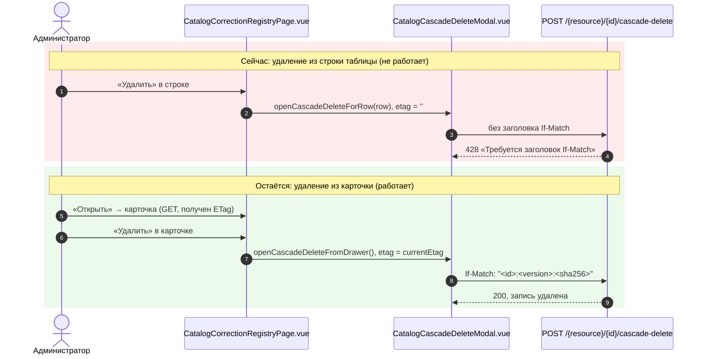

# Bugfix: Убрать нерабочую кнопку «Удалить» из строк реестра «Управление каталогом» (ошибка «Требуется заголовок If-Match»)

- **Дата и время создания:** 2026-09-24 16:15:06 MSK (UTC+3)
- **Связь с Bitrix24:** отсутствует (внутренняя задача)
- **Тип задачи:** `bugfix`
- **Ветка задачи:** `bugfix/se-catalog-row-delete-if-match`
- **Целевая ветка для MR:** `test`
- **Затронутые модули:** только фронтенд, `frontend/features/specialEquipment/management/correction/CatalogCorrectionRegistryPage.vue`

---

## 1. Схема взаимодействия



---

## 2. Постановка проблемы и диагностика

### Симптом
В разделе «Управление каталогом» (`/workspace/special-equipment-catalog`) на любой вкладке (Объявления, Категории, Марки, Модели, Модификации, Комплектации, Характеристики, Группы характеристик, Цвета) кнопка **«Удалить» в строке таблицы** открывает окно каскадного удаления. После ввода `УДАЛИТЬ` и нажатия «Удалить навсегда» окно показывает ошибку **«Требуется заголовок If-Match»**, и запись не удаляется.

Если открыть ту же запись через «Открыть» и нажать «Удалить» в карточке, удаление проходит успешно.

### Первопричина
1. `CatalogCorrectionRegistryPage.vue`, `openCascadeDeleteForRow` (~стр. 1669) открывает модалку с пустым ETag:
   ```ts
   deleteEntityEtag.value = ''
   ```
   Строки реестра ETag не содержат: сервер отдаёт ETag только в ответе `GET` одной записи.
2. `api.ts`, `cascadeDelete` отправляет `If-Match` только при непустом ETag:
   ```ts
   const headers = etag ? { 'If-Match': etag } : undefined
   ```
3. Бэкенд `presentation/routers/special_equipment_management.py`, `cascade_delete_resource`, вызывает `_expected_precondition(if_match, …)`, которая при отсутствии заголовка возвращает `428 «Требуется заголовок If-Match»`.
4. `openCascadeDeleteFromDrawer` (~стр. 1679) передаёт `currentEtag` открытой карточки, поэтому удаление из карточки работает.

### Принятое решение
Убрать кнопку «Удалить» из строк реестра и оставить удаление только в карточке записи. Бэкенд не меняется.

Причины выбора:
- минимальная правка без изменения API-контракта и без лишнего `GET` перед удалением;
- удаление необратимо, и дополнительный шаг через карточку снижает риск случайного удаления из таблицы;
- рабочий сценарий удаления уже есть и покрыт модалкой `CatalogCascadeDeleteModal` (предпросмотр каскада, блокировки, подтверждение `УДАЛИТЬ`, обработка `CASCADE_PREVIEW_STALE`).

> Отклонённая альтернатива, на будущее: сделать `If-Match` необязательным в `cascade_delete_resource`, поскольку команда `cascade_delete_entity` уже считает его опциональным, а от конкурентных изменений защищает `preview_token`. Если кнопку удаления понадобится вернуть в таблицу, делать это вместе с такой правкой бэкенда.

---

## 3. Требования к исправлению

Файл `frontend/features/specialEquipment/management/correction/CatalogCorrectionRegistryPage.vue`.

1. **Шаблон, блок действий строки** (`<div class="se-row-actions">`, ~стр. 204–208): удалить кнопку
   ```vue
   <button type="button" class="se-button se-button--ghost-danger se-button--small" :disabled="!canWrite || saving" @click="openCascadeDeleteForRow(row)">Удалить</button>
   ```
   В строке остаются:
   - «Деактивировать» / «Активировать» (только для вкладки «Цвета», без изменений);
   - «Открыть».
2. **Скрипт:** удалить неиспользуемую функцию `openCascadeDeleteForRow` (~стр. 1669–1677).
3. **Оставить без изменений:**
   - `CatalogCascadeDeleteModal` в шаблоне и все его пропсы;
   - `deleteModalOpen`, `deleteEntity`, `deleteEntityId`, `deleteEntityName`, `deleteEntityCode`, `deleteEntityEtag` (используются удалением из карточки);
   - `openCascadeDeleteFromDrawer` и обработчик `@delete="openCascadeDeleteFromDrawer"` у `CatalogCorrectionDrawer` (~стр. 241);
   - `onCascadeDeleted`;
   - `CatalogCascadeDeleteModal.vue`, `api.ts`, бэкенд.
4. **Вёрстка:** проверить, что колонка действий не «прыгает» и выравнивание строк не ломается после удаления кнопки: ширина колонки, `justify-content` у `.se-row-actions`. При необходимости подправить стили, не затрагивая остальные таблицы.
5. **Доступность удаления по правам:** в карточке кнопка «Удалить» по-прежнему показывается и блокируется по тем же условиям (`canWrite`, `saving`), что и раньше.

---

## 4. Тестирование

### Автотесты
1. Существующие тесты, проверенные на зависимость от кнопки в строке, продолжают проходить:
   - `frontend/tests/unit/specialEquipment/catalogCascadeDelete.spec.ts`: тестирует модалку и валидацию подтверждения, строку реестра не использует;
   - `frontend/tests/e2e/special-equipment/21940-catalog-corrections.spec.ts`, `21984-admin-catalog-completion.spec.ts`, `22098-v5-16.spec.ts`: кнопку «Удалить» в строке реестра не кликают. Совпадения по «Удалить» относятся к фильтрам, связям и проверке кнопки в карточке.
2. Добавить e2e-проверку в `frontend/tests/e2e/special-equipment/21940-catalog-corrections.spec.ts`:
   - в таблице реестра (например, вкладка «Цвета» и «Категории») в строках нет кнопки с ролью `button` и именем `Удалить` (`exact: true`);
   - сценарий «Открыть» → «Удалить» в карточке → ввести `УДАЛИТЬ` → «Удалить навсегда» завершается успешно: тост «Удалено записей: N», запись пропала из таблицы, счётчик вкладки уменьшился.

### Ручная проверка на стенде `test`
1. На каждой вкладке «Управления каталогом» в строках нет кнопки «Удалить».
2. Удаление цвета, категории и объявления через карточку проходит без ошибки «Требуется заголовок If-Match».
3. Для записи с блокирующими связями (например, объявление в заявке) карточка показывает блокировки в модалке, как раньше.
4. Под пользователем без прав записи кнопка «Удалить» в карточке недоступна, как раньше.

---

## 5. Критерии готовности (Definition of Done)

1. Кнопка «Удалить» отсутствует в строках реестра на всех вкладках «Управления каталогом».
2. Удаление из карточки записи работает для всех типов сущностей без ошибки `428`.
3. Функция `openCascadeDeleteForRow` удалена, неиспользуемого кода не осталось.
4. `bun run lint`, `bun run typecheck` (или `nuxi typecheck`), unit-тесты и e2e-набор `tests/e2e/special-equipment` зелёные.
5. Создан Merge Request в ветку `test` без ссылки на задачу Bitrix24.
