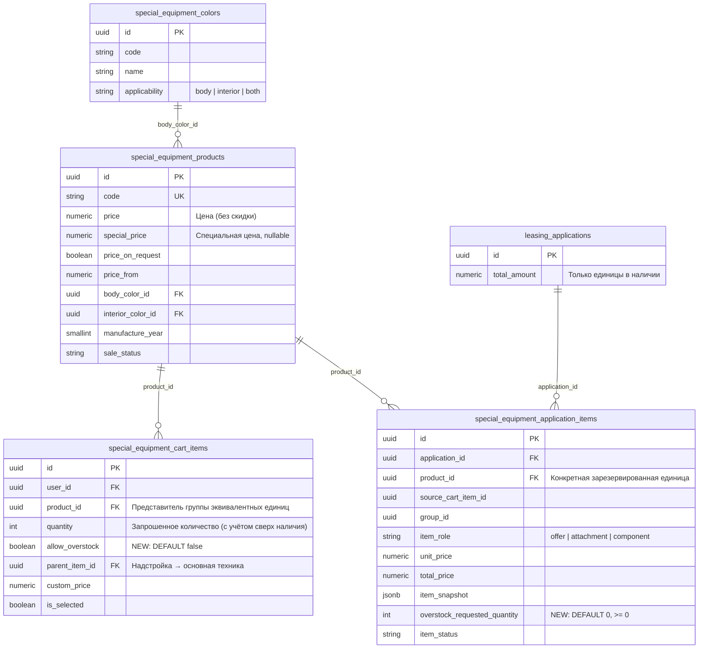

# Feature: Корзина спецтехники — цвет, скидка по специальной цене, «Применённые скидки», количество сверх наличия

- **Дата и время создания:** 2026-09-24 18:43:01 MSK (UTC+3)
- **Идентификатор задачи Bitrix24:** — (указать при заведении задачи)
- **Тип задачи:** `feature`
- **Ветка задачи:** `feature/se-cart-discount-color-overstock`
- **Целевая ветка для MR:** `test`
- **Затронутые модули:**
  - Backend:
    - `infrastructure/repositories/special_equipment_commerce_repository.py`
    - `application/special_equipment_commerce.py`
    - `application/special_equipment_checkout.py`
    - `application/commerce.py`
    - `application/commands/applications/create_draft.py`
    - `infrastructure/models/special_equipment_commerce.py`
    - `presentation/schemas/special_equipment_commerce.py`
    - `presentation/routers/special_equipment_commerce.py`
    - новая миграция `136`
    - уведомления о заявке
  - Frontend:
    - `pages/cart/index.vue`
    - `features/cart/components/CartItemCard.vue`
    - `features/specialEquipment/adapters/specialEquipmentCommerceCartLine.ts`
    - `features/specialEquipment/types.ts`
    - `features/specialEquipment/api/specialEquipmentCartApi.ts`
    - `features/specialEquipment/store/commerceShell.ts`
    - `features/specialEquipment/composables/commerceStorage.ts`
    - `features/commerce/cartProjection.ts`
    - `utils/vehicleDiscount.ts`
    - `features/commerce/components/CommerceApplicationItemsSummary.vue`
    - `features/applications/components/ApplicationDetailModal.vue`
    - PDF и email корзины

> **Область действия.** Все изменения касаются только позиций корзины типа `special_equipment`. Ветка старых автомобилей (`vehicle`, каталог выведен из эксплуатации миграцией `125`) визуально и логически не меняется.

---

## 1. Диаграмма сущностей (ERD)



---

## 2. Постановка задачи и текущее состояние

### 2.1. Требования заказчика
1. В карточке транспортного средства в корзине после года показывать **цвет кузова**.
2. Под строкой «год | цвет» показывать зелёный блок:
   - «Скидка: −1 150 000 ₽ (29%)» — разница между ценой и ценой со скидкой;
   - «Цена со скидкой: 2 881 000 ₽».
3. После поля «Количество ТС» — кликабельная строка «Указать больше доступного». После нажатия она меняется на «Ограничить наличием», и пользователь может ввести количество больше доступного на складе. Такой запрос должен корректно доходить до дилера.
4. В правом блоке после «Результат расчёта» показывать зелёный блок «Применённые скидки» с суммой скидок.

### 2.2. Что есть сейчас (диагностика)
- **Два типа позиций.** Корзина (`pages/cart/index.vue`) выводит позиции через `CartItemCard.vue`:
  - `vehicle` — старые автомобили. Для них уже есть строка «цвет | год», блок «Выгода / Цена без выгоды» (`getVehicleDiscountSummary`) и переключатель overstock (`v-if="item.ref.type === 'vehicle'"`);
  - `special_equipment` — все объявления из импорта каталога. Для них ничего из перечисленного не работает.
- **Цвет.** Бэкенд не отдаёт цвет в карточке товара корзины: `_PRODUCT_SELECT` и списочные SQL в `special_equipment_commerce_repository.py` не присоединяют `special_equipment_colors`.
- **Цены.** Бэкенд уже отдаёт в `CommerceProductCard` поля:
  - `price` = `COALESCE(special_price, price)` — фактическая цена;
  - `base_price` = цена без скидки;
  - `special_price`.

  Фронт в `specialEquipmentCommerceCartLine` читает только `price` и кладёт его в `base_price` линии. От этого значения считаются калькулятор (`commerceCartTotalAmount`) и заявка. **Калькулятор уже считает от цены со скидкой**, поэтому новые блоки скидок — только отображение, повторно из сумм ничего не вычитается.
- **Количество сверх наличия.** Для спецтехники бэкенд запрещает это в трёх местах:
  - `put_cart_item` и `patch_cart_item` (`application/special_equipment_commerce.py`) → `INSUFFICIENT_EQUIVALENT_PRODUCTS`;
  - `allocate_cart_items` (`application/special_equipment_checkout.py`) → `requested > available` даёт ошибку;
  - заявка создаёт по одной строке `special_equipment_application_items` на **каждую конкретную единицу** (с `product_id`, уникальность `(application_id, product_id)`).
- **Сценария для дилера нет.** Понятия «единица сверх наличия» в заявке нет. У старых автомобилей флаг `allow_overstock` проверялся при создании заявки, но в заявке не сохранялся, так что готового сценария нет и там.
- **Блок «Выгода» справа** под калькулятором считается по `cartStore.totalDiscount` (программы поддержки старых автомобилей). Для спецтехники он всегда скрыт.

### 2.3. Согласованные решения

| # | Вопрос | Решение |
|---|---|---|
| 1 | Какой цвет | Только цвет кузова. Формат «2025 \| Белый» (год, затем цвет) |
| 2 | Округление процента | До целого, `Math.round` (28,53% → 29%) |
| 3 | Суммы в блоке карточки | За 1 шт. |
| 4 | Своя цена дилера (`custom_price`) | Скидка = Цена − своя цена; «Цена со скидкой» = своя цена |
| 5 | «Применённые скидки» | Только общая сумма по выбранным позициям × количество в наличии |
| 6 | Старый блок «Выгода» | Оставить как есть, отдельным блоком ниже нового |
| 7 | PDF и письмо корзины | Добавить цвет, скидку, цену со скидкой, «Применённые скидки», пометку «сверх наличия» |
| 8 | Сверх наличия: объём | Полный цикл: корзина → лизинговая заявка → видимость у дилера |
| 9 | Представление в заявке | Резервы на доступные единицы (как сейчас) + отметка «Клиент запросил сверх наличия: N шт.» |
| 10 | Статус единиц сверх | **Всегда отклонены**: в заявку, резерв и расчёт не входят, дилеру показываются как информация о запросе. Действий у дилера нет |
| 11 | Где разрешено | Только лизинговая заявка. «Купить» / предзаказ блокируются с подсказкой |
| 12 | Какие позиции | Только основная техника (не надстройки), при наличии ≥ 1 единицы |
| 13 | Лимит | До **1000 шт.** на позицию. Доступно всем ролям, включая гостей |
| 14 | Расчёт | Калькулятор и сумма заявки считают только единицы в наличии |
| 15 | Кто видит «сверх наличия» | Дилер, клиент (в своей заявке), сотрудники CarCraft (админка). Лизинговые компании **не** видят |
| 16 | Уведомления | Строка о запросе сверх наличия добавляется в существующее уведомление дилеру о новой заявке. Отдельного уведомления клиенту нет |

---

## 3. Требования к реализации

### 3.1. Цвет кузова в карточке позиции (пункт 1)

**Backend**
1. В `_PRODUCT_SELECT` и двух списочных SQL-запросах `special_equipment_commerce_repository.py` (карточка товара в корзине, ~стр. 327 и ~стр. 438) добавить:
   ```sql
   LEFT JOIN special_equipment_colors AS body_color ON body_color.id = p.body_color_id
   ...
   body_color.id   AS body_color_id,
   body_color.name AS body_color_name,
   ```
   Цвет показывается даже для неактивного цвета (`is_active = false`): это исторический атрибут объявления.
2. В `_product_card` (`application/special_equipment_commerce.py`) добавить:
   ```python
   "body_color": (
       {"id": row["body_color_id"], "name": row["body_color_name"]}
       if row.get("body_color_id") and row.get("body_color_name")
       else None
   ),
   ```
3. В `CommerceProductCard` (`presentation/schemas/special_equipment_commerce.py`) добавить поле `body_color: CommerceDirectoryRef | None = None`. Поле необязательное, обратная совместимость API сохраняется. Карточка используется также в избранном: там поле просто появится и ни на что не повлияет.

**Frontend**
4. `features/specialEquipment/types.ts`, `SpecialEquipmentCommerceProduct`: добавить `body_color?: { id: UUID; name: string } | null`, а также `base_price?: SpecialEquipmentPrice` и `special_price?: SpecialEquipmentPrice` (для п. 3.2).
5. `specialEquipmentCommerceCartLine`: `color: product.body_color?.name ?? undefined`.
6. `CartItemCard.vue`, `colorYearLine`: для `special_equipment` порядок «год \| цвет». Для `vehicle` остаётся «цвет \| год».

   | Год | Цвет | Результат (`special_equipment`) |
   |---|---|---|
   | есть | есть | `2025 \| Белый` |
   | есть | нет | `2025` |
   | нет | есть | `Белый` |
   | нет | нет | `Спецтехника` (текущее поведение) |

### 3.2. Зелёный блок «Скидка / Цена со скидкой» в карточке (пункт 2)

**Frontend**
1. В `CommerceCartLine` (`features/commerce/cartProjection.ts`) добавить необязательное поле `list_price?: number | null` — цена без скидки.
2. В `specialEquipmentCommerceCartLine`:
   - `list_price: product.price_on_request ? null : finiteMoney(product.base_price)`;
   - `base_price` **не менять**: остаётся фактической ценой (`product.price`), от неё считаются калькулятор и заявка.
3. Новая функция `getCommerceLineDiscountSummary(line)` в `utils/vehicleDiscount.ts` (рядом с `getVehicleDiscountSummary`, которую не менять):
   ```ts
   // Фактическая цена: своя цена дилера → иначе цена, которую считает калькулятор
   const effective = finiteMoney(line.custom_price) ?? finiteMoney(line.base_price)
   const list = finiteMoney(line.list_price)
   // null, если: price_on_request, list/effective не заданы, <= 0, effective >= list
   // amount = list - effective; percent = Math.round(amount / list * 100)
   // возвращает { basePrice: list, discountedPrice: effective, amount, percent }
   ```
4. В `CartItemCard.vue` для `special_equipment` выводить блок в том же зелёном стиле, что и текущий «Выгода» (те же токены `--storefront-success-*`), сразу под строкой «год \| цвет»:
   ```
   Скидка: −1 150 000 ₽ (29%)
   Цена со скидкой: 2 881 000 ₽
   ```
   - суммы за 1 шт., формат через `formatPrice`;
   - блок скрыт, если функция вернула `null`;
   - для `vehicle` блок «Выгода / Цена без выгоды» остаётся без изменений.

### 3.3. Блок «Применённые скидки» в правой колонке (пункт 4)

**Frontend (`pages/cart/index.vue`)**
1. Вычисляемое значение:
   ```ts
   const appliedDiscountsTotal = computed(() =>
     selectedCommerceCartLines(unifiedCartItems.value)
       .filter(line => line.ref.type === 'special_equipment')
       .reduce((sum, line) => {
         const s = getCommerceLineDiscountSummary(line)
         return s ? sum + s.amount * commerceCartBillableQuantity(line) : sum
       }, 0))
   ```
   `commerceCartBillableQuantity` описан в п. 3.4.6: количество без единиц сверх наличия. Сложение ведётся в копейках по образцу `moneyMinorUnits`, чтобы не накапливать ошибку округления.
2. Разметка: новый блок **сразу после** `<CartCalculatorCartLeasingCalculator>` и **перед** существующим блоком «Выгода». Стиль — зелёный, как у «Выгоды».
   ```
   ✓ Применённые скидки
     −3 450 000 ₽
   ```
   Показывается, только если `appliedDiscountsTotal > 0`.
3. Существующий блок «Выгода» (`cartStore.totalDiscount`) не трогать.
4. Суммы калькулятора, `unifiedTotalAmount` и `calculatorAdditionalAmount` из-за скидок **не меняются**.

### 3.4. Количество сверх наличия (пункт 3)

#### 3.4.1. Миграция `136_se_cart_overstock.py`
```python
op.add_column("special_equipment_cart_items",
    sa.Column("allow_overstock", sa.Boolean(), nullable=False, server_default=sa.false()))
op.add_column("special_equipment_application_items",
    sa.Column("overstock_requested_quantity", sa.Integer(), nullable=False, server_default=sa.text("0")))
op.create_check_constraint("ck_se_application_items_overstock_qty",
    "special_equipment_application_items", "overstock_requested_quantity >= 0")
op.create_check_constraint("ck_se_cart_items_quantity_max",
    "special_equipment_cart_items", "quantity <= 1000")
```
- Перед созданием `ck_se_cart_items_quantity_max` миграция проверяет, что строк с `quantity > 1000` нет. Если есть, миграция падает с понятным сообщением: данные нужно исправить вручную.
- `downgrade()` удаляет ограничения и колонки.
- Добавить поля в модели `SpecialEquipmentCartItem` и `SpecialEquipmentApplicationItem`.
- `down_revision` — текущий head (проверить `test_alembic_revision_graph.py`, сейчас последняя ревизия `135`).

#### 3.4.2. Корзина — backend
1. `PutCartItemRequest` и схема PATCH позиции: необязательное поле `allow_overstock: bool | None`. В `PutCartItemCommand` и `patch_cart_item` добавить `allow_overstock` в `allowed`.
2. Новая константа `SPECIAL_EQUIPMENT_MAX_CART_QUANTITY = 1000` в `domain/special_equipment_commerce.py`.
3. Правила в `put_cart_item` и `patch_cart_item`:

   | Условие | Результат |
   |---|---|
   | `quantity < 1` или `quantity > 1000` | 422 `CART_QUANTITY_OUT_OF_RANGE` |
   | `allow_overstock = true` для надстройки (`parent_item_id` не NULL) | 422 `OVERSTOCK_NOT_ALLOWED_FOR_ATTACHMENT` |
   | `allow_overstock = true` и `available = 0` | 409 `INSUFFICIENT_EQUIVALENT_PRODUCTS` (как сейчас) |
   | `allow_overstock = true` и `available ≥ 1` | проверка `quantity ≤ available` **пропускается** |
   | `allow_overstock = false` и `quantity > available` | 409 `INSUFFICIENT_EQUIVALENT_PRODUCTS` (как сейчас) |

4. Выключение флага (`allow_overstock: false`) сервер выполняет вместе с урезанием `quantity` до `max(1, available)` в одной транзакции. Фронт тоже присылает урезанное количество, но сервер не полагается на это.
5. В ответе позиции корзины (`cart_item`) возвращается `allow_overstock`. `repo.put_cart_item`, `repo.patch_cart_item` и список корзины читают и пишут колонку.
6. При слиянии одинаковых позиций в `put_cart_item` флаг объединяется по «или», как в `cart_repository.py` старых автомобилей.

#### 3.4.3. Корзина — frontend
1. `SpecialEquipmentCartItem` (types): `allow_overstock?: boolean`. Адаптер: `allow_overstock: item.allow_overstock === true`.
2. `CartItemCard.vue`: показывать строку «Указать больше доступного / Ограничить наличием» для:
   - `vehicle` (как сейчас);
   - `special_equipment` без `parent_cart_id`, у которых `quantity_editable` и `available_count ≥ 1`.
3. `quantityMax`:
   - для `special_equipment` с `allow_overstock` = **1000** (не `2147483647`);
   - для `vehicle` без изменений.
4. Подсказка под полем при включённом флаге и `quantity > available_count`:
   > Сверх наличия: **N шт.** — дилер увидит запрос, в расчёт и заявку эти единицы не входят.

   Для `vehicle` текст «Количество сверх наличия согласует поставщик» остаётся.
5. `useSpecialEquipmentCommerce` / `commerceShell.ts`, метод изменения количества: передавать `allow_overstock` в PATCH.
6. Обработать ошибки `CART_QUANTITY_OUT_OF_RANGE` и `OVERSTOCK_NOT_ALLOWED_FOR_ATTACHMENT` тостом с текстом сервера и откатом значения поля (`onSettled`).
7. `unavailable_status` в адаптере: при `allow_overstock` и `available_count ≥ 1` значение `out_of_stock` **не ставится**. Иначе позиция выпала бы из `selectedCommerceCartLines`.

#### 3.4.4. Гостевая корзина
1. `features/specialEquipment/composables/commerceStorage.ts`: хранить `allow_overstock` в локальной записи гостевой позиции. Отсутствие поля в старых данных = `false`.
2. Лимит 1000 и правило «только основная техника» применяются и для гостя.
3. При переносе гостевой корзины в аккаунт (`transfer`) флаг передаётся в `PUT`. Если сервер вернул 409 `INSUFFICIENT_EQUIVALENT_PRODUCTS` из-за `available = 0`, позиция переносится с урезанным количеством по текущей логике ошибок переноса.

#### 3.4.5. Покупка и предзаказ
1. **Frontend.** Если среди выбранных позиций, подходящих для покупки, есть `special_equipment` с `allow_overstock && quantity > available_count`, кнопки «Купить» / «Предзаказ» недоступны с подсказкой:
   > Для покупки ограничьте количество наличием или оформите лизинговую заявку.
2. **Backend.** В `allocate_cart_items` добавить параметр `allow_overstock: bool = False` (п. 3.4.6). Покупка (`application/special_equipment_commerce.py`, ~стр. 1352) вызывает с `False`. Если у строки корзины `allow_overstock = true` и `quantity > available`, выбрасывать `CheckoutAllocationError` с кодом `OVERSTOCK_NOT_ALLOWED_FOR_PURCHASE` (409) и тем же текстом.

#### 3.4.6. Аллокация и лизинговая заявка — backend
1. `AllocatedCartLine`: новое поле `overstock_quantity: int = 0`.
2. `allocate_cart_items(..., allow_overstock: bool = False)`:
   ```python
   requested = int(row["quantity"])
   if allow_overstock and row.get("allow_overstock") and row.get("parent_item_id") is None:
       if group is None or available < 1:
           raise _availability_error(requested=requested, available=available)
       billable = min(requested, available)
       overstock = requested - billable
   else:
       if group is None or requested > available:
           raise _availability_error(requested=requested, available=available)
       billable, overstock = requested, 0
   ```
   Дальше резервируется ровно `billable` конкретных единиц (как сейчас резервировалось `requested`). В `AllocatedCartLine` записать `quantity=billable` и `overstock_quantity=overstock`.
3. Оба пути лизинговой заявки вызывают `allocate_cart_items(..., allow_overstock=True)`:
   - `application/commerce.py`, `_prepare_special_lines` (~стр. 1943);
   - `application/special_equipment_commerce.py`, `_create_cart_leasing_application` (~стр. 698).
4. В `_prepare_special_lines` проверку
   ```python
   if allocated_line.quantity != line.quantity:
   ```
   заменить на
   ```python
   if allocated_line.quantity + allocated_line.overstock_quantity != line.quantity:
   ```
   Аналогичную проверку в `_create_cart_leasing_application` (если есть) — так же.
5. `ApplicationSpecialEquipmentPayload` (`create_draft.py`): новое поле `overstock_requested_quantity: int = 0`. Для **первой** (по порядку резервирования) строки с `item_role = 'offer'` каждой позиции корзины значение = `allocated_line.overstock_quantity`, для остальных строк = 0. `repo.create_special_equipment_application_item` пишет колонку.
6. **Сумма заявки** и `_canonical_leasing_calculation` считаются только по зарезервированным единицам: логика уже строится по `allocation.cart_lines[*].products`, изменений не требуется. Проверить тестом (п. 4).
7. Калькулятор в корзине (`CartLeasingCalculator`, `unifiedTotalAmount`, `calculatorAdditionalAmount`) должен присылать суммы по тем же единицам, иначе серверная сверка снимка расчёта вернёт конфликт:
   - в `cartProjection.ts` новая функция `commerceCartBillableQuantity(line)`:
     - `special_equipment` с `allow_overstock` и известным `available_count` → `min(quantity, available_count)`;
     - иначе → `quantity`;
   - использовать её в `commerceCartLineTotal`, `commerceCartSelectedCount` («Выбрано транспортных средств») и в `appliedDiscountsTotal`;
   - в `commerceCartPurchaseSelections` не использовать: покупка со «сверх» заблокирована.
8. Позиция корзины после создания заявки удаляется, как сейчас (`delete_cart_items_by_ids`).

#### 3.4.7. Отображение в заявке (дилер, клиент, админка)
1. **Backend.** Во всех ответах, где отдаются строки `special_equipment_application_items` (детали заявки для клиента, дилера и сотрудника CarCraft), добавить поле `overstock_requested_quantity`.
2. **Для лизинговых компаний поле не отдаётся** (или всегда `0`). Проверить отдельным тестом приватности, по образцу `test_special_equipment_privacy_boundaries.py`.
3. **Frontend.** `CommerceApplicationItemsSummary.vue` и `ApplicationDetailModal.vue`: если `overstock_requested_quantity > 0`, под строкой позиции выводится информационная плашка в жёлтом warning-стиле:
   > Клиент запросил сверх наличия: **3 шт.** — не включено в заявку.
   - плашка видна ролям `client`, `dealer`, `distributor`, `carcraft_employee` и администраторам;
   - для `leasing_company` не выводится;
   - кнопок и действий нет.

#### 3.4.8. Уведомление дилеру
В существующее уведомление дилеру о новой лизинговой заявке (шаблон в `application/notifications/templates.py`, событие создания заявки) добавить блок для каждой позиции с `overstock_requested_quantity > 0`:
> Клиент запросил сверх наличия: {N} шт. по позиции «{Марка} {Модель} {Модификация}». Эти единицы не включены в заявку.

Если таких позиций нет, текст уведомления не меняется.

### 3.5. PDF и письмо корзины
В генерации PDF (`useCartPdf` / `downloadCartPdf`) и письма (`useCartEmail`, HTML в `pages/cart/index.vue`) для позиций `special_equipment`:
1. в строках деталей позиции добавить «Цвет: Белый» после «Год»;
2. если есть скидка: «Скидка: −1 150 000 ₽ (29%)» и «Цена со скидкой: 2 881 000 ₽»;
3. если есть сверх наличия: «Количество: 5 шт. (в наличии 2, сверх наличия 3 — не входят в расчёт)»;
4. в итоговый блок: «Применённые скидки: −3 450 000 ₽», если сумма > 0;
5. HTML письма экранируется существующей `escapeHtml`.

---

## 4. Проверка безопасности изменений и тестирование

### 4.1. Инварианты, которые не должны нарушиться
| Инвариант | Как обеспечено | Тест |
|---|---|---|
| Суммы калькулятора и заявки для позиций **без** «сверх» не меняются | `base_price` линии не меняется, скидка только отображается | unit: `commerceCartTotalAmount` до/после на фикстурах; backend: сумма заявки равна старой |
| Скидка не вычитается дважды | «Применённые скидки» не передаются в калькулятор | unit + e2e: итог калькулятора = Σ(цена со скидкой × кол-во) |
| Единицы сверх наличия не резервируют товар и не создают строк без `product_id` | `allocate_cart_items` резервирует `billable` | backend: 5 шт. при 2 в наличии → 2 строки заявки, 2 зарезервированных товара |
| Покупка со «сверх» невозможна | фронт-блокировка + `OVERSTOCK_NOT_ALLOWED_FOR_PURCHASE` | backend + e2e |
| Надстройки не получают «сверх» | проверка в cart API и аллокации | backend |
| Лизинговые компании не видят «сверх» | фильтр в ответе | тест приватности |
| Старые клиенты API работают | все новые поля необязательные, колонки с DEFAULT | контрактные тесты схем |
| Ветка `vehicle` не меняется | условия по `ref.type` | существующие тесты корзины |
| Цена по запросу («только одна единица») | `commerceCartManualLeasingError` смотрит на `root.quantity`: для такой позиции «сверх» бессмысленно, кнопка скрыта при `price_known === false` | unit |

### 4.2. Backend-тесты (`backend/tests/`)
Файлы: `test_special_equipment_receipts.py`, `test_commerce.py`, `test_application_commerce_projection.py` или новый `test_special_equipment_cart_overstock.py`.
1. `body_color` приходит в карточке корзины; `None`, если цвет не задан.
2. PUT/PATCH:
   - `quantity=5` при `available=2` без флага → 409;
   - с флагом → 200;
   - `quantity=1001` → 422;
   - флаг для надстройки → 422;
   - флаг при `available=0` → 409;
   - выключение флага урезает количество.
3. `allocate_cart_items(allow_overstock=True)`:
   - `billable=2`, `overstock=3`;
   - при `allow_overstock=False` и флаге в строке → `OVERSTOCK_NOT_ALLOWED_FOR_PURCHASE`.
4. Лизинговая заявка через оба пути:
   - 2 строки `special_equipment_application_items`;
   - у первой строки `overstock_requested_quantity=3`, у второй `0`;
   - `total_amount` = 2 × цена;
   - канонический расчёт совпадает.
5. Покупка/предзаказ с флагом → 409; без флага → как раньше.
6. Ответ заявки: поле есть у клиента, дилера и админа; нет или `0` у ЛК.
7. Уведомление дилеру содержит строку «сверх наличия», когда `N > 0`, и не меняется при `N = 0`.
8. Миграция: `alembic upgrade head`, `downgrade -1`, `upgrade head`, `alembic check`; `test_alembic_revision_graph.py` зелёный.

### 4.3. Frontend unit (`frontend/tests/unit/`)
1. `getCommerceLineDiscountSummary`:
   - 4 031 000 / 2 881 000 → 1 150 000, 29%;
   - `custom_price` имеет приоритет;
   - `price_on_request` → null;
   - нет скидки → null;
   - `custom_price` ≥ цены → null.
2. `commerceCartBillableQuantity`, `commerceCartLineTotal`, `commerceCartSelectedCount` с флагом и без.
3. `colorYearLine` для `special_equipment` и `vehicle`.
4. Адаптер `specialEquipmentCommerceCartLine`:
   - `list_price`, `color`, `allow_overstock`;
   - `unavailable_status` не `out_of_stock` при флаге.

### 4.4. E2E (`frontend/tests/e2e/special-equipment/`)
Новый файл `se-cart-discount-overstock.spec.ts`:
1. **Карточка:** «2025 | Белый», блок «Скидка: −1 150 000 ₽ (29%)» и «Цена со скидкой: 2 881 000 ₽».
2. **Правая колонка:** «Применённые скидки» = скидка × количество в наличии. Итог калькулятора не изменился относительно суммы по ценам со скидкой.
3. **Сверх наличия:**
   - включить «Указать больше доступного», ввести 5 при 2 в наличии;
   - видна подсказка «Сверх наличия: 3 шт.»;
   - «Купить» недоступна;
   - «Получить специальное предложение» создаёт заявку;
   - в карточке заявки у клиента и у дилера плашка «Клиент запросил сверх наличия: 3 шт.».
4. **«Ограничить наличием»** возвращает количество к 2, подсказка исчезает.
5. **Гость:** флаг сохраняется после перезагрузки страницы и переносится после входа.

---

## 5. Порядок выполнения
1. Миграция `136` и модели.
2. Backend: цвет в карточке → cart API (флаг, лимиты) → `allocate_cart_items` → оба пути лизинговой заявки → покупка → ответы заявки и приватность → уведомление. Тесты на каждом шаге.
3. Frontend: типы и адаптер → `vehicleDiscount.ts` / `cartProjection.ts` → `CartItemCard.vue` (цвет, скидка, overstock) → `pages/cart/index.vue` («Применённые скидки», блокировка покупки) → гостевая корзина → карточки заявки → PDF и письмо.
4. E2E и ручная проверка на стенде `test` на данных импорта FAW (4 031 000 / 2 881 000).

---

## 6. Критерии готовности (Definition of Done)
1. В карточке позиции спецтехники выводится «год | цвет кузова».
2. Зелёный блок «Скидка: −X ₽ (Y%)» / «Цена со скидкой: Z ₽» показывается за 1 шт. по правилам п. 3.2 и скрывается, когда скидки нет.
3. В правой колонке сразу после калькулятора выводится «Применённые скидки» с общей суммой по выбранным позициям. Блок «Выгода» сохранён.
4. Для основной спецтехники с наличием ≥ 1 работает переключатель «Указать больше доступного / Ограничить наличием», лимит 1000 шт.
5. Лизинговая заявка создаётся на доступное количество. Запрос сверх наличия сохраняется и виден клиенту, дилеру и админке, не виден ЛК. Дилер получает уведомление с этой строкой.
6. Покупка и предзаказ со «сверх» блокируются на фронте и бэкенде.
7. Калькулятор, сумма заявки и канонический расчёт считают только единицы в наличии. Для позиций без «сверх» суммы идентичны текущим.
8. PDF и письмо корзины содержат цвет, скидку, «Применённые скидки» и пометку «сверх наличия».
9. Миграция применяется и откатывается; `alembic check` чистый.
10. `ruff`, `lint-imports`, `mypy`, backend-тесты, фронтенд `lint` / `typecheck`, unit-тесты и e2e `tests/e2e/special-equipment` зелёные.
11. Создан Merge Request в ветку `test` со ссылкой на задачу Bitrix24.
