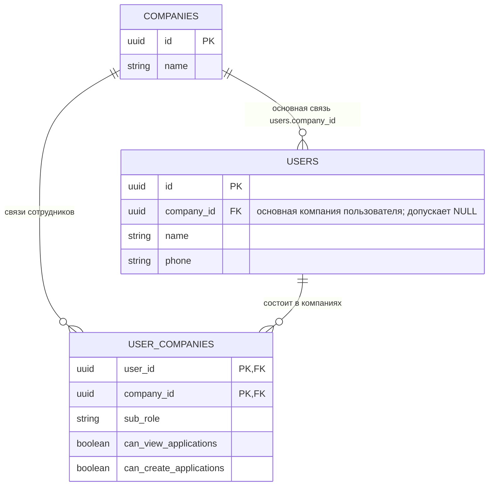

# Задача №22326 — отображение сотрудников в карточке компании

- **Задача Bitrix:** https://carcraftpro.bitrix24.ru/workgroups/group/124/tasks/task/view/22326/
- **Ветка:** `bugfix/22326`
- **Тип изменения:** исправление чтения состава компании без изменения схемы БД, приглашения сотрудников или прав доступа.

## Постановка

В списке пользователей компании «Технотемп» видны несколько активных пользователей с ролью «Дилер». Однако в карточке этой компании, в секции «Сотрудники компании», выводится «Сотрудники не найдены».

Симптом воспроизводится и из учётной записи компании: после добавления сотрудника он не появляется в её профиле.

## Текущее поведение и подтверждённая причина

- Приглашение сотрудника через `POST /api/v1/users/me/companies/{company_id}/invite` создаёт или сохраняет связь `(user_id, company_id)` в `user_companies`.
- Экран `CompanyMembersPanel.vue` после успешного приглашения повторно запрашивает `GET /api/v1/users/me/companies/{company_id}/members`.
- Обработчик списка сотрудников выбирает только строки из `user_companies`.
- В общем списке пользователей есть сотрудники, привязанные к компании через основное поле `users.company_id`. Такие пользователи не имеют строки в `user_companies` и поэтому не попадают в карточку компании, несмотря на принадлежность компании.

## Цель и бизнес-результат

Карточка компании и профиль компании должны показывать полный фактический состав сотрудников независимо от способа существующей привязки. Это позволяет администратору компании видеть и управлять сотрудниками без ложного пустого состояния, а сотруднику — убедиться, что он добавлен в компанию.

## Границы задачи

Входит:

- вывод сотрудников, связанных с компанией через `user_companies`;
- вывод сотрудников, у которых `users.company_id` равен идентификатору компании;
- корректное объединение одного пользователя, если он присутствует в обоих источниках;
- отображение в карточке компании для сотрудника CarCraft и для пользователя, имеющего доступ к профилю компании.

Не входит:

- изменение модели данных или миграции;
- изменение процесса приглашения, SMS, ролей и разрешений;
- изменение прав на просмотр, редактирование или удаление сотрудников;
- автоматическое создание отсутствующих исторических строк `user_companies`.

## Выбранный подход

Исправить серверный запрос `handle_list_company_members`: формировать список из объединения двух источников связей.

Для пользователя, имеющего строку `user_companies`, использовать её `sub_role` и флаги разрешений. Для пользователя, присутствующего только через `users.company_id`, возвращать существующую совместимую роль `administrator` с полными разрешениями — так же, как существующая логика доступа для первичной связи.

### Риски и защита

- **Дубликаты:** пользователь может одновременно иметь `users.company_id` и строку `user_companies` для одной компании. Запрос должен возвращать одну строку на пользователя; данные `user_companies` имеют приоритет как более точные.
- **Снижение прав:** нельзя возвращать пустые права для исторической основной связи, иначе UI может показать неверные disabled-состояния. Используются действующие fallback-правила первичной связи.
- **Раскрытие данных:** проверка доступа актёра к компании остаётся до выполнения выборки и не меняется.

## Планируемые изменения

1. В `backend/application/commands/employees.py` изменить `handle_list_company_members`:
   - сохранить существующую проверку доступа;
   - выбрать пользователей по `users.company_id == company_id` и по `user_companies.company_id == company_id`;
   - устранить дубликаты по `users.id`;
   - при наличии строки `user_companies` использовать её саб-роль и права;
   - для связи только через `users.company_id` вернуть `administrator`, `can_view_applications=true`, `can_create_applications=true`;
   - сохранить сортировку и текущую форму ответа API.
2. В `backend/tests/test_employee_sub_roles.py` добавить регрессии:
   - сотрудник только с `users.company_id` виден в списке;
   - пользователь, присутствующий в обоих источниках, возвращается один раз с параметрами из `user_companies`;
   - приглашённый через существующий сценарий сотрудник по-прежнему виден;
   - чужой пользователь не получает доступ к списку.
3. При необходимости обновить существующий E2E-сценарий компаний или добавить узкий desktop-сценарий: открыть карточку компании с сотрудником, привязанным через основную связь, и подтвердить строку сотрудника вместо текста «Сотрудники не найдены».

## Критерии готовности

- Если у пользователя `users.company_id` указывает на компанию, этот пользователь показывается в «Сотрудниках компании» её карточки.
- Если пользователь добавлен приглашением и связан через `user_companies`, он показывается в том же списке после обновления карточки.
- Если пользователь связан обоими способами, в списке ровно одна его строка; роль и права соответствуют `user_companies`.
- В карточке компании «Технотемп» не отображается ложное «Сотрудники не найдены», когда у компании есть связанные пользователи.
- Из профиля компании под её учётной записью список отображает тех же доступных сотрудников.
- Нельзя получить список сотрудников чужой компании: текущий ответ `403` сохраняется.
- API-формат, приглашение сотрудников, редактирование ролей и прав не меняются.
- Изменение проверено целевым E2E/браузерным сценарием в desktop viewport, статическими проверками backend и проверкой Alembic без новых операций.

## Вопросы

Блокирующих вопросов нет. Допущение: правило применяется ко всем типам компаний, потому что хранение `users.company_id` и экран карточки компании являются общими; это соответствует заявленному требованию «в карточке компании» без ограничения на роль.
