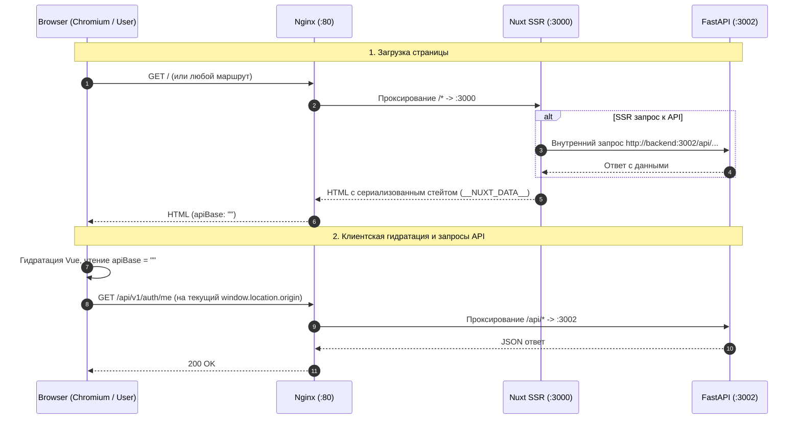

# Инфраструктурные и архитектурные решения запуска E2E-тестов: относительный базовый URL API

> Задача: устранить сетевые проблемы маршрутизации при запуске браузерных E2E-тестов в Docker-окружении путём перевода `NUXT_PUBLIC_API_BASE` на относительный URL (Same-Origin pattern).

**Идентификатор:** `e2e-infra-routing`

**Ветка:** `chore/e2e-infra-routing` от актуального `origin/test`.

## Текущее поведение

- В `docker-compose.yml` в блоке `x-public_url-env` задано `NUXT_PUBLIC_API_BASE: http://localhost`.
- В `frontend/nuxt.config.ts` значение по умолчанию вычисляется как `process.env.NUXT_PUBLIC_API_BASE || 'http://localhost:80'`. Из-за оператора `||` пустая строка `""` расценивается как falsy и заменяется дефолтным `http://localhost:80`.
- При открытии сайта браузером с хост-машины запросы на `http://localhost:80` работают, так как порт 80 Nginx проброшен на хост.
- При запуске Playwright/Chromium внутри Docker-контейнера `frontend` (или в изолированных тестовых сетях) для Chromium адрес `localhost` указывает на loopback (`127.0.0.1`) самого контейнера `frontend`. Порт 80 внутри этого контейнера не слушается (Nuxt слушает порт 3000), из-за чего клиентские запросы падают с ошибкой `ECONNREFUSED 127.0.0.1:80`.
- Для обхода этой проблемы приходилось запускать локальные forwarder-прокси `127.0.0.1:80 -> nginx:80` либо жестко перенастраивать порты под каждый тестовый раннер.

## Желаемое поведение

1. `NUXT_PUBLIC_API_BASE` по умолчанию равен пустой строке `""`.
2. В браузере (на клиенте) все вызовы API используют относительные пути, автоматически отправляя запросы на текущий `window.location.origin`:
   - На хосте разработчика: запросы идут на `http://localhost/api/...`.
   - Внутри Docker/Playwright: запросы идут на `http://nginx/api/...` (или порт Nginx тестового окружения).
   - На тестовом стенде / проде: запросы идут на соответствующий домен origin.
3. При SSR на сервере Nuxt вызовы API продолжают идти напрямую к внутреннему бэкенду (`http://backend:3002`) через существующую логику `resolveApiBase` в `frontend/utils/apiBase.ts`.
4. Устраняется необходимость в каких-либо forwarder-процессах или костылях в `/etc/hosts`.

## Зачем это нужно

- Устранение расхождения сетевой маршрутизации между локальной разработкой на хосте, E2E-тестами в Docker и стендами CI/CD.
- Соответствие архитектурному паттерну Same-Origin: веб-приложение, работающее за реверс-прокси Nginx, не должно хардкодить внешний сетевой адрес API на этапе сборки/запуска фронтенда.

## Планируемые изменения (Этап 1: Относительный базовый URL)

1. В `frontend/nuxt.config.ts` изменить инициализацию `publicApiBase`:
   - Использовать оператор `??` вместо `||`: `process.env.NUXT_PUBLIC_API_BASE ?? ''`, чтобы пустая строка передавалась в runtime-конфиг как `""`.
2. В `docker-compose.yml`:
   - В секции `x-public_url-env` установить `NUXT_PUBLIC_API_BASE: ""`.
3. Проверить все потребители `config.public.apiBase` во фронтенде:
   - Убедиться, что при пустом `apiBase` относительные ссылки, интерполяции путей и скачивание файлов корректно формируют пути `/api/v1/...`.
4. Проверить сборку фронтенда `bun run build:frontend`.

## Критерии готовности

- В `nuxt.config.ts` дефолт `public.apiBase` равен `""`.
- В `docker-compose.yml` задано `NUXT_PUBLIC_API_BASE: ""`.
- Клиентский код при пустом `apiBase` обращается к эндпоинтам `/api/...` относительно текущего origin.
- Серверный SSR через `resolveApiBase` корректно разрешает `DOCKER_API_BASE` (`http://backend:3002`).
- Сборка фронтенда `bun run build:frontend` проходит без ошибок TypeScript и сборщика.
- Отсутствуют новые ошибки линтеров.
