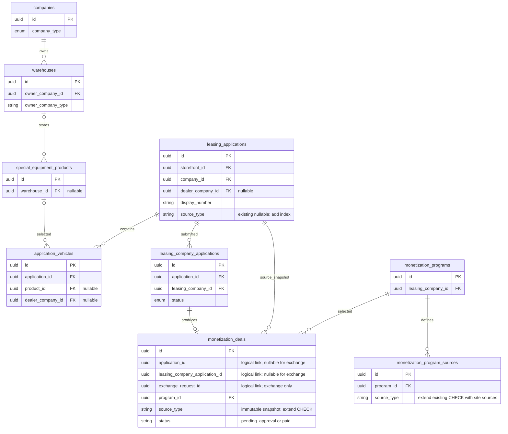

# Задача 22320 Источник заявки по сайту создания

- Задача: https://carcraftpro.bitrix24.ru/workgroups/group/124/tasks/task/view/22320/
- Ветка: feature/22320; база: test, fa0c267d.
- Создано: 2026-09-27 12:18:15 MSK.
- Источники: «Разработка по ТЗ №19. Тип заявки.docx»; ТЗ №17 «Монетизация» применяется только в части, не изменённой новым ТЗ.
- Согласование: требования и спорные трактовки разобраны с пользователем; пользователь разрешил реализацию сообщением «Можешь приступать к реализации если вопросов нет». Эта спецификация фиксирует согласованное поведение и технические изменения, необходимые в актуальном коде.
- Статус: реализация; техническое review backend/frontend/E2E выполнено, блокирующих замечаний нет.



ERD основана на текущих ORM-моделях applications.py, vehicles.py, companies.py,
special_equipment.py и monetization.py. Новых таблиц/колонок нет. Существующие
NULL источники сохраняются: миграция 121 намеренно не выполняла исторический
backfill и защищает source_type триггером от любых изменений. Добавляется индекс
idx_leasing_applications_source_type; существующие ограничения источников
монетизации расширяются для dealer_site и distributor_site. Nullable-контракт
исторических заявок не меняется.

```mermaid
sequenceDiagram
    actor User as Пользователь
    participant UI as Основная платформа или витрина
    participant API as FastAPI
    participant DB as PostgreSQL
    participant LC as Лизинговая компания
    participant M as Монетизация
    User->>UI: Создать заявку из выбранных товаров
    UI->>API: POST существующего создания или черновика, source_type
    alt platform
        API->>API: Зафиксировать platform независимо от роли и склада
    else dealer_site или distributor_site
        API->>DB: Склад первого товара, владелец, роль компании
        alt источник удалось определить
            API->>API: dealer_site или distributor_site по владельцу
        else нет однозначного владельца или склада
            API-->>UI: Ошибка валидации без создания заявки
        end
    end
    API->>DB: Создать заявку с неизменяемым источником
    API-->>UI: Существующий номер; source_type только не клиенту
    User->>UI: Список, поиск, фильтр
    UI->>API: GET с поиском и CSV источников
    API->>DB: Существующая видимость AND фильтры
    API-->>UI: Только доступные заявки
    UI->>UI: Бейдж и AP/ADE/ADI для разрешённых ролей
    LC->>API: LeasingCompanyApplication переходит в deal
    API->>M: Существующий триггер расчёта
    M->>DB: Источник исходной заявки, подходящие условия
    M->>DB: Сделка с копией source_type
    Note over API,DB: Изменение состава, дилера и статуса не изменяет source_type
```

## Постановка

Автоматически различать новые заявки основной платформы, сайта дилера и сайта
дистрибьютора; показывать и фильтровать источник в кабинетах участников, добавлять
префиксы отображаемого номера и подключить источники сайтов к существующей
монетизации. Поддержать реальные пути текущего интерфейса, включая создание
черновика, commerce и special-equipment checkout.

## Согласованные требования

1. Новый основной сценарий передаёт platform с основной платформы и dealer_site с
   витрины. API принимает также distributor_site. Для обоих значений сайтов
   источник определяется по складу первого фактически включённого в заявку товара, сохраняя исходный порядок позиций запроса:
   компания-дилер — dealer_site, компания-дистрибьютор — distributor_site.
   platform не пересчитывается ни по роли автора, ни по складу.
2. Источник сохраняется при первоначальном INSERT, включая создание черновика;
   дальнейшие изменения заявки не меняют его. Для сайта без определимого склада
   нельзя молча подставлять platform или прежний источник по роли автора:
   вернуть понятную ошибку валидации. В существующих сценариях без конкретного
   товара использовать только реально переданный/определённый склад; не
   угадывать владельца по марке.
3. Заявка из нескольких складов остаётся единой; источник один, определяется
   первым товаром. Существующие права всех затронутых дилеров сохраняются.
   Разделение заявок и новое распределение монетизации по товарам не входят в задачу.
4. Существующие dealer_account, exchange и исторические NULL не переписываются.
   В новом основном сценарии platform имеет приоритет над прежним определением
   dealer_account по роли автора. Биржа остаётся отдельным потоком ExchangeRequest;
   обычные заявки exchange не создаются и в приёмке не требуются.
5. Для admin/carcraft_employee, leasing_company, distributor и dealer показывать
   источник иконкой с текстом в списке и карточке:
   platform — «Заявка с сайта платформы МЛ»;
   dealer_site — «Заявка с сайта дилера»;
   distributor_site — «Заявка с сайта дистрибьютора».
   Для клиента не показывать источник/префикс/фильтр и не возвращать source_type
   в ответах API заявок. Остальным историческим значениям новый бейдж не добавлять.
6. Добавить CSV мультифильтр source_type из трёх значений во всех затронутых
   кабинетах; применять внутри существующих ограничений видимости. Клиентский
   source_type фильтр игнорировать.
7. Существующий номер сохраняет свой формат и API-поля. В интерфейсе добавлять
   AP / ADE / ADI для трёх новых источников; клиенту оставлять базовый номер.
   Поиск использует существующий параметр и ищет номер с префиксом/без него,
   без учёта регистра и необязательного пробела; цифры нормализуются относительно
   разделителей существующего номера. Неверный префикс не находит заявку.
   Существующий поиск по другим поддержанным полям не ломать.
8. В создании условий монетизации разрешить dealer_site и distributor_site
   в UI, доменной валидации и БД. Обновить три названия, остальные названия и
   недоступность quick_deal_dealer/quick_deal_distributor/leasing_to_dealer/
   dealer_to_leasing сохранить.
9. Сохранить текущий алгоритм подбора и расчёта монетизации; источник копируется
   из заявки. Триггер обычного потока — LeasingCompanyApplication → deal,
   биржи — ExchangeRequest → deal. Статусы самой сделки монетизации не меняются.
   Не возвращать старые финансовые правила ТЗ №17 поверх действующей реализации.
10. После релиза старые заявки и сделки сохраняют источники; backfill не выполнять.
    UUID остаются UUID в Python и string на frontend. Только desktop viewport 768+.

## Планируемые изменения

- Backend приложений: schema/commands для всех фактических путей создания,
  общее определение источника по входу/складу, проекции ответа по роли,
  списки/карточки admin/dealer/distributor/leasing/client, CSV и поиск номера.
- Frontend: типизированный общий модуль источников, бейдж/фильтр/формат номера,
  source_type в checkout payload, применение во всех реальных role views.
- Монетизация: расширить SOURCES и два действующих CHECK, подключить обновлённые
  подписи и доступность вариантов в общем редакторе, сохранить существующий
  расчёт и ограничения доступа.
- БД: следующая Alembic-ревизия после 136; индекс source_type и расширение CHECK.
  ORM описывает ровно результат миграции.
- E2E: изолированное Docker окружение и целевые HTTP/Playwright сценарии 22320;
  существующие fixtures адаптировать только где новый обязательный контракт
  действительно используется. Unit/architecture tests не добавлять и не запускать.
- Выполнять независимые части backend/frontend/E2E подагентами; родитель отвечает
  за спецификацию, изменения монетизации и интеграцию. Перед коммитом независимое
  review Standards/Spec, исправление findings, MR только в test и merge после
  успешных проверок/review.

## Критерии готовности

- Реальные HTTP создания: platform на любом складе; dealer_site на дилерском;
  distributor_site на дистрибьюторском; прямой вход distributor_site также
  пересчитывается по складу. Проверены основной и используемые checkout/draft пути.
- Источник сохранён в БД и не меняется после редактирования состава/статуса,
  повторного запроса/idempotency и попытки явного изменения.
- В роли клиента source_type отсутствует в ответах создания/списка/карточки;
  бейдж/префикс/фильтр отсутствуют. Другие роли видят корректные подписи.
- Мультифильтр, обычный и префиксный поиск работают, неверный префикс не находит;
  фильтры не расширяют доступ к чужим заявкам.
- Условия обоих сайтов создаются, остальные заблокированные источники отклоняются;
  реальный переход LCA → deal использует соответствующий source_type.
- Старые dealer_account/exchange/NULL не переписаны; биржевой поток сохранён.
- Пройден целевой браузерный E2E при desktop viewport, проверены журналы сервисов.
- Docker приложение работает; ruff check . --fix, lint-imports и mypy выполнены;
  новые mypy ошибки в изменённых файлах отсутствуют. Frontend проверки по доступной
  конфигурации без новых ошибок TS в изменённых файлах.
- alembic upgrade head и alembic check успешны, вывод
  «No new upgrade operations detected.». git diff --check успешен.
- Единственный артефакт задачи — эта спецификация; результаты проверок и review
  фиксируются здесь и в MR. MR содержит ссылку Bitrix и направлен только в test.

## Ход выполнения и проверки

- Выполнен git pull --ff-only ветки test, создана feature/22320.
- Исходные пользовательские untracked файлы не изменяются.
- Окружение: host uv/bun отсутствуют; проверки выполнены в изолированном Docker
  окружении carcraft-22320-e2e. Внешние платёжные/SMS/email сервисы не вызываются.

- Техническое review уточнило: текущая schema-валидация CREATE использует HTTP 422 для отсутствующего/недопустимого source_type; доменная ошибка неопределимого склада витрины и неверного CSV-фильтра возвращает HTTP 400. Глобальный формат ошибок не меняется.
- Связи monetization_deals с исходными заявками логические: действующая ORM не создаёт FK на исходные заявки. Это сохраняет существующее поведение при удалении.
- Порядок первого товара берётся до внутренней сортировки товаров для блокировок БД.

- Изолированная БД applicationsources22320: цепочка миграций с нуля до 137 применена, alembic check завершён с кодом 0 и No new upgrade operations detected.

- Frontend: nuxi prepare и полная vue-tsc --noEmit -p tsconfig.json в Docker — exit 0. git diff --check -- frontend — exit 0. Unit/architecture tests не запускались.

- Существующие test command fixtures механически адаптированы к обязательному source_type. Новые unit/architecture tests не добавлялись и не запускались.

- Уточнение по реальному commerce allocation: representative товара в корзине может отличаться от фактически выделенного экземпляра. По ТЗ4.2 источник берётся из склада фактического первого автомобиля в составе заявки; порядок позиций запроса сохраняется, но склад representative не подменяет склад выделенного товара.

- Реальный браузерный E2E обнаружил существующие SQL500: потерю correlation вложенного складского подзапроса дистрибьютора и нетипизированный пустой массив images в клиентском favorites. Исправлены минимально в repository-слое (flat join с явной correlation и JSON literal), правила доступа и форма ответов сохраняются.
- Standards review основного diff и этих двух исправлений: 0 замечаний.
- Полный mypy: текущая ветка и fa0c267d имеют одинаковые 259 ошибок в одном образе; новых и устранённых сообщений 0. Ruff PASS, lint-imports 9/9 PASS.

- Spec review основного diff и двух SQL-исправлений: 0 замечаний. Проверены исходные требования ТЗ №19 и согласованные трактовки; ТЗ №17 использовано только как контекст.
- Финальные ruff check . --fix и lint-imports после SQL-исправлений: PASS, 9/9 контрактов. Полный mypy повторён: 259 ошибок совпадают с базовой веткой, новых сообщений 0.
- HTTP acceptance: PASS, 17 новых созданий и 2 исторические заявки. Проверены все четыре HTTP-пути создания, source_type/schema/auth/idempotency, исходный порядок и фактический склад, CSV/поиск/ACL четырёх ролей, отсутствие source_type у клиента, неизменность источника при изменении условий/товаров и прямом UPDATE.
- Реальные переходы LeasingCompanyApplication → deal для platform/dealer_site/distributor_site: PASS, ровно одна сделка монетизации на каждую заявку с соответствующими источником и программой. Недоступные future-источники по-прежнему отвергаются.

- Финальный запуск с полностью пустыми изолированными PostgreSQL/MinIO volumes:
  `bash scripts/e2e/22320/run.sh` — exit 0. Docker build, миграции 0→137,
  все 11 групп HTTP acceptance, три реальных LCA→deal и 9/9 Playwright —
  PASS. Браузер проверен при 1440 и 768 CSS px, pageerror: 0.
- UI checkout основного сайта отправляет platform; витрина отправляет dealer_site.
  Сервер на фактическом дистрибьюторском складе сохраняет distributor_site;
  клиентские CREATE/read не раскрывают source_type.
- Финальные alembic upgrade head и alembic check: PASS,
  No new upgrade operations detected.
- Визуальная проверка скриншотов списка/деталей администратора, мультифильтра
  дилера при 768 px и карточки монетизации: новые подписи, префиксы и фильтры
  читаются, перекрытий и обрезки нет.
- Журналы финального прогона: frontend/nginx без ошибок, новых backend 500
  и SQL exceptions нет. Ожидаемые 503 относятся к отключённым внешним
  accounting/sopd-signer-candidates в изолированном E2E окружении.
  Локальные артефакты: /tmp/carcraft-22320-e2e/services.log и browser-results/.
- Итоговый git diff --check: PASS. Оба независимых review: Standards 0 findings,
  Spec 0 findings.
