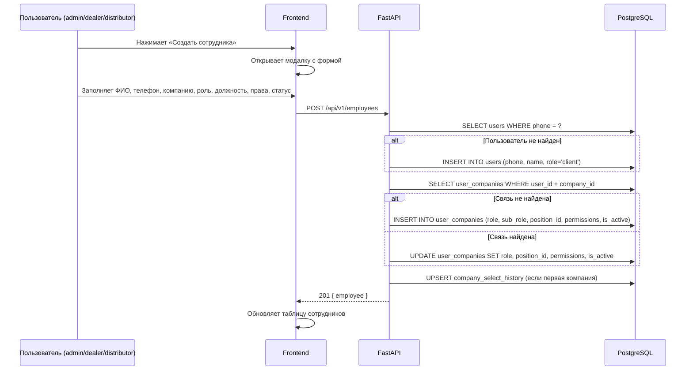
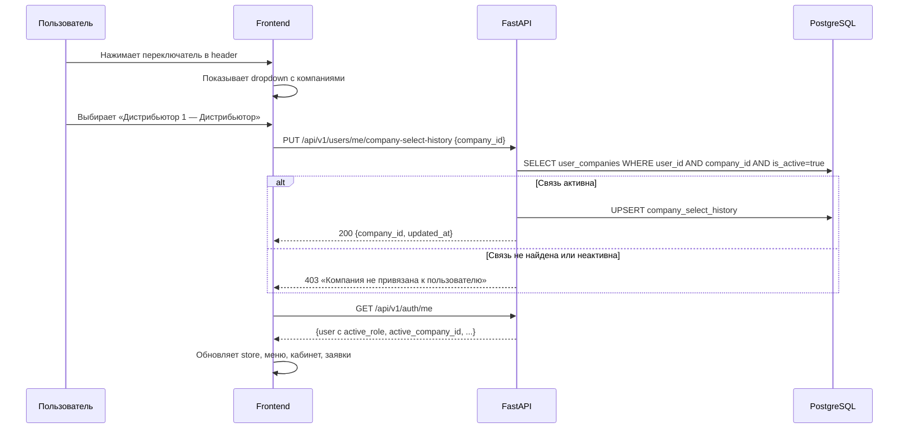

# Задача 21674 — Доработка раздела «Сотрудники», справочник должностей, мульти-компания

- **Bitrix:** https://carcraftpro.bitrix24.ru/company/personal/user/302/tasks/task/view/21674/
- **Ветка:** `feature/21674`
- **Источник:** ТЗ №30 v4 от 13.07.2026

---

## ER-диаграмма

```mermaid
erDiagram
    users {
        UUID id PK
        VARCHAR phone UK "не менять"
        VARCHAR name
        VARCHAR email
        user_role_enum role "global_role — остаётся"
        UUID company_id FK "legacy, сохраняется"
        BOOLEAN is_active
        TIMESTAMPTZ created_at
        TIMESTAMPTZ updated_at
    }

    companies {
        UUID id PK
        VARCHAR name
        VARCHAR inn UK
        company_type_enum company_type
        BOOLEAN is_active
        TIMESTAMPTZ created_at
        TIMESTAMPTZ updated_at
    }

    positions {
        UUID id PK "НОВАЯ ТАБЛИЦА"
        VARCHAR name "Название должности"
        VARCHAR code UK "Системный код: manager, supervisor"
        BOOLEAN is_active "soft-delete"
        TIMESTAMPTZ created_at
        TIMESTAMPTZ updated_at
    }

    user_companies {
        UUID user_id PK_FK
        UUID company_id PK_FK
        VARCHAR role "НОВОЕ: client/dealer/distributor/leasing_company"
        VARCHAR sub_role "существует: administrator/manager/employee"
        UUID position_id FK "НОВОЕ: FK → positions"
        BOOLEAN can_view_applications "существует"
        BOOLEAN can_create_applications "существует"
        BOOLEAN is_active "НОВОЕ: soft-deactivation сотрудника"
        TIMESTAMPTZ created_at "существует"
        TIMESTAMPTZ updated_at "НОВОЕ"
    }

    company_select_history {
        UUID user_id PK_FK
        UUID company_id FK
        TIMESTAMPTZ updated_at
    }

    distributor_dealer_links {
        UUID distributor_company_id PK_FK
        UUID dealer_company_id PK_FK_UK
    }

    dealer_groups {
        UUID id PK
        UUID distributor_id FK
        VARCHAR name
    }

    dealer_group_members {
        UUID id PK
        UUID dealer_group_id FK
        UUID dealer_company_id FK
    }

    users ||--o{ user_companies : "user_id"
    companies ||--o{ user_companies : "company_id"
    positions ||--o{ user_companies : "position_id"
    users ||--o| company_select_history : "user_id"
    companies ||--o{ company_select_history : "company_id"
    companies ||--o{ distributor_dealer_links : "distributor_company_id"
    companies ||--o{ distributor_dealer_links : "dealer_company_id"
    companies ||--o{ dealer_group_members : "dealer_company_id"
    dealer_groups ||--o{ dealer_group_members : "dealer_group_id"
```

## Диаграмма последовательности — создание сотрудника



## Диаграмма последовательности — переключение компании



---

## 1. Постановка

Доработать раздел «Сотрудники»: добавить справочник должностей, расширить таблицу `user_companies` бизнес-ролью и должностью, реализовать форму создания/редактирования сотрудника, переключатель активной компании в header, обогатить `/auth/me` контекстом активной компании, обеспечить фильтрацию заявок и правила создания заявок через активную компанию.

**Ключевое архитектурное решение:** `users.role` остаётся как `global_role`. Новое поле `user_companies.role` хранит бизнес-роль пользователя в конкретной компании (`active_role`). Для определения кабинета, прав и видимости используется `active_role`, а не `global_role`. Роль `carcraft_employee` продолжает определяться по `users.role` и не требует записей в `user_companies`.

---

## 2. Требования

### 2.1. Справочник должностей `positions`

#### 2.1.1. Таблица `positions`

| Поле | Тип | Обязательно | Описание |
|------|-----|-------------|----------|
| `id` | `UUID` | Да | PK, `uuid4` |
| `name` | `VARCHAR(255)` | Да | Название должности |
| `code` | `VARCHAR(100)` | Да | Системный код, UNIQUE |
| `is_active` | `BOOLEAN` | Да | `server_default=true` |
| `created_at` | `TIMESTAMPTZ` | Да | `server_default=now()` |
| `updated_at` | `TIMESTAMPTZ` | Да | `server_default=now()` |

Начальные данные (seed): `Менеджер` (`manager`), `Супервайзер` (`supervisor`).

#### 2.1.2. API

| Метод | Путь | Доступ | Описание |
|-------|------|--------|----------|
| `GET` | `/api/v1/positions` | `carcraft_employee` | Список должностей (включая неактивные) |
| `POST` | `/api/v1/positions` | `carcraft_employee` | Создание должности |
| `PUT` | `/api/v1/positions/{id}` | `carcraft_employee` | Редактирование должности |
| `PATCH` | `/api/v1/positions/{id}/deactivate` | `carcraft_employee` | Отключение: `is_active=false` |

Физическое удаление не предусмотрено. При редактировании `created_at` не менять.

#### 2.1.3. Frontend

- Вкладка «Справочник должностей» на странице «Сотрудники» — видна только `carcraft_employee`.
- Две вкладки: «Сотрудники компании» | «Справочник должностей».
- Таблица: Название, Код, Активность, Дата создания, Действия (Редактировать / Отключить).
- Кнопка «Создать должность» → модалка с полями: Название, Системный код, Активность (toggle).
- Редактирование — та же модалка с предзаполненными значениями.

### 2.2. Расширение таблицы `user_companies`

#### 2.2.1. Новые поля

| Поле | Тип | Обязательно | Default | Описание |
|------|-----|-------------|---------|----------|
| `role` | `VARCHAR(50)` | Да | `'client'` | Бизнес-роль в компании: `client` / `dealer` / `distributor` / `leasing_company` |
| `position_id` | `UUID FK→positions` | Нет | `NULL` | Должность из справочника |
| `is_active` | `BOOLEAN` | Да | `true` | Активность связи сотрудника с компанией |
| `updated_at` | `TIMESTAMPTZ` | Да | `now()` | Дата последнего изменения |

#### 2.2.2. Миграция существующих данных

Для каждой существующей записи в `user_companies`:
1. Получить `users.role` связанного пользователя.
2. Определить `role` по приоритету:
   - Если `users.role` ∈ {`dealer`, `distributor`, `leasing_company`} → `user_companies.role = users.role`.
   - Если `users.role = 'client'` → `user_companies.role = 'client'`.
   - Если `users.role = 'carcraft_employee'` → `user_companies.role = 'client'` (fallback, carcraft_employee определяется по `users.role`).
   - Если `users.role = 'external_api'` или NULL → `user_companies.role = 'client'`.
3. `is_active = true` для всех существующих записей.
4. `updated_at = now()` для всех.
5. `position_id = NULL` для всех.

#### 2.2.3. Уникальность

PK остаётся композитный `(user_id, company_id)`. Повторное добавление в компанию после деактивации — реактивация существующей строки (`is_active = true`), а не создание новой.

### 2.3. Сценарии создания записей в `user_companies`

#### 2.3.1. Регистрация нового пользователя с новой компанией

| Поле | Значение |
|------|----------|
| `role` | `client` |
| `sub_role` | `administrator` |
| `position_id` | `NULL` |
| `can_view_applications` | `true` |
| `can_create_applications` | `true` |
| `is_active` | `true` |

#### 2.3.2. Регистрация нового пользователя с существующей компанией

| Поле | Значение |
|------|----------|
| `role` | `client` |
| `sub_role` | `employee` |
| `position_id` | `NULL` |
| `can_view_applications` | `false` |
| `can_create_applications` | `false` |
| `is_active` | `true` |

#### 2.3.3. Регистрация существующего пользователя с новой/существующей компанией

Если запись `(user_id, company_id)` уже существует — дубль не создавать. Если не существует — создать по правилам 2.3.1 (новая компания) или 2.3.2 (существующая).

#### 2.3.4. Добавление сотрудника дилера / дистрибьютора через форму

| Поле | Значение |
|------|----------|
| `role` | `dealer` / `distributor` (из формы) |
| `sub_role` | Из формы или `employee` по умолчанию |
| `position_id` | Из формы (справочник должностей) |
| `can_view_applications` | Из формы |
| `can_create_applications` | Из формы |
| `is_active` | `true` |

### 2.4. Таблица сотрудников

#### 2.4.1. Фильтры

| Фильтр | Тип | Логика |
|--------|-----|--------|
| Компания | Dropdown | Пусто → все доступные. Выбрана → только сотрудники этой компании |
| Должность | Dropdown | Значения из справочника `positions` |
| ФИО | Текст | Поиск по `users.name` |
| Телефон | Текст | Поиск по `users.phone` |

Кнопки: «Применить», «Сбросить» (очищает все фильтры включая «Компания»).

#### 2.4.2. Колонки таблицы

| Колонка | Источник |
|---------|----------|
| ФИО | `users.name` |
| Телефон | `users.phone` |
| Компания | `companies.name` |
| Роль | `user_companies.role` |
| Должность | `positions.name` (через `user_companies.position_id`) |
| Просмотр заявок | `user_companies.can_view_applications` |
| Создание заявок | `user_companies.can_create_applications` |
| Статус | `user_companies.is_active` (Активен / Неактивен) |
| Действия | Редактировать / Отключить |

Таблица формируется из `user_companies`. Если один пользователь связан с несколькими компаниями — отдельная строка по каждой компании. Пагинация: 20 на странице.

#### 2.4.3. Правила видимости

| Роль текущего пользователя | Видимые записи |
|---------------------------|---------------|
| `carcraft_employee` (admin) | Все записи `user_companies` по всем компаниям |
| `dealer` | Записи `user_companies` где `company_id` = активная компания дилера |
| `distributor` | Записи своей компании + записи сотрудников дилеров, входящих в группы данного дистрибьютора (через `dealer_groups` → `dealer_group_members`). Дубли не показывать |
| `client` | Записи где `company_id` = активная компания клиента |
| `leasing_company` | Записи где `company_id` = активная компания ЛК |

#### 2.4.4. API списка сотрудников

Новый эндпоинт (заменяет/дополняет текущий `GET .../members`):

```
GET /api/v1/employees?company_id=&position_id=&name=&phone=&page=1&per_page=20
```

Возвращает записи `user_companies` JOIN `users` JOIN `companies` LEFT JOIN `positions`, отфильтрованные по правилам видимости 2.4.3.

### 2.5. Форма создания / редактирования сотрудника

#### 2.5.1. Поля формы

| Поле | Тип | Логика |
|------|-----|--------|
| ФИО | Текст, обязательное | ФИО сотрудника |
| Телефон | Текст, обязательное | Подсказка: «Если пользователь с таким телефоном уже есть, будет создана связь с компанией» |
| Компания | Dropdown, обязательное | По правилам 2.5.2 |
| Роль | Dropdown, обязательное | `client` / `dealer` / `distributor` / `leasing_company` |
| Должность | Dropdown, необязательное | Из справочника `positions`. Доступно только для ролей `dealer` / `distributor` |
| Просмотр заявок | Checkbox | `can_view_applications` |
| Создание заявок | Checkbox | `can_create_applications` |
| Статус | Toggle | Активен / Неактивен |

Кнопки: «Создать» (или «Сохранить» при редактировании) / «Отмена».

#### 2.5.2. Правила выбора компании

| Роль текущего пользователя | Доступные компании |
|---------------------------|-------------------|
| `carcraft_employee` | Все компании |
| `dealer` | Только активная компания дилера |
| `distributor` | Только активная компания дистрибьютора |
| `client` | Только активная компания клиента |
| `leasing_company` | Только активная компания ЛК |

Если `dealer` / `distributor` передаёт `company_id` чужой компании — backend возвращает 403.

#### 2.5.3. Правила редактирования

| Роль текущего пользователя | Логика |
|---------------------------|--------|
| `carcraft_employee` | Может редактировать все записи |
| `dealer` | Только записи своей активной компании |
| `distributor` | Только записи своей активной компании. Записи сотрудников дилеров из своих групп — **только просмотр** |
| `client` | Только записи своей активной компании |
| `leasing_company` | Только записи своей активной компании |

Для дистрибьютора записи сотрудников дилеров: скрыть / заблокировать «Редактировать», «Отключить», изменение прав, должности, роли. Backend дублирует проверку.

#### 2.5.4. API

```
POST /api/v1/employees          — создание
PUT  /api/v1/employees/{user_id}/{company_id}  — редактирование
```

Логика создания:
1. Проверить права доступа актора.
2. Найти пользователя по телефону в `users`.
3. Если не найден — создать запись в `users` с `role='client'`, `name` из формы.
4. Если найден — обновить `name` если передано.
5. Проверить `user_companies` по `(user_id, company_id)`.
6. Если связь не найдена — `INSERT`.
7. Если найдена — `UPDATE` (включая реактивацию).
8. Установить `role`, `sub_role`, `position_id`, `can_view_applications`, `can_create_applications`, `is_active`.
9. Если это первая компания пользователя — `UPSERT company_select_history`.

### 2.6. Переключатель активной компании

#### 2.6.1. Расположение

В header (правая часть верхней панели), рядом с иконкой уведомлений и профиля. Формат: `«Дилерский центр 1 — Дилер» ˅`

#### 2.6.2. Когда показывать

| Кол-во активных записей в `user_companies` | Поведение |
|---------------------------------------------|----------|
| 0 | Не отображать |
| 1 | Не отображать, использовать единственную запись как активную |
| > 1 | Отображать переключатель |

Показывать только записи с `user_companies.is_active = true`.

#### 2.6.3. Содержимое dropdown

Каждая строка: `{companies.name} — {user_companies.role (локализовано)}`. Текущая активная компания выделена галочкой.

Локализация ролей: `client` → «Клиент», `dealer` → «Дилер», `distributor` → «Дистрибьютор», `leasing_company` → «Лизинговая компания».

#### 2.6.4. Логика переключения

Существующие эндпоинты `PUT /api/v1/users/me/company-select-history` уже реализуют базовую логику. Дополнить проверкой `is_active`:

1. Получить `company_id` из запроса.
2. Проверить `user_companies` по `(user_id, company_id)`.
3. Если запись не найдена или `is_active = false` → 403.
4. Если найдена и активна → `UPSERT company_select_history`.
5. Frontend после переключения вызывает `GET /auth/me` и обновляет store, меню, заявки.

Без повторной авторизации.

#### 2.6.5. Обработка ошибок

- Если выбранная компания недоступна → не менять, показать ошибку, остаться в текущем контексте.
- Если активная компания деактивирована администратором:
  1. Исключить из переключателя.
  2. Найти другую активную запись в `user_companies`.
  3. Если есть → сделать активной.
  4. Если нет → показать сообщение «Нет доступных компаний / ролей».

#### 2.6.6. Frontend-компонент

Новый компонент `CompanySwitcher.vue` в header. Данные из `GET /api/v1/users/me/companies` (расширить ответ: добавить `role` из `user_companies`). Использует существующий composable `useCompanySelectHistory` с доработкой.

### 2.7. Доработка `/auth/me`

#### 2.7.1. Расширение ответа

Добавить поля к существующему `UserOut` (не ломать совместимость, все новые поля nullable):

| Новое поле | Тип | Описание |
|-----------|-----|----------|
| `active_role` | `string \| null` | `user_companies.role` активной компании |
| `active_company_id` | `string \| null` | ID активной компании |
| `active_company_name` | `string \| null` | Название активной компании |
| `position_id` | `string \| null` | ID должности в активной компании |
| `position_name` | `string \| null` | Название должности |
| `available_companies` | `array` | Список активных компаний пользователя с `role` |

Существующие поля (`role`, `company_id`, `sub_role`, `canViewApplications`, `canCreateApplications`) — сохраняются для обратной совместимости.

`role` остаётся = `users.role` (глобальная роль).
`active_role` = `user_companies.role` (роль в активной компании).

#### 2.7.2. Логика в `authenticate_access_token_with_db`

Дополнить текущую логику:
1. При загрузке `user_companies` для active_company — дополнительно загрузить `role`, `position_id`.
2. JOIN `positions` для `position_name`.
3. JOIN `companies` для `active_company_name`.
4. Загрузить `available_companies`: все записи `user_companies` с `is_active=true`, JOIN `companies`.
5. Проверка `is_active` при выборе активной компании — неактивные пропускать.

#### 2.7.3. Фронтенд

Обновить `AuthUser` interface в `frontend/features/auth/store/auth.ts`:
- Добавить `active_role`, `active_company_id`, `active_company_name`, `position_id`, `position_name`, `available_companies`.
- Для определения кабинета (computed `homeRoute`, `isDealer`, `isClient` и т.д.) — приоритет: `active_role` если есть, иначе `role` (fallback для `carcraft_employee` и пользователей без компаний).

### 2.8. Правила заявок при активной компании

#### 2.8.1. Отображение заявок

Списки заявок фильтруются по активной компании пользователя. Backend проверяет:
- Пользователь авторизован.
- Компания из `user_companies` существует и `is_active = true`.
- Пользователь имеет `can_view_applications = true` по активной записи.
- Заявка относится к активной компании или доступна по правилам.

При переключении активной компании — список заявок обновляется.

#### 2.8.2. Создание заявок

| active_role | Логика |
|-------------|--------|
| `client` | `company_id` заявки = активная компания клиента. `created_by` = текущий пользователь |
| `dealer` | Пользователь выбирает компанию клиента на первом шаге. `company_id` = компания клиента. `dealer_company_id` = активная компания дилера. `created_by` = текущий пользователь |
| `distributor` | Аналогично dealer. Привязка дистрибьютора — по текущей логике |

Если `can_create_applications = false` по активной записи `user_companies` → создание заявки недоступно.

### 2.9. Отключение сотрудника

- Отключение = `user_companies.is_active = false`. Физическое удаление строки не выполнять.
- Нельзя деактивировать `users.is_active` при отключении сотрудника одной компании.
- Если пользователь связан с несколькими компаниями — после отключения в одной сохраняет доступ к другим.
- Полная блокировка во всей системе — отдельно через `users.is_active = false`.

Текущий `DELETE .../members/{target_user_id}` заменить на `PATCH .../deactivate` (или новый `PATCH /api/v1/employees/{user_id}/{company_id}/deactivate`), который устанавливает `is_active = false`.

### 2.10. Раздел «Пользователи» (admin)

- Остаётся доступным только `carcraft_employee`.
- Отображает учётные записи из `users` — один пользователь = одна строка.
- Компании и роли выводить отдельным блоком из `user_companies` (expand / details).
- Не дублировать пользователя при наличии нескольких компаний.
- Права определяются полями `user_companies`, а не `users`.

---

## 3. Планируемые изменения

### 3.1. Backend

#### Миграция Alembic

1. Создать таблицу `positions` (UUID PK, name, code UNIQUE, is_active, created_at, updated_at).
2. Seed: `Менеджер` / `manager`, `Супервайзер` / `supervisor`.
3. Добавить в `user_companies`:
   - `role VARCHAR(50) NOT NULL DEFAULT 'client'`
   - `position_id UUID FK→positions.id ON DELETE SET NULL`
   - `is_active BOOLEAN NOT NULL DEFAULT true`
   - `updated_at TIMESTAMPTZ DEFAULT now()`
4. Backfill `user_companies.role` из `users.role` по правилам §2.2.2.
5. Индексы: `idx_user_companies_role`, `idx_user_companies_is_active`, `idx_user_companies_position_id`.

#### ORM-модели

- Новая модель `Position` в `backend/infrastructure/models/positions.py`.
- Расширить `UserCompany`: добавить `role`, `position_id`, `is_active`, `updated_at`.

#### Новые файлы

| Файл | Назначение |
|------|-----------|
| `infrastructure/models/positions.py` | ORM Position |
| `infrastructure/repositories/positions_repository.py` | CRUD positions |
| `presentation/routers/positions.py` | API /api/v1/positions |
| `presentation/schemas/positions.py` | Pydantic-схемы positions |
| `presentation/routers/employees.py` | API /api/v1/employees |
| `presentation/schemas/employees.py` | Pydantic-схемы employees |
| `application/commands/positions.py` | Handlers positions |
| `application/commands/employees_v2.py` | Handlers создания/редактирования сотрудников |
| `application/queries/employees.py` | Query handler списка сотрудников |

#### Изменяемые файлы

| Файл | Что менять |
|------|-----------|
| `infrastructure/models/users.py` | Расширить `UserCompany` |
| `application/authentication.py` | Обогатить `authenticate_access_token_with_db` новыми полями |
| `presentation/schemas/auth.py` | Расширить `UserOut` и `MeResponse` |
| `application/commands/auth.py` | В `handle_register` ставить `role` в `user_companies` |
| `application/commands/user_companies.py` | В `handle_set_company_select_history` проверять `is_active` |
| `application/queries/user_companies.py` | Фильтровать `is_active=true` |
| `application/commands/employees.py` | Обновить `_ensure_employee_link` — ставить `role`, `is_active` |
| `presentation/routers/users.py` | Обновить members endpoints с учётом `is_active` |

### 3.2. Frontend

#### Новые файлы

| Файл | Назначение |
|------|-----------|
| `features/employees/components/PositionsTab.vue` | Вкладка справочника должностей |
| `features/employees/components/PositionFormModal.vue` | Модалка создания/редактирования должности |
| `features/employees/components/EmployeesTab.vue` | Вкладка «Сотрудники компании» (новая) |
| `features/employees/components/EmployeeFormModal.vue` | Модалка создания/редактирования сотрудника |
| `features/employees/components/EmployeeFilters.vue` | Блок фильтров |
| `features/employees/api/employeesApi.ts` | API-клиент employees/positions |
| `features/layout/components/CompanySwitcher.vue` | Переключатель компании в header |

#### Изменяемые файлы

| Файл | Что менять |
|------|-----------|
| `pages/workspace/employees.vue` | Две вкладки: Сотрудники / Справочник должностей |
| `features/auth/store/auth.ts` | Расширить `AuthUser`, добавить `activeRole`, обновить computed |
| `features/auth/composables/useCompanySelectHistory.ts` | Добавить `role` в данные компаний |
| Layout workspace header | Встроить `CompanySwitcher.vue` |

---

## 4. Критерии готовности

### Backend
- [ ] Миграция Alembic: `positions` создана, `user_companies` расширена, данные backfilled
- [ ] `alembic check` → `No new upgrade operations detected`
- [ ] CRUD API `positions` работает, доступен только `carcraft_employee`
- [ ] API `employees` — список с фильтрами, правилами видимости, пагинацией
- [ ] API создания/редактирования сотрудника — с проверкой прав, поиском по телефону, upsert связи
- [ ] API деактивации сотрудника — `is_active = false` в `user_companies`
- [ ] `/auth/me` возвращает `active_role`, `active_company_id`, `active_company_name`, `position_id`, `position_name`, `available_companies`
- [ ] `PUT /company-select-history` проверяет `is_active` в `user_companies`
- [ ] Регистрация создаёт `user_companies.role` по правилам §2.3
- [ ] `ruff check`, `lint-imports`, `mypy` — зелёные

### Frontend
- [ ] Вкладка «Справочник должностей» для admin: таблица + CRUD через модалки
- [ ] Вкладка «Сотрудники компании»: таблица с фильтрами, пагинацией
- [ ] Модалка «Создать сотрудника»: все поля по макету
- [ ] Модалка «Редактировать сотрудника»: предзаполненные данные
- [ ] Кнопка «Отключить» — деактивация, не удаление
- [ ] Переключатель компании в header — dropdown, переключение без re-auth
- [ ] Auth store использует `active_role` для определения кабинета
- [ ] Правила видимости сотрудников по ролям (§2.4.3)
- [ ] Правила доступа формы (§2.5.2, §2.5.3)

### E2E-проверки
- [ ] Admin: создание/редактирование/отключение должности
- [ ] Admin: создание сотрудника для любой компании
- [ ] Dealer: видит только сотрудников своей компании, создаёт только для своей
- [ ] Distributor: видит своих + дилеров из групп (только просмотр чужих)
- [ ] Переключение компании: кабинет и заявки обновляются
- [ ] `/auth/me` возвращает расширенные поля
- [ ] Деактивация сотрудника: `is_active=false`, доступ к другим компаниям сохраняется
- [ ] Создание заявки учитывает активную компанию и `can_create_applications`
