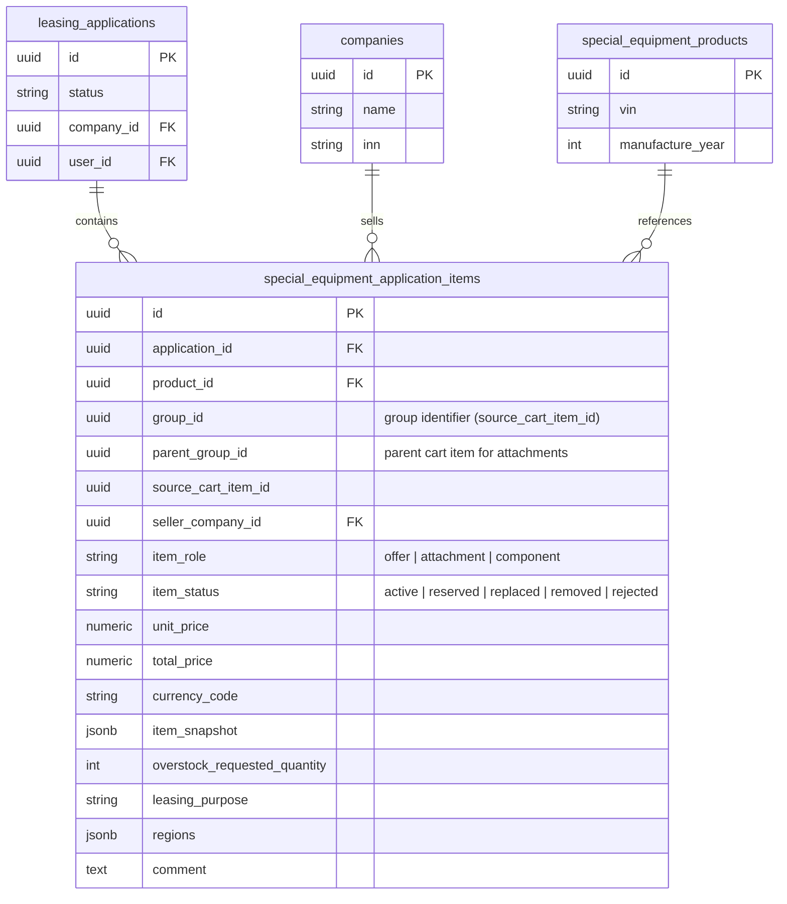

# Задача 22370 — ТС в заявке разворачиваются по количеству вместо группировки

- **Bitrix:** https://carcraftpro.bitrix24.ru/workgroups/group/124/tasks/task/view/22370/
- **Ветка:** `bugfix/22370`
- **Тип:** bugfix / регрессия

---

## Модель данных (ERD)



---

## Постановка

При создании лизинговой заявки из корзины ТС с quantity > 1 разворачиваются
в отдельные позиции по 1 шт. вместо отображения сгруппированными, как в корзине.

### Воспроизведение

1. Зайти под клиентом (+7-666-000-26-29).
2. Добавить ТС в корзину.
3. Указать количество больше, чем на складе (например, 2 ТС: 15 шт. и 8 шт.).
4. Нажать «Получить специальное предложение».
5. На следующем шаге нажать «Далее».

**Сейчас:** заявка содержит 23 отдельные позиции по 1 шт. каждая. Пользователь
вынужден выбирать цели приобретения и регионы для 23 ТС.

**Ожидается:** 2 позиции с количеством 15 и 8, как в корзине.

---

## Корневая причина

### Цепочка вызовов

```mermaid
sequenceDiagram
    participant Cart as Корзина (FE)
    participant API as POST /special-equipment/leasing-applications
    participant Alloc as allocate_cart_items()
    participant Create as _create_cart_leasing_application()
    participant DB as special_equipment_application_items
    participant Proj as item_projection.py
    participant UI as Шаг «Техника в заявке» (FE)

    Cart->>API: 2 cart lines (qty=15, qty=8)
    API->>Alloc: allocate physical products
    Alloc-->>Create: AllocatedCartLine.products = [15 products], [8 products]
    Create->>Create: for product in line.products → 23 entries
    Create->>DB: INSERT 23 rows (1 row per physical product)
    UI->>Proj: GET /applications/{id}
    Proj->>Proj: quantity: 1 (hardcoded per row)
    Proj-->>UI: 23 items × qty=1
    UI->>UI: Рендер 23 карточек
```

### Где происходит «развёртывание»

1. **`backend/application/special_equipment_commerce.py` (строки 799–816)** —
   цикл `for product in line.products:` создаёт отдельный `entry` для каждого
   физического продукта из аллокации. Для cart line с qty=15 создаёт 15 entries.

2. **`backend/application/commerce.py` (строка ~2044)** —
   дублирующий цикл в `CommerceFacade._prepare_special_lines()`.

3. **`backend/application/queries/applications/item_projection.py` (строки 208–256)** —
   `project_special_equipment_item()` возвращает `"quantity": 1` hardcoded для
   каждой строки из `special_equipment_application_items`.

### Когда появилась регрессия

| Коммит | Описание | Эффект |
|--------|----------|--------|
| `7244000c` | Bitrix 21954: надстройки и составные объявления | Ввёл `allocate_cart_items` и цикл `for product in line.products` |
| `fc6b7b71` | refactor: переход с автомобильного каталога на special_equipment | Направил обычные ТС из каталога через `special_equipment`, активировав развёртывание |

### Почему так устроено

`SpecialEquipmentApplicationItem` проектировалась для **физического учёта
инвентаря**: каждая строка = 1 сериализованный продукт с конкретным `product_id`
(VIN). Это нужно для подбора конкретных единиц со склада и резервирования.

Проблема в том, что на шаге **отображения позиций заявки** пользователю не нужны
отдельные физические единицы — ему нужна группировка, как в корзине.

При этом в каждой строке уже есть поле `group_id` (= `source_cart_item_id`),
которое позволяет сгруппировать записи обратно в исходные cart lines.

---

## Требования к исправлению

### Backend — группировка в проекции

В `item_projection.py` при формировании ответа для `GET /api/v1/applications/{id}`:

1. Сгруппировать `special_equipment_application_items` по `group_id`.
2. Для каждой группы вернуть **одну** позицию с:
   - `quantity` = количество строк в группе
   - `unit_price` = цена из первой строки группы
   - `total_price` = `unit_price × quantity`
   - `item_snapshot` = snapshot из первой строки группы (все продукты одного
     типа в группе идентичны по модели)
   - `overstock_requested_quantity` = значение из строки, где оно > 0 (или
     сумма, если разное)
   - `item_id` = `group_id` (идентификатор позиции для UI)
   - `product_ids` = массив `product_id` всех строк в группе (для подбора VIN)
3. Сохранить обратную совместимость: если `group_id` у записи NULL, отображать
   как отдельную позицию с `quantity: 1` (legacy).

### Frontend — без изменений

Фронтенд уже поддерживает `quantity` в карточках позиций. После исправления
backend-проекции фронтенд автоматически покажет 2 позиции вместо 23.

Проверить, что:
- На шаге «Техника в заявке» отображаются 2 карточки с правильным количеством.
- Цели приобретения и регионы заполняются для 2 позиций, а не 23.
- Общая стоимость и количество единиц корректны в header (`23 единицы`
  допустимо, но `2 позиции`).

### Не менять

- Физическую структуру `special_equipment_application_items` не менять —
  хранение по 1 продукту на строку нужно для подбора VIN и резервирования.
- Цикл `for product in line.products` в `_create_cart_leasing_application()`
  оставить — бизнес-логика аллокации физических продуктов корректна.
- Backfill существующих заявок не нужен — `group_id` уже заполнен.

---

## Затронутые файлы

| Файл | Изменение |
|------|-----------|
| `backend/application/queries/applications/item_projection.py` | Группировка по `group_id` в `project_special_equipment_item` или на уровень выше |
| `backend/presentation/schemas/applications.py` | При необходимости — расширить схему ответа полем `product_ids` |

---

## Критерии готовности

- [ ] `GET /api/v1/applications/{id}` для заявки с qty > 1 возвращает
      сгруппированные позиции (2 вместо 23)
- [ ] `quantity` в каждой позиции = количеству физических единиц в группе
- [ ] `total_price` = `unit_price × quantity`
- [ ] Шаг «Техника в заявке» отображает позиции как в корзине
- [ ] Цели приобретения и регионы заполняются для 2 позиций
- [ ] Overstock (сверх наличия) корректно отображается
- [ ] Существующие заявки без `group_id` (legacy) не сломаны
- [ ] `ruff check`, `lint-imports`, `mypy` — зелёные
- [ ] E2E: создание заявки из корзины с qty > 1 → проверка количества позиций
