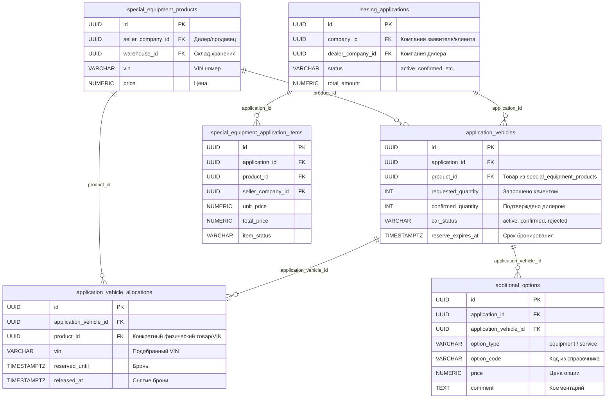

# Задача 22372 — Вернуть функции дилера по заявке и убрать не нужный блок

- **Bitrix:** https://carcraftpro.bitrix24.ru/company/personal/user/302/tasks/task/view/22372/
- **Ветка:** `bugfix/22372`
- **Тип:** bugfix / регрессия
- **Дата создания:** 28.09.2026 03:45:00 MSK (UTC+3)

---

## ER-диаграмма



---

## 1. Постановка проблемы

В детальном просмотре заявки у дилера (`ApplicationDetailModal.vue`):
1. **Появился лишний блок «Дополнительная комиссия»** (согласование комиссии с лизинговой компанией) — его необходимо убрать.
2. **Пропал блок «Автомобили: условия и действия»** у дилера на тестовом контуре (`test`):
   - Дилер не видит карточки ТС с действиями («Отказать», «Предложить выгоду», «Сделать надбавку»).
   - Дилер не видит подбор со склада по VIN (`VehicleFulfillmentPanel`: подтверждаемое количество, срок бронирования, выбор конкретного VIN из остатков на складе).
3. **Пропал блок «Дополнительное оборудование и услуги»** (`ApplicationAdditionalOptionsEditor`):
   - Дилер не может предложить дополнительное оборудование и услуги по автомобилю в заявке.

### Скриншоты дефектов и требований

- `image-2.png`: Текущее состояние на `test` — отображается блок «Дополнительная комиссия», под ним только «Техника в заявке» (статический список позиций), все дилерские функции отсутствуют.
- `image (1)-2.png`: Ожидаемое состояние блока «Автомобили: условия и действия» (демонстрация с `demo.multileasing.ru`):
  - Карточка автомобиля (FAW BESTUNE B70 NEW Master).
  - Панель «Количество и подбор со склада»: запрошено клиентом, подтверждено, подобрано, осталось подобрать, подтверждаемое количество, срок брони, таблица автомобилей со склада с возможностью выбора по чекбоксу и поиском по VIN.
- `image (2)-2.png`: Ожидаемое состояние блока доп. оборудования (демонстрация с `demo.multileasing.ru`):
  - Характеристики ТС (двигатель, КПП, привод, VIN, склад).
  - Блок «Дополнительное оборудование и услуги»: «+ Предложить оборудование», «+ Предложить услугу», список добавленных опций, сохранение изменений.
  - Кнопки действий дилера: «Отказать», «Предложить скидку», «Сделать надбавку».

---

## 2. Корневые причины (Root Cause Analysis)

### Причина 1: Добавление `ConditionRequests` в модальное окно
В коммите `0f7d6c20` (`feat(22268): add internal deal monetization`) в компонент `ApplicationDetailModal.vue` был напрямую вставлен блок:
```vue
<ConditionRequests
  v-if="authStore.isDealer"
  :key="application.id"
  :api="monetizationApi"
  :application-id="application.id"
  role="dealer"
/>
```
Этот блок не должен выводиться дилеру в общем окне детальной информации по заявке.

### Причина 2: Фильтрация позиций в `ApplicationDetailModal.vue`
В `ApplicationDetailModal.vue` отображение блока «Автомобили: условия и действия» (строка 124) скрыто условием:
```vue
<section v-if="actionableVehicles.length > 0 || !hasNormalizedApplicationItems">
```
Где:
- `hasNormalizedApplicationItems` всегда `true` для современных заявок (так как бэкенд возвращает массив `items`).
- `actionableVehicles` рассчитывается через `isNormalizedVehicle`:
  ```ts
  const normalizedVehicleLineIds = computed(() => new Set(
    applicationItems.value
      .filter((item) => item.type === 'vehicle')
      .map((item) => item.id),
  ))
  const isNormalizedVehicle = (vehicle: ApplicationVehicle): boolean => (
    !hasNormalizedApplicationItems.value
    || Boolean(vehicle.id && normalizedVehicleLineIds.value.has(vehicle.id))
  )
  const actionableVehicles = computed(() => vehicles.value.filter(isNormalizedVehicle))
  ```
  После перехода каталога на `special_equipment` (коммит `fc6b7b71`), позиции заявки имеют `item.type === 'special_equipment'`. Фильтр `filter((item) => item.type === 'vehicle')` возвращает пустой набор, поэтому `normalizedVehicleLineIds` пуст, `actionableVehicles` пуст (`[]`), и вся секция полностью скрывается.

### Причина 3: Несоответствие сущностей заявки при оформлении из каталога
При оформлении заявки из корзины спецтехники / каталога создаются записи `special_equipment_application_items`, в то время как:
- `VehicleFulfillmentPanel` работает с эндпоинтами `/api/v1/application-vehicles/{id}/fulfillment`.
- `ApplicationAdditionalOptionsEditor` работает с `/api/v1/applications/{id}/additional-options` с передачей `application_vehicle_id`.
- Дилерские действия («Отказать», «Предложить выгоду», «Сделать надбавку») работают через `/api/v1/applications/{id}/dealer-actions` с привязкой к `application_vehicle_id`.
Поскольку `application_vehicles` отсутствуют в таких заявках (либо не возвращаются в `application.vehicles`), у дилера нет объекта для управления бронированием, допами и скидками.

---

## 3. Требования к реализации

### 3.1. Удаление блока «Дополнительная комиссия» (Frontend)
- В `frontend/features/applications/components/ApplicationDetailModal.vue`:
  - Удалить компонент `<ConditionRequests v-if="authStore.isDealer" ... />` (строки 64–70).
  - Удалить неиспользуемые импорты и переменные (`monetizationApi`, `ConditionRequests`, `createMonetizationApi`), если они не используются в других местах модалки.

### 3.2. Восстановление блока «Автомобили: условия и действия» (Frontend)
- В `ApplicationDetailModal.vue`:
  - Скорректировать вычисление `normalizedVehicleLineIds`: учитывать не только `item.type === 'vehicle'`, но и `item.type === 'special_equipment'`, либо не отсекать ТС, принадлежащие заявке дилера.
  - Обеспечить, чтобы `actionableVehicles` корректно формировался для всех ТС/товаров дилера в заявке.
  - Если в заявке присутствуют позиции спецтехники/автомобилей дилера, секция «Автомобили: условия и действия» должна рендериться со всеми доступными операциями.

### 3.3. Обеспечение доступности дилерских действий и доп. оборудования (Backend & Frontend)
- Проверить и обеспечить корректное связывание:
  - Каждая позиция ТС в заявке должна иметь идентификатор, совместимый с:
    1. Подбором по VIN и подтверждением количества (`VehicleFulfillmentPanel` -> `/api/v1/application-vehicles/{id}/fulfillment`).
    2. Редактированием дополнительного оборудования и услуг (`ApplicationAdditionalOptionsEditor` -> `/api/v1/applications/{id}/additional-options`).
    3. Выставлением скидки / надбавки / отказа (`/api/v1/applications/{id}/dealer-actions`).
  - При создании лизинговой заявки из каталога гарантировать наличие записей `application_vehicles` для товаров, требующих дилерского резервирования со склада.
  - В методе получения заявки `GET /api/v1/applications/{id}` гарантировать возвращение массива `vehicles` с полями, необходимыми для отображения карточки автомобиля (марка, модель, комплектация, год, склад, текущий VIN и статус брони).

### 3.4. Восстановление блока «Дополнительное оборудование и услуги» (Frontend)
- `ApplicationAdditionalOptionsEditor` рендерится внутри каждой карточки ТС в блоке «Автомобили: условия и действия».
- При восстановлении отображения карточек ТС (п. 3.2 и 3.3) блок доп. оборудования автоматически становится видимым при условии `authStore.isDealer || authStore.isDistributor`.
- Проверить, что сохранение оборудования и услуг успешно отправляет запрос и обновляет суммы в модальном окне.

---

## 4. Планируемые изменения

### Frontend

| Файл | Описание изменений |
|---|---|
| `frontend/features/applications/components/ApplicationDetailModal.vue` | 1. Удалить блок `<ConditionRequests>`.<br>2. Исправить вычисление `normalizedVehicleLineIds` и `actionableVehicles`, поддержав типы `special_equipment` и `vehicle`.<br>3. Обеспечить корректное отображение заголовка и секции условий и действий. |
| `frontend/features/applications/components/ApplicationAdditionalOptionsEditor.vue` | Проверить и при необходимости поддержать идентификаторы позиций каталога при сохранении дополнительных опций. |

### Backend

| Файл | Описание изменений |
|---|---|
| `backend/application/commands/applications/create_draft.py` / `special_equipment_commerce.py` | Гарантировать создание записей `ApplicationVehicle` при оформлении лизинговой заявки на автотранспорт/спецтехнику, чтобы позиции были доступны для складского подбора и назначения доп. опций. |
| `backend/application/queries/applications/get_application.py` | Обеспечить корректную отдачу массива `vehicles` со всеми характеристиками для отображения у дилера. |

---

## 5. Критерии готовности

- [x] В модальном окне детальной информации по заявке у дилера (`ApplicationDetailModal.vue`) **полностью отсутствует** блок «Дополнительная комиссия».
- [x] У дилера в детальной информации по заявке отображается блок **«Автомобили: условия и действия»**.
- [x] В карточке автомобиля отображаются:
  - Название марки, модели и комплектации.
  - Количество ТС и статус (например, «Активна», «Подтверждено»).
  - Блок **«Количество и подбор со склада»** с возможностью ввода подтверждаемого количества, даты брони и таблицы подбора по VIN со склада.
  - Кнопки **«Отказать»**, **«Предложить выгоду» / «Предложить скидку»**, **«Сделать надбавку»**.
- [x] В карточке автомобиля отображается блок **«Дополнительное оборудование и услуги»**:
  - Кнопки «+ Предложить оборудование» и «+ Предложить услугу».
  - Возможность выбора опций из каталога, указания цен и комментариев.
  - Кнопка «Сохранить изменения» успешно сохраняет выбранные опции.
- [x] Статические проверки бэкенда:
  ```bash
  cd backend
  uv run ruff check . --fix
  uv run lint-imports
  uv run mypy .
  ```
- [x] Проверка миграций: `uv run alembic check` возвращает отсутствие расхождений.
- [x] E2E/ручная проверка сценария дилера на работающем приложении при viewport desktop (>= 768px).
