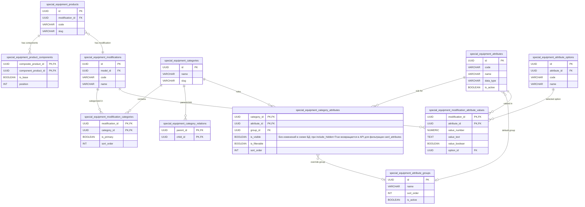
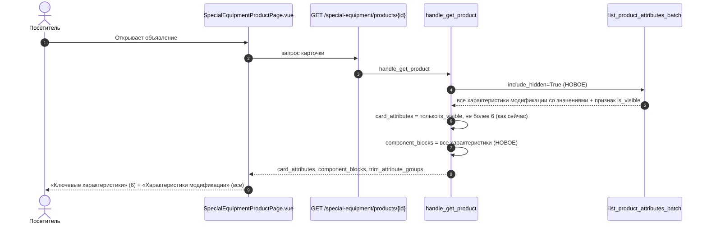

# Доработка: показывать все характеристики в блоке «Характеристики модификации» на странице объявления

- **Дата и время создания:** 2026-09-28 10:34:59 MSK (UTC+3)
- **Идентификатор задачи Bitrix24:** — (внутренняя задача)
- **Тип задачи:** `feature`
- **Ветка задачи:** `feature/se-detail-all-modification-attributes`
- **Целевая ветка для MR:** `test`
- **Затронутые модули:**
  - `backend/infrastructure/repositories/special_equipment_repository.py`
  - `backend/application/special_equipment_offerings.py`
  - `backend/application/queries/special_equipment.py`
  - тесты

---

## ER-диаграмма



---

## 1. Схема взаимодействия



---

## 2. Постановка задачи

### Текущее поведение
На странице объявления есть два блока с характеристиками модификации:

| Блок | Поле API | Что показывает сейчас |
|---|---|---|
| «Ключевые характеристики» (справа, под ценой) | `card_attributes` | характеристики с «В карточке» = Да, не более 6 |
| «Характеристики модификации» (внизу страницы) | `component_blocks` | **те же** характеристики с «В карточке» = Да |

Поэтому во втором блоке повторяются те же 6 ключевых характеристик, а остальные характеристики модификации не выводятся, хотя загружены в базу. Пример: FOTON, у каждой модификации 75–88 характеристик, а на странице видно 6.

У FAW полный список виден только потому, что основная часть характеристик FAW задана на уровне комплектаций и выводится отдельным блоком «Параметры комплектации» (`trim_attribute_groups`). Этот блок признак «В карточке» не учитывает.

### Причина в коде
1. `list_product_attributes_batch` (`special_equipment_repository.py`, ~стр. 2303) по контракту возвращает только «card-visible» характеристики:
   ```python
   metadata = [
       row for row in _resolve_attribute_metadata(...)
       if row["is_visible"]
   ]
   ```
2. `handle_get_product` (`application/queries/special_equipment.py`, ~стр. 777) строит из этого же списка и `card_attributes` (через `_card_attribute_rows`), и `component_blocks` (через `_component_blocks_resource`).
3. Для составных объявлений `list_composite_attribute_rows` (`special_equipment_offerings.py`, ~стр. 456) тоже вызывает `list_product_attributes_batch` и тоже получает только видимые характеристики.

### Требуемое поведение
- **«Ключевые характеристики»:** без изменений. Только «В карточке» = Да, не более 6; тот же порядок.
- **«Характеристики модификации»:** все характеристики модификации, у которых есть значение и есть правило в «Характеристиках категорий» категорий объявления (с учётом наследования от родительских категорий). Флаги «В карточке» и «В фильтре» роли не играют.
  - Группировка и порядок как сейчас: по порядку группы, затем по порядку характеристики в категории.
  - Логические характеристики со значением «Да» выводятся названием, как сейчас. Значения «Нет» не выводятся, как сейчас (`presentSpecialEquipmentDetailAttribute`).
- **Листинг каталога** (карточки в выдаче, `handle_list_products`): без изменений, только видимые, не более 6.
- **«Параметры комплектации»:** без изменений.
- **Импорт:** без изменений. Лимит `MAX_CARD_ATTRIBUTES_PER_MODIFICATION = 6` на «В карточке» сохраняется.

---

## 3. Требования к реализации

### 3.1. Репозиторий: `list_product_attributes_batch`
Добавить именованный параметр `include_hidden: bool = False`.

```python
async def list_product_attributes_batch(
    session: AsyncSession,
    products: Sequence[Mapping[str, Any]],
    *,
    include_hidden: bool = False,
) -> dict[UUID, list[dict]]:
```

- При `include_hidden=False` поведение не меняется: все текущие вызовы остаются как есть.
- При `include_hidden=True` не отбрасывать строки с `is_visible = False`. Каждая строка результата по-прежнему содержит ключ `is_visible` (он уже есть в метаданных из `_resolve_attribute_metadata`), чтобы `_card_attribute_rows` мог отфильтровать ключевые.
- Остальная логика не меняется: приоритет категорий, группы, пропуск неактивных групп и характеристик.
- Обновить docstring: при `include_hidden=True` возвращаются все характеристики модификации, имеющие правило категории.

### 3.2. Составные объявления: `list_composite_attribute_rows`
Добавить параметр `include_hidden: bool = False` и пробросить его в `list_product_attributes_batch`. Сейчас функция вызывается только из `handle_get_product`.

### 3.3. Запрос карточки: `handle_get_product`
1. Вызывать с `include_hidden=True`:
   - `repository.list_product_attributes_batch(session, [row], include_hidden=True)`;
   - `offerings.list_composite_attribute_rows(session, query.product_id, include_hidden=True)`.
2. `row["card_attributes"] = _card_attribute_rows(tuple(attribute_rows))`: без изменений. Функция уже фильтрует `is_visible is True` и берёт первые 6.
3. `component_blocks = _component_blocks_resource(..., attribute_rows=attribute_rows, component_rows=component_rows)`: теперь строится из полного списка. Код функции не меняется.
4. Поля `attributes` и `attribute_groups` ответа оставить в прежнем объёме, только видимые. Страница их не использует, но на них могут опираться другие клиенты:
   ```python
   visible_rows = [item for item in attribute_rows if item.get("is_visible") is True]
   flat_attributes, attribute_groups = _attribute_groups_resource(visible_rows)
   ```
5. `handle_list_products` не менять: вызов без `include_hidden`.

### 3.4. Фронтенд
Изменений не требуется. `SpecialEquipmentProductPage.vue` уже выводит все группы и атрибуты из `component_blocks`, а `card_attributes` ограничивает шестью (`.slice(0, 6)`).

Проверить вёрстку на модификации с ~80 характеристиками: сетка `sm:grid-cols-2`, группы, отсутствие горизонтального скролла на мобильной ширине.

> Опционально, не входит в задачу без отдельного решения: сворачивать блок после N строк кнопкой «Показать все характеристики».

### 3.5. Что не меняется
- Схемы ответа (`presentation/schemas/special_equipment.py`): состав полей тот же, меняется только количество элементов в `component_blocks[].groups[].attributes`.
- Импорт, лимит «В карточке», фильтры, фасеты, админка каталога, корзина, заявки.

---

## 4. Тестирование

### Автотесты (backend)
В `backend/tests/integration/test_special_equipment_offerings_router.py` (или отдельном тесте рядом) создать категорию с тремя характеристиками модификации:
- A: «В карточке» = Да;
- B: «В карточке» = Нет, «В фильтре» = Нет;
- C: логическая, «В карточке» = Нет, значение «Нет».

Проверить:
1. `GET /special-equipment/products/{id}`:
   - `card_attributes` содержит только A;
   - `component_blocks[0].groups[*].attributes` содержит A и B, а C присутствует в ответе с `value = false`; фронтенд его скрывает;
   - `attributes` и `attribute_groups` содержат только A.
2. `GET /special-equipment/products` (листинг): `card_attributes` содержит только A.
3. Если у модификации 7 характеристик и все с «В карточке» = Да (данные созданы напрямую, в обход импорта), то `card_attributes` содержит 6, а `component_blocks` 7.
4. Составное объявление: базовый блок и блок надстройки содержат и скрытые характеристики.
5. Существующие тесты на `component_blocks` (порядок блоков, заголовки) проходят без изменений.

### Автотесты (frontend e2e)
В `frontend/tests/e2e/special-equipment/22098-v5-16.spec.ts`, где уже проверяется регион «Характеристики модификации», добавить проверку: характеристика со ссылкой `is_visible: false` видна в регионе «Характеристики модификации» и отсутствует в «Ключевых характеристиках».

### Ручная проверка на стенде `test`
1. FOTON M18 (любая модификация):
   - «Ключевые характеристики»: 6 строк;
   - «Характеристики модификации»: все группы (Кузов и габариты, Двигатель, Трансмиссия и ходовая часть, Интерьер, Внешнее оборудование…), включая «Да/Нет» характеристики (Кондиционер, ABS, Стальные колесные диски и т. д.).
2. FAW (кроссовер): «Ключевые характеристики» и «Параметры комплектации» как раньше. «Характеристики модификации» теперь показывает все характеристики модификации FAW, а не только 6.
3. Листинг категории «Седельные тягачи» / «Бортовой грузовик»: в карточках по-прежнему не более 6 характеристик.
4. Мобильная ширина: страница FOTON без горизонтального скролла.

---

## 5. Критерии готовности (Definition of Done)
1. На странице объявления блок «Характеристики модификации» показывает все характеристики модификации со значениями, независимо от «В карточке» и «В фильтре».
2. «Ключевые характеристики» на странице и характеристики в карточках листинга не изменились: только «В карточке» = Да, не более 6.
3. Поля `attributes` / `attribute_groups` ответа карточки не изменились.
4. Импорт каталога не изменился, лимит 6 «В карточке» сохранён.
5. Backend-тесты, `bun run lint`, `bun run typecheck`, e2e-набор `tests/e2e/special-equipment` зелёные.
6. Создан Merge Request в ветку `test` со ссылкой на задачу Bitrix24.
