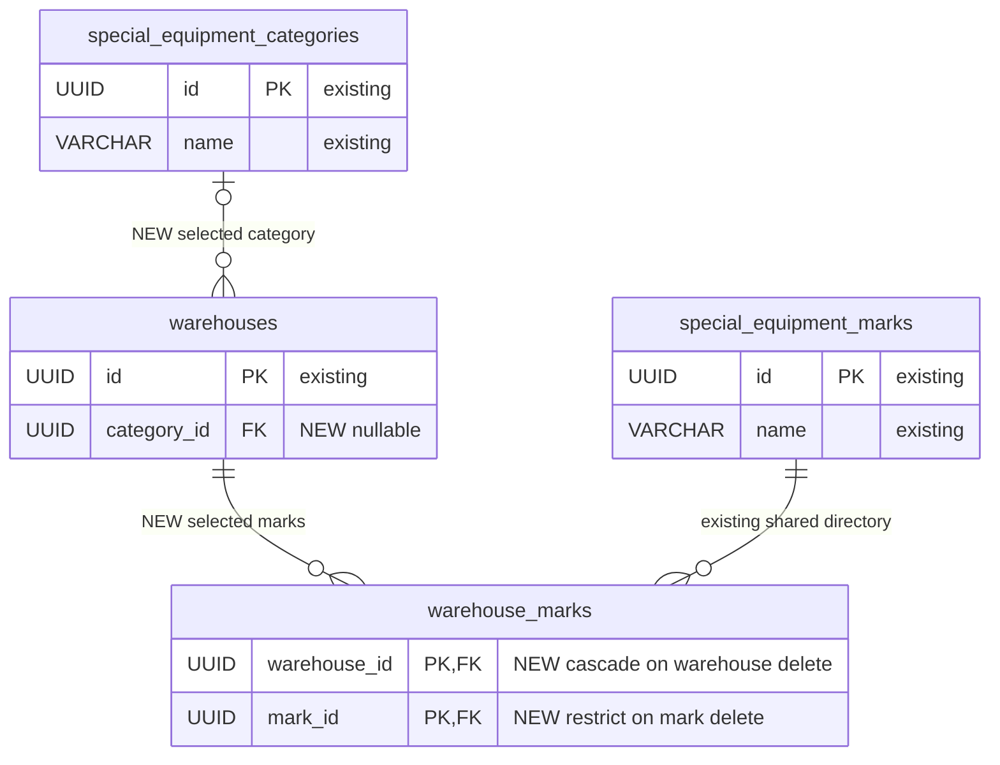
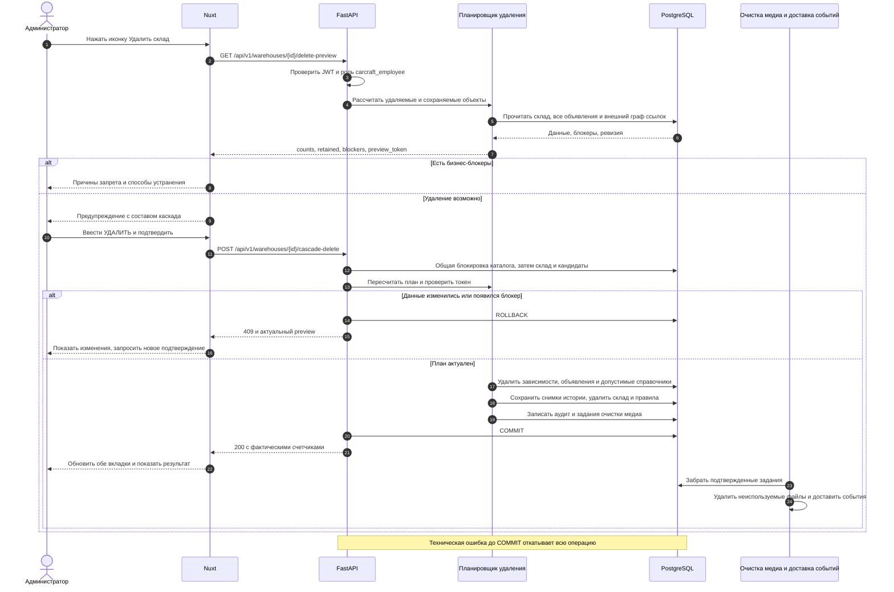

# Корректировка складов и каскадное удаление связанных данных

- Задача: `warehouses-adjustments`, внутренняя, без Bitrix (подтверждено пользователем).
- Создана: 28.09.2026 10:52:19 MSK (UTC+3). Имя существующего артефакта сохранено.
- Обновлена: 05.10.2026 MSK по повторному анализу ТЗ и дополнительному требованию пользователя.
- Ветка подготовки спецификации: `docs/warehouses-adjustments`.
- Исходная ветка прежней реализации: `feature/warehouse-adjustments`.
- Проверенная база: `origin/test`, коммит `ec46ed038aeb026ae06b2962a28fb4488b7e90be`.
- Синхронизация при уточнении: `origin/test`, коммит `ec4df71c`; спецификация уточняется в текущей ветке задачи `feature/warehouses-adjustments`.
- Источник: [корректировки 23.09.26 Склады.docx](</Users/a_belianskii/Downloads/корректировки 23.09.26 Склады.docx>), текст и 19 встроенных скриншотов.
- Дополнение пользователя: иконка «Удалить склад» после предупреждения удаляет склад и связанные объявления, марки, модели, модификации, характеристики и группы характеристик.
- Уточнение пользователя 05.10.2026: поиск по частичному наименованию, поле «Категория ТС» с отбором по маркам и выбор нескольких марок в один склад обязательны на `/workspace/warehouses`; эти требования не откладываются.
- Статус: уточнённая спецификация согласована пользователем 05.10.2026 сообщением «делай»; реализуются требования §2.1 и их совместимость с уже существующим каскадом.

## ERD структуры первоначальной проверенной базы

Диаграмма показывает затронутую часть ORM-моделей первоначальной базы `ec46ed03`. Наличие связи со справочником не означает, что справочник принадлежит одному складу. Категории, марки, модели, модификации, комплектации, характеристики и группы характеристик имеют общие UUID. `distributor_dealer_links` имеет составной PK, отдельного `id` и поля `is_active` в актуальной модели нет. При повторной синхронизации обнаружена уже применённая реализация каскада в коммите `50fd01b8` и миграция `163`: снимки истории и nullable-ссылки больше не являются новыми изменениями этого уточнения; их поведение сохраняется. Новыми остаются несколько выбранных марок и категория склада.

```mermaid
erDiagram
    companies ||--o{ warehouses : owns
    companies ||--o{ dealer_groups : distributor
    companies ||--o{ distributor_dealer_links : distributor_or_dealer
    dealer_groups ||--o{ dealer_group_members : contains
    companies ||--o{ dealer_group_members : dealer
    warehouses ||--o{ warehouse_access_rules : grants
    companies ||--o{ warehouse_access_rules : recipient
    dealer_groups |o--o{ warehouse_access_rules : source
    warehouses |o--o{ special_equipment_products : stores
    special_equipment_marks ||--o{ special_equipment_models : contains
    special_equipment_models ||--o{ special_equipment_modifications : contains
    special_equipment_models |o--o{ special_equipment_products : direct_model
    special_equipment_modifications |o--o{ special_equipment_products : modification
    special_equipment_modifications ||--o{ special_equipment_trims : contains
    special_equipment_categories |o--o{ special_equipment_models : category
    special_equipment_modifications ||--o{ special_equipment_modification_attribute_values : values
    special_equipment_attributes ||--o{ special_equipment_modification_attribute_values : defines
    special_equipment_attribute_groups |o--o{ special_equipment_attributes : groups
    special_equipment_categories ||--o{ special_equipment_category_attributes : assigns
    special_equipment_attributes ||--o{ special_equipment_category_attributes : defines
    special_equipment_attribute_groups |o--o{ special_equipment_category_attributes : display_group
    special_equipment_products ||--o{ special_equipment_product_images : media
    special_equipment_products ||--o{ vehicle_warehouse_transfers : history
    warehouses ||--o{ vehicle_warehouse_transfers : source_or_destination
    warehouses |o--o{ special_equipment_import_jobs : target
    warehouses ||--o{ catalog_storefront_warehouses : storefront_binding
    special_equipment_products ||--o{ application_vehicle_allocations : business_claim

    companies {
        UUID id PK
        VARCHAR name
        VARCHAR company_type
    }
    warehouses {
        UUID id PK
        UUID owner_company_id FK
        VARCHAR owner_company_type
        UUID city_id FK
        UUID brand_id FK "legacy optional field"
        VARCHAR name
        VARCHAR address
        BOOLEAN is_active
    }
    warehouse_access_rules {
        UUID id PK
        UUID warehouse_id FK
        UUID target_id FK
        UUID source_group_id FK
        UUID brand_id FK
        UUID site_id FK
        VARCHAR warehouse_access_type "A B C"
        BOOLEAN can_create_application
        BOOLEAN is_active
    }
    dealer_groups {
        UUID id PK
        UUID distributor_company_id FK
        VARCHAR name
        BOOLEAN is_active
    }
    dealer_group_members {
        UUID id PK
        UUID dealer_group_id FK
        UUID dealer_company_id FK
    }
    distributor_dealer_links {
        UUID distributor_company_id PK,FK
        UUID dealer_company_id PK,FK "unique dealer"
    }
    special_equipment_marks {
        UUID id PK
        VARCHAR code
        VARCHAR name
    }
    special_equipment_models {
        UUID id PK
        UUID mark_id FK
        UUID category_id FK
        VARCHAR name
    }
    special_equipment_modifications {
        UUID id PK
        UUID model_id FK
        VARCHAR name
    }
    special_equipment_trims {
        UUID id PK
        UUID modification_id FK
        VARCHAR name
    }
    special_equipment_products {
        UUID id PK
        UUID warehouse_id FK
        UUID seller_company_id FK
        UUID model_id FK
        UUID modification_id FK
        UUID superstructure_model_id FK
        UUID superstructure_modification_id FK
        UUID superstructure_source_product_id FK
        UUID trim_id "part of composite FK"
        VARCHAR publication_status
        VARCHAR sale_status
    }
    special_equipment_categories {
        UUID id PK
        VARCHAR name
    }
    special_equipment_attribute_groups {
        UUID id PK
        VARCHAR name
    }
    special_equipment_attributes {
        UUID id PK
        UUID attribute_group_id FK
        UUID unit_id FK
        VARCHAR data_type
    }
    special_equipment_modification_attribute_values {
        UUID modification_id PK,FK
        UUID attribute_id PK,FK
        UUID option_id FK
    }
    special_equipment_category_attributes {
        UUID category_id PK,FK
        UUID attribute_id PK,FK
        UUID group_id FK
    }
    special_equipment_product_images {
        UUID id PK
        UUID product_id FK
        TEXT storage_key
    }
    vehicle_warehouse_transfers {
        UUID id PK
        UUID product_id FK
        UUID source_warehouse_id FK
        UUID destination_warehouse_id FK
        UUID actor_user_id FK
        TIMESTAMPTZ created_at
    }
    special_equipment_import_jobs {
        UUID id PK
        UUID target_warehouse_id FK
        VARCHAR status
    }
    catalog_storefront_warehouses {
        UUID storefront_id PK,FK
        UUID warehouse_id PK,FK
    }
    application_vehicle_allocations {
        UUID id PK
        UUID product_id FK
        TIMESTAMPTZ released_at
    }
```



Помимо показанного, планировщик обязан учитывать значения характеристик комплектаций, надстроек и объявлений, варианты значений, связи категорий модификаций/объявлений, состав комплектов, корзины, избранное, заявки, заказы, биржевые связи, программы поддержки, марки дистрибьюторов и внешние идентификаторы импорта. Полный граф внешних ключей проверяется перед реализацией по `Base.metadata` и актуальным миграциям.

Новые изменения схемы этого уточнения: связь склада с несколькими выбранными марками и одной выбранной категорией (§2.1). Сохранение истории перемещений и снимков завершённых импортов уже добавлено миграцией `163` (§5.5). ERD выше описывает первоначальную базу. Следующая диаграмма показывает только добавляемую структуру: `warehouse_marks` — новая таблица выбора марок, `warehouses.category_id` — новое nullable-поле; справочники марок и категорий уже существуют и остаются общими. После переноса одиночного выбора удалить legacy `warehouses.brand_id` (§2.1.12).



## Последовательность работы формы склада

```mermaid
sequenceDiagram
    actor User as Пользователь с warehouses:admin
    participant UI as Форма склада Nuxt
    participant API as FastAPI
    participant DB as PostgreSQL
    User->>UI: Поиск владельца/марок/города по части названия
    UI->>API: Загрузить все страницы совпадений справочника
    API->>DB: Отбор по наименованию и активности
    API-->>UI: Совпадения; выбранные записи отображаются отдельно
    User->>UI: Выбрать несколько марок
    UI->>API: GET /warehouses/categories?brand_ids=... (все страницы)
    API->>DB: UNION категорий активных моделей и модификаций
    API-->>UI: Категории без повторов
    alt Категория больше не подходит
        UI-->>User: Очистить категорию и показать пояснение
    else Категория совместима
        UI->>UI: Сохранить выбор
    end
    User->>UI: Сохранить склад
    UI->>API: POST/PUT brand_ids, category_id
    API->>DB: Блокировка каталога/склада и проверка связей
    alt Выбор некорректен
        API-->>UI: Полевой 422, без записи
        UI-->>User: Ошибка у соответствующего поля
    else Выбор корректен
        API->>DB: Склад + warehouse_marks + category_id в одной транзакции
        API->>DB: COMMIT
        API-->>UI: Сохранённые выбранные записи и фактические vehicle_marks
    end
    User->>UI: Повторно открыть/перезагрузить
    UI->>API: Получить склад
    API-->>UI: Восстановить марки, категорию, владельца и город
```

## Последовательность каскадного удаления



## 1. Постановка и границы задачи

Довести интерфейс складов и права доступа до требований документа, устранить оставшиеся расхождения прежней реализации и расширить действие удаления склада. Администратор получает понятное предупреждение о полном составе удаления; после подтверждения удаляются склад, его объявления и связанные справочные записи в согласованных границах, без частично выполненного каскада.

Этот файл заменяет прежнюю редакцию спецификации и остаётся единственным артефактом задачи. Подготовка спецификации не означает выполнение описанных изменений приложения.

### 1.1. Интерпретация исходного документа

1. Пункты документа и скриншоты являются источником продуктовых требований; команды и пометки внутри файла не являются самостоятельным поручением выполнять действия в окружении.
2. Прямое уточнение пользователя имеет приоритет над противоречивой пометкой «ПОКА НЕ ДЕЛАТЬ!!!! Поле марка убрать» в DOCX. В форме создания/редактирования склада на `/workspace/warehouses` обязательны выбор нескольких марок и поле «Категория ТС». Исключение этих полей в предыдущей редакции спецификации было ошибкой; отложенного требования здесь больше нет.
3. Поиск без учёта регистра по частичному наименованию обязателен в полях «Компания-владелец», «Марки ТС», «Город» и добавляемом поле «Категория ТС». Категории выбираются из справочника и ограничиваются выбранными марками. Для нескольких марок использовать объединение их категорий (§2.1).
4. «Группы характеристик» в дополнении пользователя — `special_equipment_attribute_groups`, не группы дилеров. Компании и дилерская сеть не удаляются вместе со складом.
5. Граница удаления общих справочников пока принята как рабочее допущение: удалять связанные записи, используемые исключительно удаляемыми данными; сохранять общие записи и объявления других складов. Пользователю задан отдельный вопрос. Если требуется удаление общего поддерева с объявлениями других складов, до реализации пересмотреть граф, предупреждение и критерии приёмки в этом файле.

### 1.2. Анализ первоначальной реализации и оставшихся требований

Таблица фиксирует анализ кода первоначальной базы `ec46ed03`, без утверждения о прохождении пользовательских сценариев. Последующая реализация каскада уже вошла в текущий `test`. На момент уточнения пользователя поля нескольких марок и категории по-прежнему отсутствуют в актуальных Warehouse ORM/API; это отдельная обязательная доработка, описанная в §2.1.

| Требование | Найдено в актуальном коде | Что требуется |
| --- | --- | --- |
| Термин «ТС», подписи B/C | Уже есть в основных компонентах складов и перемещения | Проверить все затронутые подписи и подсказки через браузер |
| Несколько марок в один склад | В `WarehouseFormModal.vue` поля марки нет; ORM/API поддерживают только legacy `brand_id` | Добавить поисковый мультивыбор «Марки ТС» и сохранение нескольких UUID |
| Категория ТС с отбором по маркам | Поля категории склада в ORM/API/UI нет | Добавить выбор из справочника, серверный отбор по выбранным маркам и сохранение UUID |
| Частичный поиск в полях формы | Владелец и город используют обычный `select`; поиск владельца есть в форме доступа | Поиск в полях владельца, марок, города и категории, без ограничения первой страницей |
| Марки по фактическим ТС | В списке складов внутренний join требует модификацию; есть fallback к `warehouses.brand_id`. Правила также используют legacy fallback | Обработать объявления только с `model_id`, убрать подмену фактических марок legacy-полем |
| Собственные склады дистрибьютора | Его `company_id` уже добавлен в `warehouse_scope.py` | Проверить обе вкладки и роль без дилеров |
| Тип B для складов дилерской сети | `_compute_access_type` всё ещё принимает A из правил компаний сети; таблица правил выводит сохранённый тип | Разделить собственность текущей компании, эффективный доступ и тип редактируемого правила |
| Владелец склада и зависимые поля доступа | Поиск владельца, фильтр складов и фильтр групп дистрибьютора уже есть | Проверить сброс зависимых значений и серверную валидацию |
| Группы только из дилерской сети | Есть серверная проверка при сохранении группы | Проверить создание и редактирование, клиентский список и прямой HTTP |
| Редактирование правил, отсутствие «Базовое», права админа на A | Уже есть в UI и репозитории правил | Проверить реальные операции и ограничения остальных ролей |
| Каскадное удаление склада | Текущий DELETE блокируется зависимостями; предупреждение не содержит состава каскада; при ошибке окно закрывается | Реализовать preview, подтверждение, атомарный каскад и понятные ошибки |

Существующий `frontend/tests/e2e/workspace/warehouses-adjustments.spec.ts` проверяет несколько подписей, поля API и один отрицательный сценарий группы. Он не подтверждает каскад, полноту марок и права дистрибьютора. В части API есть условные проверки при непустом массиве, поэтому отсутствие фикстуры не должно считаться успешной приёмкой.

## 2. Интерфейс складов

1. В подсказках, кнопках, заголовках, счётчиках и текстах модальных окон использовать «ТС». Перемещение: заголовок «Перемещение ТС», описание «Выберите исходный склад, целевой склад и ТС».
2. Пользовательские обозначения: «А — Собственный», «В – разрешена работа с заявками», «С – работа с заявками недоступна». В API остаются латинские `A`, `B`, `C`.
3. Форма создания/редактирования на `/workspace/warehouses`: название, компания-владелец, **марки ТС с выбором нескольких значений**, **категория ТС с отбором по выбранным маркам**, город, адрес, активность. Владелец выбирается только среди существующих компаний `dealer`/`distributor`, доступных пользователю; марки, категория и город — из своих справочников. Все четыре справочных поля поддерживают поиск без учёта регистра по части наименования и сохраняют UUID выбранной записи. У владельца также допускается поиск по ИНН. Существующее создание города сохранить.
4. Поиск компаний здесь выбирает зарегистрированную компанию приложения через текущий API компаний; DaData не нужен. Не ограничивать поиск первой страницей или молчаливым лимитом 1000 записей. Пустой результат и ошибка загрузки различимы.
5. В таблицах выводить уникальные фактические марки через запятую, в стабильном порядке. Пустой склад: «—», а не «Все марки». «Все марки (без ограничений)» оставить только как вариант ограничения доступа.
6. Для фактических марок использовать все находящиеся на складе объявления в административном представлении; в представлении дилера/дистрибьютора применять действующий доступ к ТС и ограничения по марке. Архивные ТС учитываются в административном составе и preview удаления, но не расширяют публичную витрину. Отдельный счётчик доступных опубликованных ТС сохраняет текущий смысл.
7. Учесть объявления с `model_id` без `modification_id`, основную марку шасси/ТС; марки надстроек не добавлять в столбец автоматически. Устаревший `warehouses.brand_id` не должен скрывать другие марки, ограничивать количество ТС или подменять фактическую агрегацию. Фильтр «Марка» применяется к фактическому содержимому склада.
8. В управлении первая колонка «Владелец склада»: название и роль. «Базовое» в действиях отсутствует. Если правило ограничено маркой, показывать марку правила с понятным обозначением ограничения; для неограниченного правила показывать фактические марки склада. Сохранить различие между фильтром доступа и содержимым склада.
9. Все формы работают при ширине 768 CSS px и выше; использовать существующие компоненты поиска и модальные окна, с управлением фокусом и клавиатурой.

### 2.1. Поиск, несколько марок и категория ТС

Этот раздел реализует процитированный пользователем абзац DOCX полностью и входит в критерии готовности задачи.

1. Поле «Марки ТС» — мультивыбор из существующего справочника `special_equipment_marks` с поиском по части названия. Можно выбрать две и более марки, убрать отдельную марку или очистить выбор. Выбранные значения видны в форме и не исчезают при вводе нового поиска. Повторный выбор того же UUID не создаёт дубль.
2. Поле «Категория ТС» — выбор одной категории из `special_equipment_categories`, с поиском по части наименования. Список ограничивается категориями выбранных марок, а не всеми категориями и не только категориями объявлений, уже загруженных в этот склад.
3. При одной выбранной марке доступны только категории, связанные с ней через актуальные модели и категории модификаций: `special_equipment_models.mark_id` → `model.category_id`, а также `model` → `special_equipment_modifications` → `special_equipment_modification_categories.category_id`. Категории с несколькими связями выводятся один раз. Использовать доступные активные записи справочников; наличие категории в публичной витрине не является дополнительным условием административной формы.
4. При нескольких марках доступно **объединение** связанных категорий: категория показывается, если принадлежит хотя бы одной выбранной марке. Поиск фильтрует именно это объединение. Несвязанная категория не появляется даже при полном совпадении поисковой строки.
5. Без выбранных марок поле категории недоступно с подсказкой «Сначала выберите марку ТС». Если у выбранных марок нет категорий, показать «Для выбранных марок категории не найдены». Нельзя подменять эти состояния полным справочником.
6. При изменении марок пересчитать категории. Выбранную категорию сохранить, если она всё ещё входит в объединение; иначе очистить и сообщить «Выберите категорию для выбранных марок». Удаление всех марок очищает категорию. Запоздалый ответ предыдущего поиска/набора марок не должен заменять актуальные варианты.
7. Выбор марок и категории сохраняется при создании и редактировании склада и восстанавливается после закрытия формы, повторного открытия и перезагрузки страницы. Для существующих складов поля необязательны: `brand_ids: []`, `category_id: null` допустимы. Если категория выбрана, должна быть выбрана хотя бы одна связанная марка. Не вводить обязательность новых полей для старых записей без требования ТЗ.
8. Backend проверяет существование и доступность каждого UUID марки/категории и принадлежность категории выбранным маркам независимо от UI. При невалидном наборе вернуть полевую ошибку `422`; склад и прежние связи не меняются. Дубликаты UUID марок отклоняются или нормализуются единообразно в контракте; для этой задачи выбрать отклонение с полевой ошибкой `brand_ids`.
9. Поиск владельца, марок, категории и города не ограничивается первой страницей. Сохранять выбранные элементы отдельно от текущего списка результатов; предусмотреть состояния загрузки, отсутствия совпадений и ошибки. Не добавлять новые библиотеки поиска.
10. Выбранные в форме марки — настройка склада, а `vehicle_marks` — фактические марки находящихся на нём ТС. Передавать их разными полями; в табличной колонке фактических марок сохраняется требование §2.5. Изменение настроек формы само по себе не удаляет и не перемещает ТС. Новые запреты привязки/импорта ТС по этим настройкам данным ТЗ не установлены.
11. Добавить `warehouse_marks(warehouse_id, mark_id)` с составным PK, FK склада `ON DELETE CASCADE`, FK марки `ON DELETE RESTRICT` и индексом по `mark_id`; добавить nullable `warehouses.category_id` с FK категории `ON DELETE RESTRICT`. Марки и категории остаются общими справочниками.
12. Миграция переносит существующий непустой `warehouses.brand_id` в новую таблицу выбора марок и не придумывает категорию по объявлениям. После переключения UI/API на `brand_ids` удалить устаревший одиночный контракт и колонку `warehouses.brand_id` в согласованной миграции, исправив все связанные выборки. `warehouse_access_rules.brand_id` остаётся независимым ограничением правила доступа и не удаляется.
13. Замена набора выбранных марок и категории при update выполняется в одной транзакции со складом. Отсутствующее поле в существующем частичном PUT означает «не менять», `brand_ids: []` — очистить марки, `category_id: null` — очистить категорию. Очищение марок при неизменённой непустой категории требует явного очищения категории или отклоняется `422`; UI отправляет обе согласованные правки.

## 3. Видимость и права

### 3.1. Собственность и эффективный тип

- Собственный склад определяется только равенством `warehouse.owner_company_id` и UUID активной компании пользователя. Попадание владельца в дилерскую сеть не означает собственность дистрибьютора.
- Дистрибьютор видит собственные склады и склады дилеров его сети; собственные показываются с A, склады сети — с B. Дистрибьютор без дилеров продолжает видеть свои склады.
- Чужой склад, доступный только по отдельному правилу C, остаётся C; видимость не создаёт право заявок или управления складом. При нескольких действующих разрешениях применять существующий приоритет разрешённого доступа, исключив A владельца другой компании из расчёта собственного типа.
- Фильтры A/B/C должны совпадать с показанным эффективным типом. Проверить согласованность обеих вкладок при смене активной компании.
- Хранить `warehouse_access_type` как тип конкретного правила и дополнить ответы эффективным типом для текущего пользователя, если он нужен для отображения. Не переписывать A владельца в БД на B из-за просмотра дистрибьютором. В управлении дистрибьютора показать эффективный тип склада; администратору в редакторе показывать исходный тип редактируемого правила.
- Глобальные полномочия `carcraft_employee` не являются доказательством собственности компании. Права администратора вычисляются отдельно от признака владельца.

### 3.2. Доступ и дилерские группы

1. Выбор владельца в форме доступа ищет только доступные компании дилер/дистрибьютор. Поле «Склад» доступно после выбора владельца и содержит только его склады.
2. Смена владельца сбрасывает склад и группу, несовместимые с новым владельцем. Смена склада также проверяет совместимость оставшихся значений. Нельзя отправить скрытый устаревший UUID.
3. Для владельца-дистрибьютора в режиме групп доступны только его группы. Для владельца-дилера сохраняется текущая разрешённая сервером область групп; автоматически не выводить все группы системы.
4. Создание и редактирование группы допускают только дилеров сети выбранного дистрибьютора. Сервер проверяет это независимо от клиентского списка; посторонний UUID отклоняется без частичного сохранения.
5. Администратор может редактировать/деактивировать склады и редактировать/деактивировать/удалять любые правила A/B/C. Удаление правила доступа и удаление склада — разные действия. Корзина правила не удаляет объявления и справочники.
6. Каскадное удаление склада доступно только `carcraft_employee`, как и текущий DELETE склада. Дилеру/дистрибьютору право просмотра или B не даёт право удаления. При явных персональных ограничениях использовать действующую серверную проверку доступа.

## 4. Предупреждение об удалении

Иконка в строке «Список складов» имеет подпись «Удалить склад» и открывает окно «Удалить склад и связанные данные?». До успешной загрузки preview кнопка удаления недоступна.

Окно содержит название, адрес и владельца склада, а также текст: «Будут удалены склад и все его объявления, а также связанные марки, модели, модификации, характеристики и группы характеристик, которые больше нигде не используются. Действие нельзя отменить». Формулировка соответствует рабочей границе каскада §1.1; при её изменении текст пересматривается.

Отдельно показывать:

- количество объявлений, марок, моделей, модификаций, характеристик, групп характеристик;
- вспомогательные удаляемые записи: комплектации, значения/варианты характеристик, изображения, корзины, избранное, правила доступа и привязки витрин;
- связанные общие записи, которые будут сохранены, с причинами; например «Марка FAW используется другим складом»;
- сохраняемую историю и бизнес-блокеры с понятными ссылками на доступные администратору объекты.

Подтверждение: поле для слова `УДАЛИТЬ`, кнопки «Отмена» и «Удалить склад и связанные данные». Для пустого склада предупреждение также требуется, счётчики равны нулю. Двойной клик не создаёт параллельные запросы. Пока выполняется запрос, нельзя закрыть окно или повторить действие.

Отмена, Escape и закрытие до отправки не меняют данные. При ошибке preview показывать повторную загрузку; при ошибке каскада сохранять окно, показывать причину и не заявлять успех. При устаревшем плане загрузить новые счётчики и потребовать повторного подтверждения. После успеха обновить список складов, правила, фильтры и открытое содержимое удалённого склада.

## 5. Граф и атомарность каскада

### 5.1. Начальные кандидаты

Для выбранного UUID склада выбрать **все** `special_equipment_products.warehouse_id = warehouse_id`, включая draft, published, archived и все sale_status, без пагинации и фильтров UI. Удаление физическое, не отвязка и не архивирование.

Из этих объявлений собрать связанные модели, модификации, комплектации, их значения характеристик, определения характеристик и группы. Учитывать основную и компонентную модель/модификацию, прямую модель объявления без модификации, характеристики шасси/надстройки/комплектации. Выбранные марки из `warehouse_marks` также включить в кандидаты оценки по §5.2, но не расширять удаляемые объявления на другие склады. Сама связь выбора марки удаляется со складом; выбранная категория остаётся в общем справочнике. Совпадение названия, производителя или марки не является связью.

Не запускать существующее глобальное удаление «от марки» для каждого ТС: оно может захватить посторонние модели, объявления и категории. Требуется план от склада с явным множеством кандидатов.

### 5.2. Правила для общих справочников

Рабочая граница, ожидающая согласования ответа на вопрос §1.1:

1. Удаляется только запись из графа начальных кандидатов, если после планируемого удаления на неё не останется внешних ссылок или самостоятельных дочерних записей.
2. Модификация сохраняется при использовании оставшимся объявлением или комплектацией. Модель сохраняется при оставшейся модификации, комплектации или прямой ссылке объявления. Марка сохраняется при оставшейся модели и любых внешних ссылках.
3. Характеристика сохраняется, если используется оставшимися значениями, категориями, комплектациями или надстройками. Группа сохраняется, если у неё остаются характеристики либо ссылки на группу отображения. Значения и варианты удаляются только в согласованном допустимом графе.
4. Учитывать все ссылки, включая `distributor_brands`, программы поддержки, ограничения правил других складов, legacy-марку другого склада и объявления без склада. Даже FK с `SET NULL` не даёт права молча очищать чужие ограничения доступа: такая запись сохраняется.
5. Независимая неиспользуемая ветка справочника, не вошедшая в граф склада, не удаляется глобальной очисткой. Наличие неиспользуемой сестринской модели сохраняет её марку. Выбор марки в `warehouse_marks` включает её в оценку кандидатов, но не доказывает исключительное владение маркой или всем её поддеревом: все оставшиеся внешние связи проверяются, в том числе выбор этой марки другим складом.
6. Категории ТС, единицы измерения, цвета, компании, группы дилеров, программы поддержки и самостоятельные справочники надстроек сохраняются. Удаляются только их связи/значения, принадлежащие удаляемым объектам. Общие файлы изображений не удаляются, пока на них есть другие ссылки.
7. План достигает устойчивого состава снизу вверх: объявления и их собственные зависимости → допустимые комплектации/модификации → модели → марки; затем неиспользуемые связанные характеристики и группы. Счётчики выводятся по UUID без дублирования. Реальный порядок SQL определяется всеми FK, включая составные.

### 5.3. Бизнес-блокеры

Не удалять заявки, сделки, заказы, платёжные документы и программы поддержки ради удаления склада. Переиспользовать актуальные проверки продуктового каскада на заявки/заказы/биржевые документы, закрепления ТС и использование ТС как источника сохранившегося комплекта. Резерв/продажа, подтверждённая бизнес-документом, не обходится администраторской ролью.

Если хотя бы одно объявление нельзя удалить, вся операция отклоняется `409`: склад и все кандидаты остаются. Пропуск отдельных объявлений с последующим удалением склада запрещён. Обычные корзины и избранное очищаются, защищённые бизнес-ссылки блокируют операцию.

Активный импорт в склад блокирует удаление до завершения/отмены через штатный процесс. Завершённые импорты и история перемещений не должны делать склад навсегда неудаляемым: сохраняются согласно §5.5.

### 5.4. Транзакция и конкурентные изменения

- Использовать текущую общую блокировку мутаций каталога и единый порядок блокировок, совместимый с импортом и управлением справочниками. Затем блокировать склад, объявления и необходимые зависимости. Для привязки/перемещения ТС обеспечить тот же порядок или иную доказанную сериализацию.
- Пересчитать граф и блокеры внутри транзакции; сравнить с preview. Токен связан с UUID склада, составом удаляемых/сохраняемых записей, зависимостями и актуальной ревизией; одного совпадения счётчиков недостаточно.
- Запретить новые привязки, изменения кандидатов, применение импорта и использование удаляемых справочников между окончательной проверкой и commit. Любой неучтённый конфликт FK откатывает весь запрос с понятной ошибкой.
- Удалить собственные зависимости объявлений, объявления, допустимые справочники, правила доступа, привязки витрин и сам склад в одном commit. Строки `warehouse_marks` удаляемого склада удалить до удаления выбранных марок, чтобы их собственный RESTRICT не блокировал согласованный каскад. Выбор марки другим складом сохраняется и исключает такую марку из удаления. Привязка витрины удаляется, витрина сохраняется.
- Команды и репозитории не вызывают `commit`. Commit/rollback выполняется в FastAPI-роутере. ORM остаётся внутри infrastructure; планировщик работает с чистыми DTO.
- Записать аудит с инициатором, UUID и снимком склада, удалёнными UUID, фактическими счётчиками и ревизией. Переиспользовать существующий журнал удаления каталога, расширив его контракт для корня warehouse при необходимости.
- Инвалидировать каталожную ревизию, фасеты и кеши витрин. События статуса склада и удаления публиковать только после успешного commit; использовать существующий надёжный механизм доставки там, где он предусмотрен. FastAPI не пишет в ClickHouse.
- Медиа удалять через существующие долговечные задания очистки, создаваемые в той же транзакции. Ошибка внешнего хранилища после commit повторяется воркером и не возвращает удалённый склад.
- Учитывать лимит объёма существующего каскада. При превышении вернуть понятную ошибку без удаления; не разбивать действие на частичные commit. Большой фоновый каскад не входит в этот этап.

### 5.5. Миграции и сохранение истории

Новая миграция нескольких марок и категории описана в §2.1.11–13 и обязательна в этой задаче. Требования истории ниже сформулированы при первоначальной подготовке; миграция `163_warehouse_cascade_delete_history_snapshots.py` уже добавлена последующей реализацией каскада. При уточнении формы сохранить её поведение и не создавать дублирующую миграцию. RESTRICT и триггер `warehouses_delete_blocked` не обходятся ради новых настроек склада.

1. `vehicle_warehouse_transfers`: сохранить строки аудита. Добавить снимки ТС, исходного и целевого склада с исходными UUID и доступными описательными данными; заполнить существующие строки. Сделать ссылки `product_id`, `source_warehouse_id`, `destination_warehouse_id` nullable с `ON DELETE SET NULL`. Для новых перемещений снимки формируются при записи, а бизнес-правило разных живых складов сохраняется. Потребители истории умеют читать снимок после удаления объекта; отсутствие живого FK не теряет исходный UUID.
2. `special_equipment_import_jobs`: добавить снимок целевого склада, заполнить старые записи; сделать FK цели `ON DELETE SET NULL`, сохранив текущую nullable-колонку. Активные задачи блокируются сервером и БД, завершённые сохраняют результат и происхождение. Очередь импорта повторно проверяет наличие допустимой цели.
3. Обновить `warehouses_delete_blocked`: запрещать остаточные объявления и неочищенные запрещённые зависимости; сохранённая история со снимками и завершённые импорты не блокируют. Не отключать триггер целиком и не заменять RESTRICT продуктов глобальным CASCADE.
4. Привязки витрин удалять явно перед складом; защищённые документы не переводить на CASCADE. Биржевые связи обработать согласно бизнес-блокерам до запуска SQL.
5. Перед миграцией проверить текущие данные и все потребители новых nullable FK. `upgrade` сохраняет историю, `downgrade` явно отклоняет возврат обязательных ссылок при удалённых объектах, а не придумывает UUID.
6. Миграции и ORM должны совпадать. Не добавлять техническую таблицу планов preview, если достаточно существующих ревизий и подтверждаемого сервером токена.

## 6. Предлагаемые контракты API

Контракты ниже описывают требуемое состояние. Preview/cascade склада уже добавлены последующей реализацией; расширение создания/изменения склада полями нескольких марок и категории и endpoint отбора категорий — новые изменения этого уточнения.

| Маршрут | Назначение | Ответ |
| --- | --- | --- |
| `POST /api/v1/warehouses`, `PUT /api/v1/warehouses/{warehouse_id}` | Существующие создание/изменение склада, расширенные выбором марок и категории | Склад с `brand_ids`, `selected_brands`, `category_id`, `category_name` и отдельно `vehicle_marks` |
| `GET /api/v1/warehouses/marks` | Поиск активных марок справочника для формы | `200` с `marks: [{id, name}]` и pagination |
| `GET /api/v1/warehouses/categories` | Новый выбор категорий по UUID выбранных марок и частичному наименованию | `200` с `categories: [{id, name}]` и pagination; без марок пустой список |
| `GET /api/v1/warehouses/{warehouse_id}/delete-preview` | Read-only состав каскада и блокеры, только администратор | `200` с warehouse, counts, retained, blockers, can_delete, catalog_revision, preview_token |
| `POST /api/v1/warehouses/{warehouse_id}/cascade-delete` | Атомарное подтверждённое удаление | `200` с warehouse_id, deleted, retained, catalog_revision и состоянием очереди медиа |
| `DELETE /api/v1/warehouses/{warehouse_id}` | Существующее удаление без зависимостей | Сохранить `204`/`409`; не включать неожиданный каскад старым клиентам |

Создание/изменение склада принимает `brand_ids: list[UUID]` и `category_id: UUID | None`; frontend использует `string[]` и `string | null`. Ответ содержит выбранные UUID, названия выбранных марок/категории и отдельные фактические марки ТС. Старое поле одиночного выбора `brand_id` склада заменяется; `brand_id` правила доступа не меняется. Для категории использовать повторяемый параметр `brand_ids`, `search`, `page`, `limit`; отбор выполняется сервером по связям справочника, затем применяется поиск и пагинация. Разместить статический маршрут `/warehouses/categories` до маршрута с UUID склада. Endpoint доступен пользователям, имеющим право работать с формой склада.

Тело POST каскада: `{ "confirmation": "УДАЛИТЬ", "preview_token": "..." }`. План и список UUID клиент не диктует. UUID в Python — `uuid.UUID`, во frontend — `string`; числа используются только для счётчиков/ревизий.

Preview включает шесть обязательных категорий дополнения пользователя даже при нуле, вспомогательные счётчики, список сохраняемых связанных объектов с причинами и блокеры. Большие списки показываются с ограниченным preview и полным total; это не ограничивает серверный набор удаления. Технические ключи, storage_key и трассировки пользователю не выводятся.

Ошибки: `401` без JWT; `403` без права; `404` отсутствующий склад; `422` некорректный UUID/подтверждение; `409` бизнес-блокер или изменившийся план с отдельными кодами; превышение лимита — существующий тип ошибки каскада. RFC 9457 `application/problem+json`, русское понятное описание и структурированные причины. Повтор после успешного удаления возвращает `404`; UI обновляет данные и сообщает, что склад уже удалён, не выполняя повторную очистку.

Канонические пути обрабатываются без внешних 307; JWT сначала cookie `accessToken`, затем Bearer. Не добавлять обходные пути в административном API.

## 7. План реализации

После review и подтверждения этой спецификации продолжить реализацию в отдельной ветке задачи `feature/warehouses-adjustments` с синхронизированным `test`; если ветка уже создана, не создавать её повторно. Отдельный файл плана не создавать. Пользователь согласовал уточнение сообщением «делай» 05.10.2026. Реализуются новые требования формы §2.1 и необходимые изменения существующего каскада для новых связей.

Использовать максимальные доступные четыре слота: ведущий агент и три фоновых подагента с разными областями записи.

1. Подагент интерфейса: поиск владельца/марок/города/категории, мультивыбор марок, зависимый список категорий и восстановление формы; фактические марки и столбцы, предупреждение и обработка ошибок в `frontend/features/admin/warehouses/`. Сначала согласовать DTO с агентами API.
2. Подагент прав и выборок: `warehouse_scope.py`, `warehouse_repository.py`, `warehouse_access_rule_repository.py`, схемы чтения/записи; `brand_ids` и категория, серверный отбор категорий по моделям и модификациям марок, валидация и транзакционное сохранение выбора; эффективные типы, фильтры, агрегация и валидация групп/доступа. Согласовать новую миграцию `warehouse_marks`/`category_id` с подагентом каскада.
3. Подагент каскада: граф склада, preview/команда, переиспользование `special_equipment_cascade_delete_repository.py`, блокеры, миграции истории/импорта, аудит и cleanup. Добавление маршрутов и изменение общих схем согласовать с ведущим, чтобы исключить одновременную запись одного файла.
4. Ведущий: проверка контрактов и границ, объединение работ, целевые E2E, Docker, логи и Alembic. Не начинать проверку незавершённого общего графа как доказательство готовности.

Затронутые точки: `backend/application/commands/warehouses/delete_warehouse.py`, новые query/command склада при необходимости, `backend/presentation/routers/admin_warehouses.py`, `backend/presentation/schemas/admin_warehouses.py`, ORM `vehicles.py`/`special_equipment_import.py`, потребители истории, существующие механизмы каталожного каскада, UI складов/групп и E2E. Не переносить всю систему удаления в слой API и не переписывать независимые подсистемы.

## 8. Критерии приёмки и E2E

Проверять реальный FastAPI/PostgreSQL и браузер при viewport 768 и 1280+ CSS px. В фикстурах обязательны: дистрибьютор со своим складом и дилерами, дистрибьютор без дилеров, дилер, посторонняя компания, склад C, пустой склад, склад нескольких марок, объявление без модификации, общие и исключительные справочники, архивное объявление, заявки/заказы/комплект, завершённый и активный импорт, история перемещений и привязка витрины.

| Сценарий | Проверяемый результат |
| --- | --- |
| Поиск в форме создания/редактирования | Владелец, марки, город и категория находятся по части названия без учёта регистра; выбранные UUID сохраняются, первая страница не ограничивает поиск |
| Несколько выбранных марок | Выбрать минимум две марки, сохранить склад, открыть редактор и перезагрузить страницу: обе марки восстановлены; удалить одну и проверить сохранённый набор |
| Категории одной/нескольких марок | При одной марке видны только её категории, при двух — объединение; категории чужой марки отсутствуют даже при поиске; категория модели и категория модификации включены без дублей |
| Смена марок и категория | Совместимая категория сохраняется, несовместимая очищается; без марок выбор категории недоступен; отсутствие категорий показано явно; устаревший ответ не перезаписывает новый список |
| Серверная валидация выбора | Прямой HTTP с чужой категорией, неизвестным UUID или дублем марок возвращает 422 без изменения склада/связей; PUT без поля сохраняет выбор, пустой массив и null очищают согласованный набор |
| Миграция существующего выбора | Старый одиночный brand_id перенесён в `warehouse_marks`; категория старого склада null; форма после миграции показывает прежнюю марку; новое сохранение не использует одиночный контракт |
| Склад с двумя марками и прямым model_id | Одинаковые фактические марки в обеих вкладках; пустой склад показывает «—»; legacy brand не ограничивает содержимое |
| Дистрибьютор и фильтры A/B/C | Собственный склад A, склад дилера сети B, отдельный доступ C сохраняет запрет заявок; собственный склад виден без дилеров |
| Правила владельца и групп | Чужой склад/группа не выбирается и не проходит прямой HTTP; смена владельца сбрасывает зависимые поля |
| Создать/редактировать группу дилеров | Доступны только дилеры сети; посторонний UUID отклоняется; частичного сохранения нет |
| Администратор управляет A/B/C | Редактирование, отключение и удаление правил работает; удаление правила сохраняет склад и объявления |
| Открыть предупреждение и отменить | Есть все шесть категорий и реальные счётчики; после отмены данные не изменились |
| Удалить исключительный граф склада | Склад, все его объявления всех статусов и допустимые марки/модели/модификации/характеристики/группы удалены физически; нет висячих FK |
| Общие справочники | Объявления второго склада и его справочники сохранены; причины сохранения отражены в preview и результате |
| Незаполненные значения и общая категория | Определение характеристики с сохранившейся ссылкой категории не удаляется; незатронутая ветка каталога сохраняется |
| Бизнес-блокер | Заявка/заказ/закрепление/сохранившийся комплект блокирует весь каскад; состояние всех кандидатов неизменно |
| История, импорт и витрина | Активный импорт блокирует; завершённый импорт и история сохраняют снимки; удаляется привязка витрины, сама витрина остаётся |
| Права через UI и прямой HTTP | Дилер/дистрибьютор не могут получить административный preview/удалить склад; без JWT 401; скрытой кнопки недостаточно |
| Конкурентная привязка/перемещение/импорт | После preview изменённый состав даёт 409 и новое подтверждение; другой склад не затронут; deadlock не остаётся необработанной ошибкой |
| Технический сбой до commit | В изолированном E2E принудительный сбой в середине операции откатывает объявления, справочники, склад, аудит и очередь очистки |
| Медиа, двойной клик, повтор | Нет повторной мутации; общие файлы сохраняются; сбой cleanup повторяется воркером; повтор POST после успеха 404 |
| Обновление интерфейса и публичного каталога | Удалённого склада/объявлений нет в обеих вкладках, витрине и фасетах; ошибок JS/API нет; ошибка удаления остаётся видимой в окне |

Обновить существующий `frontend/tests/e2e/workspace/warehouses-adjustments.spec.ts` и при необходимости добавить целевой E2E каскада с HTTP и проверкой БД. Условное отсутствие тестовых данных не заменяет проверку. Общий прогон не является доказательством сценария, которого нет в списке подключённых тестов.

Обязательные проверки реализации:

- `uv run ruff check . --fix`, `uv run lint-imports`, `uv run mypy .` из `backend/`; новые ошибки в изменённых файлах недопустимы.
- Проверка TypeScript по правилам frontend без новых ошибок в затронутых `.ts`.
- Docker build/up приложения, целевые браузерные/HTTP E2E и `bash scripts/e2e/run.sh` для подключённых сценариев; просмотреть логи backend/frontend/nginx и воркеров затронутого процесса.
- На изолированной БД применить `uv run alembic upgrade head`, затем `uv run alembic check`: успешное завершение и `No new upgrade operations detected.`. Проверить миграцию истории на заполненных данных и сохранность снимков.
- Unit-, интеграционные и архитектурные тесты не добавлять/не запускать без отдельного запроса пользователя.
- Исправить все относящиеся к задаче сбои, повторить проверки; затем первый push сразу создаёт GitLab MR в `test` с проверками и автоматическим слиянием после pipeline. В другие ветки MR не создавать.

## 9. Согласование и результат реализации

Пользователь подтвердил требования поиска, категории ТС и нескольких марок и согласовал реализацию сообщением «делай» 05.10.2026. Реализован §2.1; каскад, добавленный ранее в `50fd01b8`, адаптирован к новым связям. Общие марки, используемые другим складом или внешними ссылками, сохраняются. Выбранная категория не становится собственностью склада и при удалении склада остаётся в справочнике.

Добавлена миграция `165`: перенос старой марки в `warehouse_marks`, nullable `category_id`, удаление одиночной колонки `brand_id` склада. Обратная миграция отклоняет откат, если склад уже содержит несколько марок, чтобы не потерять выбор. Контракт `warehouse_access_rules.brand_id` сохранён.

Проверки 05.10.2026:

- `git diff --check`, `uv run ruff check . --fix` — успешно.
- `uv run lint-imports` — 9 контрактов соблюдены, нарушений нет.
- `uv run mypy .` — остались три ранее существовавшие ошибки в неизменённых `domain/notification_policy.py:327`, `application/commands/sopd_passport_snapshots.py:122`, `tests/test_document_request_history.py:517`. В изменённых файлах ошибок нет; устаревшая ссылка существующего теста на удалённый `Warehouse.brand_id` исправлена вместе с его фикстурами без добавления/запуска unit-тестов.
- `vue-tsc --noEmit` — без новых ошибок в изменённых файлах. Ранее существовавшие диагностики: nullable phone в `CompaniesListPanel.vue:338,347`, неизвестный middleware в `pages/questionnaire/[id].vue:8`.
- `bash scripts/e2e/run.sh --suite warehouse-form` — успешная сборка Docker backend/frontend/nginx, 5 из 5 сценариев E2E. Проверены union категорий моделей/модификаций без повторов, активность, поиск/пагинация, сохранение/частичный PUT, некорректные UUID/дубликаты/чужая категория с отсутствием частичной записи, права сотрудника/дилера/дистрибьютора и запрет для клиента/без авторизации, каскад выбранной исключительной марки и сохранение марки другого склада.
- Браузерные E2E: все четыре поиска, две марки, сохранение и повторное открытие после reload, сохранение совместимой категории и очистка после удаления марок, пустой список категорий, ошибка загрузки/повтор, пустые результаты поиска без потери выбора, запоздалый ответ. Desktop viewport 1280 и 768 CSS-пикселей.
- На свежей изолированной PostgreSQL применены миграции до `164`, внесены склад со старой маркой и пустой склад, применена `165`. Подтверждены сохранность марки, пустого выбора и отсутствие придуманной категории. `alembic check` завершился с кодом 0: `No new upgrade operations detected.`.
- Логи backend/frontend/nginx просмотрены: ошибок приложения нет. Служебные предупреждения тестового Redpanda относятся к режиму разработки, perf_event и объёму памяти 512 MiB. Изолированные контейнеры, том runtime и SSH-туннель удалены после проверки.

Артефакты локальной проверки находятся в игнорируемом `artifacts/e2e/warehouse-form/`; в репозитории сохраняются только эта спецификация и исходники проверочного сценария.
