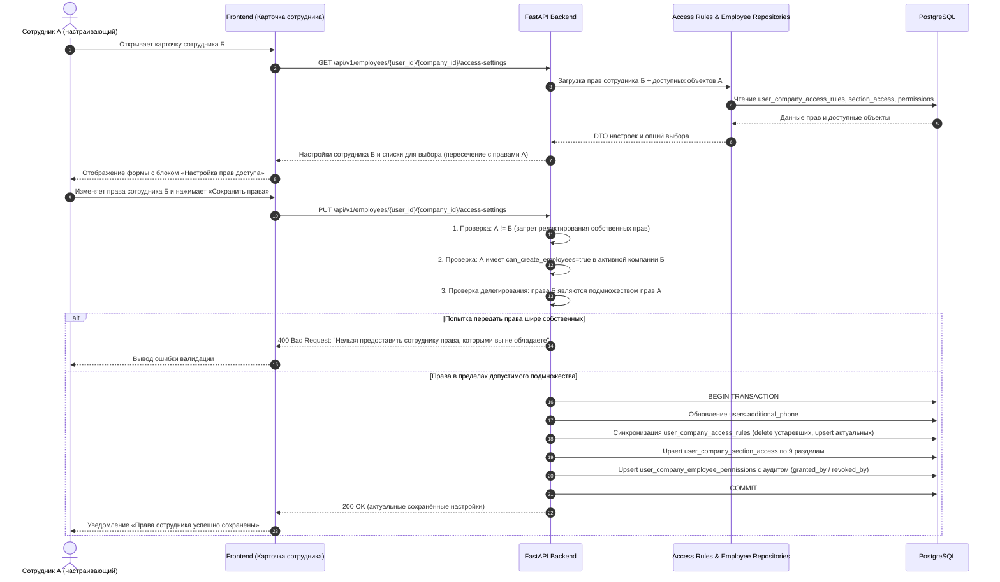
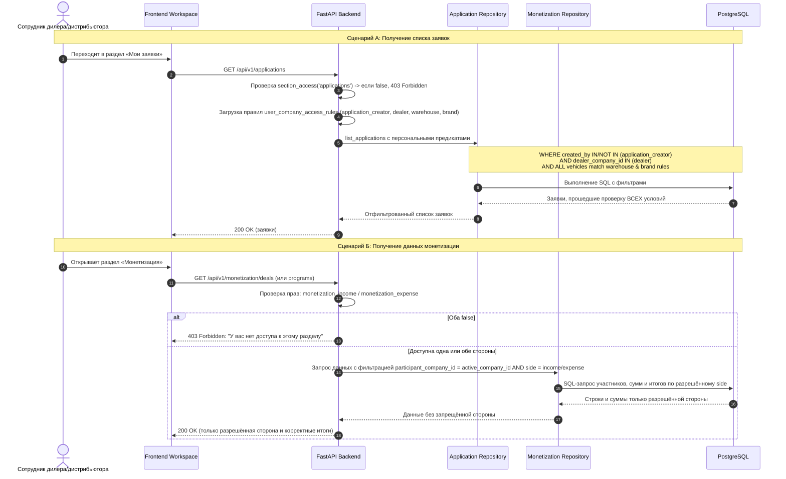

# Задача 21952 — Настройка персональных прав доступа сотрудников дилеров и дистрибьюторов

- **Bitrix:** https://carcraftpro.bitrix24.ru/workgroups/group/124/tasks/task/view/21952/
- **Ветка:** `feature/21952`
- **Источник:** ТЗ №36 версия 4 от 28.09.2026 (`/Users/a_belianskii/Downloads/№36 версия 4. Настройка персональных прав доступа сотрудников дилеров и дистрибьюторов от 28.09.2026.docx`)
- **Дата создания:** 28.09.2026 12:39:42 MSK (UTC+3)

---

## ER-диаграмма

```mermaid
erDiagram
    users {
        UUID id PK
        VARCHAR phone UK "основной телефон"
        VARCHAR additional_phone "НОВОЕ: дополнительный телефон varchar(20) nullable"
        VARCHAR name
        VARCHAR email
        user_role_enum role "глобальная роль"
        UUID company_id FK "legacy primary company"
        BOOLEAN is_active
        TIMESTAMPTZ created_at
        TIMESTAMPTZ updated_at
    }

    companies {
        UUID id PK
        VARCHAR name
        VARCHAR inn UK
        company_type_enum company_type
        BOOLEAN is_active
        TIMESTAMPTZ created_at
        TIMESTAMPTZ updated_at
    }

    user_companies {
        UUID id PK "НОВОЕ: суррогатный ключ UUID gen_random_uuid() UNIQUE"
        UUID user_id FK "пользователь"
        UUID company_id FK "компания"
        VARCHAR role "роль в компании: dealer, distributor, leasing_company, client"
        UUID position_id FK "должность"
        VARCHAR sub_role "суброль: administrator, manager, employee"
        BOOLEAN can_view_applications "базовое право просмотра заявок компании"
        BOOLEAN can_create_applications "базовое право создания заявок компании"
        BOOLEAN is_active "активность связи"
        TIMESTAMPTZ created_at
        TIMESTAMPTZ updated_at
    }

    user_company_access_rules {
        UUID id PK "НОВАЯ ТАБЛИЦА: персональные объектные правила"
        UUID user_company_id FK "FK -> user_companies.id ON DELETE CASCADE"
        VARCHAR access_object "warehouse, brand, dealer, dealer_warehouse, application_creator"
        VARCHAR access_type "all, selected, except_selected, none"
        VARCHAR object_id "ID объекта доступа (NULL для all и none)"
        VARCHAR object_name "Наименование объекта для отображения"
        BOOLEAN is_active "активность правила, default true"
        TIMESTAMPTZ created_at
        TIMESTAMPTZ updated_at
    }

    user_company_section_access {
        UUID id PK "НОВАЯ ТАБЛИЦА: доступ к разделам личного кабинета"
        UUID user_company_id FK "FK -> user_companies.id ON DELETE CASCADE"
        VARCHAR section_code "applications, warehouses, vehicle_exchange, employees, catalog_management, analytics, monetization_income, monetization_expense, incentive_programs"
        BOOLEAN can_view "true - доступ разрешен, false - запрещен"
        TIMESTAMPTZ created_at
        TIMESTAMPTZ updated_at
    }

    user_company_employee_permissions {
        UUID id PK "НОВАЯ ТАБЛИЦА: право управления сотрудниками"
        UUID user_company_id FK "FK -> user_companies.id ON DELETE CASCADE, UNIQUE"
        BOOLEAN can_create_employees "право создавать/настраивать сотрудников, default false"
        UUID granted_by_user_id FK "FK -> users.id, кто выдал право"
        TIMESTAMPTZ granted_at "дата и время выдачи"
        UUID revoked_by_user_id FK "FK -> users.id, кто отозвал право"
        TIMESTAMPTZ revoked_at "дата и время отзыва"
        TIMESTAMPTZ created_at
        TIMESTAMPTZ updated_at
    }

    warehouses {
        UUID id PK
        UUID company_id FK
        VARCHAR name
        VARCHAR address
        BOOLEAN is_active
    }

    mark {
        UUID id PK
        VARCHAR name
    }

    leasing_applications {
        UUID id PK
        UUID created_by FK "users.id автора заявки"
        UUID company_id FK "компания клиента"
        UUID dealer_company_id FK "дилер заявки"
        UUID vehicle_id FK "резервный источник ТС"
        VARCHAR status
        TIMESTAMPTZ created_at
    }

    application_vehicles {
        UUID id PK
        UUID application_id FK
        UUID vehicle_id FK
    }

    vehicles {
        UUID id PK
        UUID mark_id FK
        VARCHAR vin
    }

    vehicle_warehouses {
        UUID id PK
        UUID vehicle_id FK
        UUID warehouse_id FK
    }

    monetization_programs {
        UUID id PK
        UUID leasing_company_id FK
        UUID dealer_company_id FK
        UUID distributor_company_id FK
        VARCHAR name
        VARCHAR status
    }

    monetization_program_sources {
        UUID id PK
        UUID program_id FK
        VARCHAR source_type
    }

    monetization_program_source_participants {
        UUID id PK
        UUID program_source_id FK
        VARCHAR local_id
        VARCHAR side "income или expense"
        VARCHAR participant_type
    }

    monetization_deal_participant_amounts {
        UUID id PK
        UUID deal_id FK
        UUID program_source_id FK
        UUID source_participant_id FK
        UUID participant_company_id FK
        VARCHAR side "income или expense"
        NUMERIC amount
    }

    users ||--o{ user_companies : "user_id"
    companies ||--o{ user_companies : "company_id"
    user_companies ||--o{ user_company_access_rules : "user_company_id"
    user_companies ||--o{ user_company_section_access : "user_company_id"
    user_companies ||--o| user_company_employee_permissions : "user_company_id"
    users ||--o{ user_company_employee_permissions : "granted_by_user_id"
    users ||--o{ user_company_employee_permissions : "revoked_by_user_id"
    users ||--o{ leasing_applications : "created_by"
    companies ||--o{ warehouses : "company_id"
    companies ||--o{ leasing_applications : "dealer_company_id"
    leasing_applications ||--o{ application_vehicles : "application_id"
    vehicles ||--o{ application_vehicles : "vehicle_id"
    mark ||--o{ vehicles : "mark_id"
    vehicles ||--o{ vehicle_warehouses : "vehicle_id"
    warehouses ||--o{ vehicle_warehouses : "warehouse_id"
    monetization_programs ||--o{ monetization_program_sources : "program_id"
    monetization_program_sources ||--o{ monetization_program_source_participants : "program_source_id"
    monetization_program_sources ||--o{ monetization_deal_participant_amounts : "program_source_id"
    monetization_program_source_participants ||--o{ monetization_deal_participant_amounts : "source_participant_id"
```

---

## Диаграммы последовательности

### 1. Настройка и сохранение прав сотрудника с валидацией делегирования

### 2. Применение персональных правил доступа при чтении заявок и монетизации

---

## 1. Постановка задачи

Необходимо реализовать персональную настройку прав доступа сотрудников дилеров и дистрибьюторов в рамках конкретной компании. Один пользователь может быть связан с несколькими компаниями (`user_companies`), поэтому все настройки прав должны сохраняться и применяться изолированно для каждой связки пользователя с компанией — `user_companies.id`.

### Ключевые требования:
1. **Идентификатор связи компании:** Обеспечить наличие уникального `id` (`UUID gen_random_uuid()`) в таблице `user_companies` как внешнего ключа для всех дочерних таблиц персональных прав.
2. **Блок настройки прав в карточке сотрудника:**
   - Отображение блока «Настройка прав доступа» в форме создания/редактирования сотрудника.
   - Разграничение права настройки: доступно администратору платформы CarCraft (`carcraft_employee`) и сотрудникам компании с флагом `can_create_employees = true`.
   - Запрет редактирования собственных прав пользователем (себя редактировать нельзя).
   - Поле «Дополнительный телефон» (`users.additional_phone`, `varchar(20)`, nullable).
   - Поле «Разрешено создавать сотрудников» (`can_create_employees`) с аудитом выдачи/отзыва.
3. **Объектные правила доступа (`user_company_access_rules`):**
   - Типы объектов: `warehouse`, `brand`, `dealer`, `dealer_warehouse`, `application_creator`.
   - Режимы доступа: `all`, `selected`, `except_selected`, `none`.
   - Для дилера: склады, марки, заявки сотрудников.
   - Для дистрибьютора: дилеры, склады дистрибьютора, склады дилеров, марки дистрибьютора, заявки сотрудников.
   - Множественный выбор через поиск (без единовременной загрузки всего справочника).
4. **Доступ к разделам (`user_company_section_access`):**
   - 9 системных кодов: `applications`, `warehouses`, `vehicle_exchange`, `employees`, `catalog_management`, `analytics`, `monetization_income`, `monetization_expense`, `incentive_programs`.
   - Виртуальный управляющий чекбокс `all_sections` в UI.
   - Обратная совместимость: при отсутствии записей разделы работают по базовой роли.
   - Снятый чекбокс скрывает пункт меню, блокирует маршруты фронтенда и возвращает HTTP 403 («У вас нет доступа к этому разделу») на API.
5. **Ограничение делегирования прав (анти-эскалация привилегий):**
   - Сотрудник А не может предоставить сотруднику Б права шире, чем есть у самого сотрудника А.
   - Эффективные права сотрудника Б являются строгим подмножеством прав сотрудника А (пересечение базовых прав компании Б и эффективных прав сотрудника А).
   - Администратор платформы CarCraft не ограничивается данным правилом.
   - Проверка на стороне backend при каждом создании или изменении сотрудника.
6. **Применение правил к заявкам:**
   - Заявка доступна только при выполнении всех условий: раздел `applications` разрешён, `can_view_applications = true`, автор соответствует `application_creator`, дилер соответствует `dealer`, и **каждое** ТС заявки соответствует правилам `warehouse`, `dealer_warehouse` и `brand`.
   - Отсутствие персонального правила возвращает базовый доступ компании.
7. **Специальная логика монетизации:**
   - Независимые права `monetization_income` и `monetization_expense`.
   - Если оба `false` — раздел скрыт, API возвращает 403.
   - Если разрешена одна сторона — возвращаются только строки участников и рассчитанные суммы со значением `side = income` или `side = expense` для активной компании пользователя. Данные чужой стороны не попадают в API и не участвуют в итоговых суммах. Программа скрывается, если после фильтрации не осталось доступных участников/сумм.

---

## 2. Детальные требования и спецификация схемы БД

### 2.1. Изменения существующих таблиц

#### Таблица `users`:
- Добавить колонку `additional_phone VARCHAR(20) NULL`.
- Поле необязательное, предназначено только для ввода, сохранения и отображения в карточке сотрудника. Не участвует в авторизации, поиске, SMS и валидации уникальности.

#### Таблица `user_companies`:
- В текущей миграции 138 таблица `user_companies` имеет составной первичный ключ `(user_id, company_id)`.
- Добавить колонку `id UUID NOT NULL DEFAULT gen_random_uuid() UNIQUE`.
- Сохранить составной первичный ключ `(user_id, company_id)` или перевести его в `UNIQUE` ограничение, сделав `id` первичным ключом. Внешние ключи новых таблиц ссылаются на `user_companies(id) ON DELETE CASCADE`.

### 2.2. Новые таблицы

#### 1. Таблица `user_company_access_rules`
Хранит персональные объектные правила доступа.
- `id UUID PRIMARY KEY DEFAULT gen_random_uuid()`
- `user_company_id UUID NOT NULL REFERENCES user_companies(id) ON DELETE CASCADE`
- `access_object VARCHAR(50) NOT NULL` — допустимые значения: `'warehouse'`, `'brand'`, `'dealer'`, `'dealer_warehouse'`, `'application_creator'`.
- `access_type VARCHAR(30) NOT NULL` — допустимые значения: `'all'`, `'selected'`, `'except_selected'`, `'none'`.
- `object_id VARCHAR(100) NULL` — ID конкретного объекта (для `all` и `none` равен `NULL`).
- `object_name VARCHAR(255) NULL` — денормализованное наименование объекта для отображения.
- `is_active BOOLEAN NOT NULL DEFAULT true`
- `created_at TIMESTAMPTZ NOT NULL DEFAULT now()`
- `updated_at TIMESTAMPTZ NOT NULL DEFAULT now()`

**Индексы и ограничения:**
- Однородность `access_type`: для пары `(user_company_id, access_object)` все активные записи обязаны иметь одинаковый `access_type`.
- Уникальность:
  - Частичный уникальный индекс для конкретных объектов: `CREATE UNIQUE INDEX uq_uc_access_rules_obj ON user_company_access_rules (user_company_id, access_object, access_type, object_id) WHERE object_id IS NOT NULL;`
  - Частичный уникальный индекс для общих режимов: `CREATE UNIQUE INDEX uq_uc_access_rules_null ON user_company_access_rules (user_company_id, access_object) WHERE object_id IS NULL;`

#### 2. Таблица `user_company_section_access`
Хранит персональную видимость разделов личного кабинета.
- `id UUID PRIMARY KEY DEFAULT gen_random_uuid()`
- `user_company_id UUID NOT NULL REFERENCES user_companies(id) ON DELETE CASCADE`
- `section_code VARCHAR(50) NOT NULL` — допустимые коды:
  - `applications`
  - `warehouses`
  - `vehicle_exchange`
  - `employees`
  - `catalog_management`
  - `analytics`
  - `monetization_income`
  - `monetization_expense`
  - `incentive_programs`
- `can_view BOOLEAN NOT NULL`
- `created_at TIMESTAMPTZ NOT NULL DEFAULT now()`
- `updated_at TIMESTAMPTZ NOT NULL DEFAULT now()`

**Индексы и ограничения:**
- Уникальный ключ: `UNIQUE (user_company_id, section_code)`.

#### 3. Таблица `user_company_employee_permissions`
Хранит право создания и редактирования сотрудников с историей аудита.
- `id UUID PRIMARY KEY DEFAULT gen_random_uuid()`
- `user_company_id UUID NOT NULL UNIQUE REFERENCES user_companies(id) ON DELETE CASCADE`
- `can_create_employees BOOLEAN NOT NULL DEFAULT false`
- `granted_by_user_id UUID NULL REFERENCES users(id) ON DELETE SET NULL`
- `granted_at TIMESTAMPTZ NULL`
- `revoked_by_user_id UUID NULL REFERENCES users(id) ON DELETE SET NULL`
- `revoked_at TIMESTAMPTZ NULL`
- `created_at TIMESTAMPTZ NOT NULL DEFAULT now()`
- `updated_at TIMESTAMPTZ NOT NULL DEFAULT now()`

---

## 3. Архитектура Backend (FastAPI)

### 3.1. Модели SQLAlchemy
В каталоге `backend/infrastructure/models/`:
- В `backend/infrastructure/models/users.py`:
  - Добавить в `User`: `additional_phone: Mapped[str | None] = mapped_column(sa.String(20), nullable=True)`
  - Добавить в `UserCompany`: `id: Mapped[uuid.UUID] = mapped_column(PGUUID(as_uuid=True), primary_key=True, default=uuid.uuid4, server_default=sa.text("gen_random_uuid()"))`
- Создать `backend/infrastructure/models/user_company_access.py` (или включить в `users.py`):
  - `UserCompanyAccessRule`
  - `UserCompanySectionAccess`
  - `UserCompanyEmployeePermission`

### 3.2. Репозитории и слой данных
В `backend/infrastructure/repositories/user_company_access_repository.py`:
- `get_user_company_access_rules(session, user_company_id) -> list[UserCompanyAccessRule]`
- `get_user_company_section_access(session, user_company_id) -> dict[str, bool]`
- `get_employee_permission(session, user_company_id) -> UserCompanyEmployeePermission | None`
- `save_full_employee_access(...)`:
  - Выполняется в единой транзакции `async with session.begin_nested()` / `session.begin()`.
  - Валидация делегирования.
  - Синхронизация записей `user_company_access_rules`.
  - Upsert записей `user_company_section_access` для всех 9 кодов.
  - Обновление `user_company_employee_permissions` с фиксацией `granted_by_user_id` / `revoked_by_user_id` и таймстемпов.
  - Обновление `users.additional_phone`.

### 3.3. Логика проверки прав и делегирования (Delegation Enforcement)
В `backend/application/services/access_delegation.py`:
- Функция `validate_delegation(session, *, granter_user_id, granter_role, granter_company_id, target_user_company_id, target_rules, target_sections, target_can_create_employees)`:
  1. Если `granter_role == "carcraft_employee"` — делегирование не ограничивается, разрешено всё.
  2. Проверка прав грантера: у него должен быть `can_create_employees == true` для `granter_company_id`.
  3. Проверка целевого сотрудника: `target_user_company.company_id == granter_company_id`. Запрещено настраивать сотрудников чужих компаний.
  4. Проверка запрета изменения собственных прав: `target_user_company.user_id != granter_user_id`.
  5. Для каждого типа объекта (`warehouse`, `brand`, `dealer`, `dealer_warehouse`, `application_creator`):
     - Получить эффективный список объектов, разрешённых грантеру А.
     - Вычислить эффективный список объектов, предлагаемых сотруднику Б.
     - Если режим Б — `all` или `except_selected`, но грантеру А доступны не все объекты компании — запретить (ошибка: «Нельзя предоставить сотруднику права, которыми вы не обладаете»).
     - Если режим Б — `selected`, проверить, что каждый `object_id` входит в разрешённые для А (за исключением собственного `user_id` сотрудника Б в `application_creator`, который разрешён всегда).
  6. Для доступных разделов: Б не может получить `can_view = true` для раздела, который недоступен грантеру А.
  7. Для флага `can_create_employees`: Б может получить `true` только если у А `can_create_employees == true`.

### 3.4. API Эндпоинты
В `backend/presentation/routers/employees.py`:
1. `GET /api/v1/employees/{user_id}/{company_id}/access-settings`
   - Возвращает текущие настройки прав сотрудника (`user_company_id`), а также допустимые для выбора списки объектов (с учётом прав текущего пользователя А).
2. `PUT /api/v1/employees/{user_id}/{company_id}/access-settings`
   - Принимает тело с объектными правилами, списком разделов, флагом `can_create_employees`, `additional_phone`.
   - Проверяет делегирование и сохраняет всё в единой транзакции.
3. Модификация существующих эндпоинтов:
   - `POST /api/v1/employees` — проверка `can_create_employees` у вызывающего; поддержка `additional_phone`.
   - `PUT /api/v1/employees/{user_id}/{company_id}` — проверка `can_create_employees`; поддержка `additional_phone`.
   - `PATCH /api/v1/employees/{user_id}/{company_id}/deactivate` — проверка `can_create_employees`.
4. Вспомогательные поисковые эндпоинты для селектов прав (с фильтрацией по правам грантера):
   - `GET /api/v1/employees/lookup/warehouses?company_id=...&q=...`
   - `GET /api/v1/employees/lookup/brands?company_id=...&q=...`
   - `GET /api/v1/employees/lookup/dealers?distributor_company_id=...&q=...`
   - `GET /api/v1/employees/lookup/colleagues?company_id=...&q=...`

### 3.5. Интеграция с фильтрацией заявок
В `backend/infrastructure/repositories/leasing_application_repository.py` и `backend/application/queries/applications/list_applications.py`:
- При запросе заявок пользователем роли `dealer` или `distributor`:
  1. Загрузить активные `user_company_access_rules` для `(actor_user_id, actor_company_id)`.
  2. Если правил нет — применять базовые правила компании (`warehouse_access_rules`, `dealer_groups`, `distributor_brands`).
  3. Если есть персональные правила:
     - `application_creator`:
       - `all` -> без доп. фильтра по автору среди сотрудников компании;
       - `selected` -> `leasing_applications.created_by.in_(selected_user_ids)`;
       - `except_selected` -> `leasing_applications.created_by.not_in_(excluded_user_ids)`;
       - `none` -> вернуть пустой результат `[]`.
     - `dealer` (для дистрибьютора):
       - `selected` -> `leasing_applications.dealer_company_id.in_(selected_dealer_ids)`.
     - `warehouse` / `dealer_warehouse` и `brand`:
       - Проверка по каждому ТС заявки: каждое ТС заявки (`application_vehicles` или резервный `leasing_applications.vehicle_id`) обязано иметь склад из разрешённых складов и марку из разрешённых марок.
       - Заявки, содержащие хотя бы одно несоответствующее ТС (или ТС без определяемого склада/марки при наличии ограничений), исключаются из выдачи, подсчёта счётчиков и прямых запросов.

### 3.6. Интеграция с разделом «Монетизация»
В `backend/presentation/routers/monetization.py` и `backend/application/queries/monetization/`:
- Получить флаги `monetization_income` и `monetization_expense` для активной компании пользователя.
- Если оба `false`: возвращать `403 Forbidden` («У вас нет доступа к этому разделу»).
- Если разрешён только `income`: фильтровать участников и суммы с условием `side = 'income'`.
- Если разрешён только `expense`: фильтровать участников и суммы с условием `side = 'expense'`.
- Если разрешены оба: полный доступ.
- Проверять принадлежность: `participant_company_id == active_company_id` (или `participant_type + local_id`). Не возвращать строки других компаний.
- Исключать запрещённые стороны из расчёта сумм и итогов.
- Скрывать программы, у которых после фильтрации не осталось доступных участников/сумм.

### 3.7. Интеграция видимости разделов
В `backend/presentation/routers/section_visibility.py`:
- В `/workspace/section-visibility` обогащать ответ с учётом записей `user_company_section_access` текущего `(user_id, active_company_id)`.
- Если для раздела установлено `can_view = false`, переопределять видимость в `false`.
- В защитных зависимостях API соответствующих разделов (`applications`, `warehouses`, `vehicle_exchange`, `employees`, `catalog_management`, `analytics`, `monetization`, `incentive_programs`) внедрить проверку доступа к разделу, возвращающую 403 при запрете.

---

## 4. Архитектура Frontend (Nuxt 3 / Vue 3)

### 4.1. Обновление формы сотрудника (`EmployeeFormModal.vue`)
1. **Поле «Дополнительный телефон»:**
   - Расположено под полем «Телефон».
   - Необязательное текстовое поле ввода формата телефона.
   - Значение связывается с `form.additional_phone`.
2. **Переключатель «Разрешено создавать сотрудников» (`can_create_employees`):**
   - Переключатель (Toggle switch) «Да / Нет».
   - Доступен для изменения администратором CarCraft или сотрудником с `can_create_employees = true`. Для остальных — скрыт или заблокирован (disabled).
3. **Блок «Настройка прав доступа»:**
   - Отображается в нижней части модального окна.
   - Для сотрудника дилера:
     - Доступ к складам (select: Все склады / Только выбранные / Все, кроме выбранных / Нет доступа).
     - Поиск и множественный выбор складов (при выбранных режимах).
     - Доступ к маркам (select: Все марки / Только выбранные / Все, кроме выбранных / Нет доступа).
     - Поиск и множественный выбор марок.
     - Доступ к заявкам сотрудников (select: Только свои заявки / Все заявки компании / Свои и выбранных сотрудников / Все, кроме выбранных сотрудников).
     - Поиск и множественный выбор сотрудников.
   - Для сотрудника дистрибьютора:
     - Доступ к дилерам (Все дилеры / Только выбранные дилеры / Нет доступа).
     - Доступ к складам дистрибьютора.
     - Доступ к складам дилеров.
     - Доступ к маркам дистрибьютора.
     - Доступ к заявкам сотрудников.
   - Поиск объектов: асинхронный поиск с дебаунсом через lookup API, без выгрузки всего справочника разом.
   - Валидация формы:
     - При режимах «Только выбранные» или «Свои и выбранных сотрудников» обязателен выбор минимум 1 объекта.
     - При режиме «Все, кроме выбранных» и пустом выборе сохраняется режим «Все».
4. **Подраздел «Доступные разделы»:**
   - Сетка чекбоксов:
     - Заявки (`applications`)
     - Склады (`warehouses`)
     - Биржа (`vehicle_exchange`)
     - Сотрудники (`employees`)
     - Управление каталогом (`catalog_management`)
     - Аналитика (`analytics`)
     - Монетизация (доход) (`monetization_income`)
     - Монетизация (расход) (`monetization_expense`)
     - Программы стимулирования (`incentive_programs`)
   - Управляющий чекбокс «Все разделы» (`all_sections`):
     - При установке выбирает все разделы, доступные настраивающему пользователю.
     - При снятии сбрасывает все чекбоксы.
     - Автоматически синхронизируется при индивидуальном переключении чекбоксов.
   - Недоступные настраивающему разделы блокируются (disabled) и не могут быть выбраны.
5. **Кнопка «Сохранить права»:**
   - Отправка единого запроса на сохранение всех настроек.

### 4.2. Список сотрудников (`EmployeesTab.vue`)
- Кнопка «Создать сотрудника» скрывается, если у текущего пользователя `can_create_employees == false`.
- В таблице сотрудников:
  - Если `can_create_employees == false`, действия редактирования и настройки прав скрываются.
  - Для строки самого себя (текущего пользователя) действие редактирования прав заблокировано/скрыто (пользователь не может менять свои права).
  - При попытке перехода по прямой ссылке на редактирование неавторизованным пользователем выводится уведомление об ограничении доступа.

### 4.3. Навигация и защита маршрутов (`WorkspaceSidebar.vue`, middleware)
- Элементы меню скрываются при `can_view == false` для соответствующего раздела.
- Добавлено middleware для маршрутов `/workspace/*`: при попытке перехода по прямой ссылке в запрещённый раздел выводится сообщение:
  > «У вас нет доступа к этому разделу»

### 4.4. Раздел «Монетизация»
- Если `monetization_income == false && monetization_expense == false`: раздел скрыт, роут блокируется.
- Если доступен только один из флагов:
  - Скрываются вкладки/фильтры недоступной стороны.
  - Графики и таблицы отображают только разрешённый `side`.
  - Все итоговые карточки рассчитываются исключительно по разрешённой стороне.

---

## 5. План реализации по шагам

1. **Миграция БД Alembic:**
   - Создать ревизию `139_user_company_personal_access_rules.py`.
   - Добавить `additional_phone` в `users`.
   - Добавить `id` в `user_companies` (`UUID DEFAULT gen_random_uuid() UNIQUE NOT NULL`).
   - Создать таблицы `user_company_access_rules`, `user_company_section_access`, `user_company_employee_permissions` со всеми внешними ключами, индексами и констрейнтами.
   - Проверить `alembic check` и `alembic upgrade head`.

2. **Backend: Модели и схемы:**
   - Обновить ORM-модели `User`, `UserCompany` в `backend/infrastructure/models/users.py`.
   - Создать ORM-модели для новых таблиц.
   - Добавить Pydantic-схемы в `backend/presentation/schemas/employees.py` для настроек доступа, разделов, lookup-ответов и аудита прав.

3. **Backend: Сервис делегирования и репозиторий прав:**
   - Реализовать `backend/application/services/access_delegation.py` с проверкой подмножества прав и запретом превышения привилегий.
   - Реализовать методы репозитория для чтения и транзакционного сохранения настроек сотрудника.

4. **Backend: Роутер сотрудников и Lookup API:**
   - Добавить эндпоинты `GET` и `PUT` `/api/v1/employees/{user_id}/{company_id}/access-settings`.
   - Реализовать эндпоинты поиска объектов с ограничением по правам вызывающего.
   - Добавить проверку `can_create_employees` в роутере сотрудников.

5. **Backend: Фильтрация заявок и монетизации:**
   - Интегрировать персональные правила в `leasing_application_repository.py` и `list_applications.py`.
   - Интегрировать фильтрацию по `side` и `active_company_id` в `monetization.py`.
   - Интегрировать проверку разделов в `section_visibility.py` и middleware/dependencies.

6. **Frontend: Карточка сотрудника и права:**
   - Добавить поле дополнительного телефона в `EmployeeFormModal.vue`.
   - Добавить переключатель `can_create_employees`.
   - Реализовать блок «Настройка прав доступа» с динамическими выпадающими списками и асинхронным поиском объектов.
   - Реализовать блок «Доступные разделы» с мастер-чекбоксом «Все разделы».
   - Интегрировать API сохранения настроек.

7. **Frontend: Ограничение интерфейса и навигация:**
   - Скрыть создание и редактирование сотрудников в `EmployeesTab.vue` для пользователей без `can_create_employees`.
   - Заблокировать редактирование собственных прав.
   - Обновить сайдбар `WorkspaceSidebar.vue` и роутер-гарды для скрытия/блокировки недоступных разделов.
   - Настроить страницы монетизации на корректную фильтрацию по разрешённому `side`.

8. **Проверка и тестирование:**
   - Статические проверки: `uv run ruff check . --fix`, `uv run lint-imports`, `uv run mypy .`.
   - Проверка Alembic: `uv run alembic upgrade head && uv run alembic check`.
   - E2E сценарии в Playwright на сквозные сценарии:
     * Создание сотрудника с ограничением прав дилера и дистрибьютора.
     * Проверка анти-эскалации (попытка выдать права шире собственных -> 400).
     * Проверка скрытия разделов и сообщения «У вас нет доступа к этому разделу».
     * Проверка монетизации: фильтрация дохода и расхода по `side`.
     * Проверка фильтрации заявок по автору, дилеру, марке и складу каждого ТС.

---

## 6. Критерии готовности (Acceptance Criteria)

- [x] В таблице `users` создано поле `additional_phone` (`varchar(20)`, nullable), корректно сохраняется и отображается в карточке сотрудника без дополнительной логики валидации или SMS.
- [x] В таблице `user_companies` обеспечен уникальный `id: UUID`, на который ссылаются новые таблицы прав доступа.
- [x] Созданы таблицы `user_company_access_rules`, `user_company_section_access`, `user_company_employee_permissions` со всеми необходимыми индексами и каскадным удалением при удалении связи `user_companies`.
- [x] Права сохраняются строго изолированно для конкретного `user_companies.id`.
- [x] Пользователь с `can_create_employees = false` видит список сотрудников своей компании, но не видит кнопок создания, редактирования и изменения прав.
- [x] Пользователь с `can_create_employees = true` может настраивать сотрудников только своей активной компании и не может редактировать сотрудников других компаний.
- [x] Пользователь не может изменять свои собственные права доступа.
- [x] Реализовано ограничение делегирования прав: сотрудник А не может передать сотруднику Б права шире собственных; при попытке backend возвращает ошибку «Нельзя предоставить сотруднику права, которыми вы не обладаете».
- [x] При каждой выдаче и отзыве права `can_create_employees` сохраняются `granted_by_user_id` / `revoked_by_user_id` и таймстемпы.
- [x] Снятый чекбокс раздела скрывает его в меню, блокирует прямой переход по URL с сообщением «У вас нет доступа к этому разделу» и блокирует вызовы API раздела с HTTP 403.
- [x] Отсутствие новых персональных записей для ранее созданных сотрудников не ломает их базовый доступ (обратная совместимость).
- [x] Права `monetization_income` и `monetization_expense` корректно изолируют данные по `side`:
  - при наличии только `monetization_income` возвращаются только участники и суммы со значением `side = income`;
  - при наличии только `monetization_expense` возвращаются только данные со значением `side = expense`;
  - если у программы не осталось разрешённых данных, она скрывается;
  - суммы и выгрузки не содержат запрещённую сторону.
- [x] Фильтрация заявок проверяет: доступность раздела `applications`, флаг `can_view_applications`, соответствие автора (`application_creator`), дилера (`dealer`) и **каждого** ТС заявки ограничениям по складу и марке.
- [x] Ошибки сохранения обрабатываются в единой транзакции с полным откатом (нет частичного сохранения прав).
- [x] Проверки `uv run ruff check .`, `uv run lint-imports`, `uv run mypy .` проходят без ошибок.
- [x] Проверка `uv run alembic check` возвращает `No new upgrade operations detected.`
- [x] Сквозные сценарии E2E успешно выполнены.

---

## 7. Результаты проверок и Merge Request

- **Merge Request:** [!475](https://gitlab.carcraft.ru/carcraft/carcraft-leadgenerator/-/merge_requests/475)
- **Целевая ветка:** `test`
- **Проверки:**
  - `uv run ruff check . --fix`: All checks passed.
  - `uv run lint-imports`: Analyzed 992 files, 7443 dependencies. 9 kept, 0 broken.
  - `uv run mypy .`: Success: no issues found in 1142 source files.
  - `uv run alembic check`: No new upgrade operations detected.
  - Playwright E2E (`tests/e2e/workspace/21952-personal-access-rules.spec.ts`): 1 passed (2.6m).
