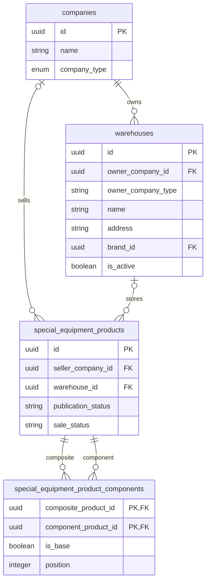
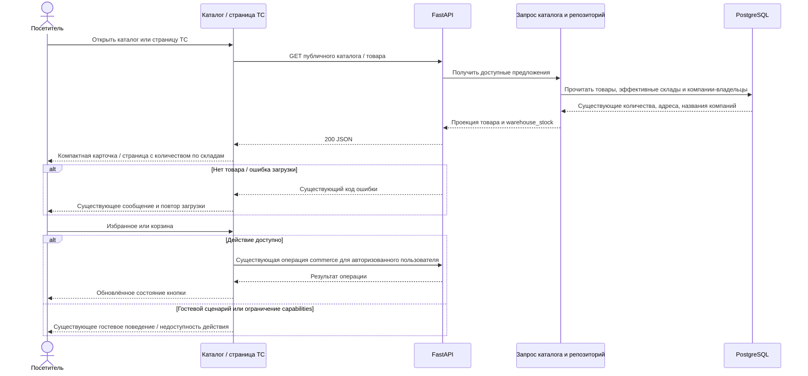

# Bitrix 22386 — компактная карточка и страница ТС

- Задача: https://carcraftpro.bitrix24.ru/workgroups/group/124/tasks/task/view/22386/
- Источник требований: приложенное пользователем изображение `carcraftpro.bitrix24.ru_workgroups_group_124_tasks_task_view_22386_ (1).png`. Страница Bitrix недоступна веб-инструменту; дополнительные требования или комментарии из неё не подтверждены.
- Ветка: `feature/22386`, база: `origin/test`, коммит `76a859d9b2b017b8a0499cc25189ae3383443695`.
- Создано: 2026-09-28 13:38:43 MSK (UTC+3).
- Статус: спецификация подтверждена пользователем сообщением «Давай реализуем» после уточнения минимальной backend-части; реализация и локальные проверки завершены.
- Рабочий каталог: `/home/dalivan/carcraft/carcraft-leadgenerator-22386`.

ERD показывает существующие связи по актуальным ORM-моделям `companies.py`, `vehicles.py`, `special_equipment.py` и миграциям, включая `128_warehouse_access_rules_and_fields.py`. Схема БД не меняется. Планируется дополнить публичную проекцию складского наличия названием владельца склада из `companies.name` через `warehouses.owner_company_id`. Для составного предложения сохраняется действующее определение склада базового компонента. `brand_id` ссылается на существующий справочник марок, не является названием дилера. Для проверки наличия на двух складах используется один дилер: действующее правило требует совпадения владельца склада и продавца объявления, а продавец входит в ключ группировки предложения. Название дилера в интерфейсе по-прежнему берётся из фактической компании-владельца каждого склада.

## Постановка

Уменьшить высоту карточки ТС в каталоге за счёт перекомпоновки информации. На странице ТС упорядочить базовые параметры, сократить блок действий и объединить информацию о наличии с названиями дилеров и адресами складов.

Действующая реализация показанных на изображении поверхностей находится в `frontend/features/specialEquipment/`. Старый `features/cars/components/CarCard.vue` не является целевым компонентом этой задачи.

## Требования к карточке каталога

1. Перенести статус «В наличии» из нижней левой части изображения в верхнюю часть карточки. Сохранить корректные подписи остальных статусов: «Под заказ», «Зарезервировано», «Продано», «Недоступно».
2. Освободить прежнее место статуса у нижнего края изображения под шильдик поддержки. Не размещать там другие метаданные и не показывать постоянную подпись «Шильдик поддержки» как фиктивную программу.
3. Перенести кнопку избранного в правый верхний угол всей карточки. Сохранить состояние, доступность по `capabilities`, индикатор выполнения, имя для скринридера и клавиатурный фокус.
4. Объединить марку и модель в один заголовок: марка перед моделью, одинаковые крупный размер и насыщенность шрифта. Для длинного названия разрешён естественный перенос общего заголовка без обрезания данных и перекрытия избранного.
5. Перенести сведения о складе вниз влево относительно цены, перед нижним рядом кнопок. Использовать существующие адреса и количества по складам; убрать дублирующее количество из верхней строки, как показано зачёркиванием на макете.
6. Перенести цену вправо над кнопкой «В корзину». Сохранить текущие режимы цены: обычная, специальная с зачёркнутой базовой, «Цена по запросу» и «от N ₽».
7. Выводить до шести кратких характеристик в сетке из трёх колонок: при шести значениях два ряда по три. Сохранить серверный порядок и подписи/единицы измерения. Пустые значения не должны создавать пустые строки или ячейки; значимые `0` и логические значения не отбрасывать проверкой truthiness.
8. Уменьшить вертикальные отступы между заголовком, параметрами, ценой и кнопками; убрать пустые блоки и искусственные распорки. Изображение сохранить целиком через `object-contain`.
9. Сохранить «Подробнее», добавление/удаление из корзины, состояние избранного, ссылки текущей витрины и сообщения об ограничениях. На макете цвет салона зачёркнут: убрать его из краткой карточки, сохранив на странице ТС.

### Уточнение о поддержке

В текущем публичном контракте `SpecialEquipmentProductCard` нет списка программ поддержки; в целевой карточке шильдик сейчас не реализован. Формулировка «оставить под шильдик поддержки» трактуется как требование к размещению: нижняя левая область изображения освобождается для поддержки, без пустой строки фиксированной высоты. Подключение нового источника программ и изменение расчёта применимости/цен в эту задачу не входят. Это допущение вынесено на согласование вместе со спецификацией; при необходимости реального отображения программ объём будет уточнён в этом же файле до реализации.

## Требования к странице ТС

1. Первыми вывести базовые параметры строго в порядке: «Категория», «Состояние», «Год выпуска», «Цвет кузова». Отсутствующие необязательные значения не оставляют пустых строк. Сведения о цвете салона, пробеге, моточасах и владельцах сохраняются после этих четырёх параметров, если доступны. По уточнению пользователя отдельная строка «Комплектация» из этого блока удаляется; название комплектации в подзаголовке и её подробные характеристики сохраняются.
2. Убрать со страницы кнопки прямого оформления «Оформить в лизинг» и онлайн-оплаты (текущее название «Купить онлайн»). Оформление через корзину сохраняется.
3. Сделать избранное компактной квадратной кнопкой только с иконкой сердца, расположенной слева от основной кнопки корзины. Сохранить доступное название, `aria-pressed`, индикатор выполнения и запреты по capabilities.
4. Основную кнопку корзины оформить акцентной и занять ею остальную ширину ряда. Разместить этот ряд в блоке покупки под ценой и перед блоком количества, как указывает стрелка на изображении. Сохранить обратное действие удаления и состояние выполнения.
5. Для каждого склада с доступным количеством показывать название дилера/компании-владельца, адрес склада и количество в штуках. Название компании брать из API, не подменять маркой ТС, названием склада или продавцом другого предложения.
6. Объединить перечисленные сведения с текущим блоком выбора количества. Удалить отдельный дублирующий блок «Остатки по складам» и слово «остатки» в этой части интерфейса. По уточнению пользователя убрать заголовок «Количество техники» и дублирующую общую строку «В наличии: N шт.», если уже показаны складские строки: количество показывается один раз для каждого склада, общий контрол выбора сохраняется. При отсутствии складских строк сохранить единственное сообщение о наличии либо оформлении под заказ.
7. При нескольких складах вывести все строки с их собственными количествами; суммарное наличие и лимит общего выбора количества сохраняют существующую семантику. Для «Под заказ» без складских строк оставить понятное текущее сообщение без пустого списка складов.
8. Не менять правила комплектов/навесного оборудования, резервов, оформления через корзину, цены, авторизации и расчёта доступности. Удалить обработчики и состояние прямого оформления только там, где после удаления кнопок они действительно не используются.

## Изменения API и данных

- Дополнить `warehouse_stock[]` публичным полем `owner_company_name: string` для действительного имени компании-владельца склада.
- Заполнить поле и для списка каталога, и для страницы товара: в пакетной загрузке складов и `list_warehouse_stock()` репозитория.
- Не создавать запрос на компанию для каждой карточки/каждого склада: добавить присоединение `companies` в существующие запросы.
- Сохранить фильтры публикации, доступности и действующее ограничение количества; не раскрывать закрытые склады или дополнительные реквизиты компании.
- Обновить Pydantic-схему и TypeScript-контракт; UUID передавать как непрозрачные строки без числовых преобразований и подстановок из других полей.
- Изменений ORM-моделей и миграций не планируется. Если обязательная проверка Alembic выявит расхождение, сначала установить причину и исправить её без `stamp` и фильтров сокрытия.

## План реализации после подтверждения

Работу выполнить максимально параллельно в четырёх доступных слотах, не редактируя одновременно одни и те же файлы:

1. Подагент A — `SpecialEquipmentProductCard.vue`: компоновка карточки, статусы, заголовок, краткие параметры, склад, цена и избранное.
2. Подагент B — `SpecialEquipmentProductPage.vue` и `SpecialEquipmentActions.vue`: порядок параметров, расположение действий, компактное избранное, объединённый блок наличия; проверить существующие обработчики и использование компонента действий.
3. Подагент C — `backend/infrastructure/repositories/special_equipment_repository.py`, `backend/presentation/schemas/special_equipment.py`, `frontend/features/specialEquipment/types.ts`: данные компании-владельца и согласованный API-контракт. При необходимости минимально затронуть приложение-запрос, сохраняя слоистые контракты.
4. Основной агент — целевые E2E и фикстуры, интеграция результатов, Docker, проверки, review, MR в `test` и merge после успешных обязательных этапов.

Все изменения требований, результатов и проверок фиксировать в этой спецификации. Отдельные планы и отчёты не создавать.

## Критерии готовности и проверки

- Каждый пункт карточки и страницы из изображения сопоставлен с реализацией; допущения спецификации согласованы.
- В браузере проверить каталог → страницу ТС при viewport 768, 1024 и 1440 CSS px: статус сверху, избранное справа сверху карточки, единый заголовок, шесть характеристик в двух рядах, склад снизу слева, цена справа над корзиной, отсутствие наложений и горизонтального скролла.
- На одной и той же полной фикстуре при одинаковом viewport высота карточки после изменения меньше исходной; снимки и измерение проверить вместе с читаемостью. Дополнительно проверить неполные характеристики, длинные названия/адреса, отсутствие изображения, обычную/специальную/запросную цену и несколько складов.
- На странице проверить порядок четырёх параметров, отсутствие прямых кнопок лизинга и онлайн-оплаты, компактное избранное слева, расположение ряда действий под ценой, отображение названия компании/адреса/количества для каждого склада и отсутствие отдельного блока «Остатки по складам».
- Проверить добавление и удаление избранного и корзины для гостя и авторизованного пользователя в рамках действующих разрешений, сохранение состояния, выбор количества, недоступные действия, ошибку операции и отсутствие товара.
- Реальными HTTP-запросами проверить новое поле складской проекции в каталоге и detail, соответствие количества, корректного владельца и отсутствие доступа к закрытым данным; проверить составной товар со складом базового компонента.
- Добавить/обновить целевой Playwright E2E. Существующие сценарии, нажимающие удаляемые кнопки прямого оформления на странице, перевести на пользовательский путь через корзину с сохранением проверяемого поведения; не удалять существенные проверки оформления/комплектов.
- Запустить приложение в Docker, целевые E2E на живом backend без подмены целевых ответов и общий `bash scripts/e2e/run.sh` с актуальным подключённым сценарием; после прогонов проверить логи FastAPI, Nuxt и Nginx.
- Для backend выполнить `uv run ruff check . --fix`, `uv run lint-imports`, `uv run mypy .`. Допустимы только прежние несвязанные ошибки mypy; в изменённых файлах новых ошибок нет.
- Для frontend выполнить сборку и доступную проверку TypeScript, не добавлять ошибки в затронутых `.ts`-файлах; проверить `git diff --check`.
- На изолированной БД применить `uv run alembic upgrade head` и выполнить `uv run alembic check`: успешный код и `No new upgrade operations detected.` обязательны.
- Unit- и архитектурные тесты не добавлять и не запускать: пользователь этого не запрашивал. Сценарии для ширины менее 768 px не создавать.
- Провести review по стандартам репозитория и этой спецификации, устранить замечания. Создать MR только в `test` со ссылкой Bitrix и фактическими проверками/логами/Alembic. Объединить после успешных проверок MR и обязательных review.

## Результат подготовки

- Исходный каталог содержал файлы другой задачи; они сохранены без редактирования.
- Штатное создание worktree Codex завершилось ошибкой совместимости Git Windows/WSL. Создан отдельный WSL worktree; в нём успешно выполнен `git pull --ff-only origin test`, затем создана ветка `feature/22386`.
- До согласования создана только эта спецификация. Код приложения, тесты и данные не изменялись.
- Реализация и проверки выполнены после подтверждения; актуальные результаты приведены ниже.
- Независимый read-only review спецификации: пропусков требований изображения не найдено. На подтверждение вынесены освобождение места под поддержку без нового источника программ, название дилера из компании-владельца склада и сохранение общего выбора количества при нескольких складах.

## Результат реализации и проверки

- Карточка каталога перекомпонована, параметры выводятся до шести значений в три колонки; значимые `0`, `true` и `false` сохранены. На странице упорядочены параметры, убраны прямые действия оформления, складское наличие объединено с выбором количества.
- Backend изменён только для передачи `warehouse_stock[].owner_company_name`: две существующие проекции используют JOIN компании-владельца, без дополнительных запросов на каждый склад и без изменения схемы БД.
- Браузерный сценарий выявил рассинхронизацию SSR-атрибутов кнопки корзины с восстановленным гостевым состоянием. На странице состояния избранного/корзины передаются действиям после mount, поэтому подписи, aria-атрибуты и оформление обновляются вместе. Commerce-операции сохранены.
- E2E-фикстура общего каталога приведена к текущей схеме складов миграции 128. Дополнительная изолированная фикстура 22386 создаёт шесть характеристик, два склада одного дилера, цвет и режим цены по запросу; сохраняет снимки и восстанавливает данные после проверки, включая аварийное завершение runner.
- Существующие сценарии 21940 и 21954 переведены с удалённых кнопок на оформление через корзину с сохранением проверок входа, покупки, комплекта и идемпотентного переноса.
- На одинаковой полной фикстуре высота карточки до/после: при 768 px — 606,75/569,75 px (−6,1%); при 1024 px — 586,75/462,5 px (−21,2%); при 1440 px — 586,75/413 px (−29,6%). Сравнение выполнено с исходным frontend `76a859d9`, на одинаковом backend и данных. Скриншоты визуально проверены: нет наложений и горизонтального скролла; длинные названия/адреса и placeholder отсутствующего изображения читаемы. Измерения и снимки — в игнорируемом `artifacts/e2e/task22386/card-geometry/`.
- Целевой набор 22386: **10 passed**, включая реальные list/detail API складов, composite со складом базы, три desktop-ширины, гостевое и авторизованное избранное/корзину, количество, четыре ценовых режима, неполные характеристики, скрытые предложения, 404 и ошибку добавления. Для ошибки операции только POST корзины намеренно возвращает 503; нормальные целевые ответы API не подменяются.
- Изменённые checkout-сценарии: **21940 — 3 passed**, **21954 — 2 passed**. Проверены гостевая покупка и лизинг после OTP, покупка надстройки с реальным HTTP 201 и перенос комплекта с идемпотентным повтором.
- Общий `bash scripts/e2e/run.sh --ci --keep` выполнен внутри изолированного Docker-окружения с `E2E_ACCEPTANCE_SUITES=22386`: **1 migrated backfill smoke + 5 traceability + 10 целевых проверок passed**, exit 0. Миграции применялись к новой пустой БД, cleanup фикстуры завершился успешно. Полный набор всех исторических acceptance suites не запускался.
- Nuxt production build прошёл. Backend Ruff, import-linter (**9 contracts kept**) и mypy (**1138 source files**) прошли. Bash-синтаксис runner, Ruff дополнительной фикстуры и `git diff --check` прошли.
- `vue-tsc --noEmit`: новых ошибок нет; остаются четыре существующие TS2322 в неизменённом `tests/e2e/checkout/22370-special-equipment-grouping.spec.ts` (20, 21, 41, 42). Они также воспроизведены на исходном frontend до изменений задачи.
- Alembic upgrade/check на изолированной БД прошёл: **No new upgrade operations detected.** Миграции/ORM не изменены. Unit- и архитектурные тесты не добавлялись и не запускались.
- Перед MR ветка задачи без конфликтов обновлена fast-forward до `origin/test` **d2a28f5e**; изменения складских прав и отображения boolean-характеристик из `test` сохранены. Повторный общий прогон итоговой базы завершён с exit 0: 1 backfill smoke + 5 traceability + 10 сценариев 22386 passed. Повторные Ruff/imports/mypy/Alembic также прошли, новых ошибок TypeScript нет.
- Логи финального прогона проверены: FastAPI без traceback и HTTP 5xx; Nginx без HTTP 5xx; Nuxt зафиксировал только ожидаемый 404 из негативного сценария. В изолированном worker есть предупреждение о недоступном ClickHouse, который не используется этой задачей; для checkout внешняя бухгалтерская интеграция недоступна, оформление и его проверки проходят.

## Standards

Независимый read-only reviewer проверил diff относительно `d2a28f5e`: нарушений документированных стандартов — **0**, actionable smell-находок — **0**.

## Spec

Второй независимый read-only reviewer проверил исходное изображение, согласованную спецификацию, diff и снимки интерфейса: пропущенных/неверных требований и несогласованного объёма — **0**.

Итог review: Standards — 0 находок, критичных замечаний нет; Spec — 0 находок, критичных замечаний нет. Ветка готова к MR в `test` и объединению после проверок GitLab.

## Уточнение после MR !467

- MR !467 объединён в `test`, merge-коммит `bf49ed3f`. Продолжение задачи: ветка `bugfix/22386` от актуальной `test`; исходная спецификация остаётся единственным артефактом задачи.
- Источник: новый скриншот пользователя `codex-clipboard-4cb7f1e7-ba6f-4288-883f-5c2ccd0d9091.png` с прямым указанием убрать комплектацию и упростить складской блок без дублирования информации. Это уточнение действующей согласованной задачи; повторного согласования тех же действий не требуется.
- План: удалить отдельный параметр комплектации; оставить дилера, адрес и одно количество для каждого склада; убрать лишний заголовок и общий дублирующий счётчик, сохранить один общий выбор количества с действующим лимитом и сценарий «Под заказ». При отсутствии складских строк оставить одно понятное сообщение. Изменения только frontend и целевых E2E; API/БД не меняются.
- Критерии: при одном и нескольких складах нет повторного общего наличия, каждая складская строка содержит свои данные один раз; контрол количества работает и передаёт выбранное количество в корзину; при 768/1024/1440 нет наложений и горизонтального скролла; «Комплектация» отсутствует в базовых параметрах даже у товара с комплектацией. Сборка, целевые браузерные E2E и Alembic check обязательны; результаты записать сюда.

### Результат уточнения

- Удалена только отдельная строка «Комплектация» в базовых параметрах. Подзаголовок модификации и подробные характеристики комплектации сохранены.
- В складском блоке удалены заголовок «Количество техники», внутренний разделитель и повторное общее наличие. Для каждого склада показаны дилер, адрес и одно значение количества. Общий контрол размещается справа снизу либо переносится ниже при недостатке ширины. Лимиты и передача количества в корзину сохранены; сообщение «Под заказ» и fallback без складских строк сохранены.
- Изменения только в компоненте frontend, целевом E2E и этой спецификации; backend/API/ORM/миграции не менялись.
- Обновлённые целевые E2E: **11 passed**. Добавлен сценарий товара с фактической комплектацией и единственным складом; дополнены проверки нескольких складов на 768/1024/1440 px. Проверяются отсутствие общей дублирующей строки, один счётчик каждой строки и один контрол количества. Первое падение ожидания текста из-за конечного пробела Vue исправлено в тестовом matcher без ослабления проверки количества дубликатов.
- Повторный общий Docker runner `bash scripts/e2e/run.sh --ci --keep` с `E2E_ACCEPTANCE_SUITES=22386` на новой БД: **1 backfill smoke + 5 traceability + 11 целевых сценариев passed**, exit 0; фикстура восстановлена. Nuxt production build и `git diff --check` прошли. TypeScript: только прежние четыре ошибки теста 22370, новых нет.
- Alembic upgrade/check на изолированной БД: **No new upgrade operations detected.** Логи финального прогона: ошибок/HTTP 5xx FastAPI и Nginx нет; Nuxt содержит ожидаемый 404 из негативного сценария. Скриншоты одного и нескольких складов просмотрены, наложений нет.
- Независимый read-only review уточнения относительно `bf49ed3f`: **Standards — 0 находок**, actionable smells — 0; **Spec — 0 находок**. Unit/архитектурные тесты не добавлялись и не запускались.
