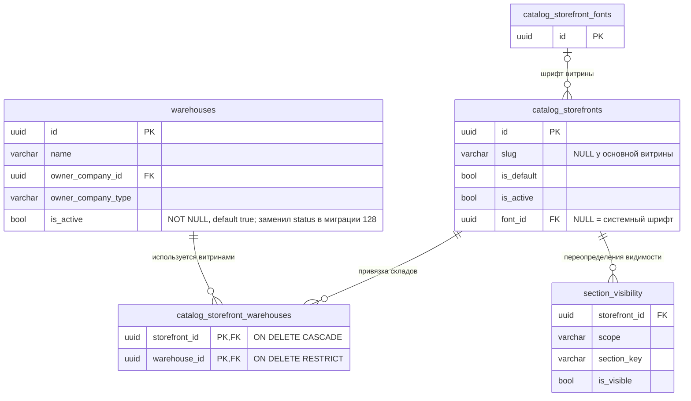

# Исправление: 500 при экспорте, предпросмотре и импорте настроек витрин после перехода складов на `is_active`

- **Дата и время создания:** 2026-09-28 14:59:15 MSK (UTC+3)
- **Идентификатор задачи Bitrix24:** — (указать при заведении задачи; если задача внутренняя — оставить прочерк)
- **Тип задачи:** `bugfix`
- **Ветка задачи:** `bugfix/storefront-transfer-warehouse-status`
- **Целевая ветка для MR:** `test`
- **Затронутые модули:**
  - `backend/infrastructure/repositories/storefront_transfer_repository.py` — единственное изменение кода
  - E2E: новый сценарий переноса настроек витрин (см. п. 4)
- **Схема БД:** не меняется, миграций нет. Меняется только чтение данных (raw SQL), поэтому ниже ERD затронутых таблиц.

---

## 0. ER-диаграмма (текущее состояние, без изменений)



Колонки `warehouses.status` в БД **нет**: миграция `128_warehouse_access_rules_and_fields.py` (2026-09-22) перенесла значение в `is_active` (`is_active = (status = 'active')`) и удалила `status`.

---

## 1. Постановка задачи

### Симптом
На стенде `test` в админке «Витрины → Импорт JSON → Предпросмотр» любой файл (в том числе корректный `storefront-settings-2026-09-23-import-ready.json`) даёт:

```
POST /api/v1/admin/storefronts/settings/preview → 500
{"detail": "Произошла внутренняя ошибка. Попробуйте позже.", "code": "INTERNAL_ERROR"}
```

### Причина
`read_transfer_state` (`storefront_transfer_repository.py`, ~стр. 28–40) читает склады витрины сырым SQL и обращается к удалённой колонке:

```sql
COALESCE((SELECT jsonb_agg(jsonb_build_object('id', w.id, 'status', w.status)
                          ORDER BY w.id)
    FROM catalog_storefront_warehouses sw JOIN warehouses w ON w.id = sw.warehouse_id
    WHERE sw.storefront_id = s.id), '[]'::jsonb) AS warehouse_state,
```

PostgreSQL отклоняет запрос целиком (`column w.status does not exist`) — ещё до обработки строк, поэтому ошибка возникает при любом содержимом файла и любом наборе витрин. Исключение не является `ServiceError`/`DomainError`, поэтому роутер отдаёт общий 500.

ORM-код не пострадал: в модели `Warehouse` есть `hybrid_property status` (`'active'`, если `is_active`, иначе `'inactive'`). Сырой SQL этот hybrid не видит.

### Проверено при разборе
- Файл `storefront-settings-2026-09-23-import-ready.json` проходит `parse_storefront_settings` полностью (6 витрин: `/`, `aurus`, `faw`, `foton`, `tehnotemp`, `test`); логотипы — корректные PNG и проходят проверку образа.
- Других обращений к `warehouses.status` в сыром SQL в `application/`, `infrastructure/`, `domain/`, `presentation/` нет. Использование `Warehouse.status` в `application_assignment_repository.py` работает через hybrid expression и не затрагивается.

### Затронутые сценарии
`read_transfer_state` вызывается во всех трёх операциях переноса, поэтому сейчас сломаны все:

| Операция | Эндпоинт | Где вызывается |
|---|---|---|
| Экспорт JSON | `GET /api/v1/admin/storefronts/settings/export` | `handle_export_storefront_settings` |
| Предпросмотр | `POST /api/v1/admin/storefronts/settings/preview` | `handle_preview_storefront_settings` |
| Применить импорт | `POST /api/v1/admin/storefronts/settings/import` | `handle_import_storefront_settings` (повторное чтение состояния и проверка токена) |

### Требуемое поведение
Все три операции работают, как до миграции 128. Контракт `warehouse_state` для прикладного кода не меняется: список объектов `{"id": <uuid>, "status": "active" | "inactive"}`.

---

## 2. Требования к реализации

### 2.1. `read_transfer_state`
Заменить в SQL только выражение статуса:

```sql
jsonb_build_object(
    'id', w.id,
    'status', CASE WHEN w.is_active THEN 'active' ELSE 'inactive' END
)
```

- Семантика совпадает с `Warehouse.status` (hybrid) и с переносом данных в миграции 128. `is_active` — `NOT NULL`, ветка для `NULL` не нужна.
- Порядок (`ORDER BY w.id`), остальные подзапросы, фильтр по `slugs` и сортировка по `slug` не меняются.
- Обновить docstring функции: указать, что `status` склада вычисляется из `is_active`.

### 2.2. Что не меняется
- `application/queries/storefront_transfer.py`: условие `all(w["status"] == "active" for w in warehouses)` остаётся как есть — оно получает тот же ключ и те же значения.
- `lock_transfer_state`: использует только `w["id"]`.
- Токен предпросмотра (`storefront_import_token.py`): `state_sha256` считается от `warehouse_state`; форма данных не меняется, поэтому токены, выданные после исправления, проверяются стабильно. Токенов «до исправления» не существует (предпросмотр падал).
- Схема БД, миграции, ORM-модели, Pydantic-схемы, фронтенд, формат JSON-файла.
- Бизнес-правило: включённая существующая витрина (кроме основной) требует хотя бы одного **активного** склада; новые витрины создаются выключенными и без складов.

### 2.3. Безопасность исправления
- Меняется одно SQL-выражение только для чтения; запись, блокировки и транзакционная логика импорта не трогаются.
- Не использовать `w.*`/`to_jsonb(w)` вместо явного объекта: состав `warehouse_state` участвует в хеше токена и не должен зависеть от будущих изменений таблицы `warehouses`.

---

## 3. Ожидаемый результат на стенде после исправления
Для файла `storefront-settings-2026-09-23-import-ready.json`:
- предпросмотр возвращает 200 со списком действий (`update` для существующих slug, `create` с предупреждением «Будет создана выключенная витрина без складов…» для новых) и `preview_token`;
- если какая-то из включённых витрин (`aurus`, `faw`, `foton`, `tehnotemp`, `test`) **уже существует** на стенде и у неё нет активного склада, предпросмотр вернёт 4xx с текстом «Выберите хотя бы один существующий активный склад». Это штатная проверка, а не ошибка: нужно привязать активный склад к витрине или выставить `is_active: false` для неё в файле.

---

## 4. Проверка

Unit-тесты не добавляются (по `AGENTS.md` — только по прямому запросу).

### 4.1. E2E (API, реальные HTTP-запросы под сотрудником `carcraft_employee`)
Отдельного E2E для переноса витрин сейчас нет — добавить сценарий (например, `frontend/tests/e2e/storefronts/se-storefront-settings-transfer.spec.ts` или по соглашению каталога):
1. `GET /api/v1/admin/storefronts/settings/export` → 200, валидный JSON.
2. `POST …/settings/preview` с экспортированным файлом → 200, есть `preview_token`, у каждой витрины `action = "update"`.
3. Витрина с привязанным **неактивным** складом (`warehouses.is_active = false`) и `is_active: true` в файле → 4xx «Выберите хотя бы один существующий активный склад» (подтверждает, что `is_active` корректно превращается в `status`).
4. Та же витрина с активным складом → 200.
5. Новый slug в файле → 200, `action = "create"`, предупреждение о выключенной витрине.
6. `POST …/settings/import` с `preview_token` из шага 2 и `confirmed=true` → 200; повторный экспорт совпадает с импортированными настройками.
7. Права: пользователь без роли `carcraft_employee` → 403 на всех трёх эндпоинтах.

### 4.2. Обязательные проверки перед коммитом
- Линтеры backend.
- Запуск приложения в Docker, прогон E2E из п. 4.1, просмотр логов backend: нет `UndefinedColumnError` / `column w.status does not exist`.
- Alembic autogenerate не обнаруживает изменений схемы.

### 4.3. Ручная проверка на стенде `test`
1. «Витрины → Экспорт JSON» скачивает файл.
2. «Импорт JSON → Предпросмотр» с `storefront-settings-2026-09-23-import-ready.json` не даёт 500 (см. п. 3).
3. «Применить импорт» после успешного предпросмотра завершается без 500.

---

## 5. Критерии готовности
- [x] В `read_transfer_state` нет обращения к `warehouses.status`; статус склада вычисляется из `is_active`.
- [x] Экспорт, предпросмотр и импорт настроек витрин работают без 500.
- [x] Правило «активная витрина — хотя бы один активный склад» работает с новым полем `is_active`.
- [x] E2E из п. 4.1 проходят (`frontend/tests/e2e/storefronts/se-storefront-settings-transfer.spec.ts`: 6 passed); в логах backend нет ошибок SQL по `warehouses`.
- [x] Схема БД не изменилась, Alembic autogenerate пуст (`No new upgrade operations detected.`).
- [x] MR в `test` с описанием причины, изменения и списком выполненных проверок ([MR !470](https://gitlab.carcraft.ru/carcraft/carcraft-leadgenerator/-/merge_requests/470), установлен auto-merge).

---

## 6. Результаты проверок
- **Статические проверки backend:**
  - `uv run ruff check . --fix` — All checks passed!
  - `uv run lint-imports` — Contracts: 9 kept, 0 broken.
  - `uv run mypy .` — Success: no issues found in 1138 source files.
- **Alembic check:**
  - `uv run alembic upgrade head` — успешно.
  - `uv run alembic check` — `No new upgrade operations detected.`
- **E2E-тестирование (`frontend/tests/e2e/storefronts/se-storefront-settings-transfer.spec.ts`):**
  - Ролевой доступ: дилер (`+76660000003`) получает 403 на export, preview, import.
  - Экспорт: сотрудник (`+76660000001`) получает 200, Content-Disposition `attachment; filename="storefront-settings.json"`, валидный JSON настроек витрин.
  - Предпросмотр: 200, возвращается `preview_token` и `action: 'update'`.
  - Новый slug: 200, `action: 'create'` с предупреждением о выключенной витрине без складов.
  - Валидация активных складов: витрина с неактивным складом (`is_active: false`) при `is_active: true` отклоняется с кодом 422 («Выберите хотя бы один существующий активный склад»); при активном складе — 200.
  - Импорт: неподтверждённый импорт отклоняется (400), подтверждённый с токеном применяется (200), повторный экспорт отражает импортированные данные.
  - Все 6 сценариев успешно пройдены (6 passed).
- **Логи backend:**
  - Проверены логи запросов к API — отсутствуют ошибки `UndefinedColumnError`, `column w.status does not exist`, 500 Internal Server Error. Все запросы вернули ожидаемые HTTP-статусы.
