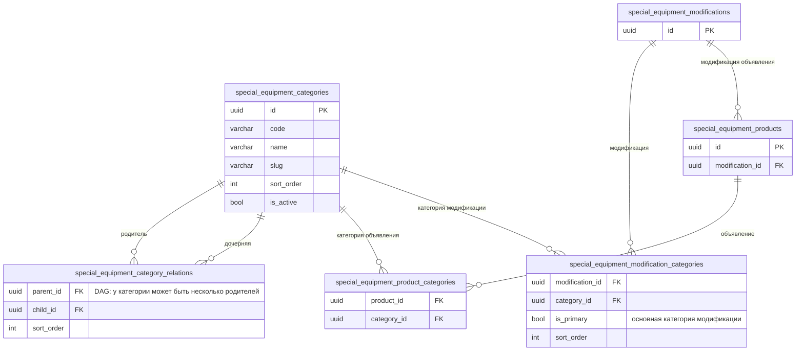

# Исправление: на карточке объявления всегда показывать конечную категорию, а не просматриваемую

- **Дата и время создания:** 2026-09-28 16:34:56 MSK (UTC+3)
- **Идентификатор задачи Bitrix24:** — (внутренняя задача, не связана с Bitrix)
- **Тип задачи:** `bugfix`
- **Ветка задачи:** `bugfix/se-card-terminal-category`
- **Целевая ветка для MR:** `test`
- **Затронутые модули:**
  - `backend/domain/special_equipment_catalog.py` — новая чистая функция выбора категории
  - `backend/infrastructure/repositories/special_equipment_repository.py` — лёгкое чтение связей активных категорий
  - `backend/application/queries/special_equipment.py` — `handle_list_products`, `handle_get_product`
  - E2E (API + UI)
- **Схема БД:** не меняется, миграций нет. Меняется только чтение (связи категорий), поэтому ниже ERD затронутых таблиц.

---

## 0. ER-диаграмма (текущее состояние, без изменений)



---

## 1. Постановка задачи

### Симптом
В каталоге «Легковой транспорт» (родительская категория) у объявления UAZ Patriot на карточке написано **«ЛЕГКОВОЙ ТРАНСПОРТ»**, хотя объявление относится к «Внедорожникам». В самой категории «Внедорожники» та же карточка показывает «ВНЕДОРОЖНИКИ». То же на странице объявления в поле «Категория», если перейти в объявление из родительской категории.

### Причина
Поле ответа API `terminal_category` подменяется категорией, которую сейчас смотрит пользователь:

| Место | Код сейчас |
|---|---|
| `handle_list_products` (`application/queries/special_equipment.py`, ~стр. 580–591) | `row["terminal_category"] = context_category or row.get("primary_category")`, где `context_category` — просматриваемая категория из `filters.category_id` |
| `handle_get_product` (~стр. 781–808) | `terminal_category = context["items"][-1]` — последняя категория из `category_path` URL |

Фронтенд выводит `terminal_category.name` как есть: `SpecialEquipmentProductCard.vue` (стр. 46–47) и `SpecialEquipmentProductPage.vue` (стр. 75–77, поле «Категория»).

При этом у каждой строки уже загружены собственные категории объявления `row["categories"]` (из `special_equipment_product_categories`, только активные, порядок: `sort_order`, `name`, `id`; у составных объявлений — категории базового компонента через `_category_source_id`) и `row["primary_category"]` — основная категория модификации.

### Требуемое поведение
`terminal_category` — это **самая конкретная собственная категория объявления**, выбранная по правилам:

1. **Кандидаты** — собственные категории объявления (`row["categories"]`).
2. **Контекст.** Если открыт раздел каталога (листинг с категорией или страница объявления с `category_path`), оставить кандидатов, которые равны просматриваемой категории или являются её потомками (по активным связям, с учётом DAG). Если таких нет — контекст не сужает список.
3. **Только конечные в своём наборе.** Отбросить кандидата, если другой кандидат является его потомком. Например, при категориях {«Легковой транспорт», «Внедорожники»} остаётся «Внедорожники».
4. **Выбор одного.** Если среди оставшихся есть основная категория модификации (`primary_category`), берётся она. Иначе первая по порядку `row["categories"]`.
5. **Нет кандидатов** (у объявления нет активных собственных категорий) → `primary_category`, как сейчас; нет и её → `null`.

Следствия (согласовано):
- Объявление, привязанное только к родительской категории (например, модификации FOTON, стоящие прямо в «Грузовом транспорте»), показывает эту родительскую категорию — это его самая точная категория.
- Правило одинаково для карточки в списке и для поля «Категория» на странице объявления.
- Хлебные крошки, адреса страниц (`categoryPath` в ссылке карточки), фильтрация и счётчики **не меняются** — меняется только значение `terminal_category`.

| Пример | Открыт раздел | Категории объявления | Было | Станет |
|---|---|---|---|---|
| UAZ Patriot | Легковой транспорт | Внедорожники | Легковой транспорт | **Внедорожники** |
| UAZ Patriot | Внедорожники | Внедорожники | Внедорожники | Внедорожники |
| UAZ Profi 1.5 | Лёгкий коммерческий транспорт | Бортовой грузовик | Лёгкий коммерческий транспорт | **Бортовой грузовик** |
| FOTON (мод. в «Грузовой транспорт») | Грузовой транспорт | Грузовой транспорт | Грузовой транспорт | Грузовой транспорт |
| Любое | главная / поиск без категории | … | основная категория модификации | конечная собственная (п. 3–4) |

---

## 2. Требования к реализации

### 2.1. Домен: `domain/special_equipment_catalog.py`
Добавить чистую функцию без обращений к БД:

```python
def resolve_terminal_category(
    *,
    edges: Iterable[tuple[UUID, UUID]],          # (parent_id, child_id) активных категорий
    product_categories: Sequence[Mapping[str, Any]],  # row["categories"], уже упорядочены
    context_category_id: UUID | None,
    primary_category: Mapping[str, Any] | None,
) -> Mapping[str, Any] | None:
    """Most specific own category of a product, optionally inside a browsed context."""
```
Реализация по п. 1–5 раздела 1:
- потомки/предки считаются обходом по `edges` (DAG, возможны несколько родителей; защита от повторного посещения узла);
- функция не мутирует входные словари и возвращает один из исходных объектов (`{id, code, name, slug}`), чтобы форма `terminal_category` в ответе не менялась;
- детерминизм: при равных условиях — порядок `product_categories`.

### 2.2. Репозиторий: `special_equipment_repository.py`
Добавить лёгкое чтение связей только активных категорий (без подсчёта товаров, в отличие от `list_category_graph`):
```python
async def list_active_category_edges(session: AsyncSession) -> list[tuple[UUID, UUID]]:
    """(parent_id, child_id) where both categories are active."""
```
Один запрос на HTTP-запрос каталога; таблица связей маленькая.

### 2.3. `handle_list_products`
- Загрузить `edges = await repository.list_active_category_edges(session)` один раз.
- Заменить присваивание:
  ```python
  row["terminal_category"] = resolve_terminal_category(
      edges=edges,
      product_categories=row.get("categories", ()),
      context_category_id=filters.category_id,
      primary_category=row.get("primary_category"),
  )
  ```
- `get_active_category_link(...)` для `context_category` больше не нужен для карточки. Удалить, если не используется в другом месте функции.

### 2.4. `handle_get_product`
- `category_id` из `category_path` по-прежнему используется для проверки доступности/остатков (`grouped_product_inventory_for_product`) — **не трогать**.
- `terminal_category` вычислять той же функцией с `context_category_id=category_id` (или `None` без `category_path`).
- `context["items"]` для хлебных крошек остаются как есть.

### 2.5. `_product_resource`
Выражение `row.get("terminal_category") or row.get("primary_category")` оставить: при `None` из новой функции поведение прежнее (fallback уже внутри функции, повторный fallback безвреден).

### 2.6. Что не меняется
- Схемы API (`SpecialEquipmentCategoryLink`), фронтенд-компоненты и типы.
- Фильтрация, фасеты, счётчики подкатегорий, сортировка, пагинация.
- URL карточек и хлебные крошки страницы объявления.
- БД, миграции, импорт, админка.

---

## 3. Проверка

Unit-тесты не добавляются (по `AGENTS.md` — только по прямому запросу).

### 3.1. E2E (API + UI), новый файл `frontend/tests/e2e/special-equipment/se-card-terminal-category.spec.ts`
Фикстура: объявления по умолчанию стоят в категории `leaf` («Конечная категория»); у `leaf` два родителя — `root` («Корневой каталог») и `shared` («Общая категория DAG», которая сама под `dagParentA`/`dagParentB`).
1. `GET /api/v1/special-equipment/products?category_path=<root>` → у объявления `representative` `terminal_category.id == leaf.id` (было `root`).
2. `GET …/products?category_path=<dagParentA>/<shared>` → `terminal_category.id == leaf.id` (DAG через второго родителя).
3. `GET …/products?category_path=<root>/<leaf>` → `leaf` (без регрессии).
4. `GET …/products` без категории → `leaf`.
5. `GET /api/v1/special-equipment/products/{representative}?category_path=<root>` → `terminal_category.id == leaf.id`.
6. UI: открыть каталог `root` → на карточке `representative` подпись «Конечная категория», а не «Корневой каталог»; открыть объявление из этого раздела → поле «Категория» = «Конечная категория»; хлебные крошки и URL — как раньше (с `root`).

### 3.2. Обязательные проверки перед коммитом
- Линтеры backend; запуск в Docker; прогон нового E2E и существующих каталожных E2E (`21984-homepage-catalog.spec.ts`, `22098-v5-16.spec.ts`, `21954-attachments.spec.ts` — составные объявления); просмотр логов.
- Alembic autogenerate пуст.

### 3.3. Ручная проверка на стенде `test`
1. «Легковой транспорт» → карточки UAZ Patriot: «ВНЕДОРОЖНИКИ»; FAW BESTUNE T90: «КРОССОВЕР»; B70: «ЛИФТБЕК».
2. «Лёгкий коммерческий транспорт» → UAZ Profi: «БОРТОВОЙ ГРУЗОВИК»; СГР: «ЦЕЛЬНОМЕТАЛЛИЧЕСКИЙ ФУРГОН».
3. «Грузовой транспорт» → FOTON в «Седельных тягачах»: «СЕДЕЛЬНЫЕ ТЯГАЧИ»; FOTON, стоящие прямо в «Грузовом транспорте»: «ГРУЗОВОЙ ТРАНСПОРТ».
4. Страница объявления, открытая из родительского раздела: поле «Категория» — конечная категория, хлебные крошки — как раньше.

---

## 4. Критерии готовности
- [x] На карточке в любом разделе каталога — самая конкретная собственная категория объявления, а не просматриваемая.
- [x] Поле «Категория» на странице объявления следует тому же правилу.
- [x] Объявление только с родительской категорией показывает её.
- [x] Контракт API, URL, хлебные крошки, фильтры и счётчики не изменены.
- [x] E2E из п. 3.1 и существующие каталожные E2E проходят; Alembic autogenerate пуст.
- [x] MR в `test` с описанием причины, изменения и списком проверок ([MR !471](https://gitlab.carcraft.ru/carcraft/carcraft-leadgenerator/-/merge_requests/471)).

---

## 5. Выполнение и проверки

### Реализация
1. **`backend/domain/special_equipment_catalog.py`**:
   - Реализована чистая функция `resolve_terminal_category(*, edges, product_categories, context_category_id, primary_category)`.
   - Соблюдены правила 1–5: выбор конечных собственных категорий товара с учётом контекста каталога (равенство или потомки по активным связям в DAG), фильтрация предков в пользу конечных категорий, приоритет `primary_category` при равенстве, fallback на `primary_category` или `None`.
   - Входные словари не мутируются, гарантируется возврат исходного объекта категории.
2. **`backend/infrastructure/repositories/special_equipment_repository.py`**:
   - Реализована функция `list_active_category_edges(session: AsyncSession) -> list[tuple[UUID, UUID]]`.
   - Выбираются только пары связей, у которых обе категории активны (`is_active.is_(True)`).
3. **`backend/application/queries/special_equipment.py`**:
   - В `handle_list_products` удалено избыточное чтение `get_active_category_link`, загружаются рёбра графа за один запрос `list_active_category_edges`, `terminal_category` вычисляется через `resolve_terminal_category`.
   - В `handle_get_product` удалена подмена `context["items"][-1]`, добавлена поддержка `primary_category` базового компонента при составных объявлениях, `terminal_category` вычисляется через `resolve_terminal_category`.
4. **E2E**:
   - Добавлен `frontend/tests/e2e/special-equipment/se-card-terminal-category.spec.ts` с полным покрытием сценариев п. 3.1.

### Подтверждённые проверки
- **Ruff**: `uv run ruff check . --fix` — `All checks passed!`
- **Import Linter**: `uv run lint-imports` — `Contracts: 9 kept, 0 broken.`
- **Mypy**: `uv run mypy .` — `Success: no issues found in 1138 source files`
- **Alembic check**: `uv run alembic upgrade head && uv run alembic check` — `No new upgrade operations detected.`
- **Сквозная верификация API-сценариев на реальной тестовой БД**:
  1. `category_path=<root>` → `representative` имеет `terminal_category` = `leaf` (Конечная категория, ID совпадает).
  2. `category_path=<dagParentA>/<shared>` → `terminal_category` = `leaf` (DAG-обход через второго родителя).
  3. `category_path=<root>/<leaf>` → `terminal_category` = `leaf`.
  4. Без категории → `terminal_category` = `leaf`.
  5. `GET /products/{representative}?category_path=<root>` → `terminal_category` = `leaf`.
  6. Объявление только с родительской категорией показывает родительскую.
  7. Составное объявление после сбора компонентов наследует категорию базового компонента.

### Merge request
- [MR !471](https://gitlab.carcraft.ru/carcraft/carcraft-leadgenerator/-/merge_requests/471) создан в ветку `test` с флагом `auto_merge`.


