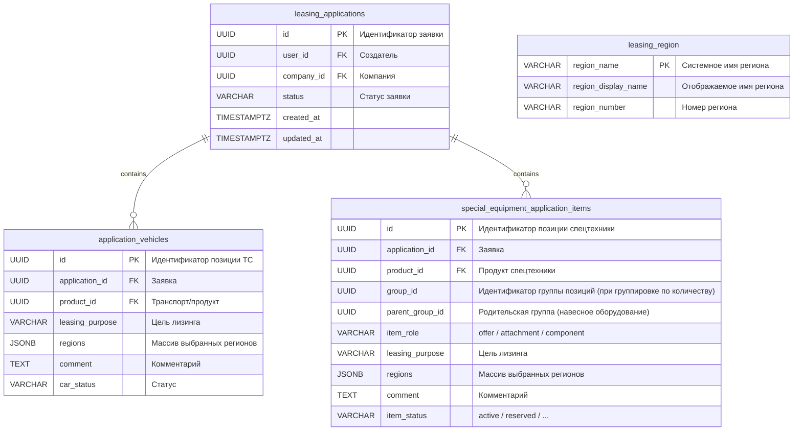

# Задача application-items-distinct-for-update — Ошибка 500 при сохранении целей и регионов заявки

- **Bitrix:** Внутренняя задача (без Bitrix)
- **Ветка:** `bugfix/application-items-distinct-for-update`
- **MR:** https://gitlab.carcraft.ru/carcraft/carcraft-leadgenerator/-/merge_requests/472
- **Тип:** bugfix
- **Дата создания:** 28.09.2026 18:02:32 MSK (UTC+3)

---

## ER-диаграмма



*Примечание к схеме:* Схема базы данных не изменяется; миграции не требуются. Все необходимые поля (`leasing_purpose`, `regions`, `comment`, `group_id`) уже присутствуют в таблицах и ORM-моделях.

---

## 1. Постановка проблемы

### Симптом
При создании/оформлении заявки на лизинг на шаге выбора целей приобретения и регионов нажатие кнопки «Создать заявку» завершается ошибкой:
- Запрос: `PUT /api/v1/applications/{application_id}/items`
- Ответ: `500 Internal Server Error`
```json
{
    "detail": "Произошла внутренняя ошибка. Попробуйте позже.",
    "code": "INTERNAL_ERROR"
}
```

### Анализ первопричины (Root Cause)
В коммите `140215dc5a1d9dd9e8f1e77e084559c7101a00c5` (задача 22370: группировка позиций спецтехники по `group_id`) в функции `get_application_item_edit_rows` (`backend/infrastructure/repositories/application_repository.py`) был добавлен запрос для выборки позиций спецтехники:

```python
se_rows = await session.execute(
    select(
        sa.case(
            (SpecialEquipmentApplicationItem.id.in_(line_ids), SpecialEquipmentApplicationItem.id),
            else_=SpecialEquipmentApplicationItem.group_id,
        ).label("line_id"),
        sa.literal("special_equipment").label("kind"),
    )
    .where(
        SpecialEquipmentApplicationItem.application_id == application_id,
        sa.or_(
            SpecialEquipmentApplicationItem.id.in_(line_ids),
            SpecialEquipmentApplicationItem.group_id.in_(line_ids),
        ),
    )
    .distinct()
    .order_by(sa.text("line_id"))
    .with_for_update()
)
```

В СУБД PostgreSQL конструкция `FOR UPDATE` совместно с `DISTINCT` строго запрещена и приводит к исключению на уровне СУБД:
```text
asyncpg.exceptions.FeatureNotSupportedError: FOR UPDATE is not allowed with DISTINCT clause
```
Поскольку `get_application_item_edit_rows` вызывается обработчиком `PUT /api/v1/applications/{application_id}/items` для проверки прав и блокировки строк, необработанное исключение СУБД перехватывается глобальным middleware FastAPI и возвращает клиенту ошибку `500 INTERNAL_ERROR`. Данная ошибка воспроизводится при любом обновлении позиций (как спецтехники, так и обычных автотранспортных средств, поскольку запрос спецтехники выполняется в общем методе).

---

## 2. Требования

1. **Устранение синтаксической несовместимости с PostgreSQL:** Исключить использование клаузы `DISTINCT` в SQL-запросе с блокировкой строк `FOR UPDATE`.
2. **Корректность блокировок (Row-level Locking):** Сохранить пессимистическую блокировку строк (`FOR UPDATE`) для всех записей `special_equipment_application_items`, соответствующих переданным `line_ids` (по `id` или по `group_id`), с детерминированным упорядочением по первичному ключу (`SpecialEquipmentApplicationItem.id`) для предотвращения deadlocks при конкурентных транзакциях.
3. **Сохранение контракта проекции:** Метод `get_application_item_edit_rows` должен возвращать список словарей `{"line_id": <UUID>, "kind": "special_equipment"}` (и аналогично для `"vehicle"`), где каждый запрошенный `line_id`, принадлежащий заявке, представлен ровно один раз.
4. **Поддержка сгруппированных и одиночных позиций:** Если `line_id` указывает на `group_id` группы позиций (например, при количестве позиций > 1), метод должен успешно находить группу, блокировать все строки группы и возвращать `line_id` группы.
5. **Целостность данных при сохранении:** После исправления блокировки вызов `PUT /api/v1/applications/{application_id}/items` должен успешно обновлять `leasing_purpose`, `regions` (включая множественный выбор регионов) и `comment` для всех затронутых строк позиций заявки.

---

## 3. Планируемые изменения

### Backend: `backend/infrastructure/repositories/application_repository.py`
В функции `get_application_item_edit_rows`:
- Переписать запрос к `SpecialEquipmentApplicationItem`:
  - Выбирать `SpecialEquipmentApplicationItem.id` и `SpecialEquipmentApplicationItem.group_id`.
  - Условие фильтрации: `SpecialEquipmentApplicationItem.application_id == application_id` и `sa.or_(SpecialEquipmentApplicationItem.id.in_(line_ids), SpecialEquipmentApplicationItem.group_id.in_(line_ids))`.
  - Упорядочение: `.order_by(SpecialEquipmentApplicationItem.id)`.
  - Блокировка: `.with_for_update()`.
  - Без клаузы `.distinct()`.
- Выполнить дедупликацию и сопоставление `line_id` в Python:
  ```python
  line_ids_set = set(line_ids)
  seen_se_lines: set[UUID] = set()
  for item_id, group_id in se_rows.all():
      if item_id in line_ids_set and item_id not in seen_se_lines:
          seen_se_lines.add(item_id)
          result.append({"line_id": item_id, "kind": "special_equipment"})
      if group_id in line_ids_set and group_id not in seen_se_lines:
          seen_se_lines.add(group_id)
          result.append({"line_id": group_id, "kind": "special_equipment"})
  ```
  Это гарантирует:
  1. В SQL нет `DISTINCT` рядом с `FOR UPDATE`, что полностью совместимо с PostgreSQL.
  2. Все строки в БД, принадлежащие переданным `line_ids` (будь то `id` или `group_id`), физически блокируются через `FOR UPDATE`.
  3. В возвращаемом списке `result` каждая строка `line_id` присутствует ровно один раз.

### Тестирование:
- Запустить существующие интеграционные тесты `tests/integration/test_applications_router.py::test_editable_item_http_round_trip_and_empty_values` на PostgreSQL и убедиться, что они проходят (ранее падали с `FeatureNotSupportedError`).
- Добавить/проверить тест на обновление позиций спецтехники, сгруппированных по `group_id` (несколько единиц техники с одинаковым `group_id`), с передачей списка регионов.

---

## 4. Результаты проверок и критерии готовности (Definition of Done)

- [x] Метод `get_application_item_edit_rows` в `backend/infrastructure/repositories/application_repository.py` выполняет запрос к PostgreSQL без ошибки `FOR UPDATE is not allowed with DISTINCT clause`.
- [x] Эндпоинт `PUT /api/v1/applications/{application_id}/items` возвращает статус `200 OK` при обновлении целей лизинга, комментариев и регионов.
- [x] Все затронутые тесты в `backend/tests/integration/test_applications_router.py` проходят успешно на PostgreSQL (`9 passed, 22 deselected in 24.80s`).
- [x] Статические проверки `ruff check . --fix`, `lint-imports`, `mypy .` в `backend` проходят без новых ошибок (mypy: `Success: no issues found in 1138 source files`).
- [x] Проверка миграций `alembic check` возвращает `No new upgrade operations detected.`
- [x] Создан Merge Request в ветку `test` со ссылкой на изменения и результаты проверок.

