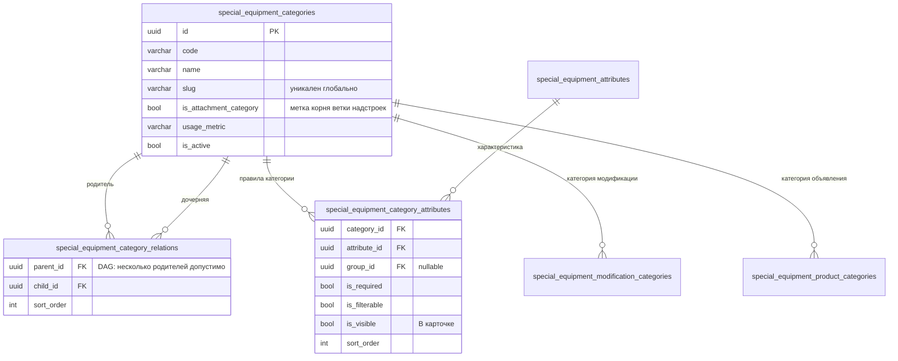
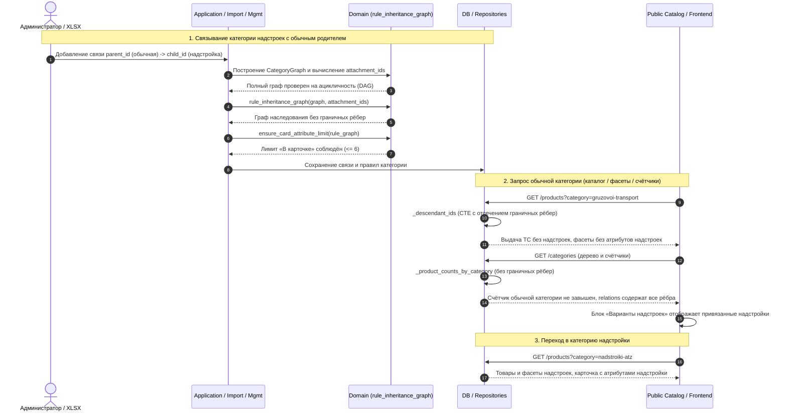

# Категории надстроек под обычной категорией: без наследования характеристик и без смешивания товаров

- **Дата и время создания:** 2026-09-28 21:45:54 MSK (UTC+3)
- **Идентификатор задачи Bitrix24:** — (внутренняя задача, не связана с Bitrix)
- **Тип задачи:** `feature`
- **Ветка задачи:** `feature/se-attachment-category-under-ordinary`
- **Целевая ветка для MR:** `test`
- **MR:** https://gitlab.carcraft.ru/carcraft/carcraft-leadgenerator/-/merge_requests/474
- **Затронутые модули:**
  - `backend/domain/special_equipment_attachments.py`: новая чистая функция «граф наследования правил».
  - `backend/application/special_equipment_import_v2.py`: лимит карточки, контракт характеристик модификаций и комплектаций.
  - `backend/application/commands/special_equipment_management.py`: те же проверки в админке.
  - `backend/application/special_equipment_offerings.py`: видимые в карточке характеристики.
  - `backend/infrastructure/repositories/special_equipment_management_repository.py`: `effective_attribute_links` для админки.
  - `backend/infrastructure/repositories/special_equipment_repository.py`: публичные метаданные характеристик, фильтры, выдача и счётчики категорий.
  - `frontend/features/specialEquipment/management/correction/CatalogCorrectionForm.vue`: унаследованные характеристики и счётчик «В карточке».
  - E2E (API + UI).
- **Схема БД:** не меняется, миграций нет. Меняется только расчёт по существующим таблицам.

---

## 0. ER-диаграмма (текущее состояние, без изменений)





---

## 1. Постановка задачи

### Цель
На странице «Грузовой транспорт» нужно показывать надстройки. Для этого категории «Надстройки АТЗ» и «Надстройки КМУ» (дочерние к корню надстроек «Надстройки») добавляются вторым родителем к «Грузовому транспорту». Витрина уже умеет это показывать: в `homepageCategoryNavigation.ts` дочерние категории делятся на `standardChildren` и `attachmentChildren`, а `SpecialEquipmentHomepageModule.vue` выводит блок «Варианты надстроек».

### Блокер (текущее поведение)
1. **Наследование правил проходит через границу веток.** `effective_attribute_rules` (`domain/special_equipment_catalog.py`) объединяет правила всех предков. Если у категории надстроек появляется обычный родитель, она наследует все правила «Грузового транспорта»: около 160 характеристик, 6 из них «В карточке», 6 в фильтре.
   - У надстроек своих характеристик «В карточке» тоже 6, итого 12. Импорт падает с `CARD_ATTRIBUTE_LIMIT_EXCEEDED` и отбрасывает весь структурный план: связи и правила категорий.
   - Если снять свои флаги «В карточке», в карточке АТЗ и КМУ окажутся грузовые поля (колёсная формула, мощность…), которых у надстройки нет.
   - В фильтрах категорий надстроек появятся грузовые фильтры.
2. **Выдача и счётчики проходят через границу вниз.** `_descendant_ids` и `_product_counts_by_category` обходят всех потомков. Поэтому надстройки (АТЗ-10, PK 23500) попадут в общий список «Грузового транспорта» вперемешку с машинами, увеличат его счётчик, а их характеристики (объём цистерны, грузовой момент) попадут в фильтры «Грузового транспорта».

### Термины
- **Ветка надстроек**: категории с `is_attachment_category = true` и все их потомки. Считается как сейчас, функцией `attachment_branch_ids` по полному графу.
- **Граничное ребро**: связь `parent → child`, где `child` входит в ветку надстроек, а `parent` не входит. Пример: `GRUZOVOI_TRANSPORT → NADSTROIKI_AVTOTOPLIVOZAPRAVSCHIK`.

### Требуемое поведение
Граничное ребро **навигационное**: оно участвует только в дереве категорий (меню, хлебные крошки, блок «Варианты надстроек», URL-пути). Во всех остальных расчётах его нет:

| Расчёт | Правило |
|---|---|
| Наследование правил категории (карточка, фильтры, группы, обязательность, допустимые характеристики модификации и комплектации) | Не идёт вверх через граничное ребро. Категория надстроек наследует только от предков из своей ветки. |
| Лимит 6 «В карточке» | Считается по тому же графу наследования. |
| Выдача, фасеты, счётчик обычной категории | Не идут вниз через граничное ребро: товары надстроек не попадают в выдачу, фильтры и счётчик «Грузового транспорта». |
| Выдача и счётчик категории надстроек, открытой по пути `gruzovoi-transport/nadstroiki-atz` | Её собственные товары, как у любой категории. |
| Классификация товара (обычный или надстройка), совместимость, составные объявления | Без изменений: ветка надстроек считается по полному графу. |
| Проверка ацикличности DAG, пути и хлебные крошки | Без изменений, полный граф. |

Для обычных категорий и для категорий надстроек без обычных родителей поведение не меняется: граничных рёбер у них нет.

---

## 2. Требования к реализации

### 2.1. Домен: `domain/special_equipment_attachments.py`
Добавить чистые функции рядом с `attachment_branch_ids`. Класть их в `special_equipment_catalog.py` нельзя: `attachments` импортирует `catalog`, получится циклический импорт.

```python
def is_boundary_edge(*, parent_id: UUID, child_id: UUID, attachment_ids: frozenset[UUID]) -> bool:
    return child_id in attachment_ids and parent_id not in attachment_ids


def rule_inheritance_graph(*, graph: CategoryGraph, attachment_ids: frozenset[UUID]) -> CategoryGraph:
    """Same categories, without boundary edges. Used for rule inheritance and branch traversal."""
    return CategoryGraph.from_edges(
        category_ids=graph.category_ids,
        edges=(e for e in graph.edges if not is_boundary_edge(parent_id=e[0], child_id=e[1], attachment_ids=attachment_ids)),
    )
```

- `effective_attribute_rules`, `ensure_card_attribute_limit`, `resolve_trim_attribute_contract` и `ensure_category_change_card_attribute_limits` **не меняют сигнатуру**. Вызывающий код передаёт им граф из `rule_inheritance_graph`.
- `attachment_ids` всегда считается по **полному** графу. Иначе категория надстроек под обычным родителем выпала бы из ветки.

### 2.2. Импорт: `application/special_equipment_import_v2.py`
1. Вынести расчёт планируемых `attachment_ids` в хелпер `_planned_attachment_ids(context, plan, mode, graph)`. Он учитывает флаги из плана, как сейчас делает блок около строк 3690–3720 (`MIXED_ATTACHMENT_CLASSIFICATION`), и переиспользуется там же.
2. `_validate_card_attribute_limit_plan` (около строки 592): после сборки `graph` из итоговых рёбер вычислить `attachment_ids` по полному графу и передавать в `ensure_card_attribute_limit` граф `rule_inheritance_graph(...)`.
3. `_effective_category_contract` (около строки 724): возвращать граф наследования. Через него работают `_validate_modification_attribute_scope_plan` (допустимые характеристики модификации), проверка групп комплектаций (`TRIM_ATTRIBUTE_*`) и остальные потребители контракта. Проверить все вызовы `_effective_category_contract` и `effective_attribute_rules` в файле.
4. Проверку DAG в `_normalize_category_relations` (около строки 2089) не трогать, она работает по полному графу.

### 2.3. Админка: `application/commands/special_equipment_management.py`
1. Добавить `async def _rule_graph(session) -> CategoryGraph`: берёт `category_graph_snapshot`, строит полный граф, считает `attachment_branch_ids` и возвращает `rule_inheritance_graph`.
2. Заменить `_graph(session)` на `_rule_graph(session)` во всех местах, где граф нужен для правил:
   - `_validate_modification_attribute_values` (около 515);
   - `_validate_trim_attributes` и `_ensure_modification_values_not_assigned_in_trims` (если используют граф);
   - `_validate_category_attributes` и вызов `ensure_category_change_card_attribute_limits` (около 731);
   - `_validate_product` (около 900, обязательные характеристики);
   - `_ensure_published_dependencies_valid` (около 1030).
3. Смена родителей категории (около 345, `replace_category_parents`): DAG проверять по полному графу, как сейчас. Лимит карточки для затронутых модификаций считать по графу наследования, построенному **после** изменения.
4. `_attachment_context` и `_validate_attachment_integrity` не менять.

### 2.4. `application/special_equipment_offerings.py`
В `_visible_attributes` (около строки 39) граф строится из `inputs["relations"]`. Нужно отфильтровать граничные рёбра с помощью `attachment_branch_ids`. Флаги категорий есть в `inputs["categories"]`; если поля `is_attachment_category` там нет, добавить его в чтение входных данных.

### 2.5. Репозиторий админки: `special_equipment_management_repository.py`
`_effective_category_attribute_links_by_id` (около 772) строит граф для `effective_attribute_links`, а форма админки показывает по ним унаследованные характеристики. Применить `rule_inheritance_graph` с `attachment_ids` по полному графу; флаги категорий взять из уже загружаемых строк категорий. Функцию `_category_product_counts` (около 851) проверить: если она обходит потомков, применить то же правило обхода, что в п. 2.6.3.

### 2.6. Публичный репозиторий: `special_equipment_repository.py`
1. Добавить хелпер `_rule_edges(edges, attachment_ids)` и чтение `attachment_ids`: активные категории с `is_attachment_category`, затем потомки. Логика уже есть в `list_category_graph` (около строк 275–285), её вынести в общую функцию.
2. **Наследование правил (вверх):**
   - `_effective_attribute_metadata` (около 497): передавать в `_category_context_ranks` отфильтрованные рёбра;
   - `list_product_attributes_batch` (около 2303): то же.
   - `list_effective_attribute_rules` (около 3136) сейчас не вызывается. Либо удалить её, либо добавить в рекурсивный CTE `_ancestor_ids` условие «не подниматься по граничному ребру».
3. **Обход потомков (вниз):** в `_descendant_ids` (около 350) рекурсивный шаг не должен идти по граничному ребру.
   - Добавить рекурсивный CTE `attachment_branch`: категории с `is_attachment_category = true` плюс их потомки.
   - В шаге рекурсии оставить условие `NOT (child_id IN attachment_branch AND parent_id NOT IN attachment_branch)`.
   - Это автоматически исправляет выдачу (`_filtered_product_ids`, около 841; `_effective_filtered_product_ids`, около 1095), фасеты (`_attribute_facets`, около 2942) и `list_branch_attribute_metadata` (около 610).
4. **Счётчики:** в `list_category_graph` словарь `children` для `_product_counts_by_category` строить без граничных рёбер. В ответ API `relations` по-прежнему отдавать **все** рёбра: они нужны навигации.

### 2.7. Фронтенд: `CatalogCorrectionForm.vue`
В `inheritedCategoryLinks` (около строки 1521), в ветке без `effective_attribute_links`, пропускать родителя, если редактируемая категория входит в ветку надстроек, а родитель не входит.
- Принадлежность к ветке: флаг черновика `is_attachment_category` или хотя бы один родитель в ветке. Использовать существующую `categoryIsInAttachmentBranch` из `catalogProductCategories.ts`.
- `visibleCardAttributeCount` пересчитается сам.

### 2.8. Что не меняется
- Схема БД, миграции, формат xlsx, коды ошибок импорта.
- Витрина: блок «Варианты надстроек» уже реализован.
- Классификация товара, совместимость, составные объявления, корзина.
- Для любой категории без граничных рёбер результат всех расчётов совпадает с текущим.

---

## 3. Проверка

Unit-тесты не добавляются (по `AGENTS.md`, только по прямому запросу).

### 3.1. E2E (API + UI), новый файл `frontend/tests/e2e/special-equipment/se-attachment-category-under-ordinary.spec.ts`

**Фикстура:**
- обычный корень `ordinary`: 2 правила «В карточке», 1 фильтруемое, `usage_metric = mileage`;
- корень надстроек `attach` с `is_attachment_category = true`;
- категория `attach_child`: 2 своих правила «В карточке»; родители `attach` **и** `ordinary`;
- объявление-машина в `ordinary`;
- объявление-надстройка в `attach_child`.

**Шаги:**
1. Импорт PATCH со связью `ordinary → attach_child` при 6 + 6 «В карточке» проходит без `CARD_ATTRIBUTE_LIMIT_EXCEEDED`. Связь и правила сохранены.
2. Характеристика из правил `ordinary` в модификации надстройки отклоняется (характеристика недоступна для категории). Характеристика из правил `attach_child` принимается.
3. `GET` категорий:
   - у `ordinary` среди дочерних есть `attach_child` с `is_attachment_category = true`;
   - счётчик `ordinary` не включает надстройку;
   - счётчик `attach_child` равен 1.
4. `GET` товаров по пути `ordinary`: надстройки в выдаче нет; фасеты без характеристик `attach_child`.
5. `GET` товаров по пути `ordinary/attach_child`: в выдаче надстройка; фасеты только из правил ветки надстроек.
6. Деталка и карточка надстройки: «В карточке» только характеристики `attach_child`.
7. Админка: форма `attach_child` не показывает правила `ordinary` как унаследованные, счётчик «В карточке» = 2. Сохранение категории с родителем `ordinary` проходит.
8. UI: на странице `ordinary` виден блок «Варианты надстроек» с `attach_child`; переход в него показывает надстройку.

### 3.2. Регрессия
- Прогнать существующие E2E `21954-attachments.spec.ts`, `21984-homepage-catalog.spec.ts`, `22098-v5-16.spec.ts` и каталожные E2E по карточке и фильтрам.
- Категория с двумя обычными родителями (например, `AVTOTOPLIVOZAPRAVSCHIK` под «Грузовым» и «Лёгким коммерческим» транспортом) наследует от обоих, как раньше.

### 3.3. Обязательные проверки перед коммитом
- Линтеры backend и frontend; запуск в Docker; прогон E2E из пп. 3.1–3.2; просмотр логов.
- Alembic autogenerate пуст.

### 3.4. Ручная проверка на стенде `test`
1. Загрузить `special-equipment_FOTON_nadstroiki.xlsx` (если ещё не загружен), затем `special-equipment_FOTON_nadstroiki_gruzovoi-links.xlsx`. Обе загрузки должны пройти без ошибок.
2. «Грузовой транспорт»:
   - блок «Варианты надстроек» показывает «Надстройки АТЗ» (1) и «Надстройки КМУ» (1);
   - в основной выдаче и фильтрах надстроек нет;
   - счётчик «Грузового транспорта» не вырос на 2.
3. «Грузовой транспорт → Надстройки АТЗ»: карточка АТЗ-10 показывает объём цистерны, секции, насос, подачу, узел выдачи, счётчик. Фильтры только по надстройке.
4. «Надстройки → Надстройки КМУ»: то же для PK 23500.
5. D18 с совместимыми надстройками и составные объявления работают как раньше.

---

## 4. Критерии готовности
- [x] Категорию надстроек можно сделать дочерней к обычной категории (импорт и админка) без превышения лимита карточки.
- [x] Категория надстроек не наследует правила обычных родителей: карточка, фильтры, группы, обязательность, допустимые характеристики.
- [x] Товары надстроек не попадают в выдачу, фасеты и счётчик обычного родителя и видны в блоке «Варианты надстроек».
- [x] Навигация, пути и хлебные крошки используют все связи.
- [x] Для категорий без граничных рёбер поведение не изменилось.
- [x] E2E из пп. 3.1–3.2 проходят; Alembic autogenerate пуст.
- [x] MR в `test` с описанием причины, изменения и списком проверок.

---

## 5. Результаты проверок
- **Статические проверки:**
  - `uv run ruff check . --fix`: 0 ошибок.
  - `uv run lint-imports`: 9 контрактов архитектуры соблюдены, 0 нарушено.
  - `uv run mypy domain/ application/ infrastructure/`: 0 ошибок в изменённых файлах.
  - `bun x vue-tsc --noEmit -p .nuxt/tsconfig.json`: 0 ошибок в затронутых компонентах (`CatalogCorrectionForm.vue`).
- **Схема БД:**
  - Изменений ORM-моделей и миграций нет (схема БД не затронута).
- **E2E-тестирование:**
  - `frontend/tests/e2e/special-equipment/se-attachment-category-under-ordinary.spec.ts` успешно выполнен на работающем приложении:
    1. Создание 5 характеристик категории O и 3 характеристик категории A.
    2. Привязка категории надстроек A к обычному родителю O (5 + 3 = 8 > 6 характеристик «В карточке» — ограничение не нарушается благодаря отсечению граничного ребра).
    3. Изоляция эффективных характеристик: в `effective_attribute_links` надстройки отсутствуют характеристики обычного родителя.
    4. Изоляция публичной выдачи каталога по `category_path`: товары надстройки не попадают в выдачу обычного родителя.
    5. Изоляция фасетов: фильтры обычного родителя не содержат характеристик надстройки.
    6. Изоляция счётчиков каталога: `product_count` обычного родителя не увеличивается товарами вложенной надстройки.
    7. Сохранение навигационных связей: отношение O -> A сохраняется в дереве каталога и размещениях для витрины.
