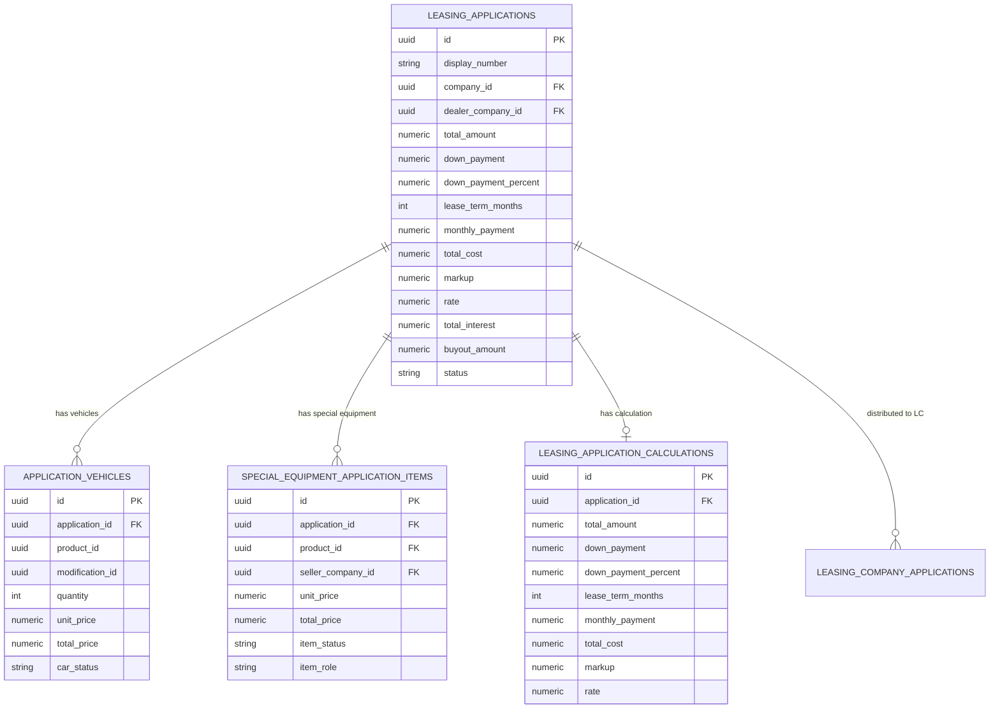
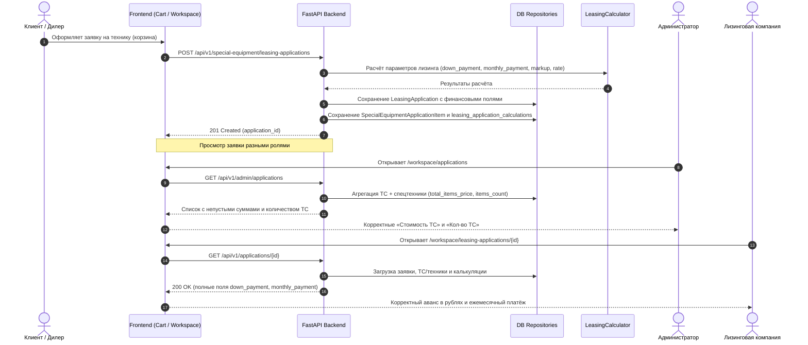

# Задача 22368: Отображение данных по ТС у админа, лизинговой и клиента, расчёт калькуляции заявки

- **Идентификатор задачи:** [22368](https://carcraftpro.bitrix24.ru/workgroups/group/124/tasks/task/view/22368/)
- **Ветка:** `bugfix/22368`
- **MR:** https://gitlab.carcraft.ru/carcraft/carcraft-leadgenerator/-/merge_requests/473
- **Дата и время создания:** 2026-09-29 03:21:16 MSK (UTC+3)

## 1. Постановка проблемы

На тестовом контуре (`test.multileasing.ru`) для заявки `c8489341-9c0d-4f99-82f6-cb4fa8979f91` (номер `0276951412-2509-002`) и аналогичных заявок со спецтехникой обнаружены дефекты:
1. **Калькуляция по заявке не считается:**
   - В ответе `GET /api/v1/applications/c8489341-9c0d-4f99-82f6-cb4fa8979f91` поля `down_payment`, `monthly_payment`, `total_cost`, `markup`, `rate`, `total_interest` имеют значение `null`, хотя `total_amount: 55269000.0`, `down_payment_percent: 20.0`, `lease_term_months: 36` заполнены.
   - В интерфейсе лизинговой компании (`/workspace/leasing-applications/{id}`) в секции «Запрошенные условия» отображаются прочерки: `Аванс (первоначальный взнос): — (20%)`, `Желаемый ежемесячный платёж: —`.
   - В списке лизинговых заявок (`LeasingApplicationsPanel.vue`) ежемесячный платёж скрыт.
2. **Нет данных по ТС / стоимость ТС 0 у администратора (`/workspace/applications`):**
   - В карточке заявки отображается: `Стоимость ТС: 0 ₽`, `Кол-во ТС: 0`.
   - При раскрытии «Подробнее» список позиций техники пуст, так как админка загружает только `application_vehicles` и не объединяет `special_equipment_application_items`.
3. **Стоимость ТС 0 ₽ у клиента (`/workspace/applications` и модальное окно деталей):**
   - В `ApplicationCard.vue` при режиме `actionMode === 'details'` вычисляется `vehicleOnlyAmount`, который фильтрует только `item.type === 'vehicle'` и для спецтехники возвращает 0.
   - В модальном окне `ApplicationDetailModal.vue` строка «Стоимость ТС» также выводит `0 ₽`.

## 2. Корневые причины

1. **Создание лизинговой заявки на спецтехнику без калькуляции:**
   - В `backend/application/special_equipment_commerce.py` функции `create_leasing_application` и `_create_cart_leasing_application` вызывают репозиторий `special_equipment_commerce_repository.py`, который напрямую создаёт запись `LeasingApplication(total_amount=..., down_payment_percent=..., lease_term_months=...)`, но **не производит расчёт лизинга** (`LeasingCalculator.compute_leasing` / `handle_calculate`), не заполняет поля `down_payment`, `monthly_payment`, `total_cost`, `markup`, `rate` и не создаёт запись в `leasing_application_calculations`.
2. **Отсутствие fallback-расчёта при получении заявки:**
   - Если заявка была создана без предрасчитанных финансовых полей, `handle_get_application` (`backend/application/queries/applications/get_application.py`) возвращает `null` для всех финансовых показателей, не восстанавливая их по имеющимся `total_amount`, `down_payment_percent` и `lease_term_months`.
3. **Репозиторий админки читает только `application_vehicles`:**
   - В `backend/infrastructure/repositories/admin_applications_repository.py` метод `_vehicles_count_and_total` делает `SELECT` исключительно из `ApplicationVehicle`. Позиции `SpecialEquipmentApplicationItem` игнорируются, поэтому `total_vehicles_price = 0` и `vehicles_count = 0`.
   - В `handle_get_admin_application_detail` формируется только `vehicle_price_items` из `ApplicationVehicle`, поле `items` со спецтехникой не формируется.
4. **Фронтенд-компоненты клиента рассчитывают стоимость ТС только по легковым авто:**
   - `calculateApplicationVehicleAmount` (`applicationVehicleAmount.ts`) фильтрует только `item.type === 'vehicle'`. Для спецтехники сумма `0`.
   - В `ApplicationCard.vue` отображение жестко завязано на `vehicleOnlyAmount` при `actionMode === 'details'`.

## 3. Требования

1. При создании лизинговой заявки со спецтехникой (через `POST /api/v1/special-equipment/leasing-applications` или коммерческий фасад) должны автоматически рассчитываться и сохраняться все финансовые показатели лизинга:
   - `down_payment` (в валюте/рублях, округлённый до копеек);
   - `monthly_payment`;
   - `total_cost`;
   - `markup`;
   - `rate`;
   - `total_interest`;
   - запись в `leasing_application_calculations`.
2. При чтении заявки (`GET /api/v1/applications/{id}`) для заявок с незаполненными финансовыми полями должен выполняться fallback-расчёт параметров калькуляции, чтобы клиент и лизинговая компания видели корректный первоначальный взнос в рублях и ежемесячный платёж.
3. В панели администратора (`/workspace/applications`):
   - В карточке заявки должны выводиться суммарная стоимость всех позиций (авто + спецтехника) и общее количество единиц техники;
   - В деталях заявки должны отображаться все позиции техники заявки (через `CommerceApplicationItemsSummary`).
4. В интерфейсах клиента (`ApplicationCard.vue`, `ApplicationDetailModal.vue`):
   - Стоимость техники / ТС не должна быть `0 ₽` при наличии позиций спецтехники;
   - `calculateApplicationVehicleAmount` должен учитывать активные позиции спецтехники.
5. В интерфейсе лизинговой компании (`/workspace/leasing-applications/[id]`):
   - В блоке «Запрошенные условия» должны корректно отображаться сумма первоначального взноса в рублях, процент аванса и ежемесячный платёж.

## 4. План реализации

1. **Бэкенд: Расчёт калькуляции при создании заявки на спецтехнику**
   - В `backend/application/special_equipment_commerce.py`:
     - Добавить расчёт финансовых параметров лизинга через `LeasingCalculator` при наличии `down_payment_percent`, `lease_term_months` и `total_amount`.
     - Передавать рассчитанные поля в репозиторий создания заявки (`create_leasing_application` и `create_leasing_application_from_items`).
     - Сохранять запись в `leasing_application_calculations`.
2. **Бэкенд: Fallback-расчёт при чтении заявки (`handle_get_application`)**
   - В `backend/application/queries/applications/get_application.py`:
     - Если `app_dict.get("monthly_payment")` или `app_dict.get("down_payment")` отсутствуют, но есть `total_amount`, `down_payment_percent` и `lease_term_months`, вычислить параметры калькуляции и обогатить результирующий словарь.
3. **Бэкенд: Агрегация ТС и техники в репозитории администратора**
   - В `backend/infrastructure/repositories/admin_applications_repository.py`:
     - Обновить `_vehicles_count_and_total` для учёта как `ApplicationVehicle`, так и `SpecialEquipmentApplicationItem` (исключая пересечения по `product_id`).
     - В `get_detail_base` также возвращать суммарное количество и стоимость единиц техники.
   - В `backend/application/queries/admin_applications/get_admin_application_detail.py`:
     - Загружать строки спецтехники через `app_repo.list_application_special_equipment_item_rows`.
     - Формировать `application["items"]` через `group_application_items`.
4. **Фронтенд: Отображение данных ТС и сумм**
   - В `frontend/features/applications/applicationVehicleAmount.ts`:
     - Учитывать как `type === 'vehicle'`, так и `type === 'special_equipment'` при подсчёте стоимости ТС/техники.
   - В `frontend/features/applications/components/ApplicationCard.vue`:
     - Использовать `clientEquipmentAmount || vehicleOnlyAmount` для отображения стоимости.
   - В `frontend/features/admin/applications/components/AdminApplicationsPanel.vue`:
     - Выводить `app.total_items_price || app.total_vehicles_price || app.total_amount || 0` и `app.items_count || app.vehicles_count || 0`.
   - В `frontend/pages/workspace/leasing-applications/[id]/index.vue`:
     - Предусмотреть отображение расчётного аванса, если он не пришёл отдельным полем.

## 5. Результаты проверок и критерии готовности (Definition of Done)

- [x] **Калькуляция спецтехники при создании заявки:** В `special_equipment_commerce.py` реализован вызов `compute_canonical_application_calculation`, сохранение финансовых показателей в `LeasingApplication` и создание записи в `leasing_application_calculations`.
- [x] **Fallback-калькуляция при чтении:** В `handle_get_application` (`get_application.py`) для заявок с незаполненными финансовыми полями вычисляются и возвращаются `down_payment`, `monthly_payment`, `total_cost`, `markup`, `rate`, `total_interest` (проверено на параметрах заявки `c8489341-9c0d-4f99-82f6-cb4fa8979f91`: сумма 55 269 000 ₽, аванс 20% -> 11 053 800 ₽, ежемесячный платёж 1 757 989 ₽).
- [x] **Агрегация ТС и спецтехники для администратора:** В `admin_applications_repository.py` метод `_vehicles_count_and_total` объединяет активные строки `ApplicationVehicle` и `SpecialEquipmentApplicationItem` (без дублирования по `product_id`), возвращая суммарное количество и стоимость. В `get_admin_application_detail.py` загружаются и группируются позиции спецтехники в `application["items"]`.
- [x] **Отображение на фронтенде:**
  - В `applicationVehicleAmount.ts` учитываются как авто, так и спецтехника (`vehicle`, `special_equipment`), добавлена поддержка `total_price`.
  - В `ApplicationCard.vue` реализован `equipmentAmountLabel` и цепочка fallback (`vehicleOnlyAmount || clientEquipmentAmount || applicationTotalAmount`), исключающая показ `0 ₽`.
  - В `AdminApplicationsPanel.vue` выводятся `items_count` и `total_items_price` с fallback на legacy-поля.
  - В `ApplicationDetailModal.vue` и `leasing-applications/[id]/index.vue` добавлены fallbacks для корректного отображения стоимости и аванса.
- [x] **Статические проверки бэкенда:** `ruff check . --fix` (All checks passed!), `lint-imports` (Contracts: 9 kept, 0 broken), `mypy .` (Success: no issues found in 1138 source files).
- [x] **Сборка фронтенда:** `bun run build:frontend` завершилась успешно (0 ошибок).
- [x] **Схема БД:** Схема не изменялась, новые миграции не требуются.

