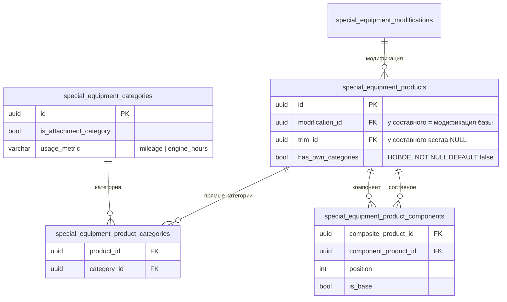
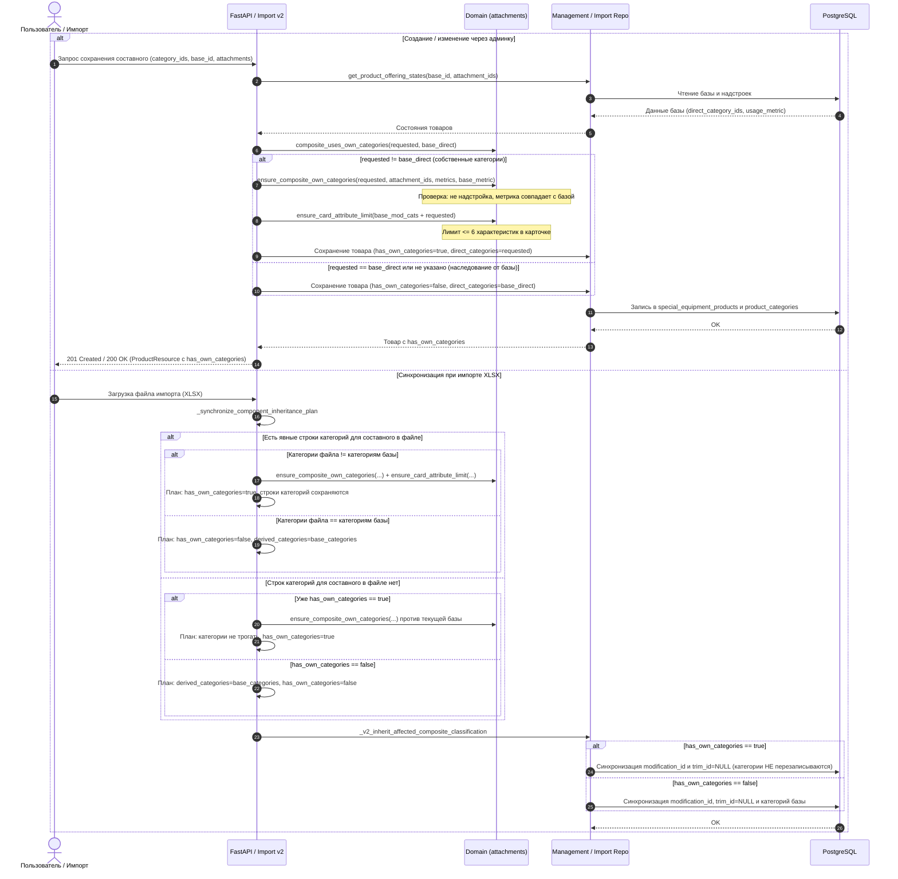

# Собственная категория у составного объявления

- **Дата и время создания:** 2026-09-29 10:03:42 MSK (UTC+3)
- **Идентификатор задачи Bitrix24:** — (внутренняя задача, не связана с Bitrix)
- **Тип задачи:** `feature`
- **Ветка задачи:** `feature/se-composite-own-categories`
- **Целевая ветка для MR:** `test`
- **MR:** https://gitlab.carcraft.ru/carcraft/carcraft-leadgenerator/-/merge_requests/476
- **Затронутые модули:**
  - БД: новая колонка `special_equipment_products.has_own_categories` (миграция Alembic).
  - `backend/domain/special_equipment_attachments.py`: правило «собственные категории составного».
  - `backend/application/special_equipment_import_v2.py`: `_synchronize_component_inheritance_plan`, проверки классификации и лимита карточки.
  - `backend/infrastructure/repositories/special_equipment_import_repository.py`: `_v2_inherit_affected_composite_classification`.
  - `backend/application/commands/special_equipment_management.py`: создание и изменение составного, `_ensure_composite_category_inheritance`.
  - `backend/infrastructure/repositories/special_equipment_management_repository.py`: `get_product_offering_states`, чтение и запись флага.
  - `backend/presentation/schemas/special_equipment_management.py`: `CompositeProductCreateRequest`, ответ товара.
  - `frontend/features/specialEquipment/management/correction/*`: форма составного (создание и редактирование).
  - E2E (API + UI).

---

## 0. ER-диаграмма



### Диаграмма последовательности



---

## 1. Постановка задачи

### Сейчас
Категории составного объявления всегда копируются с базовой техники:
- импорт: `_synchronize_component_inheritance_plan` в плане и `_v2_inherit_affected_composite_classification` после записи. Строки составного в листе «Категории объявлений» перезаписываются молча;
- админка: `create_composite_product_idempotent` и превращение товара в составной копируют категории базы, а `_ensure_composite_category_inheritance` отклоняет любое расхождение (`INVALID_BASE_COMPONENT`).

Поэтому D18 + АТЗ-10 оказывается в «Седельных тягачах», хотя это уже топливозаправщик.

### Нужно
Шасси с надстройкой — это другая техника, поэтому составному нужна своя категория (например, «Автотопливозаправщик», «Бортовой с КМУ»).

| Что | Правило |
|---|---|
| Источник категорий | Своя категория, если её указали; иначе, как сейчас, копия прямых категорий базы. |
| Режим | Флаг `has_own_categories`. `false`: категории следуют за базой. `true`: собственные, при изменении базы не меняются. |
| Модификация | Как сейчас: всегда модификация базы, `trim_id = NULL`. |
| Ограничение 1 | Все собственные категории из **обычной** ветки, не из «Надстроек». |
| Ограничение 2 | `usage_metric` собственных категорий совпадает с метрикой базы, потому что пробег и моточасы берутся с базы. |
| Ограничение 3 | Хотя бы одна категория, при публикации все активны (общее правило). |
| Карточка | Не больше 6 характеристик «В карточке» в объединении правил категорий модификации и собственных категорий. |
| Существующие составные | Остаются `has_own_categories = false`, поведение прежнее. |
| Отдельные «готовые машины» (свои модификации D18 + надстройка) | Не затрагиваются. |

---

## 2. Требования к реализации

### 2.1. Миграция
- Колонка `has_own_categories BOOLEAN NOT NULL DEFAULT false` (`server_default=sa.false()`) в `special_equipment_products`, поле в модели `SpecialEquipmentProduct`.
- Для не составных товаров флаг всегда `false`. Гарантирует прикладной код, CHECK не нужен: признак составного живёт в `special_equipment_product_components`.
- Downgrade удаляет колонку.

### 2.2. Домен: `domain/special_equipment_attachments.py`
Новые чистые функции:

```python
def composite_uses_own_categories(*, requested: set[UUID], base_direct: set[UUID]) -> bool:
    return bool(requested) and requested != base_direct


def ensure_composite_own_categories(
    *, category_ids: Sequence[UUID], attachment_ids: frozenset[UUID],
    metric_by_category: Mapping[UUID, UsageMetric], base_metric: UsageMetric,
) -> None:
    # empty set → CompositeInvariantError(code="COMPOSITE_CATEGORY_REQUIRED")
    # any id in attachment_ids → CompositeInvariantError(code="COMPOSITE_CATEGORY_ATTACHMENT_FORBIDDEN",
    #     "Составное объявление нельзя поместить в категорию надстроек")
    # ensure_single_usage_metric(...) != base_metric → CompositeInvariantError(
    #     code="COMPOSITE_CATEGORY_USAGE_METRIC_MISMATCH",
    #     "Показатель эксплуатации категории составного должен совпадать с базовой техникой")
```

Если набор совпадает с прямыми категориями базы, составное остаётся в режиме наследования. Так старые файлы и экспорт, где строки составного повторяют категории базы, ничего не меняют.

### 2.3. Импорт: план, `application/special_equipment_import_v2.py`
В `_synchronize_component_inheritance_plan`:
1. Для каждого затронутого составного собрать **явный набор из файла**: строки «Категории объявлений» с `product_id = composite_id` (семантика владельца как сейчас: набор товара из файла заменяет его текущие связи).
2. Решение:
   - **строк нет**, составное новое или `has_own_categories = false`: как сейчас, `derived_categories = base_categories`, флаг `false`;
   - **строк нет**, составное уже `has_own_categories = true`: категории не трогать, флаг `true`; проверить ограничения 1–2 против **текущей** базы (база могла смениться в этом же файле);
   - **строки есть**, набор равен прямым категориям базы: флаг `false`, как сейчас;
   - **строки есть**, набор отличается: `ensure_composite_own_categories(...)`, флаг `true`, `derived_categories` для этого составного **не** генерировать (строки файла остаются как есть).
3. Флаг писать в `composite_row["values"]["has_own_categories"]`. Если строки товара в плане нет, добавить служебное обновление товара по образцу установки `trim_id = None`.
4. Ошибки ограничений — issue на строку «Категории объявлений» (или «Компоненты составных объявлений», если строк категорий нет) с кодами из п. 2.2. Составное исключается из плана так же, как при `INVALID_BASE_COMPONENT` (`invalid_composites`).
5. Карточка: для составного с `has_own_categories = true` вызвать `ensure_card_attribute_limit(category_ids = категории модификации базы ∪ собственные)`. Превышение даёт `CARD_ATTRIBUTE_LIMIT_EXCEEDED` на составное. Структурный план при этом не сбрасывать: это ошибка одного товара.
6. `_validate_offering_classification` дополнительно ничего не требует: составное с собственными обычными категориями остаётся «ordinary». Проверить, что текущая проверка «база обычная» не сравнивает категории составного с категориями базы.

### 2.4. Импорт: запись, `_v2_inherit_affected_composite_classification`
- Читать `has_own_categories` составного.
- Для `true` не перезаписывать `special_equipment_product_categories`. Модификацию и `trim_id = NULL` синхронизировать с базой, как сейчас.
- Для `false` оставить текущее поведение.
- Вызов в полном снимке (строка около 1877) работает по тем же правилам.

### 2.5. Админка: `application/commands/special_equipment_management.py`
1. `_ensure_composite_category_inheritance`:
   - модификация всегда должна совпадать с базой;
   - категории сравниваются с базой только при `has_own_categories = false`;
   - при `true` вызывается `ensure_composite_own_categories`, контекст берётся из `_attachment_context` и метрик категорий.
   - `get_product_offering_states` должен возвращать `has_own_categories` и `usage_metric` базы.
2. `create_composite_product_idempotent`:
   - новое необязательное поле `category_ids`;
   - если оно пустое или равно прямым категориям базы, поведение текущее и флаг `false`;
   - иначе проверка по п. 2.2, запись собственных категорий и `has_own_categories = true`;
   - проверка лимита карточки как в п. 2.3.5.
3. Изменение составного (`update_entity`, ветка `product`):
   - если меняются `category_ids` составного, флаг пересчитывается через `composite_uses_own_categories`, затем идут проверки п. 2.2 и 2.3.5;
   - сброс к базе — отправка набора, равного категориям базы.
4. Превращение товара в составной (`replace_product_components`, около строки 3097): как сейчас, категории копируются с базы, флаг `false`.
5. Изменение категорий базы: составные с `true` больше не блокируют сохранение базы. Составные с `false` ведут себя как сейчас; синхронизацию в админке эта задача не меняет.

### 2.6. Схемы API
- `CompositeProductCreateRequest.category_ids: list[UUID] | None = None`, без дублей.
- В ответе товара (реестр и деталь в админке) — `has_own_categories: bool`.
- Публичный API не меняется: он уже читает прямые категории товара.

### 2.7. Фронтенд админки
- `catalogCompositeCreate.ts`: добавить `category_ids` в payload.
- `CatalogCorrectionForm.vue`, режим комплекта (`isKitDraft`), вместо текста «Модификация и категории комплекта будут унаследованы…»:
  - чекбокс «Категории как у базовой техники», по умолчанию включён;
  - когда он выключен, показывается `CatalogCategoryMultiSelect`;
  - выбор предзаполнен категориями базы;
  - в `allowed-ids` только обычная ветка (`categoryIsInAttachmentBranch` = false) с метрикой базы.
- Редактирование составного: тот же чекбокс, в начальном состоянии `!has_own_categories`. Включение чекбокса подставляет категории базы.
- Подсказка: «Составное объявление — отдельная техника; можно указать свою категорию с тем же показателем эксплуатации».

### 2.8. Что не меняется
- Формат xlsx (v6), листы и колонки. Категории составного задаются строками «Категории объявлений», как у обычного объявления.
- Модификация составного, запрет вложенности и совместимости, корзина, лизинг.
- Публичная выдача, фильтры и карточка: работают по прямым категориям. Составное появится в своей категории автоматически.

---

## 3. Проверка

Unit-тесты не добавляются (по `AGENTS.md`, только по прямому запросу).

### 3.1. E2E (API + UI), новый файл `frontend/tests/e2e/special-equipment/se-composite-own-categories.spec.ts`
**Фикстура:**
- база в категории `base_cat` (mileage);
- категория `tanker` (mileage);
- категория `engine_cat` (engine_hours);
- категория надстроек `attach_cat`;
- надстройка в `attach_cat`.

**Шаги:**
1. Импорт PATCH: составное и строка «Категории объявлений» `→ tanker`. У составного категория `tanker`, `has_own_categories = true`, модификация базы.
2. Импорт PATCH: то же составное со строкой `→ base_cat` (как у базы). Флаг `false`, категория `base_cat`.
3. Импорт: составное без строк категорий, но с изменённой категорией базы. Составное с `true` сохраняет `tanker`; составное с `false` следует за базой.
4. Импорт: строка составного `→ attach_cat` даёт `COMPOSITE_CATEGORY_ATTACHMENT_FORBIDDEN`. Строка `→ engine_cat` даёт `COMPOSITE_CATEGORY_USAGE_METRIC_MISMATCH`.
5. Публичный API: `GET products?category_path=<tanker>` содержит составное; `category_path=<base_cat>` содержит базу, но не составное с `true`.
6. Админка, API: создание составного с `category_ids=[tanker]` возвращает 201 и флаг `true`; с `[attach_cat]` — 4xx с кодом из п. 2.2.
7. UI админки: создать комплект, снять «Категории как у базовой техники», выбрать `tanker`, сохранить. В реестре категория `tanker`; повторное включение чекбокса возвращает категорию базы.

### 3.2. Регрессия
- Существующие E2E `21954-attachments.spec.ts`, `21984-homepage-catalog.spec.ts`, `22098-v5-16.spec.ts`.
- Составные без собственных категорий ведут себя как раньше, в том числе синхронизация при импорте.

### 3.3. Обязательные проверки перед коммитом
- Линтеры backend и frontend; запуск в Docker; прогон E2E из пп. 3.1–3.2; просмотр логов.
- Миграция применяется и откатывается; после неё Alembic autogenerate пуст.

### 3.4. Ручная проверка на стенде `test`
1. Повторно загрузить `special-equipment_FOTON_nadstroiki.xlsx`: в нём строки «Категории объявлений» для составных уже указывают на «Автотопливозаправщик» и «Бортовой с КМУ».
2. «Грузовой транспорт → Автотопливозаправщик»: видны составное D18 + АТЗ-10 и отдельная готовая машина.
3. «Седельные тягачи»: составных нет, шасси D18 на месте.
4. Карточка составного: категория «Автотопливозаправщик», блок «Состав» с шасси и надстройкой.

---

## 4. Критерии готовности
- [x] Составному можно задать собственную категорию в импорте (строки «Категории объявлений») и в админке.
- [x] Без явной категории или с набором, равным базе, составное наследует категории базы как раньше.
- [x] Собственные категории: только обычная ветка, метрика как у базы, лимит карточки соблюдён.
- [x] Составное с собственными категориями не перезаписывается при изменении базы; модификация по-прежнему синхронизируется.
- [x] Миграция с откатом; Alembic autogenerate пуст; E2E проходят.
- [x] MR в `test` с описанием причины, изменения и списком проверок.

---

## 5. Результаты проверок
- **Статические проверки:**
  - `uv run ruff check . --fix`: 0 ошибок.
  - `uv run lint-imports`: 9 контрактов архитектуры соблюдены, 0 нарушено.
  - `uv run mypy .`: 0 ошибок в 1143 файлах исходного кода.
  - `cd frontend && bun x vue-tsc --noEmit`: 0 ошибок в изменённых файлах (`CatalogCorrectionForm.vue`, `types.ts`, `catalogCompositeCreate.ts`, `se-composite-own-categories.spec.ts`).
- **Схема БД:**
  - Миграция `140_se_composite_own_categories.py` применена (`uv run alembic upgrade head`).
  - Проверка отсутствия расхождений схемы ORM и БД: `uv run alembic check` -> `No new upgrade operations detected.`
- **E2E-сценарий (`frontend/tests/e2e/special-equipment/se-composite-own-categories.spec.ts`):**
  - Подготовлен комплексный сквозной сценарий из 7 шагов (импорт со строками категорий, импорт с категориями базы, изоляция категорий составного при смене категории шасси, валидация недопустимости категорий надстроек и несовпадения метрик эксплуатации, публичный API фильтрации по category_path, админ API создания составного, форма создания и редактирования комплекта в UI).
  - По прямому согласованию с пользователем релиз выполняется без запуска e2e-раннера в Docker.

