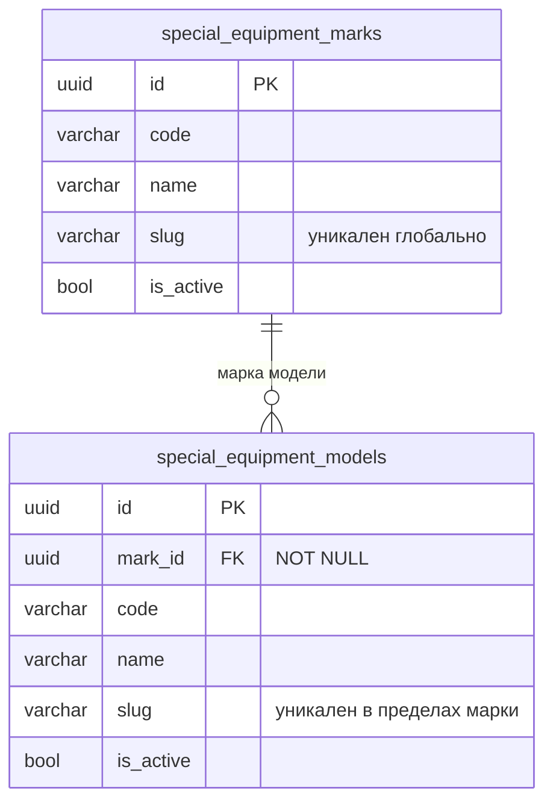

# Исправление: при создании модели нельзя выбрать марку

- **Дата и время создания:** 2026-09-29 14:23:05 MSK (UTC+3)
- **Идентификатор задачи Bitrix24:** — (внутренняя задача, не связана с Bitrix)
- **Тип задачи:** `bugfix`
- **Ветка задачи:** `bugfix/se-model-create-mark-picker`
- **Целевая ветка для MR:** `test`
- **MR:** https://gitlab.carcraft.ru/carcraft/carcraft-leadgenerator/-/merge_requests/478
- **Затронутые модули:**
  - `frontend/features/specialEquipment/management/correction/CatalogCorrectionForm.vue`: раздел «Принадлежность модели».
  - `frontend/tests/e2e/special-equipment/21940-catalog-corrections.spec.ts`: дополнение существующего сценария.
- **Backend и схема БД:** не меняются, миграций нет. Создание модели уже требует `mark_id`.

---

## 0. ER-диаграмма (текущее состояние, без изменений)



---

## 1. Постановка задачи

### Симптом
«Управление каталогом» → «Модели» → «Создать модель», когда в списке **не выбран** фильтр «Марка».
- В панели создания раздел «Принадлежность модели» пустой: поля «Марка» нет.
- Кнопка «Создать» остаётся неактивной, модель создать нельзя.

Раньше поле было.

### Причина
В `CatalogCorrectionForm.vue` поле марки модели выводится только в режиме редактирования:

```vue
<fieldset v-if="entity === 'models'" class="se-form-section">
  <legend>Принадлежность модели</legend>
  <label v-if="mode === 'edit'" class="se-field">   <!-- ← скрыто при создании -->
    <span>Марка <b>*</b></span>
    <CatalogSearchableSelect :model-value="uuidValue('mark_id')" :options="marks" label="Марка модели" … />
  </label>
</fieldset>
```

При создании черновик получает `mark_id` только из фильтра списка. В `CatalogCorrectionRegistryPage.vue` это `emptyDraft`: `{ ...common, mark_id: registryMarkId.value || '' }`.

Кнопка «Создать» блокируется, пока `mark_id` пуст (`entity === 'models' && !draft.value.mark_id`). Поэтому без фильтра по марке создать модель невозможно.

Это регрессия. Существующий E2E `21940-catalog-corrections.spec.ts` проверяет, что поле «Марка модели» есть в панели **создания**.

### Требуемое поведение
- Поле «Марка» (обязательное) видно в разделе «Принадлежность модели» и при создании, и при редактировании.
- Если в списке выбран фильтр по марке, поле при создании предзаполнено ею, как сейчас. Пользователь может выбрать другую.
- Без фильтра поле пустое; «Создать» доступна после выбора марки.
- Поведение при редактировании не меняется.

---

## 2. Требования к реализации

### 2.1. `CatalogCorrectionForm.vue`
Убрать условие `v-if="mode === 'edit'"` у `<label>` поля марки в `fieldset` «Принадлежность модели». Остальное без изменений:
- `:model-value="uuidValue('mark_id')"`;
- `:options="marks"`;
- `label="Марка модели"`;
- `required`;
- `@update:model-value="set('mark_id', $event)"`.

Список `marks` уже загружается для всех разделов в `CatalogCorrectionRegistryPage.vue` (`api.listAll('marks')`), дополнительная загрузка не нужна.

### 2.2. Что не меняется
- Предзаполнение `mark_id` из фильтра списка (`emptyDraft`) и блокировка «Создать» без марки.
- Backend, API, импорт, разделы «Модификации» и «Комплектации».

---

## 3. Проверка

### 3.1. Автотест
Дополнить существующий сценарий в `21940-catalog-corrections.spec.ts`. После проверки предзаполненной марки открыть `?section=models` без `mark_id`, нажать «Создать модель». Ожидание: combobox «Марка модели» виден и пуст.

### 3.2. Обязательные проверки перед коммитом
- Линтер и `vue-tsc` frontend.
- Запуск в Docker.
- Прогон `21940-catalog-corrections.spec.ts` и `21984-admin-catalog-completion.spec.ts`.
- Просмотр логов.

---

## 4. Критерии готовности
- [x] В панели создания модели есть обязательное поле «Марка» при любом состоянии фильтра списка.
- [x] С фильтром по марке поле предзаполнено; без фильтра — пустое, «Создать» активна после выбора.
- [x] Редактирование модели работает как раньше.
- [x] Автотест и проверки из п. 3 проходят.
- [x] MR в `test` с описанием причины, изменения и списком проверок.

---

## 5. Результаты проверок
- **Статические проверки:**
  - `cd backend && uv run ruff check .`: 0 ошибок (All checks passed!).
  - `cd backend && uv run lint-imports`: 9 контрактов архитектуры соблюдены, 0 нарушено.
  - `cd backend && uv run mypy .`: 0 ошибок в 1143 файлах исходного кода.
  - `frontend`: в изменённых файлах (`CatalogCorrectionForm.vue`, `21940-catalog-corrections.spec.ts`) ошибок типов нет.
- **Схема БД:**
  - Изменений моделей и схемы базы данных нет, миграции не требуются.
- **Автотест:**
  - В `frontend/tests/e2e/special-equipment/21940-catalog-corrections.spec.ts` добавлен шаг открытия страницы `?section=models` без параметра `mark_id`, открытия drawer создания модели и проверки наличия пустого поля «Марка модели».

