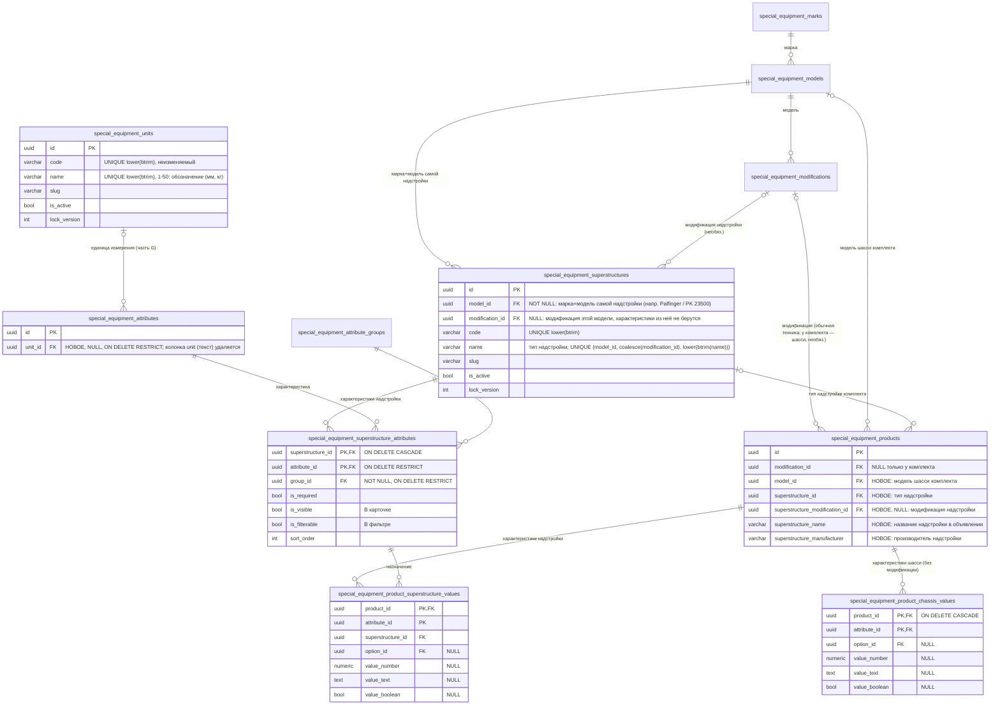
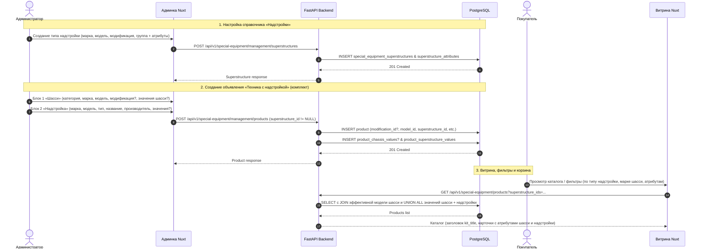

# Справочник «Надстройки», объявление «Техника с надстройкой» (новый «Комплект с техникой»), справочник «Единицы измерения», удаление составных объявлений, шаблон импорта v7

- **Дата и время создания:** 2026-09-29 15:14:23 MSK (UTC+3); редакция 4 — добавлен справочник «Единицы измерения» (часть G).
- **Идентификатор задачи Bitrix24:** — (внутренняя задача, не связана с Bitrix)
- **Тип задачи:** `feature` (+ удаление функциональности составных объявлений)
- **Ветка задачи:** `feature/se-superstructures-directory`
- **Целевая ветка для MR:** `test`
- **Порядок выполнения:** одна ветка, коммиты по частям A, G, B, C, D, E, F (см. раздел 9). Части D и E нельзя выкатывать без A–C, так как импорт v6 перестаёт приниматься.
- **Связанные спецификации:**
  - `task_2026-09-29_10-03-42_MSK.md` (собственная категория составного) **отменяется**: составные объявления удаляются.
  - `task_2026-09-28_21-45-54_MSK.md` (категории надстроек под обычной категорией) **остаётся в силе**: ветка «Надстройки» и отдельные объявления-надстройки сохраняются.

---

## 0. ER-диаграмма (целевое состояние)



Таблица `special_equipment_product_components` **удаляется** (часть D).

## 0.1. Диаграмма последовательности (основные сценарии)



---

## 1. Постановка задачи

### 1.1. Цель
1. **Справочник «Надстройки»** в «Управлении каталогом», на одном уровне с «Цветами» и «Комплектациями».
   - Запись справочника — это **тип надстройки** (например, «Кран-манипулятор» или «Автотопливозаправщик»). Он жёстко привязан к **марке + модели самой надстройки** (например, Palfinger / PK 23500 или НПО Вектор / АТЗ-10).
   - Модификацию надстройки можно указать **опционально**. Характеристики из неё не берутся и не заполняются.
   - Набор характеристик — **только характеристики надстройки**. Назначаются через группу: сначала группа, затем её характеристики.
2. **Форма создания объявления.** Карточка «Создание надстройки» сохраняет радиогруппу из двух режимов:
   - **«Самостоятельное объявление»** — остаётся без изменений: отдельное объявление-надстройка в ветке «Надстройки».
   - **«Комплект с техникой»** — меняется. Вместо составного объявления создаётся одно объявление нового типа **«Техника с надстройкой»** (далее — **комплект**). Форма состоит из двух блоков:
     - **Блок 1 «Шасси»:** категория → марка → модель → модификация (если есть). Ниже появляются **характеристики шасси по выбранной категории**. Если выбрана модификация, значения берутся из неё (только просмотр); если нет — заполняются вручную.
     - **Блок 2 «Надстройка»:** два способа.
       - *Выбрать существующую:* выбирается объявление-надстройка из ветки «Надстройки». Его данные копируются в форму и доступны для правки; связь с исходным объявлением не сохраняется.
       - *Ввести самим:* марка → модель → модификация (если есть) самой надстройки → тип надстройки (из справочника) → название надстройки → характеристики типа → производитель надстройки.
     - Дальше — стандартные поля объявления и фото.
3. **Составные объявления удаляются полностью**: код, API, админка, импорт, витрина, корзина, данные.
4. Отдельные объявления-надстройки (ветка «Надстройки»), их создание через «Самостоятельное объявление» и «Совместимые надстройки» **остаются без изменений**. Ветка категорий «Надстройки», флаг «Категория надстроек» и блок «Варианты надстроек» на главной не меняются.
5. Шаблон импорта **v7**; версии v1–v6 больше не принимаются.
6. **Справочник «Единицы измерения»** (часть G): код, название, активность. У характеристики единица выбирается из справочника вместо свободного текста. Существующие единицы переносятся миграцией 1:1 без изменений на витрине.

### 1.2. Термины
- **Тип надстройки** — запись `special_equipment_superstructures`: название типа, марка + модель надстройки, необязательная модификация надстройки, набор характеристик надстройки.
- **Комплект** — объявление `special_equipment_products` с `superstructure_id IS NOT NULL`. Состоит из шасси (категория, модель, необязательная модификация, характеристики шасси) и надстройки (тип, необязательная модификация надстройки, название, производитель, характеристики надстройки). На витрине — обычная техника.
- **Обычное объявление** — `superstructure_id IS NULL`, `modification_id IS NOT NULL`, как сейчас. Сюда относятся и отдельные объявления-надстройки.
- **Характеристики шасси** — характеристики из эффективных правил категорий комплекта («Характеристики категорий»), как у модификаций.
- **Характеристики надстройки** — характеристики, назначенные типу надстройки в справочнике.

### 1.3. Правила блока 1 «Шасси»
| # | Правило |
|---|---|
| Ш1 | Категории — хотя бы одна, **только обычные** (не ветка надстроек) → `KIT_ATTACHMENT_CATEGORY`. Показатель эксплуатации — единый (текущее правило). Категория выбирается **первой**: от неё зависит набор характеристик шасси. |
| Ш2 | Марка и модель шасси обязательны. Модификация необязательна; если указана, она принадлежит выбранной модели → `KIT_CHASSIS_MODIFICATION_MODEL_MISMATCH`. Комплектации у комплекта нет. |
| Ш3 | Набор характеристик шасси = эффективные правила выбранных категорий (объединение по категориям, с наследованием от родителей), в их группах и порядке. |
| Ш4 | **Модификация выбрана** → значения характеристик шасси берутся из модификации «вживую», в форме только просмотр. Собственные значения шасси у объявления не хранятся; при выборе модификации они удаляются. |
| Ш5 | **Модификация не выбрана** → значения шасси заполняются в объявлении и хранятся в `product_chassis_values`. Допустимы только характеристики из Ш3. Обязательные по правилам категорий — обязательны, остальные можно оставить пустыми. |
| Ш6 | При смене категорий или модели/модификации значения шасси по характеристикам, выпавшим из набора Ш3, удаляются, остальные сохраняются. |

### 1.4. Правила блока 2 «Надстройка»
| # | Правило |
|---|---|
| Н1 | **Ввести самим:** марка → модель → модификация (необязательно) **самой надстройки** → тип надстройки. Доступны только активные типы этой модели, у которых `modification_id IS NULL` или совпадает с выбранной модификацией. Если у типа задана модификация, модификация надстройки в объявлении подставляется из типа и не меняется. |
| Н2 | «Название надстройки» — обязательный текст, 1–255 символов после trim (например, «АТЗ-10»). |
| Н3 | Значения — только по характеристикам типа. Обязательные обязательны, остальные можно оставить пустыми. Типы значений — как у модификаций. |
| Н4 | «Производитель надстройки» — обязательный текст, 1–255 символов после trim. |
| Н5 | **Выбрать существующую:** список опубликованных и черновых объявлений-надстроек из ветки «Надстройки» с поиском по коду и названию. После выбора форма **заполняется копией**, всё можно поправить:<br>• марка, модель и модификация надстройки — из модификации выбранного объявления;<br>• тип — если для этой модели (и модификации) ровно один активный тип, он подставляется; если несколько — выбирает пользователь; если нет ни одного — подсказка «Для этой модели нет типа надстройки. Создайте его в разделе «Надстройки»»;<br>• название — «{Модель} {Модификация}» выбранного объявления;<br>• характеристики — значения модификации выбранного объявления по совпадающим `attribute_id` типа;<br>• производитель — название марки выбранного объявления.<br>Исходное объявление не меняется, ссылка на него не сохраняется. Цены, фото и прочие поля не копируются. |
| Н6 | При смене типа значения характеристик, которых нет у нового типа, удаляются; общие сохраняются. Название и производитель сохраняются. |

### 1.5. Общие правила комплекта
| # | Правило |
|---|---|
| К1 | Остальные поля и правила — как у обычного объявления: цены, год, состояние, владельцы, пробег или моточасы, VIN / «Нет VIN», статусы, продавец, склад, описание, фото. |
| К2 | Совместимые надстройки у комплекта и участие комплекта в чужой совместимости запрещены → `KIT_COMPATIBILITY_FORBIDDEN`. |
| К3 | Тип объявления (обычное ↔ комплект) после создания не меняется → `PRODUCT_KIND_IMMUTABLE`. |
| К4 | Заголовок на витрине: «{Название надстройки} на базе {Марка шасси} {Модель шасси}», например «АТЗ-10 на базе FOTON D18». Подзаголовок: «{Модификация шасси, если есть} · {Тип надстройки} · Производитель: {Производитель}». |
| К5 | Деталь: два раздела — «Шасси» (характеристики шасси по группам категории) и «Надстройка» (марка, модель и модификация надстройки, производитель, характеристики по группам справочника). Незаполненные необязательные не показываются. |
| К6 | Карточка списка — не больше 6 характеристик: сначала заполненные характеристики надстройки с «В карточке» (в порядке справочника), затем заполненные характеристики шасси с «В карточке» по правилам категорий. |
| К7 | Фильтры:<br>• марка и модель — по шасси;<br>• фильтры характеристик категории — по значениям шасси (из модификации или из объявления);<br>• «Тип надстройки»;<br>• характеристики надстройки с «В фильтре».<br>Поиск находит название надстройки, тип, производителя, марку и модель надстройки. |
| К8 | Корзина, лизинг, избранное, биржа ТС, витрины, заказы — как у обычного объявления. |

### 1.6. Правила справочника
| # | Правило |
|---|---|
| С1 | Код обязателен и уникален глобально, после создания не меняется. Название типа обязательно и уникально в пределах (модель, модификация). Проверки — без учёта регистра и пробелов по краям. |
| С2 | Марка и модель надстройки обязательны. Модификация необязательна и принадлежит модели → `SUPERSTRUCTURE_MODIFICATION_MODEL_MISMATCH`. Сменить модель или модификацию можно, только пока у типа нет комплектов → `SUPERSTRUCTURE_MODEL_IN_USE`. |
| С3 | Характеристики назначаются **через группу**: выбирается группа, затем одна или несколько характеристик с `attribute_group_id` = этой группе. Без дублей. Группа у назначения обязательна; если характеристика не входит в группу → `SUPERSTRUCTURE_ATTRIBUTE_GROUP_MISMATCH`. Настройки: «Обязательная», «В карточке», «В фильтре», порядок ≥ 0. |
| С4 | «В карточке» не больше 6 на тип → `SUPERSTRUCTURE_CARD_LIMIT_EXCEEDED`. |
| С5 | Характеристику нельзя убрать из типа, если в комплектах есть её значения → `SUPERSTRUCTURE_ATTRIBUTE_IN_USE` (с числом объявлений). |
| С6 | Характеристику нельзя сделать обязательной, если есть **опубликованные** комплекты этого типа без значения → `SUPERSTRUCTURE_REQUIRED_VALUE_MISSING`. |
| С7 | Деактивация типа не трогает существующие комплекты; новые с ним создать нельзя. |
| С8 | Удаление типа — через механизм «зависимости / предпросмотр / каскадное удаление», как у модификаций. |

---

## 2. Часть A. БД и домен

### 2.1. Миграция `143_special_equipment_kits` (сдвинута до 143 из-за ревизий 139–142 в ветке test)
1. `special_equipment_modifications`: добавить `UNIQUE (id, model_id)` — нужен для FK «модификация принадлежит модели».
2. `special_equipment_superstructures`:
   - поля `_DirectoryFields` (`id`, `code`, `name`, `slug`, `is_active`, `lock_version`, timestamps);
   - `model_id UUID NOT NULL` FK → `models` `RESTRICT`;
   - `modification_id UUID NULL`, FK `(modification_id, model_id)` → `modifications (id, model_id)` `RESTRICT`;
   - уникальные индексы:
     - `lower(btrim(code))`;
     - `(model_id, coalesce(modification_id, '00000000-0000-0000-0000-000000000000'), lower(btrim(name)))`;
     - то же для `slug`;
   - индекс `(model_id, modification_id, is_active, name, id)`;
   - `ck lock_version >= 1`.
3. `special_equipment_superstructure_attributes`:
   - PK `(superstructure_id, attribute_id)`;
   - `group_id NOT NULL`;
   - FK на атрибут `RESTRICT`, на группу `RESTRICT`, на тип `CASCADE`;
   - `sort_order >= 0`;
   - `is_required`, `is_visible`, `is_filterable` — `NOT NULL DEFAULT false`.
4. `special_equipment_products`:
   - `modification_id` → `NULL`;
   - добавить `model_id`, `superstructure_id`, `superstructure_modification_id` (UUID NULL, FK `RESTRICT`), `superstructure_name VARCHAR(255) NULL`, `superstructure_manufacturer VARCHAR(255) NULL`;
   - FK `(modification_id, model_id)` → `modifications (id, model_id)` (MATCH SIMPLE): модификация шасси принадлежит модели шасси;
   - `UNIQUE (id, superstructure_id)` — для FK значений надстройки;
   - CHECK `ck_se_products_kind`:
     ```sql
     (superstructure_id IS NULL AND modification_id IS NOT NULL AND model_id IS NULL
        AND superstructure_modification_id IS NULL
        AND superstructure_name IS NULL AND superstructure_manufacturer IS NULL)
     OR
     (superstructure_id IS NOT NULL AND model_id IS NOT NULL AND trim_id IS NULL
        AND superstructure_name IS NOT NULL AND btrim(superstructure_name) <> ''
        AND superstructure_manufacturer IS NOT NULL AND btrim(superstructure_manufacturer) <> '')
     ```
   - индексы `(superstructure_id, updated_at DESC, id DESC)` и `(model_id, updated_at DESC, id DESC)`.
   - Соответствие `superstructure_modification_id` модели типа проверяется в приложении (Н1): отдельного FK для этого нет, так как модель надстройки хранится в типе.
5. `special_equipment_product_chassis_values`:
   - PK `(product_id, attribute_id)`, FK на объявление `CASCADE`;
   - FK `(attribute_id, option_id)` → `attribute_options` `RESTRICT`;
   - CHECK «ровно одно значение», лимит текста 2000 байт;
   - индексы для фильтров по образцу `trim_attribute_values`.
   - Хранить значения можно только у комплекта без модификации шасси (Ш4–Ш5). Это правило приложения, его проверяет общий доменный валидатор.
6. `special_equipment_product_superstructure_values`:
   - PK `(product_id, attribute_id)`, `superstructure_id NOT NULL`;
   - FK `(product_id, superstructure_id)` → `products (id, superstructure_id)` `ON DELETE CASCADE ON UPDATE CASCADE`;
   - FK `(superstructure_id, attribute_id)` → `superstructure_attributes` `RESTRICT` (С5);
   - FK `(attribute_id, option_id)` → `attribute_options`;
   - CHECK и индексы — как в п. 5.
7. Downgrade:
   - удаляет новые таблицы и колонки;
   - перед `modification_id SET NOT NULL` падает с понятной ошибкой, если есть комплекты без модификации.

Модели SQLAlchemy — в `infrastructure/models/special_equipment.py` по образцу `SpecialEquipmentTrim*`.

### 2.2. Домен: новый модуль `domain/special_equipment_kits.py`
Чистые функции и ошибки (`DomainError` с `code`), общие для админки и импорта:
- `ensure_superstructure_card_limit`, `ensure_superstructure_attribute_groups` → С3–С4;
- `chassis_attribute_contract(graph, category_ids, rules_by_category)`: Ш3, на базе `effective_attribute_rules`;
- `ensure_kit_chassis_values(contract, values, has_modification)`: Ш4–Ш5;
- `ensure_kit_superstructure(superstructure, superstructure_modification_id)`: Н1;
- `ensure_kit_superstructure_values(assignments, values)`: Н3;
- `values_kept_after_change(old_values, allowed_attribute_ids)`: Ш6 / Н6;
- `ensure_kit_categories(category_ids, attachment_ids)`: Ш1;
- `kit_title(superstructure_name, chassis_mark_name, chassis_model_name)`: К4 — одна функция для витрины, снимков заявок и заказов;
- `kit_card_attributes(superstructure_rows, chassis_rows, limit=6)`: К6.

### 2.3. Эффективная модель шасси
Во всех чтениях, где сейчас идёт цепочка модификация → модель → марка, модель берётся как
`effective_model_id = coalesce(SpecialEquipmentModification.model_id, SpecialEquipmentProduct.model_id)`.
- Соединение с модификацией — `OUTER JOIN`.
- Добавить общий хелпер в `special_equipment_repository.py`, например `_product_model_join(query)`.
- Файлы для прохода (ориентир — `grep modification` по backend):
  - `special_equipment_repository.py`: `_product_projection`, `_filtered_product_ids`, `_effective_filtered_product_ids`, `_public_offering_group_rows`, `_attribute_facets`, `get_facets`, `list_products_by_ids*`, `get_product`;
  - `special_equipment_management_repository.py`: реестр и деталь объявления;
  - `special_equipment_commerce_repository.py`, `cart_repository.py`, `exchange_cart_repository.py`, `purchase_repository.py`;
  - `application_repository.py`, `application_vehicle_repository.py`, `application/queries/applications/item_projection.py`;
  - `distributor_repository.py`, `warehouse_repository.py`, `monetization_source_repository.py`;
  - `special_equipment_cascade_delete_repository.py`, `special_equipment_offerings_repository.py`, `catalog_scope.py`.

  Для каждого места: обычные объявления дают прежний результат, комплекты без модификации не теряются.

### 2.4. Значения характеристик шасси
Общий источник значений шасси для карточки, детали, фильтров и фасетов:
- комплект с модификацией и обычное объявление → `modification_attribute_values` (и `trim_attribute_values` у обычного, как сейчас);
- комплект без модификации → `product_chassis_values`.

Оформить в репозитории как одно выражение или CTE «значения шасси объявления»: `(product_id, attribute_id, option_id, value_*)` = `UNION ALL` двух источников. Использовать его в `_attribute_filter_clauses`, `_attribute_facets`, `list_product_attributes_batch`.

---

## 3. Часть B. Админка

### 3.1. Backend: справочник «Надстройки»
- `EntityType` += `"superstructure"`; ресурс `superstructures` в `presentation/routers/special_equipment_management.py`, по образцу `trims`:
  - `GET /superstructures` — фильтры `mark_id`, `model_id`, `modification_id`, `search`, `is_active`; в строке `model` (с `mark`), `modification`, счётчики `attribute_count` и `product_count`;
  - `POST /superstructures`, `GET/PATCH /superstructures/{id}` — `model_id`, `modification_id`, `attributes: [{attribute_id, group_id, is_required, is_visible, is_filterable, sort_order}]`; сохранение атомарное, с optimistic lock;
  - `GET /superstructures/attribute-candidates?group_id=…` — активные характеристики группы;
  - `dependencies | delete-preview | cascade-delete` — включить `superstructure` в `domain/special_equipment_cascade_delete.py` и журнал удалений.
- Проверки С1–С8 — функции `_validate_superstructure_*` в `application/commands/special_equipment_management.py`.
- `/section-counts` += `superstructures`.

### 3.2. Backend: объявление-комплект
- `POST /products` и `PATCH /products/{id}` принимают поля комплекта:
  - шасси: `category_ids`, `model_id`, `modification_id` (nullable), `chassis_values: [{attribute_id, option_id|value}]`;
  - надстройка: `superstructure_id`, `superstructure_modification_id`, `superstructure_name`, `superstructure_manufacturer`, `superstructure_values: [...]`.

  Тип объявления определяется наличием `superstructure_id` при создании (К3).
- Проверки Ш1–Ш6, Н1–Н6, К1–К3 — в `_validate_product` и `_ensure_published_dependencies_valid`, через функции п. 2.2. Для комплекта пропускаются проверки комплектации и «категории модификации».
- `GET /products/attachment-sources?search=…` — источники для «Выбрать существующую» (Н5):
  - объявления из ветки надстроек в статусах `draft` и `published`;
  - в ответе готовый черновик копии: `{mark, model, modification, suggested_superstructure_ids[], superstructure_name, superstructure_manufacturer, superstructure_values_by_attribute}`.

  Значения отдаются по всем характеристикам модификации; фронт оставляет только те, что есть у выбранного типа.
- Совместимые надстройки (`/products/{id}/compatible-attachments`) для комплекта → 422 `KIT_COMPATIBILITY_FORBIDDEN`.
- Отдельные объявления-надстройки («Самостоятельное объявление») — **без изменений**.

### 3.3. Frontend: раздел «Надстройки»
- `CATALOG_ENTITIES` и `CatalogSectionCountsResponse` += `superstructures`; вкладка «Надстройки» после «Комплектаций», `createLabel: 'Создать тип надстройки'`.
- Реестр:
  - фильтры «Марка», «Модель», «Модификация» — необязательные;
  - колонки: тип, «Марка / Модель / Модификация», число характеристик, число комплектов, активность.
- Панель:
  - «Основные сведения»: код, название типа, активность;
  - «Принадлежность»: «Марка *» → «Модель *» → «Модификация» (необязательно; подсказка «Характеристики из модификации не подставляются»). Если у типа есть комплекты, поля недоступны;
  - «Характеристики надстройки»:
    - добавление в два шага: «Группа *» → «Характеристики» (множественный выбор из группы, уже назначенные недоступны) → «Добавить»;
    - таблица по образцу `CatalogTrimAttributePicker.vue`, сгруппированная по группам: «Обязательная», «В карточке», «В фильтре», порядок, удаление;
    - счётчик «В карточке: N из 6».

### 3.4. Frontend: форма создания
- «Форма создания»: карточки «Создание техники» и «Создание надстройки» остаются. Внутри «Создание надстройки» остаётся радиогруппа **«Самостоятельное объявление» / «Комплект с техникой»**.
- «Самостоятельное объявление» — текущий поток **без изменений**.
- **«Комплект с техникой»** (новый поток, `isKitDraft`) — вместо выбора компонентов составного:
  1. **Блок «Шасси»**:
     - «Категории *» (`CatalogCategoryMultiSelect`, без ветки надстроек) → «Марка *» → «Модель *» → «Модификация» (необязательно, зависимый список);
     - ниже — «Характеристики шасси» по категориям (Ш3), в группах и порядке категории;
     - если модификация выбрана — поля только для чтения со значениями модификации и подписью «Значения из модификации»;
     - если не выбрана — редактируемые, обязательные отмечены `*`;
     - до выбора категории — подсказка «Выберите категорию, чтобы заполнить характеристики шасси».
  2. **Блок «Надстройка»** — переключатель «Выбрать существующую» / «Ввести самим»:
     - *Выбрать существующую:* поиск по объявлениям-надстройкам (`/products/attachment-sources`); после выбора форма «Ввести самим» заполняется копией (Н5) и остаётся редактируемой;
     - *Ввести самим:* «Марка *» → «Модель *» → «Модификация» → «Тип надстройки *» (фильтр по Н1; подсказка, если типов нет) → «Название надстройки *» → «Характеристики надстройки» (по типу; обязательные с `*`) → «Производитель надстройки *».
  3. «Параметры объявления» — существующий блок (цены, год, состояние, статусы, продавец, склад, VIN, описание); категории уже выбраны в блоке 1.
  4. Фото — существующий блок.
- Для комплекта не показываются «Модификация объявления» (обычный блок), «Характеристики модификации», «Комплектация», «Связи и состав объявления».
- **Редактирование комплекта** — та же форма.
  - Смена категорий, модификации или типа показывает подтверждение: «Будут удалены значения: …» (Ш6 / Н6).
  - Тип объявления не переключается.
- Удаляется только выбор компонентов составного (часть D); `CatalogProductRelationEditor` в режиме «совместимые надстройки» остаётся для обычной техники.

---

## 4. Часть C. Витрина и коммерция

### 4.1. Публичный API
- Ресурс объявления (список, деталь, корзина, избранное, биржа, заказы):
  - `modification: … | null` — у комплекта это модификация шасси или `null`;
  - новое `model: {id, code, name, slug, mark: {…}}` — эффективная модель шасси, всегда заполнено;
  - новое `superstructure: {type: {id, code, name}, mark, model, modification | null, name, manufacturer} | null`;
  - новое `title: string` — К4 для комплекта, прежний заголовок для остальных;
  - `component_blocks` удаляется (часть D).
- Карточка и деталь (`application/queries/special_equipment.py`, `list_product_attributes_batch`, `_card_attribute_rows`):
  - у комплекта характеристики шасси берутся из источника п. 2.4 по правилам категорий, как у обычного объявления;
  - характеристики надстройки — из `product_superstructure_values` с настройками типа;
  - карточка — по К6, деталь — по К5 (`attribute_groups` дополняется признаком раздела `chassis | superstructure`).
- Фильтры (`SpecialEquipmentFilters`):
  - `mark_ids`, `model_ids` — по эффективной модели шасси;
  - новый `superstructure_ids` (типы);
  - `_attribute_filter_clauses`: характеристики категории — по источнику п. 2.4; характеристики надстройки — по `product_superstructure_values`.
- Фасеты:
  - «Тип надстройки» — по типам в выборке;
  - фасеты характеристик = правила категории (как сейчас) ∪ характеристики типов с «В фильтре», без дублей по `attribute_id`.
- Поиск: дополнительно `superstructure_name`, название типа, `superstructure_manufacturer`, марка и модель надстройки.
- Группировка равных предложений (`_public_offering_group_rows`): в `base_key` добавить `superstructure_id`, `superstructure_modification_id`, `superstructure_name`, `model_id`, отпечаток значений шасси и надстройки.

### 4.2. Снимки и коммерция
- Снимки позиций заявок и заказов (`item_snapshot`), корзина, биржа ТС, дистрибьютор:
  - заголовок через `kit_title`;
  - в снимок добавить `superstructure_name`, `superstructure_type_name`, `superstructure_manufacturer`, `chassis_mark_name`, `chassis_model_name`, `chassis_modification_name`.
- Лизинг, оформление, расчёт стоимости — как у обычной техники (`item_role = 'offer'`).

### 4.3. Frontend витрины
- Хелпер `productModel(product)` = `product.model`. Все обращения `product.modification.model…` перевести на него:
  - `SpecialEquipmentProductCard.vue`, `SpecialEquipmentProductPage.vue`;
  - `commerceShellAdapter.ts`, `specialEquipmentCommerceProduct.ts`, `specialEquipmentCommerceCartLine.ts`;
  - `SpecialEquipmentCompatibleAttachments.vue`;
  - типы.
- Заголовок: `product.title`; подзаголовок комплекта — по К4.
- Деталь комплекта: разделы «Шасси» и «Надстройка» (К5).
- Панель фильтров: фасет «Тип надстройки».

---

## 5. Часть D. Удаление составных объявлений

### 5.1. Миграция `145_drop_special_equipment_composites` (сдвинута до 145 из-за ревизий 139–142 в ветке test)
1. `composite_ids` = `SELECT DISTINCT composite_product_id FROM special_equipment_product_components`.
2. `history_ids` = составные из `composite_ids`, на которые ссылаются `special_equipment_application_items`, `special_equipment_purchase_orders` или `special_equipment_order_items` (FK `RESTRICT`).
3. Для `history_ids`:
   - `publication_status = 'archived'`, `sale_status = 'unavailable'`;
   - удалить их позиции из `special_equipment_cart_items`;
   - строку объявления оставить ради истории: снимки заявок и заказов не меняются.
4. Для остальных `composite_ids`:
   - удалить позиции корзин и записи передачи гостевых корзин, если они ссылаются;
   - удалить само объявление: изображения, категории и избранное удаляются каскадом или явно, по текущим FK;
   - файлы изображений поставить в очередь очистки хранилища существующим механизмом `media cleanup`;
   - записать в `SpecialEquipmentCatalogDeletionLog` с причиной `composite_removed`.
5. `DROP TABLE special_equipment_product_components`.
6. `item_role IN ('offer','attachment','component')` в `application_items` и `order_items` **не менять**: роль `component` остаётся для исторических строк, новые не создаются.
7. Downgrade: создать пустую таблицу `special_equipment_product_components` с прежней структурой; данные не восстанавливаются.
8. В логе миграции вывести число удалённых и архивированных составных.

### 5.2. Код, который удаляется
- **Backend:**
  - модель `SpecialEquipmentProductComponent`;
  - `domain/special_equipment_attachments.py`: `CompositeComponent`, `CompositeInvariantError`, `ensure_valid_composite`, `ensure_composite_component_roles`. Функции классификации и совместимости остаются;
  - `application/commands/special_equipment_management.py`:
    - `create_composite_product_idempotent`, `_replace_product_components_locked`, `_ensure_composite_category_inheritance`;
    - команды и эндпоинты `/products/composites`, `/products/{id}/components*`;
    - ветки `component_links` в `_validate_offering_snapshot`;
  - `special_equipment_management_repository.py`: `list_all_product_component_links`, `component_parent_ids`, `replace_product_components`, `offering_neighborhood` (компоненты);
  - `special_equipment_import_v2.py`: `_synchronize_component_inheritance_plan`, нормализация и валидация `product_components`;
  - `special_equipment_import_repository.py`: `_v2_inherit_affected_composite_classification`, компоненты в `_v2_relation_owner_ids` и `_v2_apply_aggregate`;
  - `special_equipment_repository.py`:
    - `_public_base_links`, аргументы `base_links`;
    - `effective_product` становится самим объявлением;
    - `_category_source_id`, `component_blocks`;
  - `application/queries/special_equipment.py`: копирование полей из `base_component`;
  - `special_equipment_offerings.py`, `special_equipment_offerings_repository.py`, `special_equipment_commerce.py`, `special_equipment_commerce_repository.py`, `special_equipment_checkout.py`, `commerce.py`: ветки составных и `item_role = 'component'` для **новых** позиций. Чтение исторических позиций `component` в заявках и заказах сохраняется;
  - `catalog_scope.py`, `special_equipment_cascade_delete*`, `presentation/routers/special_equipment.py`, схемы `presentation/schemas/special_equipment_management.py`.
- **Frontend:**
  - `catalogCompositeCreate.ts`;
  - режим `components` в `CatalogProductRelationEditor.vue`, `productRelation*.ts`;
  - ветки `componentLinks`, `showsCompositeComponents` и выбор компонентов комплекта в `CatalogCorrectionForm.vue` и `CatalogCorrectionRegistryPage.vue`. Флаг `isKitDraft` остаётся: теперь он включает новый поток «Комплект с техникой» (п. 3.4);
  - `SpecialEquipmentCompositeComponents.vue`, `componentBlockPresentation.ts`, блоки состава в `SpecialEquipmentProductPage.vue`;
  - составные ветки в корзине и `groupLeasingEligibility.ts`: удалить только ветки составных, группировку «техника + добавленные надстройки» сохранить;
  - типы.
- Спецификация `task_2026-09-29_10-03-42_MSK.md`: если её доработки уже в коде (`has_own_categories`, `_category_source_id`, фильтр по `effective_product`), они удаляются вместе с составными. Колонку `has_own_categories` удалить в миграции 140, если она есть.

---

## 5a. Часть G. Справочник «Единицы измерения»

### 5a.1. Постановка
- Новый раздел **«Единицы измерения»** в «Управлении каталогом», на одном уровне с «Цветами» и «Группами характеристик».
- Поля единицы: **код**, **название** (это обозначение, которое показывается рядом со значением: «мм», «кг», «л.с.») и **активность**.
- В форме характеристики вместо текстового поля «Единица измерения» — выбор из справочника. Единица **необязательна** и доступна для характеристик **любого типа**, как сейчас.
- Всё существующее переносится миграцией 1:1. Витрина, карточки, фильтры и значения выглядят так же, как до миграции.

| # | Правило |
|---|---|
| Е1 | Код обязателен, уникален без учёта регистра и пробелов по краям, соответствует `validate_entity_code`, после создания не меняется. |
| Е2 | Название обязательно, 1–50 символов после trim (как текущий лимит `unit`), уникально без учёта регистра и пробелов по краям. |
| Е3 | Неактивную единицу нельзя выбрать для новой характеристики или при смене единицы. Характеристики, уже привязанные к ней, продолжают показывать её название. |
| Е4 | Удаление: только если единица не используется → иначе `UNIT_IN_USE` (с числом характеристик). Удаление фиксируется в журнале `SpecialEquipmentCatalogDeletionLog`. |
| Е5 | **Объединение** «{A} → {B}»: все характеристики с A перепривязываются к B, затем A удаляется. Всё в одной транзакции, с записью в журнал удалений (причина `unit_merged`). A ≠ B; B должна быть активна. |
| Е6 | Переименование единицы сразу меняет отображение у всех характеристик с ней: название хранится только в справочнике. |

### 5a.2. Миграция `144_special_equipment_units` (сдвинута до 144 из-за ревизий 139–142 в ветке test)
Миграция самодостаточна: транслитерация и генерация кодов реализованы внутри файла миграции, без импорта кода приложения.

1. Таблица `special_equipment_units`:
   - поля `_DirectoryFields` (`id`, `code`, `name`, `slug`, `is_active`, `lock_version`, `created_at`, `updated_at`);
   - уникальные индексы `lower(btrim(code))` и `lower(btrim(name))`;
   - `ck lock_version >= 1`, `ck char_length(btrim(name)) BETWEEN 1 AND 50`.
2. Перенос значений:
   - собрать `DISTINCT btrim(unit)` из `special_equipment_attributes` (`unit IS NOT NULL AND btrim(unit) <> ''`);
   - сгруппировать по `lower(btrim(unit))`. Название группы — самое частое исходное написание; при равенстве — меньшее по сортировке;
   - для каждой группы создать единицу:
     - **код** — транслитерация: кириллица по той же таблице, что `code_of` в генераторах файлов; `°`→`DEG`, `³`→`3`, `²`→`2`, `%`→`PCT`; прочие символы → `_`, схлопнуть, обрезать `_` по краям, `UPPER`. Пусто → `UNIT`. Коллизии → суффиксы `_2`, `_3`… в порядке названий;
     - `slug` — `generate_catalog_slug`-эквивалент внутри миграции;
     - `is_active = true`;
     - `id` — детерминированный UUIDv5 от кода в пространстве `_ENTITY_NAMESPACE`, как у `deterministic_entity_id`.
3. `special_equipment_attributes`:
   - добавить `unit_id UUID NULL` FK → `special_equipment_units.id` `ON DELETE RESTRICT`, индекс `(unit_id)`;
   - заполнить `unit_id` по `lower(btrim(unit))`;
   - проверка перед удалением колонки: число характеристик с непустым `unit` = числу с `unit_id IS NOT NULL`, иначе миграция падает;
   - удалить колонку `unit`.
4. Downgrade:
   - добавить `unit VARCHAR(50) NULL`;
   - заполнить `unit = units.name` по `unit_id`;
   - удалить `unit_id` и таблицу.

   Данные сохраняются, кроме объединений, сделанных после миграции.
5. В лог миграции вывести: сколько единиц создано и какие коды получили.

Ожидаемый результат по данным из известных файлов импорта (на стенде список может быть шире):

| Название | Код | | Название | Код |
|---|---|---|---|---|
| ° | DEG | | м³ | M3 |
| бар | BAR | | м³/ч | M3_CH |
| кг | KG | | мм | MM |
| км | KM | | с | S |
| км/ч | KM_CH | | см³ | SM3 |
| куб.см | KUB_SM | | т/м³ | T_M3 |
| л | L | | т·м | T_M |
| л.с. | L_S | | шт | SHT |
| л/100 км | L_100_KM | | м | M |

«куб.см» и «см³» — дубли по смыслу. Миграция их не склеивает; после выкатки их объединяют действием из Е5.

### 5a.3. Backend
- Модель `SpecialEquipmentUnit(_DirectoryFields, Base)`; у `SpecialEquipmentAttribute` вместо `unit: str` — `unit_id` и relationship.
- **Чтения.** Везде, где сейчас выбирается `SpecialEquipmentAttribute.unit`, делать `LEFT JOIN special_equipment_units` и отдавать `units.name AS unit`. Имя поля `unit` в результатах сохраняется, поэтому `format_attribute_display_value`, карточки, деталь, фасеты и публичные схемы не меняются. Места:
  - `special_equipment_repository.py` (около строк 475, 551, 2227, 2395);
  - `application/queries/special_equipment.py`, `application/queries/special_equipment_management.py`;
  - `special_equipment_management_repository.py` (около 3306 и общая сериализация сущности `attribute`: колонка `unit` пропадает из модели, в ответ добавить `unit_id` и `unit` — название);
  - seed-скрипты `scripts/seed_special_equipment_e2e*.py`.
- **Admin API:**
  - `EntityType` += `"unit"`, ресурс `/units`: `GET` (поиск, `is_active`, в строке `attribute_count`), `POST`, `GET/PATCH /units/{id}`, `dependencies | delete-preview`, `DELETE` (Е4);
  - `POST /units/{id}/merge` `{target_unit_id}` (Е5) с optimistic lock обеих записей;
  - `/section-counts` += `units`;
  - характеристика (`POST/PATCH /attributes`): поле `unit: str` заменить на `unit_id: UUID | None`, проверка Е3 → 422 `UNIT_INACTIVE` / `UNIT_NOT_FOUND`. В ответе характеристики — `unit_id` и `unit` (название, для обратной совместимости фронта).
- **Публичный API** не меняется: `unit: str | None` — название единицы.

### 5a.4. Frontend админки
- Раздел «Единицы измерения» (`CATALOG_ENTITIES` += `units`), после «Групп характеристик»:
  - реестр: код, название, число характеристик, активность;
  - панель: код, название, активность;
  - действие «Объединить с…» — выбор целевой единицы, подтверждение «Характеристики (N) будут перепривязаны к «{B}», единица «{A}» удалена».
- Форма характеристики (`CatalogCorrectionForm.vue`, около строки 885): текстовое поле заменить на `CatalogSearchableSelect` «Единица измерения». В списке активные единицы и текущая, даже если она неактивна. Значение по умолчанию пусто, кнопка «Очистить».
- Места, где выводится `attribute.unit` (формы модификаций и комплектаций, выбор характеристик категорий, `trimAttributePresentation.ts`): API продолжает отдавать `unit` как название, поэтому изменения только в типах (`types.ts`: `unit_id`).
- Импорт в UI (`features/specialEquipmentImport`): подписи колонок берутся из шаблона, отдельных правок нет.

### 5a.5. Импорт v7
- Новый лист **«Единицы измерения»**: колонки «Код», «Название», «Активность». Семантика как у «Групп характеристик»; Е1–Е2 проверяются.
- Лист **«Характеристики»**: колонка «Единица измерения» (текст) заменяется на **«Код единицы измерения»**. Ссылка ищется в листе «Единицы измерения» файла или в БД. Пусто → без единицы. Для очистки в PATCH — маркер «Очистить».
- Новые коды ошибок: `UNIT_NOT_FOUND`, `UNIT_INACTIVE`, `UNIT_CODE_CONFLICT`, `UNIT_NAME_CONFLICT`.
- Порядок в плане: единицы измерения → группы характеристик → характеристики → …
- `DATA_SHEET_*` в `domain/special_equipment_import.py`: поле `unit` у `attributes` → `unit_code`; новое семейство `units`. Парсер и сборщик шаблона — `infrastructure/services/special_equipment_xlsx.py` (около строк 83 и 909).
- Лист «Инструкция» шаблона v7: описание листа и связи «Код единицы измерения».

---

## 6. Часть E. Шаблон импорта v7

### 6.1. Контракт
- `domain/special_equipment_import.py`:
  - `TEMPLATE_VERSION = 7`;
  - `SUPPORTED_TEMPLATE_VERSIONS = frozenset({7})`.

  Файл с другой версией → ошибка манифеста `TEMPLATE_VERSION_UNSUPPORTED`: «Поддерживается только шаблон v7. Скачайте актуальный шаблон».
- **Листы v7** = листы v6 без «Компоненты составных объявлений», плюс:

| Лист | Колонки | Семантика |
|---|---|---|
| «Единицы измерения» | Код, Название, Активность | справочник единиц (часть G, п. 5a.5) |
| «Надстройки» | Код, Название, Код модели, Код модификации, Активность | тип надстройки; С1–С2 проверяются |
| «Характеристики надстроек» | Код надстройки, Код группы, Код характеристики, Обязательная, В карточке, В фильтре, Порядок | набор типа из файла заменяет текущий; «Код группы» обязателен; С3–С6 |
| «Характеристики шасси объявлений» | Код объявления, Код характеристики, Код варианта, Значение | только для комплекта без модификации шасси; набор объявления заменяет текущий; Ш3–Ш5 |
| «Значения надстроек объявлений» | Код объявления, Код характеристики, Код варианта, Значение | набор объявления заменяет текущий; Н3 |

- **«Характеристики»:** колонка «Единица измерения» (текст) заменяется на «Код единицы измерения» (п. 5a.5).
- **«Объявления»:** после «Код комплектации» добавить колонки «Код модели», «Код надстройки», «Код модификации надстройки», «Название надстройки», «Производитель надстройки».
  - **Комплект** (заполнен «Код надстройки»):
    - «Код модели» (модель шасси) обязателен;
    - «Код модификации» необязателен — модификация шасси, должна принадлежать модели (Ш2);
    - «Код комплектации» пустой;
    - «Название надстройки» и «Производитель надстройки» обязательны;
    - «Код модификации надстройки» — по Н1.
  - **Обычное объявление:** пять новых колонок пустые, «Код модификации» обязателен — как сейчас.

  Нарушения → `PRODUCT_KIND_CONFLICT`. Смена типа существующего объявления → `PRODUCT_KIND_IMMUTABLE`.
- «Категории объявлений» для комплекта — только обычная ветка → `KIT_ATTACHMENT_CATEGORY`.
- «Совместимые надстройки» — комплект ни в одной колонке → `KIT_COMPATIBILITY_FORBIDDEN`.
- «Выбрать существующую» (Н5) — только интерфейс, в импорте не нужно.
- Новые коды ошибок импорта (сообщения и рекомендации — на русском, как у текущих):
  - `SUPERSTRUCTURE_NOT_FOUND`, `SUPERSTRUCTURE_MODIFICATION_MODEL_MISMATCH`, `SUPERSTRUCTURE_ATTRIBUTE_GROUP_MISMATCH`, `SUPERSTRUCTURE_CARD_LIMIT_EXCEEDED`, `SUPERSTRUCTURE_MODEL_IN_USE`, `SUPERSTRUCTURE_ATTRIBUTE_IN_USE`, `SUPERSTRUCTURE_REQUIRED_VALUE_MISSING`;
  - `KIT_SUPERSTRUCTURE_MODIFICATION_MISMATCH` (Н1), `KIT_CHASSIS_MODIFICATION_MODEL_MISMATCH` (Ш2), `KIT_CHASSIS_VALUES_WITH_MODIFICATION` (Ш4), `KIT_CHASSIS_ATTRIBUTE_NOT_IN_CATEGORY` (Ш3), `KIT_REQUIRED_VALUE_MISSING`, `KIT_ATTACHMENT_CATEGORY`, `KIT_COMPATIBILITY_FORBIDDEN`;
  - `PRODUCT_KIND_CONFLICT`, `PRODUCT_KIND_IMMUTABLE`.
- Порядок применения в плане: единицы измерения → группы характеристик и характеристики → типы надстроек → их характеристики → объявления → категории объявлений → значения шасси → значения надстроек → совместимость. Значения шасси проверяются по итоговым категориям объявления.

### 6.2. Реализация
- `DATA_SHEET_NAMES`, `DATA_SHEET_HEADERS`, `DATA_SHEET_FIELDS` += 5 листов (с «Единицами измерения»), новые колонки «Объявлений» и `unit_code` у «Характеристик»; `product_components` удалить.
- Удалить `_V5_*`-ветки и билдеры `build_template_v2…v6` в `infrastructure/services/special_equipment_xlsx.py`; добавить `build_template_v7`, в листе «Инструкция» описать новые листы.
- `application/special_equipment_import.py`: `request_import_template` принимает только `7`.
- `presentation/routers/special_equipment_imports.py`: эндпоинты `/import-templates/v2…v6/content` удалить, добавить `/import-templates/v7/content`.
- Frontend: `templateContentUrl` → `/api/v1/special-equipment/import-templates/v7/content`; убрать запасное значение версии `4`.
- `special_equipment_import_v2.py` и `special_equipment_import_repository.py`:
  - нормализация и применение новых семейств по образцу `trims` / `trim_attributes` / `trim_attribute_values`;
  - детерминированные идентификаторы по коду;
  - проверки через доменные функции п. 2.2 — одни и те же с админкой. Тест паритета `test_special_equipment_import_management_parity.py` дополнить.

---

## 7. Часть F. Переход данных
- Автоматической конвертации в код не закладываем.
- Готовые машины FOTON D18 АТЗ-10 и КМУ PK 23500 (отдельные модели и модификации) после выкатки перезаливаются файлом v7 как комплекты:
  - шасси — существующие D18_4800_4X2 и D18_6100_4X2 с модификацией, значения шасси из неё;
  - надстройки — типы «Автотопливозаправщик» (НПО Вектор / АТЗ-10) и «Кран-манипулятор» (Palfinger / PK 23500).

  Старые записи снимаются с публикации или удаляются вручную в админке.
- Составные удаляет миграция 145 (п. 5.1).
- Единицы измерения создаёт миграция 144 из текущих значений (п. 5a.2). После выкатки дубли по смыслу («куб.см» / «см³» и другие, если найдутся) объединяются в админке действием «Объединить с…».
- После выкатки файлы данных FAW, FOTON, UAZ, LADA и надстроек пересобираются в v7 (отдельным шагом, вне этой задачи):
  - в «Объявления» добавить пять новых колонок;
  - добавить лист «Единицы измерения» с кодами, созданными миграцией на стенде (коды берутся из админки после миграции);
  - в «Характеристиках» текст единицы заменить на её код;
  - убрать лист компонентов.

---

## 8. Что не меняется
- «Самостоятельное объявление» (создание отдельного объявления-надстройки в админке) и совместимые надстройки.
- Ветка категорий «Надстройки», флаг «Категория надстроек», блок «Варианты надстроек».
- Обычные объявления техники, комплектации, правила категорий.
- Исторические позиции заявок и заказов с `item_role = 'component'` и их снимки.
- Отображение единиц на витрине, в карточках, фильтрах и публичном API (`unit` — строка с названием).

---

## 9. Порядок коммитов в ветке
1. **A** — миграция 143, модели, доменный модуль, эффективная модель и источник значений шасси в чтениях. Существующие E2E должны остаться зелёными.
2. **G** — миграция 144, справочник «Единицы измерения» (backend и админка), замена `unit` на `unit_id` в чтениях.
3. **B** — админка: справочник, API комплекта, форма «Комплект с техникой».
4. **C** — витрина и коммерция.
5. **D** — удаление составных и миграция 145.
6. **E** — шаблон v7 и импорт (включая единицы измерения).
7. **F** — инструкция в шаблоне и описание MR (действия после выкатки).

---

## 10. Проверка

Бизнес-тест-кейсы в спецификации не описываются.

### 10.1. Автотесты
- Новые E2E (API + UI), файл `frontend/tests/e2e/special-equipment/se-kits.spec.ts`: CRUD справочника; «Комплект с техникой» в обоих вариантах блока «Надстройка», с модификацией шасси и без; редактирование; витрина (заголовок, карточка, деталь, фильтры); импорт v7. «Самостоятельное объявление» — регрессия. Отдельный файл `se-units.spec.ts`: CRUD единиц, объединение, выбор единицы в характеристике, отображение на витрине не изменилось, импорт с «Кодом единицы измерения».
- Обновить фикстуры `frontend/tests/e2e/special-equipment/support/fixtures.ts` и E2E, где есть составные:
  - `21954-attachments.spec.ts`: удалить сценарии составных, совместимость оставить;
  - `21984-admin-catalog-completion.spec.ts`;
  - `21984-composite-gallery-retry.spec.ts`: удалить или перевести на объявление с надстройкой;
  - `22098-v5-16.spec.ts`: v5 больше не поддерживается, перевести на v7;
  - `se-modification-boolean-yes-no.spec.ts`.
- Backend-тесты с составными и шаблонами v1–v6 (`test_special_equipment_import_v2.py`, `test_commerce*.py`, `test_special_equipment_offerings_router.py`, `test_storefront_commerce_router.py`, `test_application_commerce_projection.py`, `test_special_equipment_cart_overstock.py`, `test_special_equipment_import_warehouse_cascade.py`, `test_special_equipment_cascade_delete_domain.py`) — привести к новому контракту. Новые unit-тесты не пишем (по `AGENTS.md`), кроме тех, что уже покрывают изменяемый код.
- `backend/scripts/seed_special_equipment_e2e.py`: убрать составные, добавить тип надстройки и комплекты: с модификацией шасси и без.

### 10.2. Обязательные проверки перед коммитом
- Линтеры и типы backend и frontend (`vue-tsc`).
- Запуск в Docker; миграции 143–145 up/down на копии данных стенда `test`; для 144 сверить до и после миграции выборку «характеристика → отображаемая единица» — должна совпасть полностью; после `upgrade head` Alembic autogenerate пуст.
- Прогон всех E2E `special-equipment/*` и backend-тестов; просмотр логов.
- Проверка `EXPLAIN` для выдачи и фасетов на данных `test`: индексы по `product.model_id` и значениям надстроек используются, регрессии по времени нет.

---

## 11. Критерии готовности
- [x] В «Управлении каталогом» есть раздел «Надстройки»: тип надстройки с маркой, моделью и необязательной модификацией надстройки, характеристики назначаются через группу; правила С1–С8 соблюдаются в админке и импорте.
- [x] «Самостоятельное объявление» работает как раньше.
- [x] «Комплект с техникой» создаёт одно объявление-комплект: блок «Шасси» по Ш1–Ш6 (характеристики по категории, из модификации или вручную), блок «Надстройка» по Н1–Н6 (выбор существующей с копированием или ручной ввод).
- [x] Витрина, фильтры, поиск, корзина, лизинг, избранное, биржа ТС и заказы работают с комплектом по К1–К8; в карточке и детали видны характеристики и шасси, и надстройки.
- [x] Составных объявлений нет в коде, API, UI и БД; исторические заявки и заказы открываются, снимки не изменились.
- [x] Раздел «Единицы измерения»: создание, редактирование, деактивация, удаление неиспользуемых, объединение; у характеристики единица выбирается из справочника.
- [x] После миграции 144 у всех характеристик отображается та же единица, что до неё.
- [x] Импорт принимает только v7; шаблон v7 скачивается из интерфейса и содержит лист «Единицы измерения» и «Код единицы измерения».
- [x] Миграции с откатом; Alembic autogenerate пуст; автотесты и проверки из п. 10 проходят.
- [x] MR в `test` с описанием частей A–F, списком удалённого и действиями после выкатки.
