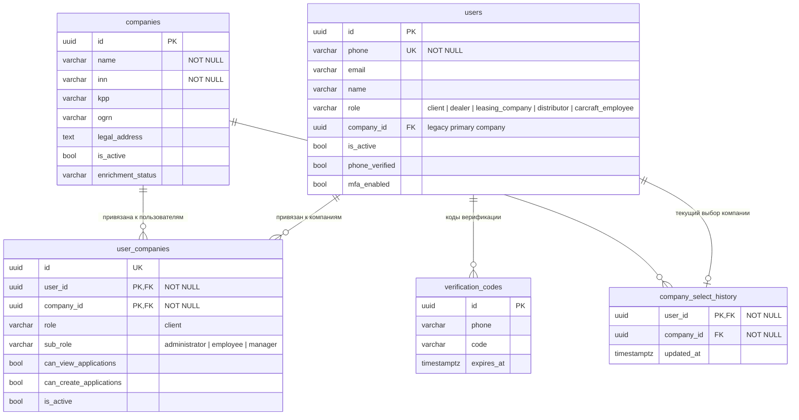
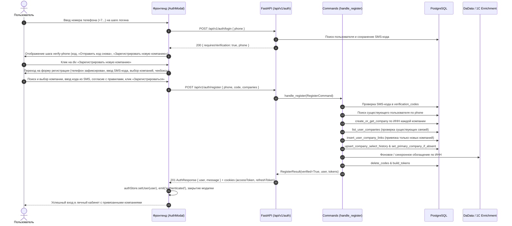

# Регистрация новой компании для существующего пользователя на форме входа

- **Дата и время создания:** 2026-09-29 15:16:52 MSK (UTC+3)
- **Идентификатор задачи Bitrix24:** — (внутренняя задача, не связана с Bitrix)
- **Тип задачи:** `feature`
- **Ветка задачи:** `feature/register-company-existing-user`
- **Целевая ветка для MR:** `test`
- **MR:** https://gitlab.carcraft.ru/carcraft/carcraft-leadgenerator/-/merge_requests/480
- **Затронутые модули:**
  - `frontend/features/auth/components/AuthModal.vue`
  - `backend/application/commands/auth.py`
  - `backend/presentation/routers/auth.py`
  - `backend/tests/test_auth.py`
- **Схема БД:** без миграций (используются существующие таблицы `users`, `companies`, `user_companies`, `company_select_history`, `verification_codes`).

---

## 0. Архитектурные диаграммы

### 0.1. ER-диаграмма затронутых сущностей



### 0.2. Sequence-диаграмма сценария регистрации компании существующим пользователем



---

## 1. Постановка задачи

### 1.1. Контекст и проблема
При входе в систему по номеру телефона (`activeStep === 'verify-phone'`):
- Если пользователь уже существует в базе, ему на телефон отправляется 4-значный код подтверждения, и отображается блок:
  ```html
  <div>
    <label for="verificationCode">Код подтверждения</label>
    <input id="verificationCode" maxlength="4" ...>
    <div class="mt-3 text-sm text-[color:var(--storefront-text-muted,#4b5563)] flex items-center justify-between">
      <span v-if="verificationCountdown > 0">Повтор через ...с</span>
      <button ...>Отправить код снова</button>
    </div>
  </div>
  ```
- Если данный пользователь открыл новую компанию (или хочет привязать ещё одно юрлицо к своему аккаунту), сейчас он не может сделать это с экрана входа:
  - Попытка зарегистрироваться через общую регистрацию приводила к ошибке `409 Conflict` (`Пользователь уже существует`).
  - Привязать новую компанию можно было только после входа, если соответствующий интерфейс доступен.

### 1.2. Требования пользователя
1. На шаге подтверждения телефона (`activeStep === 'verify-phone'`), на той же строчке, где расположена кнопка «Отправить код снова», добавить прожимающийся элемент `<div>` с текстом **«Зарегистрировать новую компанию»**.
2. При нажатии на этот элемент должна открываться форма регистрации (`activeStep === 'register-code'`) с уже предзаполненным номером телефона, полем ввода кода из SMS, блоком выбора компаний с автокомплитом и кнопкой «+ Добавить ещё компанию», чекбоксами согласия с Политикой конфиденциальности и Пользовательским соглашением, ссылкой «Уже есть аккаунт? Войти» и кнопкой «Зарегистрироваться».
3. При отправке формы:
   - **Новый пользователь не создаётся**.
   - К существующему пользователю и его уже имеющимся компаниям привязываются выбранные на форме новые компании.
   - Пользователь успешно авторизуется (выдаются токены / сессионные cookies) и попадает в систему.

---

## 2. Детальные требования к реализации

### 2.1. Фронтенд (`frontend/features/auth/components/AuthModal.vue`)

1. **Добавление кнопки перехода в блоке `verify-phone`:**
   - В контейнере строки повторной отправки кода:
     ```html
     <div class="mt-3 text-sm text-[color:var(--storefront-text-muted,#4b5563)] flex items-center justify-between">
       <div class="flex items-center gap-2">
         <span v-if="verificationCountdown > 0">Повтор через {{ verificationCountdown }}с</span>
         <button
           type="button"
           class="storefront-action-ghost text-[color:var(--storefront-ghost-foreground,#2563eb)] hover:text-[color:var(--storefront-ghost-hover-foreground,#1e40af)] disabled:text-[color:var(--storefront-ghost-disabled-foreground,#9ca3af)]"
           :disabled="verificationResendLoading || verificationCountdown > 0"
           @click="handleResendVerificationCode"
         >
           {{ verificationResendLoading ? 'Отправка...' : 'Отправить код снова' }}
         </button>
       </div>
       <div
         role="button"
         tabindex="0"
         class="cursor-pointer storefront-action-ghost text-[color:var(--storefront-ghost-foreground,#2563eb)] hover:text-[color:var(--storefront-ghost-hover-foreground,#1e40af)]"
         @click="startRegisterCompanyForExistingUser"
         @keydown.enter="startRegisterCompanyForExistingUser"
       >
         Зарегистрировать новую компанию
       </div>
     </div>
     ```
2. **Логика перехода `startRegisterCompanyForExistingUser`:**
   - Сохранить телефон `registrationPhone.value = pendingVerificationPhone.value`.
   - Перенести введенный код (если пользователь уже начал его вводить): `form.value.code = verificationCode.value`.
   - Перенести состояние кулдауна: `resendCountdown.value = verificationCountdown.value`.
   - Установить `previousStep.value = 'verify-phone'`.
   - Переключить `activeStep.value = 'register-code'`.
   - Очистить ошибку `error.value = ''`.
3. **Навигация «Назад» (`goBack`):**
   - Если `activeStep === 'register-code'` и `previousStep === 'verify-phone'`, возвращать пользователя на шаг `'verify-phone'`, сохраняя телефон и перенося введённый код обратно в `verificationCode`.
4. **Валидация перед отправкой:**
   - Если пользователь перешёл с шага `'verify-phone'` (регистрация компании к существующему аккаунту), проверять, что выбрана хотя бы одна компания (`companiesPayload.length > 0`). Если не выбрана — выводить понятную ошибку: `Выберите хотя бы одну компанию`.
   - Проверять валидность кода (4 цифры) и принятие обязательных документов (чекбоксы).

### 2.2. Бэкенд (`backend/application/commands/auth.py`, `backend/presentation/routers/auth.py`)

1. **Обработка существующего пользователя в `handle_register`:**
   - Если `await repo.phone_exists(session, cmd.phone)`:
     - Если `not cmd.code`: по-прежнему выбрасывать `UserAlreadyExistsError()` (409 Conflict), предотвращая несанкционированные запросы без кода подтверждения.
     - Если `cmd.code` передан:
       1. Проверить lockout: `phone_lockout.is_locked(cmd.phone)`.
       2. Проверить SMS-код: `await repo.verify_code(session, cmd.phone, cmd.code)`. Если не совпадает — зарегистрировать ошибку и выбросить `InvalidVerificationCodeError()`.
       3. Очистить lockout: `await phone_lockout.clear(cmd.phone)`.
       4. Получить существующего пользователя: `user = await repo.find_user_by_phone(session, cmd.phone)`.
       5. Проверить активность: `user["is_active"]`.
       6. Если `not user.get("phone_verified")` — установить `phone_verified = True` и отправить событие статуса.
       7. Создать/найти компании из `cmd.companies` через `company_repo.create_or_get_company`.
       8. Получить список уже привязанных к пользователю компаний через `company_repo.list_user_companies(session, user["id"])`.
       9. Отфильтровать только новые компании (`c["id"] not in existing_company_ids`).
       10. Для новых компаний вставить связи в `user_companies` с ролью `administrator` (если компания создана впервые `is_new`) либо `employee`, правами `can_view`/`can_create`.
       11. Если у пользователя не была установлена основная компания (`user["company_id"] is None`), установить первую новую компанию.
       12. Обновить историю выбора компании `upsert_company_select_history` на добавленную компанию.
       13. Запустить обогащение DaData / 1C (`_enrich_companies`).
       14. Удалить использованный SMS-код (`delete_codes`).
       15. Проверить MFA (`mfa_enabled` / `is_mfa_required`).
       16. Сформировать токены через `build_tokens` и вернуть `RegisterResult(verified=True, phone=cmd.phone, message="Компании успешно добавлены", user=formatted_user, tokens=tokens)`.
2. **Форматирование пользователя `_format_user_with_permissions`:**
   - Дополнить возвращаемый словарь полем `available_companies` (список всех активных компаний пользователя), `active_role`, `active_company_id`, `active_company_name`, чтобы фронтенд сразу получил актуальное дерево компаний без повторного запроса.
3. **Роутер `POST /api/v1/auth/register`:**
   - Поддерживать возврат `MfaStepUpRequiredResponse` и `MfaSetupRequiredResponse`, если у пользователя активирована двухфакторная аутентификация.

---

## 3. Критерии готовности (Definition of Done)

1. **UI на шаге `verify-phone`:**
   - На строке кнопки «Отправить код снова» отображается интерактивный div «Зарегистрировать новую компанию».
   - Клик по нему открывает форму регистрации с предзаполненным номером телефона, полем ввода кода из SMS, выбором компаний и чекбоксами.
   - Кнопка «Назад» возвращает на шаг подтверждения телефона.
2. **Логика регистрации компании:**
   - При заполнении компании, кода из SMS и согласий форма успешно отправляется.
   - Существующий аккаунт пользователя сохраняется (новый `user.id` не создаётся).
   - Выбранная компания привязывается в `user_companies` к существующему пользователю.
   - Ранее привязанные компании пользователя сохраняются и не затираются.
   - Пользователь успешно авторизуется: выставляются cookies `accessToken` и `refreshToken`, модалка закрывается, интерфейс обновляется с учётом новой компании.
3. **Безопасность:**
   - Без валидного 4-значного SMS-кода привязать компанию к существующему номеру невозможно (возвращается ошибка кода или 409 Conflict).
   - Действует rate-limit и защита от подбора (phone lockout).
4. **Проверки:**
   - Статические линтеры FastAPI: `ruff check`, `lint-imports`, `mypy` проходят без ошибок.
   - Отсутствие расхождений схемы Alembic: `uv run alembic check` возвращает `No new upgrade operations detected.`
   - Автотесты в `backend/tests/test_auth.py` проходят успешно (существующие + новый тест сценария привязки компании существующему пользователю с валидным кодом).
   - E2E сценарий в браузере подтверждает корректность поведения.
