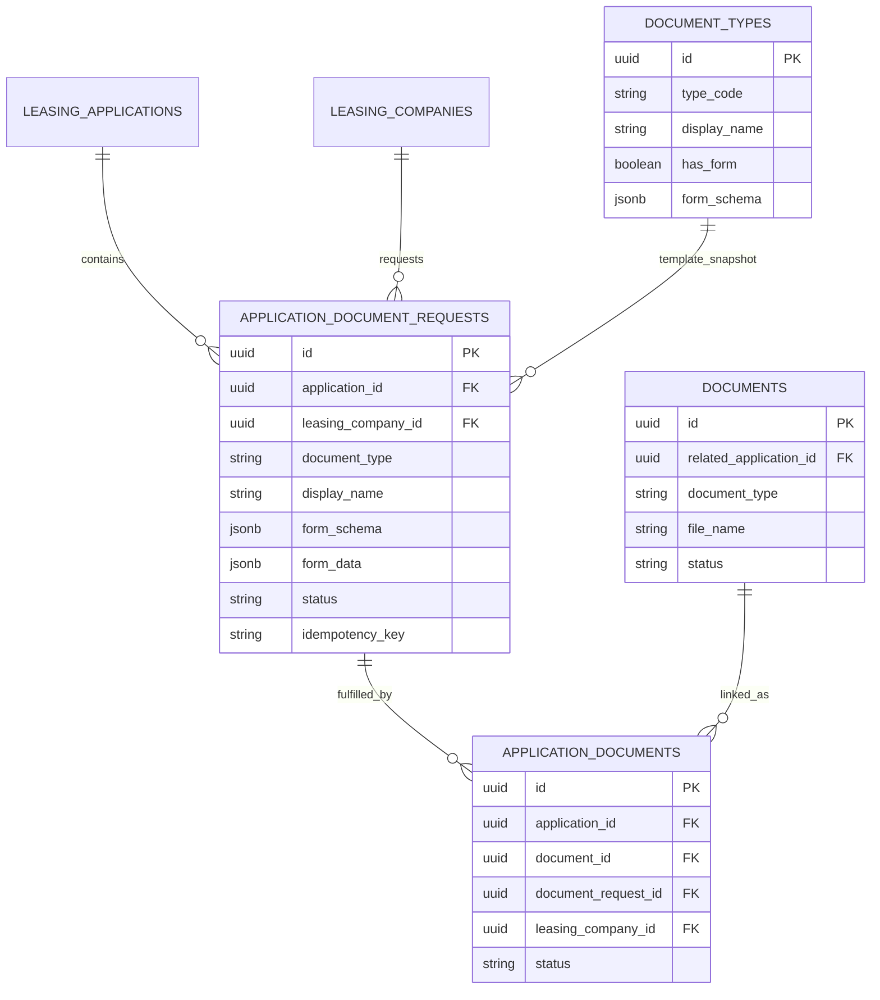
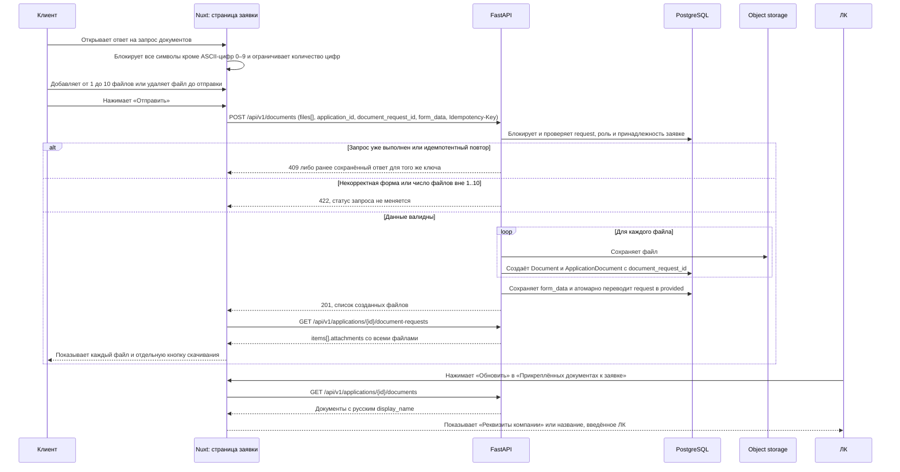

# Спецификация доработок запросов документов лизинговой заявки

**Задача Bitrix24:** [#20418](https://carcraftpro.bitrix24.ru/workgroups/group/124/tasks/task/view/20418/)

**Ветка для реализации:** `bugfix/20418-documents-revision` от синхронизированной `origin/test` (`899fb252`).

**Тип изменения:** `fix` — исправление поведения существующего процесса запросов документов.

**Статус:** реализация доработки ввода числовых реквизитов выполнена; сквозная E2E-проверка ожидает отдельного разрешения на сброс изолированных fixture-данных. Узкая доработка отображаемого имени автоматически сформированных реквизитов компании подготовлена к согласованию; исходный код по ней ещё не изменялся.





## 1. Контекст и проблема

В задаче #20418 уже реализованы типовые запросы дополнительных документов и формы для СНИЛС, основных контрагентов и расчётных счетов. Сервер валидирует итоговые значения, а интерфейс нормализует значение после события ввода. Однако это не запрещает браузеру визуально принять букву, пробел или дефис до следующего обновления DOM.

На странице лизинговой заявки при статусе ЛК `documents_required` включён интервал 10 секунд. Он последовательно обновляет состояние заявки и список прикреплённых документов. Визуально блок «Прикреплённые документы к заявке» переходит в загрузку и мигает, а сервер получает лишние запросы.

Ответ на конкретный запрос документа сейчас ограничен одним файлом не только в интерфейсе, но и в API: `POST /api/v1/documents` требует ровно один файл при `document_request_id`, после чего запрос переходит в `provided`. История возвращает один `attachment`. Это не покрывает случаи, когда ЛК запросила комплект файлов одним пунктом.

В блоке ЛК для отдельных документов показываются технические коды `company_requisites` и `custom_document`, хотя пользователю нужны русские названия.

## 2. Цель и бизнес-результат

Клиент должен без ошибок заполнять числовые реквизиты, видеть обязательность полей и иметь возможность ответить на один запрос ЛК комплектом до 10 файлов. ЛК и клиент должны видеть каждый файл комплекта и скачивать его отдельно. Список прикреплённых документов не должен обновляться самопроизвольно и мигать.

Изменение уменьшает ошибочные отправки реквизитов, исключает лишнюю нагрузку от опроса страницы и делает обработку комплекта документов понятной для обеих сторон.

## 3. Границы

### Входит в объём

- ввод и валидация на клиенте для СНИЛС, ИНН, БИК и номера счёта;
- required-маркеры в формах запросов документов;
- отключение автопуллинга страницы заявки и ручное обновление прикреплённых документов;
- пакетная загрузка от 1 до 10 файлов на один `document_request_id`;
- отображение и скачивание каждого файла пакета в истории запросов и в документах заявки;
- пользовательские русские названия для реквизитов и произвольных документов;
- серверная атомарность, авторизация, идемпотентность и E2E-проверка затронутых сценариев.

### Не входит в объём

- проверка контрольной суммы СНИЛС;
- изменение прочих числовых полей приложения: правило применяется только к СНИЛС, ИНН, БИК и номеру счёта в форме ответа на запрос документов;
- изменение текущих допустимых расширений, MIME-типов и предельного размера одного файла;
- редактирование формы или добавление файлов после успешной отправки ответа;
- частичная отправка комплекта файлов;
- изменение статусов лизинговой заявки и ЛК, кроме существующего перехода запроса документа в `provided`;
- мобильная адаптация;
- изменение исторических файлов или их физическое перемещение в хранилище.

## 4. Требования к интерфейсу

### 4.1. СНИЛС

1. У поля с подписью «СНИЛС» отображается красная звёздочка обязательности в том же визуальном стиле, что и у обязательного прикрепления файла.
2. Поле не использует визуальную маску: разрешены только ASCII-цифры `0`–`9`, без пробелов и дефисов.
3. При обычном вводе недопустимый символ блокируется до появления в поле.
4. При вставке из буфера, автозаполнении и программном обновлении все символы, кроме ASCII-цифр `0`–`9`, отбрасываются, а значение обрезается до первых 11 цифр.
5. Попытка ввести двенадцатую цифру не изменяет значение поля.
6. При отправке требуется ровно 11 цифр. Серверное правило остаётся обязательным, даже если клиентская фильтрация была обойдена.
7. В API и хранении формы номер остаётся строкой из 11 ASCII-цифр. При повторном чтении клиенту сохраняется существующее маскирование СНИЛС.

### 4.2. «Основные контрагенты»

1. У названия каждого контрагента и у поля «ИНН» показывается красная звёздочка обязательности.
2. ИНН принимает только ASCII-цифры `0`–`9`; буквы, пробелы, дефисы и другие символы блокируются до появления в поле.
3. При вставке, автозаполнении или программном обновлении из значения удаляются все символы, кроме ASCII-цифр `0`–`9`. В поле невозможно ввести более 12 цифр.
4. При отправке ИНН допустим только длиной 10 или 12 цифр. Значение иной длины получает понятную ошибку у соответствующего поля; серверное правило сохраняется.
5. Поддержка 10-значного ИНН юридических лиц сохраняется.

### 4.3. «Расчётные счета»

1. Звёздочка обязательности показывается у «Название банка», «БИК» и «Расчётный счёт» для каждой строки счёта.
2. БИК принимает только ASCII-цифры `0`–`9` и не более 9 цифр. При отправке требуется ровно 9 цифр.
3. Номер расчётного счёта принимает только ASCII-цифры `0`–`9` и не более 20 цифр. При отправке требуется ровно 20 цифр.
4. Буквы, пробелы, дефисы и другие недопустимые символы не появляются в полях при обычном вводе. При вставке, автозаполнении и программном обновлении они отбрасываются; ввод за пределами лимита цифр не изменяет поле.
5. Серверная валидация названия банка, БИК и номера счёта остаётся источником истины.

### 4.4. Обновление «Прикреплённых документов к заявке»

1. Удаляется интервальный автопуллинг страницы лизинговой заявки: никаких периодических запросов каждые 10 секунд для обновления состояния и вложений.
2. Начальная загрузка данных при открытии страницы сохраняется.
3. После явных действий текущего пользователя, которые меняют документы или состояние заявки, интерфейс может выполнить единичное целевое обновление нужных данных.
4. В заголовке блока «Прикреплённые документы к заявке» добавляется кнопка «Обновить» в стиле и расположении кнопки блока «Запрошенные документы».
5. Кнопка доступна всем ролям, которые уже имеют право видеть блок, в том числе ЛК без права запрашивать дополнительные документы.
6. По нажатию кнопка блокируется только на время одного `GET /api/v1/applications/{id}/documents`; блок не очищается и не мигает. При ошибке пользователь видит существующее безопасное сообщение, ранее показанные документы остаются на экране.

### 4.5. Несколько файлов в ответ на запрос

1. В модальном окне ответа на запрос вместо одного поля файла отображается список выбранных файлов и кнопка «Добавить ещё файл».
2. До отправки клиент обязан выбрать от 1 до 10 файлов. Одиннадцатый файл не добавляется, интерфейс показывает объяснение лимита.
3. Каждый выбранный файл виден отдельной строкой с именем, размером и действием удаления. Удаление меняет только локальный список, пока ответ не отправлен.
4. Все файлы пакета проверяются по действующим платформенным правилам типа и размера для типа данного запроса. Ошибка любого файла не переводит запрос в выполненный и не создаёт частично отправленный комплект.
5. Для запроса с формой (`form_data`) форма заполняется один раз на весь комплект файлов, а не для каждого файла.
6. Нажатие «Отправить» доступно только когда форма валидна, выбран хотя бы один файл и в списке не более 10 файлов. На время запроса кнопки отправки, закрытия и изменения списка недоступны.
7. После `201 Created` модальное окно закрывается, история запросов перечитывается, а все файлы ответа отображаются в соответствующем запросе.
8. После успешной отправки добавление, удаление и замена файлов данного ответа недоступны. Для нового комплекта ЛК создаёт новый запрос.
9. В истории запросов клиент и уполномоченная ЛК видят все файлы пакета; у каждого файла есть самостоятельная ссылка/кнопка скачивания через существующий доступ к содержимому документа.

### 4.6. Названия документов

1. В блоке «Прикреплённые документы к заявке» технический тип `company_requisites` отображается как «Реквизиты компании».
2. Для файла, отвечающего на произвольный запрос ЛК, отображается `display_name` конкретного `application_document_request`, который ввела ЛК.
3. Технические коды не показываются конечному пользователю.
4. Для исторической записи с `custom_document`, у которой невозможно определить связанный запрос или его `display_name`, показывается безопасное название «Произвольный документ».
5. Новое пользовательское название является presentation-данными: технический `document_type` и существующие правила доступа не меняются.

## 5. Контракт API и данные

### 5.1. Загрузка ответа

Канонический маршрут остаётся `POST /api/v1/documents` без зависимости от внешнего редиректа слеша.

Для `document_request_id` запрос принимает:

- `application_id`: UUID заявки;
- `document_request_id`: UUID конкретного запроса;
- `files`: multipart-массив из 1–10 файлов;
- `form_data`: JSON-объект только для запроса с формой;
- `Idempotency-Key`: UUID-заголовок для всей попытки отправить пакет.

Ограничение «ровно один файл» заменяется на «от 1 до 10 файлов». Все файлы получают технический `document_type` из серверной строки запроса, а не из параметров клиента.

Для `form_data` этих типов сервер принимает только ASCII-цифры `0`–`9`: СНИЛС — ровно 11, ИНН — ровно 10 или 12, БИК — ровно 9, номер счёта — ровно 20. Пробелы, дефисы, буквы и Unicode-цифры не нормализуются сервером и приводят к `422`.

До сохранения сервер блокирует строку `application_document_requests`, проверяет принадлежность заявки, полномочия клиента и актуальность статуса. Затем он валидирует форму и каждый файл. Только после успешной проверки всего набора создаёт все `Document` и `ApplicationDocument` и единожды переводит запрос `requested` в `provided`.

Если операция БД не может завершиться, созданные в S3 объекты всего пакета компенсируются существующим безопасным механизмом. Если сбой происходит до окончания обработки, API не должен оставлять запрос в `provided` и не должен возвращать частичный успешный ответ.

Повтор с тем же `Idempotency-Key` возвращает сохранённый полный результат пакета без создания дубликатов. Повтор с другим ключом после `provided` возвращает `409 Conflict` и не добавляет файл.

### 5.2. Чтение истории запросов

`GET /api/v1/applications/{application_id}/document-requests` сохраняет текущую группировку `batches[]` и фильтрацию по роли/ЛК.

Для каждого `items[]` добавляется канонический массив `attachments`:

```json
{
  "id": "application-document-id",
  "document_id": "document-id",
  "file_name": "agreement.pdf",
  "file_size": 12345,
  "uploaded_at": "2026-09-29T12:00:00Z",
  "status": "submitted",
  "download_url": "/api/v1/documents/document-id/content"
}
```

Массив содержит все связанные `application_documents` для данного `document_request_id`, отсортированные по времени загрузки. Для совместимости старое поле `attachment` сохраняется как первый элемент массива или `null`, но новый интерфейс использует только `attachments`.

Доступ к истории и содержимому файлов сохраняет текущую изоляцию: клиент видит документы своей заявки; ЛК — только документы запросов собственной ЛК; сотрудник Carcraft — в рамках действующих прав.

### 5.3. Чтение прикреплённых документов заявки

`GET /api/v1/applications/{application_id}/documents` расширяет проекцию каждого документа пользовательским `display_name` для интерфейса:

1. `ApplicationDocumentRequest.display_name`, если документ связан с запросом;
2. название типа из справочника, если оно есть;
3. «Реквизиты компании» для `company_requisites`;
4. «Произвольный документ» для неразрешимого исторического `custom_document`;
5. существующее безопасное название для остальных типов.

Фронтенд использует полученный `display_name`, а не преобразует технические типы локально. Это исключает различия между ролями и будущими интерфейсами.

### 5.4. Хранилище и миграции

Новая таблица и новая миграция не требуются: существующая `application_documents.document_request_id` уже допускает несколько строк, связанных с одним запросом. Изменяются команды, репозитории, проекции, схемы API и UI, которые сейчас предполагают ровно один файл.

Перед коммитом обязательно подтвердить это выводом `uv run alembic check` после применения актуальных миграций: `No new upgrade operations detected.`

## 6. Планируемые изменения

### Frontend

- `frontend/features/documents/components/DocumentRequestResponseModal.vue`
  - заменить нормализацию только после `input` единым обработчиком для `snils`, `main_counterparties` и `open_bank_accounts`: блокировать недопустимый обычный ввод до появления в DOM, а вставку, автозаполнение и программное изменение нормализовать до ASCII-цифр и установленного лимита;
  - не добавлять маску, пробелы или дефисы; лимит считать по числу ASCII-цифр: СНИЛС — 11, ИНН — 12, БИК — 9, номер счёта — 20;
  - добавить required-маркеры согласно разделам 4.1–4.3;
  - заменить один выбранный файл списком `File[]`, кнопкой «Добавить ещё файл», удалением до отправки и лимитом 10;
  - отправлять один `FormData` с `files[]`, единственным `form_data` и единым `Idempotency-Key`;
  - после успеха инициировать единичное обновление истории.
- `frontend/features/documents/components/DocumentRequestHistory.vue`
  - читать `items[].attachments`, отображать все файлы и отдельное скачивание каждого;
  - обеспечить корректное отображение исторического ответа, где API вернул только `attachment`.
- `frontend/features/documents/api/documentsApi.ts` и связанные типы документов
  - изменить тип загрузки ответа с одного файла на ограниченный список файлов;
  - типизировать `attachments[]`, сохранив чтение `attachment` для обратной совместимости.
- `frontend/pages/workspace/leasing-applications/[id]/index.vue`
  - удалить `setInterval`/автопуллинг;
  - добавить ручное обновление списка документов, не очищающее прежнее содержимое при загрузке;
  - использовать серверное `display_name` для подписей документов.
- `frontend/tests/e2e/leasing/20418-document-response-multifile.spec.ts`
  - добавить сценарии из раздела 8.

### Backend

- `backend/presentation/routers/documents.py`
  - разрешить для `document_request_id` от 1 до 10 файлов;
  - передать полный список файлов в use-case и вернуть полный список созданных документов;
  - сохранить атомарную компенсацию объектов S3 для всего пакета.
- `backend/application/commands/documents/upload_for_application.py`
  - выделить пакетную обработку ответа на один запрос под одной блокировкой request-row;
  - валидировать форму один раз и все файлы до смены статуса;
  - создать связи `ApplicationDocument` для каждого файла;
  - сделать идемпотентный повтор возвращающим весь пакет, а не первый файл;
  - фиксировать одно событие бизнес-ответа после успешного комплекта, не включая содержимое формы или СНИЛС.
- `backend/application/commands/leasing/document_request_forms.py`
  - заменить проверку Unicode-цифр через `\d` на явное allow-list правило ASCII `[0-9]` для СНИЛС, ИНН, БИК и номера счёта; не ослаблять проверку длины и не выполнять серверную очистку недопустимых символов.
- `backend/tests/test_document_request_forms_20418.py`
  - дополнить контрактными проверками: сервер принимает только ASCII-цифры и отклоняет пробелы, дефисы, буквы и Unicode-цифры.
- `backend/infrastructure/repositories/application_documents_repository.py`
  - заменить выбор «единственного ответного документа» запросом списка ответных документов;
  - расширить историю запросов всеми документами без дедупликации, скрывающей вложения;
  - добавить/расширить проекцию документов заявки для серверного `display_name`.
- `backend/application/queries/documents/list_document_requests.py`
  - собрать `attachments[]` для каждого запроса, сохранить `attachment` как совместимый первый элемент;
  - не менять ролевую маскировку СНИЛС.
- `backend/application/queries/leasing_response.py`, `backend/presentation/schemas/leasing.py` и связанные схемы/проекции документов
  - включить серверный `display_name` в список документов заявки и согласовать типы ответа.

Точные файлы могут быть дополнены только если это необходимо для уже описанного контракта; новые статусы, отдельные endpoint’ы и новые таблицы не вводятся.

## 7. Риски и меры

- **Частично загруженный пакет:** предотвращается валидацией всех файлов до статуса и компенсационным удалением S3-объектов при неуспехе.
- **Дубли при двойном клике/сетевом повторе:** предотвращаются блокировкой request-row и единым `Idempotency-Key` на пакет.
- **Потеря прежних клиентов API:** снижается сохранением `attachment` как совместимого первого файла при добавлении `attachments[]`.
- **Утечка СНИЛС:** полный номер не попадает в логи, уведомления, события или DWH; существующее маскирование для клиента сохраняется.
- **Неверное отображение произвольного документа:** решается серверным `display_name`, привязанным к `document_request_id`, а не локальной заменой кода во фронтенде.
- **Нагрузка и визуальное мигание:** решается полным удалением периодического опроса; ручное обновление не меняет прав доступа.

## 8. Критерии приёмки и E2E-проверка

### Числовые поля

1. В каждом из полей СНИЛС, ИНН, БИК и номера счёта буквы, пробелы, дефисы и прочие не-ASCII символы не появляются при обычном вводе.
2. После вставки смешанной строки в каждом поле остаются только первые допустимые ASCII-цифры: СНИЛС — 11, ИНН — 12, БИК — 9, номер счёта — 20. При достижении лимита следующая цифра не изменяет поле.
3. В API отправляются только ASCII-цифры без форматирования. Сервер принимает ИНН длиной 10 или 12, СНИЛС длиной 11, БИК длиной 9 и номер счёта длиной 20; отклоняет иные длины, буквы, пробелы, дефисы и Unicode-цифры с `422`.
4. У СНИЛС показана звёздочка; у каждого контрагента — у названия и ИНН; у каждого счёта — у названия банка, БИК и номера счёта.

### Ручное обновление документов

4. При нахождении на странице свыше 30 секунд без действий не выполняются периодические запросы, связанные с автопуллингом страницы, и блок документов не мигает.
5. Кнопка «Обновить» видна ЛК с доступом к блоку, даже если у неё отсутствует право создать запрос документов.
6. Одно нажатие выполняет один запрос списка документов, блокирует только кнопку на время запроса и сохраняет предыдущий список при ошибке.

### Пакет файлов

7. Клиент может выбрать 1, 2 и 10 файлов; при добавлении 11-го файл не попадает в список и выводится объяснение лимита.
8. Клиент удаляет один файл до отправки; в API передаётся только оставшийся список.
9. Для ответа с обязательной формой сервер принимает форму один раз и несколько файлов; ответ без обязательной формы или без файлов получает `422`, не меняет статус и не создаёт вложения.
10. При недопустимом размере/типе хотя бы одного файла запрос остаётся `requested`, успешных `ApplicationDocument` для пакета не появляется, а загруженные S3-объекты компенсируются.
11. Повтор отправки того же пакета с тем же `Idempotency-Key` не создаёт дубликаты и возвращает весь первоначальный комплект; повтор с новым ключом после успеха получает `409`.
12. После успеха в истории клиента и ЛК показаны все файлы, и каждый скачивается по собственной ссылке. ЛК другой компании не получает файлы чужого запроса.

### Названия

13. В блоке ЛК `company_requisites` отображается как «Реквизиты компании».
14. Файл произвольного запроса отображается под `display_name`, введённым ЛК; техническое `custom_document` не видно.
15. Старый файл без доступного `display_name` отображается как «Произвольный документ».

### Обязательная инженерная проверка перед MR

- Docker: сборка и запуск затронутых сервисов.
- Frontend: E2E-сценарий при ширине окна не менее 768 CSS-пикселей; основной путь, ошибки лимитов, роли и отсутствие автопуллинга.
- API: реальный multipart-запрос с несколькими файлами, проверка хранения, истории, скачивания, `422`, `409` и tenant-изоляции.
- Backend: `uv run ruff check . --fix`, `uv run lint-imports`, `uv run mypy .`.
- БД: `uv run alembic upgrade head`, затем `uv run alembic check` с результатом `No new upgrade operations detected.`
- Логи Docker: без новых ошибок, без полного СНИЛС и содержимого `form_data`.

## 9. Решения и открытые вопросы

Все решения, необходимые для начала реализации, приняты:

- СНИЛС, ИНН, БИК и номер счёта — только ASCII-цифры `0–9`, без визуальной маски, пробелов и дефисов;
- максимум и итоговая длина: СНИЛС — 11/11, ИНН — 12/10 или 12, БИК — 9/9, номер счёта — 20/20;
- обычный ввод блокирует недопустимый символ до отображения; вставка, автозаполнение и программное изменение нормализуются до ASCII-цифр и лимита; API отклоняет обойдённую проверку, включая Unicode-цифры;
- required-маркеры — на всех согласованных обязательных полях;
- автопуллинг — удаляется полностью, обновление документов ручное и доступно всем видящим блок;
- комплект ответа — 1–10 файлов, один `form_data`, удаление до отправки, отдельное скачивание каждого файла;
- названия — «Реквизиты компании», `display_name` произвольного запроса, fallback «Произвольный документ».

Открытых блокирующих вопросов нет. Изменения исходного кода начинаются только после явного подтверждения этой спецификации.

## 10. Утверждаемый этап: человекочитаемое имя автоматических реквизитов компании в ЛК

### 10.1. Текущее поведение

При создании заявки сервис автоматически формирует PDF реквизитов компании. Для документа сохраняется технический `document_type` со значением `company_requisites`, имя файла `company-requisites.pdf` и статус `approved`.

Экран ЛК «Прикреплённые документы к заявке» получает список через `GET /api/v1/leasing/applications/{application_id}/documents`. Сервер ищет имя типа в `document_types`, а при отсутствии записи отдаёт технический код как `display_name`. Для `company_requisites` запись в общем каталоге отсутствует, поэтому ЛК видит `company_requisites`.

### 10.2. Цель и бизнес-результат

ЛК должна видеть у автоматически сформированного PDF понятное название «Реквизиты компании», а не внутренний технический идентификатор. Это снижает риск ошибочной обработки документа сотрудником ЛК и не меняет его техническую идентичность, хранение, статус, скачивание или права доступа.

### 10.3. Границы текущего этапа

Входит в объём:

- только серверная проекция списка прикреплённых документов ЛК;
- только автоматически созданный сервисом документ с `document_type == "company_requisites"`;
- возврат `display_name: "Реквизиты компании"` для такого документа;
- одинаковое отображение для уже существующих и вновь созданных автоматических документов.

Не входит в объём:

- добавление `company_requisites` в общий каталог `document_types`;
- изменение доступных ЛК типов при ручном запросе или загрузке документов;
- изменение `document_type`, имени файла `company-requisites.pdf`, PDF, статуса, S3-объекта, связей документа с заявкой или прав доступа;
- локальная подмена названия во frontend;
- изменение отображения документов в других кабинетах, реестрах и административных интерфейсах;
- изменение правил `custom_document` и прочих технических кодов;
- миграции БД, новые таблицы, новые endpoint'ы или версионирование API.

### 10.4. Контракт API

Маршрут остаётся прежним: `GET /api/v1/leasing/applications/{application_id}/documents`.

Для автоматически сформированного документа реквизитов ответ содержит оба независимых поля:

```json
{
  "id": "document-uuid",
  "document_type": "company_requisites",
  "display_name": "Реквизиты компании",
  "file_name": "company-requisites.pdf"
}
```

`document_type` сохраняет машинную семантику и может использоваться текущими клиентами для идентификации, фильтрации и иной логики. Меняется только presentation-поле `display_name` в read-модели ЛК. Поле остаётся аддитивно совместимым по форме ответа: его тип и наличие не меняются.

Для остальных документов действуют существующие правила определения `display_name`. Если справочник типа содержит имя, используется оно; никакие новые fallback-правила для неизвестных кодов в этом этапе не добавляются.

### 10.5. Планируемые изменения

1. В `backend/application/queries/leasing_response.py` выделить явное правило отображения для системного кода `company_requisites` в обработчике `handle_get_lc_application_documents`.
2. Применять правило после сохранения исходного `document_type` в локальной переменной и до общего fallback на технический код. Не читать PDF и не обращаться к S3 для определения имени.
3. Не менять `backend/infrastructure/repositories/document_types_repository.py`, миграции Alembic, модели БД, создание автоматического PDF или frontend `frontend/pages/workspace/leasing-applications/[id]/index.vue`: фронтенд уже выводит серверный `display_name`.
4. Добавить или расширить целевой E2E/API-сценарий в существующем наборе проверки ЛК: создать документ с `document_type="company_requisites"`, запросить список как связанная ЛК и проверить одновременно `document_type` и `display_name`.
5. Проверить в том же сценарии, что несвязанная ЛК не получает список/документ согласно действующему контролю доступа, а обычный каталоговый документ сохраняет своё прежнее название.

### 10.6. Критерии приёмки и проверка

1. Связанная с заявкой ЛК получает через существующий маршрут автоматический документ с `document_type: "company_requisites"` и `display_name: "Реквизиты компании"`.
2. Экран ЛК в разделе «Прикреплённые документы к заявке» показывает «Реквизиты компании», имя файла `company-requisites.pdf`, дату и текущий статус; технический код в подписи не отображается.
3. Тот же результат применяется к автоматически созданному документу, который существовал до выкладки изменения: отдельная миграция или перезапись документов не требуется.
4. `company_requisites` не появляется в `GET /api/v1/documents/types`, в ручном выборе типа документа и в форме запроса дополнительных документов.
5. Для обычного документа из `document_types` API возвращает существующее справочное `display_name`; для него не применяется новое правило.
6. ЛК, не связанная с заявкой, не получает доступ к списку или содержимому документа; изменение названия не ослабляет авторизацию.
7. Выполнены обязательные проверки проекта: Docker-сборка и запуск затронутых сервисов, реальный HTTP/E2E-сценарий ЛК на viewport не менее 768 CSS-пикселей, `uv run ruff check . --fix`, `uv run lint-imports`, `uv run mypy .`, `uv run alembic upgrade head`, `uv run alembic check` с `No new upgrade operations detected.`, просмотр логов без новых ошибок.

### 10.7. Риски и решения

- **Случайное расширение общего каталога:** исключается отсутствием изменений `document_types` и его миграций.
- **Подмена машинного идентификатора:** исключается сохранением `document_type` без изменений; заменяется только `display_name` в ответе ЛК.
- **Расхождение интерфейсов:** допустимо и намеренно: изменение ограничено ЛК, потому что бизнес-требование не распространяется на другие роли.
- **Исторические записи:** получают новое имя при чтении, поскольку оно вычисляется серверной проекцией; исходные данные не переписываются.
- **Ошибочная подмена произвольного документа:** изменение привязано только к `company_requisites`; правила `custom_document` не меняются.

### 10.8. Решение и готовность

Выбран узкий серверный вариант: для ЛК `company_requisites` отображается как «Реквизиты компании», оставаясь технически тем же `document_type`. Решение не требует изменения БД и не расширяет каталог типов или ручные сценарии.

### 10.9. Уточнение варианта 1: резервирование системного кода

Проверка реализации показала, что до этого уточнения generic upload-flow технически принимал произвольный `document_type`. Поэтому одно только read-time правило по коду не гарантирует, что подпись «Реквизиты компании» относится исключительно к автоматическому документу.

Принятое решение: `company_requisites` — server-only технический код. Его создаёт только сервис `company_requisites_attachment`; ручные API-загрузки не могут создать документ с этим значением.

Текущее поведение ручной загрузки:

- `POST /api/v1/documents` принимает `document_type` или `document_types` из multipart-параметров и передаёт значение в обычную загрузку либо загрузку, привязанную к заявке;
- обработчики `UploadDocumentCommand` и `UploadDocumentForApplicationCommand` до записи могут принять этот код без отдельного запрета;
- автоматический сервис реквизитов не использует эти команды и создаёт документ напрямую как внутреннюю операцию.

Желаемое поведение:

- при любой ручной попытке создать новый документ с `document_type: "company_requisites"` API отвечает `422` до помещения файла в S3 и до изменения БД;
- тот же запрет действует для обычной загрузки, загрузки с `application_id` и ответа на запрос документа, если в сохранённом запросе оказался этот системный код;
- создание через `company_requisites_attachment` и исторические документы не изменяются;
- версии уже существующего документа не затрагиваются: они не задают новый `document_type`, а наследуют тип родительского документа;
- публичный справочник `GET /api/v1/documents/types`, ручной выбор типа в UI, миграции, PDF, имя файла, статусы, S3-ключи и права доступа не изменяются.

Реализация:

1. Добавить небольшой общий backend-helper для запрета ручного `company_requisites` с `ServiceError` и HTTP-статусом `422`; сообщение не раскрывает внутренние детали и сообщает, что тип создаётся автоматически.
2. Вызвать helper в `backend/application/commands/documents/upload_document.py` до проверки типа файла, формирования имени и записи объекта в S3.
3. Вызвать тот же helper в `backend/application/commands/documents/upload_for_application.py` после определения фактического типа из параметра или сохранённого `document_request_id`, но до проверки файла, S3 и создания `Document`; пакетный ответ на запрос документов использует тот же запрет до создания первого файла.
4. Не изменять `backend/application/services/company_requisites_attachment.py`: внутренний сервис не является ручным upload-flow и остаётся единственным writer'ом системного кода.

Проверка:

- неразрушающий статический контроль вызовов helper во всех трёх ручных путях: обычная загрузка, загрузка с `application_id`, пакетный ответ на `document_request_id`;
- AST/compile-проверка затронутых Python-файлов и `git diff --check`;
- анализ diff подтверждает отсутствие изменений общего каталога, Alembic, frontend, endpoint'ов, прав доступа и автоматического сервиса;
- `pytest`, Docker/E2E, миграции, fixture reset/reseed и любые операции с БД не запускаются без отдельного явного разрешения пользователя, так как существующий harness может создавать или сбрасывать данные.

Критерии приёмки уточнения:

1. После успешной автоматической генерации документ по-прежнему имеет `document_type: "company_requisites"`, а список ЛК возвращает `display_name: "Реквизиты компании"`.
2. Любой ручной запрос создания нового документа с данным `document_type` получает `422` до S3 и БД.
3. Исторический автоматический документ получает русское имя при чтении без миграции или перезаписи.
4. Обычные типы, `custom_document`, существующие версии документов и доступ к содержимому не меняются.

Открытых блокирующих вопросов нет. Реализация уточнения начинается только после явного одобрения обновлённой спецификации.

### 10.10. Уточнение интерфейса ЛК: единая формулировка «Принять документ»

#### Текущее поведение

В блоке ЛК «Прикреплённые документы к заявке» действие доступно только для документа с `leasing_company_status == "pending"`. Нажатие на текстовую кнопку «Одобрить» открывает модальное окно. В нём заголовок — «Одобрить документ», кнопка подтверждения — «Одобрить», а во время запроса — «Одобряем…». В то же время статус после успешной операции уже показывается как «Принят», текст подтверждения говорит о принятии, а успешное уведомление — «Документ принят».

#### Цель и бизнес-результат

Сотрудник ЛК должен видеть одну понятную формулировку действия на всём пути: нажать «Принять», подтвердить «Принять документ», дождаться «Принимаем…» и увидеть уже существующий статус «Принят». Это устраняет противоречие между доступным действием и результатом его выполнения, не меняя бизнес-логику рассмотрения документа.

#### Границы

Входит в объём:

- только пользовательские строки конкретного действия в `frontend/pages/workspace/leasing-applications/[id]/index.vue`;
- inline-кнопка в строке прикреплённого документа: «Одобрить» → «Принять»;
- заголовок модального окна: «Одобрить документ» → «Принять документ»;
- кнопка подтверждения: «Одобрить» → «Принять»;
- текст процесса: «Одобряем…» → «Принимаем…».

Не входит в объём:

- технический статус `approved`, payload `{ status: "approved" }`, маршрут `PATCH /api/v1/leasing/applications/{application_id}/documents/{document_id}/status`, имена frontend-методов и backend-команд;
- backend, API-схемы, миграции, БД, S3, права доступа и правила видимости кнопки;
- статусная подпись «Принят», текст подтверждения о принятии и toast «Документ принят»: они уже соответствуют выбранной терминологии;
- другие компоненты и сценарии с текстом «Одобрить», включая `frontend/features/documents/components/DocumentReviewModal.vue`;
- mobile-интерфейс.

#### Планируемое изменение

1. В `frontend/pages/workspace/leasing-applications/[id]/index.vue` заменить ровно четыре перечисленные пользовательские строки в inline-действии и связанном с ним модальном окне.
2. Не менять условие показа `doc.leasing_company_status === "pending"`, обработчики `openApproveDocument` и `approveAttachedDocument`, вызов `api.approveApplicationDocument` и тело его запроса.
3. Не менять тексты и компоненты за пределами этой страницы; поиск «Одобрить» по репозиторию не является основанием для глобальной замены.
4. Добавить или расширить целевой desktop E2E-сценарий ЛК с реальным действием: для документа в статусе `pending` проверить кнопку «Принять», открыть модальное окно, проверить заголовок и кнопку «Принять», после подтверждения проверить вызов существующего `PATCH` с `status: "approved"`, успешное уведомление «Документ принят» и обновлённый статус «Принят».

#### Критерии приёмки и проверка

1. В строке прикреплённого документа со статусом `pending` ЛК видит кнопку «Принять», а текста «Одобрить» в этой кнопке нет.
2. После нажатия открывается модальное окно с заголовком «Принять документ», кнопкой «Принять» и состоянием ожидания «Принимаем…».
3. Подтверждение отправляет прежний запрос `PATCH /api/v1/leasing/applications/{application_id}/documents/{document_id}/status` с телом `{ "status": "approved" }`; маршрут, payload и технический статус не меняются.
4. После успешного ответа ЛК видит уже существующие «Документ принят» и статус «Принят».
5. Для документа с любым статусом, кроме `pending`, кнопка не появляется, как и до доработки.
6. В `DocumentReviewModal.vue` и других несвязанных сценариях текст «Одобрить» не меняется.
7. Выполнена обязательная E2E-проверка desktop-сценария на работающем изолированном окружении с шириной viewport не менее 768 CSS-пикселей. Если существующий E2E-harness требует создание, сброс или reseed fixture-данных, его запуск возможен только после отдельного разрешения пользователя; до него выполняются неразрушающие проверки изменённого frontend-файла и diff.

#### Риски и решение

- **Неполная замена:** предотвращается проверкой всех четырёх пользовательских строк одного действия и E2E-прохождением окна подтверждения.
- **Случайное изменение технического контракта:** предотвращается неизменностью `approveApplicationDocument`, endpoint и payload; E2E фиксирует `status: "approved"`.
- **Глобальная подмена терминов в другом бизнес-процессе:** предотвращается ограничением одним файлом страницы ЛК и явным исключением `DocumentReviewModal.vue`.

Открытых блокирующих вопросов нет. Реализация этого уточнения начинается только после явного одобрения обновлённой спецификации.
