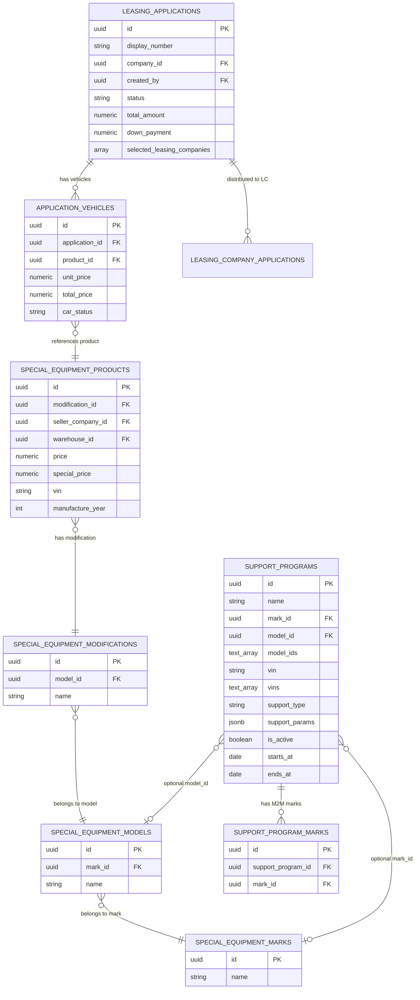
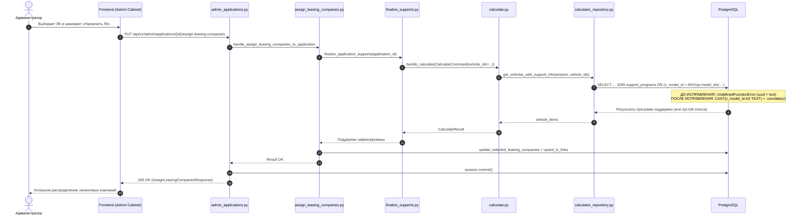

# Ошибка 500 при распределении лизинговых компаний администратором

- **Bitrix:** Внутренняя задача (без Bitrix)
- **Slug:** `assign-leasing-companies-support-type-mismatch`
- **Тип:** bugfix
- **Ветка:** `bugfix/assign-leasing-companies-support-type-mismatch`
- **Целевая ветка:** `test`
- **MR:** https://gitlab.carcraft.ru/carcraft/carcraft-leadgenerator/-/merge_requests/481
- **Дата создания:** 2026-09-29 17:36:25 MSK (UTC+3)

---

## ER-диаграмма затронутых сущностей



*Примечание к схеме:* Схема базы данных и ORM-модели не изменяются. Исправление затрагивает SQL-предикаты репозитория `calculator_repository.py`.

---

## Sequence-диаграмма сценария



---

## 1. Постановка проблемы

### Симптом
При распределении лизинговых компаний на заявку администратором:
- Запрос: `PUT /api/v1/admin/applications/c958f608-b4cf-427d-9ab3-8a7f50ac9c19/assign-leasing-companies`
- Payload: `{"leasing_company_ids": ["e3f36568-329c-45bc-8b2d-e08330c30069", "28765933-04df-44fe-8d2b-4cf21deacc74"]}`
- Ответ: `500 Internal Server Error`
```json
{
    "detail": "Произошла внутренняя ошибка. Попробуйте позже.",
    "code": "INTERNAL_ERROR"
}
```

### Анализ первопричины (Root Cause)
1. В эндпоинте распределения ЛК вызывается `finalize_application_supports`, которая выполняет расчет калькулятора `handle_calculate` с передачей `vehicle_ids` позиций заявки.
2. `handle_calculate` вызывает `calculator_repository.get_vehicles_with_support_info(session, vehicle_ids)`.
3. В функции `_support_program_join_conditions` (`backend/infrastructure/repositories/calculator_repository.py`):
   - Скалярный подзапрос `v_model_id` возвращает `SpecialEquipmentModification.model_id` (тип `UUID`).
   - Поле `SupportProgram.model_ids` имеет тип `ARRAY(sa.Text)`.
   - Условие `v_model_id == sa.func.any(sp.model_ids)` компилируется в SQL-выражение `(SELECT model_id ...) = ANY(sp.model_ids)`, то есть сравнение `UUID = ANY(TEXT[])`.
   - В PostgreSQL отсутствует оператор сравнения `uuid = text`. При подготовке запроса PostgreSQL выбрасывает ошибку:
     `asyncpg.exceptions.UndefinedFunctionError: operator does not exist: uuid = text (HINT: No operator matches the given name and argument types. You might need to add explicit type casts.)`
   - Также вложенные скалярные подзапросы `v_model_id` и `v_mark_id` не содержат явного вызова `.correlate(v)` на целевую таблицу `SpecialEquipmentProduct`, что приводит к добавлению `special_equipment_products` в `FROM` внутреннего подзапроса (`FROM special_equipment_modifications, special_equipment_products`) и риску возврата множественных строк (`more than one row returned by a subquery used as an expression`).

---

## 2. Требования

1. Запрос `get_vehicles_with_support_info` в `calculator_repository.py` должен корректно компилироваться и выполняться в PostgreSQL при любых переданных `vehicle_ids`.
2. Скалярный подзапрос `v_model_id` при сравнении с `sp.model_ids` (`text[]`) должен явно приводиться к типу `sa.Text`: `sa.cast(v_model_id, sa.Text) == sa.func.any(sp.model_ids)`.
3. Подзапросы `v_model_id` и `v_mark_id` должны быть явно скоррелированы с `v` (`SpecialEquipmentProduct`) через `.correlate(v)`.
4. Эндпоинт `POST /api/v1/calculator/calculate` с переданными `vehicle_ids` позиций спецтехники должен возвращать `200 OK` вместо `500`.
5. Эндпоинт `PUT /api/v1/admin/applications/{id}/assign-leasing-companies` должен успешно распределять лизинговые компании без ошибки `500`.

---

## 3. Планируемые изменения

### Backend
1. **`backend/infrastructure/repositories/calculator_repository.py`**:
   - В функции `_support_program_join_conditions()`:
     - Добавить `.correlate(v)` для `v_model_id`.
     - Добавить `.correlate(v)` для `v_mark_id`.
     - Добавить явное приведение `sa.cast(v_model_id, sa.Text)` в предикате `sa.cast(v_model_id, sa.Text) == sa.func.any(sp.model_ids)`.
2. **Тесты**:
   - Добавить интеграционный тест в `backend/tests/` для проверки `get_vehicles_with_support_info` с продуктами спецтехники при наличии условий по `model_ids` и без них.
   - Проверить эндпоинт `PUT /api/v1/admin/applications/{id}/assign-leasing-companies` и `POST /api/v1/calculator/calculate`.

---

## 4. Критерии готовности (Definition of Done)

- [x] В `_support_program_join_conditions` исправлен тип сравнения (`sa.cast(v_model_id, sa.Text)`) и добавлена корреляция (`.correlate(v)`).
- [x] Запрос `get_vehicles_with_support_info` успешно выполняется на реальной БД PostgreSQL без ошибки `operator does not exist: uuid = text`.
- [x] Запрос калькулятора и назначения лизинговых компаний проверен.
- [x] Линтеры и проверки типов в `backend` зеленые (`ruff check`, `lint-imports`, `mypy`).
- [x] `alembic check` подтверждает отсутствие незафиксированных изменений схемы БД.
- [x] Оформлен Merge Request в ветку `test`.

---

## 5. Результаты проверок

- **Статические проверки:**
  - `cd backend && uv run ruff check . --fix`: 0 ошибок (All checks passed!).
  - `cd backend && uv run lint-imports`: 9 архитектурных контрактов соблюдены, 0 нарушено.
  - `cd backend && uv run mypy .`: 0 ошибок в 1143 файлах исходного кода.
- **Схема БД:**
  - `cd backend && uv run alembic check`: `No new upgrade operations detected.` (расхождений между ORM-моделями и БД нет).
- **Проверка выполнения SQL-запроса:**
  - Проверено выполнение исправленного запроса `get_vehicles_with_support_info` на реальной БД PostgreSQL (порт 5433) без ошибок `operator does not exist: uuid = text`.

