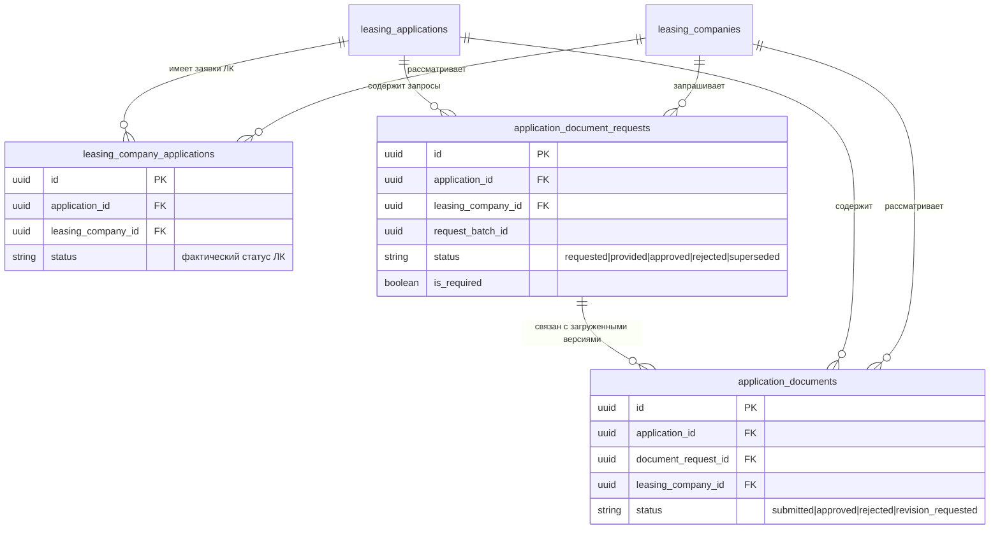

# Спецификация: динамический этап дополнительных документов и семантическая навигация уведомлений

- **Bitrix:** https://carcraftpro.bitrix24.ru/workgroups/group/124/tasks/task/view/22382/
- **Дата и время создания:** 2026-09-29 19:46:36 MSK (UTC+3)
- **Изменение требований:** 2026-09-30 14:10:13 MSK (UTC+3)
- **Идентификатор задачи:** `22382`
- **Тип:** `bugfix`
- **Рабочая ветка:** `bugfix/22382`
- **Целевая ветка MR:** `test`
- **Затрагиваемая область:** desktop web от 768 CSS-пикселей; frontend, read-only API-проекции заявок и ЛК, обработка статуса одобрения запрошенного документа, техническое формирование ссылок уведомлений. Схема БД, фактические статусы ЛК, права доступа и мобильный интерфейс не меняются.



```mermaid
sequenceDiagram
    participant LC as Кабинет ЛК
    participant API as FastAPI
    participant DB as PostgreSQL
    participant Client as Кабинет клиента

    LC->>API: Запрашивает обязательные документы
    API->>DB: Создаёт application_document_requests(status=requested)
    Client->>API: Читает заявку
    API->>DB: Загружает ЛК и агрегирует запросы документов по каждой ЛК
    API-->>Client: status=фактический, display_status=documents_required

    Client->>API: Загружает документ по request_id
    API->>DB: Создаёт application_documents(status=submitted), запрос=provided
    Client->>API: Обновляет заявку
    API-->>Client: display_status=under_review_with_docs

    LC->>API: Одобряет загруженный документ
    API->>DB: application_documents=approved и request=approved в одной транзакции
    API->>DB: Пересчитывает read-only display_status при следующем чтении
    API-->>Client: Пока есть requested — documents_required; когда нет — фактический статус ЛК
```

---

## 1. Бизнес-цель

Сделать ленту этапов клиентской заявки короче и понятнее: «Доп. документы» не является постоянным этапом, а появляется как заметный интерактивный индикатор на всём протяжении незакрытого документного процесса конкретной ЛК. Отправка предварительного или итогового КП не должна скрывать незавершённые запросы дополнительных документов.

Переходы из уведомлений должны открывать смысловой раздел, а не зависеть от номера элемента в ленте.

## 2. Подтверждённое текущее поведение

- В `frontend/features/checkout/utils/steps.ts` лента содержит семь постоянных шагов и условный документный бакет, в который входят `documents_required` и `under_review_with_docs`.
- В `frontend/pages/application/[id].vue` доступность этапов определяется только по полю `leasing_company_applications[].status`.
- После отправки предварительного КП `backend/application/commands/leasing_response.py` меняет фактический статус ЛК на `approved_scoring`; поэтому документный бакет исчезает, даже если запросы документов ещё не завершены.
- Запросы хранятся по паре «заявка + ЛК» в `application_document_requests`. Это надёжный источник состава и состояния запрошенных документов, в отличие от общего исторического списка `requested_documents` заявки.
- Загрузка документа создаёт связанную запись `application_documents` со статусом `submitted` и переводит запрос в `provided`.
- Текущая команда одобрения переводит связанную запись `application_documents` в `approved`, но не переводит соответствующий `application_document_request` из `provided` в `approved`. Поэтому статус запроса сам по себе сейчас не доказывает, что документ уже одобрен.
- Фактический статус ЛК управляет бизнес-переходами, правами на действия, аналитикой и уведомлениями. Его подмена документным статусом может потерять или исказить актуальное предварительное/итоговое решение ЛК.

## 3. Целевое поведение

### 3.1. Постоянная лента

Постоянно отображаются семь этапов в исходном горизонтальном дизайне:

1. Анкета
2. О компании
3. Отправленные
4. Предварительные
5. Итоговое
6. Выбор ЛК
7. Сделка

Постоянного этапа «Доп. документы» в ленте нет.

### 3.2. Состояние документного процесса одной ЛК

Расчёт выполняется отдельно для каждой пары «заявка + ЛК» только по обязательным запросам (`is_required=true`). Необязательные запросы не блокируют завершение документного процесса.

Активными считаются запросы в состояниях `requested` и `provided`. `approved` завершает запрос; `rejected` и `superseded` не являются активным запросом документов и не блокируют отображение.

Для активных обязательных запросов используются правила:

- если существует хотя бы один запрос `provided`, отображаемый статус ЛК — `under_review_with_docs`, даже если у этой же ЛК есть другие ещё не загруженные запросы;
- если активных `provided` нет, но существует хотя бы один `requested`, отображаемый статус ЛК — `documents_required`;
- если активных обязательных запросов нет, отображается фактический статус ЛК без подмены;
- после одобрения одного документа при наличии другого незагруженного обязательного запроса отображение возвращается из `under_review_with_docs` в `documents_required`;
- после одобрения всех обязательных запросов отображение возвращается к последнему фактическому статусу ЛК, например `approved_scoring` или `approved_final`.

Статус `approved` запроса должен фиксироваться в той же транзакции, в которой ЛК одобряет привязанный к нему документ. Для автоматически одобренного документа этот статус должен быть установлен уже во время загрузки.

### 3.3. Разделение фактического и отображаемого статуса

Система добавляет read-only поле `display_status` в проекции заявки ЛК:

- `status` остаётся фактическим сохранённым статусом `leasing_company_applications`;
- `display_status` вычисляется на чтении по правилам раздела 3.2;
- если незавершённых обязательных запросов нет, `display_status` равен `status`;
- команды, права доступа, фильтры, уведомления, DWH-события и переходы статусов продолжают использовать только фактический `status`;
- frontend использует `display_status` исключительно там, где требуется показать пользователю текущий этап или бейдж состояния. Он не отправляет это значение обратно в API и не использует его для разрешения действий.

Так сохраняется последнее решение ЛК без восстановления из истории и без изменения доменной машины состояний.

### 3.4. Динамический документный этап

Если `display_status` хотя бы одной ЛК равен `documents_required` или `under_review_with_docs`, между «Предварительные» и «Итоговое» отображается динамический этап:

- круг того же размера и базового стиля, что у остальных этапов;
- внутри круга — `!`;
- подпись — «Доп. документы»;
- этап интерактивен и открывает существующий документный раздел;
- при выборе этап считается текущим: круг и подпись получают текущие стили, а предыдущие доступные этапы получают состояние «завершён»;
- при исчезновении документного отображаемого статуса у всех ЛК этап не рендерится.

Динамический этап не имеет постоянного отображаемого номера и не меняет номера семи постоянных этапов.

### 3.5. Правила выбора и обновления текущего раздела

- Если документный этап — единственный доступный статусный раздел либо наиболее поздний доступный статусный раздел, он открывается автоматически при загрузке или обновлении статусов.
- Если пользователь находится на более позднем доступном разделе («Итоговое», «Выбор ЛК», «Сделка»), появление `display_status=documents_required` или `display_status=under_review_with_docs` не переводит его назад.
- Пользователь может вручную открыть любой доступный постоянный или документный раздел.
- Если пользователь находился на документном разделе, а документный отображаемый статус исчез у всех ЛК, открывается наиболее поздний оставшийся доступный статусный раздел; если статусных разделов нет — существующий безопасный fallback для страницы заявки.
- Для нескольких ЛК наличие документного отображаемого статуса хотя бы у одной ЛК показывает динамический этап. Более поздний фактический статус другой ЛК его не скрывает.

### 3.6. Кабинет ЛК

В ответе состояния ЛК добавляется `link.display_status`. Бейдж на странице ЛК показывает `display_status`, чтобы ЛК видела факт загрузки документов клиентом:

- после запроса, до первой загрузки — «Запрошены документы»;
- после первой загрузки, пока хотя бы один документ ожидает проверки — «На рассмотрении с документами»;
- после одобрения загруженного документа при наличии ещё незагруженных обязательных запросов — снова «Запрошены документы»;
- после закрытия всех обязательных запросов — фактическое решение ЛК.

Кнопки, формы, опрос состояния и иные разрешения в кабинете ЛК продолжают опираться на `link.status` и не меняют своё поведение от `display_status`.

### 3.7. Семантическая навигация уведомлений — вариант B

Новые и проецируемые системные уведомления лизинговой заявки используют параметр `section`, а не `step`:

- `section=preliminary` для `approved_scoring` и `approved_scoring_another_cond`;
- `section=documents` для `leasing.documents_requested`;
- `section=final` для `approved_final` и `approved_final_another_cond`.

Фронтенд сопоставляет значение `section` с внутренней идентичностью раздела, а не с отображаемым номером. Это позволяет менять состав и нумерацию ленты без поломки переходов.

При переходе с `section=documents`:

- если документный раздел доступен, он открывается;
- если документный раздел уже недоступен, применяется существующий сценарий устаревшей ссылки: открывается актуальный доступный раздел и показывается нейтральное уведомление, что исходный раздел больше недоступен.

Исторические системные уведомления, которые содержат структурированные данные лизингового события и старый `step`, при чтении преобразуются существующей read-only проекцией в корректный `section`. Вручную заданные, внешние, небезопасные и относящиеся к другой сущности URL не переписываются.

## 4. Техническое решение и порядок реализации

### Шаг 1. Сначала закрепить транзакционную семантику одобрения запроса

Изменить `backend/application/commands/leasing/approve_application_document.py` и `backend/infrastructure/repositories/application_documents_repository.py` так, чтобы команда одобрения:

- атомарно получала `document_request_id` именно одобренной связи «документ + заявка + ЛК»;
- переводила эту связь в `approved`;
- переводила конкретный связанный запрос, найденный по UUID, в `approved`;
- не обновляла запросы по `document_type`, чтобы одинаковые типы в разных пакетах не закрывались ошибочно.

Изменить `backend/application/commands/documents/upload_for_application.py`, чтобы автоматически одобренный документ сразу закрывал конкретный запрос как `approved`. Для обычной загрузки сохраняется `provided`.

Добавить или расширить затронутые интеграционные проверки существующего документного потока: обычная загрузка, обычное одобрение, автоматическое одобрение и изоляция другой ЛК/пакета.

### Шаг 2. Добавить серверную read-only проекцию `display_status`

В `backend/infrastructure/repositories/application_documents_repository.py` реализовать один пакетный read-запрос, который для одной заявки возвращает отображаемый статус по идентификатору ЛК. Он должен учитывать только `application_document_requests` этой заявки и ЛК, только `is_required=true`, и применять порядок `provided` → `under_review_with_docs`, затем `requested` → `documents_required`, иначе фактический статус.

В `backend/application/queries/applications/get_application.py` обогатить каждый элемент `leasing_company_applications` полем `display_status`, не меняя его `status`. В `backend/application/queries/leasing_response.py` обогатить тем же полем только `link` авторизованной ЛК в `GET /api/v1/leasing/applications/{application_id}/response`.

Обновить точные Pydantic-ответы FastAPI и TypeScript-интерфейсы, где они описывают `link`, чтобы `display_status` был read-only необязательным строковым полем. Не добавлять миграцию и не изменять DWH payload.

### Шаг 3. Переключить отображение в desktop-клиенте без изменения бизнес-действий

В `frontend/pages/application/[id].vue` использовать `item.display_status ?? item.status` только для построения доступных статусных разделов и ленты. Это обеспечивает динамический этап, даже если фактический статус ЛК уже `approved_scoring` или `approved_final`.

В `frontend/pages/workspace/leasing-applications/[id]/index.vue` использовать `link.display_status ?? link.status` только для текста и цвета бейджа. Все проверки доступности действий, в том числе запрос документов, подтверждение сделки и poller, оставить на `link.status`.

Не менять навигацию `section`, правила неизменности более позднего открытого раздела и фактические статусы, уже реализованные в исходной части задачи.

### Шаг 4. Проверить регрессии и сквозной пользовательский путь

Расширить `frontend/tests/e2e/checkout/22282-auto-switch-status-steps.spec.ts` следующими изолированными сценариями с API-ответом, содержащим раздельные `status` и `display_status`:

- фактический `approved_scoring` + отображаемый `documents_required` показывает «Доп. документы»;
- фактический `approved_final` + отображаемый `under_review_with_docs` показывает «Доп. документы», но не переводит пользователя назад с итогового раздела;
- фактический `approved_scoring` + равный ему `display_status` без открытых запросов не показывает документный этап;
- несколько ЛК: документный отображаемый статус одной ЛК не скрывается более поздним фактическим статусом другой.

Добавить или обновить backend-интеграционные тесты для возврата `display_status` в клиентской заявке и в ответе ЛК, включая все три состояния: `documents_required`, `under_review_with_docs`, возврат фактического статуса после одобрения всех обязательных запросов.

Перед коммитом выполнить обязательные статические проверки backend, Docker-сборку/запуск, целевые E2E и `uv run alembic upgrade head` с `uv run alembic check`. Полный `scripts/e2e/run.sh` выполняет reset/seed изолированной базы; он запускается только после отдельного явного разрешения пользователя на этот изолированный destructive lifecycle.

## 5. Планируемые файлы

- `backend/application/commands/leasing/approve_application_document.py` — атомарное закрытие конкретного запроса после одобрения документа.
- `backend/application/commands/documents/upload_for_application.py` — закрытие конкретного запроса для автоматически одобренного документа.
- `backend/infrastructure/repositories/application_documents_repository.py` — точечная запись статуса по ID запроса и пакетный read-model отображаемого статуса.
- `backend/application/queries/applications/get_application.py` — `display_status` в клиентской проекции ЛК.
- `backend/application/queries/leasing_response.py` — `display_status` в состоянии авторизованной ЛК.
- `backend/presentation/schemas/leasing.py` — контракт ответа состояния ЛК, если требуется для валидации ответа.
- `frontend/pages/application/[id].vue` — выбор этапов по `display_status`.
- `frontend/features/leasing/api/leasingApi.ts` — TypeScript-контракт `display_status` ответа ЛК.
- `frontend/pages/workspace/leasing-applications/[id]/index.vue` — отображение бейджа по `display_status` при сохранении действий по фактическому `status`.
- `frontend/tests/e2e/checkout/22282-auto-switch-status-steps.spec.ts` — сценарии динамического этапа при различии фактического и отображаемого статуса.
- Существующие целевые backend-интеграционные тесты документов и ЛК — проверка атомарного закрытия запроса и read-only проекций.

## 6. Критерии готовности

- [ ] В фактическом статусе ЛК после отправки предварительного или итогового КП сохраняется реальное решение ЛК; документный процесс не перезаписывает `leasing_company_applications.status`.
- [ ] Обычное одобрение документа переводит в `approved` и связь документа с ЛК, и ровно один связанный запрос по `document_request_id` в одной транзакции.
- [ ] Автоматически одобренный документ сразу переводит свой запрос в `approved`.
- [ ] Запросы другой ЛК, другого пакета или с тем же `document_type` не меняют статус при одобрении конкретного документа.
- [ ] Для обязательных запросов конкретной ЛК хотя бы один `provided` даёт `display_status=under_review_with_docs`.
- [ ] Если `provided` нет, но есть хотя бы один обязательный `requested`, `display_status=documents_required`.
- [ ] После одобрения загруженного документа при наличии другого незагруженного обязательного запроса отображение возвращается к `documents_required`.
- [ ] После одобрения всех обязательных запросов `display_status` равен последнему фактическому статусу ЛК.
- [ ] Необязательные, `rejected` и `superseded` запросы не удерживают документный этап.
- [ ] Клиентская лента показывает «Доп. документы», когда `display_status` хотя бы одной ЛК документный, даже если её фактический `status` — `approved_scoring` или более поздний.
- [ ] Появление документного этапа не переводит пользователя назад с более позднего доступного раздела.
- [ ] Кабинет ЛК показывает `display_status` в бейдже, но его действия и права продолжают использовать фактический `status`.
- [ ] Без документных отображаемых статусов лента содержит ровно семь постоянных этапов, а «Итоговое», «Выбор ЛК», «Сделка» отображаются с номерами 5, 6 и 7.
- [ ] Новые уведомления используют `section=preliminary|documents|final`, а не `step`; исторические вручную заданные и внешние URL не переписываются.
- [ ] Выполнен browser E2E затронутых desktop-сценариев при viewport не менее 768 CSS-пикселей; проверены логи браузера и приложения.
- [ ] Выполнены Docker-сборка/запуск, обязательные статические backend-проверки и `uv run alembic upgrade head` + `uv run alembic check` с результатом `No new upgrade operations detected.`

## 7. Риски, границы и не блокирующие договорённости

- **Риск согласованности:** до исправления запись запроса могла остаться `provided`, хотя документ уже одобрен. Исправление не пытается ретроспективно мигрировать исторические данные. Историческая коррекция, если потребуется, оформляется отдельной задачей с проверкой данных.
- **Граница повторного запроса:** расчёт идентифицирует запрос по UUID, а не по типу документа. Повторный запрос нового пакета является самостоятельным и снова открывает документный этап, пока не одобрен или не станет неактивным.
- **Граница отклонения:** для этой задачи `rejected` и `superseded` — неактивные запросы по текущей доменной модели; новые правила перевода отклонённого документа в повторный запрос не вводятся.
- **Безопасность:** `display_status` — серверное read-only поле. Клиент не передаёт идентификатор ЛК или статус для расчёта, а существующая авторизация чтения заявок и состояния ЛК сохраняется.
- **Внешний риск:** окружение ранее не смогло установить отсутствующий frontend-пакет через Bun из-за SOCKS-proxy. Если это повторится, build/browser E2E нельзя считать пройденными; будет указан инфраструктурный блокер без фиктивного результата.
- **Не входит:** миграции БД, перезапись исторических статусов ЛК, изменение доменной машины состояний ЛК, изменение DWH-аналитики, изменение прав доступа, мобильный интерфейс, создание MR и merge.

## 8. Дополнение от 2026-09-30 13:23 UTC: закрытие document overlay и параллельная доступность этапов

### 8.1. Уточнённое правило закрытия документа

`display_status` не должен удерживать «Доп. документы», когда все обязательные документы для конкретной пары «заявка + ЛК» уже приняты.

Для каждого обязательного `application_document_request` запрос считается завершённым, если выполнено хотя бы одно из условий:

- его собственный `status=approved`;
- существует связанная запись `application_documents` с тем же `document_request_id`, той же заявкой и той же ЛК, и у этой связи `status=approved`.

Второе условие — read-only совместимость для уже созданных или альтернативно обработанных документов, где одобрение связи было сохранено, а статус request не синхронизировался. Оно не изменяет данные и не ищет запрос по `document_type`.

Для незавершённых обязательных запросов сохраняется порядок отображения:

- существует хотя бы один незавершённый `provided` — `under_review_with_docs`;
- `provided` нет, но существует `requested` — `documents_required`;
- незавершённых обязательных запросов нет — `display_status` равен фактическому `leasing_company_applications.status`.

### 8.2. Параллельная доступность предварительного КП и допдокументов

`display_status` — добавочный документный overlay, а не замена фактического статуса ЛК для навигации.

Когда у одной ЛК фактический `status=approved_scoring` (или `approved_scoring_another_cond`) и `display_status` документный:

- этап «Предварительные» остаётся доступным и открывается по нажатию на постоянный шаг 4;
- динамический этап «Доп. документы» также остаётся доступным;
- одна и та же карточка ЛК видна в обоих разделах;
- в «Предварительных» карточка использует фактический статус для группировки и бейджа;
- в «Доп. документах» — документный `display_status` для группировки и бейджа;
- действия, доступность кнопок и workflow во всех разделах по-прежнему используют raw `status`.

### 8.3. Технические изменения

1. В `application_documents_repository.list_lc_display_statuses()` расширить пакетную read-only агрегацию: `provided` повышает приоритет только если нет одобренной связи `ApplicationDocument` с тем же `document_request_id`, заявкой и ЛК. Синхронизацию записи запроса в командах одобрения сохранить.
2. В `frontend/pages/application/[id].vue` вычислять доступность обычных статусных разделов (`sent`, `preliminary`, `final`, `selected`, `deal`) по raw `status`. Доступность `documents` вычислять по `display_status ?? status`.
3. В `frontend/features/checkout/components/CheckoutOffersStep.vue` фильтровать и отображать карточку по raw `status` для обычных разделов и по overlay только для раздела `documents`.
4. Расширить существующие backend- и Playwright-сценарии:
   - `provided` request с одобренной связью документа не удерживает document overlay;
   - после приёма последнего документа в list API возвращается фактический статус ЛК;
   - `approved_scoring + display_status=documents_required` одновременно открывает этапы «Предварительные» и «Доп. документы»;
   - переход по шагу 4 открывает предварительное КП, а карточка ЛК остаётся доступной в обоих разделах.

### 8.4. Дополнительные критерии готовности

- [ ] После приёма последнего обязательного документа dynamic этап «Доп. документы» исчезает без ручного обновления данных или изменения фактического статуса ЛК.
- [ ] Одобренная связь документа закрывает document overlay только для своего `document_request_id`, своей заявки и своей ЛК.
- [ ] При `approved_scoring + documents_required` пользователь может по очереди открыть «Предварительные» и «Доп. документы»; ни один из этих этапов не исключает другой.
- [ ] В разделе «Предварительные» карточка показывает фактическое предварительное КП, в разделе «Доп. документы» — документный статус той же ЛК.

## 9. Условие начала реализации

Дополнение должно быть явно одобрено пользователем. До одобрения не изменяются прикладной код, тесты, конфигурация, данные, удалённые ветки или MR. Отдельное явное разрешение также требуется перед запуском `scripts/e2e/run.sh`, поскольку он reset/seed-ит изолированную БД.
