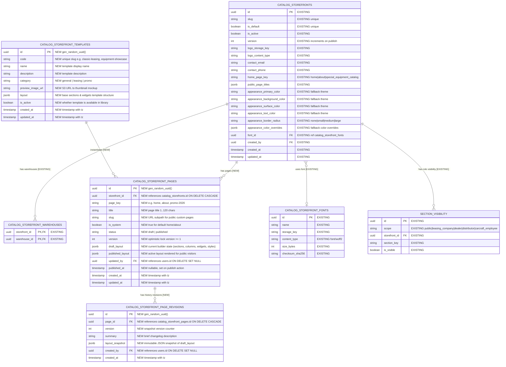
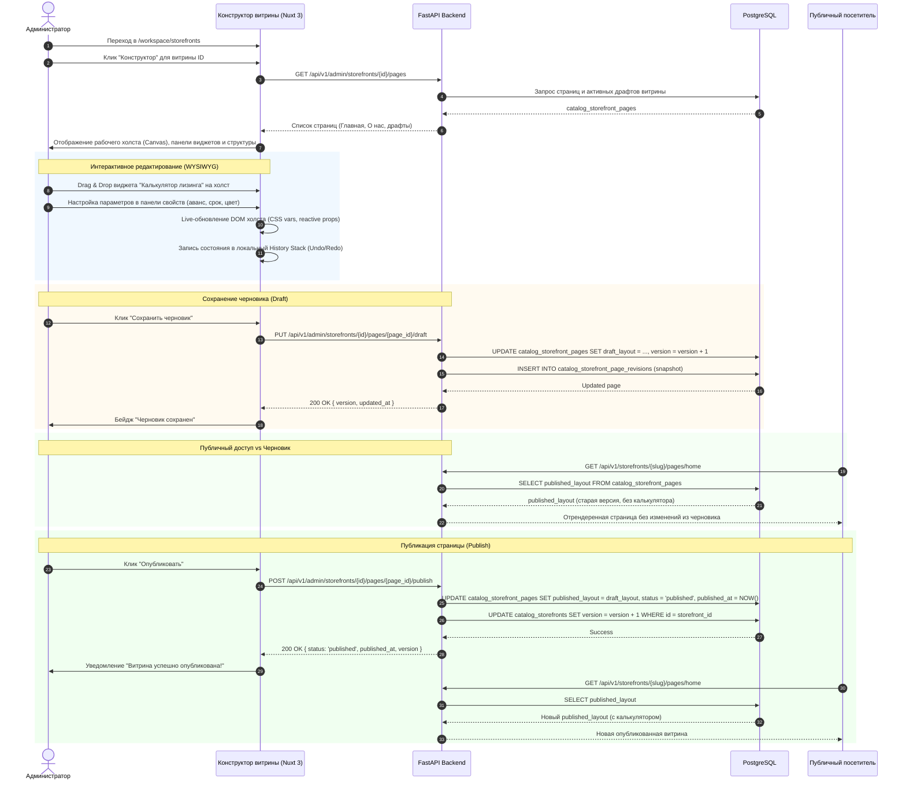

# Конструктор витрин (Storefront Page Builder)

- **Bitrix:** Внутренняя задача (без Bitrix)
- **Slug:** `storefront-constructor`
- **Тип:** feature
- **Ветка:** `feature/storefront-constructor`
- **Целевая ветка:** `test`
- **MR:** https://gitlab.carcraft.ru/carcraft/carcraft-leadgenerator/-/merge_requests/483
- **Дата создания:** 2026-09-30 07:03:09 MSK (UTC+3)

---

## 1. ER-диаграмма затронутых и новых сущностей БД

Ниже представлена ER-диаграмма данных.
*Примечание:* Существующие таблицы отмечены как `[EXISTING]`, новые таблицы и новые поля для Конструктора страниц выделены как `[NEW]`.



---

## 2. Диаграмма последовательности (Sequence Diagram)

Показывает сквозной процесс работы администратора в Конструкторе: открытие, редактирование блоков, сохранение черновика, предпросмотр, откат ревизии и публикацию на публичную витрину.




---

## 3. Постановка задачи и бизнес-контекст

### 3.1. Текущее состояние системы
На странице `/workspace/storefronts`:
1. Управление витринами разделено на 3 подвкладки:
   - "Основные настройки" (`tab=general`): slug, активность, контакты (email, телефон), выбор привязанных складов, загрузка логотипа.
   - "Страницы и видимость" (`tab=visibility`): выбор главной страницы (`home_page_key`), переименование стандартных страниц (Главная, О нас, Спецтехника), матрица видимости разделов по 5 ролям (`public`, `carcraft_employee`, `leasing_company`, `dealer`, `distributor`).
   - "Оформление" (`tab=appearance`): выбор 4 цветов палитры (primary, background, surface, text), редактор переопределений токенов по блокам/элементам/состояниям, выбор радиуса скруглений и шрифта.
2. Текущее ограничение:
   - Внешний вид витрины жестко зашит в статическую верстку Nuxt-страниц (`index.vue`, `about.vue`, `special-equipment/*`).
   - Администратор не может менять расположение блоков, добавлять новые секции (баннеры, калькуляторы, акции, FAQ, блоки преимуществ), конструировать посадочные страницы под маркетинговые кампании или настраивать разные промо-блоки для разных лизинговых партнеров.
   - Любое изменение структуры страницы требует работы разработчиков, правок в коде компонентов и релиза.

### 3.2. Цель переработки
1. Убрать вкладку "Оформление" из детальной карточки витрины `/workspace/storefronts`, заменив её на яркую кнопку перехода в **"Конструктор"** (`/workspace/storefronts/{id}/builder`).
2. В карточке витрины на вкладке "Страницы и видимость" оставить управление доступом к системным разделам кабинетов (роли лизинговой компании, дилера, дистрибьютора, администратора), а визуальное конструирование страниц перенести полностью в Конструктор.
3. Разработать специализированный визуальный WYSIWYG Drag-and-Drop **Конструктор страниц (Page Builder)**, вдохновленный концепцией Elementor, но адаптированный под бизнес-специфику платформы лизинга Carcraft.
4. Обеспечить двухфазный жизненный цикл страниц: **Черновик (Draft)** $\rightarrow$ **Публикация (Publish)** с автоматическим версионированием и созданием истории ревизий для мгновенного отката при ошибках.
5. Обеспечить 100% обратную совместимость: существующие витрины без кастомного макета автоматически продолжают отображать стандартную структуру страниц без сбоев.

---

## 4. Требования к Конструктору (Elementor-like Scoped Builder)

### 4.1. Общие архитектурные ограничения
1. **Desktop Web Only (768px+):** Согласно правилу `AGENTS.md`, платформа является исключительно Desktop Web-приложением с минимальной шириной viewport 768 CSS-пикселей. Никаких mobile-only меню, drawer или экранов `< 768px`. В конструкторе поддерживаются 3 режима предпросмотра:
   - Desktop (1280px+)
   - Laptop (1024px)
   - Tablet / Desktop Compact (768px)
2. **Идентификаторы UUID:** Все ID сущностей, страниц, ревизий, секций и виджетов строго являются строковыми UUID v4 (`uuid.UUID` на бэкенде, `string` на фронтенде). Числовые ID строго запрещены.
3. **Безопасность и RBAC:** Доступ к Конструктору разрешен пользователям с ролью `carcraft_employee` и скоупом `storefronts:admin`. Публичный API отдает только опубликованный макет (`published_layout`). Черновики (`draft_layout`) доступны только через авторизованный админский эндпоинт.

### 4.2. Библиотека виджетов (Widget Registry)
Конструктор предоставляет набор специализированных B2B-виджетов:

| № | Виджет (тип) | Название | Настраиваемые параметры (Props) | Источник данных |
|---|---|---|---|---|
| 1 | `hero_banner` | Главный промо-баннер | Заголовок, подзаголовок, фоновое изображение (S3), оверлей затемнения, кнопка CTA (текст + ссылка/якорь), бейдж акции | Конфигурация виджета |
| 2 | `leasing_calculator` | Лизинговый калькулятор | Заголовок, дефолтная стоимость, мин/макс срок (мес.), мин/макс аванс (%), показ кнопки «Подать заявку» | Встроенный калькулятор Carcraft |
| 3 | `product_showcase` | Витрина спецтехники | Заголовок, выбор категорий/марок для фильтра, кол-во карточек (4, 8, 12), режим сетки/карусели, сортировка (новизна, цена) | Публичный API каталога витрины `/api/v1/storefronts/{slug}/special-equipment/products` с учетом привязанных складов |
| 4 | `features_grid` | Преимущества / УТП | Сетка 2, 3 или 4 колонок; для каждого элемента: иконка (из SVG-библиотеки), заголовок, краткое описание | Конфигурация виджета |
| 5 | `lead_form` | Форма заявки на лизинг | Заголовок, поля (ИНН, телефон, имя, комментарий, выбор категории), текст кнопки отправки, соглашение об обработке ПДн | Отправка заявки в `/api/v1/storefronts/{slug}/applications` |
| 6 | `partners_carousel` | Логотипы партнеров / Лизингодатели | Заголовок, список элементов: логотип (изображение), название компании, ссылка | Конфигурация виджета |
| 7 | `rich_text` | Текстовый блок / О компании | WYSIWYG HTML (заголовки H2/H3, абзацы, маркированные списки, цитаты, выравнивание) | Конфигурация виджета |
| 8 | `faq_accordion` | Вопросы и ответы (FAQ) | Список раскрывающихся пар (Вопрос, Ответ), раскрывать первый элемент по умолчанию (да/нет) | Конфигурация виджета |
| 9 | `contacts_block` | Контакты и реквизиты | Переключатели показа: адрес, телефон, email, реквизиты, карта/схема проезда | Подтягивается из настроек витрины + локальные переопределения |
| 10 | `cta_strip` | Конверсионная плашка (CTA) | Текст призыва, фоновый градиент/цвет, 1-2 кнопки действий (ссылка на звонок, переход в каталог, открытие формы) | Конфигурация виджета |
| 11 | `spacer_divider` | Отступ / Разделитель | Высота отступа (px), стиль разделителя (сплошной, пунктир, пустота), цвет линии | Стилизация |

### 4.3. Импорт и экспорт пресетов витрины и страниц (Presets Transfer)
1. **Экспорт пресета страницы (Page Preset Export):**
   - Выгрузка текущего макета страницы (черновика или опубликованной версии) в структурированный JSON-файл вида `storefront-preset-{slug}-{page_key}-YYYY-MM-DD.json`.
   - Экспортируемый JSON содержит: версию схемы (`schema_version: "1.0"`), метаданные страницы, массив секций, колонок, виджетов со всеми `props` и локальными стилями.
   - Ссылки на медиа-файлы (баннеры, логотипы) сохраняются в виде относительных или постоянных S3-ключей.
2. **Экспорт комплексного бандла витрины (Full Storefront Preset Bundle):**
   - Интеграция с существующим механизмом `StorefrontSettingsTransfer`: расширение схемы экспорта витрин полем `constructor_bundle`, включающим все сконструированные страницы (`pages: { home, about, custom_pages }`) и глобальные стили Конструктора.
   - Позволяет переносить готовую витрину между средами (dev -> stage -> test -> prod) в один клик.
3. **Импорт пресета с безопасным предпросмотром (Import & Preview):**
   - Загрузка JSON-файла пресета (до 10 МБ).
   - Двухэтапный процесс импорта:
     1. **Валидация и предпросмотр (Preview):** Бэкенд валидирует структуру через Pydantic-схему `StorefrontPresetPayload`, подсчитывает количество секций, проверяет корректность типов виджетов и возвращает сводку для подтверждения пользователю (Summary: количество секций, виджетов, неизвестные/устаревшие токены).
     2. **Применение (Apply):** Пользователь может выбрать режим применения:
        - *«Заменить текущий черновик»* (перезаписывает `draft_layout`, создает автоматическую ревизию для возможности мгновенного Undo).
        - *«Импортировать как новую страницу»* (создает новую запись страницы с отдельным slug).
        - *«Сохранить в библиотеку шаблонов»* (добавляет пресет в `catalog_storefront_templates` как переиспользуемый шаблон витрины).

---

## 5. Иерархия макета страницы (Page Layout Schema)

Каждая страница хранится в JSONB в виде нормализованного дерева:

```text
PageLayout
├── settings: PageGlobalSettings (заголовок, мета-теги, глобальные стили)
└── sections: Section[]
     ├── id: UUID
     ├── name: string ("Секция первого экрана", "Каталог спецтехники")
     ├── layout_type: "container" | "full_width"
     ├── styles: SectionStyles (padding, margin, background_color, background_image, border)
     └── columns: Column[]
          ├── id: UUID
          ├── width: number (от 1 до 12 по 12-колоночной сетке, например 6 и 6 или 12)
          └── widgets: Widget[]
               ├── id: UUID
               ├── type: WidgetType ("hero_banner", "leasing_calculator", ...)
               ├── is_hidden: boolean
               ├── props: Record<string, any> (контент виджета)
               └── styles: WidgetStyles (margin, padding, align, custom_css_classes)
```


---

## 6. Контракты API (FastAPI Backend)

Все эндпоинты администратора защищены JWT-авторизацией (`scope: storefronts:admin` и роль `carcraft_employee`).

### 6.1. Управление страницами витрины
1. `GET /api/v1/admin/storefronts/{storefront_id}/pages`
   - Возвращает список всех страниц витрины с их статусом, версией и датой публикации.
   - Ответ: `StorefrontPageListResponse`:
     ```json
     {
       "items": [
         {
           "id": "c1f7a022-7711-4081-817e-9769910c2c1e",
           "storefront_id": "00000000-0000-0000-0000-000000000001",
           "page_key": "home",
           "title": "Главная страница",
           "slug": "",
           "is_system": true,
           "status": "published",
           "version": 4,
           "has_unpublished_draft": true,
           "published_at": "2026-09-30T10:00:00Z",
           "updated_at": "2026-09-30T11:30:00Z"
         }
       ]
     }
     ```

2. `GET /api/v1/admin/storefronts/{storefront_id}/pages/{page_id}`
   - Возвращает полное состояние страницы для редактора (включая `draft_layout`, текущие `published_layout`, список ревизий).
   - Ответ: `StorefrontPageDetailResponse`.

3. `POST /api/v1/admin/storefronts/{storefront_id}/pages`
   - Создание новой кастомной страницы (например, лендинга акции).
   - Тело запроса:
     ```json
     {
       "title": "Спецпредложение на самосвалы",
       "page_key": "promo-dump-trucks",
       "slug": "promo-dump-trucks",
       "template_code": "equipment-showcase"
     }
     ```

4. `PUT /api/v1/admin/storefronts/{storefront_id}/pages/{page_id}/draft`
   - Сохранение текущего черновика из холста Конструктора.
   - Тело запроса:
     ```json
     {
       "title": "Главная страница (акция лето)",
       "expected_version": 4,
       "summary": "Добавлен блок с калькулятором и обновлен баннер",
       "draft_layout": { ... }
     }
     ```
   - Защита от конфликтов параллельного редактирования: если `expected_version != page.version`, возвращается HTTP 409 Conflict с кодом `VERSION_CONFLICT`.
   - При успешном сохранении создается новая запись в `catalog_storefront_page_revisions`.

5. `POST /api/v1/admin/storefronts/{storefront_id}/pages/{page_id}/publish`
   - Публикация черновика на публичную витрину.
   - Тело запроса: `{ "expected_version": 5 }`.
   - Логика:
     - Копирует `draft_layout` в `published_layout`.
     - Устанавливает `status = 'published'`, `published_at = NOW()`.
     - Инкрементирует `version` страницы и `catalog_storefronts.version` (чтобы инвалидировать фронтенд-кеш темы и разметки).

6. `GET /api/v1/admin/storefronts/{storefront_id}/pages/{page_id}/revisions`
   - Список сохраненных снимков страницы (история ревизий).
   - Ответ: список объектов `{ id, version, summary, created_by_name, created_at }`.

7. `POST /api/v1/admin/storefronts/{storefront_id}/pages/{page_id}/revisions/{revision_id}/restore`
   - Восстановление черновика из выбранной ревизии. Перезаписывает `draft_layout` содержимым снимка ревизии.

8. `POST /api/v1/admin/storefronts/{storefront_id}/builder/media`
   - Загрузка изображений для баннеров, промо-блоков и фонов (до 10 МБ, JPEG/PNG/WebP/SVG) с сохранением в S3 и возвратом публичного URL.

9. `GET /api/v1/admin/storefronts/{storefront_id}/pages/{page_id}/export`
   - Скачивание JSON-пресета страницы с заголовком `Content-Disposition: attachment; filename="storefront-page-{slug}-{page_key}-preset.json"`.

10. `POST /api/v1/admin/storefronts/{storefront_id}/pages/import-preview`
   - Прием файла пресета (multipart/form-data или JSON body), валидация Pydantic-схемой, проверка совместимости версий схемы.
   - Ответ: `StorefrontPresetPreviewResponse`:
     ```json
     {
       "is_valid": true,
       "schema_version": "1.0",
       "sections_count": 6,
       "widgets_count": 14,
       "widget_types": ["hero_banner", "leasing_calculator", "features_grid", "product_showcase", "faq_accordion", "contacts_block"],
       "warnings": []
     }
     ```

11. `POST /api/v1/admin/storefronts/{storefront_id}/pages/{page_id}/import`
   - Применение валидированного пресета к черновику страницы.
   - Тело запроса: `{ "preset_data": { ... }, "expected_version": 4, "summary": "Импорт пресета из файла" }`.
   - Атомарно обновляет `draft_layout`, сохраняет снимок в `catalog_storefront_page_revisions` и инкрементирует версию.

### 6.2. Публичный API витрины (Public Storefront API)
Эндпоинты открыты без авторизации и оптимизированы для быстрого ответа и кеширования.

1. `GET /api/v1/storefronts/{storefront_slug}/pages/{page_key}`
   - Для именованной витрины. Для дефолтной витрины доступен алиас: `GET /api/v1/storefront/pages/{page_key}`.
   - Возвращает исключительно `published_layout`.
   - Если кастомный макет еще не опубликован или отсутствует, возвращается структура `fallback_layout: true` (фронтенд отрендерит дефолтный шаблон страницы).
   - Поддерживает заголовки `ETag` и `Cache-Control: public, max-age=60, stale-while-revalidate=300`.

---

## 7. Архитектура и интерфейс Конструктора (Frontend Architecture)

### 7.1. Точки входа и навигация
1. **Основная панель витрин (`/workspace/storefronts`):**
   - Во вкладке "Витрины":
     - В правом верхнем углу карточки выбранной витрины размещается главная кнопка:
       `[ Конструктор витрины ]` (primary синий стиль с иконкой `WrenchScrewdriverIcon` или `SparklesIcon`).
     - Подвкладка "Оформление" удаляется из панели витрин. Все визуальные параметры (цвета, шрифты, отступы, расположение) настраиваются непосредственно внутри Конструктора.
     - Подвкладка "Страницы и видимость" переименовывается в "Доступ к разделам" и фокусируется на системных ролях кабинетов (`leasing_company`, `dealer`, `distributor`, `carcraft_employee`).
2. **Экран Конструктора (`/workspace/storefronts/{id}/builder`):**
   - Полноэкранный workspace-интерфейс без стандартных отвлекающих меню, оптимизированный под комфортную верстку.
   - Верхняя панель (Top Bar):
     - Стрелка «Назад к списку витрин».
     - Название витрины (например: *«Витрина: ООО Лизинг Партнер»*) и статус («Активна» / «Тестовая»).
     - Выпадающий список страниц: `[ Главная (home) ▾ ]`, `О нас`, `+ Создать страницу`.
     - Кнопки Undo / Redo (`Ctrl+Z`, `Ctrl+Shift+Z`).
     - Переключатель ширины холста (Desktop 1440px / Laptop 1024px / Tablet 768px).
     - Кнопка **«Шаблоны»** (библиотека готовых шаблонов).
     - Кнопка **«Экспорт пресета»** (скачивание JSON-файла текущего макета).
     - Кнопка **«Импорт пресета»** (модальное окно загрузки JSON с валидацией, предпросмотром структуры и кнопкой «Применить к черновику»).
     - Индикатор статуса изменений:
       - Зеленый бейдж: *«Все изменения опубликованы»*.
       - Желтый бейдж: *«Есть неопубликованный черновик»*.
     - Кнопка «Предпросмотр» (открывает модальное окно или новую вкладку с живым драфтом).
     - Кнопка «Сохранить черновик» (Save Draft).
     - Кнопка «Опубликовать» (Publish) с диалогом подтверждения.

### 7.2. Трехпанельная компоновка Конструктора
1. **Левая боковая панель (Toolbox & Inspector, ширина 360px):**
   - В верхней части табы режимов:
     - **«Виджеты»**: Каталог доступных блоков с иконками, описаниями и поиском. Перетаскиваются курсором на холст либо добавляются кликом в активную секцию.
     - **«Структура» (Дерево элементов)**: Иерархический навигатор секций, колонок и виджетов. Позволяет менять порядок элементов drag-and-drop'ом, переименовывать блоки, быстро скрывать (toggle visibility) или удалять.
     - **«Глобальный стиль»**: Настройка фирменных цветов витрины, базового шрифта (из каталога загруженных шрифтов `StorefrontFontsPanel`) и глобального радиуса скруглений.
     - **«История» (Ревизии)**: Хронологический список сохранений черновика с автором и возможностью отката в один клик.
   - В нижней части / при клике на элемент холста открывается **Инспектор свойств выбранного элемента**:
     - Вкладка **«Контент»**: редактирование текстов, выбор категорий спецтехники, загрузка фоновых изображений, настройка ссылок кнопок.
     - Вкладка **«Стиль»**: цвета текста, цвет фона блока, отступы (padding/margin), выравнивание по центру/краям.
     - Вкладка **«Расширенные»**: видимость блока, якорный ID для скролла, кастомные CSS классы.

2. **Центральная область (Рабочий холст — Live Canvas):**
   - Реальный WYSIWYG-рендеринг страницы с нулевой задержкой.
   - Каждый блок имеет интерактивную рамку при наведении (hover outline) и тулбар быстрых действий:
     - Иконка захвата (Drag handle) для перемещения вверх/вниз.
     - Иконка «Настройки» (открывает инспектор в левой панели).
     - Иконка «Дублировать» (клонирует блок со всеми настройками).
     - Иконка «Удалить» (с мягким подтверждением).
   - Между секциями отображаются пунктирные зоны с кнопкой `[ + Добавить секцию ]`.

3. **Публичный рендерер (`frontend/features/storefront/components/StorefrontPageRenderer.vue`):**
   - Высокопроизводительный динамический рендерер, рекурсивно отображающий секции и виджеты из `published_layout`.
   - Защищен от XSS: все пользовательские HTML-тексты очищаются через DOMPurify.
   - Поддерживает fallback на стандартную верстку для витрин, где страницы еще не были настроены через Конструктор.


---

## 8. План поэтапной реализации

Реализация разделена на 5 независимых этапов для контролируемого внедрения и верификации:

### Этап 1: Модели данных, миграции и Alembic
1. Создание миграции Alembic `143_catalog_storefront_pages.py`:
   - Таблица `catalog_storefront_pages` (UUID PK, связи с `catalog_storefronts`, `users`, поля `draft_layout`, `published_layout`, индексы, check constraints).
   - Таблица `catalog_storefront_page_revisions` (UUID PK, связь с `catalog_storefront_pages`, `layout_snapshot`).
   - Таблица `catalog_storefront_templates` с начальным сидированием 3 базовых шаблонов («Классический лизинг», «Каталожная витрина спецтехники», «Лизинговый промо-лендинг»).
2. Добавление SQLAlchemy ORM-моделей в `backend/infrastructure/models/storefront_pages.py`.
3. Регистрация моделей в метаданных `backend/infrastructure/models/__init__.py`.
4. Проверка чистоты миграций через `uv run alembic upgrade head` и `uv run alembic check`.

### Этап 2: Бэкенд API и сервисный слой
1. Pydantic-схемы валидации дерева блоков и настроек виджетов в `backend/presentation/schemas/storefront_pages.py`.
2. Репозиторий `storefront_page_repository.py` (CRUD страниц, оптимистическая блокировка версии, сохранение ревизий, публикация, восстановление).
3. Административный роутер `backend/presentation/routers/admin_storefront_pages.py` (`/api/v1/admin/storefronts/{id}/pages/*`).
4. Публичный роутер `storefront_pages.py` (`/api/v1/storefronts/{slug}/pages/{page_key}`).
5. Загрузка медиа-файлов конструктора в S3 `POST /api/v1/admin/storefronts/{id}/builder/media`.
6. Реализация экспорта, предпросмотра и импорта пресетов (эндпоинты `export`, `import-preview`, `import`).

### Этап 3: Базовый рендерер и библиотека виджетов на фронтенде
1. Создание каталога виджетов в `frontend/features/storefrontBuilder/widgets/`:
   - `WidgetHeroBanner.vue`
   - `WidgetLeasingCalculator.vue`
   - `WidgetProductShowcase.vue`
   - `WidgetFeaturesGrid.vue`
   - `WidgetLeadForm.vue`
   - `WidgetPartnersCarousel.vue`
   - `WidgetRichText.vue`
   - `WidgetFaqAccordion.vue`
   - `WidgetContactsBlock.vue`
   - `WidgetCtaStrip.vue`
   - `WidgetSpacerDivider.vue`
2. Универсальный рендерер страницы `StorefrontPageRenderer.vue` (рекурсивный рендеринг секций, колонок и виджетов).
3. Интеграция рендерера в публичные страницы `frontend/pages/index.vue` и `/:storefrontSlug/*`.

### Этап 4: Полноэкранный визуальный Конструктор (Editor UI)
1. Страница редактора `frontend/pages/workspace/storefronts/[id]/builder.vue`.
2. Стор Pinia `useStorefrontBuilderStore` (управление деревом макета, Undo/Redo стеком, dirty-состоянием, активным выбранным элементом).
3. Панель инструментов: каталог виджетов (Drag & Drop), навигатор дерева структуры, инспектор свойств (Контент / Стиль / Расширенные).
4. Холст (Live Canvas) с drag-and-drop перестановкой секций и тулбарами действий блоков.
5. Интерактивный предпросмотр в адаптивных разрешениях (Desktop 1440px / Laptop 1024px / Tablet 768px).
6. Модальное окно истории ревизий с откатом в один клик.
7. Модальное окно экспорта и импорта пресета страницы/витрины с валидацией, предпросмотром структуры блоков и применением.

### Этап 5: Рефакторинг страницы витрин и интеграция
1. Обновление `frontend/features/admin/storefronts/components/AdminStorefrontsPanel.vue`:
   - Добавление кнопки перехода в Конструктор в карточке витрины.
   - Удаление старой вкладки "Оформление".
   - Фокусировка вкладки "Доступ к разделам" на правах бизнес-ролей кабинетов.
2. Прогон статических проверок (Ruff, mypy, lint-imports).
3. Прогон E2E-тестов на работающем приложении и ручное тестирование по бизнес-кейсам.

---

## 9. Перечень бизнес-тест кейсов для ручной проверки (Manual Walkthrough)

Ниже приведен подробный чек-лист сквозных пользовательских сценариев. Любой тестировщик, менеджер или разработчик может последовательно открыть приложение в браузере и вручную проверить весь функционал.

### Кейс 1: Точка входа и открытие Конструктора
- **Предусловие:** Пользователь авторизован как администратор (`carcraft_employee`).
- **Шаги:**
  1. Перейти в боковом меню в раздел «Витрины» (`/workspace/storefronts`).
  2. Выбрать любую витрину из списка слева (например, основную витрину или дочернюю витрину дилера).
- **Ожидаемый результат:**
  - В карточке витрины отсутствует устаревшая вкладка «Оформление».
  - В шапке параметров витрины отображается заметная синяя кнопка **«Конструктор витрины»** с иконкой инструмента.
  - Вкладка «Доступ к разделам» содержит переключатели только для ролей кабинетов.
  3. Нажать кнопку **«Конструктор витрины»**.
- **Ожидаемый результат:**
  - Происходит переход на полноэкранный адрес `/workspace/storefronts/{id}/builder`.
  - Открывается интерфейс Конструктора: сверху Top Bar с названием витрины, слева панель виджетов, по центру — живой холст страницы.

---

### Кейс 2: Создание страницы из готового шаблона (Template Library)
- **Шаги:**
  1. В верхнем меню Конструктора нажать кнопку **«Шаблоны»**.
  2. В открывшемся модальном окне просмотреть доступные шаблоны: *«Классический лизинг»*, *«Каталожная витрина»*, *«Лизинговый промо-лендинг»*.
  3. Выбрать шаблон *«Классический лизинг»* и нажать кнопку **«Применить шаблон»**.
- **Ожидаемый результат:**
  - Модальное окно закрывается.
  - На центральном холсте мгновенно появляется готовая структура страницы: Hero-баннер, Лизинговый калькулятор, блок преимуществ УТП, Витрина спецтехники, блок FAQ и Контакты.
  - В верхнем баре статус меняется на желтый бейдж *«Есть несохраненные изменения»*.

---

### Кейс 3: Добавление, редактирование и перестановка виджетов (WYSIWYG)
- **Шаги:**
  1. В левой панели на вкладке «Виджеты» найти блок **«Лизинговый калькулятор»**.
  2. Перетащить мышью (Drag & Drop) виджет в центральную область холста между Hero-баннером и блоком преимуществ (или кликнуть по нему для вставки в выбранную секцию).
  3. Кликнуть по добавленному калькулятору на холсте.
- **Ожидаемый результат:**
  - Вокруг калькулятора на холсте появляется синяя активная рамка.
  - В левой панели автоматически открывается инспектор свойств калькулятора.
  4. В инспекторе изменить поле «Заголовок» на *«Рассчитайте лизинг за 1 минуту»*, минимальный аванс установить в `10%`.
  5. Переключиться на вкладку «Стиль» в инспекторе и выбрать цвет фона `#F3F4F6`.
- **Ожидаемый результат:**
  - Заголовок и фон калькулятора на холсте обновляются в реальном времени без перезагрузки страницы.
  6. На холсте навести курсор на тулбар над калькулятором, зажать иконку перемещения и перетащить его ниже блока преимуществ.
- **Ожидаемый результат:**
  - Калькулятор плавно перемещается на новую позицию в DOM-дереве.

---

### Кейс 4: Проверка истории действий (Undo / Redo)
- **Шаги:**
  1. Удалить любой блок на холсте, нажав иконку корзины («Удалить»).
- **Ожидаемый результат:**
  - Блок исчезает с холста.
  2. Нажать сочетание клавиш `Ctrl+Z` (или `Cmd+Z` на Mac) либо кликнуть стрелку «Назад» в верхнем баре.
- **Ожидаемый результат:**
  - Удаленный блок мгновенно восстанавливается на прежнее место со всеми параметрами.
  3. Нажать `Ctrl+Shift+Z` (или стрелку «Вперед»).
- **Ожидаемый результат:**
  - Действие отменяется повторно (блок снова удаляется).

---

### Кейс 5: Сохранение черновика (Draft) и проверка изоляции от публичного сайта
- **Шаги:**
  1. Изменить заголовок Hero-баннера на *«Эксклюзивные условия лизинга для юридических лиц 2026»*.
  2. В верхнем правом углу нажать кнопку **«Сохранить черновик»**.
- **Ожидаемый результат:**
  - Появляется всплывающее уведомление *«Черновик успешно сохранен»*.
  - Статус в верхнем баре меняется на *«Черновик сохранен (не опубликован)»*.
  3. В соседней вкладке браузера открыть публичную страницу витрины (например, `https://test.multileasing.ru/` или `https://test.multileasing.ru/:storefrontSlug`).
- **Ожидаемый результат (Критично!):**
  - Публичный посетитель видит старую версию страницы. Новый заголовок *«Эксклюзивные условия...»* **НЕ** отображается на публичном сайте, так как черновик изолирован в БД до момента явной публикации.

---

### Кейс 6: Предпросмотр черновика (Preview Mode)
- **Шаги:**
  1. В Конструкторе нажать кнопку **«Предпросмотр»**.
  2. Выбрать режим предпросмотра: во встроенном модальном окне или в новой вкладке.
  3. Переключить селектор ширины экрана: Desktop (1440px) $\rightarrow$ Laptop (1024px) $\rightarrow$ Tablet (768px).
- **Ожидаемый результат:**
  - Страница отображает черновик со всеми последними изменениями.
  - При переключении ширины холст плавно центрируется и сжимается до заданного разрешения, сетка колонок и карточек аккуратно адаптируется в пределах 768px+ без горизонтального скролла и без поломок верстки.

---

### Кейс 7: Публикация страницы (Publish)
- **Шаги:**
  1. В Конструкторе нажать главную кнопку **«Опубликовать»**.
  2. В диалоговом окне подтверждения нажать *«Да, опубликовать изменения»*.
- **Ожидаемый результат:**
  - Кнопка показывает индикатор загрузки, затем статус в верхнем баре загорается зеленым: *«Все изменения опубликованы»*.
  3. Вернуться на вкладку публичного сайта и обновить страницу (`F5` или `Cmd+R`).
- **Ожидаемый результат:**
  - На публичном сайте мгновенно отображается новая версия витрины: новый заголовок баннера, лизинговый калькулятор, блоки преимуществ и каталог.

---

### Кейс 8: Просмотр истории ревизий и откат (Rollback)
- **Шаги:**
  1. В левой панели Конструктора перейти на вкладку **«История»**.
- **Ожидаемый результат:**
  - Отображается список ревизий страницы с датой, временем, автором и кратким описанием изменений.
  2. Найти предыдущую ревизию (до добавления калькулятора) и нажать кнопку **«Восстановить эту версию»**.
- **Ожидаемый результат:**
  - Холст Конструктора мгновенно возвращается к состоянию выбранной версии (калькулятор исчезает).
  - Статус меняется на *«Есть несохраненный черновик»*.
  3. Нажать **«Опубликовать»** и проверить публичную страницу — откат применен на публичной витрине.

---

### Кейс 9: Загрузка медиа-файлов и изображений
- **Шаги:**
  1. Выбрать на холсте виджет Hero-баннера.
  2. В инспекторе свойств в поле «Фоновое изображение» нажать кнопку «Загрузить фото».
  3. Выбрать файл JPEG/PNG/WebP размером до 10 МБ.
- **Ожидаемый результат:**
  - Файл отправляется на бэкенд (`POST /api/v1/admin/storefronts/{id}/builder/media`), сохраняется в S3 и возвращается валидный постоянный URL.
  - На холсте фоновое изображение баннера моментально заменяется загруженным файлом.
  4. Попробовать загрузить неподдерживаемый файл (например, `.exe` или `.pdf`) либо файл больше 10 МБ.
- **Ожидаемый результат:**
  - Файл блокируется на клиенте с понятной ошибкой валидации, запрос в S3 не отправляется.

---

### Кейс 10: Интерактивность виджета «Витрина спецтехники» на публичной странице
- **Шаги:**
  1. На опубликованной витрине перейти к блоку «Каталог спецтехники».
  2. Проверить отображение карточек техники, цены и шильдиков характеристик.
  3. Кликнуть по карточке товара.
- **Ожидаемый результат:**
  - Происходит корректный переход на детальную страницу товара спецтехники с сохранением контекста витрины.

---

### Кейс 11: Экспорт и импорт пресета страницы/витрины (JSON Preset Transfer)
- **Шаги:**
  1. На странице с настроенными секциями и виджетами нажать кнопку **«Экспорт пресета»** в верхнем баре Конструктора.
- **Ожидаемый результат:**
  - В браузере скачивается файл `storefront-preset-...json` с валидной структурой макета, секций, колонок и параметров виджетов.
  2. Очистить холст или открыть другую витрину/создать новую страницу.
  3. В верхнем баре нажать кнопку **«Импорт пресета»**.
  4. В открывшемся модальном окне перетащить скачанный JSON-файл в область загрузки.
- **Ожидаемый результат:**
  - Модальное окно отображает предпросмотр пресета: количество секций (например, 6), список типов виджетов (`hero_banner`, `leasing_calculator`, `features_grid` и т.д.), зеленую плашку *«Файл валиден и готов к применению»*.
  5. Нажать кнопку **«Применить к черновику»**.
- **Ожидаемый результат:**
  - Модальное окно закрывается.
  - На холсте моментально восстанавливается вся структура страницы со всеми сохраненными текстами, настройками калькулятора, стилями и отступами.
  - Статус меняется на *«Есть несохраненные изменения»*, создается запись в локальном стеке Undo (можно отменить через `Ctrl+Z`).
  6. Нажать **«Опубликовать»** и убедиться, что импортированный пресет успешно доступен на публичной витрине.

---

## 10. Критерии готовности (Definition of Done)

1. **База данных:** Миграция `143_catalog_storefront_pages.py` применяется без ошибок, `alembic check` возвращает *«No new upgrade operations detected»*.
2. **Конструктор:** Интерфейс полностью функционален при разрешениях $\ge 768$ CSS-пикселей.
3. **Импорт/Экспорт:** Экспорт скачивает корректный JSON-файл макета, импорт валидирует структуру, показывает предпросмотр и применяет данные без сбоев.
4. **Безопасность:** Публичный API отдает только опубликованные макеты. Неавторизованный пользователь не имеет доступа к черновикам и админским операциям.
5. **Статические проверки:** `uv run ruff check . --fix`, `uv run lint-imports`, `uv run mypy .` выполняются без ошибок в измененных файлах.
6. **Тестирование:** Все 11 бизнес-тест кейсов успешно пройдены вручную.
7. **Обратная совместимость:** Существующие витрины сохраняют корректное отображение без сбоев.
