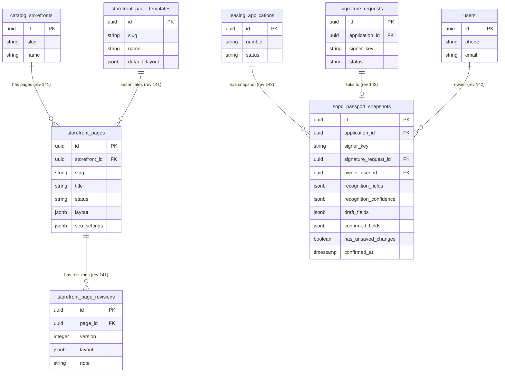

# Исправление коллизии и порядка миграций Alembic (141 -> 142)

- **Bitrix:** Внутренняя задача (без Bitrix)
- **Slug:** `fix-alembic-migrations-order`
- **Тип:** bugfix
- **Ветка:** `bugfix/fix-alembic-migrations-order`
- **Целевая ветка:** `test`
- **MR:** https://gitlab.carcraft.ru/carcraft/carcraft-leadgenerator/-/merge_requests/484
- **Дата создания:** 2026-09-30 08:07:20 MSK (UTC+3)

---

## 1. ER-диаграмма сущностей, затрагиваемых миграциями 141 и 142

Ниже представлена ER-диаграмма таблиц, создаваемых миграциями `141` и `142`, а также их связей с существующими таблицами БД. Структура таблиц не изменяется, исправляется только порядок применения миграций в DAG Alembic.



---

## 2. Постановка проблемы

В ветку `test` были влиты два параллельных пулл-реквеста:
1. MR #483 (`feature/storefront-constructor` коммит `fd73c34e`), создавший миграцию `141_catalog_storefront_pages.py` (`revision = "141"`, `down_revision = "140"`).
2. MR ветки `feature/21568-passport-recognition-qa` (коммит `23ebb464`), создавший миграцию `141_sopd_passport_snapshots.py` (`revision = "141"`, `down_revision = "140"`).

Обе миграции ответвились от ревизии `140` и получили одинаковый `revision = "141"`.

**Последствия:**
- При запуске любых команд Alembic возникает предупреждение:
  ```text
  UserWarning: Revision 141 is present more than once
  ```
- Alembic обнаруживает две параллельные головы (`heads`):
  ```text
  141 (head)
  141 (head)
  ```
- Команды `alembic upgrade head`, автодеплой и CI падают с ошибкой многоголовости (`Multiple head revisions are present for given argument 'head'`).

---

## 3. Требования

1. Граф миграций Alembic должен быть строго линейным с единственной head-ревизией.
2. Первой из параллельных миграций остаётся `141_catalog_storefront_pages.py`:
   - `revision = "141"`
   - `down_revision = "140"`
3. Вторая миграция `141_sopd_passport_snapshots.py` переименовывается и связывается в цепочку:
   - Файл: `backend/alembic/versions/142_sopd_passport_snapshots.py`
   - `revision = "142"`
   - `down_revision = "141"`
4. Никаких изменений DDL/DML в самих функциях `upgrade()` и `downgrade()` не вносится.
5. Проверка `uv run alembic heads` должна возвращать ровно одну голову: `142 (head)`.
6. Проверка `uv run alembic upgrade head` на локальной БД должна успешно накатить ревизии `141` и `142`.
7. Проверка `uv run alembic check` должна подтверждать отсутствие расхождений со схемой моделей (`No new upgrade operations detected.`).
8. Статические линтеры бэкенда (`ruff`, `lint-imports`, `mypy`) должны оставаться зелёными.

---

## 4. План реализации

1. **Переименование и перелинковка миграции:**
   - Выполнить `git mv backend/alembic/versions/141_sopd_passport_snapshots.py backend/alembic/versions/142_sopd_passport_snapshots.py`.
   - В `backend/alembic/versions/142_sopd_passport_snapshots.py` обновить docstring и переменные:
     ```python
     """SOPD passport snapshots.

     Revision ID: 142
     Revises: 141
     """
     ...
     revision = "142"
     down_revision = "141"
     ```
2. **Проверка графа миграций:**
   - Выполнить `uv run alembic heads` — убедиться, что видна только ревизия `142`.
   - Проверить `alembic history` на непрерывность цепочки от 139 -> 140 -> 141 -> 142.
3. **Проверка накатывания миграций на БД:**
   - Накатить миграции `uv run alembic upgrade head` на PostgreSQL.
   - Проверить наличие таблиц `storefront_pages`, `storefront_page_revisions`, `storefront_page_templates` и `sopd_passport_snapshots`.
   - Проверить `uv run alembic check`.
4. **Статический анализ:**
   - Выполнить `ruff check . --fix`, `lint-imports`, `mypy .`.

---

## 5. Критерии готовности

- [x] В `backend/alembic/versions/` отсутствуют дублирующиеся ревизии.
- [x] `uv run alembic heads` выводит единственную голову: `142 (head)`.
- [x] Все миграции успешно применяются (`uv run alembic upgrade head`).
- [x] `uv run alembic check` завершается с кодом 0 и не обнаруживает расхождений ORM-моделей с БД.
- [x] `ruff`, `lint-imports` и `mypy` не выдают новых ошибок.
- [x] Оформлен Merge Request в ветку `test` ([MR !484](https://gitlab.carcraft.ru/carcraft/carcraft-leadgenerator/-/merge_requests/484)).
