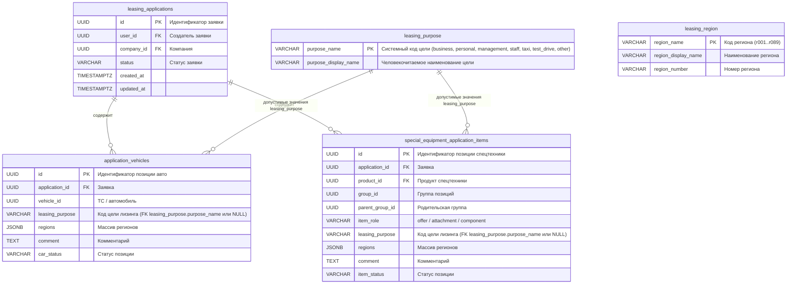
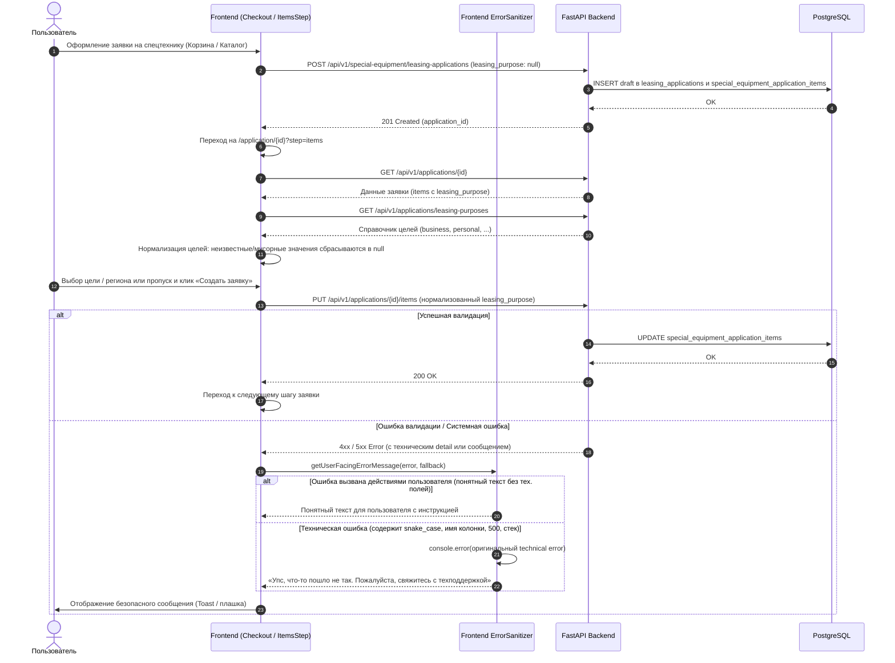

# Задача leasing-purpose-and-user-friendly-errors — Исправление ошибки leasing_purpose и скрытие технических ошибок на фронтенде

- **Bitrix:** Внутренняя задача (без Bitrix)
- **Ветка:** `bugfix/leasing-purpose-and-user-friendly-errors`
- **MR:** https://gitlab.carcraft.ru/carcraft/carcraft-leadgenerator/-/merge_requests/486
- **Тип:** bugfix
- **Дата создания:** 30.09.2026 11:20:26 MSK (UTC+3)

---

## ER-диаграмма

*Примечание к схеме:* Схема базы данных не изменяется; миграции не требуются. Поля `leasing_purpose` уже присутствуют в таблицах `application_vehicles` и `special_equipment_application_items`, а таблица `leasing_purpose` содержит эталонный справочник допустимых кодов.

---

## Sequence-диаграмма

---

## 1. Постановка проблемы

### Симптом
При оформлении заявки на лизинг спецтехники (например, заявка `36b010c8-228e-482e-9e36-10ac6f6da79e`) на шаге заполнения целей и регионов позиций (`?step=items`) нажатие кнопки «Создать заявку» завершается ошибкой:
- Запрос: `PUT https://test.multileasing.ru/api/v1/applications/36b010c8-228e-482e-9e36-10ac6f6da79e/items`
- HTTP-статус: `422 Unprocessable Entity`
- Содержимое ответа: `{"detail": "Некорректное значение leasing_purpose"}`
- Пользователю в UI выводится техническое сообщение: **«Некорректное значение leasing_purpose»**.

### Анализ первопричины (Root Cause)
1. **Подстановка типа сущности вместо цели:** В `frontend/pages/cart/conditions.vue` (строки 302, 406) и `frontend/pages/application/new.vue` (строка 317) при создании черновика заявки на спецтехнику в свойство `leasing_purpose` ошибочно передавалась строка `'special_equipment'` (тип позиции вместо реальной цели лизинга).
2. **Отсутствие валидации на этапе создания черновика:** Эндпоинт `POST /api/v1/special-equipment/leasing-applications` (`backend/application/special_equipment_commerce.py`) сохранял переданный `cmd.leasing_purpose` в таблицу `special_equipment_application_items` без проверки по справочнику `leasing_purpose`. В БД сохранялось невалидное значение `'special_equipment'`.
3. **Поведение выпадающего списка на шаге `items`:** На странице `ApplicationItemsStep.vue` справочник загружается из `GET /api/v1/applications/leasing-purposes` (допустимые значения: `business`, `personal`, `management`, `staff`, `taxi`, `test_drive`, `other`). Значения `'special_equipment'` в справочнике нет. Компонент `SearchableDropdown.vue` отображал плейсхолдер «Выберите цель приобретения», однако во внутреннем состоянии модели `editableItems` сохранялось старое невалидное значение `'special_equipment'`.
4. **Строгая валидация при сохранении позиций:** В `backend/application/commands/applications/update_items.py` (строки 94–95) выполняется сверка `item.leasing_purpose not in purposes`. При попытке сохранения бэкенд правомерно отклонял запрос с кодом 422.
5. **Отображение технических деталей клиенту:** В `frontend/pages/application/[id].vue` блок `catch` напрямую извлекал `err.data?.detail` и передавал его пользователю через `toast.error(error.value)` и текстовый блок. Если бэкенд возвращает системный идентификатор поля или технический текст, пользователь видит внутреннюю терминологию разработки (`leasing_purpose`), вместо понятного сообщения или предложения обратиться в поддержку.

---

## 2. Требования

1. **Исправление цели лизинга при создании заявок на спецтехнику:**
   - Исключить передачу строки `'special_equipment'` в качестве `leasing_purpose` в `frontend/pages/cart/conditions.vue` и `frontend/pages/application/new.vue`. Начальное значение цели должно быть `null`.
2. **Защита от мусорных данных на бэкенде:**
   - При создании заявки на спецтехнику в `backend/application/special_equipment_commerce.py` проверять значение `leasing_purpose` по справочнику допустимых целей (`repo.list_leasing_purposes(session)`). Если значение не входит в справочник, сохранять `None`.
3. **Нормализация значений на шаге позиций заявки (`ApplicationItemsStep.vue`):**
   - При инициализации или сохранении позиций на шаге `ApplicationItemsStep`: если текущее значение `leasing_purpose` не входит в список допустимых опций `purposeOptions`, нормализовать его в `null`, предотвращая отправку устаревших или повреждённых данных в `PUT /items` (включая уже созданные ранее заявки в БД).
4. **Человекочитаемые сообщения об ошибках на бэкенде:**
   - В `backend/application/commands/applications/update_items.py` заменить технические формулировки исключений с именами полей (`leasing_purpose`, `region`, `line_id`, `kind`) на понятные описания:
     * «Пожалуйста, выберите цель лизинга из списка»
     * «Пожалуйста, выберите регион из списка»
     * «Позиция не найдена в заявке»
5. **Централизованная фильтрация и маскирование технических ошибок на фронтенде:**
   - Создать утилиту `frontend/utils/userFacingError.ts` для преобразования любых ошибок API в безопасный для пользователя вид.
   - **Правило сокрытия технических ошибок:** Если текст ошибки содержит признаки технических идентификаторов (snake_case, имена колонок вроде `leasing_purpose`, `line_id`, `item_id`, слова `SQL`, `Constraint`, `Traceback`, `Pydantic`, статус 500/502/503), пользователю **запрещено** показывать этот текст. Вместо него выводить дружелюбное сообщение:
     * *«Упс, что-то пошло не так. Пожалуйста, свяжитесь с техподдержкой»*
   - Оригинальная ошибка должна логироваться в `console.error` для отладки инженерами.
   - Если текст ошибки является понятным бизнес-сообщением для пользователя (без внутренних названий переменных и стеков), показывать его.
   - Применить новую утилиту в `frontend/pages/application/[id].vue`, `ApplicationItemsStep.vue` и базовых обработчиках ошибок оформления.

---

## 3. Планируемые изменения

### Frontend

1. **`frontend/pages/cart/conditions.vue`**:
   - В строке 302 убрать `leasing_purpose: 'special_equipment'` -> передавать `null` / опускать поле.
   - В строке 406 убрать `itemRef.type === 'special_equipment' ? 'special_equipment' : null` -> `leasing_purpose: null`.

2. **`frontend/pages/application/new.vue`**:
   - В строке 317 убрать `leasing_purpose: 'special_equipment'` -> передавать `null` / опускать поле.

3. **`frontend/features/checkout/components/ApplicationItemsStep.vue`**:
   - При сохранении (`save`) проверять, входит ли `item.leasing_purpose` в `purposeOptions`. Если нет — передавать `null`.

4. **`frontend/utils/userFacingError.ts`** *(новый файл)*:
   - Реализовать функцию `getUserFacingErrorMessage(error: unknown, fallbackMessage?: string): string`.
   - Включить детектор технических паттернов:
     * Системные коды полей (`/^[a-z]+(_[a-z0-9]+)+$/i` и наличие `_` в технических терминах)
     * Служебные слова бэкенда (`exception`, `traceback`, `pydantic`, `internal error`, `status 500`, `unknown error`)
     * Структуры валидации FastAPI `[{ loc: ..., msg: ... }]`
   - Возвращать дефолтный текст: *«Упс, что-то пошло не так. Пожалуйста, свяжитесь с техподдержкой»* при обнаружении технической ошибки.
   - Выводить в `console.error('[API Error]', error)` для удобства сопровождения.

5. **`frontend/pages/application/[id].vue`**:
   - Заменить прямое использование `requestError.data?.detail` в блоках `catch` (в `saveApplicationItems`, `submitStep`, и др.) на `getUserFacingErrorMessage(err, 'Не удалось сохранить позиции заявки')`.

6. **`frontend/features/commerce/composables/commerceErrors.ts`**:
   - Подключить очистку технических сообщений через санитайзер.

### Backend

1. **`backend/application/special_equipment_commerce.py`**:
   - В `_create_cart_leasing_application` и `create_leasing_application`: валидировать `cmd.leasing_purpose` по справочнику `repo.list_leasing_purposes(session)`. Если передано значение, отсутствующее в справочнике, нормализовать в `None`.

2. **`backend/application/commands/applications/update_items.py`**:
   - Заменить формулировки `ServiceError`:
     * `Некорректное значение leasing_purpose` -> `Пожалуйста, выберите цель лизинга из списка`
     * `Некорректное значение region` -> `Пожалуйста, выберите корректный регион из списка`
     * `kind для line_id ... не совпадает с типом строки` -> `Некорректный тип позиции заявки`
     * `line_id ... не принадлежит заявке ...` -> `Позиция не найдена в заявке`

---

## 4. Критерии готовности (Definition of Done)

1. [ ] При создании заявки на спецтехнику из корзины или через прямое оформление в `special_equipment_application_items.leasing_purpose` не записывается значение `'special_equipment'`.
2. [ ] На шаге `?step=items` сохранение позиций (кнопка «Создать заявку») выполняется успешно как для новых заявок, так и для существующих заявок, где в базе могло сохраниться некорректное значение цели.
3. [ ] В случае любых системных или необработанных технических ошибок пользователю в UI никогда не выводятся технические имена полей (`leasing_purpose`, `line_id` и др.), стек вызовов или JSON-структуры; вместо этого выводится: *«Упс, что-то пошло не так. Пожалуйста, свяжитесь с техподдержкой»*.
4. [ ] Понятные пользовательские сообщения (например, о незаполненных обязательных полях) продолжают корректно отображаться пользователю.
5. [ ] Все статические проверки бэкенда (`ruff check . --fix`, `lint-imports`, `mypy .`) проходят без новых ошибок.
6. [ ] Проверка `alembic check` подтверждает отсутствие расхождений в схеме БД.
7. [ ] Фронтенд-типы компилируются без ошибок.
